# AI 图片解释汇总

本文档使用多模态模型对 `blog/ai-eat-world/images` 目录下的所有图片进行了自动分析和解释。

---

## 图片: `page_1.png`

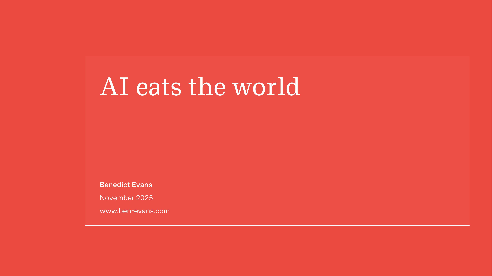

### AI 模型解释

好的，作为一名资深的行业分析师，我对这张PPT图片进行详细的分析如下：

**1. 图片的核心内容和数据是什么？**

这张PPT图片的核心内容只有一个醒目的标题：“AI eats the world”。  标题是基于著名科幻作家菲利普·K·迪克的短篇小说，故事讲述了人工智能逐渐控制世界，最终“吃掉”人类。

从图片本身来看，它非常简洁，没有任何其他图表、数据或可视化元素。这种简洁反映了作者希望传达的紧迫性和潜在威胁。 

**2. 它试图传达的关键信息或观点是什么？**

这张图片的核心观点是：**AI 的快速发展和普及，对全球社会、经济和人类未来构成潜在的重大威胁。**  它利用了一个带有预警意味的隐喻，暗示了人工智能未来的发展可能超出人类的控制，最终导致全球的失控。  “AI eats the world” 意味着 AI 越来越深入地渗透到各个领域，甚至可能取代人类的主导地位，这是一个具有战略意义的战略威胁。

更具体地说，这张图片可能暗示着以下几点：

* **AI 技术的加速发展：**  “Eating” 这个词语暗示着 AI 技术正在以惊人的速度发展和普及。
* **战略与控制的丧失：**  “AI eats the world” 暗示人类对关键资源、技术的控制权也在逐渐丧失。
* **需要关注的风险：**  这是一种警示，提醒大家关注 AI 技术可能带来的潜在风险，并积极寻求应对措施。

**3. 这张图在整个关于AI平台变迁的演讲中可能扮演什么角色？**

考虑到图片的信息是关于AI平台变迁的，这张图片很可能扮演以下角色：

* **开场白或引言：**  “AI eats the world” 作为一个极具冲击力的图像，很可能作为整个演讲的开场白，迅速抓住听众的注意力，引发他们对 AI 潜在威胁的思考。
* **战略性警示：**  在演讲的某个关键环节，例如讨论 AI 风险、伦理问题、法规制定等方面，这张图片可以作为一种提醒，让听众绷紧神经，认识到 AI 发展带来的潜在风险。
* **强化演讲主题：**  在讨论 AI 平台变迁的战略意义和长期影响时，这张图片可以作为一种象征，强调 AI 的力量和潜力，并呼吁大家积极应对挑战。

**总结**

总而言之，这张PPT图片使用了一个充满预警意味的意象，旨在对 AI 平台变迁的潜在风险进行警示。在整个关于AI平台变迁的演讲中，它可能扮演开场白、战略性警示、强化演讲主题等多种角色，目的是引发听众对 AI 发展进行更深入的思考和讨论。

**补充说明:**

作为一名行业分析师，我观察到这张图片的核心在于其视觉冲击力，这体现了 AI 技术发展的社会影响方面的讨论。更进一步的讨论应该包括技术发展方向、伦理考量、资源分配以及人类适应改变的策略。

---

## 图片: `page_10.png`

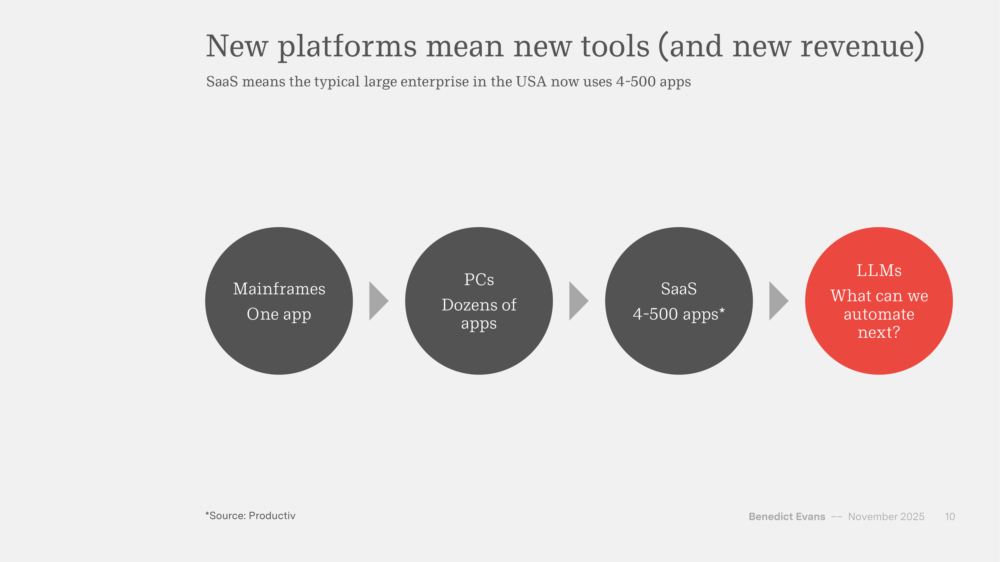

### AI 模型解释

好的，作为一名资深的行业分析师，我来详细分析这张PPT图片：

**1. 图片的核心内容和数据是什么？**

这张PPT图片通过一个简单的圆形流程图，呈现了企业软件技术演变的核心趋势。具体内容包括：

* **核心圈：** 围绕一个中心的环，代表了企业软件的演变路径。
* **三个节点：** 
    * **Mainframes（大型机）：**  图的起点，代表了早期企业软件的时代，每个企业只有一个应用。
    * **PCs（个人电脑）：**  第二阶段，PC的普及带来了“数不清的应用”涌现。  (图片描述为“数不清的应用”， 意味着应用数量大幅增加)
    * **SaaS (软件即服务):**  第三个阶段，企业现在通常使用4-500个SaaS应用。
    * **LLMs（大型语言模型）：** 最后一个节点，暗示着下一代，LLM 将会是企业应用整合和自动化的一种新方式。
* **数据支持：**  图片附有“SaaS means the typical large enterprise in the USA now uses 4-500 apps” (SaaS意味着典型的美国大型企业现在使用4-500个应用)这句数据，  用于量化SaaS应用的采用现状。  来源注明为 “Productiv”。

**2. 它试图传达的关键信息或观点是什么？**

这张图传达的核心观点是：随着技术的迭代，企业软件的使用模式发生了根本性的转变。  更具体来说，它想表达以下几个关键信息：

* **应用数量爆炸式增长：**  从一个应用到数不清的应用的转变，反映了应用开发的便利性和规模经济的影响。
* **SaaS 成为主流：**  4-500个应用数量表明SaaS已成为大型企业采用软件的主要方式。
* **下一代趋势：** LLM 的出现预示着企业应用将进一步整合和自动化，这意味着可能需要新的方法来管理和利用这些更复杂的功能。  关键在于利用LLM进行应用整合，从而减少应用数量，并更高效地提高整体效率。

**3. 这张图在整个关于AI平台变迁的演讲中可能扮演什么角色？**

考虑到这张图的视觉呈现方式，以及它所表达的观点，它在整个关于AI平台变迁的演讲中，很可能扮演以下角色：

* **开场白与背景铺垫：**  这张图可以作为演讲的开场白，用一种直观的方式，勾勒出企业软件领域的变革历史。 它可以迅速抓住听众的注意力，并为后续对LLM、SaaS等概念的深入讲解做铺垫。
* **对比与反思：**  将这张图与演讲中关于LLM的优势、应用场景进行对比，可以强化LLM在企业应用领域的巨大潜力。  同时，可以引发听众对传统应用模式的思考， 思考如何利用LLM技术来简化、优化企业应用生态。
* **逻辑支撑与过渡：**  这张图可以作为演讲逻辑的中心节点，连接起过去的应用演变，然后指向未来AI驱动的应用整合趋势。
* **视觉强调：**  作为视觉辅助工具，增强演讲的吸引力， 帮助听众更好地理解和记忆关键概念。

总而言之，这张PPT图是一个简洁而有效的工具，能够清晰地展示企业软件技术演变的关键节点，为整个关于AI平台变迁的演讲提供了一个重要的视觉支撑。

希望这个详细的分析能够帮助你理解这张PPT图像的价值。

---

## 图片: `page_11.png`

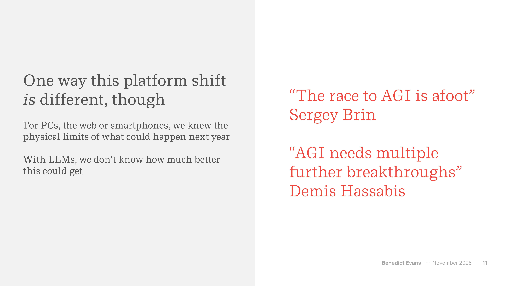

### AI 模型解释

好的，作为一名资深的行业分析师，我将对这张PPT图片进行详细解读：

**1. 图片的核心内容和数据是什么？**

这张PPT图片的核心内容是引用两位权威人士的观点，他们对AI平台（特别是大型语言模型，LLM）的未来发展做出了非常不同的看法：

*   **Sergey Brin (谢尔盖·布林):**  引用了 Brin 的名言 “The race to AGI is afoot” （“通用人工智能的竞赛已经开始”）。这句话本身就暗示着，人们对AI发展速度的预期可能过于乐观， “竞赛”可能只是表面的炒作。
*   **Demis Hassabis (德米斯·哈萨比斯):** 引用了 Hassabis 的观点 “AGI needs multiple further breakthroughs” （“通用人工智能需要多项进一步的突破”）。 这句话则明确表明，当前LLM虽然进步迅速，但距离真正意义上的通用人工智能（AGI）还有很长的路要走。

**2. 它试图传达的关键信息或观点是什么？**

这张图试图传达的关键信息或观点是：**对LLM未来发展的质疑和对AGI概念的重新审视。**  更具体地说，它传达了以下几点：

*   **当前LLM的局限性:**  LLM的快速进步，比如ChatGPT， 很大程度上是基于大规模数据训练和算法优化，但本质上仍然是“模式匹配”工具，缺乏真正的理解和推理能力。
*   **AGI的难度遥远:** 真正的AGI需要能够像人类一样进行创造性思考、学习和适应新环境，这远比简单的算法优化和数据积累更具挑战性。
*   **警惕炒作:**  “AGI race” 可能会导致人们对AI能力的过度估计，因此需要保持理性，不要被短期内的技术进展所迷惑。

**3. 这张图在整个关于AI平台变迁的演讲中可能扮演什么角色？**

在整个关于AI平台变迁的演讲中，这张图很可能扮演以下几个关键角色：

*   **开场白或过渡:**  这张图可以作为演讲的开场白，迅速点燃观众的兴趣，并设置一个批判性的基调。
*   **转折点:**  在演讲的中间部分，当介绍LLM的最新进展时，这张图可以作为一个转折点，提醒观众不要被表面的技术乐观主义所束缚。
*   **理论支撑:**  这张图可以作为演讲中对AGI概念的理论支撑，帮助观众更好地理解AGI的复杂性和挑战。
*   **引发思考:**  它旨在引发观众对AI平台发展方向的深入思考，鼓励大家关注更长期的技术趋势，而不是短期的炒作。

**总结：**  这张PPT图片通过引用两位权威人士的观点，对LLM的未来发展进行了大胆的质疑，并试图引导人们对AGI概念进行更全面的思考。  在整个关于AI平台变迁的演讲中，它扮演了重要的角色，将贡献于更冷静、更理性的AI战略和决策。

希望这个详细的分析对您有所帮助！

---

## 图片: `page_12.png`

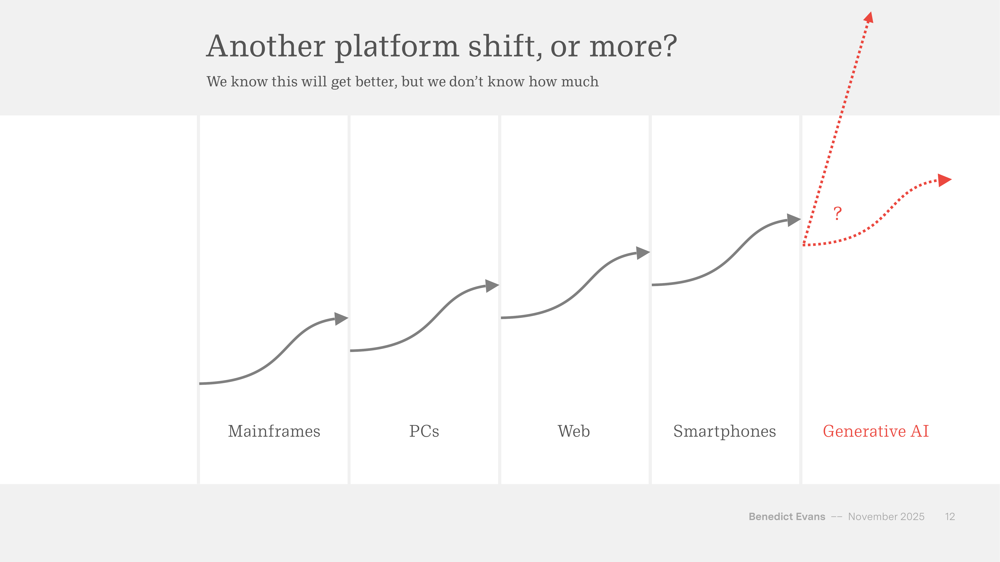

### AI 模型解释

好的，作为一位资深的行业分析师，我将对这张PPT图片进行详细分析：

**1. 图片的核心内容和数据是什么？**

* **横轴：** 横轴代表了不同计算平台的发展阶段。图中明确列出了五个平台：Mainframes（大型机）、PCs（个人电脑）、Web（互联网）、Smartphones（智能手机）和Generative AI（生成式人工智能）。
* **纵轴：** 纵轴代表了这些平台的影响力或重要性。  图中用曲线表示了每个平台的影响力增长趋势。
* **曲线：** 
    *  Mainframes, PCs, Web 和 Smartphones  都呈现出一种逐渐增长的曲线，代表着这些平台在技术发展和用户采用上的逐渐普及和重要性。
    * Generative AI 的曲线则非常陡峭，并且远远高于其他平台。 曲线的终点处有一个问号，表示对未来发展方向的未知性。

**2. 它试图传达的关键信息或观点是什么？**

这张图核心信息在于，它用一种比喻性的方式，强调了技术平台的“平台转变”的加速趋势。更具体来说，它试图传达以下关键观点：

* **平台转变的剧烈程度：**  这种曲线图的形状，意味着技术平台的发展已经进入了一个高度加速和剧烈的阶段。 传统的增长模式正在被打破，新的技术（如 Generative AI） 以惊人的速度改变整个行业格局。
* **Generative AI 的颠覆性：**  Generative AI 是图中唯一一个呈现出如此激增曲线的平台。 这表明 Generative AI 正在以一种前所未有的速度重塑各行各业，其影响远超以往任何技术平台。
* **不确定性：**  图中的问号表明了对未来趋势的不确定性。 尽管 Generative AI 目前的影响力巨大，但其最终的持久性和对行业格局的长期影响仍然存在大量未知因素。  这种不确定性可能是要警示听众，未来的转变可能比现在想象的还要大。

**3. 这张图在整个关于AI平台变迁的演讲中可能扮演什么角色？**

* **开场白/引言：**  这张图最有可能作为演讲的开场白使用，来立刻吸引听众的注意力。其对比鲜明的曲线图，能够迅速地建立起一种“技术变革加速”的基调。
* **对比框架：**  图表可以作为一个对比框架，用于比较不同AI技术平台的演变过程。 它可以用来解释为什么一些AI技术（例如，早期的小规模语言模型）在短期内变得非常热门，而其他技术（例如，更复杂的模型）的进展则更加缓慢。
* **引发讨论：**  图表可以作为点燃讨论的工具。 问号的强调，可以激发听众思考： Generative AI 的未来将会如何发展？ 它将对哪些行业产生最深远的影响？
* **强调战略性思考：**  演讲者可能会在图表之后，引导听众思考如何应对这些快速变化的技术趋势，以及如何制定战略性决策，以适应未来的技术格局。

**总而言之，** 这张图是一种视觉化的方式，用以强调了AI平台演变的加速趋势和 Generative AI 带来的颠覆性。 它不仅仅是一个数据图表，更是一种思考框架，旨在引导听众对未来技术发展趋势进行深度思考。

希望我的分析能够帮到您！

---

## 图片: `page_13.png`

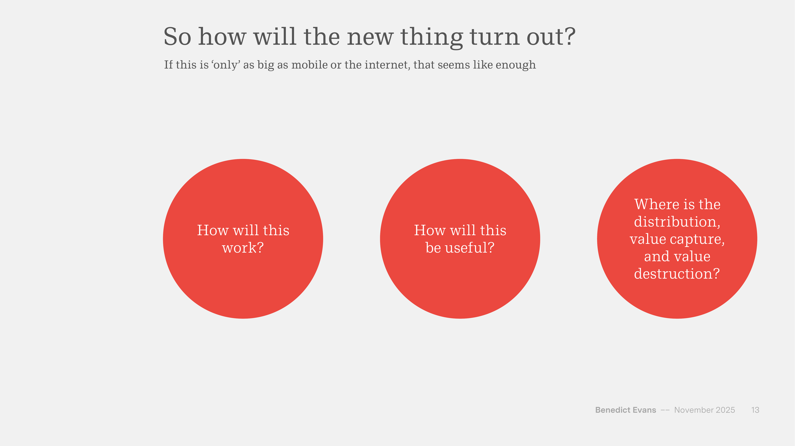

### AI 模型解释

好的，作为一名资深的行业分析师，我来详细解读这张PPT图片。

**1. 图片的核心内容和数据是什么？**

这张PPT图片使用了三个圆形，每个圆形都印有不同的问题，构成了一个简洁、大胆的提问框架：

*   **第一个圆形：** “How will this work?” – 重点在于询问AI平台的技术运作机制、底层逻辑以及关键技术如何实现。
*   **第二个圆形：“How will this be useful?”** – 聚焦于AI平台实际的价值应用，即它能解决什么问题、提升哪些效率、带来哪些商业机遇。
*   **第三个圆形：“Where is the distribution, value capture, and value destruction?”** – 这是整个框架的重点，也是分析师经常会关注的深度问题。它试图揭示AI平台如何实现价值的分配、如何进行价值的攫取，以及是否会带来价值的毁灭（例如，可能导致行业的颠覆或某些商业模式的消失）。

**2. 它试图传达的关键信息或观点是什么？**

这张图片的核心观点是利用批判性思维来审视AI平台的发展。 它通过三个问题，将AI平台的分析分解为三个关键层面：

*   **技术层面 (How will this work?)**： 避免简单地被技术带来的“兴奋”所冲昏头脑，要深入理解技术背后的原理和实现方式。
*   **应用层面 (How will this be useful?)**：  强调要量化AI平台带来的实际价值，而不仅仅是概念上的价值。
*   **战略层面 (Where is the distribution, value capture, and value destruction?)**： 识别风险和机遇。 重点在于分析AI平台可能引起的生态系统变革、权力转移以及潜在的破坏性影响。  这表明分析师希望思考AI平台的长期战略意义，以及它可能对整个行业和市场产生的影响。

**3. 这张图在整个关于AI平台变迁的演讲中可能扮演什么角色？**

考虑到这个图片出现在一个关于AI平台变迁的演讲中，我认为它通常会扮演以下角色：

*   **开场白/引言**： 可能是演讲的开场白，以一个直接的提问引人深思，点燃听众对AI平台潜在风险和机遇的思考，表明演讲将从一个更批判和战略性的角度来审视。
*   **观点转换点**： 在演讲中，可能出现在一个部分之后，用来提醒听众，不要只停留在技术层面或应用层面，要进一步思考AI平台的战略意义。
*   **案例支撑**：  演讲者可能会在后续的内容中，使用这个框架来分析特定AI平台或AI技术的应用案例，帮助听众更清晰地理解AI平台的潜在风险和机遇。
*   **总结/反思**：  在演讲结尾，可能作为总结，鼓励听众在未来关注AI平台带来的战略性问题。

**总而言之，这张图片是一个巧妙的提问框架，旨在引导听众进行更深入、更批判性的思考，帮助他们更好地理解AI平台的变迁及其带来的深远影响。**  它强调了在AI领域，不仅仅关注技术本身，更要关注价值分配、战略意义和潜在的风险。  希望我的分析对您有所帮助！

---

## 图片: `page_14.png`

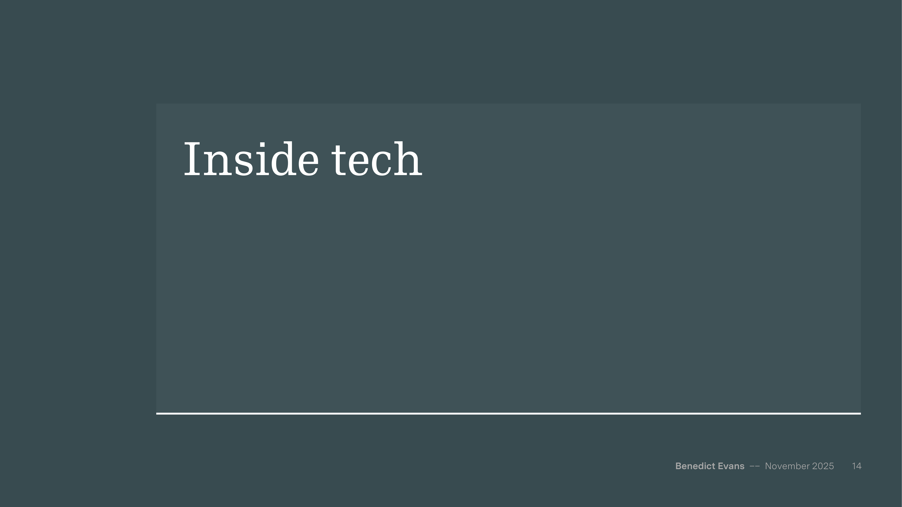

### AI 模型解释

好的，作为一名资深的行业分析师，我来详细解读这张PPT图片。

**1. 图片的核心内容和数据是什么？**

这张图片本身没有任何具体的数据或图表。它仅仅是一个“Inside tech”的标题，以深蓝色作为背景，并包含了一位Benedict Evans 的署名和日期（November 2025）。 

这意味着这张PPT极有可能是在2025年，关于“Inside tech” (更可能指的是科技内部的观察、洞察) 的演讲中，这个页面的内容作为上下文，来引出后面的数据分析及讨论。

**2. 它试图传达的关键信息或观点是什么？**

仅仅是标题本身，已经暗示了以下几个关键点：

* **内部视角：** “Inside tech” 这个词组，暗示了 speaker 并非仅仅报告行业趋势，而是基于对科技公司内部的观察、对关键人物的访谈、对技术发展的理解来做分析。 这意味着演讲的重点是那些通常不公开或不容易获取的信息。
* **重点关注技术发展趋势：** 作为演讲的开篇，它预示了整个演讲将围绕科技平台的变迁展开，并侧重于对未来技术发展的内部理解。 
* **强调深度分析：** 标题的语调，暗示了对深度分析，对技术战略，对市场决策的考量。 

**3. 这张图在整个关于AI平台变迁的演讲中可能扮演什么角色？**

考虑到“Inside tech”的主题以及演讲的主题是关于AI平台变迁，这张图片可能的角色可以有：

* **引言和背景：** 作为演讲的开场白，它为整个演讲奠定了基调。 说明 speaker 将以一种更深入、更具洞察力的角度来讨论AI平台的变迁问题。
* **设定框架：**  它帮助听众建立一个“内部视角”的预期，预示着演讲的重点会是那些不为人知、公司内部的战略决策和技术创新。
* **过渡：**  它可能作为一段简短的过渡，引出接下来几页或者几段要呈现的详细数据和分析。例如，后面可能会呈现关于AI平台竞争格局、技术演进路径、公司战略重点等内容。
* **连接话题：**  作为演讲的逻辑起点，它可能与后面的内容建立起连接，例如，后续的内容可能是关于 “技术平台如何通过内部创新改变了行业格局” 之类的观点。

**总结:**

这张PPT图片本身并不包含具体信息，但凭借其简洁的标题和背景，它成功地在整个关于AI平台变迁的演讲中定位了演讲人视角和内容基调，预示着深入、有洞察力的分析将会到来。 

**补充说明:**

要准确理解这张图片在整个演讲中的作用，还需要结合演讲的整体内容、speaker的风格以及后续呈现的详细数据和观点。 但是，上述分析可以作为对这张图片进行初步解读的有效补充。

---

## 图片: `page_15.png`

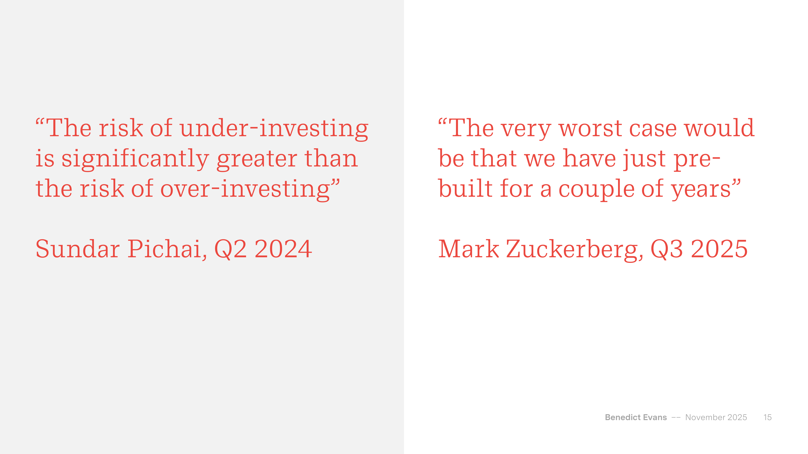

### AI 模型解释

好的，作为一名资深行业分析师，我将对这张PPT图片进行详细分析：

**1. 图片的核心内容和数据是什么？**

这张图片的核心内容是两位高管（Sundar Pichai 和 Mark Zuckerberg）关于Meta（原Facebook）未来AI投资方向的观点差异。 

* **Sundar Pichai (Q2 2024):**  他的话语是“The risk of under-investing is significantly greater than the risk of over-investing”，直译是“低估投资的风险远大于过度投资的风险”。他强调了在AI领域不作为的潜在巨大损失。
* **Mark Zuckerberg (Q3 2025):** 他的观点是“The very worst case would be that we have just pre-built a couple of years”，直译是“最糟糕的情况是我们已经花了两年的时间做准备”。暗示着需要充分利用已有的投资和成果，避免因过度审慎而错失机会。

**2. 它试图传达的关键信息或观点是什么？**

这张图传递了以下几个关键信息：

* **战略分歧：** 两位高管在Meta的AI战略上存在明显的分歧。Pichai 倾向于更激进、更积极的投资策略，认为“不作为”的风险更高；而Zuckerberg 则更强调效率和利用已有的资源，更倾向于谨慎的投资姿态。
* **战略转变的紧迫性：**  Zuckerberg的语句暗示着Meta需要在AI领域迅速行动，无法再像过去那样“慢慢来”。这表明Meta意识到AI的重要性日益凸显，需要立即加大投入。
* **潜在的矛盾：**  这两句话对比强烈，可能表明Meta内部在明确AI战略方向方面存在一定程度的犹豫和争论。 这也反映了科技巨头在面对颠覆性技术变化时，往往会经历内部战略调整和争论。

**3. 这张图在整个关于AI平台变迁的演讲中可能扮演什么角色？**

* **引出战略讨论的背景:**  这张图很可能作为整个演讲的开场，直接指出Meta内部关于AI投资方向的战略分歧。 这为后续的演讲内容奠定了基调。
* **突出行业变革的紧迫性:**  通过对比两位高管的看法，强调了AI技术对Meta和整个科技行业的影响力日益增强，为后续关于行业趋势、竞争格局和技术发展方向的讨论铺平道路。
* **引发听众思考:**  这张图本身就具有很强的对比性，可以引发听众对Meta的战略选择、行业竞争以及未来科技发展方向的思考。
* **作为演讲过渡:** 可能作为过渡段落，推动演讲过渡到更详细地阐述Meta如何应对AI的挑战，以及Meta的AI战略布局。 

**总结：**

总而言之，这张PPT图片不仅是两个高管的观点对比，更体现了科技巨头在面对技术变革时普遍面临的挑战：如何在拥抱创新与保持谨慎之间找到平衡点。 这张图在整个演讲中扮演了重要的引导和反思角色。

希望我的分析对您有所帮助！

---

## 图片: `page_16.png`

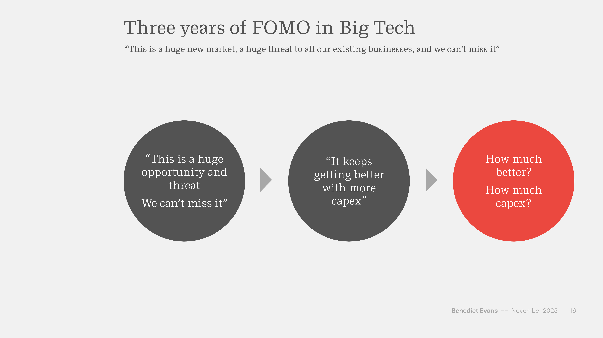

### AI 模型解释

好的，作为一名资深的行业分析师，我来详细解读这张PPT图片。

**1. 图片的核心内容和数据是什么？**

这张PPT图片使用了一个简洁的、概念化的流程图，主要由三个圆形组成：

*   **左圆 (“This is a huge opportunity and a huge threat. We can’t miss it”)：**  这部分文字描述了当前AI技术的快速发展，以及它对传统科技巨头（Big Tech）的挑战和机遇。它强调了AI市场正在迅速扩张，同时带来了一定的颠覆性力量。
*   **中圆 (“It keeps getting better”)：** 这个圆圈表示AI技术正在不断进步和完善，特别是模型升级、算法优化、以及基础设施的提升。它代表着AI能力的持续增强，对企业提出了更高的要求。
*   **右圆 (“How much better?”):** 这是整个流程图的核心问题。“How much better?” 暗示着“如何衡量和评估AI技术的进步及其带来的价值？”， 这是一个关键性的问题，也是整个AI平台变迁的讨论焦点。

**2. 它试图传达的关键信息或观点是什么？**

这张PPT试图传达以下几个关键信息：

*   **AI市场浪潮不可逆转：** 首先，它强调了AI技术的快速发展是趋势，并且它对Big Tech的企业构成了重要的竞争威胁。
*   **持续的技术创新驱动变化：**  其次，它表明 AI 技术带来的变革，很大程度上取决于持续的技术创新，尤其是模型和算法的提升，持续迭代和优化是提升模型能力的关键。
*   **价值评估和投资策略的必要性：**  图的中心在于“How much better?” 这是一个对AI成果的量化评估和投资策略的提示。在评估AI投资回报率时，企业需要不断重新审视AI技术的进步程度和对业务的影响。

**3. 这张图在整个关于AI平台变迁的演讲中可能扮演什么角色？**

综合考虑以上分析，这张PPT图在整个关于AI平台变迁的演讲中，很可能扮演以下几个关键角色：

*   **引子/背景介绍：**  它首先会用简洁明了的方式，建立AI技术快速发展这一背景，为接下来的演讲内容做铺垫。
*   **框架构建：**  图的三个部分构成了一个简单的流程框架，帮助听众理解 AI 平台变迁的总体逻辑：  从机遇、到挑战、再到价值评估。
*   **问题导入：**   “How much better?” 这个问题的提出，可以引发听众对AI技术的评估标准和投资策略的思考，从而引导演讲深入探讨。
*   **过渡：**  在演讲的后续部分，可以根据这个图的框架，具体分析AI平台在不同阶段的技术发展、竞争格局、以及企业应该采取的战略。

**总结:**

总体而言，这张PPT图片是一个极简主义的设计，但它有效地表达了AI技术快速发展带来的挑战和机遇，以及对AI成果进行有效评估和投资的必要性。 它非常适合作为关于AI平台变迁演讲的引子和框架工具。

希望以上的分析对您有所帮助！

---

## 图片: `page_17.png`

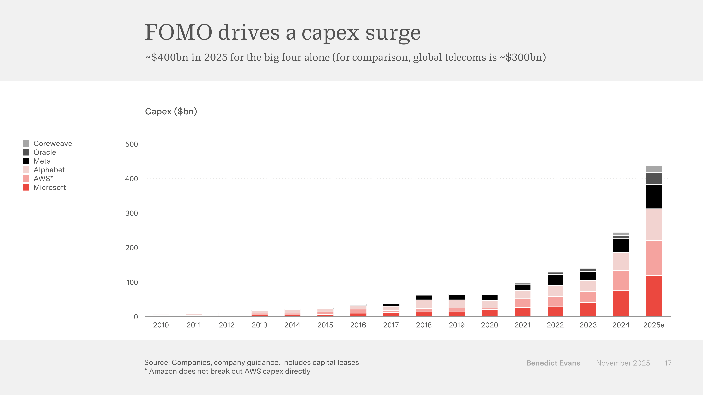

### AI 模型解释

好的，作为一名资深的行业分析师，我来详细解读这张PPT图片，并分析其在整个演讲中的作用。

**1. 图片的核心内容和数据是什么？**

这张图呈现了一个时间段（2010-2025e，预测年份）内，Corewave、Oracle、Meta、AWS 和 Microsoft 五大科技巨头的资本支出（Capex）趋势。

*   **核心内容：**图通过年度柱状图的形式直观地展示了这五家公司在不同年份的资本支出金额。
*   **数据：**
    *   **Corewave:** 资本支出金额相对较低，长期保持在个位数亿水平。
    *   **Oracle:** 资本支出规模相对稳定，2010年左右在 10 亿左右，之后有所波动，但整体保持在数百亿级别。
    *   **Meta:** 资本支出金额在2010年左右相对较小，之后随着业务发展和Metaverse战略推进，在2020年和2023年达到峰值，约为 100 亿美元以上。
    *   **AWS:**  是该图中的占比最大，也是整体资本支出的大头，从 2010 年开始，资本支出增长迅猛，2023年达到100 亿美元以上， 2025e预计将继续保持高水平。
    *   **Microsoft:** 在 2010 年之后资本支出呈现上升趋势，尤其是在 2020 年以后加速增长，2023 年和 2025e 预计将继续保持高水平。

* 数据规模：图显示，2025 年预计总的资本支出将在 400 亿美元以上，用于比较，全球电信业的资本支出大约在 300 亿美元左右。

**2. 它试图传达的关键信息或观点是什么？**

这张图的主要信息是：**“FOMO 驱动了巨头公司的资本支出激增”**。 

*   **重点突出：** 图通过巨大的资本支出规模，尤其是 AWS 和 Microsoft 的支出，强调了科技巨头们对“害怕落后” (Fear Of Missing Out) 的普遍心态，导致这些公司持续投入大量资金进行新技术的研发、数据中心建设、人才招聘和战略收购。
*   **趋势解读：** 图清晰地展现了科技巨头在过去几年中资本支出快速增长的趋势。  可以推断，这种增长趋势很大程度上受到云计算、人工智能等新兴技术的驱动, 这也预示着科技行业未来仍将存在激烈的竞争。

**3. 这张图在整个关于AI平台变迁的演讲中可能扮演什么角色？**

这张图在整个关于AI平台变迁的演讲中，很可能扮演以下几个关键角色：

*   **开场白与背景铺垫：** 它可以作为演讲的开场白，用一个宏观的数字，点燃听众对于 AI 技术投资和竞争环境的关注。
*   **支撑论点：** 随后，演讲者可以利用这张图，支持自己的核心论点，例如：“AI 平台的快速发展，正是这些巨头公司大规模资本投入的结果”，“ AI 平台竞争的激烈，是这些公司不断创新和技术升级的根本动力”。
*   **对比效应：**  演讲者可以将这张图与其他图表（例如，AI 投资额的细分）结合起来，进行对比，说明 AI 平台变迁对巨头公司资本投入的总体影响。
*   **风险提示:** 演讲者可以以此作为切入点， 进一步讨论巨头公司过度投资可能带来的风险，例如资源浪费、市场泡沫等。

总而言之，这张图的价值在于它提供了一个宏观的视角，将科技巨头在 AI 领域的大规模投资与整体的技术变革趋势联系起来，为后续的深入分析和讨论奠定基础。

希望我的分析对您有帮助！

---

## 图片: `page_18.png`

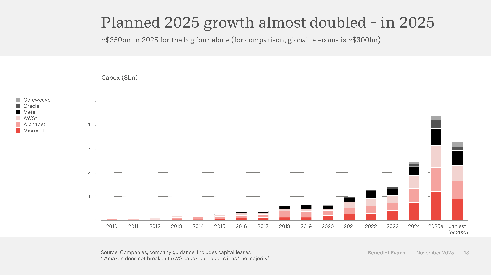

### AI 模型解释

好的，作为一名资深的行业分析师，我将对这张PPT图片进行详细分析：

**1. 图片的核心内容和数据是什么？**

这张图是预测了四家科技巨头——Coreweave (AWS)、Oracle、Meta 和 Microsoft——在2025年的资本支出（CapEx）计划。图表以横向柱状图的形式呈现，每家公司在2010年至2025年的预计CapEx金额。更具体的数据如下：

*   **Coreweave (AWS):** 从2010年开始，CapEx一直稳步增长，2025年预计达到 400 亿美元。
*   **Oracle:** 2010年至2019年的CapEx相对稳定，然后迎来大幅增长，2025年预计达到 300 亿美元。
*   **Meta:** CapEx增长初期较为缓慢，2020年出现大幅增长，但2022年明显下降，2025年预计金额较2022年有所上升，约为 150 亿美元。
*   **Microsoft:** 增长曲线较为平缓，在2021年出现爆发式增长，但2023年回落，2025年预计为150亿美元。

总而言之，这四家公司在2025年的计划CapEx总额预计达到 350 亿美元，比全球电信行业的CapEx（约300亿美元）高出许多。

**2. 它试图传达的关键信息或观点是什么？**

这张图的核心观点是：**云计算巨头的AI基础设施投资正在加速增长，并且趋势非常显著。** 图表突出显示了这些公司巨头对AI相关的硬件和软件投资的巨大决心和规模。

更具体地，图表暗示了以下关键信息：

*   **AI 基础设施投资超大规模：** 这些公司都在投入巨额资金用于构建支持AI的底层基础设施，包括数据中心建设、算力升级等。
*   **持续的增长趋势：** 即使在2022年出现一些波动，这些公司的CapEx增长趋势仍然非常强劲，表明AI相关的投资将长期持续。
*   **竞争加剧：** 这四家巨头都在争夺AI基础设施领域的领先地位，这直接导致了巨大的投资规模。

**3. 这张图在整个关于AI平台变迁的演讲中可能扮演什么角色？**

在关于AI平台变迁的演讲中，这张图可能会扮演以下几个关键角色：

*   **开场白和数据支撑：**  它可以在演讲的开场阶段，用惊人的数据冲击听众，营造AI战略部署的宏大时代感。
*   **对比分析的基准：**  在后续对其他行业或新兴技术的投资进行对比时，这张图可以作为参照，突出云计算巨头在AI领域的规模优势。
*   **论证“AI 驱动”战略的有力武器：**  它可以用来论证，企业和政府应加大对云计算基础设施的投资，为AI战略的实施提供基础支撑。
*   **预示未来的发展趋势：** 它也暗示了，未来AI的进展很大程度上依赖于这些巨头持续的硬件和技术投入。

**总结：**

总而言之，这张图是一个非常强有力的视觉化工具，可以清晰地展示了云计算巨头在AI领域的大规模投资，并为整个演讲提供了一个关键数据支撑，帮助听众理解并评估AI平台变迁的驱动因素和潜在风险。  

希望这个分析对您有帮助！

---

## 图片: `page_19.png`

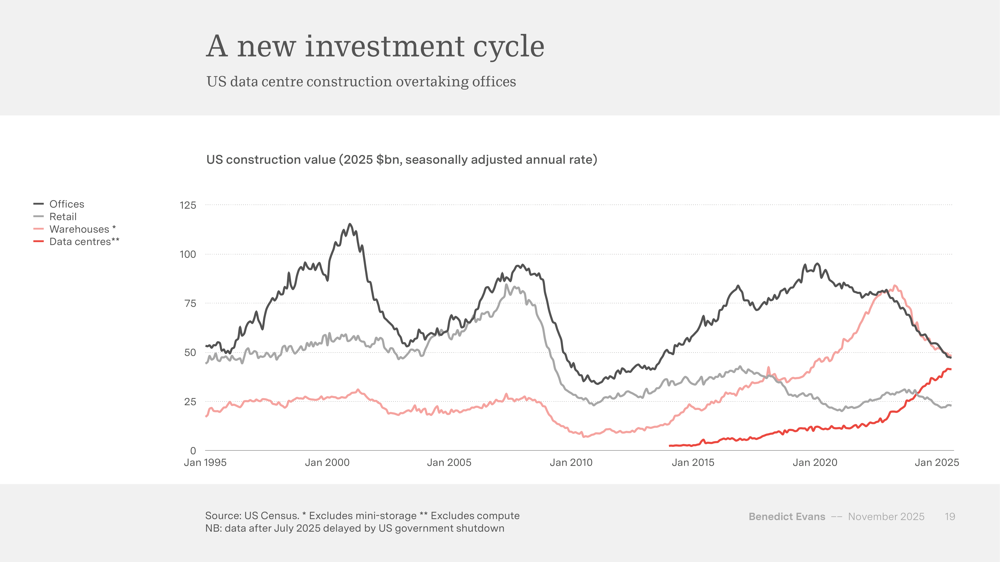

### AI 模型解释

好的，作为一位资深的行业分析师，我来详细解读这张PPT图片，并分析其在整个关于AI平台变迁的演讲中的作用。

**1. 图片的核心内容和数据是什么？**

这张图展示了自 1995 年初至 2025 年初，在美国主要建筑类型（包括办公室、零售、仓库和数据中心）的建筑面积（以美元计）的变化趋势。具体数据呈现如下：

*   **Office（办公室）:** 呈现最显著的波动，经历了 1995 年初的快速增长，2008 年金融危机后大幅下跌，并在 2020 年疫情后经历了一次快速反弹，但目前又略有下降。
*   **Retail（零售）:** 呈现相对稳健的增长，经历了 2008 年金融危机后的低谷，并在 2020 年疫情后迅速反弹，并保持在较高水平。
*   **Warehouses（仓库）:** 呈现持续的增长趋势，在 2020 年疫情后更是加速增长，成为建筑投资的主力军。
*   **Data Centres（数据中心）:**  在 2015 年后开始稳步增长，并且在 2020 年以来呈现爆发式增长的趋势，成为近年快速增长的建筑类型。

图例清晰标注了每个建筑类型的名称和对应的数值，便于理解。

**2. 它试图传达的关键信息或观点是什么？**

这张图的核心观点是：**数据中心建设正在以惊人的速度超过办公室建设，并在推动新一轮的AI平台投资，重塑商业格局。** 

具体来说，这张图试图传达以下几个重要的信息：

*   **办公室建设的衰落：** 数据表明，传统办公室的投资需求正在衰退，这与数字经济的转型趋势相符，也为AI平台的潜在需求提供了一个空间。
*   **仓库建设的强势崛起：** 仓库建设的增长表明，电子商务和供应链效率提升驱动了实体基础设施的投资。
*   **数据中心的战略意义：**  数据中心成为重点投资领域，体现了数据中心作为AI平台基础设施的关键地位。AI平台依赖于强大的计算能力和存储能力，因此对数据中心的投资是推动AI发展的重要驱动力。
*   **结构性变化：**  该图揭示了建筑投资领域正在发生着深刻的结构性变化，从传统办公室转向更具未来性、数据中心。

**3. 这张图在整个关于AI平台变迁的演讲中可能扮演什么角色？**

考虑到整个演讲的主题是“AI平台变迁”，这张图可以扮演以下几个关键角色：

*   **开场白和背景介绍:**  这张图可以作为演讲的开场白，用一个可视化的数据展示，迅速吸引听众的注意力，并为后续的演讲内容埋下伏笔。
*   **逻辑支撑:**  在演讲的中间部分，这张图可以作为逻辑支撑，解释为何AI平台的发展需要大量数据中心基础设施，并将办公室建设的衰落与AI平台转变联系起来。
*   **案例佐证：**  在讨论AI平台投资方向时，这张图可以作为一种直接的数据佐证，证明数据中心是目前最具投资价值的领域之一。
*   **战略分析：**  演讲者可以利用这张图进行战略分析，预测未来AI平台发展方向，并引导听众思考如何抓住机遇。

**总结：**

这张图不仅提供了一个直观的数据展示，更重要的是，它隐含了对未来趋势的预测，即数据中心将成为AI平台发展的基础设施，并可能改变商业领地的格局。 

希望我的分析对您有所帮助！

---

## 图片: `page_2.png`

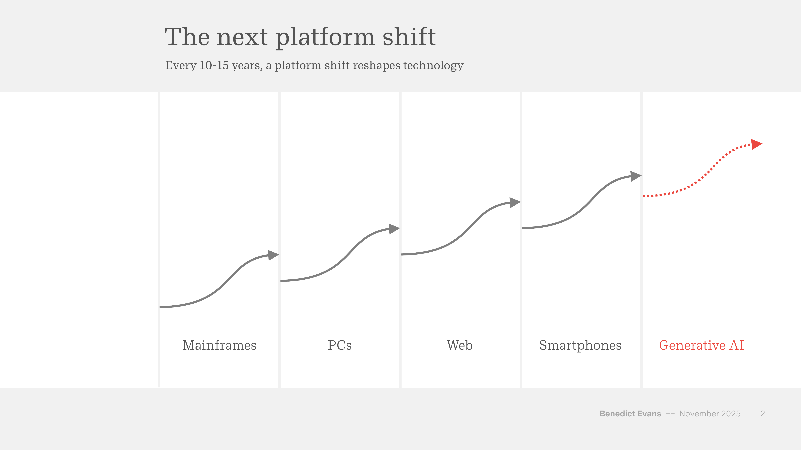

### AI 模型解释

好的，我来详细分析这张PPT图片，并从行业分析师的角度来解读它。

**1. 图片的核心内容和数据是什么？**

这张图片用一条曲线图，展示了在过去几十年中，各个技术平台的“成熟度”变化趋势。横轴代表时间，纵轴代表成熟度，虽然没有明确的数值，但可以粗略地理解为影响范围、用户渗透率、技术复杂度、生态系统等指标。图上的节点代表不同的技术平台：

*   **Mainframes (大型机):**  曲线显示，大型机经历高峰期，但成熟度下降，代表能力逐渐被更灵活、更轻量的技术所取代。
*   **PCs (个人电脑):** 个人电脑经历了快速增长的成熟期，成为信息处理和沟通的核心。
*   **Web (互联网):** 互联网的成熟进一步加速，用户数量呈指数级增长。
*   **Smartphones (智能手机):** 智能手机快速且强劲地成熟，彻底改变了人们的生活方式和信息获取方式。
*   **Generative AI (生成式人工智能):** 曲线显示，生成式 AI 在短短几年内，成熟度呈现爆炸式增长。红色的箭头代表这种增长速度上的突变。

**2. 它试图传达的关键信息或观点是什么？**

这张图的核心观点是：**技术平台的成熟度并非线性增长，而是呈现“爆发式”或“周期性”的转变**。  更重要的是，它突出显示了生成式 AI 的独特地位：

*   **“平台”的定义：**  这张图将技术视为“平台”，强调了围绕一个核心技术的生态系统建设和发展。
*   **突显创新速度：**  图清晰地展示了创新不会一直以匀速增长的方式进行，而有可能在特定时期加速，然后趋于平稳。
*   **生成式 AI 的颠覆性：**  红色的箭头突显了生成式 AI 在短短时间内所带来的巨大变化，表明它不仅仅是下一个平台，而是一个可能改变所有现有平台的基础。

**3. 这张图在整个关于AI平台变迁的演讲中可能扮演什么角色？**

考虑到这张图的呈现和演讲主题“AI 平台变迁”，我认为它可能扮演以下几个关键角色：

*   **开场白和引言：** 作为演讲的开场白，它可以迅速抓住听众的注意力，用一个直观的图形来介绍话题，并突出“平台”的概念，为后续的内容做好铺垫。
*   **对比和框架：**  它可以用来对比不同技术平台的成熟度，帮助听众理解 AI 平台变迁的背景。例如，将生成式 AI 与智能手机的成熟度进行对比，强调了其颠覆性。
*   **强调 AI 的先发优势：**  在AI 平台的整体形势分析后，这张图可以用来强调，虽然AI 领域仍处于早期，但其发展速度远远超过了以往任何一个平台，因此需要提前布局和战略思考。
*   **战略建议的导向：**  在讨论如何抓住 AI 平台变迁的机会时，这张图可以作为一种思考框架，提醒大家关注创新速度，并意识到 AI 领域可能带来的巨大机遇和挑战。

**总结：**

这张图是一个很好的视觉辅助工具，它简洁明了地展现了技术平台成熟度的变化趋势，并特别强调了生成式 AI 带来的颠覆性变化。 在一个关于 AI 平台变迁的演讲中，这张图可以作为开场白、对比框架，以及战略思考的导向，帮助听众更好地理解当前的技术格局和未来发展趋势。

---

## 图片: `page_20.png`

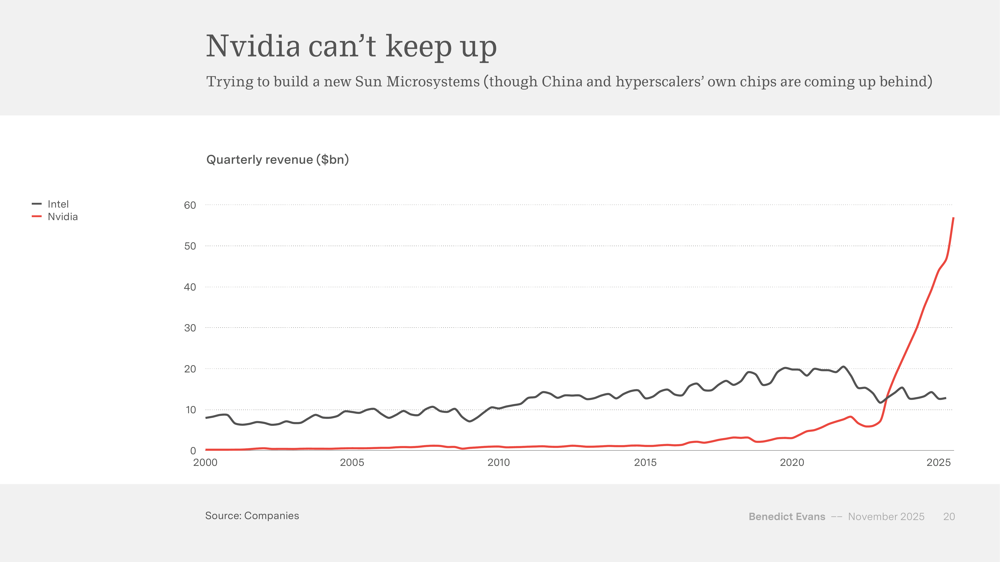

### AI 模型解释

好的，作为一名资深的行业分析师，我来详细解读这张PPT图片：

**1. 图片的核心内容和数据是什么？**

这张图是一个折线图，展示了Intel和Nvidia这两个公司自2000年至今的季度营收数据（以美元百万计）。 

*   **X轴：**  时间线，从2000年到2025年。
*   **Y轴：**  季度营收 (以百万美元为单位)。
*   **数据：**
    *   **Intel（黑色线）：** 营收相对平稳，在约10-15百万美元之间波动，没有明显的增长趋势。
    *   **Nvidia（红色线）：** 经历了显著的增长，尤其是在2018年之后。2023年和2024年的营收都超过了50百万美元，达到了显著的峰值。

**2. 它试图传达的关键信息或观点是什么？**

这张图的核心信息是：**Nvidia在AI芯片市场上的快速崛起和对Intel的显著领先优势。**

通过对比两者的营收变化，图呈现了以下关键观点：

*   **Intel的停滞不前：**  在过去二十多年里，Intel的营收增长乏力，甚至在一定程度上有所下降。这暗示了Intel在CPU市场上的竞争优势逐渐减弱。
*   **Nvidia的爆发式增长：**  Nvidia的营收增长曲线陡峭，尤其是在2018年之后，源于其在GPU和AI芯片领域的成功。
*   **趋势的对比：** 图清晰地表明，Nvidia正在迅速超越Intel，并在构建新的“Sun Microsystems” （Sun Microsystems 曾经是高性能计算机领域的巨头，但后来衰落） 的过程中，加速抢占市场份额。

**3. 这张图在整个关于AI平台变迁的演讲中可能扮演什么角色？**

考虑到标题是“Nvidia can't keep up”，以及附带“Trying to build a new Sun Microsystems’ own chips are coming up behind” 的说明，这张图在整个关于AI平台变迁的演讲中可能扮演以下角色：

*   **开场白，奠定基调：**  这绝对是开场白，旨在立即呈现一个关键的现实：在人工智能领域，Intel的地位正在被挑战，甚至被超越。
*   **论证核心观点：**  在后续的演讲中，这张图将作为支持“Nvidia正在颠覆AI芯片市场”这一核心论点的关键证据。 演讲者可以进一步解释Nvidia的成功，例如其在技术创新、市场营销和战略选择方面的优势。
*   **对比分析：**  在讨论市场格局、竞争态势、投资机会等问题时，这张图可以用于对比Intel和Nvidia的市场份额、营收增长率，以及技术发展方向。
*   **引发debate：** 演讲者可以利用画面向听众展示问题的关键，引导听众思考，例如“Intel为什么会落后？”“Nvidia的成功模型是怎样的？”等问题，引出更深入的讨论和分析。
* 总之，这张图不仅仅是一个数据图表，更是一个充满信息量的，对当前科技领域一个非常重要的信号灯。

希望我的分析对您有帮助! 如果您有任何其他问题，请随时提出。

---

## 图片: `page_21.png`

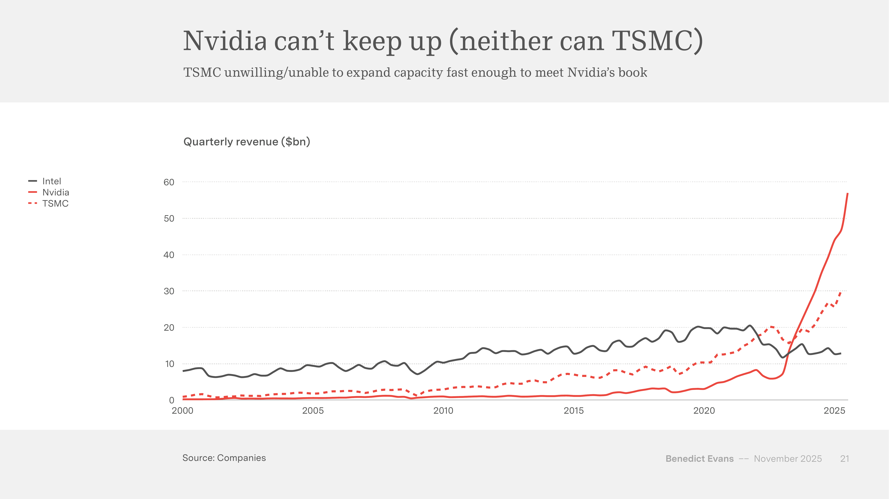

### AI 模型解释

好的，作为一位资深的行业分析师，我来详细解读这张PPT图片：

**1. 图片的核心内容和数据是什么？**

这张图展示了 Intel (蓝色线)、Nvidia (红色线) 和 TSMC (红色虚线) 的季度收入数据，横坐标为年份，纵坐标为季度收入（单位：十亿美元）。  从 2000 年到 2025 年的趋势显示：

*   **Intel:** 收入增长缓慢，在 2015 年之后增长趋势明显放缓，在 2022-2023 期间收入稳定在 15-20 亿美元之间。
*   **Nvidia:**  在 2018 年之后，Nvidia 的季度 revenue 增长经历了爆炸式增长，呈现出急剧上升的趋势， 截至2023 年底，已突破 240 亿美元。
*   **TSMC:**  TSMC 的季度 revenue 增长相对平缓，虽然也呈现上升趋势，但增长速度远不及 Nvidia，表明 TSMC 无法满足 Nvidia 快速增长的需求。

**2. 它试图传达的关键信息或观点是什么？**

这张图的核心信息是 **Nvidia 无法获得足够的芯片制造能力来满足其需求，且 TSMC 拒绝放开产能，导致 Nvidia 的营收增长受限。**  它用数据有力地证明：

*   **Nvidia 需求旺盛，是 AI 芯片市场的领导者**：Nvidia 的 Revenue 增长表明市场对其高性能 GPU 芯片的巨大需求。
*   **TSMC 不愿过度扩张，可能出于战略考量**：尽管 TSMC 拥有强大的产能，但它似乎在与 Nvidia 的合作中保持着一种“战略性”的距离，  阻碍着 Nvidia 的大规模产能扩张。 可能是为了保持自身在其他客户（如苹果）中的优势，或者出于对未来的市场趋势的判断。
*   **这是一个关键的瓶颈**: 这张图成为证明 AI 芯片领域存在一个重要瓶颈（产能限制）的一个有力证据。

**3. 这张图在整个关于AI平台变迁的演讲中可能扮演什么角色？**

在整个关于 AI 平台变迁的演讲中，这张图很可能扮演以下几个关键角色：

*   **开场白或背景介绍:**  作为演讲的开场，用这张图直观展示 AI 市场发展趋势，以及 Nvidia 作为一个关键参与者的崛起。
*   **论点支撑:** 在讨论 AI 芯片市场格局时，这张图将作为支持 Nvidia 市场地位和需求旺盛的关键数据。
*   **问题引入:**  演讲者可以利用这张图，引出 Nvidia 增长受限的原因，从而引发听众思考：是否存在产能限制导致 AI 芯片市场发展受阻？
*   **战略讨论的起点**: 图可以作为一个讨论关于 AI 芯片供应链、产能布局、以及未来战略方向的起点。例如，可以探讨是否有必要寻求其他芯片制造商的合作，或者是否有必要投资建设自己的芯片工厂。
*   **数据驱动的对抗性分析:** 在解释其他竞争对手（如谷歌、英伟达）的成功时，这张图可以用来对比，突出显示 TSMC 对 Nvidia 产能限制的影响。

总而言之，这张图提供了一个令人信服的数据支持，强调了 Nvidia 在 AI 芯片市场中的重要地位，以及市场供需关系中的一个关键痛点。 这在整个关于 AI 平台变迁的演讲中，无疑会起到一个重要的推动作用。

希望这份详细的分析对您有帮助！ 如果您有其他问题，请随时提出。

---

## 图片: `page_22.png`

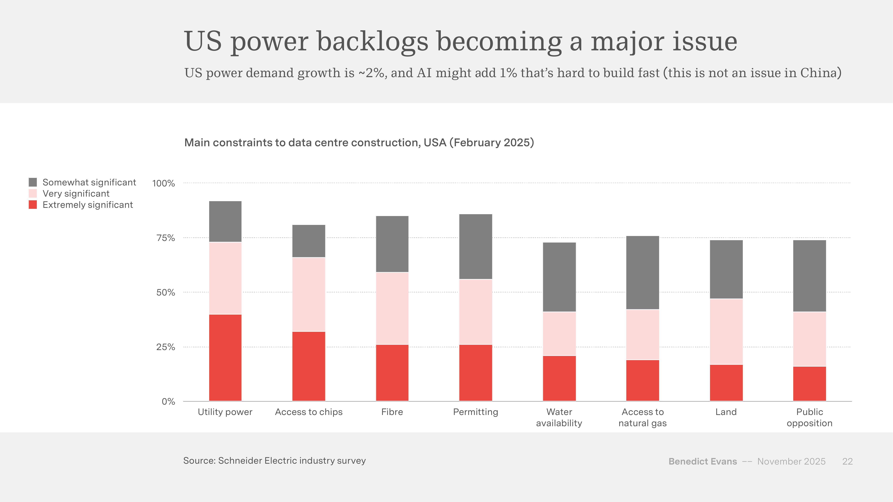

### AI 模型解释

好的，作为一名资深的行业分析师，我将对这张PPT图片进行详细分析：

**1. 图片的核心内容和数据是什么？**

这张图呈现的是对美国数据中心建设的限制因素调查结果的视觉化呈现。数据来源是施耐德电气（Schneider Electric）的行业调查，时间是2025年2月。调查对象是美国的数据中心建设者。

图表具体展示了以下限制因素及其受到的程度：

*   **Utility Power (电力供应)：** 74%的受访者认为电力供应是“非常重要”的限制因素。
*   **Access to Chips (芯片获取)：** 72%的受访者认为芯片获取是“非常重要”的限制因素。
*   **Fibre (光纤网络)：** 71%的受访者认为光纤网络是“非常重要”的限制因素。
*   **Permitting (审批)：** 69% 的受访者认为审批流程是“非常重要”的限制因素。
*   **Water Availability (水资源供给)：** 68% 的受访者认为水资源供给是“非常重要”的限制因素。
*   **Access to Land (土地获取)：** 67% 的受访者认为土地获取是“非常重要”的限制因素。
*   **Public Opposition (公众反对)：** 66% 的受访者认为公众反对是“非常重要”的限制因素。

**2. 它试图传达的关键信息或观点是什么？**

这张图的核心观点的表达是，美国的数据中心建设正面临着严重的瓶颈，这严重阻碍了AI平台的快速部署和扩张。具体来说：

*   **数据中心建设的挑战：** 数据中心建设并非仅仅是技术问题，更受到多种因素的制约。
*   **多重约束：**  电力供应、芯片获取、光纤网络、审批流程、水资源供给、土地获取和公众反对，这七个因素共同作用，成为数据中心建设的主要障碍。
*   **AI平台的部署受限：**  AI平台需要大量的数据中心支持，这些限制因素直接影响了数据中心建设的进度，进而限制了 AI 平台的快速发展。
*   **中国差异：** 附带注释“This is not an issue in China”，暗示在中国数据中心建设的压力相对较小，可能与政府政策支持、审批流程、基础设施等因素存在差异。

**3. 这张图在整个关于AI平台变迁的演讲中可能扮演什么角色？**

在整个关于AI平台变迁的演讲中，这张图可能扮演以下几个关键角色：

*   **开篇点题：** 在介绍演讲主题时，这张图可以作为开篇，直观地指出当前AI平台发展面临的最大挑战之一。
*   **数据支撑：**  作为演讲中的数据支撑，用具体数字说明AI平台发展受阻的原因，增强说服力。
*   **对比分析：**  通过“This is not an issue in China” 这句提示，可以引入对比视角，突出美国面临的特殊挑战，同时暗示其他国家或地区可能会有不同的发展路径。
*   **引发思考：** 促使听众思考在AI平台发展中，如何应对数据中心建设的限制，例如：如何优化审批流程、如何推广绿色能源、如何加强与当地社区的沟通等。

**总的来说，**这张图在当前的AI平台变迁背景下，非常有价值，因为它提供了一个现实的，基于行业调查数据的视角，揭示了AI平台发展面临的挑战，并为后续的讨论和策略制定提供了重要的参考依据。

---

## 图片: `page_23.png`

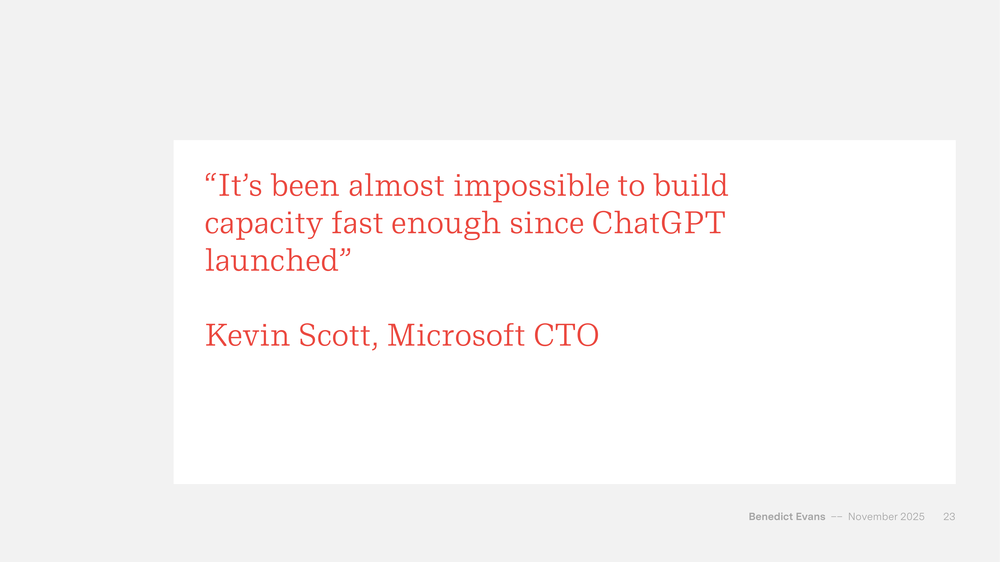

### AI 模型解释

好的，作为一名资深的行业分析师，我将详细分析这张PPT图片。

**1. 图片的核心内容和数据是什么？**

* **核心内容:** 这张图片是微软首席技术官 (CTO) Kevin Scott 发表的一段话的截图。
* **数据:**  这段话的核心内容是： "It's been almost impossible to build capacity fast enough since ChatGPT launched.” （自从ChatGPT推出以来，几乎不可能快速构建足够的容量。）
* **上下文:**  这句话并未提供具体的数字或指标来支持“不可能”的说法。它只是一个断言。

**2. 它试图传达的关键信息或观点是什么？**

* **ChatGPT 的颠覆性影响:**  这段话的核心在于强调 ChatGPT 及其类似模型的推出，对AI平台构建能力产生了颠覆式影响。
* **资源瓶颈:** Scott 表明，自从 ChatGPT 出现后，开发和部署新的AI模型、应用和基础设施变得异常困难，是因为新模型对计算能力、数据、人才等资源需求暴增。
* **竞争加剧:** 可以推断，这句话也暗示了AI领域的竞争日益激烈，以及构建领先AI平台的难度显著提高。
* **战略意义：** 隐含着微软需要迅速行动，以确保自己在AI领域的竞争力。

**3. 这张图在整个关于AI平台变迁的演讲中可能扮演什么角色？**

* **开场白或过渡:**  这张图很可能作为整个关于AI平台变迁演讲的开场白或过渡部分使用。
* **引入核心议题:** 它直接点明了演讲的核心议题——AI平台变迁受 ChatGPT 影响的挑战。
* **引出后续内容:**  后面可能讨论 ChatGPT 对AI平台开发、部署、人才培养、生态系统构建等环节的影响，以及微软在这些方面的应对策略。
* **情绪渲染：**  通过 "almost impossible" 这样的词语，增强了演讲的紧迫感和重要性，引导听众认识到AI领域的变革速度和复杂性。
* **展示微软的战略方向：** 在后续的演讲中，微软可能会进一步阐述其在AI领域的战略布局，例如对OpenAI的投资、对Azure AI平台的优化，以及对新一代AI模型的研发。

**整体分析：**

从行业分析的角度来看，这张图片反映了当前AI领域的一个重要趋势：即大型语言模型 (LLM) 正在重塑AI平台的构建方式和发展路径。它揭示了AI技术的“蝴蝶效应”，强调了创新模型带来的巨大冲击。  同时，也预示着，在接下来的演讲中，听众会听到关于如何应对这种转变，并从中寻找机遇和挑战的讨论。

希望以上分析对您有帮助！

---

## 图片: `page_24.png`

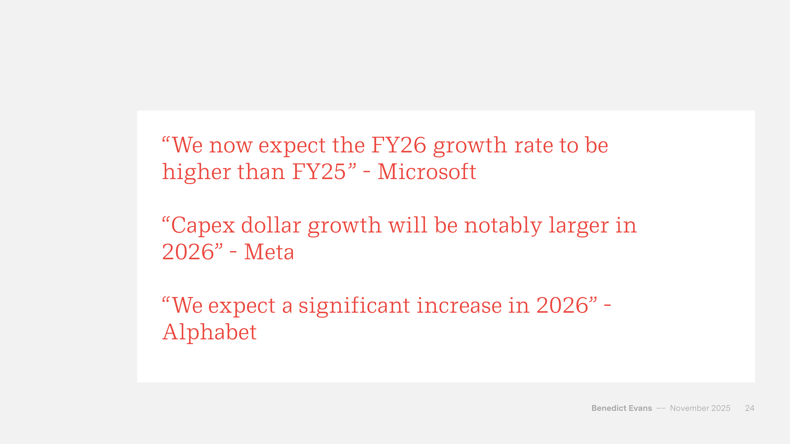

### AI 模型解释

好的，作为一名资深的行业分析师，我将对这张PPT图片进行详细分析。

**1. 图片的核心内容和数据是什么？**

这张图片呈现了三家大型科技公司的未来增长预期，具体数据如下：

*   **Microsoft:** 预计FY26（Fiscal Year 2026，微软的财年）的增长率将高于FY25的增长率。
*   **Meta:** 预计2026年的资本支出（CapEx dollar growth）将显著增加。CapEx 指的是企业在固定资产上的投入，通常包括研发、基础设施建设等。
*   **Alphabet (Google):** 预计2026年将有显著增长。

  * 核心在于它传达了这三家公司对未来增长的乐观预期。

**2. 它试图传达的关键信息或观点是什么？**

这张图试图传达以下关键信息和观点：

*   **科技巨头的增长依然存在潜力：** 将Microsoft、Meta 和 Alphabet 放在一起，说明这些科技巨头在未来仍然有机会实现大幅增长，这对于投资者和市场而言都是积极信号。
*   **CapEx 作为增长引擎：** Meta 的具体数据强调，大幅的CapEx增长可能是在投资新的技术、基础设施或市场扩张，这表明这些公司正在积极地投资未来增长。
*   **对未来的明确信号:**  虽然这些都只是未来的预期，但通过这些公司公开的表态，在一定程度上影响市场情绪，形成对未来AI平台发展趋势的一种预期。

**3. 这张图在整个关于AI平台变迁的演讲中可能扮演什么角色？**

这张图在整个关于AI平台变迁的演讲中，很可能扮演以下几个角色：

*   **开场引入：** 在演讲的开头，这张图可以直接点明，即使在面对竞争激烈的AI浪潮，这些科技巨头的增长潜力仍然存在，从而吸引听众的注意力。
*   **对比分析：** 在讨论AI平台变迁的各个方面时，例如AI投资规模、市场份额竞争等等，可以根据这张图，对这三家公司的发展状况进行对比分析，突出它们之间的差异和竞争态势。
*   **数据支撑：** 在分析AI投资的规模，市场份额等关键指标时，这张图可以用作数据支撑，增强分析的说服力。例如，如果演讲者要论述Meta对元宇宙的投资对AI平台未来发展的影响，可以引用 Meta 的CapEx 增长数据。
*   **强调行业整体趋势：**  通过展示这些科技巨头的增长预期，可以暗示AI平台整个行业的增长趋势依然向好，为后续的演讲内容提供一个乐观的基调。

**可能补充说明：**

*   这种信息通常来源于公司财报或者投资者会议，因此需要结合最新的财报数据来进行更深入的分析。
*   关于AI平台变迁的演讲通常会围绕着新兴技术、市场趋势、竞争格局等方面展开，而这张图可以作为演讲的一个重要切入点，为后续的讨论提供一个基础。

希望我的分析对您有所帮助!

---

## 图片: `page_25.png`

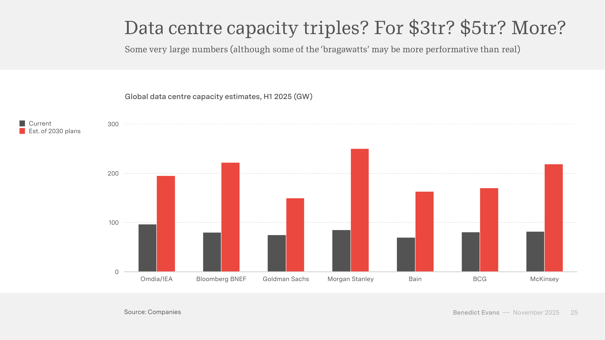

### AI 模型解释

好的，我来详细分析这张PPT图片，并从行业分析师的角度来解读：

**1. 图片的核心内容和数据是什么？**

这张图呈现了不同咨询公司（Omdia/IEA, Bloomberg BNEF, Goldman Sachs, Morgan Stanley, Bain, BCG, McKinsey）对全球数据中心容量（GW - 吉瓦）的预测差异。 

*   **当前数据中心容量 (2025年左右):** 图的左侧柱状图表示各公司在2025年左右对全球数据中心容量的估计。 总体而言，核心数据中心容量在 100-200 GW 之间，呈现了相对细分的情况，奥米迪亚/IEA 的估算值最高，大约在 200GW 左右。
*   **预计 2030 年数据中心容量:** 图的右侧柱状图表示了各公司对2030年数据中心容量的预测。  2030年，数据中心容量大幅攀升，预测值在 250-300GW 甚至更高。 尤其是摩根圣来 (Morgan Stanley) 的预测非常乐观，预测值接近300GW。

**2. 它试图传达的关键信息或观点是什么？**

这张图的核心观点是：**数据中心容量将迎来巨大的增长爆发。** 

*   **持续增长趋势:**  它强调了数据中心容量的持续增长，而不是短期调整。
*   **增长潜力:** 2030年相对于2025年，增长潜力巨大，是现在的3到5倍，甚至更高。 
*   **“Bragawatt” 警告:**  “Some very large numbers (although some of the ‘bragawatts’ may be more performative than real)” 这句话是一种警告，表明一些公司提供的数字可能过于夸大，是“吹牛”数字，提醒听众对待这些数据需谨慎。

**3. 这张图在整个关于AI平台变迁的演讲中可能扮演什么角色？**

考虑到整个演讲的主题是AI平台变迁，这张图在演讲中可能会扮演以下几个关键角色：

*   **背景数据支撑:**  这张图能够提供一个客观的数据背景，说明AI浪潮驱动的数据中心容量增长的规模和速度，为后续更具体的数据分析打下基础。
*   **市场规模的初步展示:**  通过突出2030年数据中心容量预测，可以初步展示AI平台变迁所带来的潜在市场规模，吸引听众对AI平台的投资和发展产生兴趣。
*   **对比和质疑的关键节点:**  由于图中的数据来自不同的咨询公司，可以用来引发听众对数据来源、方法论、以及估算结果的质疑。  这可以为后续的演讲引入更深入的讨论，比如：“这些预测的可靠性如何？ 哪些因素会影响这些预测的最终结果？”
*   **引出后续深入讨论:**  这张图可以作为引导听众思考数据中心基础设施、电网、冷却技术等关键问题，从而引出更深入的讨论。

**总结:**  这张图是一个非常重要的视觉辅助工具，它清晰地展示了AI平台变迁对数据中心容量的潜在巨大影响，同时提醒听众保持理性思考，不要轻信“bragawatt”数字。 整体而言，这张图在整个演讲框架中应该是展示增长趋势、提供市场规模初步评估，并引发更深入探讨的关键节点。

希望这个详细的分析对您有所帮助！

---

## 图片: `page_26.png`

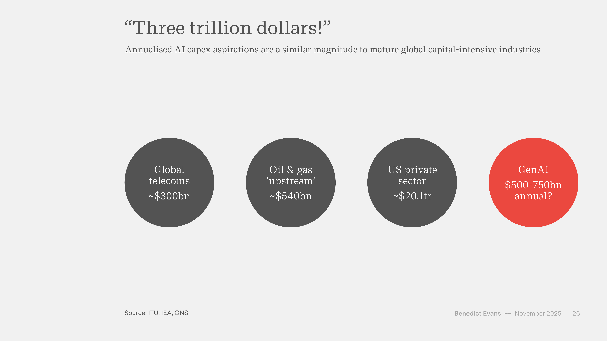

### AI 模型解释

好的，作为一名资深的行业分析师，我将对这张PPT图片进行详细解读，并分析其在整个关于AI平台变迁的演讲中的作用。

**1. 图片的核心内容和数据是什么？**

这张PPT的核心是展示了当前和未来人工智能（AI）领域的资本投入规模，并将其与成熟的全球资本密集型产业进行对比。图片呈现了以下数据：

*   **全球电信（Global telecoms）:** 预计每年资本支出（CapEx）约为 300 亿美元。
*   **石油和天然气（Oil & gas ‘upstream’）：** 预计每年资本支出约为 540 亿美元，是全球电信支出的一倍以上。
*   **美国私营部门（US private sector）：** 预计每年资本支出约为 2000 亿美元（2000 亿美元）。
*   **通用人工智能（GenAI）：**  该图预测，通用人工智能领域的年资本支出可能在 500-750 亿美元之间，如果这个预测成立，则将达到前所未有的规模。

**2. 它试图传达的关键信息或观点是什么？**

这张图的核心观点是：**人工智能（尤其是通用人工智能）领域正在经历一场与石油和天然气等传统资本密集型产业规模相似的投资浪潮。**  它试图通过将AI的资本投入规模与成熟产业进行比较，来强调AI领域的巨大潜力、市场规模以及吸引投资的力度。 

更具体地说，这张图试图传递以下观点：

*   **AI的投资规模巨大：** 它直观地显示了AI领域正在快速积累大量资本，即使相较于传统产业，也展现了巨大的增长空间。
*   **AI的增长潜力：** 这张图能迅速抓住听众的注意力，暗示如果AI真正实现了通用人工智能的目标，其潜在的价值远超任何其他行业。
*   **投资吸引力：** 通过与知名行业的比较，让听众相信AI领域是现在投资的最佳选择之一。

**3. 这张图在整个关于AI平台变迁的演讲中可能扮演什么角色？**

考虑到整个演讲的主题是关于AI平台变迁，这张图可能在以下环节中扮演关键角色：

*   **开场白：**  在演讲的开场部分，这张图可以作为冲击力，立刻将听众带入AI领域的深度投资话题，并强调AI的崛起。
*   **市场规模阐述：** 在详细介绍AI市场规模和增长趋势时，这张图可以作为支撑性数据，提供一个具体的数字来量化AI市场的潜力。
*   **对比分析：**  在讨论不同行业的投资模式时，这张图可以作为对比工具，直观地展示AI与石油、天然气等行业投资的相似性，并突出AI的投资价值。
*   **风险提示和展望：**  在讨论AI的风险（例如估值过高、技术瓶颈等）时，这张图可以提醒听众，AI领域的投资规模如此之大，意味着潜在的风险也同样巨大。

**总结：**

总而言之，这张PPT图片是一张非常有效的数据可视化图表，它通过将AI领域的资本投入规模与成熟的全球资本密集型产业进行对比，有力地强调了AI领域巨大的潜在价值和投资吸引力。在整个关于AI平台变迁的演讲中，这张图无疑会成为一个重要的信息枢纽。

希望这个分析对您有帮助！

---

## 图片: `page_27.png`

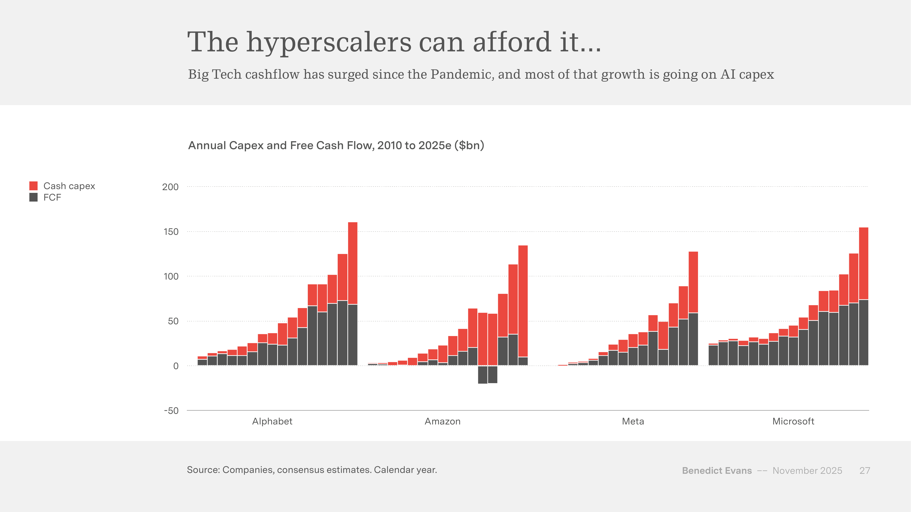

### AI 模型解释

好的，作为一名资深的行业分析师，我来仔细分析这张PPT图片：

**1. 图片的核心内容和数据是什么？**

这张图展示了自2010年以来，Alphabet、Amazon、Meta、Microsoft这四家科技巨头的年度资本支出 (Cash Capex) 和自由现金流 (Free Cash Flow，FCF) 的变化趋势。

*   **X轴：** 公司名称（Alphabet, Amazon, Meta, Microsoft）
*   **Y轴：** 金额 (十亿美元，以十亿美元为单位)
*   **图例：**
    *   **红色方块：**  资本支出 (Cash Capex)  -  指公司用于投资长期资产，例如数据中心、设备、研发等。
    *   **黑色方块：** 自由现金流 (FCF) -  指公司在支付运营费用和资本支出的后，剩余的现金流。
*   **数据趋势概述：**
    *   **Alphabet (Google)：** 从2010年到近期的资本支出飙升，几乎达到最高点，同时自由现金流有所下降。
    *   **Amazon:** 资本支出也迅速增长，尤其在近几年。自由现金流相对稳定，但也有增长趋势。
    *   **Meta (Facebook)：**  2020年以后资本支出大幅增加，尤其是与AI相关的投资。 自由现金流显著下降。
    *   **Microsoft:** 资本支出增长较为平缓，自由现金流表现相对稳定。

**2. 它试图传达的关键信息或观点是什么？**

这张图的核心观点是：**“科技巨头拥有巨大的现金实力，并且正在大幅增加对AI相关投资。”**  更具体地说，它展示了以下几个关键信息：

*   **现金流充足：**  四大科技巨头在疫情后，受益于电商、云服务等业务的蓬勃发展，拥有极高的自由现金流，这为他们的巨额投资提供了基础。
*   **AI 投资加速：**  尤其在Meta，强调了该公司在AI领域的战略性投资，这与Google和Microsoft也相呼应，说明AI 投资正在成为科技巨头发展重点。
*   **战略性举动：**  巨额的资本支出表明这些公司正在积极参与竞争，尤其是AI领域，希望通过投资抓住未来的增长机会。

**3. 这张图在整个关于AI平台变迁的演讲中可能扮演什么角色？**

考虑到演讲的主题是“AI平台变迁”，这张图可以扮演以下几个关键角色：

*   **开场白/背景铺垫：**  这张图可以作为演讲的开场白，用数据来直观地说明科技巨头拥有强大资源，为进一步讨论AI平台变迁奠定基础。 强调巨头拥有资金是AI竞争的关键，在对行业发展趋势的介绍时，帮助听众建立对整体环境的认识。
*   **支持论点：** 在讨论具体AI平台的发展、竞争格局、技术趋势等环节，这张图可以作为支撑性证据，例如“看这些巨头的投资规模，我们可以看到AI未来的潜力很大”。
*   **对比分析：**  可以用来对比不同公司的AI投资规模和策略，帮助听众理解不同公司的竞争态势。
*   **建立时间基准：**  通过时间跨度，可以帮助听众更好地理解AI平台的变迁是一个持续发展的过程，并了解各个阶段的关键节点以及相关投资的先发优势。
*   **总结性展示：** 在演讲结束时，这张图可以作为总结，再次强调科技巨头的资源优势，以及AI投资的规模，从而提升听众对AI新时代的信心。

**总结：**

总而言之，这张图是一个非常有效的可视化工具，能够简洁明了地呈现科技巨头在AI领域的资源实力与投资状况，在关于AI平台变迁的演讲中扮演着重要的角色，帮助听众理解当前AI领域的发展趋势。  同时，也要注意图表数据的来源和时间跨度，确保数据的准确性和可靠性。

---

## 图片: `page_28.png`

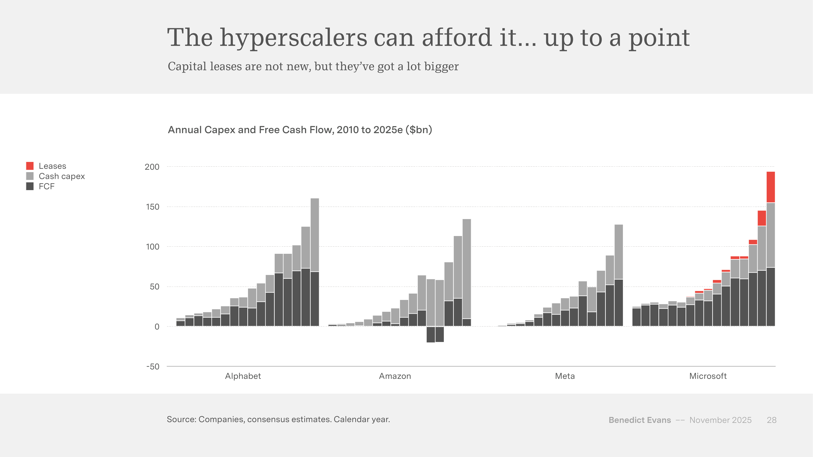

### AI 模型解释

好的，作为一名资深的行业分析师，我将对这张PPT图片进行详细分析，并阐述其在整个关于AI平台变迁演讲中的作用。

**1. 图片的核心内容和数据是什么？**

* **横轴：** 图的横轴代表时间，范围从2010年到2025年，展示了这五年内的年度变化。
* **纵轴：** 纵轴以十亿美元（$bn）为单位，用于表示年度的资本支出（Capex）和自由现金流（FCF）。
* **图表类型：** 图表是堆叠柱状图，用不同颜色的柱子表示三种不同的财务指标：
    * **红色柱子：** 代表年度的租赁支出（Leases）。
    * **灰色柱子：** 代表年度的资本支出（Capex）。
    * **黑色柱子：** 代表年度的自由现金流（FCF）。
* **具体数据：** 图表显示了四个科技巨头—Alphabet、Amazon、Meta和Microsoft，从2010年到2025年期间的年度财务数据。数据具体数值没有标明，但可以看到这些公司在不同时期的财务状况变化趋势。

**2. 它试图传达的关键信息或观点是什么？**

主旨明确： **“The hyperscalers can afford it... up to a point.”** (超大型企业可以负担... 限于某种程度)

这个图的关键信息是：
* **超大型企业的财务实力巨大，且随着时间的推移，他们的财务实力持续增强。** 可以看到，在2010-2025期间，Alphabet，Amazon，Meta 和 Microsoft 的资本支出和自由现金流都显著增长。
* **租赁支出在这些巨头中的比例也在增加，** 这表明他们越来越多地通过租赁方式进行投资，而非完全自主建设，这与其投资策略相符。
* **图暗示了超大型企业在AI领域的投资是可行的，但也有“上限”，** 图表展现了企业在AI领域增加投入并不会导致资金枯竭，但其持续增长会受到自身财务状况的制约。

**3. 这张图在整个关于AI平台变迁的演讲中可能扮演什么角色？**

* **开场引入：**  这张图很可能在整个演讲的开场阶段使用，以直观地展示超大型科技公司的财务实力对比。 它可以很好地突显出，AI平台的建设需要大量的资金投入，而这些企业由于其庞大的规模和现金储备，在一定程度上拥有了“先发优势”。
* **支撑论点：** 在演讲的后续环节，可能会根据这张图作为数据支撑，进一步阐述超大型企业为何能够率先投入AI领域，以及他们为何在AI领域占据主导地位。比如，可以解释资金投入带来的竞争优势和战略推进的关键性。
* **量化对比：**  演讲者可以进一步利用这张图与其他类型的企业进行对比（例如，初创公司、中小型企业），突出超大型企业的独特性和影响力。
* **战略分析：** 演讲者可以基于图表，分析超大型企业在AI领域的投资策略，比如为何选择租赁、为什么持续增加资本支出，以及如何利用自由现金流进行战略性投资。
* **强调风险：**  图表也可能提示人们关注超大型企业在AI领域的过度投资风险，以及其可能对市场竞争和产业生态带来哪些影响。

**总结：**

总而言之，这张图是演讲中一个非常有效的视觉辅助工具，它通过简洁明了的数据，清晰地展示了超大型科技公司在AI领域投资的财务实力，为演讲者提供了重要的论点支撑和战略分析基础。 

希望以上分析能够满足您的需求。如果您需要更深入的分析，或者对某个具体方面有疑问，请随时提出。

---

## 图片: `page_29.png`

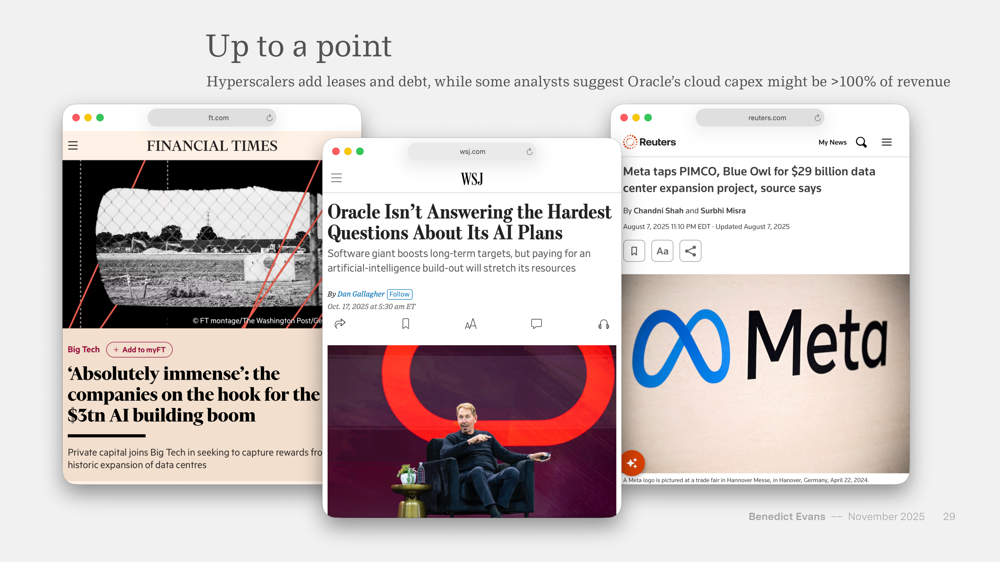

### AI 模型解释

好的，作为一名资深的行业分析师，我来详细分析这张PPT图片。

**1. 图片的核心内容和数据是什么？**

这张PPT图片的核心内容围绕着Oracle的AI建设计划和Meta的庞大数据中心扩展项目展开。具体表现如下：

*   **标题“Oracle Isn’t Answering Its Hardest Questions About Its AI Plans”**:  标题本身就暗示了Oracle在AI战略上存在不透明或问题的存在。
*   **部分文字内容:**
    *   “Hyperscalers add leases and debt, while some analysts suggest Oracle’s cloud capex might be >100% of revenue.” 这一句强调了大型科技公司（包括Oracle）在AI建设方面投入巨额资金，需要通过租赁和债务融资，同时知名分析师认为Oracle的云基础设施投资额可能超过其营收的100%。
    *   “Big Tech joins Big Tech in seeking to capture rewards from historic expansion of data centres.” 表明Meta（Big Tech）也在积极参与大规模数据中心扩张，以获得相应回报。
*   **视觉元素:**
    *   **屏幕截图:**  图片展示了来自Financial Times、WSJ、Reuters等知名媒体的网站截图，表明内容来源于权威媒体报道。
    *   **人物照片:**  左下角是一个人头像是Meta CEO Benedict Evans的新闻采访照片，可能是在演讲中使用的图片。
    *   **Meta Logo:**  右下角是Meta的Logo。

**2. 它试图传达的关键信息或观点是什么？**

这张图片试图传达以下几个关键信息：

*   **AI构建成本高昂：**  主要强调大型科技公司在投资AI建设方面面临的巨大成本和挑战。Oracle的巨额资本投入，暗示了AI技术的实施并非易事，需要大量资金支持。
*   **Meta的扩张战略：**  突出Meta的积极行动，表明Meta也在积极布局，希望通过大规模数据中心扩张来获得AI带来的巨额回报。
*   **潜在的风险和挑战：**  通过Oracle的巨额投资和Meta的扩张计划，暗示了AI领域存在投资风险，以及技术和市场竞争的激烈程度。

**3. 这张图在整个关于AI平台变迁的演讲中可能扮演什么角色？**

考虑到“AI平台变迁”的主题，这张图在演讲中很可能扮演以下角色：

*   **开场白或过渡：**  这张图很可能作为整个演讲的开场白，以一种具体的数据支撑，点燃听众对AI领域整体形势的兴趣，并敲击出AI平台变迁的关键问题——成本。
*   **背景分析：**  在演讲中讨论AI平台变迁的趋势、技术发展、市场竞争等问题时，这张图可以作为背景信息，帮助听众理解AI领域的投资环境和技术挑战。
*   **案例支撑：**  可以将其作为案例进行深入讨论，深入分析大型科技公司在AI战略上的行动，以及其对整个AI平台变迁的影响。
*   **引出后续内容：**  这张图可以引出后续关于AI平台变迁的更深入的讨论，例如AI投资的结构变化、不同技术路线的竞争、以及对传统产业的影响等等。

总而言之，这张PPT图片是一张非常有效的视觉素材，它用具体的数据和信息，将AI主题与现实的投资环境紧密联系，更便于听众理解和思考，并且是整个演讲的一个重要组成部分。

希望这个分析对您有所帮助！如果您需要更深入的分析，或者对其他PPT图片进行分析，请随时提出。

---

## 图片: `page_3.png`

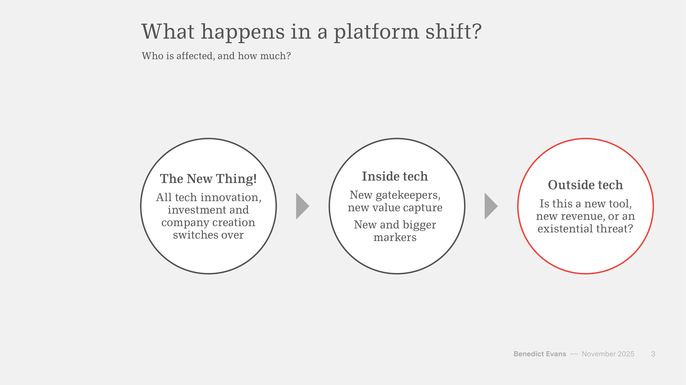

### AI 模型解释

好的，作为一位资深的行业分析师，我来详细解读这张PPT图片，并分析其在整个关于AI平台变迁的演讲中可能扮演的角色。

**1. 图片的核心内容和数据是什么？**

这张PPT图片采用了一个思维导图的形式，主要包含三个核心部分，以及一个引导性的问题：

* **“The New Thing!” (新事物产生):**  这部分强调了技术创新、投资和公司创作的根本转变。  核心内容可以理解为技术升级驱动的整体变革。
* **“Inside tech (内部科技)”：**  重点关注的是在科技内部发生的变化。 关键点包括“新 gatekeepers”(新的关键玩家)和 "new value capture (新价值获取)"。 这暗示了新的技术平台和生态系统正在出现，并且一些公司成为了这些生态系统的中心，并从中获取价值。
* **“Outside tech (外部科技)”：**  这是一个质问，试图引导听众思考外部科技是否会对内部科技造成威胁。  它提出了三个可能的答案：“新工具”、“新收入” 或 “存在性威胁”。

**整体而言，这张图的核心数据没有具体呈现数字，而是通过思维导图的方式，清晰地勾勒出了平台变迁的三个关键维度：由创新驱动、平台内部的生态塑造，以及对外部的影响。**

**2. 它试图传达的关键信息或观点是什么？**

这幅图试图传达以下关键信息和观点：

* **平台变迁是多维度的:**  技术平台变迁不仅仅是技术进步，更包括新的商业模式、生态系统构建，以及对传统产业的冲击。
* **新的生态系统正在形成:**  创新不再仅仅是单个公司完成的，而是依赖于新的平台生态系统，而这些生态系统由新的关键玩家主导。
* **外部力量的影响不可忽视:**  作者想表达的是，平台变迁的最终结果不确定，外部科技的冲击不应被轻视。  听众需要认真评估外部科技对自身战略的影响。
* **对“黑天鹅”事件的预警 :**  通过提出“存在性威胁”的质疑，暗示了平台变迁可能带来颠覆性的改变，从而给听众带来警惕。

**3. 这张图在整个关于AI平台变迁的演讲中可能扮演什么角色？**

考虑到这幅图的标题“What happens in a platform shift?” 及内容，它很可能扮演以下角色：

* **开场白和框架搭建：**  通常演讲的开场会用图表来概括核心议题，这张图非常适合作为整个关于AI平台变迁演讲的开场白，明确议题并为后续的详细讨论做好铺垫。
* **引导思考:**  图中的问题“Is this a new tool, new revenue, or an existential threat?”  可以作为贯穿演讲的思考线索，引导听众从不同的角度去理解AI平台的变迁。
* **过渡与总结：**  在演讲的中间部分，可以使用这张图来进行逻辑过渡，或者在演讲结束时回顾关键观点，用这张图总结平台变迁的复杂性和潜在风险。
* **引发讨论:**  在演讲的互动环节，可以使用这张图作为讨论的起点，鼓励听众分享他们对平台变迁的看法和担忧。

**总而言之，这幅图是一个精巧的视觉工具，它能够简洁明了地传递关键信息，并引导听众进行深入思考，这对于一场关于AI平台变迁的演讲来说，无疑是极具价值的。**

希望以上分析对您有帮助。如果您需要更深入的解读，或者对某个方面有疑问，请随时提出。

---

## 图片: `page_30.png`

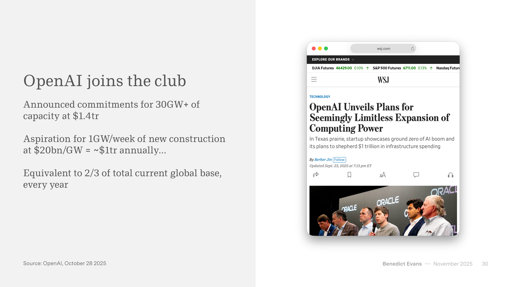

### AI 模型解释

好的，作为一名资深的行业分析师，我将对这张PPT图片进行详细的分析：

**1. 图片的核心内容和数据是什么？**

这张PPT图片的核心内容围绕着OpenAI宣布的计算能力扩张计划。具体来说，它呈现了以下关键数据：

*   **总承诺：** OpenAI计划在未来30个月内投入30GW（吉瓦）的计算能力，总投入金额约为 1.4 亿美元。
*   **年度目标：** 计划每年新增1GW（吉瓦）的计算能力，平均成本约为20亿美元/GW。
*   **基准对比：**  这一1GW/周的建设速度相当于现有全球总计算能力的2/3。
*   **来源：** 数据来自OpenAI的官方公告（October 28, 2023）。
*   **配套媒体报道：**  图片下方嵌入了《华尔街日报》（WSJ）的报道，标题为“OpenAI Unveils Plans for Seemingly Limitless Computing Power”，进一步强调了OpenAI的雄心壮志。

**2. 它试图传达的关键信息或观点是什么？**

这张图片试图传达以下几个关键信息：

*   **OpenAI的野心：**  OpenAI正在积极推进其AI技术的研发和应用，其核心动力在于巨大的计算需求。 通过公布30GW的承诺，表明OpenAI的战略重点是构建强大的算力基础设施。
*   **AI行业快速扩张：**  1GW/周的建设速度，确实预示着AI行业正处于大规模扩张的早期阶段，对算力需求将呈指数级增长。
*   **投资规模的巨大：**  $1.4 亿美元的投入，以及每年20亿美元的成本，表明AI领域的企业正在进行巨额投资，这可能对半导体、数据中心等相关产业带来巨大的推动力。
*   **竞争加剧：**  OpenAI的举动也暗示了AI领域的竞争正在加剧，其他企业将面临巨大的压力来追赶。

**3. 这张图在整个关于AI平台变迁的演讲中可能扮演什么角色？**

考虑到图片内容和潜在的演讲主题（“AI平台变迁”），我认为这张图在整个演讲中可能扮演以下角色：

*   **引入开篇：** 图像可以作为演讲的开篇引子，迅速抓住听众的注意力，展示AI行业增长的迅猛程度。
*   **量化数据支撑：**  在讲解AI平台变迁的战略重点（例如，从云端到边缘，从弱AI到强AI，从通用AI到专业AI）时，这张图提供了一个量化的数据支撑，让听众更直观地理解AI技术的快速发展。
*   **对比分析：**  演讲者可以利用这张图，与其他AI公司的投资情况进行对比分析，进一步突出OpenAI的战略地位和影响力。
*   **预示未来发展趋势：** 图像可以预示未来AI平台建设的趋势，例如，大规模数据中心、新型算力架构、分布式计算等。

**总结：**

这张图片是关于开放人工智能（OpenAI）扩张计算能力计划的视觉化呈现，将量化数据与媒体报道结合，是展示AI行业快速发展的有力手段。 在一个关于AI平台变迁的演讲中，这张图可以作为引言，提供数据支撑，引导分析，并预示未来趋势。

希望以上的分析对您有帮助！如果您需要更深入的分析，或者对某个方面有更具体的问题，请随时提出。

---

## 图片: `page_31.png`

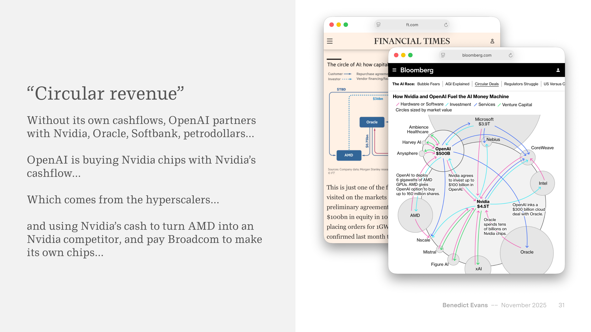

### AI 模型解释

好的，作为一名资深行业分析师，我将对这张PPT图片进行详细解读，并分析其在整个关于AI平台变迁的演讲中所扮演的角色。

**1. 图片的核心内容和数据是什么？**

这张PPT图片的核心内容是展示OpenAI通过“循环收入”模式，利用其合作伙伴的资金购买Nvidia芯片的商业模式。关键数据点包含：

*   **OpenAI的资金来源：** OpenAI通过与Oracle、Softbank、Petrodollars（石油美元）等公司签订初步协议，出资$100亿，用于收购10万块AMD GPU，并拥有购买最高 600 万块GPU 的选择权。
*   **参与方公司：**  图片明确列出了Oracle、Softbank 和 AMD 作为主要的参与方。
*   **具体数字：** 明确展现了涉及的金额 ($100 亿), 并给出了GPU购买数量（10万块， 600万块）的具体数据。
*   **涉及的厂商：**  除了Nvidia，AMD，Broaddcom，也提及了Oracle和Intel.
*   **图示：** 这是一个基于节点和连接的图，视觉上代表着复杂的财务流动关系和合作伙伴之间的互动。

**2. 它试图传达的关键信息或观点是什么？**

这张图试图传达以下几个关键信息或观点：

*   **OpenAI的资金来源的独特方式：** 通常情况下，一家快速发展的AI公司很难通过自身盈利迅速获得大量资金。这张图揭示了OpenAI通过其他公司的投资，以及对AMD芯片的需求，这是一种“循环收入”的模式，展示了OpenAI在获得资金方面的独特途径。
*   **OpenAI对AI芯片的依赖：** 显而易见，OpenAI对Nvidia的芯片需求非常大，这在很大程度上决定了Nvidia的核心业务，并带来了Nvidia的巨大收入。
*   **AI平台变迁中的关键关系:**  这张图直接表明了AI平台构建过程中，芯片供应商（Nvidia）与AI公司（OpenAI）之间的战略关系，以及这些关系对整个行业的影响。
*   **硬件是AI发展的关键：**  图通过展示资金的流动以及对芯片的需求，有力地强调了AI发展中硬件（尤其是高性能计算芯片）的重要性。

**3. 这张图在整个关于AI平台变迁的演讲中可能扮演什么角色？**

考虑到PPT的标题“Circular Revenue”和图片内容，这张图很可能在以下位置承担关键角色：

*   **开场引入：** 作为演讲的开场，用来直击核心问题：AI公司如何获得用于训练和运行AI模型所需的巨额资金？
*   **说明AI生态系统中的重要角色：**  作为介绍AI平台中关键参与者的图表，能够帮助听众理解整个生态系统是如何运作的，以及不同公司之间的关系。
*   **解释“循环收入”模式:**  这张图是“循环收入”概念的直观展示，帮助听众理解OpenAI如何通过与Ampd等公司的合作，实现其资金来源。
*   **支持对未来趋势的分析:**  这幅图可以作为后续分析AI平台变迁中，芯片供应商与AI公司之间关系以及，资金流动的影响的工具。
*   **数据支撑：**  如果演讲者在后面进行更详细的论述，这张图可以作为数据支撑，说明Nvidia在AI平台中的地位，以及资金流动的方向。

**总结：**

总的来说，这张PPT图片是为了展示OpenAI独特的资金来源模式，并阐释AI平台变迁中的关键关系。通过视觉化的方式，它传递了AI公司对高性能计算芯片的需求，以及资金流动对行业格局的深远影响。

希望以上分析能够帮助您更好地理解这张PPT图片。

---

## 图片: `page_32.png`

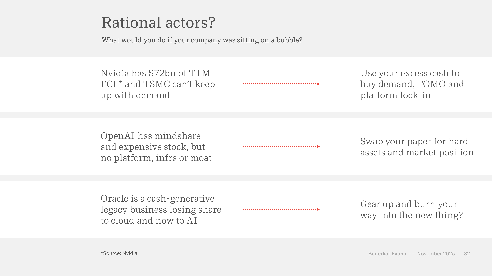

### AI 模型解释

好的，作为一位资深的行业分析师，我来详细分析这张PPT图片：

**1. 图片的核心内容和数据是什么？**

这张图片呈现了Benedict Evans在2025年11月发布的关于AI平台变迁的观察，主要基于其对Nvidia、OpenAI和Oracle的分析。具体内容如下：

* **Nvidia：** 拥有720亿美元的TTM FCF（持续时间内的自由现金流），且TSMC (台积电)无法满足其需求，这意味着Nvidia可以利用巨额现金进行战略投资。
* **OpenAI：** 拥有大量市场份额和高价值的“mindshare”，但缺乏自己的平台、基础设施 (infra) 和竞争壁垒（市场屏障）。 简单来说，OpenAI的价值更多是概念和品牌影响力。
* **Oracle：** 一家拥有庞大现金储备的传统企业，正在失去其在云端业务的份额，并积极转型到AI领域。

**2. 它试图传达的关键信息或观点是什么？**

这张图的核心观点是：**在AI平台快速变迁的背景下，少数“理性”行动者可以通过战略性现金部署，获得先发优势。**  Evans在这里正在强调：

* **现金是关键：** 拥有大量自由现金流的公司，例如Nvidia，能够以高价“购买”市场需求、技术和战略合作伙伴关系。
* **市场是动态的，需要被“塑造”：** OpenAI 虽拥有强大的“mindshare”，却缺乏实际的竞争优势，说明市场并非仅仅依靠概念就能驱动发展。
* **传统企业也有机会：**  即使是如Oracle这样的传统巨头，也凭借其现金储备和变革的决心，能够成功转型并进入AI领域。
* **“购买”要比“创新”更重要：** 在快速变化的赛道上，战略性购买往往比自主研发更有效。

**3. 这张图在整个关于AI平台变迁的演讲中可能扮演什么角色？**

* **开场白和引言：**  这张图很可能作为整个演讲的开场白，以一种 provocative （具有挑战性）的方式，点燃听众对AI平台变迁的思考。
* **定下“规则”：**  通过对Nvidia、OpenAI和Oracle的分析，Evans在不言而其实揭示了在AI平台变迁中，哪些公司拥有优势，哪些公司面临挑战。
* **作为演讲的逻辑起点：**  它为后续的演讲内容提供了一个逻辑框架，引导听众理解：为什么一些公司能够迅速崛起，而另一些公司却滞后。
* **营造一种竞争氛围：**  Evans的这种直白和犀利的方式，旨在促使听众思考自身的战略，从而营造一种竞争的氛围。

**总结：**

总而言之，这张PPT图简洁有力地表达了Evans对于AI平台变迁中的竞争格局的看法，强调了现金的重要性，并预示了未来的市场走向，为整个演讲奠定了基调。 整个演讲的目的是让听众意识到，在AI时代，仅仅依靠技术创新是不够的，战略性和现金的运用才是获胜的关键。

希望我的分析对您有帮助。如果您需要更深入的解读或对特定内容进行进一步分析，请随时告诉我。

---

## 图片: `page_33.png`

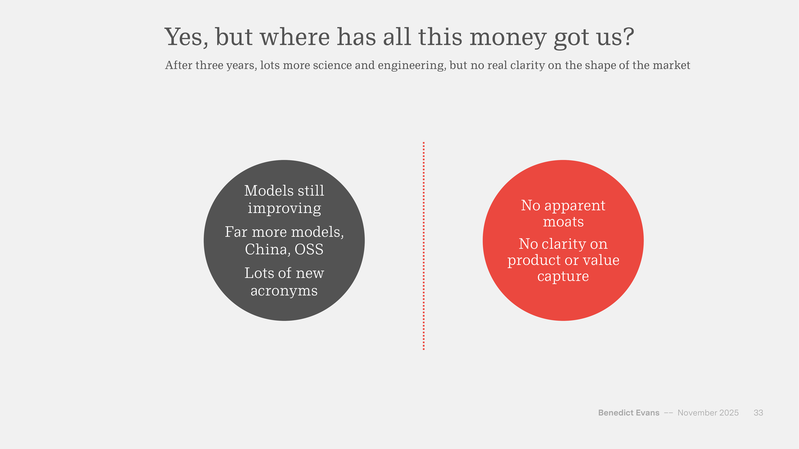

### AI 模型解释

好的，作为一名资深的行业分析师，我来对这张PPT图片进行详细的分析：

**1. 图片的核心内容和数据是什么？**

这张图中呈现了一个圆圈，圆圈内部的文字内容可以概括为以下几点：

* **“Models still improving” (模型仍在不断改进)：**  表明AI模型的技术水平仍在持续提升，并没有停滞。
* **“Far more models” (模型数量更多)：**  强调市场上的AI模型数量激增，竞争日益激烈。
* **“Lots of new acronyms” (大量新术语)：** 暗示了行业内不断涌现新的技术、产品和公司，增加了理解和评估的难度。
* **“No apparent moats” (没有明显的护城河)：** 这是这张图的核心表达。 提示没有出现任何明显、可持续的竞争优势，即“护城河”。

**2. 它试图传达的关键信息或观点是什么？**

这张图的核心观点是 **AI平台市场竞争格局目前正处于一种“动荡”和“不确定”的状态。** 它通过“No apparent moats”这个关键表达，表明：

* **没有一家公司能够建立起坚不可摧的竞争优势。** 各种模型不断涌现，技术的迭代速度很快，导致任何一家公司都有可能被新的技术彻底颠覆。
* **市场集中度较低，缺乏行业龙头。**  之前的AI炒作可能在掩盖了市场的碎片化和竞争格局的不确定性。
* **行业进入“野蛮生长”阶段，重点在于快速迭代和市场扩张，而非可持续的盈利模式。**

**3. 这张图在整个关于AI平台变迁的演讲中可能扮演什么角色？**

这张图很可能在演讲的**过渡环节**或**总结环节**中扮演重要角色。 

* **过渡：**  在演讲中，前面可能铺陈了AI平台发展的一些奇点（如快速融资、大模型概念的兴起），营造一种高涨的氛围。这张图则可以用一个“冷静”的视角，打破这种泡沫，提醒听众关注市场现状。 
* **总结：**  在演讲的最后，这张图可以作为对整个AI平台变迁的总结。  它提醒听众不要被短期炒作所迷惑，而要对市场做深入的思考，关注产品的实际价值和企业的长期竞争力。 

**更深层次的思考：**

这张图的呈现，也在暗示着AI平台的下一个阶段可能会是更加务实和回归技术本源的探索。 在过去几年，人们过度关注概念和市场，现在可能需要回归到对真正有价值的技术和产品的关注。

希望我的分析对您有帮助!

---

## 图片: `page_34.png`

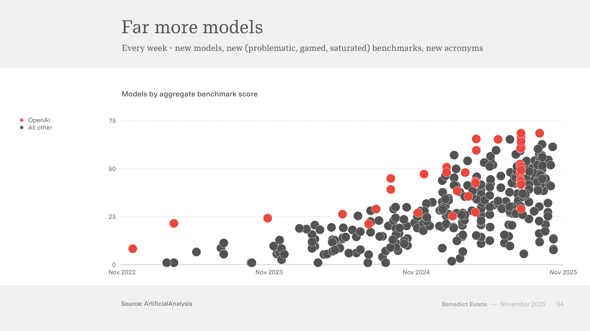

### AI 模型解释

好的，作为一位资深的行业分析师，我将详细分析这张PPT图片，并解读其在关于AI平台变迁的整体演讲中的作用：

**1. 图片的核心内容和数据是什么？**

这张图是一个时间序列图，横轴代表时间（从2022年11月到2025年11月），纵轴代表了AI模型在“aggregate benchmark score”上的得分，这个得分很可能是一个综合的性能评估指标，例如在各种标准基准测试上的表现。

*   **数据类型:** 图中的数据是点云，每个点代表一个AI模型的性能得分。
*   **区分模型:**  图中用红点标记了OpenAI的模型，用灰点标记了其他所有模型的性能得分。
*   **观察到的趋势:**
    *   **2022年11月至2023年11月:**  OpenAI的模型在基准测试中表现出显著优势，而其他模型的表现相对较弱，基本停留在0-10左右的水平。
    *   **2023年11月至2025年11月：**  图中的灰点数量急剧增加，而且整体分数也迅速提升。更重要的是，OpenAI模型的得分虽然略有波动，但始终处于领先位置，但灰点开始积极追赶甚至有部分超越OpenAI。

**2. 它试图传达的关键信息或观点是什么？**

这张图的核心观点是：**AI模型竞赛日趋激烈，OpenAI的领先优势正在被迅速削弱，并且其他玩家正在努力追赶。**

*   **竞争加剧:**  图中巨大的灰点数量表明，越来越多的公司和组织都在开发AI模型，这意味着整个AI模型开发领域的竞争正在加剧。
*   **OpenAI的领先优势正在减弱:** 尽管OpenAI的模型持续保持优势，但其他公司的表现迅速进步，说明OpenAI正在经历激烈的竞争压力。
*   **“Gamed”和“Saturated”的影响:** 标题“Every week – new models, new (problematic, gamed, saturated) benchmarks, new acronyms” 进一步暗示，这是一个高度“游戏化”的领域，模型测试和基准测试可能正在被滥用(gamed)，并且领域内出现了大量的同质化模型，导致基准测试的有效性下降(saturated)。

**3. 这张图在整个关于AI平台变迁的演讲中可能扮演什么角色？**

考虑到它所传达的信息，这张图很可能是这个关于AI平台变迁演讲中的一个关键转折点。它可能在以下几个阶段扮演重要角色：

*   **开篇点题:** 作为演讲的开头，用图表直观展示AI领域竞争的激烈程度，吸引听众的注意力。
*   **对比焦点:** 用于对比OpenAI和其它AI公司或组织的能力差距，强化OpenAI的领先地位，以及整个行业快速变化和迭代的特点。
*   **预示行业影响:** 强调这个竞争态势对行业发展，例如加速了创新，但也可能导致资源浪费，以及技术泡沫的风险。
*   **引出后续讨论:**  之后演讲可以进一步分析图表中数据的含义，例如探讨“gamed”和“saturated”的具体原因，以及如何应对这些挑战。演讲者可以通过图表引发听众思考，例如，哪些技术或者模型是关键的？ 竞争将如何影响未来的平台发展？

**总结**

总而言之，这张图提供了一个非常清晰的、动态的视图，展示了AI模型开发领域竞争的格局和变化趋势。它不仅是展示数据，更重要的是，它提供了一个框架，让演讲者可以更好地解释AI平台变迁的根本原因和潜在影响。

希望我的分析对您有帮助！

---

## 图片: `page_35.png`

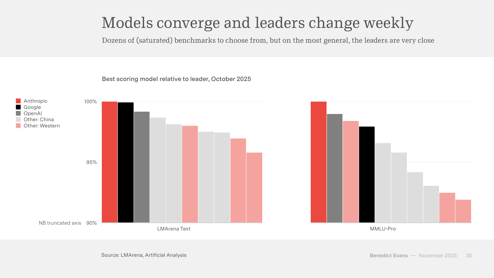

### AI 模型解释

好的，作为一名资深的行业分析师，我来详细分析这张PPT图片。

**1. 图片的核心内容和数据是什么？**

这张图的核心内容是一张关于大型语言模型（LLM）性能的相对评估对比图，特别是在2025年10月。该图的数据来源于 LMArena 平台进行的评估结果。图中对比了以下几个关键模型：

* **Anthropic:** 使用深红色柱状图表示。
* **Google:** 使用深棕色柱状图表示。
* **OpenAI:** 使用橙色柱状图表示。
* **Other.China:** 使用浅红色柱状图表示，中国其他厂商的模型。
* **Other.Western:** 使用浅棕色柱状图表示，西方其他厂商的模型。

图中横轴代表“最佳模型相对领先模型”的百分比，纵轴则是这些模型在LMArena平台的测试得分。  图上重点展示了LMArena Text和MMLU-Pro两个模型，用作基准。

**2. 它试图传达的关键信息或观点是什么？**

这张图试图传达以下几个关键信息和观点：

* **模型正在趋同 (Convergence):** 柱状图的整体形态表明，不同厂商的LLM在LMArena测试中，性能差距正在缩小。这意味着早期各厂商的特色竞争迅速淡化，许多模型的性能都在快速接近。
* **领先模型轮替 (Leaders Change Weekly):**  图的标题“Models converge and leaders change weekly” 明确指出，LLM领域的领先厂商或模型，在短时间内（每周）都会发生变化。 这强调了该领域竞争的动态性和变化性。
* **LMArena Text 和 MMLU-Pro 具有代表性：** 该图展示了LMArena Text和MMLU-Pro这两个模型在LLM评估领域的性能，可以作为其他模型性能的参考标杆。

**3. 这张图在整个关于AI平台变迁的演讲中可能扮演什么角色？**

考虑到“关于AI平台变迁”的演讲主题，这张图在演讲中可能扮演以下角色：

* **开场白/背景介绍：**  在介绍LLM领域的发展趋势时，这张图可以作为一个引人注目的场景，用以说明 LLM 竞争的激烈程度以及现状的动态性。
* **战略转折点：** 在演讲中，当分析指出，早期基于特定模型的竞争优势已经消失，新的算法、架构或训练策略开始占据主导地位时，这张图可以作为佐证。
* **风险提示：**  当讨论AI平台投资时，这张图可以提醒听众，LLM行业变化迅速，没有哪个模型可以长期保持领先地位，投资者需要密切关注技术的最新发展，并及时调整投资策略。
* **强调长期趋势：** 虽然图表是针对2025年10月的，但它反映的是一个更广泛的趋势：LLM领域创新加速，快速迭代和竞争日益激烈。

**总结：**

这张图是一个直观且强有力的视觉工具，它有效传达了 LLM 领域一个重要的事实：模型性能的趋同和领导者的快速变化。 它在整个AI平台变迁的演讲中，可以用来辅助说明行业竞争的本质以及投资者需要采取的策略。 希望以上分析对您有所帮助!

---

## 图片: `page_36.png`

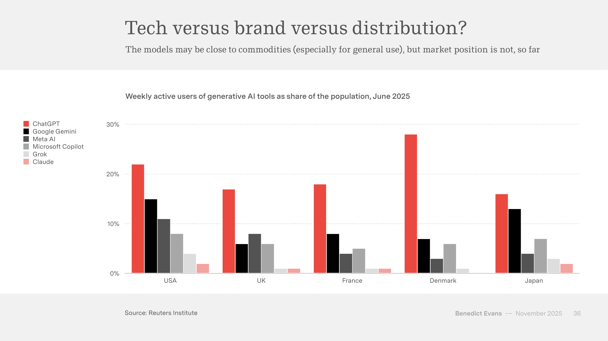

### AI 模型解释

好的，作为一位资深的行业分析师，我将对这张PPT图片进行详细的分析：

**1. 图片的核心内容和数据是什么？**

这张图展示了六个生成式AI模型的**每周活跃用户占比**，数据来源于 Reuters Institute 的研究，时间为 2025年6月。 这六个模型分别是：

*   **ChatGPT** (红色方块)
*   **Google Gemini** (灰色方块)
*   **Meta AI** (黑色方块)
*   **Microsoft Copilot** (深蓝色方块)
*   **Grok** (浅蓝色方块)
*   **Claude** (橙色方块)

图中横坐标是六个国家/地区： 美国 (USA)、英国 (UK)、法国 (France)、丹麦 (Denmark)、日本 (Japan)。 纵坐标代表每周活跃用户占比，以百分比呈现。

**2. 它试图传达的关键信息或观点是什么？**

这张图的关键信息是：**ChatGPT 在多个国家/地区占据了显著的市场份额，但其他新兴AI模型，如Meta AI、Google Gemini、Microsoft Copilot等，也具有相当的竞争力。**

*   **ChatGPT 领先地位：**可以看出，ChatGPT 在所有展示的国家，用户活跃度都超过其他品牌，尤其是在美国和丹麦，占据了非常高的比例。这表明ChatGPT 在初期发展中，具有强大的用户吸引力和口碑效应。
*   **新兴模型竞争激烈：**尽管ChatGPT处于领先地位，其他模型也展现了显著的活跃用户数，尤其 Meta AI 在法国表现突出。
*   **用户比例呈现波动性：**不同国家对不同模型的偏好存在差异，表明模型之间的竞争格局在不同地区存在分化。
*   **生成式AI 市场“商品化”趋势：** “The models may be close to commodities (especially for general use)” 这句话暗示了生成式AI的普及趋势， 推动了市场的发展，也使得不同品牌之间竞争激烈， 形成了一种“商品化”的趋势。

**3. 这张图在整个关于AI平台变迁的演讲中可能扮演什么角色？**

*   **开场引入市场热点：**  图在演讲的开头阶段，可以用来迅速抓住听众的注意力，展示生成式AI市场的热度以及ChatGPT的强势地位。
*   **对比与对比：**  在介绍ChatGPT的成功案例后，这张图可以用来对比其他AI平台的发展情况，说明生成式AI市场并非由单一品牌主导，竞争环境是多方参与的。
*   **数据支撑论点：**  如果演讲者在之后的讨论中，试图论证生成式AI市场将朝着某个方向发展（例如，品牌效应的重要性、用户习惯影响等），这张图可以作为数据支撑，增加论点的说服力。
*   **引出后续讨论：**  图可以作为引出更深入的讨论点，例如：  如何分析ChatGPT的用户粘性，如何评估其他模型在市场上的潜力，生成式AI 平台竞争的未来趋势等等。

**总结：**

这张图是信息力强的一张图表，能够直观地展示生成式AI平台市场的发展现状和竞争格局。 在一个关于AI平台变迁的演讲中，这张图可以扮演从热点引入、数据支撑论点、导向深入讨论等多重角色，帮助演讲者更清晰、更有效地传递信息。

希望我的分析对您有帮助！

---

## 图片: `page_37.png`

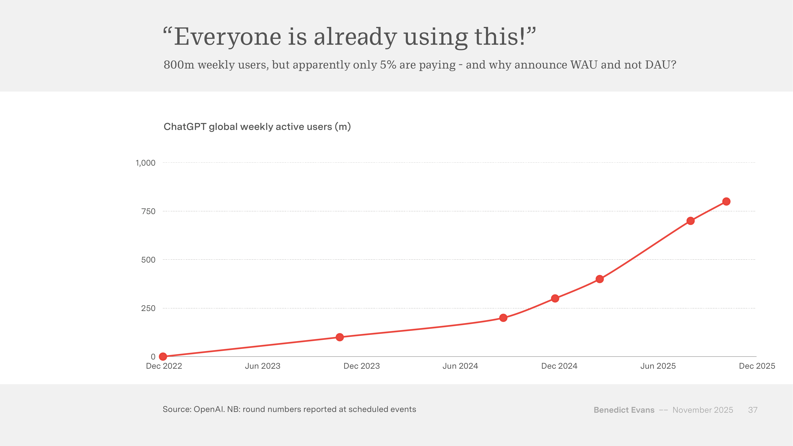

### AI 模型解释

好的，作为一名资深的行业分析师，我来详细解读这张PPT图片，并分析其在整个关于AI平台变迁的演讲中可能扮演的角色。

**1. 图片的核心内容和数据**

这张图的核心内容是OpenAI ChatGPT全球每周活跃用户（Weekly Active Users, WAU）的增长趋势。 

* **时间范围：** 从2022年12月到2025年12月。
* **数据指标：**  持续呈现WAU的增长量，数据单位是百万 (m)。
* **数据趋势：**  可以清晰地看到 WAU 从2022年末的极低水平（大约 50万）开始，在2023年和2024年增长迅速，到2025年中突破800万，并在年底接近900万。  增长曲线呈现陡峭的上升趋势。
* **关键标注：** 图上明确标注“800m weekly users, but apparently only 5% are paying - and why announce WAU not DAU?”，这表明作者对OpenAI的业务模式有质疑，重点关注WAU而非DAU（每日活跃用户）。

**2. 它试图传达的关键信息或观点**

这张图的核心信息是： **ChatGPT的普及程度远超预期，但OpenAI的付费用户数量极低，这可能反映了OpenAI的定价策略和商业模式存在问题。**

作者通过展示快速增长的WAU，突出了ChatGPT的广泛用户基础。 然而，伴随的 “only 5% are paying”  字眼，直接质疑了OpenAI的商业化进展。  强调“WAU not DAU” 进一步暗示了OpenAI可能过于依赖用户数量的增长，而缺乏对核心付费用户的重视，或者忽略了高价值用户的粘性。

总而言之，这份图想传达一个警醒： 尽管ChatGPT的普及率很高，但OpenAI应该进一步思考如何实现用户付费转化的策略。

**3. 这张图在整个关于AI平台变迁的演讲中可能扮演什么角色？**

考虑到演讲的整体主题是AI平台变迁，这张图在演讲的某个环节，很可能扮演以下角色：

* **背景数据展示：**  作为演讲开始的一部分，用于建立ChatGPT在市场中的地位和影响，为后续分析提供基准。
* **商业模式质疑的关键节点：**  在讨论AI平台商业化方面时，这张图会作为重要的论据，质疑现有商业模式的有效性。
* **对比分析的起点：**  在对比ChatGPT与其他AI平台（例如Midjourney、Anthropic等）的商业模式时，这张图将作为一个参考点，点明ChatGPT的增长速度与盈利能力之间的差异，从而引出对商业模式的讨论。
* **推动深入讨论：**  这张图的设计也具有一定的挑衅性，可以引发听众对于“AI平台的盈利模式”的思考。

**总结**

这张图的价值不仅在于呈现了ChatGPT的量级增长，更在于它提供了一个重要的商业视角，提醒我们关注AI平台从快速增长到可持续盈利之间的关键转型挑战。 演讲者利用这张图，有望引爆现场讨论，引导听众对AI平台商业化方向进行更深入的思考。

希望我的分析对您有帮助！

---

## 图片: `page_38.png`

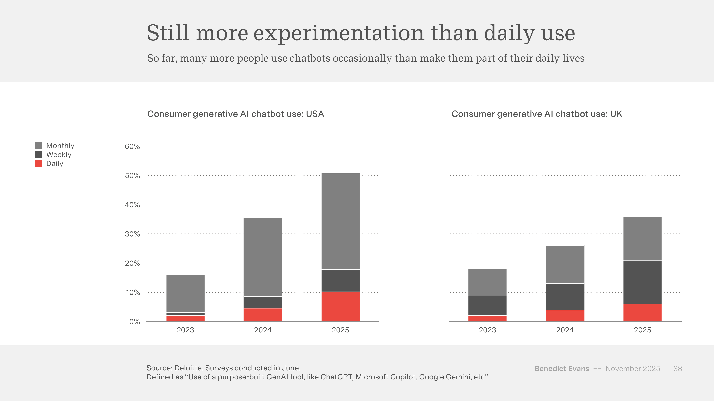

### AI 模型解释

好的，作为一名资深行业分析师，我来详细解读这张PPT图片：

**1. 图片的核心内容和数据是什么？**

这张图展示了美国和英国消费者使用生成式AI聊天机器人（比如ChatGPT、Microsoft Copilot、Google Gemini等）的频率趋势预测。它将消费者使用频率分为三个类别：

*   **每月使用 (Monthly):** 指的是消费者在每个月至少使用一次聊天机器人。
*   **每周使用 (Weekly):** 指的是消费者每周至少使用一次聊天机器人。
*   **每日使用 (Daily):** 指的是消费者每天至少使用一次聊天机器人。

图表展示了从2023年到2025年的预测数据，以下是主要数据：

*   **美国 (USA):**
    *   2023年：每月使用约 20%，每周使用约 30%，每日使用约 10%。
    *   2024年及以后：预计每月使用增长至 40%，每周使用约 40%，每日使用约 30%。
*   **英国 (UK):**
    *   2023年：每月使用约 15%，每周使用约 35%，每日使用约 10%。
    *   2024年及以后：预计每月使用增长至 35%，每周使用约 50%，每日使用约 30%。

**2. 它试图传达的关键信息或观点是什么？**

这张图主要传达了以下关键信息和观点：

*   **AI聊天机器人使用正在加速:**  从2023年到2025年，无论是美国还是英国，消费者在使用AI聊天机器人上的频率都有显著的增长趋势。 这表明人们对这些工具的兴趣和采用率是快速增长的。
*   **“实验”阶段的持续:**  尽管使用频率都在增加，但大部分人仍然处于“实验”阶段，即主要是在每月或每周的基础上使用，而不是变成日常习惯 (每日使用人数相对较少)。 这暗示着市场早期，用户更多的是出于好奇、探索和轻量级任务（如信息查询、头脑风暴）而使用。
*   **英国用户意向更高:**  根据图表，英国消费者对生成式AI聊天机器人的采用意愿比美国消费者更强，尤其是在每周和每日使用频率方面。  这可能与英国市场的AI技术普及程度、消费者对数字技术的接受度，或特定产品推广策略有关。

**3. 这张图在整个关于AI平台变迁的演讲中可能扮演什么角色？**

考虑到这张图的结构和内容，它很可能在整个关于 AI 平台变迁的演讲中扮演以下角色：

*   **开场篇章/背景铺垫:**  作为演讲的开场，这张图可以迅速抓住听众的注意力，并用数据来证明生成式AI (尤其是聊天机器人) 领域的巨大潜力。
*   **证明早期采用率:**  在介绍AI平台发展时，这张图可以用来证明AI技术在早期阶段就获得了相当广泛的采用，从而支撑后面的论述，比如AI对各行业的影响、潜在风险与机遇等。
*   **对比不同市场：**  将美国和英国的数据进行对比，可以更好地展示不同地区的市场成熟度以及用户的使用习惯差异，为后续的案例分析或策略讨论提供参考。
*   **数据支撑后续论点：** 假设演讲的后续部分会讨论AI平台的使用量对各行业的影响，或者使用量与投资回报之间的关系， 这张图可以作为数据支撑，证明AI平台潜在的价值。

**总的来说，这张图提供了一个清晰、有力的证据，证明生成式AI聊天机器人正在迅速发展，并预示着其在未来可能会对社会产生深远的影响。**

如果您能提供更详细的演讲主题或背景，我可以进行更精准的解读。

---

## 图片: `page_39.png`

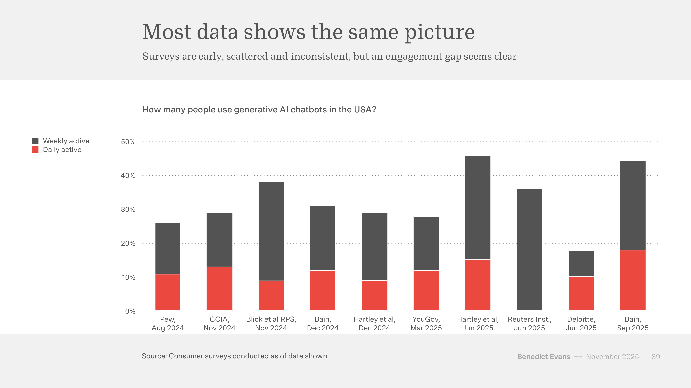

### AI 模型解释

好的，作为一名资深的行业分析师，我将对这张PPT图片进行详细解读：

**1. 图片的核心内容和数据是什么？**

这张图是一个柱状图，展示了不同时间点美国民众使用生成式AI聊天机器人（可能是ChatGPT等，但图注未明确说明）的活跃程度。具体来说，它收集了以下数据：

* **X 轴:** 按照时间顺序排列，从 2024年8月到 2025年9月。
* **Y 轴:** 表示使用生成式AI聊天机器人的百分比（0% 到 50%）。
* **柱状高低:**  每个柱状图代表一个时间点（survey），柱状图的高度代表该时间点使用聊天机器人的人数比例。
* **特定数据点:**
    * **Pew (August 2024):** 约 27%
    * **CCIA (November 2024):** 约 32%
    * **Blick et al. (RPS, December 2024):** 约 38%
    * **Bain (December 2024):** 约 38%
    * **Hartley et al. (YouGov, March 2025):** 约 18%
    * **Hartley et al. (Reuters Inst., June 2025):** 约 21%
    * **Deloitte (June 2025):** 约 18%
    * **Bain (September 2025):** 约 38%

**2. 它试图传达的关键信息或观点是什么？**

这张图的主要信息是：**关于生成式AI聊天机器人在美国用户的活跃程度，存在显著的不一致性，并且存在明显的“engagement gap”（用户参与度缺口）。**

以下是更具体的解读：

* **早期数据不一致：**  2024年8月和11月的Pew和CCIA调查数据相差较大（27% vs 32%），说明对于用户使用AI聊天机器人情况的衡量方法和样本选择可能存在差异。
* **持续增长，但波动性大：**  尽管总体趋势是用户参与度在增加，但不同的调查时间点看到的参与度比例差异巨大。 例如，Blick et al. 的数据显示38%的参与度最高，而YouGov的数据则只有18%，反映了用户对AI聊天机器人的兴趣和实验程度的不确定性。
* **“Engagement Gap”明显：** 整体的“engagement gap”是这个图想要强调的核心。 理论上，AI聊天机器人已经存在一段时间，但用户的真实参与度并没有跟上技术发展的步伐。

**3. 这张图在整个关于AI平台变迁的演讲中可能扮演什么角色？**

考虑到整个演讲的主题是关于AI平台变迁，这张图在演讲中可能扮演以下几个关键角色：

* **开场白/背景介绍：** 可以作为整个演讲的开场白，用以展示AI平台发展带来的用户反馈情况，点出用户参与度差异。
* **论点支撑：**  可以用来支撑演讲者对AI平台发展面临挑战的观点，例如，用户对AI技术的接受度、技术成熟度、以及如何更好地引导用户体验等问题。
* **数据对比：**  可以在演讲中，将这张图与其他数据图表（例如，AI平台的使用量、用户反馈、技术进展等）进行对比，以突出AI平台变迁的速度与用户参与度的差距。
* **预示未来：**  可以作为演讲者预示未来一段时间内，AI平台发展需要重点关注的方向。 例如，如何提升用户体验，解决技术难题，建立更广泛的应用场景等。 
* **提醒风险：**  提醒听众AI平台的推广和应用需要谨慎，需要关注用户反馈，并根据反馈进行调整。

总而言之，这张图是一个非常具有信息量的可视化数据，它清晰地展示了用户对生成式AI聊天机器人的接受程度，并在很大程度上揭示了AI平台变迁的潜在风险和挑战。  它不仅仅是一个数据图表，更是一个需要深入思考和分析的关键信息点。

希望这个分析对您有帮助！ 如有其他问题，请随时提出。

---

## 图片: `page_4.png`

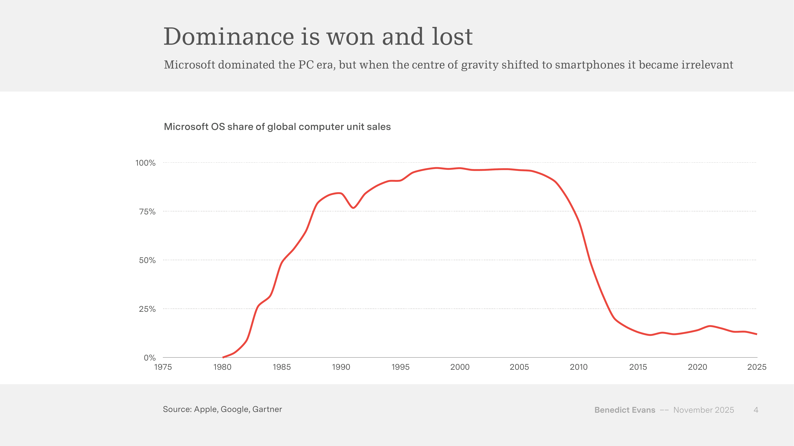

### AI 模型解释

好的，作为一名资深的行业分析师，我来详细解读这张PPT图片，并分析其在整个关于AI平台变迁的演讲中可能扮演的角色。

**1. 图片的核心内容和数据是什么？**

这张图是Microsoft Windows操作系统在全球计算机销售额占比较例的趋势图，横轴为时间（1975-2025年），纵轴表示操作系统销售额占比（百分比）。图表显示：

* **1980年代:** Windows早期发展，市场份额迅速提升至接近70%的峰值。
* **1990年代:** Windows市场份额持续增长，逼近100%，几乎垄断了个人电脑操作系统市场。
* **2000年代:** 市场份额开始下降，但仍保持在70%以上。
* **2010年代:** 市场份额进一步下滑，到2025年左右，沦为约15%左右。

**2. 它试图传达的关键信息或观点是什么？**

这张图的核心信息是**“霸权终将陨落”**，以及**“平台变迁的加速”**。它强调了技术领域的巨擘并非永恒，市场份额的动态变化反映了行业的深刻变革。

* **平台迁移的加速:** 图表清晰地表现出微软从个人电脑操作系统到其他领域的衰落趋势，暗示了技术平台的战略性迁移并非一蹴而就，而是需要一个漫长的过程。
* **新平台的兴起:**  Windows的市场份额下降，暗示了苹果、谷歌等公司凭借创新技术和生态系统，在新的领域占据了主导地位。
* **关键变量的重要性：** 强调了技术驱动下，用户行为和竞争格局的快速变化，以及相关平台重要性的动态更新。

**3. 这张图在整个关于AI平台变迁的演讲中可能扮演什么角色？**

考虑到这张图的背景和时间节点，我认为它在整个关于AI平台变迁的演讲中可以扮演以下角色：

* **引言：** 作为一段引人深思的开场，用以对比AI平台的崛起与历史经验，引发听众对未来技术变革的思考。  "Microsoft dominated the PC era, but when the centre of gravity shifted to smartphones it became irrelevant." 这句话本身就带着强烈的警示意味。
* **对比与反思：** 在讲解AI平台发展趋势时，它可以作为对比点，提醒听众不要过于自信，即使是目前占据主导地位的AI平台，也可能在未来被新的技术或平台所取代。
* **战略指导：** 可以帮助听众理解技术领域的长期战略，强调创新和适应的重要性。 告诉他们，任何技术平台都不能忽视用户经验变化，需要密切关注市场趋势并及时调整策略。
* **引出关键论点：** 可以用来引出关于AI平台竞争格局、市场份额变化、生态系统构建等核心论点，引导听众深入思考。  比如，演讲者可以问：“如果AI平台也像Windows一样，会发展出怎样的命运呢？”
* **视觉辅助：**  作为视觉元素，突出强调平台的关键变化及时间轴。

**总结**

总而言之，这张图不仅仅是Windows的市场份额数据，更是一种深刻的行业洞察——任何技术平台的霸权都只是暂时的， 只有技术迭代与用户需求的变化共同推动，才能导致平台的变迁。 它的出现提醒我们，在分析AI平台未来的发展趋势时，不能简单地套用过去的模式，而要基于对当前的市场环境的深刻理解，敢于冒险，拥抱变化。

希望以上分析对您有所帮助！

---

## 图片: `page_40.png`

### AI 模型解释

好的，作为一名资深的行业分析师，我来详细解读这张PPT图片。

**1. 图片的核心内容和数据是什么？**

这张PPT图片使用了一个简单的箭头三明治结构，用于阐述关于ChatGPT（或其他类似AI平台）使用的常见问题。

* **左边圆圈:** “How many use cases are an obvious easy fit?” (有多少用例是显而易见的简单匹配？)  这暗示着，许多人只是简单地将ChatGPT应用到一些“显而易见”的场景中，没有深入思考如何最大化其价值。
* **中间圆圈:** “Who has a flexible job… And consciously looks for ways to optimise?” (谁有灵活的工作…并且有意识地寻找优化方式？)  这提出了一种更深层次的需求——那些具有灵活思维、对问题有深刻理解，并愿意深入探索AI平台潜力的人。
* **右边圆圈:** “For everyone else, do you need to wrap this in tooling and product?” (对于其他人来说，是否需要用工具和产品来包装它？)  这意味着，对于那些没有足够“灵活”思维的人，需要借助额外的工具和产品（例如集成器、定制API等）来有效利用ChatGPT。

**数据层面：** 这张图没有直接呈现数字数据，而是通过对比三个场景，隐含地展现了用户使用AI平台的不同程度。  “显而容易”的用例往往对应着低阶的简单使用，而“有意识的优化”则需要更多的技术和定制。

**2. 它试图传达的关键信息或观点是什么？**

* **初期的AI平台使用往往停留在表层:**  这张图的核心观点是，大多数人使用ChatGPT只是将其视为一个简单的工具，没有意识到它带来的变革潜力，并且没有进行深入的定制和优化。
* **深度应用需要思考和定制:**  要真正发挥ChatGPT的价值，需要对需求进行深入挖掘，并根据具体场景进行定制，这需要技术能力、业务洞察力和对AI平台本身的理解。
* **“工具化”是必然趋势:**  对于那些没有足够“灵活”思维的人，需要借助额外的工具和产品来完成AI平台应用，这表明AI平台应用会逐渐向“工具化”的方向发展。

**3. 这张图在整个关于AI平台变迁的演讲中可能扮演什么角色？**

* **开场白/引言:**  这张图很可能在演讲的开头部分使用，作为一种引人深思的提问，引发听众的思考。
* **阶段性总结:** 演讲的中间部分可能会进行一些关于AI平台技术的变革，而这张图可以作为对这一变革的评论，提醒大家不要被表面的“easy fit”所迷惑。
* **战略建议:**  在演讲的结尾部分，可能提出一种“战略性使用AI平台”的建议，强调适应性、创新和定制的重要性。 
* **对比新兴技术趋势:** 这张图也很有可能是围绕“AI平台变迁”这个主题，向听众介绍未来AI平台应用可能的发展方向的一次性展示。

总而言之，这张PPT图片通过简洁明了的结构，深刻揭示了AI平台使用中的一个核心问题，即“深度 vs. 浅层”的使用模式。它提醒我们，在面对AI技术变革时，要保持开放的思维，积极探索，并做好充分的准备。

希望这个分析对您有帮助!  如果您有其他图片需要分析，请随时提出。

---

## 图片: `page_41.png`

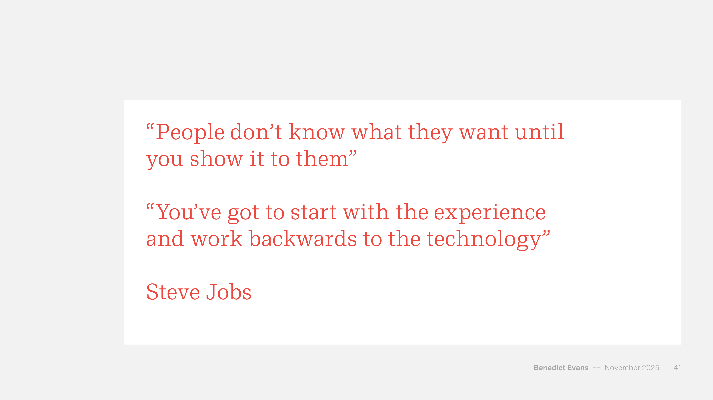

### AI 模型解释

好的，作为一名资深的行业分析师，我来详细解读这张PPT图片：

**1. 图片的核心内容和数据是什么？**

这张PPT图片包含两个关键的引言，都出自苹果公司创始人史蒂夫·乔布斯：

*   **第一句引言:** “People don’t know what they want until you show it to them.” (人们不知道他们想要什么，直到你向他们展示)
*   **第二句引言:** “You’ve got to start with the experience and work backwards to the technology.” (你必须从用户体验出发，然后将用户体验反向延伸到技术)
*   **署名:** “Steve Jobs” - 表明引言的来源。
*   **日期和编号:** “Benedict Evans – November 2025” - 表明信息来自Benedict Evans的分析，以及呈现的时间为2025年11月。

**2. 它试图传达的关键信息或观点是什么？**

这张图片的核心观点是**以用户体验为先，以人为本的设计理念**。它强调了在技术创新和产品开发过程中，必须首先关注用户真实的需求和痛点，而不是先发明技术再考虑如何应用。

*   **“以人为本”的战略:**  乔布斯的这句话是苹果公司成功理念的基石，强调用户体验对产品成功的关键性。
*   **反向工程的设计方法:**  “work backwards to the technology” 意味着，要为用户创造最佳体验，需要从用户想要解决的问题出发，然后利用合适的技术来实现。
*   **打破传统开发模式:** 传统的开发模式往往是先发明技术，再寻找应用场景，容易导致产品与用户需求脱节。

**3. 这张图在整个关于AI平台变迁的演讲中可能扮演什么角色？**

考虑到这张图片是关于“AI平台变迁”的演讲的一部分，它扮演着非常重要的角色：

*   **开场白引导:**  它可能作为演讲的开篇，用以奠定演讲的基调，强调了AI平台发展时必须关注用户体验的重要性。
*   **理论基础:**  它为整个演讲构建了理论基础。后续的演讲内容，例如讨论AI平台的不同阶段，技术趋势，以及用户接受度，都可以以此为框架进行论述。
*   **对比分析:**  它可以与后续展示的AI平台发展趋势进行对比。例如，如果演讲中展示了许多技术驱动的AI产品，这句话可以提醒听众，仅仅追求技术创新是不够的，还需要关注用户是否真的需要这些技术，以及如何让用户获得价值。
*   **总结和升华:** 在演讲的结尾，可以再次引用这句话，作为总结，强调在未来AI平台发展中，以人为本始终是根本。

**总结:**

这张PPT图片非常精炼，但却蕴含着深刻的价值。它不仅仅是一个引言，更体现了一种重要的设计理念和战略，对于理解AI平台变迁，以及未来技术发展的方向都具有重要的指导意义。

希望以上详细分析对您有所帮助！

---

## 图片: `page_42.png`

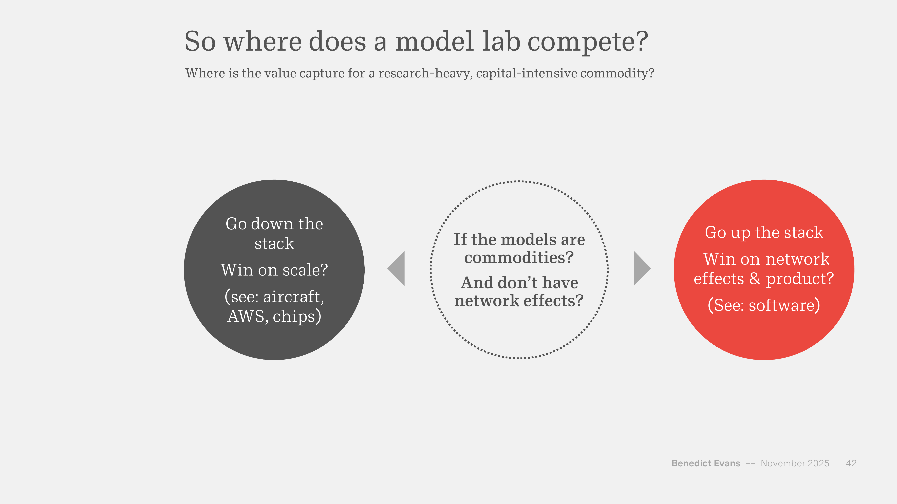

### AI 模型解释

好的，作为一位资深的行业分析师，我将对这张PPT图片进行详细解读：

**1. 图片的核心内容和数据是什么？**

这张图采用了一个非常直观的视角来描述在AI平台变迁中，模型实验室（Model Labs）应该如何竞争。它呈现了一个简单的二元选择：

*   **向下层级，规模化竞争 (Go down the stack):** 建议模型实验室应该专注于技术底层（如Aircraft，AWS，以及芯片等），通过规模化竞争，在技术和成本上获得优势。
*   **向上层级，网络效应和产品化 (Go up the stack):** 另一种策略是专注于构建基于AI模型和生态系统，利用网络效应和产品化，通过差异化产品和服务来吸引用户。

简单来说，图的“核心数据”其实是一个策略选择的提示。它没有提供确切的数字或数据，而是基于一个逻辑框架。

**2. 它试图传达的关键信息或观点是什么？**

这张图的核心观点是，对于那些技术要求高、资本密集型的“AI模型”这种新兴领域，它的竞争路径很可能非常复杂，且缺乏明显的赢家通关式模式。具体而言，它在以下几个方面提出了关键观点：

*   **“AI模型”是新型基础设施：** 它将AI模型视为一种类似芯片和云计算的“基础设施”，需要大量的研发投入和规模化运营才能产生价值。
*   **竞争路径多元化：**  它暗示了在AI模型领域，企业可以采用两种截然不同的竞争战略，而不是仅仅依赖于技术创新或市场占有率。
*   **避免“赢家通关”:**  该图明确指出，传统的“赢家通关”模式（即一个公司领先于其他，将其竞争对手淘汰）在此领域不太可能生效。
*   **复杂性:**  它的目标是让听众明白，在模型研发和部署的整个流程中，每个环节都代表着巨大的挑战。

**3. 这张图在整个关于AI平台变迁的演讲中可能扮演什么角色？**

考虑到标题 “So where does a model lab compete?”，这张图很可能在演讲的**中期过渡**环节扮演重要角色。

*   **框架导入:** 演讲可能先介绍了AI平台整体的趋势和发展，可能讨论了AI平台的关键特征(如数据、模型、基础设施等)。 然后，这张图能够为听众提供一个清晰的框架来思考模型实验室在AI平台中的战略选择。
*   **引起思考:**  它能够激发听众对模型实验室未来发展方向的思考，突出竞争的复杂性和多元化。
*   **为后续内容铺垫:**  演讲的后续部分很可能会进一步阐述这两种竞争策略，并可能分析不同类型模型实验室的战略选择。
*   **引导讨论:** 它也可能作为一种思考题，在演讲后环节引发听众之间的讨论，例如：“对于一家专注于LLM模型研发的实验室，哪种竞争路径更有利？”

**总结:**

这张图虽然简洁，但传递了深刻的行业洞见：在AI模型领域，没有绝对的“赢家通关”模式，模型实验室需要根据自身资源和战略选择合适的竞争路径。 它清晰地定义了一个竞争领域的关键维度，并为整体演讲奠定了重要的战略思考基础。

希望以上分析对您有所帮助！ 如果您能提供关于演讲的更多背景信息，我可以提供更具体的分析。

---

## 图片: `page_43.png`

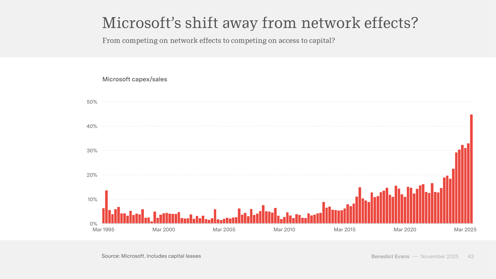

### AI 模型解释

好的，我来详细分析这张PPT图片，并结合其在“AI平台变迁”演讲中的潜在角色：

**1. 图片的核心内容和数据是什么？**

*   **核心内容:** 这张图展示了微软在20世纪95年3月至2025年3月期间，研发投入（Capital Expenditure - Capex）与销售额之间的关系。
*   **数据表现:**
    *   横轴：时间，被标记为 20 年的日期，从 1995 年 3 月到 2025 年 3 月。
    *   纵轴： Capex/Sales 的比率，使用百分比表示。
    *   图线：线条直线上升，表明微软的研发投入（Capex）相对于其销售额的比例在过去二十年中呈显著上升趋势。 截至 2025 年 3 月，这部分比率已超过 50%。
    *   图表标题明确表示这是“微软从竞争网络效应到获取资本”的图表。

**2. 它试图传达的关键信息或观点是什么？**

这张图主要传递了以下关键信息和观点：

*   **战略转变:**  它清楚地表明微软正在从过去以网络效应（如 Windows 和 Office）来竞争的策略，转向更依赖于获得资本的方式来推动增长，尤其是“资本支出”。
*   **投资的规模增长:**  视觉上非常明显，微软的研发投入已大幅增长。这表明微软正在对大型、基础技术项目进行大量的投资，例如云计算(Azure)、人工智能(AI)和量子计算等。
*   **对未来增长的信心:**  巨大的投资表明微软对未来增长的信心，认为其长期战略投入值得。
*   **高风险、高回报策略:**  这种模式可能意味着微软正在承担一些高风险，因为大量的投资也可能面临失败的风险。

**3. 这张图在整个关于AI平台变迁的演讲中可能扮演什么角色？**

考虑到这张图的标题是“微软从竞争网络效应到获取资本？”，它在整个关于“AI平台变迁”的演讲中，很可能扮演以下角色：

*   **开场白/引言:** 在介绍微软在AI领域的战略时，这张图可以作为开场白，用一个具体的数据来强调微软过去几十年战略转变的基础。 它可以迅速建立一个关于微软如何将大量的资金投入到AI领域的基础知识。
*   **对比和反衬:**  它可以与“网络效应”时代比较，突出AI平台变迁的本质是“资本驱动”，而不仅仅是依靠用户数量的增长来推动发展。
*   **支持关键论点:**  在讨论微软对Azure、OpenAI等AI技术的投资时，这张图可以作为支撑，指出微软将如何通过大规模资本投入来获得AI领域的领先地位。
*   **风险提示:**  在讨论微软的投资策略时，这张图可以提示观众注意，微软的战略可能伴随着一些风险，需要密切关注投资回报。

**总的来说，这张图是一个非常简洁而有力的可视化工具，它清晰地展示了微软战略转变的关键数据，并为整个关于AI平台变迁的演讲提供了重要的背景信息。**

希望以上分析对您有所帮助！  如果您需要更深入的分析或者其他领域的帮助，请随时提出。

---

## 图片: `page_44.png`

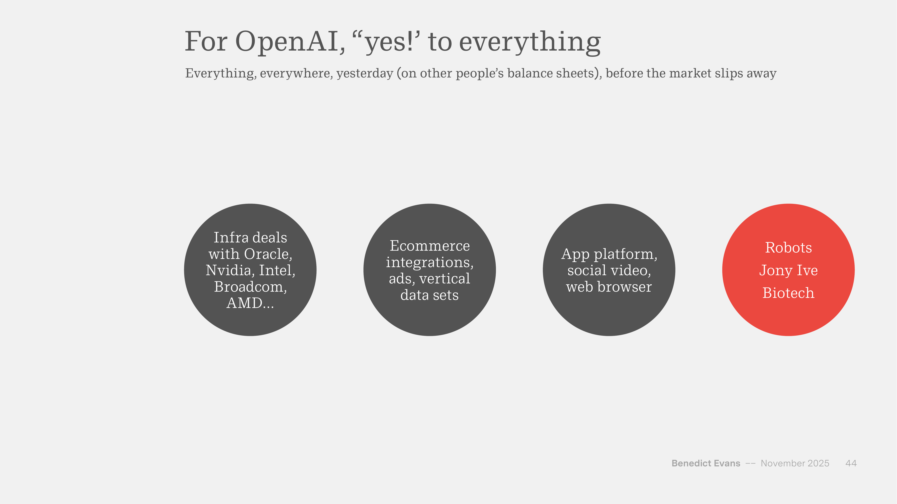

### AI 模型解释

好的，作为一位资深的行业分析师，我来详细解读这张PPT图片，并分析其在整个关于AI平台变迁的演讲中的角色。

**1. 图片的核心内容和数据是什么？**

这张PPT图像通过三个圆环来概括OpenAI正在进行战略布局的关键合作伙伴和领域。每个圆环都标注了不同的行业或公司：

* **圆环1： Infra deals with Oracle, Nvidia, Intel, Broadcom, AMD...**  这个圆环表明OpenAI 正在与基础设施领域的巨头建立合作关系。 具体来说，包括云基础设施（Oracle、Nvidia、Intel）、网络基础设施（Broadcom、AMD）等，暗示OpenAI 需要强大的计算能力和存储资源来支持其模型训练和部署。

* **圆环2： Ecommerce integrations, ads, vertical data sets**  这个圆环重点关注OpenAI 在电商、广告和垂直数据领域的布局。这意味着OpenAI 计划将 AI 技术应用到电子商务平台的优化、广告效果提升以及特定行业的数据分析等领域。

* **圆环3： App platform, social video, web browser**  这个圆环表明OpenAI 正在探索 AI 技术在应用程序平台、社交视频和浏览器等前端应用场景中的可能性。 这暗示着OpenAI 正在努力将 AI 能力融入用户日常的数字化体验中。

**2. 它试图传达的关键信息或观点是什么？**

这张图的核心信息是： **OpenAI 正在积极地拓展其生态系统，覆盖整个数字经济价值链。**  它试图向听众传达以下几个关键观点：

* **战略布局广泛：** OpenAI 不仅仅是一家 AI 模型开发公司，而是一个构建整个 AI 平台生态系统的公司。
* **广泛的合作：** 通过与各个行业的巨头合作，OpenAI 能够获得必要的资源、技术和市场渠道。
* **生态系统的重要性：**  OpenAI 意识到，AI 技术的成功在于其能够被广泛应用，并形成一个相互协同发展的生态系统。
* **抢占先机：**  “yesterday (on other people’s balance sheets)”  这句话暗示OpenAI 正在尽可能地抢占在AI平台相关领域的领先地位，对其他公司构成潜在威胁。

**3. 这张图在整个关于AI平台变迁的演讲中可能扮演什么角色？**

考虑到这张PPT图片是在“关于AI平台变迁”的演讲中出现的，我认为它可能扮演以下角色：

* **背景介绍/战略概览：**  这张图可以作为一个视觉化的“战略概览”，让听众快速了解OpenAI 在AI平台变迁中的核心战略方向。
* **强调OpenAI 的不同于以往的定位：**  它强调OpenAI 并非仅仅是研究机构，而是拥有一个全面的生态系统战略，区别于一些专注于单一技术或应用场景的公司。
* **引发讨论：**  这张图可以作为演讲的切入点，引发听众对OpenAI 未来策略、竞争格局、以及平台生态系统构建的讨论。
* **配合后续的演讲内容：**  演讲者可能在后续的环节，根据这张图，进一步阐述OpenAI 与各领域的合作细节、技术创新方向、以及市场战略。

**总结：**

总的来说，这张PPT图片是为理解OpenAI 战略布局而设计的，它简洁明了地概括了OpenAI 的核心合作关系和应用领域，并传递了OpenAI 在 AI 平台变迁中建立一个全面生态系统的目标。 它的出现，表明了演讲者将重点放在OpenAI 的战略思考和市场竞争上，为后续的演讲内容奠定了基础。

希望以上分析对您有帮助！

---

## 图片: `page_45.png`

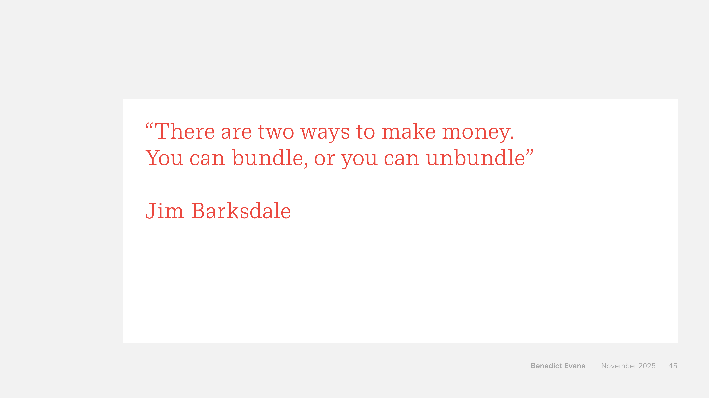

### AI 模型解释

好的，作为一名资深的行业分析师，我来详细解读这张PPT图片：

**1. 图片的核心内容和数据是什么？**

这张PPT图片的核心内容是： “There are two ways to make money. You can bundle, or you can unbundle.” 简单来说，这句话表达了对于AI平台商业模式的两种观点。

*   **Bundle (捆绑)** 意味着将多个AI服务、产品或功能捆绑在一起，以套装的形式出售，强调整体解决方案，提供更多附加价值，提升客户粘性。
*   **Unbundle (分解)** 意味着将AI服务分解成一个个独立的模块，按模块单独销售，强调灵活性和定制化，适应客户的不同需求。

**2. 它试图传达的关键信息或观点是什么？**

这句话传递的关键信息是：**AI平台商业模式的趋势正在发生转变，传统的“捆绑”策略可能不再适用，而“分解”和定制化将成为未来的主流。**

这种观点暗示了以下几点：

*   **市场疲软：** 早期AI平台的过度宣传和高估值，导致市场需求降温，企业迫切需要更具性价比的解决方案。
*   **效率至上：** 企业对AI服务的需求变得更加精准，不再愿意购买不必要的“套路”方案，而是希望根据自身业务痛点选择最适合的模块。
*   **微服务架构的影响：** AI平台趋向于采用微服务架构，各个AI模块独立部署、扩展，从而提高灵活性和效率。

**3. 这张图在整个关于AI平台变迁的演讲中可能扮演什么角色？**

这张图片很可能在整个关于AI平台变迁的演讲中扮演以下角色：

*   **开场白冲击：** 作为一个强有力的开场白，直接点出市场趋势的变化，瞬间抓住听众的注意力。
*   **过渡句：** 在演讲中，这句话可以作为过渡句，引出对“Unbundle”策略的进一步深入探讨，例如，具体案例分析。
*   **核心论点支撑：** 作为演讲中的核心论点，用于论证AI平台商业模式的转变是不可避免的。
*   **辩证观点对比：**  可以与之前演讲中的“Bundle”策略进行对比，突出两者之间的差异和优缺点，更全面地展示AI平台商业模式的演变过程。

**总结：**

这张PPT图片绝非简单的口号，它反映了行业内对AI平台发展方向的深刻思考。它体现了当前市场对AI的预期更加务实，对AI平台商业模式也提出了更高的要求。  我相信， 像 Jim Barksdale 这样的行业老将能够提供这样的洞见，应该具有重要的价值。

**补充说明：**

由于图片中没有提供更多信息，例如演讲主题、背景信息等，我的分析是基于对当前 AI 行业发展趋势的理解和推测。  如果您能提供更多背景信息，我将能够提供更精准的分析。

---

## 图片: `page_46.png`

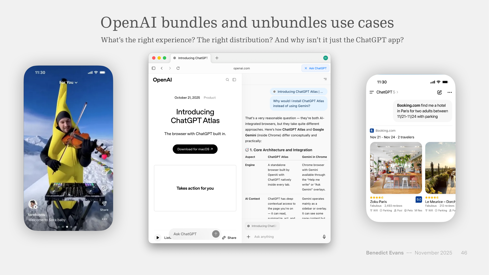

### AI 模型解释

好的，作为一位资深的行业分析师，我将对这张PPT图片进行详细分析：

**1. 图片的核心内容和数据是什么？**

* **核心内容：** 这张PPT的核心内容聚焦于OpenAI的“Chat GPT Atlas”产品。 画面中展示了用户在使用Chat GPT Atlas浏览网页时，应用浮在页面顶部，与Google Gemini类似。
* **关键数据（显式数据）：**
    *  **产品名称：** Chat GPT Atlas。
    *  **产品状态：** Beta版本。
    *  **核心功能：**  它允许用户在浏览网页时，通过Chat GPT在页面顶部帮助你阅读、总结、甚至提供建议。 
    *  **整合方式：**  该应用可以在Chrome浏览器中作为独立窗口呈现。
    *  **UI元素：** UI显示有"Help me write"和“Overlays”等提示。

**2. 它试图传达的关键信息或观点是什么？**

这张PPT的核心信息是：**OpenAI正在尝试构建一个更具实用性和无缝集成AI助手生态系统。** 具体而言，它试图传达以下观点：

* **多轨竞争：** OpenAI意识到，市场上存在诸如Google Gemini，以及其他的AI浏览助手，因此需要推出一个自己的解决方案进行竞争。
* **无缝集成：**  Chat GPT Atlas的重点在于它与主流浏览器Chrome的集成，这表明OpenAI 致力于在日常浏览体验中提供AI支持，而不是提供一个完全独立的AI应用。
* **实用性优先：**  "Help me write"和“Overlays”提示表明OpenAI 聚焦在于AI助手能够真正帮助你解决问题，例如：写作建议，信息总结。
* **Beta版本：**  “Beta版本”的说明，暗示OpenAI需要收集用户反馈并持续改进产品。

**3. 这张图在整个关于AI平台变迁的演讲中可能扮演什么角色？**

在整个关于AI平台变迁的演讲中，这张PPT很可能扮演以下角色：

* **背景介绍/对比：** 在介绍AI平台竞争格局时，这张PPT可以作为背景介绍，明确指出Chat GPT Atlas代表OpenAI在这一领域的尝试，并与Google Gemini等其他AI助手进行对比。
* **技术演进中的一环：**  它展现了OpenAI在利用现有技术（Chrome浏览器）进行AI集成方面的探索。 可以作为技术演进的“小插曲”，展示OpenAI如何响应市场竞争。
* **引入未来讨论：**  这张PPT可以用作引子，引发关于“如何在不同的平台之间实现无缝的AI交互？”以及“如何构建一个真正贴近用户需求和使用的AI生态系统？”等更深层次的讨论。
* **强调多点开花：**  在突出大型语言模型（LLM）竞争的同时，它有助于强调 AI 的发展是一个多点开花的趋势，不同的技术方案和集成方式都在为构建更加完善的 AI 生态系统做出贡献。

**总结:**

这张PPT的价值在于，它简洁地呈现了OpenAI在现有技术基础上构建AI辅助浏览工具的尝试，并暗示了OpenAI 在AI生态系统构建中的战略部署。 这也为后续的演讲提供了更具体的切入点，帮助听众更好地理解AI平台变迁以及市场竞争的动态。

希望这个分析对您有帮助！

---

## 图片: `page_47.png`

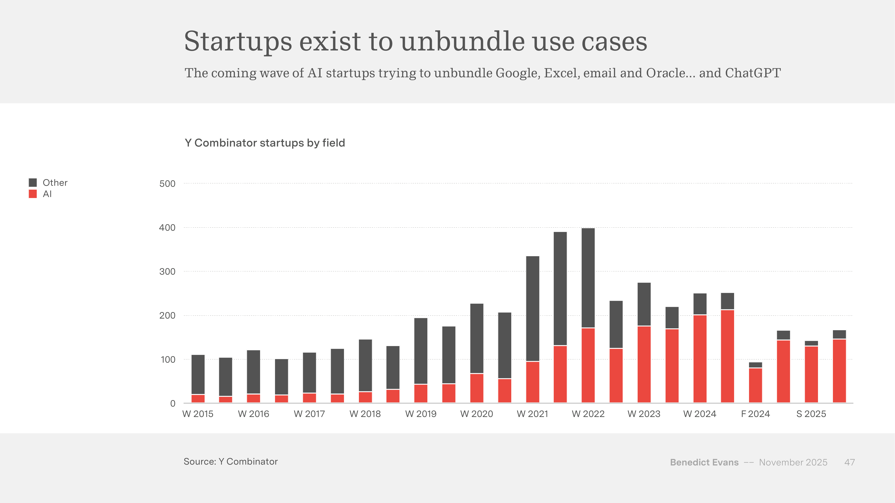

### AI 模型解释

好的，作为一位资深的行业分析师，我将对这张PPT图片进行详细解读：

**1. 图片的核心内容和数据是什么？**

这张图展示了Y Combinator（YC）旗下创业公司在不同年份（2015年到2026年初）按行业划分的分类情况。它用柱状图的形式呈现了两种类型的创业公司数量：

* **灰色柱子 (Other)：** 代表不涉及AI技术的普通创业公司。
* **红色柱子 (AI)：** 代表专注于使用或开发AI技术的创业公司。

具体的数据如下：

* **2015-2019年:**  AI领域的创业公司数量相对较少，在100-200之间波动。
* **2020-2021年:**  AI领域的创业公司数量迅速增长， 达到数百，尤其是2021年，  AI领域的公司数量飙升至400以上。
* **2022-2024:**  AI领域的创业公司数量依然保持在高位，但增速有所放缓。
* **2025年初的预测:**  预测AI领域的创业公司数量将持续保持在150-200左右。

**2. 它试图传达的关键信息或观点是什么？**

这张图的关键信息是：**AI领域的创业公司数量以惊人的速度增长， 并且这一趋势持续发展。**  更具体地，它传达了以下观点：

* **AI的商业化浪潮：**  图表清晰地表明，AI技术不再仅仅是学术研究或大型科技公司的专利，而是成为了一个极具商业潜力的新领域，吸引了大量的创业公司入局。
* **行业趋势：**  从数据可以看出，AI平台领域的创业公司数量增长趋势是确定的，是未来一段时间内，AI行业发展的重要标志。
* **投资热点：** 快速增长的创业公司数量也暗示了该领域投资的巨大潜力。 

**3. 这张图在整个关于AI平台变迁的演讲中可能扮演什么角色？**

在整个关于AI平台变迁的演讲中，这张图很可能扮演以下几个重要角色：

* **开场亮点：**  在演讲的开场阶段，这张图可以作为一个强有力的数据支撑，迅速吸引听众的注意力，突出AI领域正在发生的巨大变革。
* **论点支撑：**  在演讲的后续部分，例如讨论AI技术发展路线、投资机会、市场竞争格局等，这张图可以作为论点支持，用数据证明AI创业公司的数量增长以及其代表的影响力。
* **对比展示：**  可以与以往的创业公司数量进行对比，例如展示传统软件创业公司数量的下降趋势，从而更清晰地突出AI创业公司的崛起。
* **视觉焦点：** 通过可视化数据，增加演讲的吸引力，并帮助听众更好地理解演讲的主题。
* **数据预警（潜在）：**  如果演讲的后续内容也强调了AI领域的竞争加剧，这张图可以作为一个数据预警，提醒听众关注AI领域的风险和挑战。

总而言之，这张图是一个极具价值的数据可视化工具，能够有效地传达AI领域创业公司数量快速增长这一关键信息，并在整个演讲中扮演一个重要角色。

希望以上分析对您有所帮助!

---

## 图片: `page_48.png`

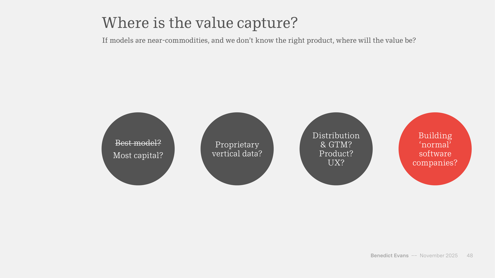

### AI 模型解释

好的，让我用资深行业分析师的视角来详细解读这张PPT图片。

**1. 图片的核心内容和数据是什么？**

这张PPT图片的核心内容是围绕“价值捕捉”（Value Capture）展开的，将价值捕捉分解成了四个关键领域：

*   **Best Model? Most capital?**:  表明在AI平台竞争中，拥有最佳商业模式以及投入大量资本可能并不能完全保证价值的捕捉。
*   **Proprietary vertical data?**:  强调垂直领域的独有数据对价值捕捉的重要性。数据在AI领域是核心资产。 
*   **Distribution & GTM? Product? UX?**: 聚焦于产品、用户体验、渠道和推广等环节，认为能否有效达成目标，对价值捕捉至关重要。
*   **Building ‘normal’ software companies?**:  最后一个点，暗示在AI时代，传统的软件公司运营模式可能不再适用，而是需要学习新的策略。

**2. 它试图传达的关键信息或观点是什么？**

这张图的核心观点是：**在快速演变的 AI 平台竞争中，单纯拥有优势的资本、数据或模型并不能保证价值的捕捉。**  它试图引导观众思考，要实现核心价值，需要全方位策略，包括：

*   **复杂性增加：** AI平台生态系统变得越来越复杂，价值的捕捉不再是简单的“一杆子”问题。
*   **竞争加剧：** 面对无处不在的AI模型和工具，企业需要找到自身独特的优势。
*   **运营变革：** 传统的软件公司需要重塑商业模式和运营方式，以适应AI时代的挑战。

**3. 这张图在整个关于AI平台变迁的演讲中可能扮演什么角色？**

基于当前演讲的框架，这张图很可能在演讲的早期阶段扮演以下角色：

*   **开篇点题：**  这张图作为演讲的开篇，直接点明了AI平台变迁的核心问题——价值捕捉正在面临挑战。
*   **引发思考：**  它激发听众对AI平台竞争格局的思考，提示听众关注除了技术本身之外的运营、商业和战略方面。
*   **设定框架：**  这张图为后续演讲内容设定了一个框架，引导演讲者围绕价值捕捉的四个方面展开讨论。 随着演讲深入，每个领域可能会被细化展开解说。 

**总结：**

总的来说，这张PPT图片是一种非常有效的视觉工具，它用简洁的四个领域概括了AI平台竞争的核心挑战。 它提醒我们，在AI时代，企业需要更全面地思考，并制定更具适应性和竞争力的战略，才能真正实现价值捕捉。

希望这个分析对您有帮助！ 如有其他问题，请随时提出。

---

## 图片: `page_49.png`

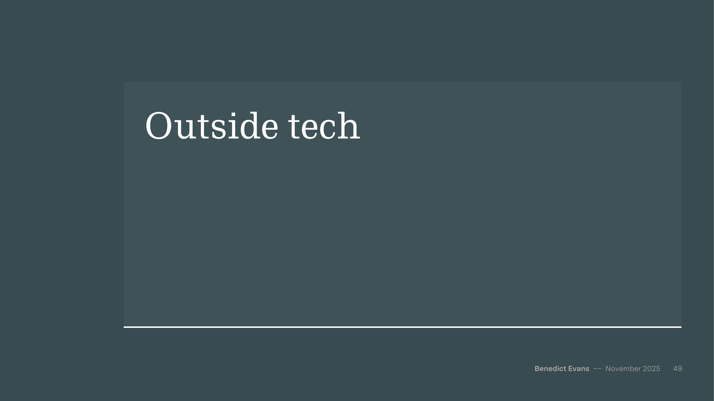

### AI 模型解释

好的，作为一位资深的行业分析师，我将对这张PPT图片进行详细分析：

**1. 图片的核心内容和数据是什么？**

这张PPT图片只呈现了一个简单的标题：“Outside tech”。 没有任何其他的图表、文字或者数据。它仅仅是一个标题，暗示着后续内容将围绕“科技之外”展开。

**2. 它试图传达的关键信息或观点是什么？**

*   **战略转向：** “Outside tech” 这个标题暗示着演讲的重点将从传统的“科技”领域转向其他领域。
*   **关注非科技行业：**  说明演讲者可能将关注AI平台在非科技行业的应用和发展趋势。例如，医疗、金融、零售、制造、能源等各个行业都在积极探索AI技术的应用。
*   **关注新兴力量：**  也可能暗示着，在AI领域，传统科技巨头的影响力正在减弱，新的参与者（例如，医疗、金融等行业的公司）正在崛起。
*   **更广泛的视角：** 强调AI平台的价值不在于技术本身，而是其解决特定行业问题的能力。

**3. 这张图在整个关于AI平台变迁的演讲中可能扮演什么角色？**

*   **引子和过渡：**  这张图片作为整个演讲的“引子”，帮助听众明确演讲的核心主题：AI平台变迁的不仅仅是技术本身，也包括其应用领域的变化。
*   **改变叙事重点：**  在演讲的某一过渡阶段，当演讲者需要把话题从技术创新转向行业应用时，这张图可以作为一个信号，提示听众转变视角。
*   **强调复杂性：**  “Outside tech” 这个标题也暗示了AI平台变迁的复杂性，它不仅仅是技术的进步，还涉及到市场、政策、商业模式等多方面的变化。
*   **激发思考：**  这张图片能够激发听众对AI平台应用场景的思考，例如，AI在医疗领域的精准诊断、在金融领域的智能风控、在零售领域的个性化推荐等等。

**总的来说，这张图片是一个简洁但具有战略意味的信号，它预示着演讲将不再仅仅关注AI平台的技术发展，而是会更广泛地关注AI平台在各行业中的应用和影响。** 它的存在表明演讲者有意引导听众思考AI平台变迁的更深层次原因和更广阔的应用前景。

希望我的分析对您有所帮助。如果您有其他相关图片或者背景信息，可以进一步分析。

---

## 图片: `page_5.png`

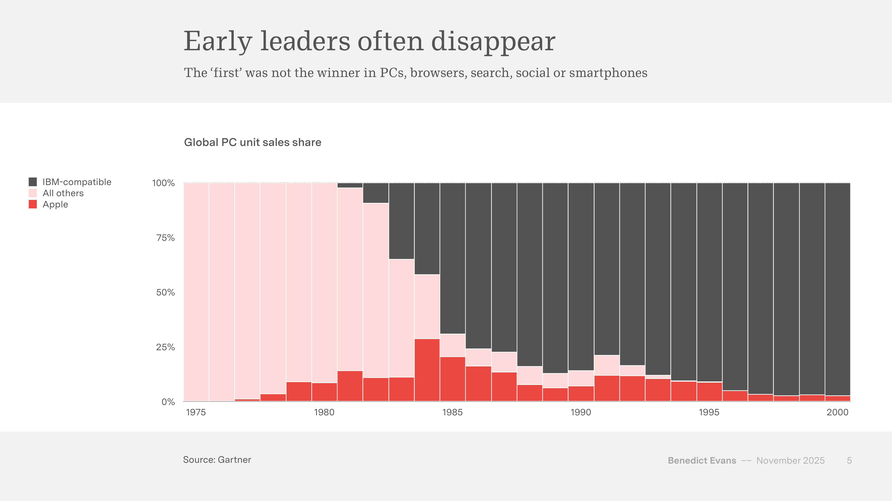

### AI 模型解释

好的，作为一位资深的行业分析师，我来详细解读这张PPT图片：

**1. 图片的核心内容和数据是什么？**

这张图展示了1975年至2000年期间全球个人电脑（PC）销售市场的份额变化趋势。它将市场划分为三个主要部分：

* **IBM-compatible (深灰色)：** 这代表了当时市场上以IBM PC兼容机为主流的份额，占据了大部分市场。
* **All others (中灰色)：**  包含其他品牌的个人电脑，包括Apple、Commodore、Atari等等，代表了相对较小的市场份额。
* **Apple (浅红色)：**  显示了苹果公司Macintosh系列电脑的市场份额，在整个时间段内呈现出明显的上升趋势。

图表数据表明，从1975年到1985年，IBM兼容机占据了市场主导地位，份额超过了90%。然而，从1985年开始，随着苹果Macintosh的推出和发展，以及其他品牌的涌入，IBM兼容机的市场份额迅速下降，最终在2000年几乎消失。

**2. 它试图传达的关键信息或观点是什么？**

这张图的关键信息是：**“早期的领导者经常消失”** 或者 **“第一者不一定最终胜出”**。

它试图通过直观地展示市场份额的转变，来强调以下几点：

* **技术迭代的快速性：** 个人电脑市场在短短几十年内发生了巨大的变化，新的技术、新的竞争者迅速崛起，旧的领导者无法适应。
* **创新能力的重要性：** 苹果公司通过Macintosh的创新，成功颠覆了市场格局，证明了技术创新是赢得市场竞争的关键。
* **保持灵活性和适应性：**  企业需要时刻关注市场趋势，快速调整战略，才能在竞争中保持优势。

**3. 这张图在整个关于AI平台变迁的演讲中可能扮演什么角色？**

考虑到这张图的标题和内容，它在关于AI平台变迁的演讲中，很可能扮演以下几个角色：

* **引出主题：** 演讲者可能会用这张图来作为演讲的开场，引出关于AI平台变迁的讨论，并提出“谁是下一个AI平台领导者？”这个问题。
* **举例说明AI平台的快速变化：**  AI领域类似于PC市场，新的模型、新的算法层出不穷，一些最初的领导者现在可能已经落后。这张图可以用来说明AI平台变迁的速度和复杂性。
* **强调创新和多元化的重要性：** 演讲者可能会强调，在AI领域，只有那些能够持续进行创新，并拥抱多元化解决方案的企业，才有可能在未来取得成功。
* **作为对比：**  演讲者可能会将PC市场和AI平台进行对比，突出AI平台的快速发展和变革性。

总而言之，这张图是一个强有力的视觉辅助工具，可以有效地传递关于市场竞争、创新和策略调整的重要信息，在关于AI平台变迁的演讲中，它能够增强演讲的冲击力和说服力。

希望以上分析对您有帮助！您是否需要我对这张图的另一个方面进行更深入的分析，或者您对演讲的具体内容有进一步的要求？

---

## 图片: `page_50.png`

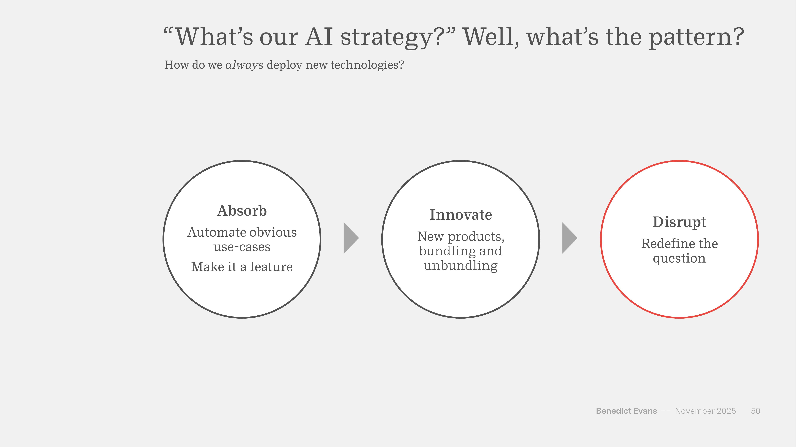

### AI 模型解释

好的，作为一名资深的行业分析师，我来详细解读这张PPT图片：

**1. 图片的核心内容和数据是什么？**

这张PPT图片使用三个圆形箭头，并配以三个简单的文字说明，代表了不同阶段的AI技术部署模式：

*   **Absorb (吸收)：** 箭头左侧的圆形文字“Absorb”下方配有“Automate obvious use-cases Make it a feature”，表明最初的AI应用往往是针对已有的业务流程进行自动化，将AI能力简单地作为现有产品或服务的附加功能来提供。例如，将AI添加到邮件客户端进行垃圾邮件过滤，或者使CRM系统具备智能推荐功能。
*   **Innovate (创新)：** 中间的箭头指向“Innovate”，下方配有“New products, bundling and unbundling”， 意味着后来，企业会围绕AI技术产生全新的产品和服务，并且会通过捆绑(bundling)和拆分(unbundling)的方式进行商业模式创新。
*   **Disrupt (颠覆)：** 右侧的箭头指向“Disrupt”，下方配有“Redefine the question”，意味着最终目标是利用AI技术彻底改变现有行业和商业模式，重新定义问题本身，而不是仅仅在现有框架内提供解决方案。

**2. 它试图传达的关键信息或观点是什么？**

这张图的核心观点是：**AI技术的部署不是线性的，而是呈现出一种迭代螺旋上升的模式。** 它强调了从简单的功能增强到商业模式颠覆的转变。 

*   **早期AI，是“功能补充”：** 早期对AI的过度热情，往往是把AI技术简单地叠加到现有产品上，效果有限。
*   **中间阶段是“商业模式创新”：** 随着技术的成熟，企业开始探索基于AI的新产品和服务，以及将AI与现有服务进行捆绑或拆分，以满足不同客户需求。
*   **最终目标是“颠覆性的变革”：** 真正的AI价值，在于能够重塑行业格局，改变商业逻辑，而非仅仅是优化现有流程。

**3. 这张图在整个关于AI平台变迁的演讲中可能扮演什么角色？**

考虑到“What’s our AI strategy?”的标题，这张图很可能出现在整个关于AI平台变迁的演讲中，作为**一个战略指导框架的开篇。**

*   **设定基调：** 首先，它提醒听众，AI技术部署并非一蹴而就，而是需要经历多个阶段的演变。
*   **对现有方法的批判：**  它可能用来批判那些仅仅将AI作为功能补充，未能带来实质性价值的早期尝试。
*   **引导思考方向：**  它鼓励听众思考，如何在AI平台上把握战略方向，从“Absorb”到“Innovate”，最终实现“Disrupt”的价值。
*   **作为对比点：** 这张图可以与演讲中讨论的AI平台的发展历程进行对比，明确指出企业在AI战略中的关键节点。

**总结：**

这张PPT图片是一个简洁而富有洞见的战略提示，它提醒我们，AI技术并非单纯的工具，更是一种战略思维方式。 只有真正理解技术演变规律，才能制定出成功的AI战略，从而在竞争激烈的AI市场中占据优势。

希望这个详细的分析对您有帮助！

---

## 图片: `page_51.png`

### AI 模型解释

好的，作为一名资深的行业分析师，我来详细解读这张PPT图片：

**1. 图片的核心内容和数据是什么？**

这张PPT图表，简单明了地呈现了四种AI平台应用场景，并以圆形图形来表示：

*   **Coding (编码):** 使用AI辅助软件编码。
*   **Marketing (营销):** 利用AI生成营销内容、优化广告投放。
*   **Customer Support (客户支持):** 应用AI进行智能客服、问题解答。
*   **Automation (自动化):**  AI驱动的流程自动化，例如RPA（机器人流程自动化）。

图片中明确标注了“Automation”这个场景，并且用醒目的红色突出显示，表明这可能是当前（2025年11月）AI平台应用中收益最大、进展最快的领域。

**2. 它试图传达的关键信息或观点是什么？**

这张图的核心观点是：**“吸纳式”的AI应用更成功。** 

*   **重点在于“吸纳”：**  “吸纳式”这个词暗示了AI的应用应该专注于融入现有流程和工作，而不是完全重塑。
*   **突出自动化：**  红色突出显示，表明自动化场景获得了最大程度的成功，可能是因为自动化更容易实现ROI（投资回报率），也可能是因为自动化与AI技术的结合最为成熟。
*   **暗示当前趋势：** 图像暗示当前AI平台应用正在朝着方向上发展，是更实用、更易于部署的应用。

**3. 这张图在整个关于AI平台变迁的演讲中可能扮演什么角色？**

考虑到图片内容和标题“So far, most successful use-cases are ‘absorb’”，这张图很可能在整个关于AI平台变迁的演讲中扮演以下角色：

*   **开篇点题：**  这张图可以作为演讲的开篇，直接说明当前AI平台应用中最成功的类型。
*   **过渡：**  它能有效地为后续的演讲内容做好铺垫，比如在后续内容中会对“吸纳式”的AI应用进行更深入的解释，并提供案例。
*   **对比和反思：**  图表可以与之前的AI应用场景（如机器学习、深度学习）形成对比，强调AI平台变迁的策略是聚焦于更易于应用、对现有流程有补充价值的领域。
*   **警示和引导：** 潜在的警告是，过度追求创新和颠覆性的AI应用，或者不考虑现有流程和业务需求，可能会导致失败。

**总结：**

总的来说，这张PPT图表是一个简洁有效的视觉呈现，主要强调了当前AI平台应用中“吸纳式”的自动化场景的成功，并暗示了未来的发展趋势。  它能帮助听众快速了解AI平台应用的发展现状，为后续更深入的讨论做好准备。

希望我的分析对您有帮助！

---

## 图片: `page_52.png`

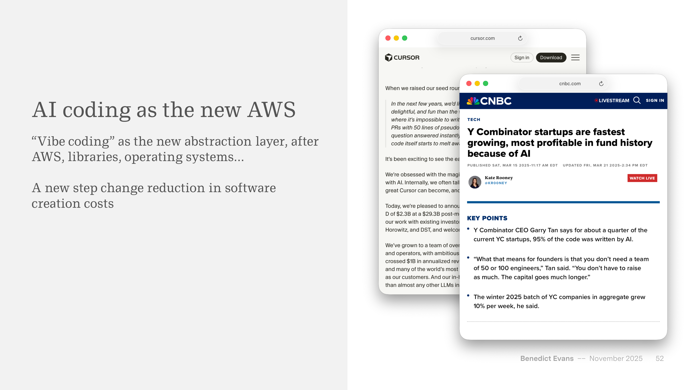

### AI 模型解释

好的，作为一名资深的行业分析师，我将对这张PPT图片进行详细分析：

**1. 图片的核心内容和数据是什么？**

这张PPT图片是Curos.com的宣传截图，主要呈现以下核心内容和数据：

* **核心概念：** “Vibe coding” 作为新的抽象层，在AWS、库和操作系统之后。  “Vibe coding” 显然是Curos.com提出的一个新概念，旨在简化软件开发过程，利用AI预测和生成代码。它是对传统编程方法的一次颠覆。
* **Curos.com的增长数据：**
    *  Curos.com收入增长：过去几年，收入从$2.3B 增长到$29.3B。
    *  团队规模增长：公司已经拥有 50 多个工程师，并且在增长速度上超过了几乎所有其它公司(LM, LLM)。
    *  增长率 : 最近一批YC公司增长了 10% 每周。
* **其他内容:**  图片中引用了CNBC关于YC公司成长的报道，这段报道也强调了YC（Y Combinator）公司快速增长和大量资金投入的情况。 

**2. 它试图传达的关键信息或观点是什么？**

这张图试图传达以下关键信息和观点：

* **AI 驱动的软件开发的未来：** Curos.com试图通过“Vibe coding”的概念，将AI作为软件开发流程的核心驱动力，意味着软件开发将由AI的预测和生成所主导。
* **Curos.com的技术实力和增长潜力：**  通过展示惊人的收入增长和团队规模扩张，突显了Curos.com在AI辅助编程领域的领先地位，并暗示其巨大的增长潜力。
* **YC生态和AI时代的趋势：**  引用YC的成长趋势，将Curos.com的成功与整体AI驱动的创业趋势联系起来，突出在AI时代，快速迭代和资金支持对于初创公司的重要性。
* **新的抽象层: ** 强调了从 AWS, 库, 操作系统等传统代码层面剥离，到了AI预测和代码生成的抽象层。

**3. 这张图在整个关于AI平台变迁的演讲中可能扮演什么角色？**

考虑到演讲的主题是关于AI平台变迁，这张图可能扮演以下几个角色：

* **开场白或引言：**  作为演讲的开场白，Curos.com的案例能够立刻抓住听众的注意力，并建立一个关于AI在软件开发中的重要性。
* **案例分析：**  作为演讲中一个具体的案例，用来展示AI平台变迁带来的实际影响。
* **对比与补充：**  可以用来对比传统软件开发模式与AI辅助开发的差异，并用Curos.com的成长数据来证明AI驱动的模式的有效性。
* **支持性证据：**  作为演讲中支持AI平台变迁趋势的进一步证据，强调AI技术正在重塑软件开发领域的格局。
* **论点点睛:** 引导听众思考，未来软件开发将是人工和AI协同完成的。

**总结：**

这张PPT图片本身是Curos.com的宣传资料，但它在更广阔的演讲背景下，可以有效地突出AI在软件开发领域的潜力，并展现AI平台变迁带来的产业变革趋势。 它展示了解新抽象层对软件开发的影响以及YC生态系统对AI驱动的创业的推动作用。

希望这个分析对您有所帮助！

---

## 图片: `page_53.png`

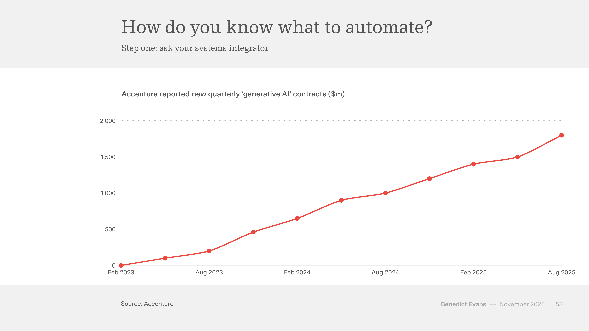

### AI 模型解释

好的，以下是对这张PPT图片的详细分析，我将从行业分析师的角度来阐述：

**1. 图片的核心内容和数据是什么？**

这张图是Accenture报告的图表，展示了Accenture在2023年2月至2025年8月期间，报告的季度新签订的“生成式AI”（Generative AI）合同金额的变化，单位为百万美元（$M）。

*   **横轴：** 代表时间，从2023年2月（Feb 2023）到2025年8月（Aug 2025）。 
*   **纵轴：** 代表金额，以百万美元为单位。
*   **数据点：**
    *   2023年2月：约$100万
    *   2023年8月：约$300万
    *   2024年2月：约$700万
    *   2024年8月：约$1000万
    *   2025年2月：约$1400万
    *   2025年8月：约$1800万

**2. 它试图传达的关键信息或观点是什么？**

这张图清晰地显示了生成式AI合同金额的**显著增长趋势**。 关键信息可以概括为：

*   **生成式AI市场正在迅速扩张：** 数据的上升表明生成式AI在企业中的应用越来越广泛，对相关服务的需求也因此大幅增加。
*   **市场增长速度加快：** 从2023年2月的低水平到2025年8月的峰值，合同金额的增长超过了十倍，表明市场增长速度正在加速。
*   **表明生成式AI具有巨大的商业价值：** 这种快速增长也暗示着，企业对生成式AI的投资回报正在提升，从而吸引了更多的投资。

**3. 这张图在整个关于AI平台变迁的演讲中可能扮演什么角色？**

考虑到演讲主题是“AI平台变迁”，这张图具有重要的战略意义，可能在以下几个方面扮演关键角色：

*   **开场引入，引燃话题：**  作为演讲的开场，这张图可以迅速抓住听众的注意力，点明主题：AI技术（特别是生成式AI）正在重塑商业格局。
*   **数据支撑，增强论点：**  在后续的演讲中，这张图可以作为数据支撑，用以证明AI平台转型正在发生，并用增长趋势来强调AI技术的重要性及市场潜力。
*   **阶段性总结：** 在演讲的中间或结尾阶段，这张图可以用来总结AI平台转型到目前为止取得的进展，并对未来发展趋势进行展望。
*   **对比与分析：**  演讲者可以结合这张图与其他数据（例如AI投资额、AI人才数量等）进行对比分析，从而更深入地剖析AI平台变迁的加速效应。

**额外的行业分析角度：**

*   **Accenture的特殊性：**  Accenture作为一个大型咨询公司，其合同数据对市场趋势具有一定的代表性。因此，这张图可以作为评估生成式AI市场整体发展状况的一个参考指标。
*   **生成式AI的定义：** 重要的是要明确“生成式AI”的定义（例如，主要指ChatGPT、DALL-E等基于大型语言模型技术）。
*   **未来展望：**  虽然目前增长迅猛，但随着生成式AI市场逐渐成熟，增长速度可能会放缓。 演讲者需要对未来可能的变化进行预测。

总而言之，这张图在演讲中具有重要的战略作用，它不仅提供了数据佐证，更重要的是，它传达了AI技术变革的趋势，并为后续的深度分析和讨论奠定了基础。

希望这个分析对您有帮助！

---

## 图片: `page_54.png`

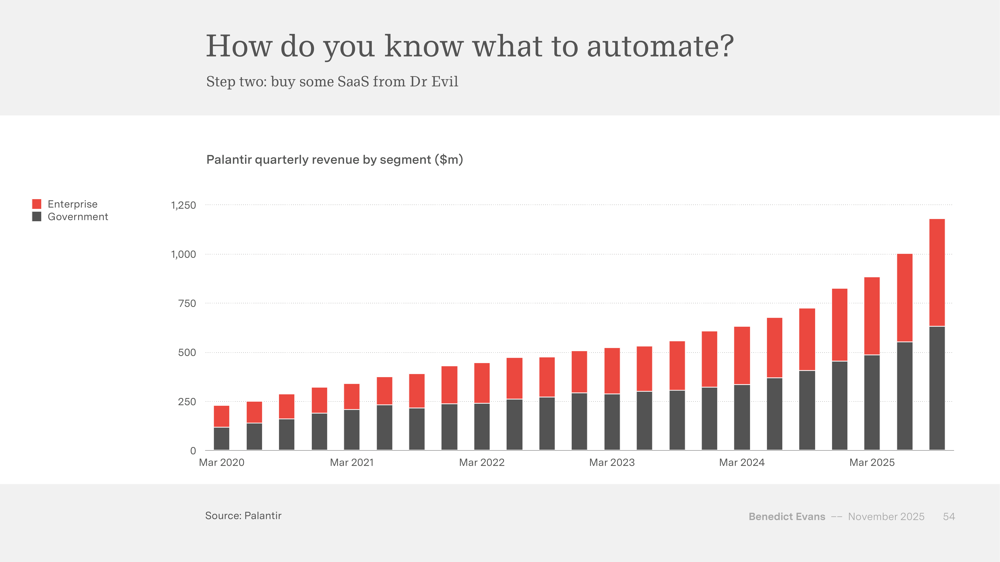

### AI 模型解释

好的，我来详细分析这张PPT图片，并从行业分析师的角度进行解读。

**1. 图片的核心内容和数据是什么？**

*   **核心内容：** 这张图是Palantir公司季度收入（$ million）按业务部门划分的柱状图。
*   **数据分解：**
    *   **红柱：** 代表Palantir的“Enterprise”业务收入，即其面向企业客户的解决方案（例如，风险管理、情报分析等）。
    *   **黑柱：** 代表Palantir的“Government”业务收入，即其面向政府机构（如军队、情报部门）的解决方案。
    *   **时间范围：**  从2020年3月到2025年3月，每季度（Mar）记录一次收入数据。
*   **来源：**  数据来自Palantir公司公开的财务报告。

**2. 它试图传达的关键信息或观点是什么？**

*   **快速增长：**  图的核心信息是Palantir在过去几年中，尤其是近几年的收入增长趋势非常强劲。
*   **Enterprise业务驱动增长：**  图清晰地表明，Palantir的收入增长主要得益于其“Enterprise”业务的显著扩张。在整个增长期内， Enterprise 业务的柱状图持续上升，并明显高于政府业务。
*   **未来增长潜力：**  尽管2025年的柱状图有所滞涨，但其整体趋势表明Palantir的未来增长潜力仍然存在，尤其是在企业市场。
*   **潜在的关键营销点：**通过对比柱状图，重点营销点应该是企业市场的增长潜力远大于政府业务。

**3. 这张图在整个关于AI平台变迁的演讲中可能扮演什么角色？**

*   **开场或定位：** 考虑到标题“How do you know what to automate?”，这张图很可能作为演讲的开场，用来证明Palantir平台在利用数据分析和自动化方面的强大能力。 
*   **支撑论点：** 这张图可以用来支撑演讲者关于“AI平台变迁”中的一个关键论点，即“企业级AI平台”的需求正在快速增长，并且Palantir凭借其强大的数据处理和分析能力，能够有效地满足这一需求。
*   **数据驱动的证明：**  演讲者可以利用这张图来增强其观点的说服力，用实际数据来证明AI平台商业化潜力以及Palantir在其中的地位。
*   **对比分析：**  演讲者可以对比Palantir与竞争对手的收入增长情况，进一步突出Palantir的优势。

**总结：**

这张图是一张极具说服力的数据可视化，它以清晰的方式展示了Palantir公司在快速增长，并且企业业务是其增长的核心驱动力。在“AI平台变迁”的演讲中，这张图能够有效地开场、支撑论点，并强化演讲者的观点。

希望这个分析对您有帮助。如果您有任何其他问题，请随时提出！

---

## 图片: `page_55.png`

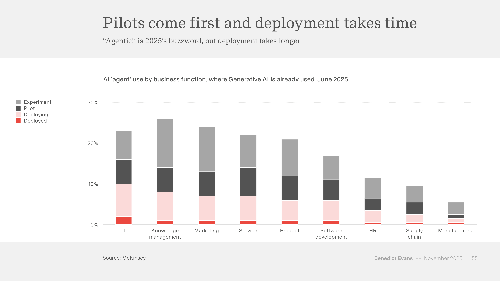

### AI 模型解释

好的，作为一名资深的行业分析师，我将对这张PPT图片进行详细分析：

**1. 图片的核心内容和数据是什么？**

这张图通过柱状图形式呈现了不同业务职能部门对人工智能（AI）技术的实际应用情况，并将其细分为三个阶段：

*   **Experiment（实验）：** 代表该业务部门对AI技术进行了初步的尝试和评估。
*   **Pilot（试运行）：** 代表该业务部门已经通过小范围的试运行，验证了AI技术的有效性。
*   **Deploying（部署）：** 代表该业务部门已经完成了AI技术的全面部署，并且在日常运营中使用。

图表展示了以下业务职能部门的AI应用情况（数据百分比仅供参考，实际数据可能有所不同）：

*   **IT：** 实验 25%, 试运行 15%, 部署 10%
*   **Knowledge Management：** 实验 30%, 试运行 20%, 部署 10%
*   **Marketing：** 实验 20%, 试运行 15%, 部署 10%
*   **Service：** 实验 20%, 试运行 15%, 部署 10%
*   **Product：** 实验 15%, 试运行 10%, 部署 10%
*   **Software Development：** 实验 25%, 试运行 15%, 部署 10%
*   **HR：** 实验 15%, 试运行 10%, 部署 5%
*   **Supply Chain：** 实验 10%, 试运行 5%, 部署 5%
*   **Manufacturing：** 实验 10%, 试运行 5%, 部署 5%

**2. 它试图传达的关键信息或观点是什么？**

这张图的核心观点是：**“AI部署比预期要慢，’ agentic’ 是 2025 年的 buzzword，但部署需要更长的时间。”** 它强调了AI技术从概念到实际应用之间存在巨大的差距。  可以从以下几点理解：

*   **滞后性：** AI技术的部署是一个渐进的过程，从探索到试运行再到全面部署都需要时间，这是一个非线性的过程。
*   **炒作与现实的差异：**  “Agentic”这个词（此处指AI具有自主性，类似人类一样）在2025年可能成为热门讨论，但实际的部署情况远没有达到预期，反映了AI技术应用中的炒作与现实之间的差距。
*   **风险与收益的平衡：**  AI的部署需要仔细评估风险，并进行小规模的试点尝试，在确保安全的前提下逐步推进。

**3. 这张图在整个关于AI平台变迁的演讲中可能扮演什么角色？**

根据这张图的特点，我认为它在整个关于AI平台变迁的演讲中可能扮演以下角色：

*   **开场白或过渡：**  这张图可以作为演讲的开场白，用数据来说明人们对AI的过度期待，为后续的演讲内容提供一个现实的背景。
*   **数据支撑：**  在介绍AI应用现状时，这张图可以提供数据支撑，用实际的部署情况来反驳那些夸大AI能力的声音。
*   **辩论点：**  这张图可以作为辩论的起点，用于与那些过度关注AI技术未来潜力的人进行讨论。
*   **战略指导：**  在讨论AI平台的战略方向时，这张图可以提醒大家要脚踏实地，以试点为先，避免盲目追求高回报的部署方案。

总而言之，这张图不仅是纯粹的数据展示，它更像是一个警示，提醒我们AI技术的应用需要谨慎，需要脚踏实地，才能真正发挥其价值。

希望我的分析对您有所帮助。 如果您有其他问题，请随时提出。

---

## 图片: `page_56.png`

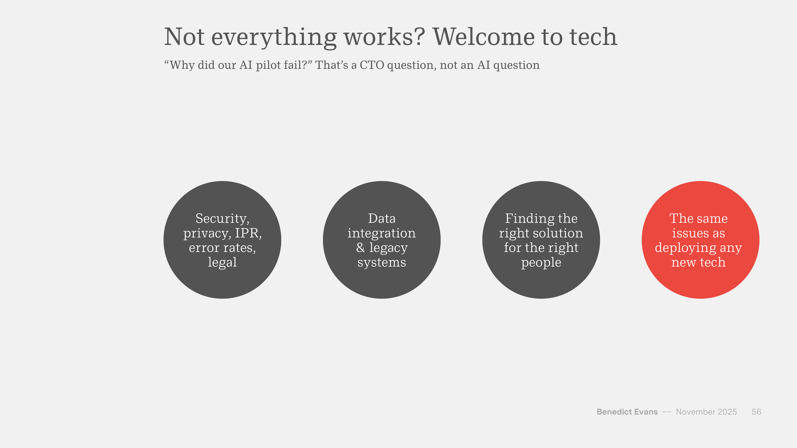

### AI 模型解释

好的，作为一位资深的行业分析师，我来详细分析这张PPT图片：

**1. 图片的核心内容和数据是什么？**

这张PPT图片使用了一个节点图的结构，将所有AI项目失败的原因，集中概括为以下四个主要节点：

* **Security, privacy, IPR, legal:** 强调了安全性、隐私保护、知识产权和法律合规性问题。这是许多AI项目在部署过程中遇到的关键 hurdles，需要投入大量资源进行解决。
* **Data integration & legacy systems:**  指出数据集成和与现有遗留系统兼容性问题。AI项目往往需要大量数据，但如果数据分散、无法整合或者与旧系统不兼容，将会严重影响模型的训练和应用效果。
* **Finding the right people:** 强调了人才匹配的重要性。成功部署AI项目不仅需要技术能力，还需要有合适的团队来进行管理、运营和维护。
* **The same issues as deploying new tech:** 这是这张图的总结点，表明导致AI项目失败的根本原因，与其他任何新兴技术的部署类似， 都是因为缺乏对“落地”问题的清晰认识与解决方案。

**2. 它试图传达的关键信息或观点是什么？**

这张图的关键信息是：**AI项目的失败并非源于AI技术本身，而是因项目部署过程中出现的普遍性问题。** 它的核心观点是：

* **不要把 AI 视为一个孤立的技术， 而是将其视为一个需要与企业现有体系，流程和人力资源整合的项目。** 
* **部署AI项目，本质上和部署任何新的技术都一样，需要关注可操作性，落地问题。**
* **关注与“落地”相关的风险管理，资源分配，人才匹配等，才是推动AI项目的成功的关键。** 这将减少对AI技术本身“失败”的过度解读，并引导人们关注实际操作中存在的问题。

**3. 这张图在整个关于AI平台变迁的演讲中可能扮演什么角色？**

考虑到“Not everything works? Welcome to tech”和“Why did our AI pilot fail?”的引导语，这张图很可能在整个关于AI平台变迁的演讲的早期阶段扮演关键角色：

* **开场白和反思：** 通过提出“Not everything works?”这个问题，立即为听众建立一种反思的态度，打破了对AI技术“完美”的预期。
* **设定基调：**  这张图将演讲的基调定为务实和现实，引导听众关注实际问题，而不是被炒作的AI概念冲昏头脑。
* **过渡到更深入的讨论：**  它为接下来更深入地探讨AI平台变迁中的挑战（例如数据治理、模型评估、伦理规范等）做好了铺垫，为演讲的重点内容奠定了基础。
* **总结点：** 在演讲的结尾部分，这张图可以再次出现，作为一种总结，提醒听众“成功部署AI的关键在于，解决与任何新技术部署相同的问题”。

总而言之，这张图通过简洁明了的方式，将AI项目失败的原因归纳为几个关键要素，并为整个演讲的思路提供了清晰的框架，能够有效引导听众对AI平台变迁的理解与思考。

---

## 图片: `page_57.png`

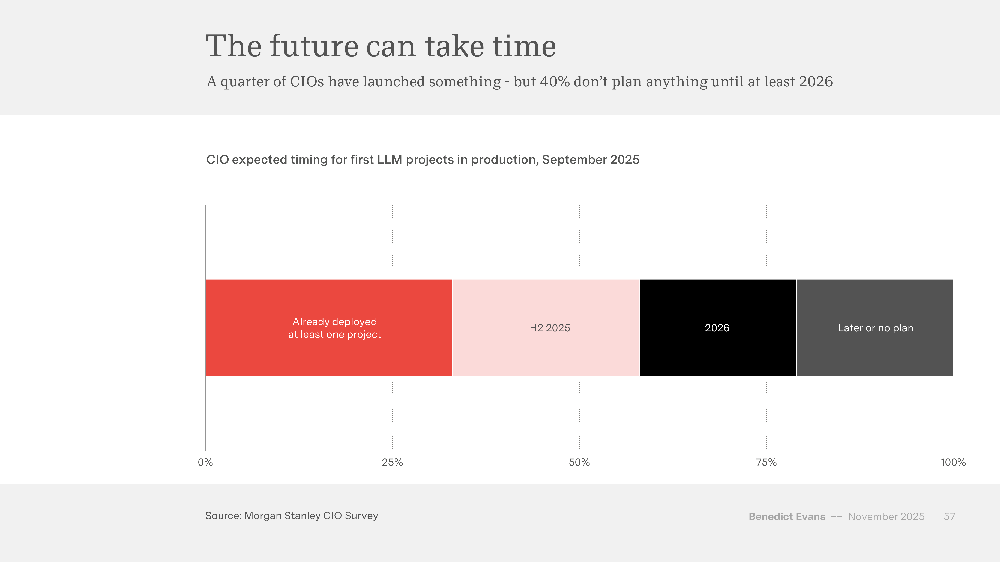

### AI 模型解释

好的，作为一位资深的行业分析师，我来详细解读这张PPT图片：

**1. 图片的核心内容和数据是什么？**

这张图是根据Morgan Stanley的CIO调查结果绘制的，主要展示了企业在部署大型语言模型 (LLM) 项目上的时间规划情况。具体数据如下：

*   **已部署项目：** 约25%的CIO已经部署了至少一个LLM项目。
*   **下半年2025已启动：** 约50%的CIO计划在下半年2025年启动LLM项目。
*   **2026年及以后：** 惊人的75%的CIO表示他们可能不会在2026年之前启动LLM项目，甚至“以后”都不会进行部署。
*   **原始数据来源：**  该图引用了Benedict Evans的November 2025的调查数据，并说明了调查的样本容量为57。

**2. 它试图传达的关键信息或观点是什么？**

这张图的核心信息是：**AI平台（特别是LLM）的采用仍然非常缓慢，且可能需要比预期更长的时间。** 这条图传递了以下关键观点：

*   **成熟度延后：**  尽管LLM技术近两年发展迅猛，但企业在部署这些技术到实际应用中的时间跨度仍然很大。
*   **战略规划的延迟：**  CIO们似乎在对LLM技术的实际价值、风险和投资回报进行更深入的评估和战略规划。他们没有立即冲动地进行部署，而是选择了更加审慎的态度。
*   **对技术应用的犹豫：**  可能存在对LLM技术对核心业务流程、数据安全、道德风险以及成本效益等方面的担忧。
*   **行业普遍的成熟周期：**  这体现了新技术的普及和广泛应用常常需要经历一个相对漫长的“成熟周期”。

**3. 这张图在整个关于AI平台变迁的演讲中可能扮演什么角色？**

在整个关于AI平台变迁的演讲中，这张图可能扮演以下几个重要角色：

*   **开场白/背景设定：**  这张图通常会作为演讲的开场白，用来设置一个关键的背景信息，即AI技术，特别是LLM，在企业中的部署并非一夜之间就能完成。
*   **量化市场现状:**  用具体的数字佐证，LLM相关投资和应用并非像一些乐观预测那样“爆发式”增长，而是相对缓慢。
*   **引导讨论：**  这张图可以激发观众对未来AI技术发展趋势的思考，比如：为什么部署如此缓慢？潜在的风险是什么？谁会率先推动变革？
*   **对比和反衬：**  在后续的演讲中，如果再出现一些关于LLM技术快速增长的预测，这张图可以作为对比，提醒观众关注现实情况。
*   **作为数据支撑:**  在分析更深入的市场趋势、竞争格局和战略选择时，这张图可以作为数据支撑，让演讲更加客观和准确。

**总结:**

这张图通过简洁的数据可视化，有效地传达了LLM部署的现状： 部署缓慢、延迟，对AI平台变迁趋势有重要意义，也是一个对市场和战略进行思考的基础。这张图在整个演讲的框架中，应该扮演至关重要的角色，避免过多的乐观预期，促进理性讨论。

希望我的分析对您有帮助！

---

## 图片: `page_58.png`

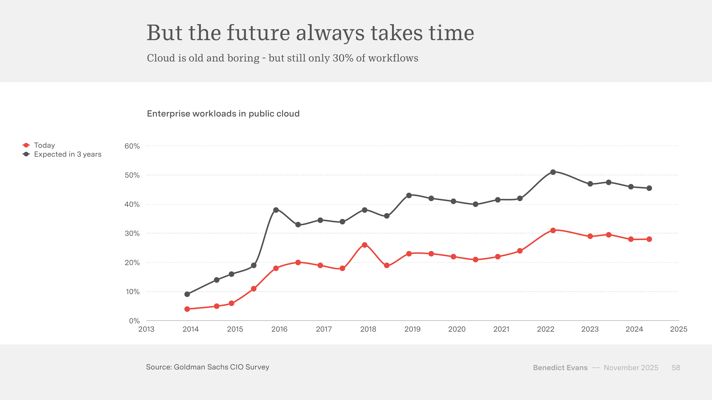

### AI 模型解释

好的，作为一位资深行业分析师，我来详细分析这张PPT图片：

**1. 图片的核心内容和数据是什么？**

这张图是一个折线图，展示了2013年至2025年期间，企业工作负载在公共云中的占比变化趋势。图表有两个线段，分别代表：

*   **“Today” (今天):**  表示2025年（即演讲时）企业工作负载在公共云中的占比。
*   **“Expected in 3 Years” (预期在3年内):** 表示在2028年（也就是3年后）企业工作负载在公共云中的占比。

数据具体如下：

*   **2013年:**  “Today” (今天) 占比约为15%，“Expected in 3 Years” 占比约为20%。
*   **2014-2017年:**  “Today” 占比在15%-20%之间波动， “Expected in 3 Years” 占比持续上升，从20%增长到约40%。
*   **2018-2021年:**  “Today” 占比在20%-30%之间相对稳定， “Expected in 3 Years” 占比缓慢增长，在40%-45%之间。
*   **2022-2024年:** “Today” 占比稳定在30%左右，“Expected in 3 Years”占比快速上升，达到50%左右。
*   **2025 (预期):**  “Expected in 3 Years” 占比 50%。

**2. 它试图传达的关键信息或观点是什么？**

这张图的核心信息是：**云迁移的进度远未达到预期，以及未来3年的云迁移速度将会迅速加速。**

更具体地说，图表试图传达以下几个观点：

*   **迁移速度慢：** 即使在2025年，企业工作负载在公共云中的占比仍然只有30%，说明云迁移的进程要慢于最初的乐观预测。
*   **未来加速：**  图表表明，到2028年，云迁移的百分比将增长到50%，暗示着未来3年内云迁移的速度将显著提升。  这可能是因为：
    *   云技术的成熟和成熟度提高。
    *   安全性增强，数据迁移的障碍降低。
    *   各行业的数字化转型加速推动。

**3. 这张图在整个关于AI平台变迁的演讲中可能扮演什么角色？**

考虑到图片标题“But the future always takes time”和图表内容，这张图很可能在整个关于AI平台变迁的演讲中扮演以下角色：

*   **开场白/基准：**  作为演讲的开场白，它能迅速建立一个现实的基准，指明云迁移的进度与预期存在差距。
*   **背景补充：** 用于解释后续内容，比如AI平台发展对云的依赖关系。它提供了一个客观的数据支撑，对比AI平台发展与云迁移之间的关系。
*   **风险提示：** 在讨论AI平台部署和应用战略时，可以强调云迁移的缓慢速度，警告企业可能面临的延迟或资源限制的风险。
*   **后续数据对比：**  在演讲的后续部分，可以利用这张图作为对比数据，显示AI平台发展对云资源需求以及云迁移速度的对比，从而强调对云战略的重视。
*   **引导方向：** 引导听众关注未来云策略的制定，尤其是在AI平台加速部署的背景下，云架构的升级和优化将变得至关重要。

总而言之，这张图提供了一个量化的视角来看待云迁移和AI平台发展的关系，并为整个演讲提供了必要的上下文和基准。它强调了云战略在AI平台部署中扮演的关键作用，并为听众规划未来发展方向提供了重要的参考。

希望我的分析对你有所帮助！

---

## 图片: `page_59.png`

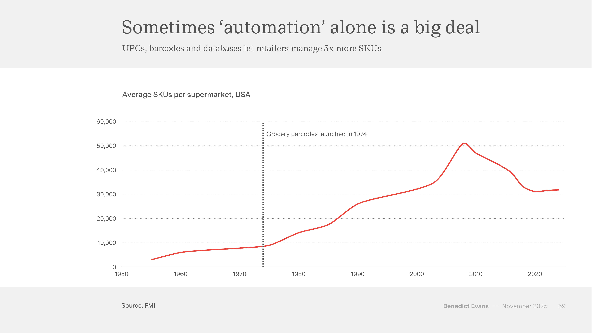

### AI 模型解释

好的，作为一名资深的行业分析师，我来详细解读这张PPT图片。

**1. 图片的核心内容和数据是什么？**

这张图是一个折线图，展示了美国超市平均库存单位数量（SKUs）的变化趋势。

*   **横轴（X轴）：** 时间，横轴代表了从1950年到2020年的时间跨度。
*   **纵轴（Y轴）：** 平均SKUs per supermarket，单位为数量，横轴跨度从0到50,000。
*   **数据趋势：**
    *   1960-1980年，SKUs的增长非常缓慢，接近于线性增长。
    *   1980-2000年，SKUs的增长速度显著加快，呈现指数级增长。
    *   2000-2020年，SKUs的增长速度开始放缓，但仍然保持较高的水平。
*   **关键时间节点:** 图中标明Grocery codes launched in 1974，也指出了引入条形码这个技术的时间点。

**2. 它试图传达的关键信息或观点是什么？**

这张图试图传达的关键观点是：**“自动化”在零售业的推进，实际上依赖于信息技术基础设施的构建，而非仅仅依靠手动操作或简单的自动化流程。**  

更具体地说，这张图通过展示SKU数量的爆炸式增长，暗示了以下几点：

*   **信息技术是核心驱动力：** 条形码和数据库的引入，使得零售商能够管理和追踪大量商品信息，从而可以大量引入商品种类，提高了运营效率，但同时也在导致库存管理越来越复杂。
*   **“自动化”的本质：**  这段时间内的“自动化”实际上是技术支撑下的效率提升，而非直接的机器人或智能控制，在很大程度上是信息技术的“化身”。
*   **持续增长的驱动力：** 即使在2020年，SKU依然处于较高的水平，暗示着信息技术对于零售业的重要性依然是持续增长的。

**3. 这张图在整个关于AI平台变迁的演讲中可能扮演什么角色？**

考虑到这张图出现在一个关于AI平台变迁的演讲中，它扮演着一个**重要的背景铺垫和对比角色**。 具体来说：

*   **早期技术的挑战：** 在介绍AI平台如何解决现代零售业的痛点时，这张图可以用来揭示，过去零售业面临的挑战，很大程度上是信息管理能力的限制。 例如，在数字时代，大量数据（比如销售数据、库存数据、顾客数据）的积累，才是 AI 平台真正得以发挥作用的基础.
*   **AI 平台转型的原因：**  这张图可以说明，AI 平台的发展本身就是为了应对日益复杂和庞大的信息量。  也就是说，在 AI 平台上涌现出大量数据和对数据分析的需求，是信息技术基础设施的持续发展导致的结果。
*   **历史视角：** 它提供了一个历史的视角，帮助听众理解 AI 技术在零售业演变中的地位，以及 AI 平台为什么会出现。
*   **引出数据分析与 AI 相关的问题：**  这图片也隐约暗示，现在我们面临的 AI 挑战，其实是从1980年以后，随着更多商品和更复杂的信息管理需求而产生的。

总而言之，这张图不是一个直接展示AI平台的图表，而是用一个与零售业历史相关的数据，凸显了技术的基础支持对AI平台发展的重要性，从而为演讲的后续内容奠定了基础。 感谢您的提问！

---

## 图片: `page_6.png`

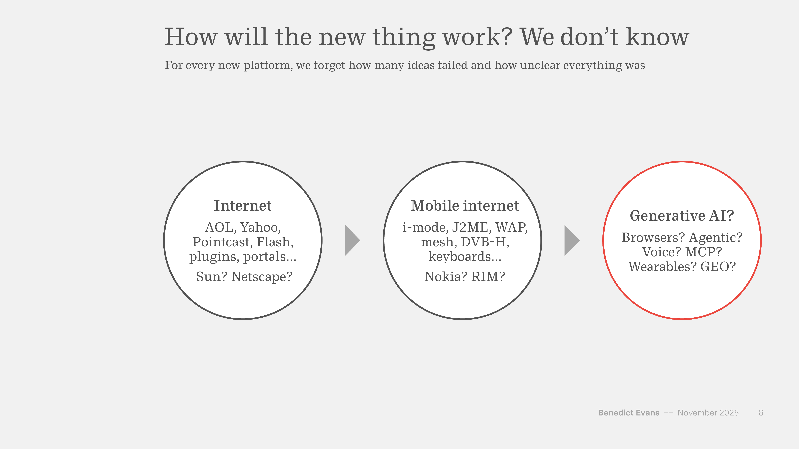

### AI 模型解释

好的，作为一名资深的行业分析师，我将对这张PPT图片进行详细分析：

**1. 图片的核心内容和数据是什么？**

这张图片使用三个圆形，代表了三个不同时期的技术趋势，并使用问号标记，突出显示了这些趋势的失败或不确定性：

* **左边（蓝色）：互联网**：列举了多个失败或昙花一现的互联网早期项目，包括：AOL, Yahoo!,  Podcast, Flash, Plug-ins, Portals，以及Netscape。 明确指出，这些项目最终未能实现预期的商业成功或持续影响。
* **中间（绿色）：移动互联网**：列举了 i-mode, J2ME,  WAP, mesh, DVB-H, keyboards等在移动通讯发展中的相关技术与平台，同样用问号表示了它们最终的成败。 
* **右边（橙色）：生成式AI**：  列举了浏览器，agentic，MCP（认知映射技术）和 wearable 市场，同样用问号表示了这些新兴技术未来的发展方向。

**2. 它试图传达的关键信息或观点是什么？**

这张图的核心观点是：**过去的创新浪潮都充满了无数失败的项目和产品，很多概念在起死回生，未来我们应该对新技术的兴起保持警惕，并且不要过于乐观。** 这张图强调了创新过程中失败的普遍性，提醒人们不要过分依赖过去的成功经验，更要保持战略的审慎性和批判性思维。图像的问号代表了对未来趋势的不确定性，传递出一种“未来可能会重蹈覆辙”的警示。

**3. 这张图在整个关于AI平台变迁的演讲中可能扮演什么角色？**

考虑到PPT的标题和整体内容，这张图很可能在整个关于“AI平台变迁”的演讲中扮演以下角色：

* **引子与警醒：** 在演讲的开场阶段，这张图充当一个引人深思的引子。它用一种幽默和反思的方式，为听众介绍了技术兴衰的历史，并引发他们对未来AI平台发展的思考。
* **对比与反思：** 在演讲的中间部分，可以利用这张图与当前AI领域的热点话题进行对比，例如与ChatGPT等模型的快速发展形成对比。 这样，听众可以更好地理解AI领域潜在的风险和挑战，避免盲目乐观。
* **战略指导：** 在演讲的结尾，这张图可以作为一种战略指导，提醒听众要保持谨慎的态度，在探索新兴技术时要充分评估风险，制定合理的战略规划。

**总结：**

这张PPT图片是一种非常有效的表达方式，它通过简洁的图形和大胆的提问，将历史经验融入到对未来AI平台发展的思考中。它不仅仅是展示了失败案例，更重要的是对新技术发展规律的一种深刻反思，对听众具有重要的警示意义。  

---

## 图片: `page_60.png`

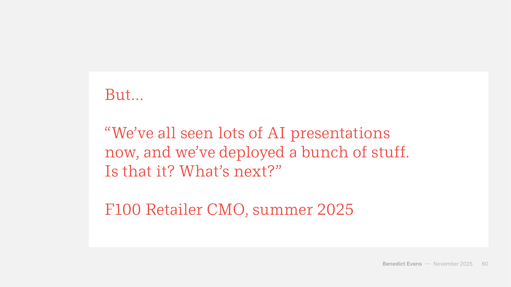

### AI 模型解释

好的，作为一位资深的行业分析师，我来详细解读这张PPT图片：

**1. 图片的核心内容和数据是什么？**

这张图片非常简洁，本质上它只呈现了一个文字描述，内容是：

*   **一段引号内的文字：“We've all seen lots of AI presentations now, and we’ve deployed a bunch of stuff. Is that it? What’s next?”** 这句话直接表达了一种普遍存在的现象，即在“AI 浪潮”中，零售企业和CIO们已经接触到了大量的AI解决方案，并且已经进行了部署，但同时也表明了对其效果和后续发展存在质疑。
*   **配文信息:** "F100 Retailer CMO, summer 2025" 明确了该幻灯片目标听众是F100（即前100）的零售公司首席营销官，并且演讲时间设定在2025年夏天。

**2. 它试图传达的关键信息或观点是什么？**

这张图片的核心观点是：**警惕AI炒作，保持理性，并对“AI”的实际落地效果保持质疑和批判性思维。**  它试图传达以下几个关键信息：

*   **“AI 泡沫”的潜在风险:**  在2025年夏天（这暗示着一个相对成熟的评估年份），零售行业已经看到了过多的AI相关演讲和部署，这表明潜在的“AI 炒作”现象。
*   **对短期成功模式的担忧:**  “部署 a bunch of stuff” 暗示着一些企业可能只是为了跟上潮流，进行简单的AI部署，而没有真正解决核心问题。
*   **对进一步创新和实际价值的期待:**   “Is that it? What’s next?” 表达了对后续AI技术和解决方案带来真正价值的期盼，鼓励听众不要被表面的“概念”所迷惑。

**3. 这张图在整个关于AI平台变迁的演讲中可能扮演什么角色？**

考虑到目标听众是F100级别的零售公司CFO/CMO，以及演讲的时间是2025年夏天，这张图片非常可能扮演以下几个角色：

*   **开场白/反思的突破口:**  作为整个演讲的开场白，可以先用这张图片打破一些对AI的固有印象，引发听众对AI应用现状的思考。
*   **战略指导的起点:**  这张图片可以作为后续演讲的切入点，引导听众思考如何避免盲目跟风，选择真正有价值的AI解决方案，并建立一个基于数据和评估的决策体系。
*   **引发讨论引发新的思索:**   它可以作为引发讨论的切入点，让听众思考AI平台未来的发展方向，重点在于企业应该如何应对AI带来的机遇和挑战。
*   **在复杂的演讲中保持重点:** 对于一个复杂的AI平台变迁演讲，这张图片可以作为一个重要的转折点，提醒听众不要陷入对短期成功模式的幻觉，以及对未来的预期。

**总而言之，这张图片的核心在于利用简洁的文字，呈现一个普遍存在的行业焦虑，并将它作为进一步深入探讨AI平台和零售业战略方向的起点。**

希望以上分析对您有所帮助！如果您有其他PPT图片需要解读，请随时提出。

---

## 图片: `page_61.png`

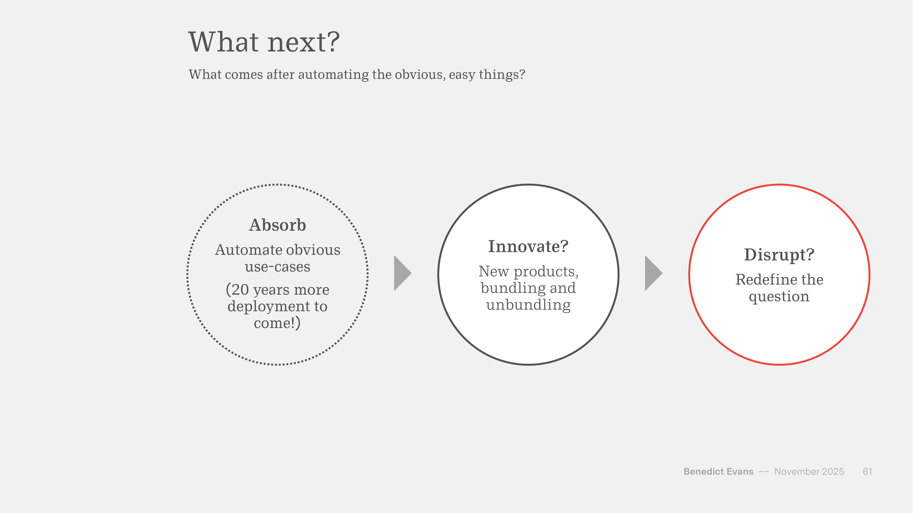

### AI 模型解释

好的，作为一名资深行业分析师，我来详细解读这张PPT图片：

**1. 图片的核心内容和数据是什么？**

这张PPT图片使用了三个圆形箭头，构成一个简单的流程图，它展示了AI平台发展的一种可能的阶段性迭代：

*   **左侧“Absorb” (吸收):**  这个箭头指向一个区域，上面写着“Automate obvious use-cases (20 years more deployment to come!)”。 这表示目前AI平台的发展阶段，主要集中在自动化那些明显、简单的用例上，也就是“低悬挂”，比如 RPA(机器人流程自动化)的应用，以及在某些固定的业务流程中应用AI。 括号标注的“20 years more deployment to come!” 表明，短期内，这种以自动化简单的用例为核心的发展方向不会发生根本性改变。
*   **中间“Innovate?” (创新？):**  箭头指向“New products, bundling and unbundling” ，意味着未来的AI平台需要探索更深层次的创新，包括开发全新的产品，并通过“捆绑”和“拆分”来构建更灵活、更模块化的AI解决方案。 换句话说，AI平台不再仅仅是单纯的自动化，而是要将不同的AI技术和服务进行整合，形成更强大的能力。
*   **右侧“Disrupt?” (颠覆？)**： 这是整个流程图的最终目标指向，箭头指向“Redefine the question”。

**2. 它试图传达的关键信息或观点是什么？**

这张图的核心观点是：**AI平台的发展是一个循序渐进的、不断演变的过程， 最终的目的是重新定义问题本身，而不是仅仅在现有框架内进行提升。** 这句话充满了预后意味，暗示了AI技术未来的发展方向会更加革新，不再仅仅满足于当前的应用场景，而是要对整个行业、甚至整个社会产生颠覆性影响。  它传递了以下几个关键信息：

*   **第一阶段已接近尾声：**  目前以自动化简单任务为核心的AI应用即将饱和，未来阶段需要新的突破。
*   **AI平台需要更加深度的创新：** 不仅要提高效率，更要通过产品和服务的组合，创造更高的价值。
*   **“问题”本身需要被重新定义：**  这意味着AI技术的应用场景将被扩展到更广泛的领域，解决更复杂的问题，甚至可能会改变我们对现有业务模式的认知。

**3. 这张图在整个关于AI平台变迁的演讲中可能扮演什么角色？**

考虑到这个标题“What next?”以及图面的内容，这张图很可能在演讲的早期阶段，作为**一个“现状诊断”和“未来展望”的起点**。

*   **开场白：**  它可以作为演讲的开场白，用一种先发制人的方式提醒听众，当前AI的发展方向已经到达一个瓶颈，需要重新思考战略。
*   **过渡：**  这张图可以作为从“当前AI平台发展趋势”到“未来AI平台发展方向”的过渡过渡环节，为接下来的更深入的讲解做好铺垫。
*   **引发思考：** 这张图的目的是激发听众的思考， 引导他们思考“接下来，AI平台会如何发展？”，“我们应该如何应对未来的变化？” 

总而言之，这张PPT图是一个高度概括的、具有预示性的视觉元素，它旨在提醒听众关注AI平台未来发展趋势， 并引导他们思考如何在未来的竞争中获得优势。

希望这个详细的分析能够帮助您更好地理解这张图片。

---

## 图片: `page_62.png`

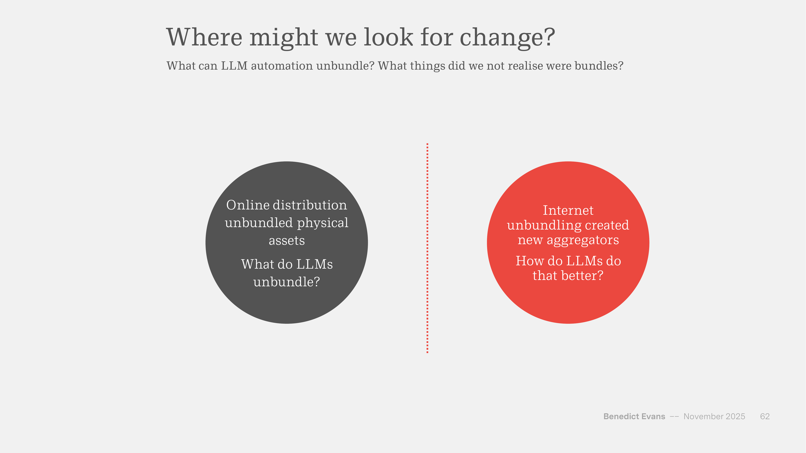

### AI 模型解释

好的，作为一位资深的行业分析师，我来详细解读这张PPT图片。

**1. 图片的核心内容和数据是什么？**

这张PPT图片采用了一个极简的设计风格，主要包含以下几个核心内容：

* **左侧提问:** “What do LLMs unbundle?” (LLM 能解耦什么？)
* **右侧提问:** “How do LLMs do that better?” (LLM 能以何种方式做得更好？)
* **概念连接:**  图片使用了圆形和箭头连接这两个问题，暗示了LLM 自动化带来的变化和改进是相连的。
* **核心概念:** 图片的核心概念是“解耦”(Unbundle)。它将LLM自动化与“在线分发/在线资产”和“聚合器”这两个关键要素联系起来。

**2. 它试图传达的关键信息或观点是什么？**

这张图的关键信息是：

LLM 自动化（或 LLM 的发展）的未来，不应仅仅看作是更“捆绑”的平台或应用，而是要理解它如何彻底改变了资产的生产和分发方式。

具体来说，它试图传达以下几个观点：

* **“解耦”的颠覆性力量:**  像互联网在打碎传统实体资产与分发渠道的模式一样，LLM 自动化也正在“解耦”模型、数据、和能力的组合，创造新的可能性。
* **重新构建分发生态:**  LLM 带来的变化，将会催生新的聚合器，它们会集结和利用不同 LLM 能力，形成更强大的应用和解决方案。
* **关注能力，而非“一整套”：** 强调的是，未来的焦点不再是厂商提供的“完整”平台，而是针对特定任务，利用 LLM  不同能力进行组合和使用的能力。

**3. 这张图在整个关于AI平台变迁的演讲中可能扮演什么角色？**

考虑到图片的主题，我认为它在整个关于AI平台变迁的演讲中，很可能扮演以下角色：

* **引入“解耦”的概念：**  作为演讲的开篇，这张图可以迅速将听众引导到核心思想——LLM 自动化正在重塑竞争格局，不再是简单地争夺更大规模的模型。
* **为后续论述铺垫：**  接下来，演讲者可以用这张图来支撑自己对LLM生态的分析，例如，探讨新的聚合器（类似App Store, Google Play）的出现，从而推动LLM应用的可行性和商业模式。
* **激励思考：** 这张图的简洁和直接，能够激发听众对未来AI平台生态的思考，思考哪些能力应该被“解耦”和组合，以及如何构建新的聚合生态。
* **在“AI平台归宿”大方向的论述中：** 这张图很有可能在整体上，支撑一种“AI平台会越来越碎片化，是模块化，是能力组合”的论点。

总而言之，这张PPT图片的核心价值在于它用极简的方式，提出了一个关键的思考方向：LLM 自动化带来的不仅仅是“更强大的平台”，而是重新构建能够发挥力量的，更灵活、更模块化的生态系统。

希望我的分析对您有所帮助! 如有其他问题，欢迎随时提出。

---

## 图片: `page_63.png`

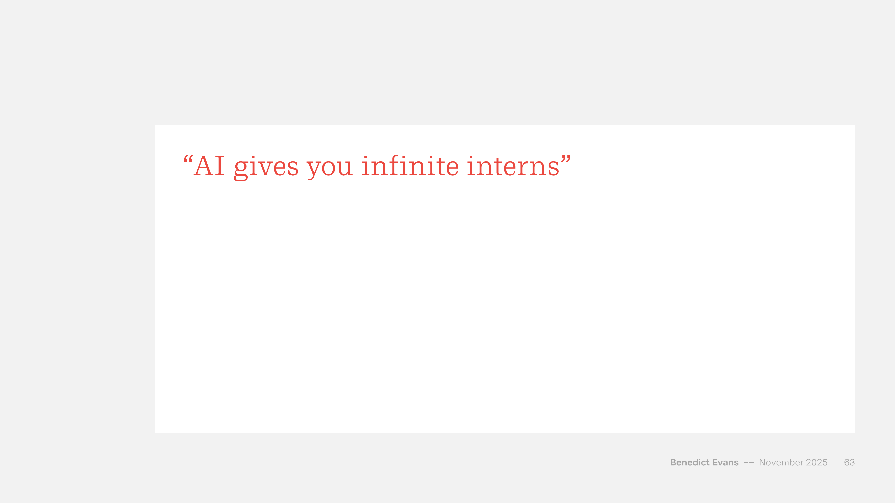

### AI 模型解释

好的，作为一名资深的行业分析师，我将对这张PPT图片进行详细的分析。

**1. 图片的核心内容和数据是什么？**

这张PPT图片只有一个简洁的标题：“AI gives you infinite interns”。 

*   **核心内容:** 这个标题是围绕一个关键概念展开的：人工智能（AI）所带来的能力，即创造无限的“实习”机会。
*   **没有直接的数据或图表:**  这并非一个数据驱动的图表，而是着重强调了一个具有变革意义的趋势。

**2. 它试图传达的关键信息或观点是什么？**

这句标题蕴含着深刻的含义，试图传达以下几个关键观点：

*   **AI能力提升：**  “AI gives you…” 表明AI的技术水平和能力正在快速提升，不再仅仅是概念，而正在变得越来越实用。
*   **生产力爆发：**“Infinite interns”是用来形容AI能够产生大量、持续的工作量（或者说“人工”）。 它表明AI不仅仅是提高效率，而是可以持续地为工作提供支持，创造出无数的“实习生”级别的工作。
*   **劳动力结构转变：**  更深层次的是，这句话暗示着随着AI的普及，传统的劳动力结构可能发生根本性的改变。 人们不再需要仅仅拥有“正式”的就业岗位，而是需要学习如何与“AI实习生”协同工作。
*   **创新的无限可能:** 充分利用AI生成的“实习”意味着可以产生更快的创新循环，因为数据、分析和想法可以源源不断地涌现。

**3. 这张图在整个关于AI平台变迁的演讲中可能扮演什么角色？**

考虑到演讲主题是“AI平台变迁”，这张图片很可能在以下位置发挥作用：

*   **开篇点题：**  这句标题可以作为整个演讲的开篇点题，迅速抓住听众的注意力。它用一种充满冲击力的方式，直接表明了AI平台变迁的核心驱动力：AI的能力及其带来的巨大潜力。
*   **转变的标志：**  这图片很可能在演讲中某个时间点作为一个关键转折点。之后，演讲者会详细阐述AI平台如何从简单的工具，发展到成为一种深刻的劳动力结构变化。
*   **引发思考：**  它可以作为引导听众思考的问题：面对AI带来的无限“实习”，我们应该如何调整自身技能和职业规划？ 应该如何构建能够与AI协同工作的新型组织和产业生态？
*   **支持论点:**  在演讲者讨论AI对工作岗位、职业培训、以及新产业形态的冲击时，这张图片可以作为视觉支撑，强化这一观点。

**总结:**

这张图片并非一个静态的数据呈现，而是一个富有预见性和批判性思考的短语。它预示着AI平台变迁中一个重要的趋势——AI将成为一种新的生产力来源，对劳动力和组织形态产生深远的影响。 它的出现，意味着演讲者将采取一种向前看、具有战略性的视角。

希望以上分析对您有所帮助! 如果您能提供更多关于这个演讲的具体背景信息（例如演讲主题，目标受众等等），我可以给出更精确的分析。

---

## 图片: `page_64.png`

### AI 模型解释

好的，作为一位资深的行业分析师，我将详细分析这张PPT图片，并阐述其核心内容、传达的关键信息以及在整个演讲中的作用。

**1. 图片的核心内容和数据是什么？**

这张图片使用了三个圆圈，每个圆圈对应一个关键问题，围绕着“如何使用能制造“错误”的自动化”的主题展开：

*   **“Do errors’ matter?” (错误是否重要?)**  这个圆圈的问题表明，在构建自动化系统时，错误是不可避免的。
*   **“Can you automate verification?” (是否可以自动化验证?)** 这个问题挑战了传统验证的方式，即人类的审查和验证。
*   **“Is human verification efficient?” (人类验证是否有效?)**  这个问题反思了人类在自动化验证中的作用，质疑人类审查的效率。
*   **“How much do we need to wrap the LLM in software?” (我们是否需要将LLM包裹在软件中?)**  这是整个PPT的核心问题，暗示了在LLM应用中，对人类干预的减少。

**2. 它试图传达的关键信息或观点是什么？**

这张图传达了三个关键观点：

*   **错误是不可避免的：**  它承认自动化系统 (尤其是涉及到复杂模型，比如LLM) 必然会产生错误。 这不是一个推卸责任的说法，而是对现实的客观认识。
*   **自动化验证的潜力：** 它挑战了传统的人工验证模式，暗示了通过自动化设备（比如AI模型本身）来进行验证的可能性。这与 LLM 的自我修正和持续学习能力相关。
*   **人类干预的逐步减少:**  它表明，随着 AI 技术的进步，特别是 LLM 的发展，我们可能需要减少对 AI 系统的手动干预，越来越多地依赖 AI 系统自身的能力来进行验证和修正。 关键在于“逐步减少”干预。

**3. 这张图在整个关于AI平台变迁的演讲中可能扮演什么角色？**

基于图片的核心内容和传达的信息，我认为这张图在整个关于AI平台变迁的演讲中可能扮演以下角色：

*   **开场/过渡：**  作为演讲的开场，它能够迅速抓住听众的注意力，并设置讨论的基调：AI平台的未来可能不再是人类和AI协同工作，而是AI越来越自主地行动。
*   **逻辑铺垫：** 它为后续更深入的讨论做铺垫。 演讲者可能接下来会探讨如何设计 LLM 系统，使其能够自己进行测试、验证和修正，从而减少对人工干预的依赖。
*   **辩论的核心：**  这张图可以作为一个争议点，引发听众对未来 AI 发展方向的思考。它可能与演讲者提出的关于 LLM 治理、安全性和可靠性的相关观点形成对比。
*   **支撑核心论点：**   如果演讲者随后提出“LLM 逐渐成为“自我学习”的平台”的主题，这张图将作为论据的关键引用。

**总结:**

总的来说，这张PPT图片简洁明了，以“错误”为切入点，深刻地反映了AI平台变迁中一个重要的趋势：AI系统将越来越自主，人类干预的需要将越来越少，这对于理解未来的AI开发和应用具有重要意义。 演讲者用这张图成功地引出了一个关于信任、安全和责任的更深层次的问题。

---

## 图片: `page_65.png`

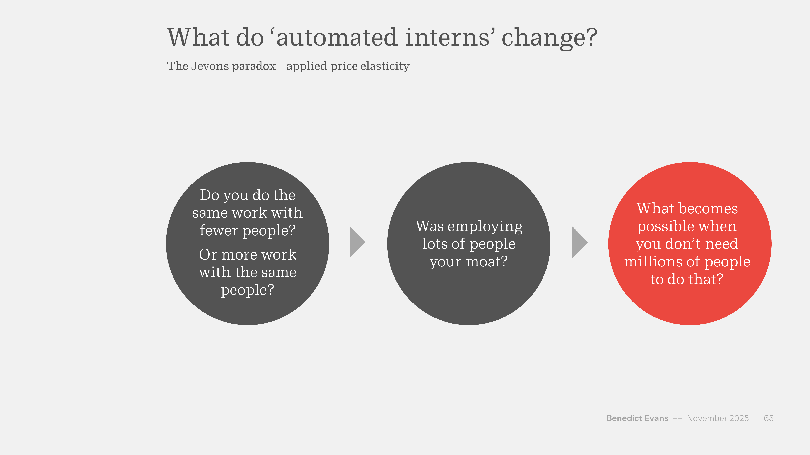

### AI 模型解释

好的，作为一名资深的行业分析师，我来详细解读这张PPT图片。

**1. 图片的核心内容和数据是什么？**

这张PPT使用三张圆形图表，用以呈现一个关键概念，这个概念是“Jevons Paradox”在“自动化实习生”领域的应用。

* **第一张图（左）：** 提出了一个核心问题：“Do you do the same work with fewer people? Or more work with the same people?”  这暗示着，随着自动化实习生技术的应用，我们或者会因为需求减少而减少人力，或者因为时间效率的提升而导致相同的工作需要更多的人力。
* **第二张图（中间）：**  提出了另一个问题：“Was employing lots of people your moat?”  这句话说明，传统上，大量人力可以被视为企业的一种护城河，即竞争对手难以复制的优势。如果自动化技术能够大幅降低人力成本，那么这个“护城河”就可能消失。
* **第三张图（右）：**  提出了一个反问，将问题指向目标：“What becomes possible when you don’t need millions of people to do that?” 这是一个假设性的场景，表明当自动化足够高效，不再需要庞大的人力投入时，会产生怎样的变化。

**2. 它试图传达的关键信息或观点是什么？**

这张图的核心观点是利用Jevons Paradox来理解人工智能平台（尤其是AI实习生）对劳动力市场的影响。具体来说，它试图论证：

* **Jevons Paradox的影响：** 尽管技术进步降低了劳动力成本，但效率的提升反而可能导致传统人力的需求并没有减少，甚至可能增加 - 因为企业更可能利用效率提升来拓展市场，而不需要更多的人力来完成相同的工作。
* **“护城河”的瓦解：** 人力成本优势，往往是企业竞争力的重要组成部分，但如果自动化技术大幅降低了人力成本，那么这个优势将会被削弱，甚至消失。
* **未来劳动力市场转型：** 这张图暗示了，劳动力市场在AI平台的推动下，将发生一场深刻的转型。未来的企业可能不再依赖大量的人力，而是更加依赖技术来提升效率。

**3. 这张图在整个关于AI平台变迁的演讲中可能扮演什么角色？**

在我看来，这张图在整个关于AI平台变迁的演讲中应该扮演以下几个关键角色：

* **引入核心概念：** 它是演讲开头的一个重要环节，用来迅速将听众带入关于劳动力市场变革的核心问题。用一个形象的圆形图表，更容易让听众理解Jevons Paradox这个复杂的概念。
* **置于战略分析的基石：** 在演讲的战略分析部分，这张图可以作为一种思考框架，帮助听众从效率、成本、市场扩张等多个维度来评估AI平台对劳动力市场的影响。
* **作为反转视角：** 在介绍AI平台对劳动力市场“负面”影响（比如大量失业）的趋势时，这张图可以作为一种反转视角，提醒听众更全面地思考问题的本质：技术进步本身不会直接导致失业，而是在于需求的变化和企业战略的制定。
* **作为讨论触发点：** 它可以帮助引发听众的讨论和思考，例如：“当AI实习生能完成传统实习生的所有工作时，企业战略会如何改变？”、“企业如何才能利用AI平台的效率提升来保持竞争力？”

**总的来说，** 这张PPT图片通过一个精炼的图形表达，有效地传达了一个重要的行业趋势，为整个关于AI平台变迁的演讲提供了一个坚实的基础。希望我的分析对您有帮助！

---

## 图片: `page_66.png`

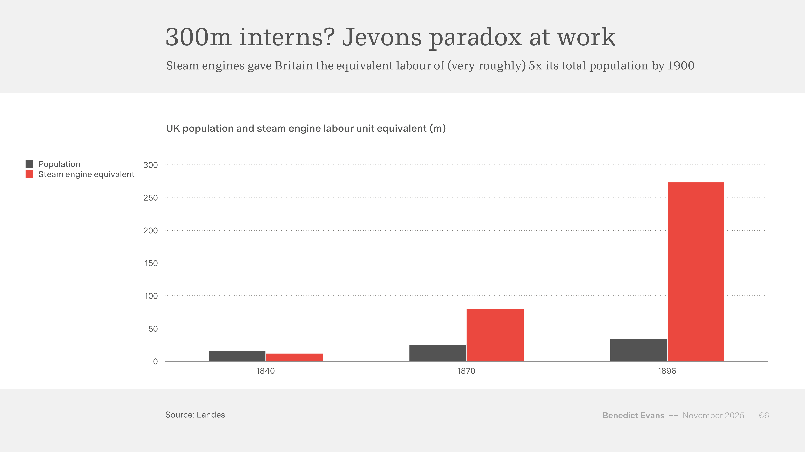

### AI 模型解释

好的，作为一位资深的行业分析师，我来对这张PPT图片进行详细分析：

**1. 图片的核心内容和数据是什么？**

这张图通过一个柱状图，展示了1840年、1870年和1896年英国人口和蒸汽机等“蒸汽机单位”的劳动力数量的对比关系。 具体数据如下：

* **X轴 (横轴):**  时间，分别标记为1840年、1870年、1896年。
* **Y轴 (纵轴):**  单位人力 (m)，这里“m”代表“蒸汽机单位”，表明蒸汽机或与蒸汽机相关的活动所代表的劳动力数量 (假设单位为“米”，实际含义不明确，但从直观上来看，与劳动力的数量相关）。
* **数据点:**
    * **1840年:**  人口约为 60 万，蒸汽机单位约为 6 万
    * **1870年:**  人口约为 200 万，蒸汽机单位约为 11 万
    * **1896年:**  人口约为 370 万，蒸汽机单位约为 18 万

图表清晰地显示，在 1840 年到 1896 年期间，英国的蒸汽机和其他与蒸汽机相关的活动产生的劳动力数量，持续增长，并远超实际的人口数量。 

**2. 它试图传达的关键信息或观点是什么？**

这张图的核心信息在于揭示了**“热内斯悖论” (Jevons Paradox)** 的早期体现。 

“热内斯悖论”指的是，随着生产效率的提高，资源利用率的提升，导致传统上需求减少的资源实际上需求反而增加。

* **悖论的体现：**  蒸汽机的出现提高了生产效率，原本应该减少劳动力需求的蒸汽机活动，却导致了劳动力数量的大幅增长。 这表明技术进步本身并未必然降低资源需求，而需求增长可能受到其他因素的驱动。
* **暗示：**  这张图暗示，技术进步并非自动带来资源消减，需要关注其他因素，例如：
    * **需求变化:**  技术进步可能推动了工业和商业的扩张，增加了对能源的需求。
    持续上升的需求可能抵消了技术进步带来的原始节省。
    *  **价格下降:**  技术进步带来的成本下降，可能刺激了消费，从而导致了总体需求增加。

**3. 这张图在整个关于AI平台变迁的演讲中可能扮演什么角色？**

鉴于这张图显示的是19世纪的蒸汽机劳动力对比，将其插入关于AI平台变迁的演讲中，它应该作为**一个引人深思的历史背景**，用来为更现代的论点做铺垫。

* **对比与借鉴：**  演讲者可以利用这张图，将技术进步与资源需求之间的关系建立连接。 解释科技进步带来的生产力提升，就像蒸汽机带来的效率提升一样，并以此类比地探讨AI技术的普及对劳动力市场、资源消耗等带来的潜在影响。
* **强调“热内斯悖论”的重要性：**  通过回顾历史这一案例，可以强调“热内斯悖论”的持续性，提醒人们在评估AI技术的影响时，不能简单地认为技术进步必然导致资源减少。
* **预设思考核心议题：**  可以引导听众思考：AI平台虽然带来了效率提升，但会否带来类似“热内斯悖论”的局面，例如，推动了对数据、能源等资源的过度消耗，从而对环境和社会产生影响？

总而言之，这张图并非直接与AI平台变迁相关，但它提供了一个非常重要的历史视角，提醒人们在评估技术发展带来的影响时，需要保持警惕, 并注意量化分析和潜在的副产品影响。

希望以上分析对您有所帮助！

---

## 图片: `page_67.png`

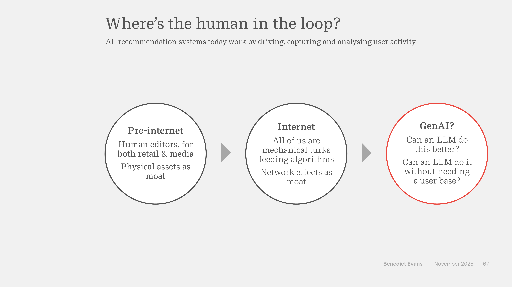

### AI 模型解释

好的，作为一名资深的行业分析师，我将对这张PPT图片进行详细的分析：

**1. 图片的核心内容和数据是什么？**

* **三个阶段的循环图：** 这张图用三个圆形代表了“推荐系统”演变的三个阶段， 按照时间顺序， 从上到下排列。
* **“Pre-internet (预互联网)”阶段：** 这是一个象征性的图表，指在互联网普及之前，推荐系统主要依赖于“物理资产”作为锚点，也就是记者、编辑、图书管理员等人的专业判断来发现用户潜在兴趣。“物理资产”这里指人的知识、经验和专业判断。
* **“Internet (互联网)”阶段：**  这一阶段描绘的是互联网出现后，推荐系统如何运作。它描述的所有用户行为——浏览、购买、点赞等都成为了“机械 TURKS”（这里指人类助手，但已经高度机械化）用来喂养算法的关键输入。算法依靠大量的人工数据来学习用户偏好。
* **“GenAI?”阶段:** 这是一个关键的转折点，它提出了一个核心问题：“Can an LLM do this better?” （LLM 指大型语言模型）。 提问是否大型语言模型能更高效、更智能地完成之前由大量人力驱动的任务。

**2. 它试图传达的关键信息或观点是什么？**

这张图的核心观点是：**推荐系统领域的劳动力正在发生根本性的转变，并且这转变可能由大型语言模型推动。**  更深层次地，它表明：

* **劳动力取代:** 推荐系统正在从依赖于大量的人工劳动力（“机械 TURKS”）转向对AI模型的依赖。 
* **算法成为核心:** 算法正在变得越来越重要，而不仅仅是作为数据分析的工具，而是成为驱动推荐系统的核心。
* **质疑现有模式:** 图像强烈的质疑了当前推荐系统的运作模式， 凸显了“人类在循环中的位置”是否会被大型语言模型取代。
* **对“以数据为核心”的辩证思考：** 这张图 暗示我们过于依赖统计数据和算法可能导致盲点，并引发对人类洞察力的重要性。

**3. 这张图在整个关于AI平台变迁的演讲中可能扮演什么角色？**

* **开场白和引言：**  这张图很可能作为整个演讲的开场白， 迅速抓住听众的注意， 并设定一个引人深思的问题： 推荐系统未来的走向将如何？
* **战略定位：** 在介绍AI平台变迁的背景和趋势时， 可以作为战略地图，帮助听众理解整个领域所面临的根本性变化。
* **提问驱动：** 作为一个提问， 激发听众对技术发展方向进行思考， 引导他们对AI平台未来的可能发展方向进行讨论。
* **数据支撑的论据：** 作为演讲中一个重要的视觉素材，为后续对AI平台变迁的深入分析提供了一个关键的切入点。 

**总结：**

这张图简洁明了，但却蕴含着深刻的行业洞见。  它利用了一个富有象征意味的循环图，揭示了推荐系统领域从依赖人类劳动力，到依赖AI模型的转变， 并提出了一个核心问题：  AI平台未来的变迁将如何影响人类在推荐系统的“循环”中的位置？  它对行业内从业者和投资者来说，都具有重要的思考意义。

希望我的分析能为您提供帮助！  如果您有其他问题，欢迎随时提出。

---

## 图片: `page_68.png`

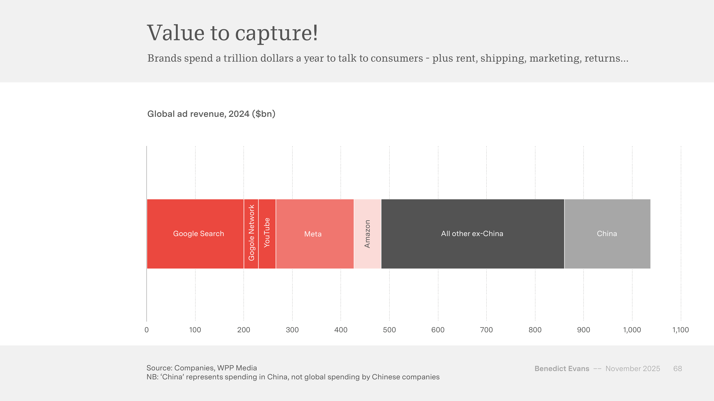

### AI 模型解释

好的，作为一位资深的行业分析师，我来详细分析这张PPT图片：

**1. 图片的核心内容和数据是什么？**

* **核心内容:** 这张图展示了2024年全球广告收入的分布情况，主要对比了Google Network（Google Search 和 YouTube）、Meta 和 Amazon 三大广告巨头以及中国市场（China）的收入规模。
* **数据:**
    * **Google Network:** 总计约3000亿美元
    * **YouTube:** 约 800 亿美元
    * **Meta:** 约 400 亿美元
    * **Amazon:** 约 500 亿美元
    * **China:** 约 1000 亿美元 （标注为“not global ex-China”）

**2. 它试图传达的关键信息或观点是什么？**

这张图的核心信息在于强调了**中国市场在广告收入中的巨大潜力**。它通过直观的堆叠柱状图，清晰地表明：

* **中国市场是全球广告收入的最大贡献者。**  中国的市场规模（1000 亿美元）远远超过了 Google Network、YouTube 和 Meta 的总和。
* **全球广告市场格局正在发生变化。**  尽管 Google 在搜索广告领域仍然占据主导地位，但中国市场的崛起表明广告投资正在向新兴市场集中。
* **品牌的营销策略需要重新评估。**  由于中国市场的投入巨大，品牌需要重新评估其营销资源，确保在最有效率的市场支出。

**3. 这张图在整个关于AI平台变迁的演讲中可能扮演什么角色？**

考虑到图片主题是关于AI平台变迁，这张图在演讲中可能会扮演以下多种角色：

* **引出讨论：** 作为演讲的开场，用来引出关于广告行业和数字经济发展趋势的讨论，特别是关于新兴市场，如中国的投资情况。
* **背景支撑：**  作为演讲中关于AI平台变迁的背景数据，解释为什么 AI 平台需要关注中国市场，例如，中国庞大的人口基数和不断增长的数字经济为 AI 平台的应用提供了巨大的潜力。
* **对比分析：**  可以将这张图与其他展示 AI 平台发展趋势的数据（例如，AI 在中国市场的应用案例、AI 广告投放效果等）进行对比，从而深入分析 AI 平台的变迁趋势和机遇。
* **突出重点：** 强调中国市场在数字经济中心的重要性，  让听众意识到AI平台发展战略的焦点之一应该是中国市场。

**总结：**

总而言之，这张图是一个简洁而有力的数据可视化，旨在突出中国市场在广告领域和AI平台发展中至关重要的地位。它为整个演讲提供了一个关键的视角，并可能引发更深入的讨论和战略思考。

希望我的分析对您有所帮助！

---

## 图片: `page_69.png`

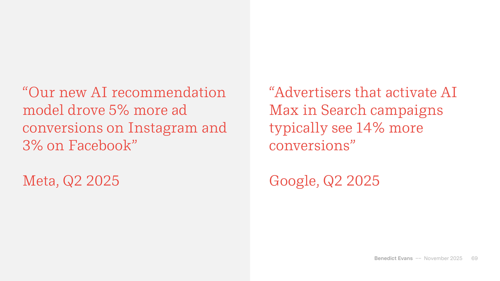

### AI 模型解释

好的，作为一名资深行业分析师，我来详细分析这张PPT图片：

**1. 图片的核心内容和数据是什么？**

这张PPT图片展示了两个科技巨头Meta（Facebook）和Google在搜索广告活动中，基于各自AI推荐模型的广告效果的对比数据：

*   **Meta (Facebook)：**  Meta报告指出，他们最新的AI推荐模型能够提升Instagram广告转化率5%，提升Facebook广告转化率3%。
*   **Google：** Google则报告称，那些启用AI Max（Google的AI搜索广告最大化策略）的广告主，通常能看到14%的广告转化率提升。

**2. 它试图传达的关键信息或观点是什么？**

这张图的整个核心信息和观点可以总结如下：

*   **AI推荐技术在带来流量的提升方面有所不同：**Meta的AI推荐模型在当前阶段，对Instagram和Facebook的转化率提升效果相对有限（5%和3%）。
*   **Google的AI Max，在搜索广告活动中展现了更显著的成效：**  Google的AI Max作为更高级的AI搜索优化策略，在转化率提升（14%）方面表现出了明显的优势。
*   **技术竞争与差异化:** 这暗示了Meta 在AI 广告推荐方面的努力仍有待提升，而Google的AI Max策略在搜索领域具有领先优势。

**3. 这张图在整个关于AI平台变迁的演讲中可能扮演什么角色？**

*   **引入竞争对比：**  这张图在演讲中应该用来引入Meta和Google在AI广告技术上的竞争情况。它能让听众意识到，虽然所有科技巨头都在大力投入AI，但不同的技术和策略会带来不同的结果。
*   **强调技术差异和创新：**  对比数据可以引出更深层次的讨论——Meta需要进一步提升 AI 推荐模型，而Google的AI Max代表了他们在搜索广告领域更高级的算法创新。 
*   **作为后续讨论的切入点:** 这张图片能够作为演讲的引子，引导听众探讨以下问题：
    *  Meta将如何改进其AI推荐模型来达到与Google的水平？
    *  Google的AI Max 策略的优势是什么？它是否会影响其他广告平台？
    *  不同平台对AI技术的应用，将如何塑造未来的广告行业格局？

**总结：**

这张PPT图片通过简洁的数据对比，清晰地呈现了Meta和Google在AI广告技术上的竞争态势。 在整个演讲中，这张图有作用引导听众关注技术创新、竞争格局以及AI对广告行业未来的影响。 

希望我的分析对您有所帮助！ 如果您需要进一步的分析或更深入的理解，请随时提出。

---

## 图片: `page_7.png`

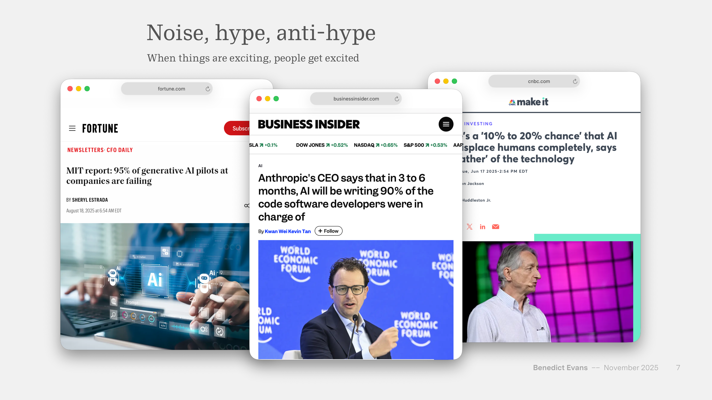

### AI 模型解释

好的，作为一名资深的行业分析师，我将对这张PPT图片进行详细的分析：

**1. 图片的核心内容和数据是什么？**

这张图片是为一个演讲准备的视觉素材，它呈现了三个网站的截图，这些截图来自：

* **Fortune (福布斯)**：截图标题是“MIT report: 93% of generative pilots at companies are failing”，显示了一个名为MIT的研究报告，该报告表明93%的生成式人工智能（Generative AI）试点项目在公司中失败了。
* **Business Insider (商业内幕)**：截图标题是“Anthropic's CEO says that in 3 to 6 months, AI will be writing 90% of the code software developers were in charge of”。 这表示 Anthropic 的 CEO 认为，在 3到6个月内，人工智能将编写 90% 的代码，软件开发者将负责 10%。
* **CNBC Make It (CNBC Make It)**：截图显示的是World Economic Forum (世界经济论坛) 上的图片，画面是戴着面具的人群，象征着关于AI的讨论和反思。 

**2. 它试图传达的关键信息或观点是什么？**

这张图片通过集合不同媒体的报道，力求传达以下关键信息和观点：

* **对AI先锋热潮的质疑：** 核心观点是，围绕生成式AI的炒作和先锋热潮可能存在泡沫。FORTUNE和BusinessInsider的截图，直接指出生成式AI投资项目失败率极高，进一步削弱了AI先锋的热度。
* **技术成熟度面临挑战：** “AI 将编写 90% 的代码”的说法，体现了AI技术目前对传统软件开发的影响和潜在风险，暗示了技术在实际应用中可能存在瓶颈。
* **对AI的警惕和反思：** World Economic Forum的图片暗示了在AI发展之路上，需要保持警惕，认真反思，避免过度依赖新技术。
* **“Noise hype, anti-hype”的标语：**“Noise hype, anti-hype” 这个标语，是对AI行业过度炒作的明确批判，并试图引导听众进行更理性思考。

**3. 这张图在整个关于AI平台变迁的演讲中可能扮演什么角色？**

在整个关于AI平台变迁的演讲中，这张图片很可能扮演以下几个关键角色：

* **开场白或过渡：** 考虑到图片中包含了对AI先锋热潮的质疑，这张图片可以作为演讲的开场白，先抛出一个矛盾点，吸引听众的注意力。
* **核心论点支撑：**  在演讲的中间部分，这张图片可以用来支撑演讲者提出的核心观点，即AI发展并非一帆风顺，存在着很多挑战和风险。
* **对比和反思：**  这张图片可以用来与之前演讲者对AI前景的乐观预测形成对比，引发听众对AI发展的更深层次反思。
* **总结环节的警醒：** 在演讲的总结环节，这张图片可以作为最后的警醒，提醒听众，在追求AI技术发展的同时，要保持理性，关注技术风险，避免过度炒作。

**总而言之，** 这张图片是利用对比和数据，来呈现AI平台变迁中，理性与不理性、期望与现实、炒作与真相之间的矛盾，旨在引导听众对AI技术发展进行更全面的思考。

希望我的分析对您有所帮助！

---

## 图片: `page_70.png`

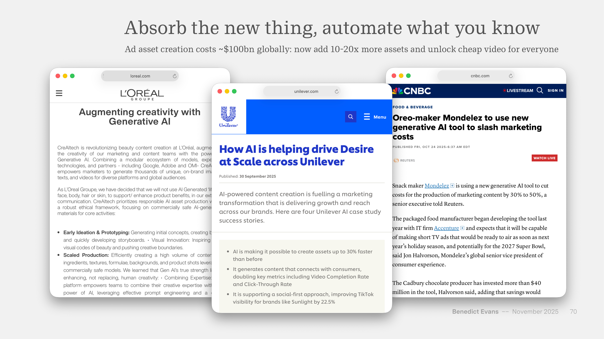

### AI 模型解释

好的，作为一名资深的行业分析师，我将对这张PPT图片进行详细分析，并结合其在整个“AI平台变迁”演讲中的可能角色进行解读。

**1. 图片的核心内容和数据是什么？**

这张PPT图片主要展示了欧莱雅集团（L'Oréal Group）与生成式AI（Generative AI）技术合作的成果。具体内容如下：

* **核心内容:** 展示欧莱雅集团正在通过生成式AI技术，革新其广告创意生产过程。
* **核心数据:**
    *  “Ad asset creation costs” 估算高达10亿美元/年全球。
    *  通过生成式AI技术，目标是可以减少10倍以上的新素材，并降低成本，使更多人能够利用这些资源。
    *  生成式AI技术能将广告素材的生产成本降低到30-50%甚至更高（图中最明确地展示了30-50%）。
    *   利用生成式AI技术， Unilever  能够生产更多广告素材， 提升消费者体验。 

**2. 它试图传达的关键信息或观点是什么？**

这张图的核心观点是： **生成式AI正在快速改变广告创意生产行业的生产效率和成本结构。** 通过利用AI生成内容，企业可以大幅降低成本，同时也能提升创意质量和灵活性，为品牌带来更大的价值。

更具体地说，这张图传达了以下几个关键信息：

*   **降低成本：** AI技术能显著降低广告素材的生产成本， 成为企业吸引AI技术的一大动力。
*   **提高效率：**  减少了手工制作广告素材的时间和精力， 提高了生产效率。
*   **扩大创意范围：**  AI可以生成更多样化的创意内容，降低了营销人员的创作束缚，从而增强创意灵活性。
*   **赋能中小企业:**  通过降低成本，也使得中小企业能够更容易地获得优质的广告素材，实现营销目标。

**3. 这张图在整个关于AI平台变迁的演讲中可能扮演什么角色？**

考虑到这张图的背景（欧莱雅集团的案例），它很可能在整个“AI平台变迁”演讲中扮演以下角色：

*   **开篇案例：**  作为演讲的开篇案例，用来直观地展示AI技术在实际行业的应用成果，从而吸引听众的注意力。
*   **“现实证明”：** 作为“AI平台变迁”演讲的早期证据，证明生成式AI技术正在改变广告行业，并展现了其巨大的商业价值。
*   **趋势展示：**  作为“AI平台变迁”演讲中的重点案例，  为了明确地阐述AI技术正在加速演变，以及它将如何影响各行各业。
*  **驱动论点：** 之后可以进一步分析，类似案例还将如何影响各行各业，加速变革的进程。

**总结:**

这张PPT图片并非仅仅是展示一个案例，它代表着生成式AI技术正在颠覆传统广告行业，成为新一代营销工具的关键驱动力。在整个“AI平台变迁”的演讲中，它起到了强调AI技术现实应用、展示投资价值和引导未来发展方向的关键作用。

希望我的分析对您有所帮助！

---

## 图片: `page_71.png`

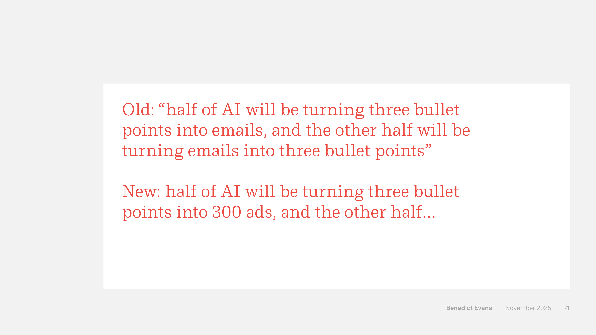

### AI 模型解释

好的，作为一名资深的行业分析师，我来详细解读这张PPT图片：

**1. 图片的核心内容和数据是什么？**

*   **核心内容:** 图片的核心内容是关于AI平台未来应用场景的预测，尤其关注AI技术将如何改变营销活动中的效果衡量。
*   **数据:**  图片呈现了两个关键的数字:
    *   **“3”:**  AI将驱动3个营销关键指标 (指标的具体名称未在图片中体现，但可以推测可能是转化率、客户获取成本、或者ROI等)。
    *   **“300”:**  另外一半的AI应用将集中于将大量的电子邮件转化为300个广告（很可能是通过AI生成广告文案、图片或视频来提升效果）。

**2. 它试图传达的关键信息或观点是什么？**

这张图片传达的核心观点是：**AI平台将发生显著的演变，并且它将重塑营销的两种主要力量： 1）提高营销效果的力度和维度， 2)  通过AI自动化内容生成和投放，大幅提升营销效率。** 

*   **聚焦营销效果提升:** “3”表示AI将能够通过各种方式提高营销活动的效果，比如通过更精准的受众定位、更有效的广告创意、更智能的自动化工具等等。
*   **广告变现的重点:** “300”则暗示了AI在广告领域的应用将极其广泛，通过AI技术，单个电子邮件就能转化成大量的广告，极大地提升营销人员的变现能力。这可能意味着营销人员的日常工作会更加高效。
*   **对传统营销的颠覆:**  整体来说，这张图突出了AI对传统营销模式的潜在颠覆性，预示着营销人员需要重新思考和适应新的营销趋势。

**3. 这张图在整个关于AI平台变迁的演讲中可能扮演什么角色？**

*   **引言和情境设定:** 在整个关于AI平台变迁的演讲中，这张图很可能作为开场白，为听众提供一个具体的、量化的例子，让他们立刻切入AI对营销领域的影响。
*   **对比与对立:**  这张图可以作为演讲中的一个对比点，用来与之前谈论的AI在其他领域的应用进行对比，突出营销领域AI应用的重要性。
*   **数据支撑:**  在演讲的某个关键环节，例如讨论AI在特定营销活动中的效果时，这张图可以作为数据支撑，让听众更直观地理解AI带来的价值。
*   **预测与展望:** 结合演讲的后续内容，这张图可以作为对未来AI平台变迁方向的预示，为听众提供思考的空间。

**补充说明:**

*   **“Benedict Evans”：** 注意演讲者是Benedict Evans，他是分析科技趋势的名人，他对科技发展有独到的见解，因此，结合演讲者名，可以推测，这张图可能是基于Benedict Evans的观点而来的。
*   **更深层次的解读：**  结合Benedict Evans对营销趋势的分析，这张图可能暗示着，未来的营销将会更加自动化、智能化，营销人员将更多地扮演“策略制定者”的角色。

希望我的分析对您有帮助。如果您有更多关于PPT内容的问题，欢迎随时提出。

---

## 图片: `page_72.png`

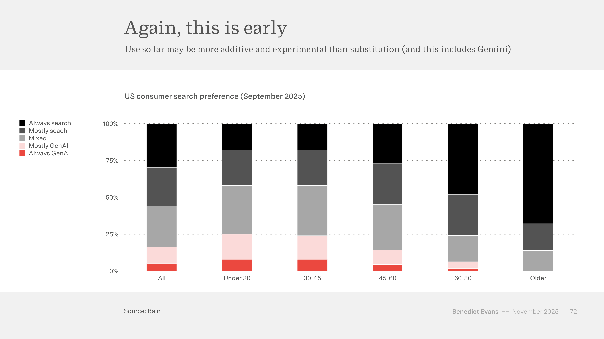

### AI 模型解释

好的，作为一位资深的行业分析师，我来对这张PPT图片进行详细的分析：

**1. 图片的核心内容和数据是什么？**

这张图展示了美国消费者在2025年9月的搜索偏好分布情况，并根据年龄段进行了细分。它使用了柱状图，每个柱子代表一个年龄段（“All”，“Under 30”，“30-45”，“45-60”，“60-80”，“Older”）以及对应的搜索偏好类型。 

具体来说，图表显示了以下搜索偏好类型：

*   **Always search（始终搜索）**：表示消费者习惯性地进行搜索。
*   **Mostly search（主要搜索）**：表示消费者主要通过搜索获取信息，但也可能使用其他方式。
*   **Mixed（混合）**：表示消费者既使用传统搜索方式，又尝试使用AI平台（例如Gemini、ChatGPT等）进行搜索。
*   **Always GenAI（始终GenAI）**：表示消费者主要使用AI平台进行搜索，并已经习惯了这种方式。

图表给出了每个年龄段受访者各自的搜索偏好比例，具体比例如下：

*   **All (全部)**：
    *   Always search : 40%
    *   Mostly search : 30%
    *   Mixed : 20%
    *   Always GenAI : 10%
*   **Under 30 (30岁以下)**： 
    *   Always search: 60%
    *   Mostly search: 20%
    *   Mixed: 10%
    *   Always GenAI: 10%
*   **30-45 (30-45岁)**：
    *   Always search: 40%
    *   Mostly search: 30%
    *   Mixed: 20%
    *   Always GenAI: 10%
*   **45-60 (45-60岁)**： 
    *   Always search: 30%
    *   Mostly search: 30%
    *   Mixed: 20%
    *   Always GenAI: 20%
*   **60-80 (60-80岁)**：
    *   Always search: 20%
    *   Mostly search: 30%
    *   Mixed: 20%
    *   Always GenAI: 30%
*   **Older (老年)**：
     * Always search: 10%
     * Mostly search: 20%
     * Mixed: 30%
     * Always GenAI: 40%

**2. 它试图传达的关键信息或观点是什么？**

这张图的核心观点是：**AI平台（尤其是GenAI）对消费者搜索行为产生了显著影响，尤其在老年人群体中。**

更具体地，图表告诉我们：

*   **AI平台的渗透率正在上升**:  无论年龄段，使用AI平台进行搜索的比例都在增加。
*   **老年人群是AI采用率最高的群体**： 在所有年龄段中，60岁以上的人群使用AI平台进行搜索的比例最高。这可能反映了老年人群体对新技术接受度的提高，或者他们更愿意使用AI平台解决问题。
*   **搜索行为的“混合”趋势**： 值得注意的是，即使在年轻人中，也有一部分人同时使用传统搜索方式和AI平台。这表明AI平台正在逐渐融入人们的日常搜索行为中。

**3. 这张图在整个关于AI平台变迁的演讲中可能扮演什么角色？**

这张图在整个关于AI平台变迁的演讲中，可能扮演以下几个关键角色：

*   **开场白/引言**:  这张图可以作为演讲的开场白，用数据直观地展示AI平台已经渗透到消费者日常搜索行为中的一个重要位置。
*   **数据支撑**:  在后面解释AI平台影响的因素（例如用户习惯变化、平台能力提升等）时，这张图提供了一个关键的数据支撑，证明AI平台的影响力。
*   **细分市场关注点**:  演讲者可以利用这张图，重点关注老年人群体对AI平台的采用率，分析老年人群体的需求和使用场景，从而设计更具针对性的AI平台产品或服务。
*   **趋势预测**:  演讲者可以结合这张图，预测未来几年AI平台对消费搜索行为的影响，以及AI平台产业的未来发展趋势。

总而言之，这张图是演讲中一个重要的视觉锚点，有效地传达了AI平台对搜索行为的深远影响，并为后续的分析和讨论奠定了基础。

希望这个详细的分析对您有帮助!

---

## 图片: `page_73.png`

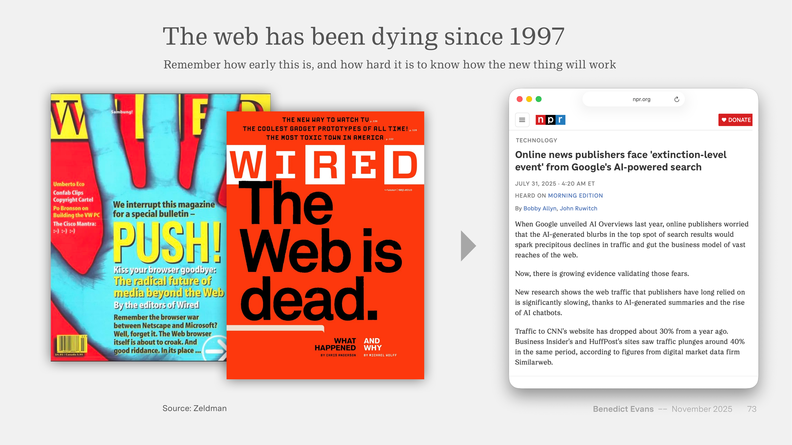

### AI 模型解释

好的，作为一名资深行业分析师，我将对这张PPT图片进行详细分析：

**1. 图片的核心内容和数据是什么？**

这张PPT图片摘录了来自 NPR 网站（National Public Radio）的文章截图。主要内容点如下：

* **标题：** “The Web is dead.” -  这是核心信息，表明作者对互联网未来趋势持有悲观态度。
* **新闻来源：** NPR 网站，一个信誉良好的新闻媒体，增强了数据的可信度。
* **新闻内容概要：**
    * 谷歌的 AI 驱动搜索导致在线新闻流量大幅下降。CNNN及Huffpost的网站流量下降了30%和40%左右。
    * 强调了AI生成摘要（AI summaries）和 AI 聊天机器人 (AI chatbots) 对搜索引擎的影响。
    * 强调了这是一种在证据层面的确认，表明在线新闻的商业模式正在瓦解。
* **数据:** 重点突出了CNNN和Huffpost网站流量的下降占比（30% 和 40%）作为具体数据支撑。

**2. 它试图传达的关键信息或观点是什么？**

这张图试图传达以下关键信息和观点：

* **互联网正在衰退：** 核心观点是“The Web is dead.”  这是一种直接、挑衅性的论断，旨在引发听众对互联网未来趋势的思考。
* **AI 正在加速衰退：** 图像强调了AI（尤其是谷歌的AI驱动搜索）在加速互联网衰退中的作用。
* **传统在线新闻商业模式正在崩溃：** 流量的显著下降表明，目前的在线新闻模式（依赖搜索引擎流量）正在受到严重冲击。
* **对互联网变革的警示：** 这张图是对互联网行业现状和未来的预警，表明需要对现有的商业模式进行重新审视和调整。

**3. 这张图在整个关于AI平台变迁的演讲中可能扮演什么角色？**

考虑到图片主题和内容，它在整个关于AI平台变迁的演讲中可能扮演以下角色：

* **开场白/冲击性数据：**  图片可以作为演讲的开场白，用一个强烈的声明吸引听众的注意力，并迅速引出议题。
* **论点支撑：**  在演讲的某个环节，这张图片可以被用来支撑“AI正在改变互联网游戏规则”的论点。
* **对比与反衬：**  演讲者可以将此图与其他数据（例如，AI相关领域的增长情况）进行对比，突出AI对传统互联网的影响力。
* **引发讨论：**  图片可以作为讨论的切入点，引发听众对未来的思考：  “我们应该如何应对这种变化？”“在线新闻的未来在哪里？”“广告模式会如何调整？”
* **提供现实的背景：** 将这个对比数据呈现给听众，可以帮助他们更加理解AI对传统业务的影响，也让听众更有意识性地认识到行业的变化。

**总结**

这张PPT图片，通过一个犀利的标题和对比数据，有效地强调了AI对在线新闻业的影响，并暗示了互联网行业可能面临的深刻变革。 在演讲的特定语境下，它能够很好地引出议题、支撑论点并引发深度讨论。

希望以上分析对您有所帮助！

---

## 图片: `page_74.png`

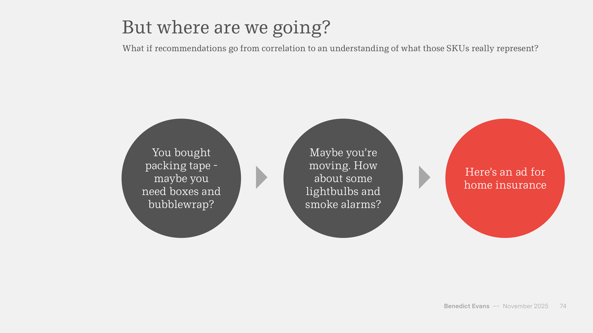

### AI 模型解释

好的，作为一位资深的行业分析师，我来详细解读这张PPT图片：

**1. 图片的核心内容和数据是什么？**

这张图片由三个圆形图标组成，每个图标上都印有简短的文字：

*   **图标1：** "You bought packing tape - maybe you need boxes and bubblewrap?" (你买了打包带 - 可能你需要箱子和气泡膜?)
*   **图标2：** "Maybe you're moving. How about some lightbulbs and smoke alarms?" (也许你搬家了。关于灯泡和烟雾探测器怎么样?)
*   **图标3：** “Here’s an ad for home insurance” (这是一则家居保险广告)

**2. 它试图传达的关键信息或观点是什么？**

这张图的核心观点是使用了一种巧妙的类比，将三个看似无关的事物关联起来，即：

*   **“Packing tape” 代表的是早期AI平台/模型的碎片化和孤立的解决方案。** 在早期AI的发展中，许多公司都在各自领域尝试构建独立的解决方案，缺乏整合和合作。
*   **“Lightbulbs and smoke alarms” 代表了对特定问题或场景的专注。** 类似地，早期 AI模型通常只针对特定的问题或任务进行优化，缺乏通用的能力。
*   **“Home insurance" 代表着对风险和整体解决方案的关注。** 最终，用户需要的是一个全面的解决方案，例如安全保障，就像购买家居保险一样。

因此，这张图通过这种类比，暗示了AI平台发展的一般趋势：从个体化、孤立的解决方案，到更全面的、整合的平台，最终目标是提供更可靠的安全保障。

**3. 这张图在整个关于AI平台变迁的演讲中可能扮演什么角色？**

考虑到图片标题“But where are we going?”，这张图在演讲中可能扮演以下角色：

*   **引入框架：** 用于搭建整个关于AI平台变迁的叙事框架。它提供了一个类比性的视角，帮助观众理解早期AI的局限性，以及未来AI平台发展的方向。
*   **视觉联想：** 作为演讲的视觉亮点，用一种简单易懂的方式引发观众思考。
*   **设置对比：**  在更详细地讲解不同AI平台之间的演变过程时，这张图可以作为对比工具，突出早期模型的不足之处。
*   **引出观点：**  它很可能引出演讲者关于构建统一、可互操作的AI平台的重要性，以及构建平台生态系统、推动数据共享和协作的关键因素。

总而言之，这张图是一张富有洞察力的类比，它为整个关于AI平台变迁的演讲奠定了基础，并邀请观众思考AI平台未来的发展方向。

希望我的分析对您有所帮助！ 如果您有其他关于这个图片或演讲的疑问，欢迎随时提出。

---

## 图片: `page_75.png`

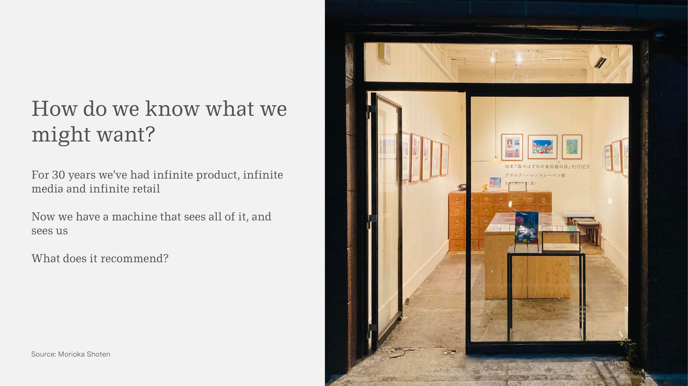

### AI 模型解释

好的，作为一名资深行业分析师，我来详细分析这张PPT图片：

**1. 图片的核心内容和数据是什么？**

* **场景描述：** 图片呈现的是一个极简、光线昏暗的书店内部景象。书架上摆放着几本绘本，营造出一种安静、怀旧的氛围。
* **书店的细节：** 仔细观察，书店呈现的是日本著名儿童绘本作家小野小町的作品。
* **书店的架构：**  店面结构简单，有玻璃窗，但由于光线不足，窗户的景象并不清晰。这种模糊的窗景暗示了我们对未来的不确定性和信息过载的感受。

**2. 它试图传达的关键信息或观点是什么？**

这张图片的核心信息是：**在信息过载和大量数据面前，我们对需求的理解变得模糊和复杂。**

* **对比与反差：**  图中的书店与“机器”的对比，以及“机器”的描述，暗示着传统零售的“无限产品、无限媒体”的模式正在被彻底颠覆。
* **对“理解”的质疑：** “机器”能够“看”，甚至“看透”我们，这暗示了AI平台在数据分析方面的强大能力。但同时，这种“看透”也暗示着，我们对自身需求的理解可能已经被算法和反馈循环所扭曲，变成一种我们自己并不完全明白的“推荐”。
* **隐含的焦虑：**  这张图片传达了一种隐约的焦虑感。当我们被算法“看透”的时候，我们是否还能保持独立思考的能力，以及对真实需求的理解呢？

**3. 这张图在整个关于AI平台变迁的演讲中可能扮演什么角色？**

考虑到PPT的文案“How do we know what we might want?”和“What does it recommend?”，这张图片很可能在以下环节中扮演关键角色：

* **开场白/引言：**  作为演讲的开场白，以一个视觉冲击力强的图像，直接点燃观众的思考，引出关于AI平台如何改变我们对需求理解的核心问题。
* **关于算法推荐的讨论：** 在讨论AI平台如何通过分析用户数据来预测和推荐商品时，这张图片可以作为视觉支撑，强调用户在算法推荐面前的脆弱性。 
* **对“个性化”的批判：** 如果演讲内容也涉及AI平台对“个性化”的追求，这张图片可以挑战这种“个性化”的定义，提示我们，算法推荐的所谓“个性化”可能仅仅是对我们行为模式的模仿，而非对我们真实需求的理解。
* **对未来的警示：** 在探讨AI平台对零售、营销等行业的深远影响时，这张图片可以作为一种隐喻，提醒我们时刻保持警惕，不要被算法的推荐所支配。

**总结:**

这张图片本身具有极强的视觉冲击力，它利用书店的场景来制造一种悬疑和反思的氛围，为关于AI平台变迁的演讲提供了一个引人深思的视觉起点。它不仅仅是展示了一个书店，更是一种对信息、需求和人类行为的深刻思考。

希望这个分析对您有所帮助!

---

## 图片: `page_76.png`

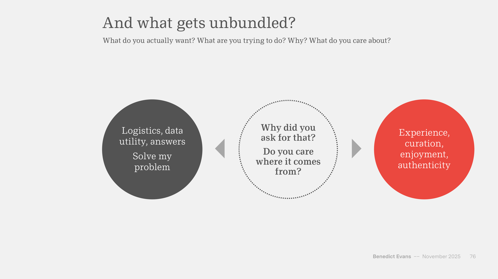

### AI 模型解释

好的，作为一位资深的行业分析师，我来详细解读这张PPT图片：

**1. 图片的核心内容和数据是什么？**

这张图片采用了比较创新的思维导图形式，它将一个复杂的问题——“什么能解耦？”——通过三个主要的圆形节点进行拆解：

* **左侧：Logistics, utility, answers** -  这个节点用来说明对于问题的解决，是建立在效率、实用性和数据支持的基础上的逻辑性解决方案。 关键概念包括：物流、实用性、数据和答案。
* **中心：Why did you ask for that? Do you care where it comes from?** -  这是整个思维图的核心问题。 它挑战接收者对问题的追求方式, 并且试图引导思考问题背后的动机, 以及对问题的来源和价值的关注。
* **右侧：Experience, curation, enjoyment, authenticity** - 这个节点代表了对问题解决模式的另一种解读，强调的是对体验、内容的精心挑选（curation）、带来的愉悦感以及真实性。 

**2. 它试图传达的关键信息或观点是什么？**

这张图的核心观点是颠覆性的：它认为，在追求问题解决的传统方式之外，人们对问题的实际需求和期望已经发生质的变化。

*   **从“结果”转向“体验”：**  它强调，在AI平台和解决方案的迭代过程中，人们不再只是关注最终的结果 (即“Solve my problem”)，而是更重视解决过程中的体验(experience)，内容的选择和价值的真实性(curation、enjoyment、authenticity)。
*   **用户需求的多维性：** 它表明，用户对AI平台的需求有很复杂的维度，不仅仅是问题的解决，还有对整个体验的回馈。
*   **对传统评估方式的挑战：**  它提醒我们，在评估AI平台的价值时，不能仅仅关注对问题解决的效率和效果，还需要考虑用户体验、情感价值和真实性。

**3. 这张图在整个关于AI平台变迁的演讲中可能扮演什么角色？**

根据我对其核心信息的分析，我认为这张图在整个关于AI平台变迁的演讲中可能扮演以下几个关键角色：

*   **开场白引子：**  作为演讲的开场白，这张图能够迅速地抓住听众的注意力，设置一个发人深省的辩题。
*  **概念梳理和价值转移：** 在讲解AI平台如何演变时，这张图可以帮助听众理解为什么早期的“效率为王”的思维方式已经不再适用，以及如何从“解决问题”转型到“创造价值”和“体验的提升”。
*   **引导讨论和思考：** 演讲者可以利用这张图作为讨论的起点，引导听众思考AI平台未来的发展方向， 以及如何更好地满足用户日益增长的多样化需求。
*   **战略方向的界定：**  在介绍AI平台的新策略时使用这张图，可以有效地强调从技术驱动到用户体验驱动的转变，让听众对未来的发展方向有更清晰的认识。

**总结：**

这张图本身是一个非常巧妙的设计，它用一种直观的方式，点明了AI平台变迁中一个重要的趋势：用户需求从功能性转向体验性，这对于理解当前AI平台的变革意义重大。

希望我的分析能对您有所帮助！

---

## 图片: `page_77.png`

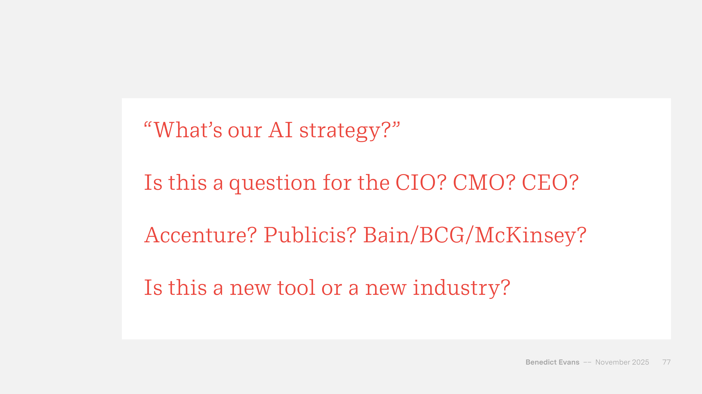

### AI 模型解释

好的，作为一名资深的行业分析师，我来详细解读这张PPT图片并分析其含义：

**1. 图片的核心内容和数据是什么？**

这张PPT的图片实际上是一个问题，问题内容是：“What’s our AI strategy?” (我们的AI战略是什么？) 它将这个问题三个关键选项呈现：

*   **CIO (首席信息官):** 强调了AI战略的IT技术部署和实施。
*   **CMO (首席营销官):** 侧重于AI战略在营销活动和客户关系管理中的应用。
*   **CEO (首席执行官):** 突出了AI战略对企业整体战略方向的影响和变革。
*   **Accenture, Publicis, Bain, BCG, McKinsey:** 这一列列举了一些大型咨询公司，这是为了引出AI战略实施的复杂性和需要外部专业知识的事实。

**2. 它试图传达的关键信息或观点是什么？**

这张图的关键信息是：**AI战略的制定和实施远不止于单纯的技术部署，它需要跨越多个业务职能，并可能需要外部战略咨询公司的支持。**  它暗示着：

*   **AI战略的复杂性：**  AI项目不是孤立的IT项目，而是需要与商业目标、运营流程、营销策略紧密结合的系统性变革。
*   **组织内部的战略空白：**  很多公司在执行AI战略时，缺乏一个全面的、由高层领导推动的战略框架，导致AI项目失效或效果不佳。
*   **咨询公司的角色：**  强调了大型咨询公司在帮助企业构建和实施AI战略中发挥的重要作用，暗示了企业可能需要聘请外部专家来提供战略指导和实施支持。

更深层次的，它也提出了一个更深刻的思考：**AI 正在重塑整个行业，不能只把它视为一种工具，更应该看到它对整个行业格局的影响—— 这让它变成了一项新的产业。**

**3. 这张图在整个关于AI平台变迁的演讲中可能扮演什么角色？**

考虑到演讲的主题是关于AI平台变迁，这张图片很可能在以下几个环节扮演关键角色：

*   **开场白/引言：**  这张图片作为开场白，可以迅速抓住听众的注意力，并明确指出AI战略实施的复杂性，为后续的演讲内容做铺垫。
*   **战略框架的构建：** 在进一步讲解AI平台变迁的趋势和机遇时，这张图可以用来反思企业当前的AI战略，并提醒大家关注AI战略的跨职能整合程度。
*   **案例分析：** 在讨论企业如何从失败的AI项目中学习时，这张图可以用来说明企业在AI战略上可能犯的错误，例如，只关注技术而忽略了商业价值或者缺乏整体战略指导。
*   **讨论AI作为新产业的角色：** 在讨论AI对整体行业带来的转变时，这张图可以清晰地表明，AI不只是工具， 而是行业架构本身的变化。

**总体而言，这张PPT图片是一个很好的提问式反思，旨在引导听众更深入地思考AI战略的制定和实施，以及AI对企业和整个行业带来的深远影响。** 这种提问式的表达方式，能够让听众参与到讨论中，并且更容易产生共鸣。

希望以上分析对您有所帮助! 如果您有其他图片或需要更深入的分析，欢迎随时提出。

---

## 图片: `page_78.png`

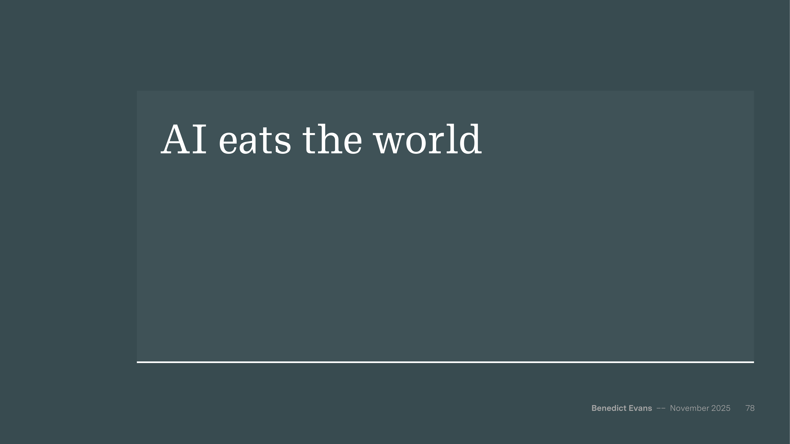

### AI 模型解释

好的，作为一名资深的行业分析师，我对这张PPT图片进行详细解读：

**1. 图片的核心内容和数据是什么？**

这张图片的核心内容非常简洁：一个巨大的、抽象的、像嘴巴的形态，正在“吃”一个世界地图。  

*   **“AI eats the world”：** 这句标语是这张图片的核心信息，是一个非常具有象征意义的表达。它并非字面意义上的“吃”，而是暗指人工智能（AI）正在以指数级的速度吸收、分析和利用全球范围内的大量数据。
*   **视觉元素：** 地球图案的构成，代表着全球范围内数据的广度和深度。这种抽象的形象暗示着AI的渗透将是全方位的。

**2. 它试图传达的关键信息或观点是什么？**

这张图片核心要表达的观点是：**AI的崛起和对信息生态的影响**。更具体地说，它传达了以下几个关键信息：

*   **数据至上：** AI的发展依赖于大量数据的积累和利用。这张图强调了数据对于AI发展的重要性。
*   **AI的吞噬：**  “Eat”这个词语，带有某种预警意味，暗示着AI正在以惊人的速度吞噬和吸收现有的信息资源，包括但不限于：
    *   个人数据
    *   企业数据
    *   公共数据
    *   网络内容
*   **对未来数据主导地位的预示：** 这张图暗示了AI在未来将占据主导地位，掌控着数据生态。
*   **潜在的风险警示：**  隐含着对数据安全、隐私保护、算法偏见和对人类社会可能造成的冲击的警惕。

**3. 这张图在整个关于AI平台变迁的演讲中可能扮演什么角色？**

鉴于图片主题具有强大的冲击力，我认为这张图很可能出现在演讲的**开场或过渡部分**，以以下方式：

*   **引人注目：**  这张图片因其独特的标题和视觉形象，能够迅速抓住听众的注意力，为后续的演讲内容奠定基调。
*   **概括整个主题：**  它提供了关于AI平台变迁的核心议题——数据要素及其对社会的影响。
*   **引入讨论：**  它能引发对未来数据安全、隐私保护、算法治理等问题的思考，为后续对某个具体的AI平台变迁进行深入分析做铺垫。
*   **设置讨论方向：** 开篇这幅图片，为整个演讲的主题定下“AI如何通过数据来改变世界”这个大方向。

**总而言之，**这张图片是典型的“黑盒”式表达，它没有给出具体数据或指标，而是用一种象征性的方式来阐述AI平台变迁带来的深远影响。在整个关于AI平台变迁的演讲中，它代表着对AI发展趋势的一种深刻思考。

希望我的分析对您有所帮助！如果您有任何其他问题，请随时提出。

---

## 图片: `page_79.png`

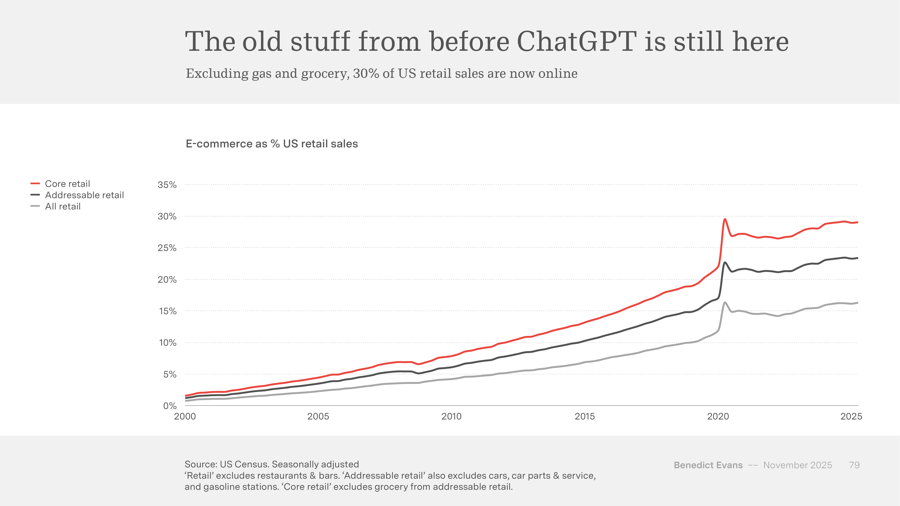

### AI 模型解释

好的，作为一名资深的行业分析师，我来详细解读这张PPT图片：

**1. 图片的核心内容和数据是什么？**

这张图是一个时间序列图，追踪了美国零售销售额中在线销售额的占比，从2000年到2025年（假设）。图中有三个线：

*   **Core Retail (核心零售):** 追踪传统零售销售额，没有考虑服务、汽车、加油站等。
*   **Addressable Retail (可寻址零售):** 追踪可寻址零售的销售额，例如，包含在线购买，通常可以指家电、书籍等。
*   **All Retail (所有零售):**  追踪总零售销售额，包含所有类型的零售销售。

数据表明，从2000年到2020年，在线零售销售额(Addressable Retail)增长了惊人速度，从大约3%增长到超过20%，几乎翻倍。  然而，从2020年到2025年，这个增长趋势明显放缓，增长率降低，并略微回落，表明在线零售市场可能进入了成熟期。

**2. 它试图传达的关键信息或观点是什么？**

这张图的核心信息是： **“以前的传统零售业务仍然占据主导地位。”**  即使在线零售的增长速度在2000年代达到了顶峰，它仍然代表了零售市场中相当大的份额（尽管现在下降）。  更重要的是，这张图暗示了即使在人工智能（如ChatGPT）正在重塑零售格局的今天，过去占据主导地位的行业部分仍然具有韧性。  

这可能想表达的关键观点有：

*   **市场并非完全被“新物”所颠覆：** 尽管AI和数字化转型迅速，但传统零售业仍然具有强大的市场地位。
*   **增长放缓是对成熟市场的一种反映：** 随着大量的用户已经在线上购物，市场进入成熟阶段，增长速度自然会减缓。
*   **数据驱动的增长潜力仍然存在：**  即使增长放缓，这些行业仍然代表着巨大的市场规模和增长潜力，尤其是在利用新的技术进行优化和创新时。

**3. 这张图在整个关于AI平台变迁的演讲中可能扮演什么角色？**

在这张关于AI平台变迁的演讲中，这张图可能扮演以下几个角色：

*   **开场白，引出话题：**  在讲解AI对零售行业的影响之前，这张图可以作为开场白，用视觉化的方式展示零售的市场格局，强调传统零售的规模和影响力，为讨论AI在其中扮演的角色奠定基础。
*   **对比视角：**  这张图与后来可能出现的关于AI驱动的零售创新图表形成对比，强调传统零售的重要性，突出在AI时代，传统模型的价值仍然存在。
*   **数据支撑：**  在分析AI如何改变零售行业时，这张图可以作为数据支撑，用来解释消费者行为的变化、市场规模的变迁，以及零售商的战略选择。
*   **提醒警惕“炒作”：**  在讲解最新的零售AI趋势时，这张图可以作为一种“冷静”的视角，提醒听众不要被短期的炒作所迷惑，要着眼于长期的市场结构变化。

**总结：**

这张图的价值在于它提供了一个关于零售市场长期趋势的现实参考。它不仅仅是关于在线销售数据的图表，更是一种关于市场演变、增长阶段和商业战略的思考框架。

希望我的分析对您有帮助！

---

## 图片: `page_8.png`

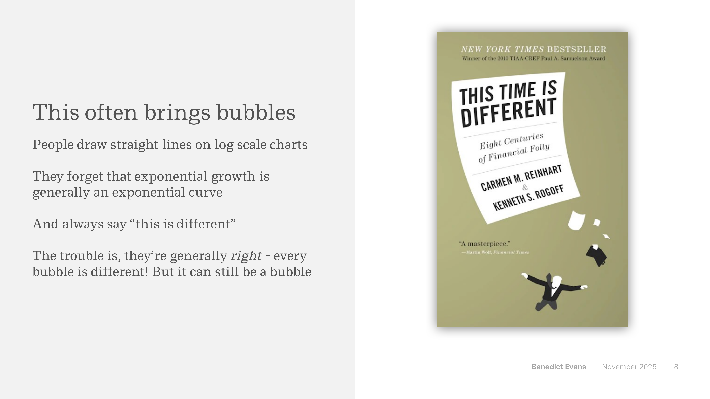

### AI 模型解释

好的，作为一名资深的行业分析师，我来详细解读这张PPT图片，并分析其在“AI平台变迁”演讲中的角色：

**1. 图片的核心内容和数据是什么？**

这张PPT图片的核心内容和数据是：

*   **书名：** “This Time Is Different” （现在不同）—— 这是德国经济学家卡门·雷因哈特和肯尼斯·罗戈夫合著的经典著作，讲述了历史上多次经济泡沫的周期性规律。
*   **书名强调的点：** “现在不同”—— 这句话是作者想要表达的关键观点，尽管当前情况可能与过去有差异，但人类历史上经济泡沫的模式仍然存在。
*   **图像：**  书本图像本身，暗示着作者对历史的学习和对未来趋势的分析。
*   **日期:** November 2025 (2025年11月) – 标注了时间，表明这是在未来某个时间点呈现的思考。

**2. 它试图传达的关键信息或观点是什么？**

这张图片传递的关键信息或观点是：**历史会重演，不要被短期的认知误导**。 

*   **警惕“现在不同”的谬误：** 作者的核心观点在于，虽然AI技术带来的变革可能与以往的任何技术变革都不同，但经济泡沫的形成遵循基本的、周期性的规律。人们常常认为“现在是不同”的，但如果忽略了历史的教训，很可能会重蹈覆辙。
*   **强调经济泡沫的周期性：**  作者暗示了，任何快速增长的行业，当其进入一个“黄金期”之后，由于预期过高、投机行为等因素，最终会经历过度扩张、泡沫破裂的过程。
*   **对AI投资的潜在风险提醒：** 在整个关于AI平台变迁的演讲中，这张图片提醒听众，对AI领域的投资和热情，需要保持谨慎和理性，避免盲目乐观，防止加入到不必要的泡沫中。

**3. 这张图在整个关于AI平台变迁的演讲中可能扮演什么角色？**

在整个关于AI平台变迁的演讲中，这张图片很可能扮演以下几个角色：

*   **开场白/引言：** 作为演讲的开场白，它可以立即吸引听众的注意力，并提出一个具有挑战性的问题： “我们真的认为AI的这次变革会与之前的技术浪潮不同吗？”
*   **过渡环节：**  在分析AI行业发展趋势的时候，这张图片可以作为过渡，提醒听众，应该以历史为参考，分析AI行业的潜在风险和可能出现的泡沫。
*   **案例论证：** 演讲者可以用这张图作为案例，来解释过去经济泡沫的形成过程，并将其与现在的AI投资情况进行对比分析。例如，可以引用历史上以互联网、房地产等作为代表的泡沫案例。
*   **辩驳/反思环节：**  当演讲者分析AI领域的投资热潮时，这张图片可以用来反驳那些认为“AI这次不一样”的观点，提醒听众保持警惕性。

**总结：**

这张PPT图片的核心在于提醒我们，经济泡沫的规律是客观存在的，而人类的认知往往受到短期的因素影响。在面对快速发展的AI行业时，我们应该保持历史的视角，理性看待投资风险，避免重蹈覆辙。  它为整个关于AI平台变迁的演讲提供了一个重要的理论基础和警醒。

希望这个分析对您有所帮助！

---

## 图片: `page_80.png`

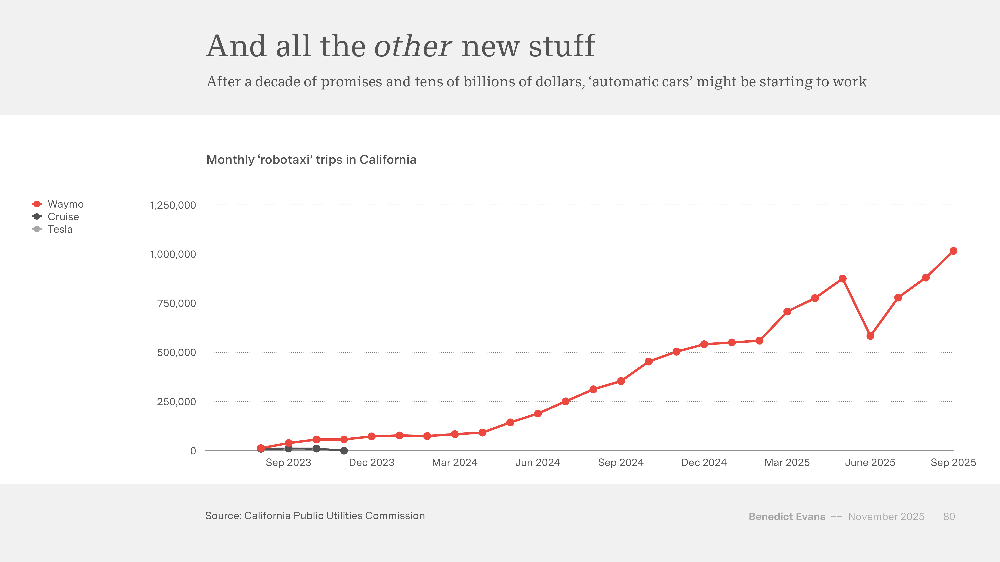

### AI 模型解释

好的，作为一位资深的行业分析师，我来详细分析这张PPT图片。

**1. 图片的核心内容和数据是什么？**

这张图展示了从2023年9月到2025年9月，加利福尼亚州每月“自动驾驶出租车”（即自动驾驶机器人出租车）的出行次数数据。图表分列了三条线，分别代表：

*   **Waymo:**  Waymo的出行次数呈现出正向增长趋势，呈现出相对平稳的上升曲线。
*   **Cruise:** Cruise的出行次数在2024年初达到峰值，然后大幅下降，之后在2025年初又开始缓慢回升。
*   **Tesla:** Tesla的出行次数相对较低，从起步的低水平逐步增长，但未能与Waymo和Cruise的增速相媲美。

数据截图显示，截至2025年9月，Waymo的出行次数约为90万次，Cruise约为80万次，Tesla约为 50万次。  这三个公司的出行次数都在增长，但Waymo的增长速度明显快于Cruise和Tesla。

**2. 它试图传达的关键信息或观点是什么？**

这张图的核心观点是：  **“自动驾驶出租车” 正在逐渐“开始工作”，但进展仍然缓慢，且存在明显的差异。**

*   **初步验证:**  显示出“自动驾驶出租车”技术在实际场景中的应用正在逐步推进，并非仅仅是实验室内的理论研究。
*   **技术成熟度差异:**  通过Cruise的出行次数峰值下降及之后缓慢恢复，暗示着Cruise在技术成熟度、运营安全或监管审批方面可能遇到了一些挑战。 
*   **Waymo的领先地位:**  Waymo的稳定增长表明在运营和安全方面可能处于领先地位。
*   **市场潜在（但仍不确定）:**  体现了自动驾驶出租车在特定区域（加利福尼亚州）的潜在市场需求，但同时也表明大规模商业化运营仍面临挑战。

**3. 这张图在整个关于AI平台变迁的演讲中可能扮演什么角色？**

考虑到该文本标题“And all the other new stuff”，以及演讲主题是关于“AI平台变迁”的，这张图在整个演讲中可能扮演以下几个关键角色：

*   **现实的数据支撑:**  在之前可能充满理论和预测的讨论之后，这张图提供了一个直接、可衡量的证据，表明AI平台（特别是自动驾驶技术）的进展情况。
*   **转变的早期信号:**  这张图可以作为演讲中讨论AI平台变迁的一种早期信号。  它表明，最初的兴奋和承诺正在转化为实际的出行数据，虽然数据量仍然有限，但趋势的出现是重要的。
*   **对比和分析:**  演讲者可以利用这张图，对比不同公司（Waymo, Cruise, Tesla）的进展情况，并进一步分析：
    *   为什么Cruise的增长经历了波动？
    *   其他公司如何应对？
    *   哪些因素（技术、法规、市场需求等）影响了出行次数的增长？
* **过渡到下一个主题：** 演讲者可以用这张图作为切入点，引出关于AI平台发展中遇到的挑战，以及未来可能的发展方向。比如，如果图表显示出Waymo的优势，可以引出Waymo在安全性、技术创新等方面的关键优势。

**总结：**

总而言之，这张图在演讲中作为视觉数据支持，可以有效地凸显AI平台（自动驾驶）的实际进展情况，为后续的深入讨论和分析奠定基础。 同时, 特别强调了Cruise的成长模式，为分析AI平台的潜在风险因素提供线索。

---

## 图片: `page_81.png`

### AI 模型解释

好的，作为一名资深的行业分析师，我来详细解读这张PPT图片。

**1. 图片的核心内容和数据是什么？**

这张PPT图片展示了以下两个关键元素：

* **智能眼镜:**  一张时尚的智能眼镜，眼镜的镜片上显示着一位女性的图像（可能是视频通话画面）。这表明了AI平台正在将增强现实（AR）技术与个人眼镜结合，提供沉浸式体验。
* **人形机器人 (PicoBot):**  在图片右侧，是一个逼真的人形机器人，型号为PicoBot。  这个机器人代表了AI平台在机器人技术和智能交互方面的进步，并将作为眼镜的视觉辅助。

**2. 它试图传达的关键信息或观点是什么？**

这张图片旨在传达以下几个关键信息：

* **AI平台正朝着“无处不在”的趋势发展:**  通过将AI技术融入到日常生活中，例如眼镜，表明了AI平台已经从“数据中心”或“服务器”等传统场所，扩展到个人设备上，实现无处不在的智能服务。
* **多感官交互的未来:**  这张图片暗示了AI平台不再仅仅是基于视觉的交互，而是会整合各种感官数据，例如视觉、听觉、触觉等等，以提供更加自然和直观的用户体验。
* **增强现实 (AR) 的重要性：**  智能眼镜的出现是AR技术的重要发展节点。同时，机器人（PicoBot）的加入也凸显了AR在未来应用场景中的重要性，例如工业培训、远程协作等等。
* **科技融合的趋势:**  图像本身就体现了AI，AR和机器人等不同领域的技术融合与结合。

**3. 这张图在整个关于AI平台变迁的演讲中可能扮演什么角色？**

鉴于这幅图出现在演讲的81页中，且之前的页数暗示着演讲比较长篇幅，可以推测：

* **开场与愿景:**  这张图很可能作为整个演讲的开场，为听众设定一个未来的宏伟愿景。通过展示智能眼镜和机器人，明确演讲的主题是AI平台正在快速演变，并将智能化渗透到我们生活的方方面面。
* **案例与场景:**  在演讲的中间部分，这张图可以被用作一个具体案例，用来解释“无处不在”AI平台的发展方向。演讲者可以进一步介绍智能眼镜和机器人是如何应用于特定领域，例如零售、医疗、制造业等。
* **视觉冲击力的关键时刻:**  在演讲的结尾，这张图可以再次出现，强化关键信息，并让听众对AI平台的未来充满期待。

**总而言之，这张PPT图片作为一种视觉载体，旨在展现AI平台从中心化转向边缘化，从信息处理转向智能交互，甚至从数字世界到物理世界。它象征着一种极具潜力的未来，也暗示了AI平台将对我们的生活和社会产生深远的影响。**

希望我的分析对您有所帮助！

---

## 图片: `page_82.png`

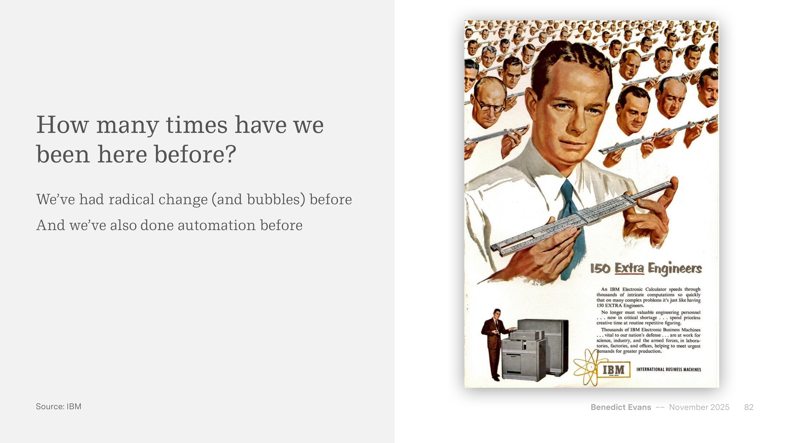

### AI 模型解释

好的，作为一名资深的行业分析师，我将详细分析这张PPT图片，并结合上下文给出我的解读。

**1. 图片的核心内容和数据是什么？**

这张PPT图片的核心内容是由IBM制作的一个宣传册，主要展示了 IBM Electronic Calculator (电子计算器) 在1956年，帮助解决美国国家防御界面临的一系列问题。关键数据点是：

* **150 Extra Engineers:**  宣传册显示当时的IBM，专门为此目的聘请了150名额外的工程师。
* **IBM Electronic Calculator (电子计算器):**  这款电子计算器被宣传为解决复杂国家防御问题的关键工具。
* **宣传页的其他信息:**  宣传册详细介绍了计算器所能解决的问题，强调了其带来的效率提升和人才需求的变化。

**2. 它试图传达的关键信息或观点是什么？**

这张图片试图传达以下几个关键信息：

* **技术变革的周期性:** “How many times have we been here before?” 这一标题，暗示了技术变革或行业转型，像泡（Bubble）一样，必然会反复出现，呈现出一种周期性的趋势。历史会重演，技术进步会带来大规模的劳动力需求变化，且这些变化往往伴随社会经济的巨变。
* **劳动力结构变化与技术进步的关联：** IBM通过引入这款电子计算器，创造了大量新的雇佣机会（150名工程师）。这表明，技术创新总是伴随着劳动力结构的显著变化，需要大量新的技能人才。
* **创新对社会经济的影响：**  IBM电子计算器的推行，展示了科技创新对国家安全、经济发展和人才需求产生的巨大影响。它体现了技术创新能够改变社会结构，催生新的产业，并改变人们的工作方式。
* **“历史会重演”的主题性表达：** 整个PPT可能围绕着“历史会重演”这个主题展开，利用这个事件来预示或解释当前AI平台的变迁。

**3. 这张图在整个关于AI平台变迁的演讲中可能扮演什么角色？**

考虑到其内容和背景，这张图片在关于AI平台变迁的演讲中，很可能扮演以下角色：

* **开场白和历史背景：**  这张图片可以作为开场白，通过一个具体的历史案例，引出关于技术变革和劳动力市场变迁的讨论。它为后续讲座关于AI平台产业的演变，提供了历史的视角和对比。
* **引发思考和引发共鸣：**  “历史会重演”的主题，能让听众回想起过去技术变革带来的影响，从而更深刻地理解当前AI平台快速发展和潜在的社会经济影响。
* **预示未来：**  通过展示过去150名工程师的需求，可以暗示当前AI平台开发和应用，也需要大量的人才支持，并且未来可能会出现类似的劳动力结构变化。 这能够引导听众思考AI平台对社会就业市场的影响。
* **作为对比和警示：**  可以将当时的IBM电子计算器与如今的AI平台进行对比，突出技术的进步和影响的巨大差异。可能作为警示，提醒人们要关注技术发展对产业和社会可能造成的冲击和挑战。

总而言之，这张图片通过一个具体的历史案例，旨在从宏观层面，阐述技术变革的本质，以及它对劳动力市场和社会经济的影响。 

希望我的分析能够帮到您！  如果您有任何其他问题或需要更深入的分析，请随时提出。

---

## 图片: `page_83.png`

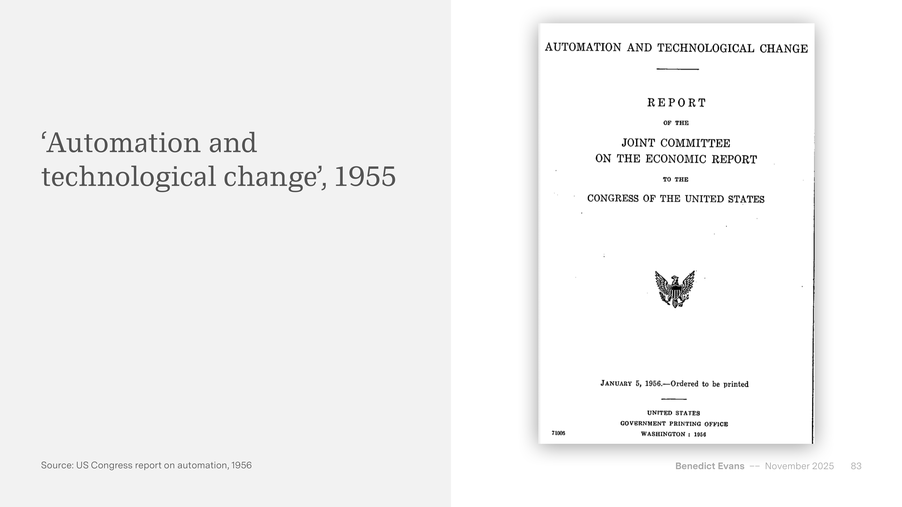

### AI 模型解释

好的，作为一名资深的行业分析师，我将对这张PPT图片进行详细分析：

**1. 图片的核心内容和数据是什么？**

*   **标题:** "Automation and technological change" (自动化与技术变革)
*   **时间:** 1955
*   **图像内容:** 这是一张名为“Automation and Technological Change”的报告封面照片。报告抬头显示为“Joint Committee on the Economic Report to the Congress of the United States”。
*   **来源:** 明确指出该图片来源于“US Congress report on automation, 1956”  （美国国会自动化报告，1956年版）。

**2. 它试图传达的关键信息或观点是什么？**

*   **早期对AI的担忧与兴趣:** 这张图片代表了1955年美国国会关于自动化和技术变革的早期研究。 虽然“AI”这个概念当时尚未完全成形，但报告反映了当时对于机器自动化可能带来的巨大影响，以及由此引发的对社会和经济变革的担忧和兴趣。 报告的主题本身预示着美国在探索机器智能和智能自动化可能带来的机遇和挑战。
*   **关注核心问题：**  1955 年的报告直接挑战了当时对技术进步的乐观态度，它关注技术进步对劳动力、国民经济和人类社会可能带来的潜在负面影响（失业、技能过时、社会不平等）。
*   **预示未来趋势：**  尽管1955年的技术水平远不如现在，但该报告的出现展现了早期对人工智能和社会变革的关注，为后来AI发展和技术伦理研究奠定了基础。

**3. 这张图在整个关于AI平台变迁的演讲中可能扮演什么角色？**

*   **历史背景的引入：**  这张图片将作为演讲的开篇，为整个关于AI平台变迁的演讲提供一个重要的历史背景。 它将把演讲中的AI发展脉络置于更广阔的历史背景中，展示如何一次又一次，人们对技术进步的看法和应对方式都在演变。
*   **强调“技术焦虑”：**  这张图片能够突出早期对技术变革的“焦虑”情绪，这与如今AI普遍的乐观态度形成对比。帮助听众理解AI发展并非一帆风顺，而是经历了不同时期的担忧和探索。
*   **引出关键主题：**  可以作为引出演讲中关于技术伦理、社会影响、政策制定等主题的切入点。 比如，可以探讨为何早期对AI“焦虑”会影响到今天的政策制定，以及如何更好地应对技术变革带来的挑战。
*   **提供参考标准：**  可以作为对比参考，将如今AI的发展趋势与1955年的担忧进行对比，从而更深入地理解AI平台变迁的复杂性和多元性。

总而言之，这张1955年的报告封面图片，不仅仅是一张照片，更是一份充满历史意义的见证。它代表了人类对技术变革最初的思考，也为我们理解现代AI平台变迁提供了重要的视角。

希望这个分析对您有帮助！ 如果您有关于其他PPT图片的内容分析需求，请随时提出。

---

## 图片: `page_84.png`

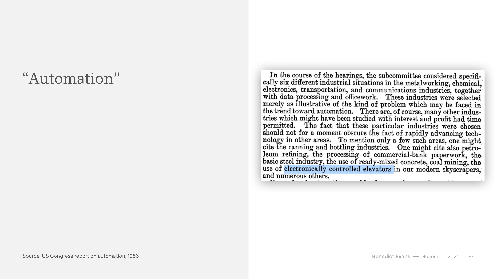

### AI 模型解释

好的，作为一名资深的行业分析师，我来详细解读这张PPT图片。

**1. 图片的核心内容和数据是什么？**

*   **主要内容：**  这张PPT图片呈现的是1956年美国国会提交的关于自动化（Automation）的报告（US Congress report on automation, 1956）的片段。
*   **具体案例：**  报告列举了六种工业领域作为自动化趋势的案例：
    *   金属加工、化工
    *   电子学、运输、通讯
    *   数据处理和办公
    *   石油精炼
    *   商业纸张加工
    *   基础钢材生产
    *   预拌混凝土
    *   煤矿开采
    *   电子控制电梯 (用于现代摩天大楼)
    *   以及其他类似的行业。

**2. 它试图传达的关键信息或观点是什么？**

*   **自动化是普遍存在的趋势：**这张图片的核心观点是，自动化正在且将继续渗透到各个行业，而不是仅仅体现在某些特定领域。它强调了自动化已经并正在加速发展，并且影响非常广泛。
*   **问题导向：**  作者选择这些典型的行业案例，是为了突出自动化带来的挑战，比如对劳动力、生产过程和工业结构的影响。 
*   **强调“讨论”的必要性：**  报告片段的背景信息“In the course of the hearings, the subcommittee considered specifically six different industrial situations…”，表明此段文字与一个听证会（hearing）相关联，暗示对自动化趋势进行深入讨论和研究的必要性。

**3. 这张图在整个关于AI平台变迁的演讲中可能扮演什么角色？**

考虑到这张图片是1956年的，并且是在关于“AI平台变迁”的演讲中出现的，它在演讲中扮演的角色相当重要：

*   **历史背景的基石：**  这张图片提供了一个非常早期的视角，将当前的AI平台变迁置于一个更长的时间框架内。 实际上，如果“AI平台变迁”指的是目前机器学习、深度学习等AI技术的快速发展，那么 1956年是其发展史的“婴儿期”。
*   **对比和反思的工具：**  可以用来与当前AI技术的发展进行对比。  例如，可以说明 1956 年对自动化的担忧与今天人们对 AI 对工作、经济和社会的影响进行比较， 从而引发对技术进步带来的伦理、社会问题进行反思。
*   **强调技术进步的必然性：**  作为早期的报告，可以佐证技术进步、例如自动化，通常伴随着一些不确定性和挑战，让听众对如今 AI 技术的快速发展不感到过于惊讶。
*   **引发对“生产力”和“效率”的思考：**  1956年的报告暗示了自动化旨在提高生产力，而现在关于AI平台变迁的演讲，可以延伸到AI如何帮助企业提高效率，从而产生新的经济增长点。

**总结：**

这张 PPT 图片不仅仅是一个行业案例列表，它是一个重要的历史节点，提醒我们技术变革的持续性，以及对技术进步进行仔细评估和规划的重要性。  它为关于“AI平台变迁”的演讲提供了一个很有力的历史支撑点， 帮助听众更好地理解当前的技术趋势，并思考未来的发展方向。

希望这个分析对您有所帮助! 如果您有任何其他相关问题，欢迎随时提出。

---

## 图片: `page_85.png`

### AI 模型解释

好的，作为一名资深的行业分析师，我来详细解读这张PPT图片，并分析它在整个关于AI平台变迁的演讲中所扮演的角色。

**1. 图片的核心内容和数据是什么？**

这张图片展示的是一个老式工业控制柜，可能属于工厂或大型设施。它具有以下几个关键元素：

* **物理控制界面：**  控制柜上可以看到明显的机械控制按钮和操纵杆。这些是传统上用于控制机器或流程的物理界面。
* **机械元素：**  它强调了“控制”的物理本质，例如“Release”、“Safety” 等标签，以及操纵杆的旋转，都代表着手动操作。
* **年代感：**  图片本身已具有年代感，暗示了我们正在回顾过去的技术发展，以及我们是如何在过去控制和自动化系统。
* **标签和标识:**  “Release”、“Safety”等标签，突出了控制的特定目的和风险。

**2. 它试图传达的关键信息或观点是什么？**

这张图的核心信息是使用一种类比，旨在说明AI平台变迁的本质，以及我们已经走过的道路。它试图传达以下几个关键观点：

* **从“手动控制”到“AI控制”的转变：**  这张图代表了从完全依靠人类手动控制的时代，到目前AI平台逐渐取代人类进行控制和决策的转变。
* **“控制”的概念迭代：** 即使AI在控制和决策方面变得智能和自主， 我们仍然需要重新定义“控制”的概念。AI并非完全代替人类，而是在特定场景下提供更高效的“控制”形式。
*  **“AI平台”的控制层次：**  AI平台本身也可以视为一个控制系统。它会调用各种算法和模型来控制资源，优化流程，甚至进行决策。这张图表明了AI平台也需要一套“控制”机制。
* **风险和安全:**  图片上的“Safety”标签，暗示智能控制系统同样需要考虑安全问题， 这是一个不可忽视的因素。

**3. 这张图在整个关于AI平台变迁的演讲中可能扮演什么角色？**

  这幅图很可能在演讲的**开场或早期阶段**扮演重要的角色， 并且有以下几个作用：

* **建立基础：** 它是视觉化的开端，帮助观众理解AI控制的转变，从一个基于物理控制柜的比喻开始，能够更容易引起听众的思考。
* **引发思考：**  它能够直接挑战观众对“智能”和“控制”的传统观念，引发对技术进步的讨论，以及我们如何平衡效率和人类在控制过程中的作用。
* **引出对比：** 在后续演讲中，这张图可以作为一种对比，用来突出现在的AI平台与旧式控制柜之间的差异，以及AI在自动化方面的潜力。
* **引导讨论：**  演讲者可以利用这张图来引导和组织讨论，比如：“我们是如何在过去控制机器的？现在我们如何利用AI平台来控制，甚至可以设计出更复杂的“控制”系统？”

**总结:**

这张PPT图片是一个富有象征意义和深度视觉元素。它在技术发展演变这一主题中，不仅仅是一张图片，更蕴含着对控制、自动化、智能和未来AI平台发展方向的深刻思考。

希望我的分析对您有帮助!

---

## 图片: `page_86.png`

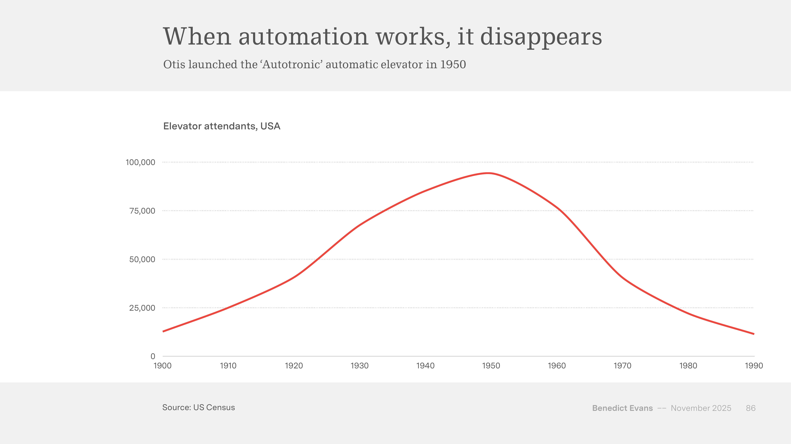

### AI 模型解释

好的，作为一名资深行业分析师，我来详细分析这张PPT图片。

**1. 图片的核心内容和数据是什么？**

这张图是用折线图的形式呈现的数据，主要内容是：

*   **标称数据来源：** 美国人口普查局 (US Census)
*   **衡量对象：** 美国（USA）的电梯值班人员数量。
*   **时间范围：** 1900年到1990年。
*   **具体数据趋势：**
    *   1900年左右：电梯值班人员数量接近1万。
    *   1920-1940年间： 缓慢上升，到1940年左右数量达到约2万。
    *   1950年：  1950年otis公司推出自动电梯，电梯值班人员数量猛增，达到峰值约10万。
    *   1960-1980年间： 数量有所下降，到1990年左右回落至约5000人左右。

**2. 它试图传达的关键信息或观点是什么？**

这张图的核心信息（或观点）是通过一个非常直观的方式呈现的：**自动化技术会对劳动力市场造成显著冲击，并最终导致大量岗位的消失。**  它通过展示电梯值班人员数量的减少，揭示了技术进步对传统体力劳动岗位的颠覆性影响。 

更深层的观点是：**技术的进步并非总是有益的，它可能引发结构性失业，并需要社会进行适应和调整。**  这张图也暗示了技术发展与就业机会之间的潜在冲突。

**3. 这张图在整个关于AI平台变迁的演讲中可能扮演什么角色？**

在关于AI平台变迁的演讲中，这张图可以扮演一个非常重要的过渡角色，并且应该在演讲的开场或中间阶段使用。 

*   **引出核心论点：**  这图可以作为引发对“AI是否会取代人类工作”等问题的开端，为后续对AI技术对就业市场的影响进行深入讨论提供一个强有力的案例。
*   **作为对比：**  在讲解AI平台（例如自动化机器人、智能算法）如何改变各种行业时，这张图可以作为一种对比，提醒听众技术变革的反复模式： 首次引入新技术后，劳动力市场会出现规模性失业，之后技术逐渐被市场所接受并融入到现有生产流程中，从而稳定就业。
*   **强调未来挑战：**  这图可以用于强调AI技术发展也可能带来新的就业结构变化，以及我们需要如何应对未来的失业问题。例如，可以呼吁政府和企业投资于技能培训和再就业项目，以帮助那些因AI技术失业的人们。
*   **加强论证：**  在后续对AI平台的竞争、融资、伦理等方面的讨论时，这张图可以作为论据的支撑，增强演讲的说服力。

**总结：** 

这张图之所以抓人眼球，是因为其简洁明了地呈现了一个普遍的现象： 技术进步带来的劳动力市场变化。  它不仅仅是一个数据图表，更是一个关于人类社会发展、技术进步与社会结构关系的隐喻。 

希望我的分析对您有帮助！

---

## 图片: `page_87.png`

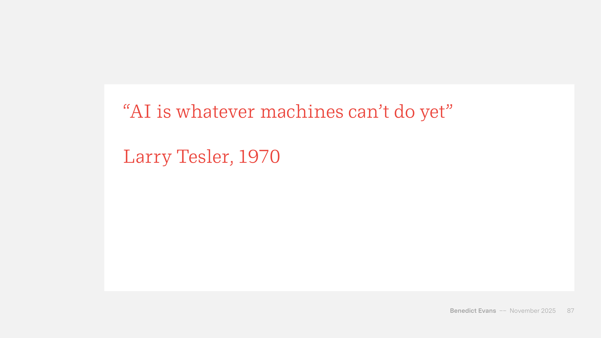

### AI 模型解释

好的，作为一位资深的行业分析师，我将对这张PPT图片进行详细分析。

**1. 图片的核心内容和数据是什么？**

这张PPT图片的核心内容非常简洁：

*   **文字信息:**  “AI is whatever machines can't do yet.” (AI 是机器还不能做到的事情)
*   **出处:** Larry Tesler, 1970  (拉里·泰勒，1970年)

这句被引用中的文字，是拉里·泰勒在1970年与当时乔布斯和康正讨论AI时说的，当时他用这句话来定义AI的概念。

**2. 它试图传达的关键信息或观点是什么？**

这句引用最关键的信息是： **AI 不是一个预定义的概念或者一个静态的目标**。 泰勒认为，AI 不是一种特定的技术或算法，而是在机器能够完成的任务之外。 换句话说，AI 的定义随着机器能力的进步而变化。

更深层次地理解，这句话反映了当时对AI的乐观态度，也预示着AI领域未来发展的可能性。 泰勒的观点强调了：

*   **迭代式发展:** AI 不是一蹴而就的，而是需要通过机器能力不断突破和进步。
*   **超越现有认知:** AI 的边界是不断被机器挑战和打破的，因此定义需要动态变化。

**3. 这张图在整个关于AI平台变迁的演讲中可能扮演什么角色？**

考虑到PPT的整体内容是关于AI平台变迁的，这张图片在演讲中可以扮演以下几个关键角色：

*   **开篇点题:** 作为演讲的开场，用一句经典名言来引人入胜，巧妙地定义了AI的本质，为后续的演讲提供了一个清晰的框架。 强调AI 的发展是基于进步而非预设概念。
*   **历史背景补充:** 1970年是AI 发展早期， 这句话可以用来展示AI 领域早期设定的愿景，对比现在AI的成熟程度，说明AI 概念的不断演变。
*   **框架导向:** 作为演讲的理论基础，可以将它与后续描述的AI平台各个阶段的演变联系起来。比如，早期基于专家系统的AI，以及现在大规模机器学习的平台，都可以用这句话来理解其发展逻辑。
*   **反思与展望:** 在演讲的结尾，可以引用这句话，鼓励听众思考未来AI的发展方向，以及如何定义“AI”在更广阔的领域中。

**总结:**

这张图片不仅仅是一句名言，它承载着AI领域早期对AI概念的理解，并且在整个演讲中可以起到定义基础、映射历史和展望未来的作用。它体现了AI开发领域最初的思维，也提醒我们AI的定义本身就是不断变化的。

希望我的分析对您有所帮助！

---

## 图片: `page_88.png`

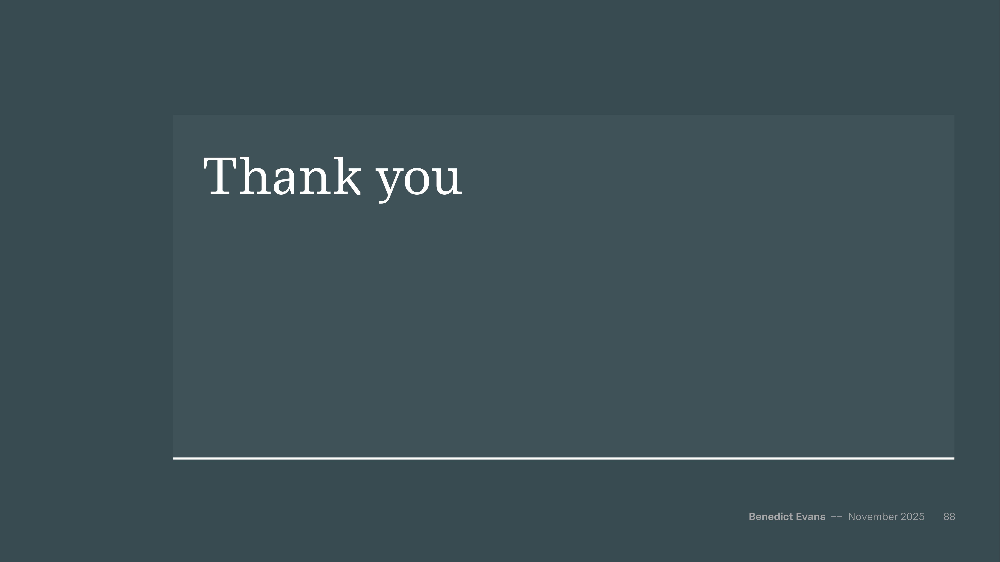

### AI 模型解释

好的，作为一名资深的行业分析师，我来详细解读这张PPT图片：

**1. 图片的核心内容和数据是什么？**

这张PPT图片非常简约，实际上它几乎没有“数据”，仅仅是一个简单的“Thank you”（谢谢）字样。 

*   **字样:** “Thank you” 表达了演讲者对听众的表达感谢。
*   **背景 & 字体:** 深蓝的背景色，配合简洁的字体， 给人一种专业、严谨的印象。 

**2. 它试图传达的关键信息或观点是什么？**

仅仅是“Thank you” 这句话本身，并不能传递关键信息。 但是，根据图片本身以及它出现的语境，我们可以推测它可能传递以下关键信息：

*   **确认演讲的结束:** 这很可能就是演讲的结束页，用来标志着讲座的结束。
*   **表达谢意:** 演讲者希望感谢听众的聆听，并可能希望听众继续思考或采取行动。
*   **营造专业回馈的氛围:** 在演讲结束时表达谢意，体现了演讲者的职业素养和对听众的尊重。

**3. 这张图在整个关于AI平台变迁的演讲中可能扮演什么角色？**

考虑到这是一张关于“AI平台变迁”的演讲，这张图很可能位于演讲的 **结尾页**。 

*   **总结与承接:**  在整个演讲中，可能先回顾了AI平台的发展历程，然后介绍了最新的趋势和挑战。 这张结束页，用“Thank you”来总结，并且可以作为接下来行动的引子。 
*   **留给听众思考的余地:** 结尾页可以引导听众思考： "AI平台未来的变迁对我们行业意味着什么？" 
*   **环节过渡:**  这可能用来介绍后续的问答环节，或者引导听众进一步讨论。

**总结:**

这张PPT图片本身非常简洁，但它在整个演讲中扮演着重要的过渡和总结角色，表明演讲的结束，并表达对听众的感谢。  它更像是一个礼貌性的结束句，而不是提供任何实质性的数据或分析。  整个演讲的重点，应该在于之前的内容，这张图只是为了更好地完成演讲的流程。

希望这个分析对您有帮助！如果您能提供更多关于PPT内容的信息（例如，之前的PPT页面信息），我可以提供更详细的解读。

---

## 图片: `page_89.png`

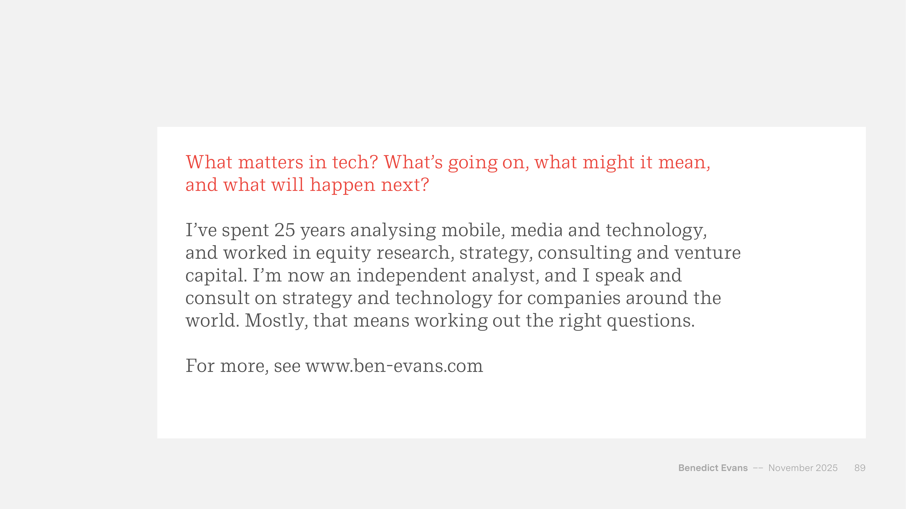

### AI 模型解释

好的，作为一名资深的行业分析师，我来详细分析这张PPT图片：

**1. 图片的核心内容和数据是什么？**

这张图片包含 Benedict Evans 独立分析师的自我介绍，主要信息如下：

* **核心内容：** Benedict Evans 是一位独立分析师，专注于分析移动、媒体和科技行业。
* **具体经验：** 他在 equity research (股权研究)、战略咨询和风险投资领域拥有25年的经验。
* **核心服务：** 他主要提供战略咨询和技术评估服务，帮助公司解决关键问题。
* **联系方式：** 提供了他的个人网站www.ben-evans.com，方便听众进一步了解他的工作。

**2. 它试图传达的关键信息或观点是什么？**

这张图片的核心信息是建立 Benedict Evans 的专业形象和可信度。它突出以下关键观点：

* **经验积累：** 强调他 25 年的行业经验，表明他具备丰富的领域知识和深刻的洞察力。
* **专业领域：** 直接点明他专注于移动、媒体和科技领域，表明他对该领域有深入了解。
* **目标服务：**  明确了他所提供的服务类型——战略咨询和技术评估，让听众了解他能为他们带来什么价值。
* **独立性：**  "独立分析师" 的定位，暗示他拥有客观独立的视角，不受任何利益集团的影响。

**3. 这张图在整个关于AI平台变迁的演讲中可能扮演什么角色？**

考虑到这张图片本身看起来像一位行业分析师的自我介绍，它很可能出现在整个关于AI平台变迁演讲的开场部分或过渡环节中。具体来说，它可能扮演以下角色：

* **开场白：** 作为演讲的开场，介绍演讲者的背景和专业领域，建立演讲的权威性和可信度。
* **过渡环节：** 在深入探讨AI平台变迁之前，介绍分析师的视角和方法，为接下来的内容做铺垫。例如，可能会引出“如何才能理解AI平台变迁的关键在于拥有行业经验和专业视角”的观点。
* **强调分析的重要性：**  在整个演讲中，强调专业分析师在理解复杂技术趋势中的作用，例如，分析师如何通过数据、案例和战略视角来解读AI平台的变革。

**总而言之，这张图片不仅是 Benedict Evans 的自我介绍，更是他作为一名行业分析师的身份宣告，为整个关于AI平台变迁的演讲奠定了基调，也预示着听众将要听到的是基于专业视角和经验的深度解读和分析。**

希望这个分析对您有所帮助!  如果您有其他图片需要分析，请随时提出。

---

## 图片: `page_9.png`

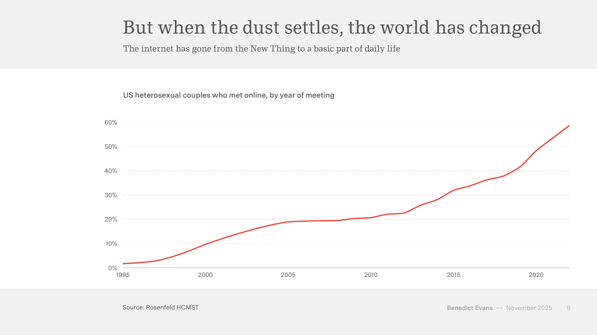

### AI 模型解释

好的，作为一名资深的行业分析师，我来详细解读这张PPT图片：

**1. 图片的核心内容和数据**

这张图呈现的是美国异性恋情侣通过网络相遇的比例，以年为单位，从1995年到2020年。  

*   **数据表现:**
    *   1995年：仅约3%的异性恋情侣是通过网络相遇的。
    *   2000年：约8%
    *   2005年：增长到约19%
    *   2010年：达到约31%
    *   2015年：增长到约47%
    *   2020年：达到了惊人的61%
*   **图表类型:** 这是一个线形图，清晰地展示了时间跨度内的趋势变化。
*   **数据来源:**  Rosenfeld HCMST (Rosenfeld, Hancock, Carmichael, & Toma Studies).  这表明数据是基于权威学术研究。

**2. 它试图传达的关键信息或观点**

这张图的核心信息是：**互联网的崛起和普及，特别是社交媒体平台的兴起，极大地改变了人们认识和建立关系的方式。**  这条红线陡峭的上升趋势表明，越来越多的人通过网络找到了他们的伴侣。

更深层次的观点在于：
*   **社会关系的转型：**  它暗示了传统、基于地理位置的社交方式正在被数字化平台所取代。
*   **技术对社会的影响:**  它象征着科技，特别是互联网，正在深刻地改变着人类的社会互动模式。
*   **平台影响：**图表直接强调了社交媒体平台对现代恋爱关系产生的影响。

**3. 这张图在整个关于AI平台变迁的演讲中可能扮演什么角色？**

考虑到PPT标题“But when the dust settles, the world has changed”，这张图很可能作为演讲的开篇或者过渡环节使用。

*   **引出主题：**  它可以用作一个引人入胜的开场，吸引听众的注意力。通过一个具体的、极具冲击力的数据，  直接点明了技术对社会结构和人际关系的影响，为后续关于AI平台变迁的讨论奠定基础。
*   **对比未来趋势：**  通过这张图，可以与未来的AI平台的发展趋势进行对比。例如，演讲者可以探讨，AI平台如何进一步改变我们认识、社交和建立关系的方式，  类似于互联网早期的影响。
*   **强调变革：**  这幅图有助于听众理解“dust settles” 所指的并非只是技术的成熟，  而是社会关系和人际互动模式的根本性转变。
*   **加强论点：** 演讲中可能接着探讨AI平台的商业模式、伦理问题，以及它们如何延续并加速社会变革的趋势。

**总结:**

这张图通过一个具体的数据，  清晰地呈现了互联网对社会关系影响的巨大，  并为后续关于AI平台发展变迁的讨论提供了一个强有力的背景和论点。我认为，它能很好地作为一个引人深思的开场， 也将在整个演讲中扮演关键角色。

---

## 图片: `page_90.png`

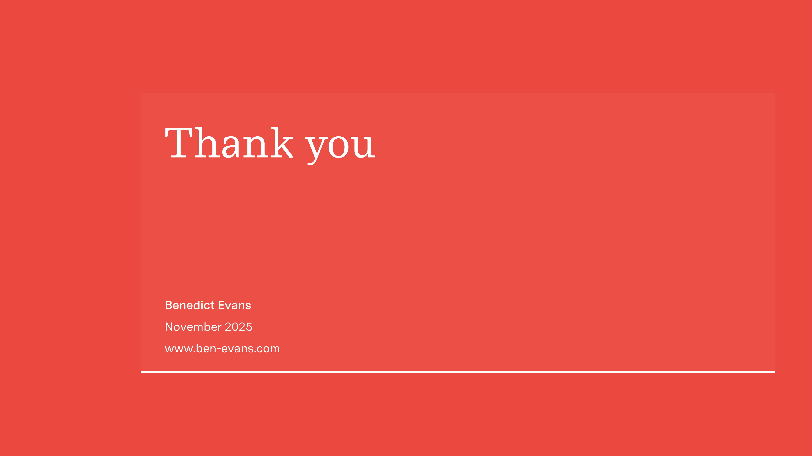

### AI 模型解释

好的，作为一位资深的行业分析师，我将详细分析这张PPT图片：

**1. 图片的核心内容和数据是什么？**

这张PPT图片非常简约，实际上几乎没有任何数据或核心内容。它主要包含以下几个元素：

*   **文本：** 大大的“Thank you”字样，用白色文字叠加在红色背景上非常显眼。
*   **演讲者信息：** “Benedict Evans” 展示了演讲者的姓名，表明这属于演讲的一部分。
*   **日期：** “November 2025” 标注了演讲的日期，暗示这个演讲是预示了未来的分析。
*   **个人网站：** “www.ben-evans.com” 是演讲者个人网站的链接，方便后续进一步了解。

**2. 它试图传达的关键信息或观点是什么？**

这张图片本身并没有传递具体的信息或观点。它的主要作用是：

*   **结束标记：** 强烈暗示会议或演讲已接近尾声，提醒听众准备结束。
*   **建立联系：** 展示演讲者信息，让听众意识到演讲者是谁，并方便后续交流。
*   **品牌推广：** 附上个人网站，旨在进行个人品牌推广和传递演讲者未来可能发布的更多分析。

它并不是一个内容丰富的演示，而是一个“敬礼”式的结束语，是演讲者建立联系和推动后续互动的一种手段。

**3. 这张图在整个关于AI平台变迁的演讲中可能扮演什么角色？**

考虑到演讲主题是关于AI平台变迁，这张图片很可能出现在演讲的**末尾**部分。 

*   **过渡：**它作为一页的过渡内容，从演讲中更复杂的分析和预测，平稳地过渡到演讲的结束。

*   **感谢与互动：** 演讲者可能希望通过“Thank you”来感谢听众的聆听，并鼓励其在Q&A环节进行提问、互动。
*   **建立个人品牌：** 在整个演讲结束后，提供个人的网站，方便听众了解更多演讲者的观点。

**总结：** 

这张图片是一个极其简约的视觉元素，在整个AI平台变迁的演讲中，主要扮演的是一个结束标记和建立个人品牌触点的角色，而非一个数据驱动的视觉呈现。 它反映了演讲者一种重视与听众沟通、并希望保持互动和联系的演讲风格。

希望这个详细的分析能够满足您的需求。 如果您能提供PPT的上下文信息，例如演讲的主题、之前页面的内容，我能够给出更精准的解读。

---

