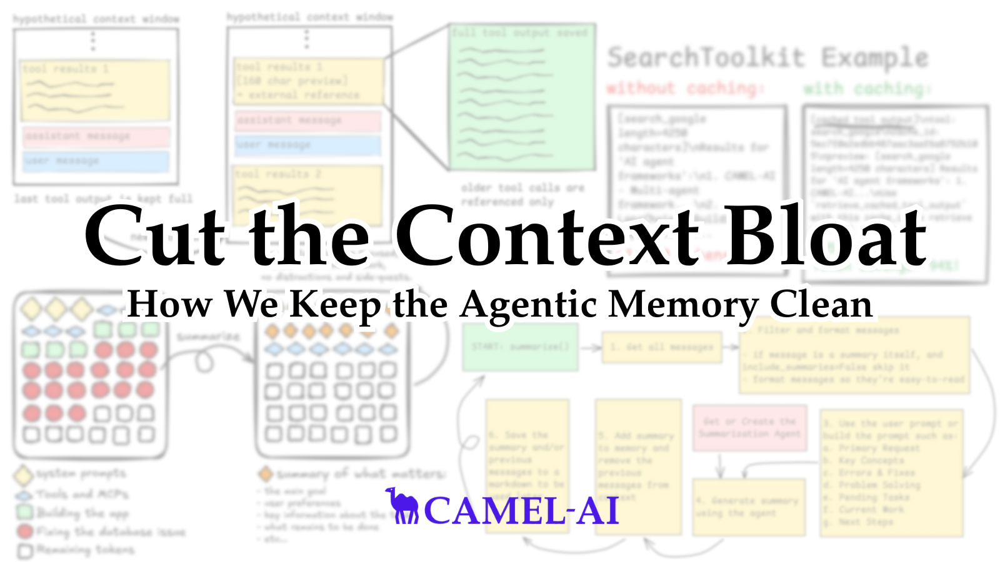
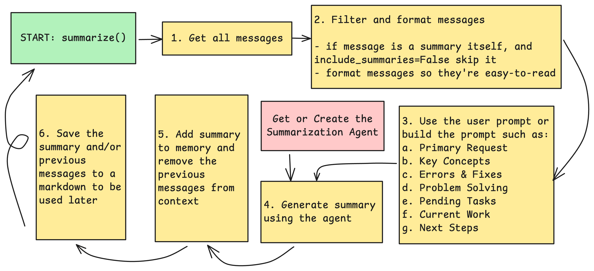
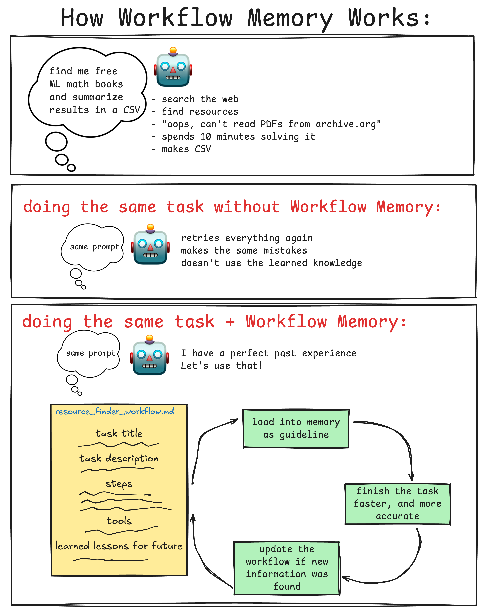
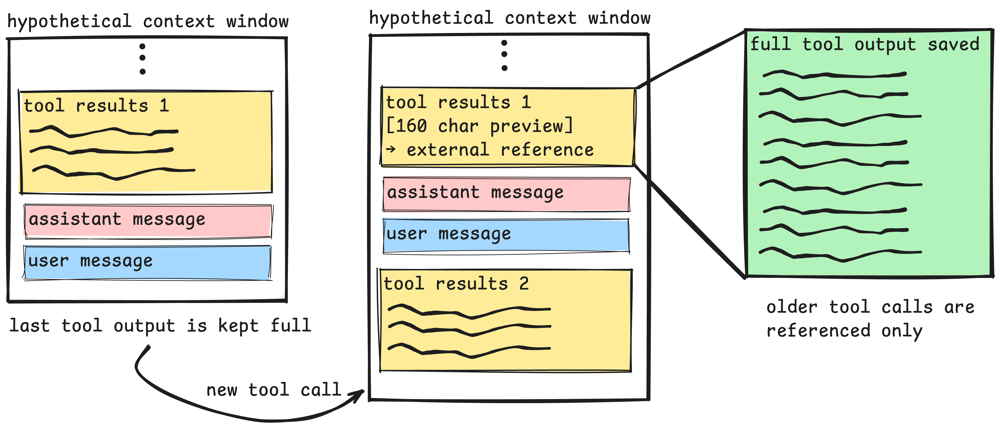

# AI Agent 记忆优化：CAMEL 框架中的上下文工程实践

> 本文是对 CAMEL AI 团队博客文章 [Brainwash Your Agent: How We Keep The Memory Clean](https://www.camel-ai.org/blogs/brainwash-your-agent-how-we-keep-the-memory-clean) 的解读和分析。

## 一句话总结 (TL;DR)

为了防止 AI Agent 的上下文被无关信息污染（“上下文腐化”）导致性能下降，CAMEL 框架实现了三种核心的上下文工程技术：**上下文摘要**（将长对话历史压缩成关键信息）、**工作流记忆**（记录任务解决方案以备将来复用）和**工具输出缓存**（一种旨在节省 Token 但因可能导致信息丢失而被暂时搁置的探索）。这些技术旨在通过精简和优化 Agent 的记忆，在不更换底层大模型的情况下，显著提升其智能、效率和稳定性。

---

## 1. 问题陈述

随着 AI Agent 执行的任务越来越复杂，其“记忆”或“上下文”窗口会迅速被大量信息填满。这些信息往往包含大量低信噪比的内容，例如：为了修复一个 Bug 而进行的大量网络搜索、冗长的工具输出、以及偏离主任务的“支线任务”对话。这种现象被称为“上下文腐化”（Context Rot），它会导致 Agent 出现以下问题：
-   **性能下降**：难以回忆起关键指令或信息。
-   **工具选择错误**：在众多工具中无法做出正确选择。
-   **指令跟随失败**：无法严格遵循最初的提示。
-   **成本增加**：冗长的上下文意味着更高的 Token 消耗。

核心问题是：**如何有效管理 Agent 的上下文，只保留对完成目标至关重要的信息，同时丢弃冗余和无关的数据，从而在保持高精度的同时，提升效率和降低成本？**

## 2. 核心思想/方案

文章的核心思想是**上下文工程 (Context Engineering)**，即主动地、有策略地管理和塑造提供给大模型的信息。原文指出，通过上下文工程，开发者可以更有效地引导 Agent 的行为，从而增强其智能表现。

文章介绍了 CAMEL 框架中用于保持 Agent Memory Clean (记忆干净) 的三种具体技术：

1.  **上下文摘要 (Context Summarization)**：当对话历史变得过长或偏离主题时，通过一个专门的提示词（Prompt）调用 LLM，将现有上下文浓缩为关键摘要，从而“重置”或“刷新” Agent 的记忆，使其重新聚焦于核心任务。

2.  **工作流记忆 (Workflow Memory)**：将一次成功的任务执行过程（包括解决步骤、使用的工具、遇到的失败和恢复策略）记录下来，形成一个通用的“经验”文件。当未来遇到类似任务时，Agent 可以加载这些“记忆”，从而更快、更有效地制定执行策略。

3.  **工具输出缓存 (Tool Output Caching)**：这是一个带有警示意味的案例。该方案尝试将冗长的工具输出（如网页 DOM、文件内容）缓存到外部，仅在上下文中保留一个引用和简短预览。虽然这能极大节省 Token，但由于可能导致信息丢失和增加 Agent 的认知负荷，该方案被暂时搁置。这揭示了在内存管理中**效率与准确性之间的核心权衡**。

## 3. 关键技术细节

### 3.1 上下文摘要 (Context Summarization)

-   **触发时机**：
    1.  **自动触发**：当 Token 使用量达到阈值（如 80%）时自动启动。
    2.  **手动触发**：开发者通过 API 显式调用，完全掌控刷新时机。
    3.  **工具触发**：Agent 本身也可以调用一个工具来总结上下文或搜索已被总结的内容。
-   **实现流程**：
    1.  系统检测到触发条件。
    2.  构造一个包含特定指令的**摘要提示词 (Summarization Prompt)**。这是该技术成败的关键。
    3.  LLM 根据提示词，从对话历史中提取关键信息（如用户主请求、待办事项、当前工作等）。
    4.  生成的摘要替换掉大部分原始对话历史，并保留少量关键的用户消息作为补充，以减少对 LLM 摘要可靠性的完全依赖。
    
    

-   **关键点**：**摘要提示词**的设计至关重要，它直接决定了摘要的质量和有效性。CAMEL 团队在不断迭代这个提示词，同时也允许开发者自定义。

### 3.2 工作流记忆 (Workflow Memory)

-   **核心理念**：将解决特定任务的“经验”标准化、结构化，以便未来复用。
-   **数据结构**：工作流记忆被保存为一个结构化的 Markdown 文件，包含以下字段：
    -   `Task title`: 任务的通用标题。
    -   `Task description`: 用户需求的段落摘要。
    -   `Solving steps`: 通用、可复现的解决步骤列表。
    -   `Tools`: 使用的工具及其用途。
    -   `Failure and recovery strategy`: （可选）失败、原因及恢复策略。
    -   `Notes and observations`: （可选）其他关键笔记。
    -   `Tags`: 用于分类和语义匹配的标签。
    
    

-   **加载机制**：
    1.  **精确指定**：开发者直接指定要加载的会话。
    2.  **自动关联**：Agent 根据自身 `role_name` 查找之前保存的工作流文件。
    3.  **智能选择**：Agent 查看所有工作流的标题、描述和标签，选择最相关的几个加载。
-   **设计哲学**：该方案的设计没有采用 RAG 进行工作流检索，其目的是为了避免引入额外的系统复杂性。其理念是为每个 Agent 维护一小组高质量、动态的外部记忆文件，而不是一个庞大的、需要检索的知识库。

### 3.3 工具输出缓存 (A Cautionary Tale)

-   **问题**：工具（尤其是网页浏览工具）的输出可能非常冗长（数万 Token），它们在上下文中迅速累积，造成污染。
-   **原始方案**：
    -   监控工具输出，当其超过一定长度（如 2000 字符）时进行缓存。
    -   在上下文中用一个**引用 ID** 和**内容预览**（如前 160 个字符）替换完整输出。
    -   提供一个检索工具，让 Agent 在需要时可以根据 ID 加载完整输出。
    
    

-   **失败原因（警示）**：
    1.  **信息丢失风险**：Agent 可能仅根据预览做出判断，认为不需要加载完整内容，从而基于不完整的信息做出错误决策。
    2.  **增加认知负荷**：Agent 需要额外思考何时需要加载完整输出、追踪缓存 ID 等，这分散了其解决核心任务的“精力”。

## 4. 结论

文章的结论是，**上下文工程是提升 Agent 智能和效率的关键杠杆**。通过简单而有效的技术，如上下文摘要和工作流记忆，可以在不改变底层 LLM 的情况下，显著改善 Agent 的性能。

同时，`Tool Output Caching` 的案例也给出了一个重要的警示：在追求 Token 效率时，必须警惕其对 Agent 准确性和认知负荷的负面影响，找到**效率与准确性之间的最佳平衡点**是内存管理的核心挑战。

## 附录：核心术语解释

-   **上下文工程 (Context Engineering)**: 一种主动管理和塑造提供给大语言模型（LLM）的上下文（即输入信息）的技术和实践。其目标是优化上下文，使其包含最高信噪比的信息，从而引导 Agent 更高效、更准确地完成任务。
-   **上下文腐化 (Context Rot)**: 指 Agent 的上下文窗口被大量冗余、无关或过时的信息填满的现象。这会稀释关键信息，导致 Agent 性能下降，出现“失忆”、指令遵循失败等问题。
-   **工作流记忆 (Workflow Memory)**: 一种外部记忆机制，它将成功解决特定任务的完整策略（包括步骤、工具使用、失败恢复等）结构化地记录下来。这使得 Agent 能够“学习”过去的经验，并在未来处理相似任务时进行复用。
-   **认知负荷 (Cognitive Load)**: 在此语境下，指 Agent 为了完成一项任务所需处理的额外信息和决策。例如，管理缓存 ID、判断是否需要加载完整数据等，都增加了 Agent 的认知负含，可能影响其解决核心问题的效率。

## 参考文献

-   CAMEL AI Team. (2025, November 7). *Brainwash Your Agent: How We Keep The Memory Clean*. CAMEL AI Blog. Retrieved from [https://www.camel-ai.org/blogs/brainwash-your-agent-how-we-keep-the-memory-clean](https://www.camel-ai.org/blogs/brainwash-your-agent-how-we-keep-the-memory-clean)
-   Breunig, D. (2025, June 22). *How Contexts Fail (And How To Fix Them)*. Retrieved from [https://www.dbreunig.com/2025/06/22/how-contexts-fail-and-how-to-fix-them.html](https://www.dbreunig.com/2025/06/22/how-contexts-fail-and-how-to-fix-them.html)
-   Jiang, Z., et al. (2024). *Learning to Act from Action-Generalizable Workflows*. arXiv preprint arXiv:2409.07429. Retrieved from [https://arxiv.org/pdf/2409.07429](https://arxiv.org/pdf/2409.07429)
