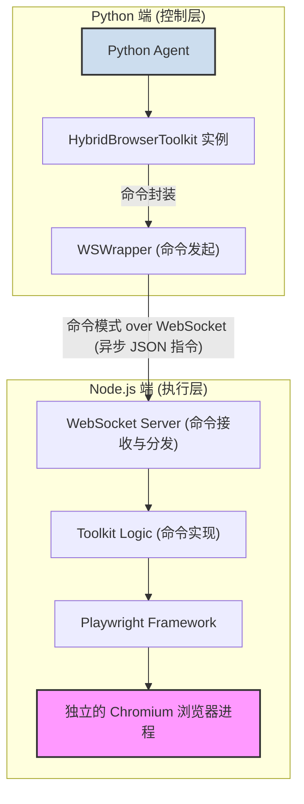
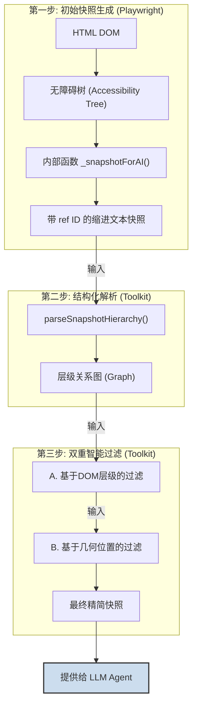
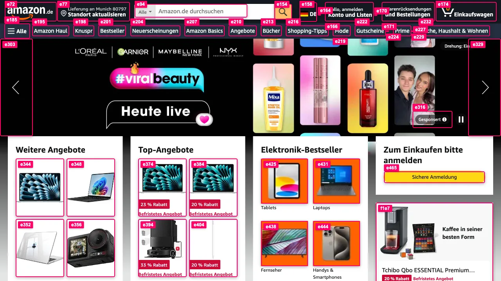

# CAMEL Hybrid Browser Toolkit 技术分析

本文档分析 CAMEL 项目中 `hybrid_browser_toolkit` 的技术实现，覆盖其架构设计、核心功能与通信协议。

## 1. 宏观架构：混合式设计

工具包采用 Python 与 TypeScript (Node.js) 结合的混合架构，旨在解耦上层逻辑与底层浏览器控制，以提升系统的稳定性、隔离性和扩展性。

### 架构优势

1.  **稳定性 (进程隔离)**: 每个 `HybridBrowserToolkit` 实例会启动一个独立的 Node.js 子进程和浏览器实例。这种设计使得不同浏览器会话在操作系统层面完全隔离。单个会话的崩溃不会影响 Python 主进程或其他会话，增强了系统的鲁棒性。

2.  **扩展性 (命令模式)**: 两端通过命令模式进行交互。Python 端将操作（如 `click`）封装成标准 JSON 命令，通过 WebSocket 发送给 Node.js 端执行。这种清晰的接口边界简化了功能扩展：只需在 TypeScript 端添加新命令的实现，并在两端注册该命令即可，无需改动核心通信逻辑。

### 浏览器启动模式

工具包通过 `cdpUrl` 参数支持两种浏览器启动模式，提供了灵活性：
*   **自动模式 (默认)**: 当未提供 `cdpUrl` 时，工具包调用 Playwright 的 `chromium.launch()` 启动一个新的 Chromium 浏览器实例。
*   **手动模式**: 当提供 `cdpUrl` 时，工具包通过 `chromium.connectOverCDP()` 连接到一个已启动并开启了远程调试端口的浏览器实例，便于高级调试和会话集成。

---

## 2. 核心功能：AI 友好的页面快照

页面快照功能通过一个精密的三步流水线，将一个复杂的网页转换为 AI 易于处理的、简洁的结构化数据。其核心在于一个结合了**结构**与**视觉**的双重过滤机制。

### 快照生成与解析流程

#### 第一步：生成 - 利用无障碍树

-   **技术**: 调用 Playwright 的内部、未公开函数 `page._snapshotForAI()`。
-   **原理**: 该函数直接遍历浏览器的**无障碍树 (Accessibility Tree)**，而非原始的 HTML DOM。无障碍树本身已经为屏幕阅读器等辅助技术过滤了大量纯样式、无语义的元素。
-   **优势**: 从源头上实现了第一次“降噪”，获取到的信息天然包含元素的角色（role）和名称（name）。
-   **输出**: Playwright 为树中每个节点分配一个唯一的 `[ref=N]` ID，并以保留层级关系的**缩进文本格式**输出。

#### 第二步：解析 - 从文本到图结构

-   **执行者**: `snapshot-parser.ts` 中的 `parseSnapshotHierarchy` 函数。
-   **原理**: 该函数读取缩进文本，通过分析每行的**缩进量**并借助一个**栈（Stack）**来高效地追踪父节点，从而重建完整的父子层级关系。
-   **输出**: 生成一个 `Map<string, SnapshotNode>` 结构的**层级关系图 (Graph)**。这个图结构是后续所有过滤操作的基础，让程序可以方便地查询任何元素的父、子节点及其属性。

#### 第三步：过滤 - 结合结构与视觉的双重过滤

这是将网页“去芜存菁”最核心的步骤，它通过两道关卡确保最终快照的精确性。

##### A. 基于 DOM 层级的过滤

-   **执行者**: `snapshot-parser.ts` 中的 `filterClickableByHierarchy`。
-   **原理**: 利用第二步生成的层级图，应用一系列启发式规则处理嵌套的可点击元素。
-   **核心规则**:
    1.  **父元素优先**: 在 `link > img` 或 `button > generic` 等常见嵌套中，保留父元素（`link`/`button`），过滤子元素。
    2.  **子元素优先**: 在 `generic > button` 的特殊情况下，反而会过滤父元素 `generic`，保留子元素 `button`，以适应某些 UI 框架的设计。
    3.  **单一包装过滤**: 如果一个 `generic` 元素仅作为单个 `button` 的包装器，则该 `generic` 元素自身会被过滤。

##### B. 基于几何位置的过滤

-   **执行者**: `parent-child-filter.ts` 中的 `filterParentChildElements`。
-   **原理**: 在层级过滤之后，进行第二轮基于视觉位置的过滤，解决 DOM 结构与视觉表现不一致的问题。
-   **核心逻辑**:
    1.  **定义“传播性”元素**: 首先定义一组“传播性”父元素，如 `<a>`, `<button>` 或 `role="button"` 的 `
`。
    2.  **检测几何包含**: 如果一个可点击元素的**包围盒（Bounding Box）**，其 **99% 以上**的面积被一个“传播性”父元素的包围盒所覆盖，则该子元素成为被过滤的候选对象。
    3.  **设置例外规则**: 即使满足包含条件，也**不会**过滤以下需要独立交互的元素，以防误杀：
        *   表单元素 (`input`, `select`, `textarea`)。
        *   自身也带有 `onclick` 事件处理器的元素。
        *   具有 `aria-label` 的元素。
        *   拥有明确交互角色（如 `checkbox`, `radio`）的元素。

通过这种**结构**与**视觉**相结合的双重过滤，最终呈现给 AI 的可交互元素列表被最大程度地简化，同时保证了操作的精确性。

### Set of Marks (SoM): 连接视觉与操作

SoM 功能用于在页面截图中为经过双重过滤后留下的交互元素，标注其对应的 `ref` ID。这使得多模态 Agent 可以通过“看”截图来定位目标元素，然后使用该元素的 `ref` ID 发出精确的操作指令（如 `click(ref='e42')`），从而打通从视觉信息到精确执行的完整链路。

---

## 3. 通信协议：异步 WebSocket

两端之间通过 WebSocket 进行异步通信。Python 端的 `ws_wrapper.py` 为每个发出的命令分配一个唯一的 `id` 和一个 `asyncio.Future` 对象。这种机制确保了在异步环境中，每个响应都能准确无误地匹配到其原始请求。

## 总结

`camel.toolkits.hybrid_browser_toolkit` 的核心设计特点包括：
-   **混合架构**：通过 Python 和 Node.js 的进程隔离保证了稳定性。
-   **命令模式与 WebSocket**：实现了灵活且可靠的跨语言通信。
-   **AI 友好的快照**：通过一个精密的多阶段处理流水线，特别是结合了 **DOM 层级**和**几何位置**的**双重过滤机制**，将复杂网页转换为对 AI 极其友好的精简结构化数据。
-   **Set of Marks (SoM)**：为多模态 Agent 提供了从视觉定位到精确操作的桥梁。

这份文档记录了该工具包的关键技术实现，可作为技术参考。
