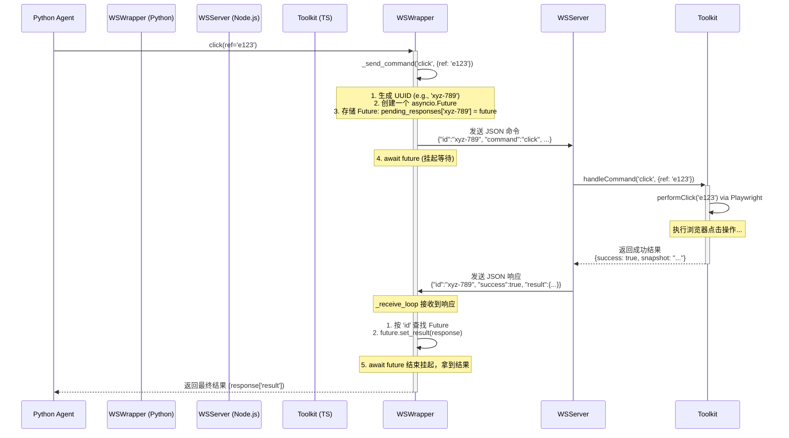

# CAMEL Hybrid Browser Toolkit: WebSocket 通信协议深度解析

该工具包的 Python 端和 TypeScript (Node.js) 端通过一个定义良好的、基于 JSON 的 WebSocket 协议进行通信。这个设计的核心是实现**异步的请求-响应模式**。

### 协议定义

通信内容是简单的 JSON 对象，主要分为两种：**命令 (Command)** 和 **响应 (Response)**。

#### 1. 命令 (Python -> Node.js)
由 `ws_wrapper.py` 中的 `_send_command` 方法构建。格式如下：
```json
{
  "id": "a-unique-uuid-string",
  "command": "command_name",
  "params": { ... }
}
```
-   `id`: 一个唯一的 UUID (v4)，用于唯一标识这次请求。这是实现异步回调的关键。
-   `command`: 一个字符串，指定要执行的操作，例如 `"click"`, `"type"`, `"get_page_snapshot"`。这个名称直接对应 `websocket-server.js` 中的一个 `case`。
-   `params`: 一个包含该命令所需所有参数的对象，例如 `{ "ref": "e123", "text": "hello" }`。

#### 2. 响应 (Node.js -> Python)
由 `websocket-server.js` 构建并返回。格式如下：
```json
{
  "id": "the-same-uuid-as-the-command",
  "success": true,
  "result": { ... }
}
```
或者在失败时：
```json
{
  "id": "the-same-uuid-as-the-command",
  "success": false,
  "error": "Error message string"
}
```
-   `id`: **必须**与它所响应的命令的 `id` 完全相同。
-   `success`: 一个布尔值，指示命令是否在 Node.js 端成功执行。
-   `result`: 如果 `success` 为 `true`，这里包含命令的执行结果，例如一个新的页面快照或确认信息。
-   `error`: 如果 `success` 为 `false`，这里包含错误的描述信息。

### 工作流程：一次 `click` 命令的生命周期

让我们通过一次 `click` 操作来追踪整个流程。



#### 流程分解:

1.  **Python 端 (请求发起)**:
    *   Agent 调用 `browser_click(ref='e123')`。
    *   在 `ws_wrapper.py` 中，`_send_command` 方法被调用。
    *   它生成一个唯一的 `id`，并创建一个 `asyncio.Future` 对象。这个 `Future` 就像一个占位符，代表着未来某个时刻会返回的结果。
    *   它将这个 `Future` 存储在一个字典 `self._pending_responses` 中，键为 `id`。
    *   它将构造好的 JSON 命令通过 WebSocket 发送给 Node.js 服务器。
    *   然后，它 `await` 这个 `Future`，此时该协程会**挂起 (suspend)**，将控制权交还给事件循环，等待响应的到来。

2.  **Node.js 端 (命令处理)**:
    *   `websocket-server.js` 接收到消息，解析 JSON。
    *   它根据 `command` 字段 (`"click"`)，调用 `HybridBrowserToolkit` (TypeScript) 中对应的 `click` 方法，并传入 `params`。
    *   TypeScript 代码通过 Playwright 执行实际的浏览器点击操作。
    *   操作完成后，它将执行结果（如新的快照）返回给 `websocket-server.js`。
    *   服务器将这个结果包装在一个响应 JSON 中，**使用与请求完全相同的 `id`**，然后通过 WebSocket 发回给 Python。

3.  **Python 端 (响应处理)**:
    *   在 `ws_wrapper.py` 中，有一个一直在后台运行的 `_receive_loop` 协程，它专门负责监听来自服务器的消息。
    *   当它收到响应 JSON 后，它会解析出 `id`。
    *   它使用这个 `id` 在 `self._pending_responses` 字典中找到之前存储的那个 `Future`。
    *   它调用 `future.set_result(response)`。这个操作会“填充”那个占位符，并**唤醒 (resume)** 之前因 `await` 而挂起的 `_send_command` 协程。
    *   `_send_command` 协程被唤醒后，从 `Future` 中拿到完整的响应，检查 `success` 字段，并将 `result` 字段的内容返回给最初的调用者。

### 核心要点

-   **异步非阻塞**: 整个流程是异步的。Python Agent 在等待浏览器操作完成时不会被阻塞，可以处理其他任务（如果事件循环中有的话）。
-   **请求与响应解耦**: 使用唯一的 `id` 和 `Future`，完美地解决了“先发出的请求不一定先返回”的问题。即使多个命令并发执行，每个响应也能准确地找到它对应的请求。
-   **清晰的边界**: Python 端完全不需要关心浏览器是如何被控制的，它只需要知道如何构造命令。同样，Node.js 端也不需要关心 Agent 的逻辑，它只需要执行接收到的命令并返回结果。这使得两边的代码都可以独立开发和维护。