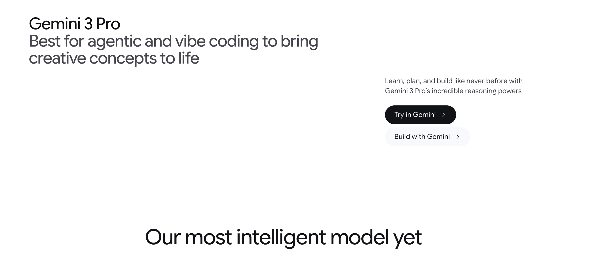
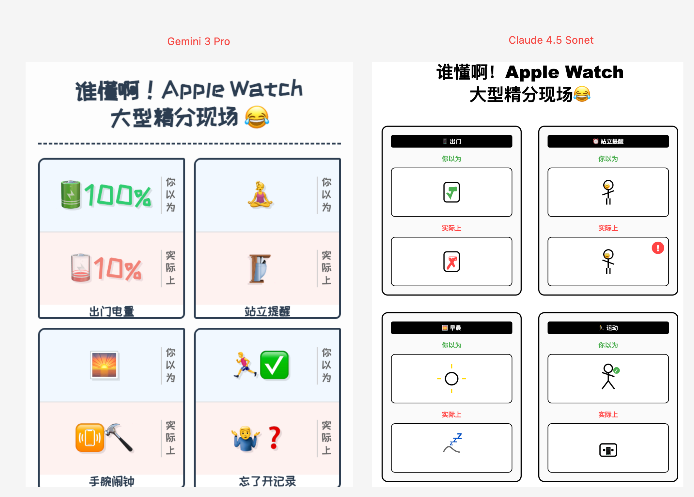
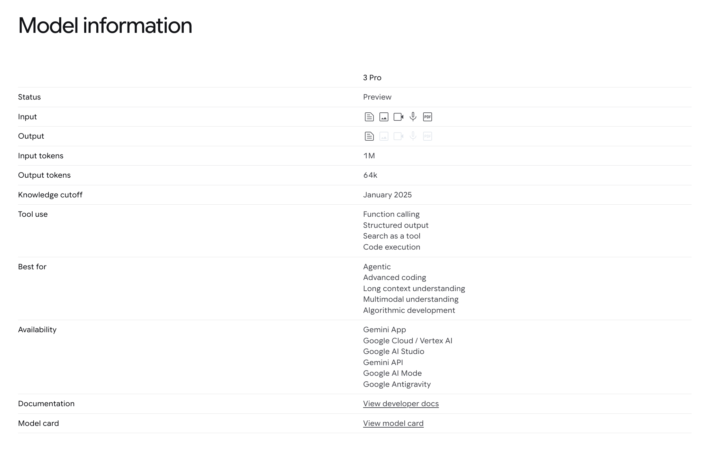
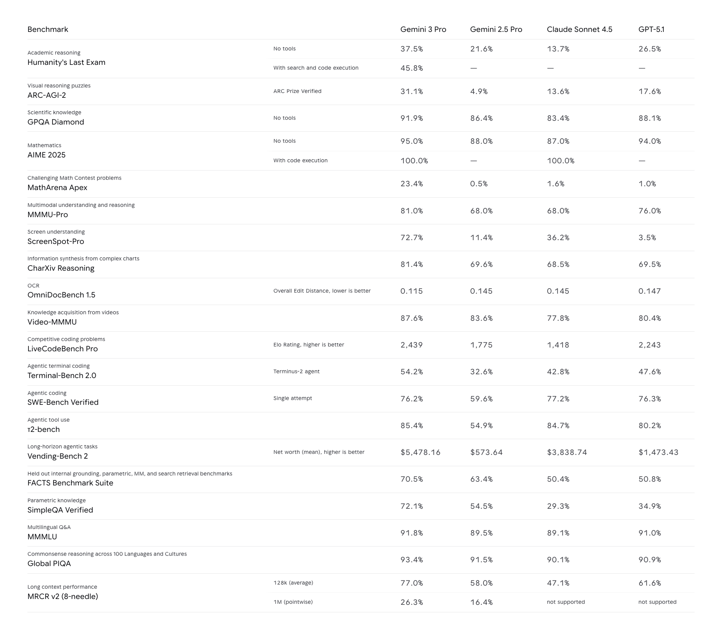
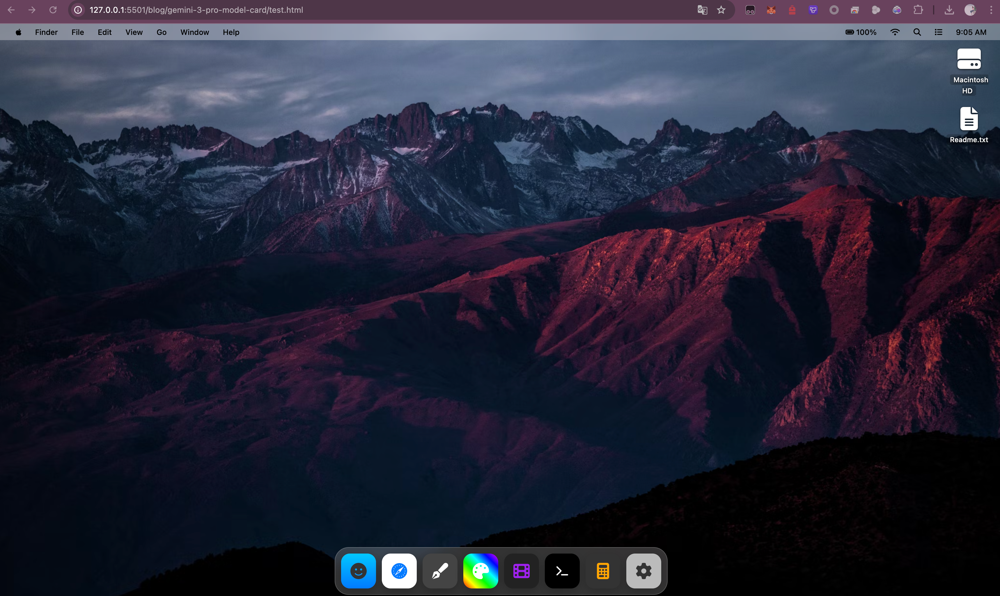

# Gemini 3 Pro Model Card



地址：https://deepmind.google/models/gemini/pro/

## 引言：超出预期的前端生成能力

在 Gemini 3 Pro 的众多能力中，其在前端页面生成方面的表现尤为突出，能够精准理解并执行高度复杂、富有创意的指令，生成的结果常常超出预期。一个社区中的直接对比测试很好地说明了这一点。

**一个复杂的Prompt，两种不同的结果**

我用了一个包含详细布局、风格、内容描述的结构化JSON Prompt，要求模型生成一个漫画风格的HTML页面。这个其实是随便找了一个参考图，看看模型的效果

**使用的 Prompt:**
```json
{
    "thinking": {
        "reference_style_analysis": "参考封面通过幽默漫画展现理想与现实反差，文字标注强化情绪，黑白简笔画搭配少量色彩突出视觉焦点。",
        "adaptation_strategy": "延续参考图的漫画反差风格，用多组简笔画表现Apple Watch不同使用场景的理想与现实，标题强化情绪共鸣，色彩突出关键元素。"
    },
    "proposed_cover_components": {
        "headline": {
            "text": "谁懂啊！Apple Watch大型精分现场😂",
            "style_and_purpose": "模仿参考图，使用粗体黑色手写字体，增加“😂”表情符号增强趣味性，标题位置醒目，吸引点击。"
        },
        "visual_focus": {
            "description": "绘制四组简笔画（出门、站立提醒、早晨、运动），每组对比理想（优雅、主动起身等）与现实（没电、抗拒提醒等），关键元素（如手表电量、提醒图标）用红色/彩色突出。",
            "purpose": "通过多组对比漫画，延续参考图的幽默反差风格，直观展现文案核心内容，吸引用户兴趣。"
        },
        "layout_and_palette": {
            "layout_description": "采用多格漫画布局，每格上方标注“你以为”“实际上”，标题居顶，整体结构清晰，模仿参考图的上下对比形式。",
            "palette_description": "以黑白简笔画为基础，关键元素（如手表、提醒符号）使用红色/彩色，保持与参考图类似的简洁高对比色调。"
        }
    },
    "html_recreation_guide": "1. 主容器使用Flex布局，标题居顶，漫画内容分四组排列。\n2. 每组漫画使用左右/上下对比构图，“你以为”侧用优雅简笔画，“实际上”侧用夸张搞笑简笔画。\n3. 关键元素（如手表电量、提醒图标）添加红色/彩色填充，使用CSS filter: drop-shadow()增加立体感。\n4. 标题字体使用粗体手写风格，颜色为黑色，添加表情符号增强视觉趣味。"
}
```

**生成效果对比 (Gemini 3 Pro vs. Sonet):**


*左侧为 Gemini 3 Pro 生成效果，右侧为 Sonet 生成效果*


从对比可以看出，Gemini 3 Pro 更好地理解了 Prompt 中关于布局、风格和细节的复杂要求，生成的结果更贴近用户的原始意图。这种“所思即所得”的能力，特别是在创意和前端开发领域，展示了其作为生产力工具的巨大潜力。

下面，我们将更系统地拆解 Gemini 3 Pro 的各项特性。

> **一句话总结 (TL;DR)**：本文档介绍了 Gemini 3 Pro 的模型特性，包括其稀疏 MoE 架构、多模态能力、100 万 Token 的上下文窗口，并概述了其训练细节、性能基准及安全评估结果，旨在提升模型透明度。


---

## 1. 模型介绍与核心能力

Gemini 3 Pro 是 Google 发布的新一代多模态模型。其模型卡（Model Card）旨在为开发者、研究人员和公众提供其能力与责任边界的说明。

其核心能力体现在以下几个方面：



*   **原生多模态**：能够无缝处理和理解来自文本、图像、音频、视频和代码库的混合输入。
*   **推理能力**：为处理需要高级推理、创意生成和战略规划的复杂任务进行了优化。
*   **长上下文窗口**：支持 100 万（1M）Token 的输入上下文，使其能处理较长的文档和信息。
*   **智能体（Agentic）性能**：适用于需要自主执行多步骤任务的应用场景。

## 2. 模型历史与发展梳理

Gemini 系列从 2023 年底的 Gemini 1.0 开始，每一代都在核心能力上有所提升：

-   **Gemini 1.0 Pro**：奠定了基础多模态模型的框架，支持文本、图像和视频的初步处理，但在推理和编码能力上相对有限。
-   **Gemini 1.5 Pro**：引入了长上下文窗口（1M tokens）并改进了多模态理解能力，提升了在长文档和视频分析领域的表现。
-   **Gemini 2.5 Pro**：进一步优化了编码和代理任务，基准测试成绩已接近当时的前沿模型，但因访问受限和生态不完善而未能广泛普及。
-   **Gemini 3 Pro**：作为最新版本，在“原生多模态”设计上进行了优化。它引入了 **“Deep Think”模式**（通过 `thinking_level` 参数控制），用于处理如多步规划和长时序问题等复杂推理任务。

该模型已在 Google Cloud 的 Vertex AI 和 Gemini Enterprise 中正式可用，同时通过 Google AI Studio 和 Gemini CLI 提供预览版。

## 3. 关键技术细节

Gemini 3 Pro 在架构和训练上采用了多项前沿技术：

*   **稀疏专家混合（Sparse Mixture-of-Experts, MoE）架构**：模型采用了基于 Transformer 的稀疏 MoE 架构。这种设计允许模型在处理每个输入 Token 时仅激活一部分“专家”参数，从而在不牺牲模型总容量的前提下，显著降低了计算和服务的成本。
*   **大规模、多模态训练数据**：其预训练数据来源广泛，包括公开网页、文本、代码、图像、音视频等。此外，训练过程还融合了指令微调、人类偏好数据和多步推理数据，以强化其遵循指令和解决问题的能力。
*   **专有硬件与软件栈**：模型在 Google 自家的 TPU（Tensor Processing Units）上进行训练，并使用了 JAX 和 ML Pathways 等软件框架，确保了高效和可扩展的训练过程。
*   **集成生态**：与 Google Antigravity（一个基于 VS Code 的代理开发平台）整合，支持浏览器自动化测试和多工作区代理协作，增强了其在开发场景中的实用性。

## 4. 性能效果与基准测试

Gemini 3 Pro 在发布后，其表现在多个主流基准测试中取得了SOTA（State-of-the-art）水平。



*   **综合排名**: 在 LMArena 用户偏好榜上以 1501 Elo 分位居第一。
*   **科学推理**: 在 GPQA Diamond（博士级科学推理）等多个榜单上大幅领先。
*   **软件工程**: 在 SWE-bench（软件工程）测试中表现突出。
*   **知识与幻觉**: 在知识和幻觉评估基准 AA-Omniscience Index 中，凭借高准确率登顶，但报告也指出其在抑制幻觉方面未见显著提升。

总体而言，模型在零样本（zero-shot）任务和多模态整合上表现稳定，但在处理某些任务时可能存在延迟。

## 5. 社区反馈与生态集成

自发布以来，Gemini 3 Pro 在开发者社区中引发了广泛讨论。

### 市场反响
*   **重要时刻**: 社区普遍认为 Gemini 3 的发布是一个重要时刻，甚至有人称之为“OpenAI承诺的GPT-5”。
*   **开发者迁移**: Arvid Kahl 等观察者预测，短期内会有许多开发者从其他模型转向 Gemini。
*   **功能变化**: 也有细心的用户发现，与2.5版本相比，Gemini 3 Pro 似乎取消了图像分割功能 (Simon Willison)。

### 生态与可用性
*   **快速集成**: Gemini 3 迅速被集成到多个开发工具中。代码编辑器 Zed 宣布为 Pro 用户提供支持，LlamaIndex 也提供了 Day-0 支持，并制作了自动化 GitHub PR 审查的 Demo。
*   **开发者平台**: 社区推荐在 Windsurf 等平台上试用其前端开发能力。
*   **教育优惠**: Google 宣布向所有美国大学生提供为期一年的免费 Google AI Pro 计划，包含 Gemini 3 Pro 的更多使用权限。

### 开发者评价
*   **编码与开发**：部分开发者认为该模型适用于日常开发，在 UI 重构、多文件项目处理方面表现良好，体验较为流畅。
*   **推理与多模态能力**：“Deep Think”模式在处理数学、物理等任务时准确率较高。部分社区用户反馈其对话体验流畅。
*   **组合使用**: 许多开发者选择将 Gemini 3 Pro 与其他模型结合使用，利用 Gemini 进行代码实现，而使用其他模型进行高层规划。
*   **改进空间**: 开发者也指出，Google 的产品体验（UX）较为分散，代理工具仍处早期，访问限制（waitlist）也带来了一些不便。

**综合观点**：Gemini 3 Pro 在多模态和代理任务上是一个有效的工具选项，其发布推动了社区的创新实践。同时，用户也期待其生态系统和产品体验能继续优化。

## 6. 用户实践案例：“Vibe Coding”的兴起

社区开发者迅速上手并展示了 Gemini 3 强大的“Vibe coding”（氛围编程）能力，即通过模糊或概念性的指令，让模型生成高度具体的、富有创意的结果。

一键生成 Web OS

一个广为流传的案例是，用户仅用一个 Prompt，就让模型生成了一个功能齐全、可在单个 HTML 文件中运行的仿 macOS 界面的 Web OS。

> **用户反馈**：
>
> 🚨 Gemini 3.0 Pro
>
> > This is not a cherry picking example
> > Google didn't paid me
> > This is one shot (Ecpt checkpoint)
>
> Google Made A model this good that we have to clear it to public that this is not cherry picking ❤️

**使用的 Prompt:**
```
Design and create a web os like mac os full functional features from text editor , to dile manager to paint to video editor and all important mac os pre bundled software Use whatever libraries to get this done but make sure I can paste it all into a single HTML file and open it in Chrome.make it interesting and highly detail , shows details that no one expected go full creative and full beauty in one code block
```




## 7. 个人观点：关于ICON库的猜想

我认为，Gemini 3 Pro 在前端生成任务上表现出色，一个可能的原因是其训练数据中包含了大量的ICON（图标）库。

虽然这在技术上可能不算重大突破，但从社区传播的角度看，这是一个非常聪明的策略。当模型能生成包含精致图标的界面时，其输出结果的视觉效果会大幅提升，更便于在社交媒体上传播，也更容易让用户直观地感受到模型的“创意”和“智能”。

这或许说明，在当前的AI竞争中，巧妙的数据策略和最终的用户感知，与核心技术指标同样重要。

## 8. 总结

Gemini 3 Pro 的模型卡与社区反馈共同展示了这是一个多功能的 AI 模型。它在技术基准上取得了一定提升，并在实际应用（特别是编码和代理工作流）中展现了其价值。

Google 通过发布详细文档来回应社区对透明度的关注。Gemini 3 Pro 凭借其架构、多模态和长上下文处理能力，为解决复杂问题提供了新的可能性。


