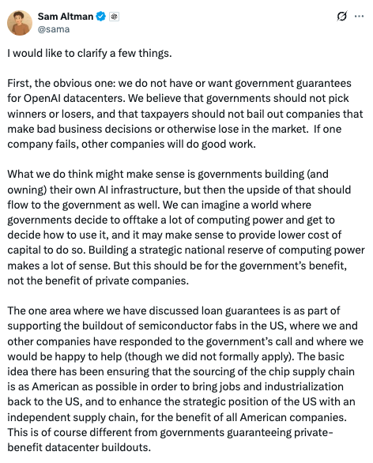

# Kimi K2 Thinking 技术剖析：一款支持长程推理的AI模型

**导语**：当大多数AI还在学习如何更好地“回答”时，一款名为 Kimi K2 Thinking 的模型已经开始学习如何“思考”。它不是又一个聊天机器人，而是一个能自主执行数百步复杂操作的“思考代理”。本文将剖析月之暗面（Moonshot AI）这款开源模型，探讨它如何通过其推理能力、成本效益和内容创作能力，为人工智能领域带来新的可能性。

## 第一章：从“聊天”到“思考”——代理式AI的黎明

长期以来，我们衡量AI的标准是“它知道什么？”。而 Kimi K2 Thinking 的出现，将这个问题转变为：“它能思考多久？”

Kimi K2 的核心定位是一个“思考代理”（Thinking Agent）。与传统模型在几次交互后便会“迷失方向”不同，Kimi K2 能够连续执行 **200至300步** 的工具调用（Tool Calls），并始终保持对最终目标的专注。这意味着它可以自主完成极其复杂的任务，例如：

-   **进行深度课题研究**：从一个模糊的主题出发，自主规划、搜索、阅读、整合信息，并最终形成一份结构化的报告。
-   **完成软件开发项目**：根据一个高层次的需求（例如“克隆一个微软Word”），自主编写代码、调试、测试并最终交付一个可用的产品。
-   **进行多步骤的科学计算**：解决一个博士级别的数学难题，需要连续进行23步的推理与计算。

这种“长程思考”能力是实现通用人工智能（AGI）的关键一步，它让AI不再是一个被动的问答工具，而是一个主动的、能够独立解决问题的合作伙伴。

## 第二章：模型引擎：Kimi K2 的高效架构解析

Kimi K2 能力的背后，是一套精心设计的高效架构。它在保持巨大规模的同时，实现了较高的推理效率。

-   **混合专家（MoE）模型**：Kimi K2 的总参数量高达 **1万亿**，但它并非在每次推理时都“火力全开”。其MoE架构包含了384个“专家”，每次处理一个Token时，系统会智能地从中挑选8个最相关的专家来协同工作，实际激活的参数仅为 **320亿**。这种机制如同一个拥有数百名专家的智囊团，每次只派出最擅长当前领域的几位来解决问题，极大地提升了效率和性能。

-   **原生INT4量化**：为了进一步提升效率，Kimi K2 在训练后期的“量化感知训练”（QAT）中使用了原生INT4量化技术。这项技术成功地将模型在推理时的大小压缩至约 **594GB**，并带来了近 **2倍的速度提升** 和显著的内存占用降低，而性能损失却微乎其微。这使得在本地硬件上部署和运行这一庞然大物成为可能。

-   **256K 超长上下文窗口**：Kimi K2 拥有一个256,000个Token的上下文窗口，相当于能够一次性处理约20万个单词。这保证了它在执行长达数百步的复杂任务时，不会忘记最初的目标和中间的步骤，从而维持了任务的连贯性。

## 第三章：基准测试：数据背后的模型表现

Kimi K2 的能力可以通过一系列行业基准测试来衡量。在这些测试中，它都取得了不错的成绩，在某些方面甚至超越了部分顶级的闭源模型。

-   **代理式推理 (HLE)**：在被誉为“人类最后一道防线”的HLE（Humanity’s Last Exam）专家级问题基准测试中，Kimi K2（借助工具）取得了 **44.9%** 的高分，超越了据报道的GPT-5的41.7%。
-   **代理式搜索 (BrowseComp)**：在测试高难度信息检索能力的BrowseComp基准中，Kimi K2 取得了 **60.2%** 的分数，高于人类基准（29.2%）。
-   **代理式编码 (SWE-Bench)**：在软件工程基准测试SWE-Bench上，它取得了 **71.3%** 的分数，证明了其在代码生成和理解方面的能力。

独立AI研究机构 **Artificial Analysis** 的评测结果进一步证实了其领先地位。在其综合智能指数中，Kimi K2 获得 **67分**，成为有史以来得分最高的开源模型，并且在所有模型（包括闭源）中仅次于GPT-5，位列第二。

## 第四章：460万美元的训练成本：AI开发的经济学转变

根据CNBC报道，这款在多项基准上超越GPT-5的模型的总训练成本仅为 **4.6百万美元**。

这是一个什么概念？OpenAI为了训练GPT-4花费了数十亿美元，而其创始人Sam Altman更是在谈论一个需要 **1.4万亿美元** 投资的长期基础设施计划。相比之下，Kimi K2的成本几乎可以忽略不计。

Stability AI的创始人Emad Mostaque甚至估算，如果能够用上最新的Blackwell芯片，其训练成本可能低于 **300万美元**。

这一数字的背后，是AI开发经济学的转变。它揭示了通过高效的架构设计、先进的训练算法（如高温RL、PTX损失）和优化的数据策略，构建先进AI模型的成本可以被大幅压缩。这为开源社区和中小型创新企业提供了更多参与机会。

## 第五章：地缘政治背景：当开源模型来自中国

Kimi K2 的发布恰逢全球关于AI领导地位的讨论。就在它推出的同一周，英伟达CEO黄仁勋的某些言论也引发了相关讨论。

这是一款来自中国的开源模型，其特点在于：
-   在部分关键推理基准上取得了与GPT-5相当或更高的分数。
-   推理成本低于美国的某些顶级闭源模型。
-   通过社区的努力，可在高端消费级硬件上运行。

[Artificial Analysis](https://artificialanalysis.ai/leaderboards/providers) 称其为“潜在的新的领先开源模型”。一位研究员评论道：“不到一年前，开源模型还无法与闭源模型相提并论。今天，Kimi K2 Thinking已跻身顶级模型行列。”

这一事件表明，全球化的竞争正在加速AI技术的迭代和普及，而最终的受益者将是广大的开发者和创作者。

## 第六章：Kimi K2 的文学创作能力

除了在基准测试中取得高分，Kimi K2 还展现了其在文学创作方面的能力。它被许多开发者和作家认为拥有一定的“文学智能”，而这与其独特的“思考”模式有关。

在生成任何内容（哪怕只是一句话）之前，Kimi K2 会在内部消耗数千个“思考Token”。它会在内部进行构思、推敲和修改，直到找到合适的表达方式，最后才将成品呈现给用户。

为了验证这一点，《The Neuron》的作者与Kimi K2进行了一场深度的共同创作实验，目标是构思一部名为 **《盐马戏团》（The Salt Circus）** 的YA小说。

在长达数小时的反复交流中，Kimi K2 扮演了一个创意伙伴的角色。当被批评“设定愚蠢，重来”时，它会直接重新开始，并从根本上修复故事的逻辑基础。

最终，他们共同构建了一个完整的世界：
-   **核心情节**：在一个衰败的沿海小镇，六个少年必须在七天内进入一个由记忆构成的“回声洞穴”，治愈他们父母辈被遗忘的创伤，以阻止跨维度外星人彻底“收割”他们小镇的现实。
-   **丰满的人物**：为六位主角设计了详细的性格、家庭创伤和与历史紧密相连的“锚点物品”。
-   **严谨的世界观**：将模糊的超自然设定具体化，构建了严谨的“因果链”和世界运作机制。

当一切准备就绪后，Kimi K2 autonomously 生成了小说的第一章。这段文字文笔较为流畅，使用了一些比喻，同时埋下了多个伏笔，并与之前共同设定的世界观和人物背景相契合。这展示了Kimi K2能够理解并构建复杂的叙事架构。

## 第七章：如何使用 Kimi K2 Thinking：给开发者和创作者的指南

Kimi K2 的能力并非遥不可及。得益于其开源特性，现在有多种方式可以上手体验：

1.  **通过OpenRouter（最简单）**
    -   访问 `openrouter.ai`，无需任何配置，即可在网页上直接与Kimi K2进行对话和测试，按量付费。

2.  **通过官方API（控制性最强）**
    -   在 `platform.moonshot.ai` 注册并获取API密钥。它兼容OpenAI的API格式，可以轻松集成到现有应用中。
    -   **成本示例**：生成一篇2000字的短篇小说约花费$0.01美元；一部8万字的小说初稿成本在$0.30至$0.50美元之间。

3.  **本地部署（最私密、零成本）**
    -   使用 `Ollama` 工具，可以在本地硬件上部署Kimi K2。
    -   **硬件要求**：至少需要32GB内存，推荐64GB内存或配备统一内存的苹果M系列芯片。
    -   **优点**：完全私密，无持续费用，可离线使用。

4.  **通过AI编程助手（集成工作流）**
    -   在VS Code等开发环境中，可以将Cline等AI助手配置为使用Kimi K2作为后端模型，实现编码与创作的无缝衔接。

## 结论

Kimi K2 Thinking 的发布是AI领域的一个重要事件。

它证明了通过高效的架构和开放的协作，开源社区同样能够构建出先进的AI模型。它预示着一个AI能力进一步普及、创新成本降低的时代的到来。

对于开发者、作家、研究人员和所有创意工作者来说，这意味着一个新的工具和合作选择已经出现。未来的重点将更多地在于如何与AI进行有效合作。

---

## 参考资料

- https://moonshotai.github.io/Kimi-K2/thinking.html
- https://www.theneuron.ai/explainer-articles/kimi-k2-thinking-the-ai-that-actually-thinks-like-a-writer
