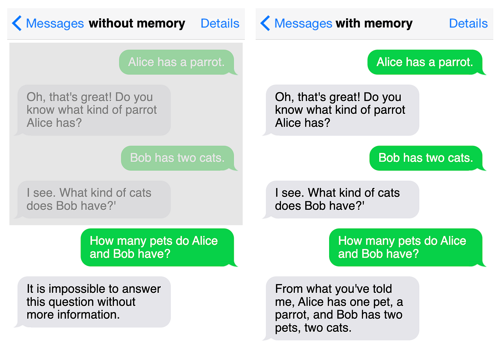
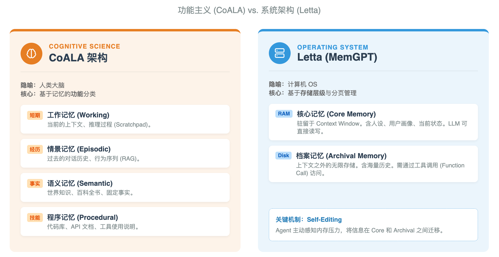
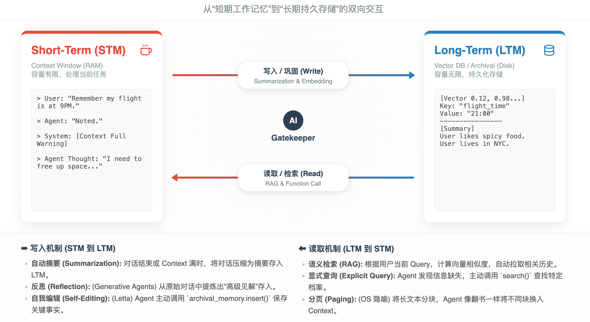

# 为 AI 植入记忆：一篇上手核心原理与挑战

> **TL;DR:** 本文将系统梳理 AI 智能体记忆的核心概念，从记忆的类型、管理机制，到主流实现框架与核心挑战，为你提供一张清晰的上手地图。

---

## 什么是智能体记忆？

想象一下和一个只能记住你说的最后一句话的人交谈，你每次都得重复之前的背景——这就是“无状态”的LLM面临的窘境。为了让AI智能体能够真正地与我们连续对话、学习和成长，我们必须为它设计一个记忆系统。简而言之，智能体记忆就是让 Agent 拥有回忆过去、理解当下的能力。

## 智能体记忆的类型

为了更好地组织记忆，业界提出了两种主流的分类视角：一种是模仿“人脑”的认知功能，另一种是类比“计算机”的系统架构。

### 1. CoALA 架构：像“人脑”一样思考

CoALA（Cognitive Architectures for Language Agents）将 LLM 视为一个认知中枢，其记忆分类旨在模拟人类的认知过程，关注记忆在决策中扮演的角色。

- **工作记忆 (Working Memory):** **当前处理的信息**。对应 LLM 的上下文窗口，用于短期决策和推理。
- **情景记忆 (Episodic Memory):** **过去的经历（“我做过什么”）**。对应历史对话记录，通常存储于向量数据库，通过检索调用。
- **语义记忆 (Semantic Memory):** **客观知识和事实（“我知道什么”）**。对应外部知识库或模型内化知识，提供事实依据。
- **程序记忆 (Procedural Memory):** **如何做事的隐性知识（“我会怎么做”）**。对应代码库、API文档或工具说明，指导 Agent 执行具体操作。

### 2. Letta (MemGPT) 架构：像“操作系统”一样管理

Letta 架构源于 MemGPT 项目，将 LLM 视为 CPU，上下文窗口视为 RAM。它更关注如何突破上下文长度的物理限制，实现“无限上下文”。

- **核心记忆 (Core Memory / In-Context):** **始终在上下文中的信息**，如同计算机的 RAM。存储着 Agent 的人设、用户关键信息等，访问速度快但空间有限。
- **档案记忆 (Archival Memory / External):** **上下文之外的大规模数据库**，如同计算机的硬盘。存储海量历史对话和文档，容量无限但需通过工具调用来读写。

其核心理念是**分页管理 (Paging)**，Agent 能通过**自我编辑 (Self-Editing)** 机制，主动决定何时将信息在核心记忆和档案记忆之间移动。

*图1: CoALA (认知视角) vs. Letta (系统视角) 核心差异*

理解这两种分类法的区别，有助于你在开发时做出架构选择：
- **场景 A：你需要一个全能助手 (CoALA 模式)**
  如果你在做一个复杂的自主 Agent，需要它既懂历史（情景），又懂知识（语义），还会用工具（程序），你会倾向于使用 CoALA 的分类来设计它的各个模块。
- **场景 B：你需要一个超长记忆伴侣 (Letta 模式)**
  如果你在做一个虚拟恋人或心理咨询师，必须保证它记得用户几个月前的一件小事，Letta 的架构更有效，因为它允许 Agent 动态维护一个“关于用户的当前状态画像”在内存中。

## AI 智能体记忆管理

对记忆进行分类不仅仅是理论上的划分，它直接指导了我们如何管理这些不同类型的信息。不同记忆的特性决定了它们需要不同的管理策略，这共同构成了记忆管理的核心：**管理信息在短期记忆和长期记忆之间的有效流动**。

### 管理上下文窗口内记忆
为避免上下文窗口溢出和降低成本，最常见的方法是**周期性总结**，即用一段精炼的摘要来替代多轮对话的原始记录。

### 管理外部存储器
对外部存储的管理主要涉及四个操作：**ADD（新增）**, **UPDATE（更新）**（例如，当用户提供了新的地址时）、**DELETE（删除）**（例如，忘记一次性请求的临时细节），以及 **NOOP（无操作）**，以此保证信息的准确性，防止“记忆膨胀”。

### 在短期和长期记忆间传递信息
信息转移的触发时机分为两种：
- **显式记忆 (Explicit / Hot Path):** 智能体在交互中**自主**识别并存储重要信息，通常通过工具调用（Tool Calling）实现。
- **隐式记忆 (Implicit / Background):** 记忆过程在后台**程序化**地发生，例如在每次交互后、会话结束后或按固定周期执行。

*图2: 信息在短期与长期记忆间的流动机制*

## 实现智能体记忆

一个基础的记忆系统实现通常包括：
- **对话历史:** 用一个简单的列表来存储。
- **指令:** 存储在文本或 Markdown 文件中。
- **结构化信息:** 根据检索需求存储在向量数据库、图数据库或关系型数据库中。

## 记忆设计的挑战

当前，记忆系统的设计主要面临两大挑战：

1.  **延迟 (Latency):** 每一次“回忆”都可能意味着一次数据库的往返，甚至需要额外的LLM调用来整合信息，这会带来用户可感知的延迟。
2.  **遗忘 (Forgetting):** 这不只是简单地删除旧数据。它更像是一种艺术——判断用户半年前提到的宠物名字是需要珍藏的细节，还是应该被遗忘的“噪音”？错误的判断会让智能体显得愚蠢或迟钝，这是目前最艰巨的挑战。

## 主流记忆框架

围绕记忆问题，一个活跃的框架生态正在形成：

- **Letta (原 MemGPT):** 把它想象成一个为LLM服务的虚拟内存管理器，像电脑操作系统一样，在有限的“内存”（上下文窗口）和“硬盘”（外部存储）之间智能地交换信息。
- **Mem0:** 它像一个勤奋的秘书，聆听对话，提取关键事实，并智能地更新自己的笔记。它在实用性、性能和成本之间取得了极佳的平衡，是生产环境的热门选择。
- **MemOS:** 这是愿景最宏大的一个，致力于成为未来AGI的“记忆操作系统”（Memory OS），统一管理从文本到模型参数的所有记忆形态。
- **通用编排框架 (LangChain, LlamaIndex):** 如果说专用框架是“品牌电脑”，那它们就是“DIY组件库”。这些框架提供了丰富的“记忆积木”，让开发者可以根据需求，灵活搭建出各式各样的记忆系统。

## 总结：融合与未来

- **CoALA 告诉我们要存什么 (What to store)**：区分技能、事实和经历。
- **Letta 告诉我们要怎么存 (How to store)**：区分热数据（Core）和冷数据（Archival），并让 AI 自己管理数据的流动。

为AI智能体构建记忆系统的核心，是在有限的上下文窗口和无限的外部存储之间，设计一套优雅的信息流动机制。在最先进的系统中，这两种思想往往会融合：**使用 Letta 的机制来管理上下文窗口，同时在 Archival Memory 内部采用 CoALA 的分类逻辑来组织数据**。

当前，记忆系统仍面临“延迟”和“遗忘”两大挑战。以 `Mem0` 和 `MemOS` 等为代表的框架，正通过不同路径探索解决方案，推动着AI记忆技术的发展。
