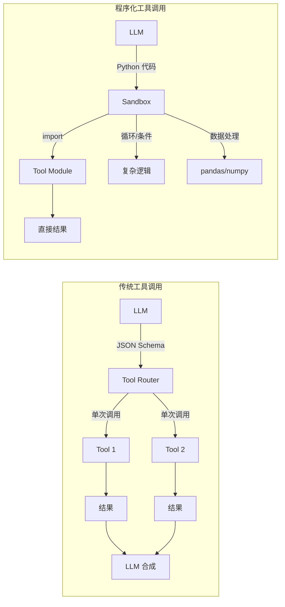
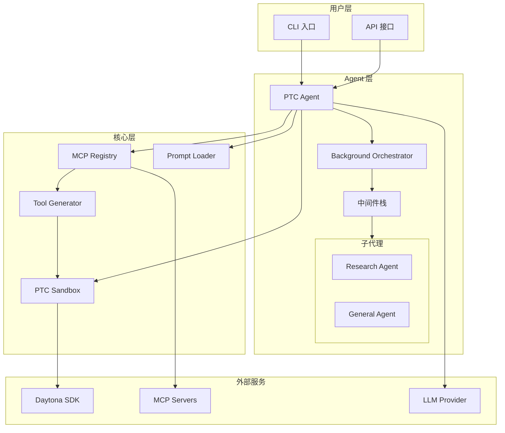
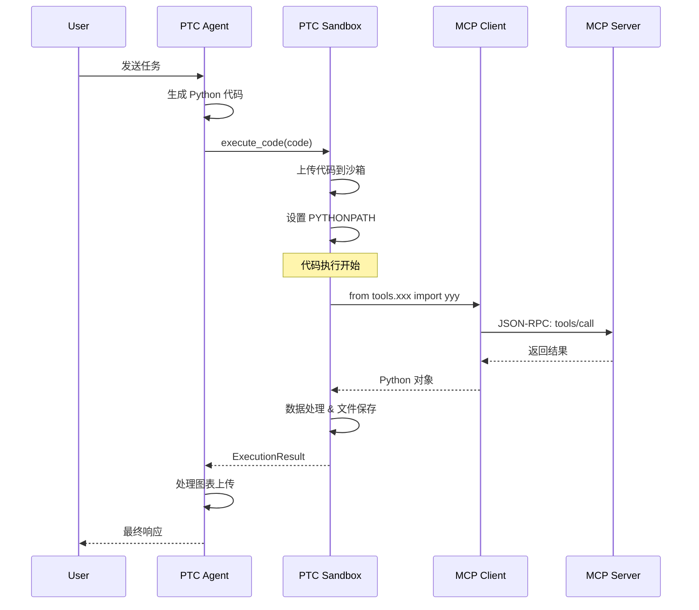
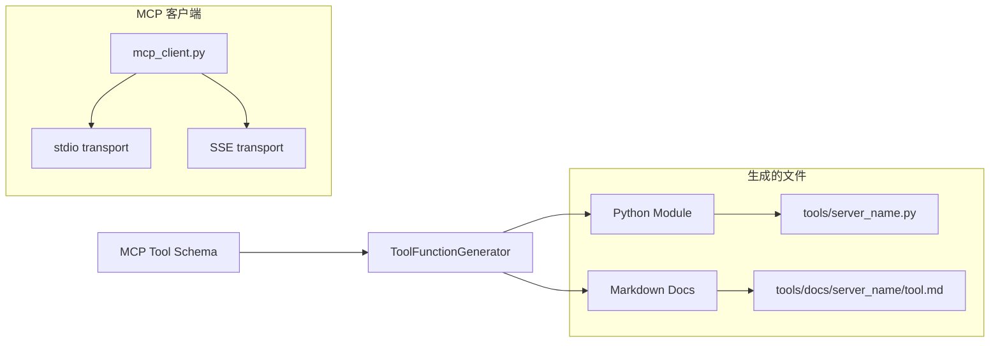
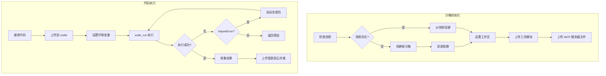
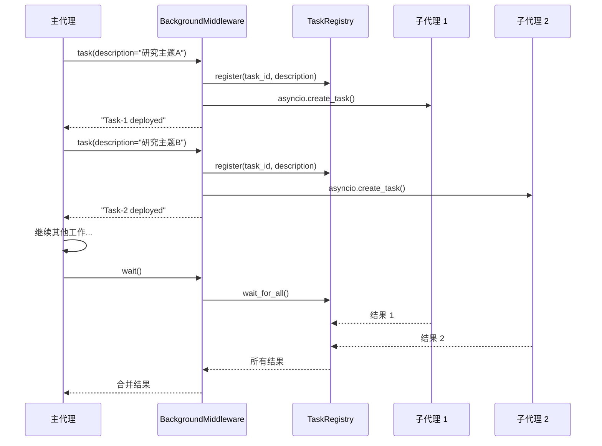
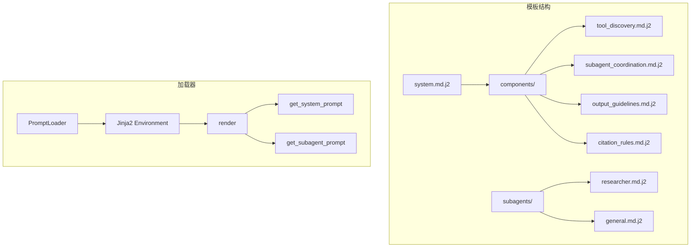

# Open PTC Agent 深度解析：程序化工具调用的革命性实现

> 本文深入分析 Open PTC Agent 项目的核心原理、架构设计和关键代码实现，帮助读者理解并复现这一创新性的 AI Agent 框架。

## 📖 目录

1. [项目概述](#项目概述)
2. [核心理念：程序化工具调用 (PTC)](#核心理念程序化工具调用-ptc)
3. [系统架构](#系统架构)
4. [核心组件深度解析](#核心组件深度解析)
5. [关键代码实现](#关键代码实现)
6. [快速开始](#快速开始)
7. [设计模式与最佳实践](#设计模式与最佳实践)
8. [总结与展望](#总结与展望)

---

## 项目概述

Open PTC Agent 是一个开源的 AI Agent 框架，其核心创新在于**程序化工具调用 (Programmatic Tool Calling, PTC)** 范式。与传统的 JSON Schema 工具调用不同，PTC 让 LLM 直接编写 Python 代码来编排和调用工具，从而实现更灵活、更强大的任务执行能力。

### 核心特性

- 🔧 **程序化工具调用**：LLM 编写 Python 代码而非 JSON 来调用工具
- 🔌 **MCP 协议支持**：无缝集成 Model Context Protocol 生态系统
- 🏖️ **安全沙箱执行**：基于 Daytona 的隔离代码执行环境
- 🚀 **快照加速**：7 倍启动速度提升
- 🤖 **后台子代理**：异步任务委派与结果收集
- 📝 **Jinja2 提示词模板**：模块化、可复用的提示词系统

---

## 核心理念：程序化工具调用 (PTC)

### 传统工具调用 vs PTC



### PTC 的优势

| 特性 | 传统工具调用 | PTC |
|------|-------------|-----|
| 工具编排 | 需要多轮对话 | 单次代码执行 |
| 数据处理 | 有限 | 完整 Python 生态 |
| 条件逻辑 | 困难 | 原生支持 |
| 循环操作 | 需要多次调用 | 原生支持 |
| 错误处理 | 依赖 LLM | try/except |
| 中间状态 | 丢失 | 变量保持 |

### 核心思想

```python
# 传统方式：LLM 需要多轮对话
# Round 1: 调用搜索工具
# Round 2: 处理结果，调用另一个工具
# Round 3: 合成最终答案

# PTC 方式：一次代码执行完成所有操作
code = '''
from tools.tavily import tavily_search
from tools.github import search_repositories
import json

# 1. 搜索相关信息
search_results = tavily_search(query="AI agents frameworks", max_results=10)

# 2. 过滤高质量结果
quality_results = [r for r in search_results if r.get('score', 0) > 0.7]

# 3. 搜索相关 GitHub 仓库
repos = search_repositories(query="AI agent framework", sort="stars")

# 4. 合并并保存结果
combined = {
    "search_results": quality_results,
    "github_repos": repos[:5]
}

with open('results/analysis.json', 'w') as f:
    json.dump(combined, f, indent=2)

print(f"Found {len(quality_results)} quality results and {len(repos)} repos")
'''
```

---

## 系统架构

### 整体架构图



### 代码执行流程



---

## 核心组件深度解析

### 1. MCP 工具生成器 (ToolFunctionGenerator)

工具生成器是 PTC 的核心，它将 MCP 工具的 JSON Schema 转换为可在沙箱中直接导入使用的 Python 模块。



#### 核心代码：生成 Python 函数

```python
# 来自 src/ptc_core/tool_generator.py

def _generate_function(self, tool: MCPToolInfo, server_name: str) -> str:
    """Generate Python function for a single tool."""
    # 生成函数签名
    func_name = tool.name.replace("-", "_").replace(".", "_")
    params = tool.get_parameters()

    # 构建参数列表 - 必需参数在前，可选参数在后
    param_list = []

    # 首先添加必需参数
    for param_name, param_info in params.items():
        if param_info["required"]:
            param_type = self._map_json_type_to_python(param_info["type"])
            param_list.append(f"{param_name}: {param_type}")

    # 然后添加可选参数
    for param_name, param_info in params.items():
        if not param_info["required"]:
            param_type = self._map_json_type_to_python(param_info["type"])
            default = param_info.get("default")
            if default is None:
                param_list.append(f"{param_name}: {param_type} | None = None")
            else:
                default_repr = repr(default)
                param_list.append(f"{param_name}: {param_type} = {default_repr}")

    param_str = ", ".join(param_list)
    docstring = self._generate_docstring(tool, params)
    return_type, _ = self._extract_return_info(tool.description)

    function_code = f'''def {func_name}({param_str}) -> {return_type}:
    """{docstring}"""
    arguments = {{
{self._generate_arg_dict(params)}
    }}

    # Remove None values
    arguments = {{k: v for k, v in arguments.items() if v is not None}}

    return _call_mcp_tool("{server_name}", "{tool.name}", arguments)'''

    return function_code
```

#### 生成的工具模块示例

```python
# 自动生成的 tools/tavily.py

"""
Auto-generated tool functions for MCP server: tavily
"""

from typing import Any, List, Dict
from .mcp_client import _call_mcp_tool


def tavily_search(query: str, max_results: int = 10) -> list[dict]:
    """Search the web using Tavily API.
    
    Args:
        query (string) (required): Search query
        max_results (integer): Maximum results to return
    
    Returns:
        list[dict]: Search results with title, url, content, score
    
    Example:
        result = tavily_search(query="example")
    """
    arguments = {
        "query": query,
        "max_results": max_results,
    }
    arguments = {k: v for k, v in arguments.items() if v is not None}
    return _call_mcp_tool("tavily", "tavily_search", arguments)
```

### 2. MCP 客户端代码生成

工具生成器还会生成一个完整的 MCP 客户端，支持 stdio 和 SSE 两种传输协议：

```python
# 来自 src/ptc_core/tool_generator.py - generate_mcp_client_code()

def _call_mcp_tool(server_name: str, tool_name: str, arguments: dict[str, Any]) -> Any:
    """Call an MCP tool via the appropriate transport."""
    config = _SERVER_CONFIGS.get(server_name)
    if not config:
        raise ValueError(f"Unknown MCP server: {server_name}")

    transport = config.get("transport", "stdio")

    if transport in ("sse", "http"):
        return _call_mcp_tool_sse(server_name, tool_name, arguments)
    else:
        return _call_mcp_tool_stdio(server_name, tool_name, arguments)


def _call_mcp_tool_stdio(server_name: str, tool_name: str, arguments: dict[str, Any]) -> Any:
    """Call an MCP tool via stdio transport (subprocess)."""
    # 确保服务器正在运行
    proc = _start_mcp_server(server_name)

    # 使用锁确保线程安全通信
    lock = _server_locks[server_name]
    with lock:
        # 构建 JSON-RPC 请求
        request = {
            "jsonrpc": "2.0",
            "id": _get_next_message_id(),
            "method": "tools/call",
            "params": {
                "name": tool_name,
                "arguments": arguments
            }
        }

        # 发送请求
        proc.stdin.write(json.dumps(request) + "\n")
        proc.stdin.flush()

        # 读取响应
        response_line = proc.stdout.readline()
        response = json.loads(response_line)

        # 解包 MCP 内容格式
        if "result" in response:
            result = response["result"]
            # 自动解包 MCP 的 content 格式，方便 Agent 使用
            if isinstance(result, dict) and "content" in result:
                content_blocks = result["content"]
                if len(content_blocks) == 1 and content_blocks[0].get("type") == "text":
                    text = content_blocks[0].get("text", "")
                    # 尝试解析 JSON
                    if text.startswith(("{", "[")):
                        try:
                            return json.loads(text)
                        except json.JSONDecodeError:
                            return text
                    return text
            return result
```

### 3. PTC 沙箱 (PTCSandbox)

沙箱是代码执行的核心，基于 Daytona SDK 提供安全隔离的执行环境。



#### 核心代码：代码执行与自动依赖安装

```python
# 来自 src/ptc_core/sandbox.py

async def execute(
    self, code: str, timeout: int | None = None, 
    auto_install: bool = True, max_retries: int = 2
) -> ExecutionResult:
    """Execute Python code in the sandbox with optional auto-install."""
    
    self.execution_count += 1
    execution_id = f"exec_{self.execution_count:04d}"
    code_hash = hashlib.sha256(code.encode()).hexdigest()[:16]

    # 上传代码到沙箱
    code_path = f"code/{execution_id}.py"
    await self._run_sync(
        self.sandbox.fs.upload_file,
        code.encode('utf-8'),
        code_path
    )

    # 设置 PYTHONPATH 以便代码可以 import tools/
    work_dir = await self._run_sync(self.sandbox.get_work_dir)
    exec_env = {"PYTHONPATH": work_dir}

    # 添加 MCP 服务器的环境变量
    for server in self.config.mcp.servers:
        if server.enabled and hasattr(server, 'env') and server.env:
            for key, value in server.env.items():
                if value.startswith("${") and value.endswith("}"):
                    var_name = value[2:-1]
                    resolved_value = os.getenv(var_name)
                    if resolved_value:
                        exec_env[key] = resolved_value

    # 使用 code_run() 执行，支持 matplotlib 图表捕获
    from daytona_sdk.common.process import CodeRunParams
    result = await self._run_sync(
        self.sandbox.process.code_run,
        code,
        params=CodeRunParams(env=exec_env),
        timeout=timeout_val
    )

    # 提取图表 artifacts
    charts = []
    if hasattr(result, "artifacts") and result.artifacts:
        if hasattr(result.artifacts, "charts") and result.artifacts.charts:
            for chart in result.artifacts.charts:
                charts.append(ChartData(
                    type=chart.type.value,
                    title=chart.title if hasattr(chart, 'title') else "",
                    png_base64=chart.png if hasattr(chart, 'png') else None,
                ))

    # 自动安装缺失的包并重试
    if not success and auto_install and max_retries > 0:
        missing_packages = self._detect_missing_imports(stderr)
        if missing_packages:
            for package in missing_packages:
                await self._install_package(package)
            # 递归重试
            return await self.execute(
                code=code,
                timeout=timeout,
                auto_install=auto_install,
                max_retries=max_retries - 1
            )

    return ExecutionResult(
        success=success,
        stdout=stdout,
        stderr=stderr,
        duration=duration,
        files_created=files_created,
        execution_id=execution_id,
        code_hash=code_hash,
        charts=charts,
    )
```

#### 快照机制：7 倍启动加速

```python
# 来自 src/ptc_core/sandbox.py

async def _ensure_snapshot(self) -> str | None:
    """Ensure snapshot exists, create if needed."""
    
    # 生成带配置哈希的快照名称
    config_hash = self._get_snapshot_hash()
    base_name = self.config.daytona.snapshot_name or "ptc-base"
    snapshot_name = f"{base_name}-{config_hash}"

    # 检查快照是否存在
    snapshots_result = await self._run_sync(self.daytona_client.snapshot.list)
    
    # 如果不存在，创建新快照
    if not snapshot_exists and self.config.daytona.snapshot_auto_create:
        image = self._create_snapshot_image()
        await self._run_sync(
            self.daytona_client.snapshot.create,
            CreateSnapshotParams(name=snapshot_name, image=image)
        )
    
    return snapshot_name


def _create_snapshot_image(self) -> Image:
    """Create image definition for snapshot."""
    
    # 预装的 Python 依赖
    dependencies = [
        "mcp", "fastmcp", "pandas", "requests", "aiohttp", "httpx",
        "numpy", "scipy", "scikit-learn", "statsmodels",
        "yfinance", "matplotlib", "seaborn", "plotly",
        "pillow", "opencv-python-headless",
        "openpyxl", "xlrd", "python-docx", "pypdf",
        "beautifulsoup4", "lxml", "pyyaml", "tqdm", "tabulate",
    ]

    image = (
        Image.debian_slim(self.config.daytona.python_version)
        .run_commands(
            "apt-get update",
            "apt-get install -y curl ripgrep jq git unzip",
            # 安装 uv 包管理器
            "curl -LsSf https://astral.sh/uv/install.sh | sh",
            "mv /root/.local/bin/uv /usr/local/bin/uv",
            # 安装 Node.js
            "curl -fsSL https://deb.nodesource.com/setup_20.x | bash -",
            "apt-get install -y nodejs",
            # 安装 MCP 服务器包
            *[f"npm install -g {pkg}" for pkg in mcp_packages],
        )
        .pip_install(*dependencies)
        .workdir('/home/daytona')
    )
    
    return image
```

### 4. 后台子代理中间件

后台子代理中间件实现了 "Fire and Collect" 模式，允许主代理异步委派任务给子代理。



#### 核心代码：后台任务拦截

```python
# 来自 src/agent/middleware/background/middleware.py

class BackgroundSubagentMiddleware(AgentMiddleware):
    """Middleware that enables background subagent execution."""

    async def awrap_tool_call(
        self,
        request: ToolCallRequest,
        handler: Callable[[ToolCallRequest], Awaitable[ToolMessage | Command]],
    ) -> ToolMessage | Command:
        """Intercept task tool calls and spawn in background."""
        
        tool_name = request.tool_call.get("name", "")

        # 只拦截 'task' 工具调用
        if not self.enabled or tool_name != "task":
            return await handler(request)

        # 提取任务详情
        tool_call_id = request.tool_call.get("id", "unknown")
        args = request.tool_call.get("args", {})
        description = args.get("description", "unknown task")
        subagent_type = args.get("subagent_type", "general-purpose")

        # 注册任务
        task = await self.registry.register(
            task_id=tool_call_id,
            description=description,
            subagent_type=subagent_type,
            asyncio_task=None,
        )

        # 设置 context var 用于工具调用追踪
        current_background_task_id.set(tool_call_id)

        # 定义后台执行协程
        async def execute_in_background() -> dict[str, Any]:
            try:
                result = await handler(request)
                return {"success": True, "result": result}
            except Exception as e:
                return {"success": False, "error": str(e)}

        # 创建后台任务（不等待）
        asyncio_task = asyncio.create_task(
            execute_in_background(),
            name=f"background_subagent_{task.display_id}",
        )
        task.asyncio_task = asyncio_task

        # 返回即时伪结果
        pseudo_result = (
            f"Background subagent deployed: **{task.display_id}**\n"
            f"- Type: {subagent_type}\n"
            f"- Task: {description[:100]}\n"
            f"- Status: Running in background\n\n"
            f"Use `wait(task_number={task.task_number})` to get results"
        )

        return ToolMessage(
            content=pseudo_result,
            tool_call_id=tool_call_id,
            name="task",
        )
```

#### 编排器：结果收集与重新调用

```python
# 来自 src/agent/middleware/background/orchestrator.py

class BackgroundSubagentOrchestrator:
    """Orchestrator that handles re-invocation after background results."""

    async def ainvoke(
        self,
        input_state: dict[str, Any],
        config: dict[str, Any] | None = None,
    ) -> dict[str, Any]:
        """Invoke agent with automatic re-invocation for background results."""
        
        iteration = 0
        current_state = input_state

        while iteration < self.max_iterations:
            iteration += 1

            # 调用代理
            result = await self.agent.ainvoke(current_state, config)

            # 检查是否有待处理的后台结果
            pending_results = self.middleware.get_pending_results()

            if not pending_results:
                return result

            # 格式化结果用于注入
            results_summary = self._format_results(pending_results)

            # 获取消息历史
            messages = result.get("messages", [])

            # 注入结果作为新的 human message
            synthesis_message = HumanMessage(
                content=(
                    f"Your background subagent tasks have completed. "
                    f"Here are the results:\n\n{results_summary}\n\n"
                    f"Please synthesize these results into your final response."
                )
            )

            # 创建新状态用于合成
            current_state = {"messages": messages + [synthesis_message]}
            self.middleware.clear_results()

        return result
```

### 5. 提示词模板系统

使用 Jinja2 实现模块化、可复用的提示词系统。



#### 系统提示词模板

```jinja2
{# 来自 src/agent/prompts/templates/system.md.j2 #}

For context, today's date is {{ date }}.

<task_workflow>
# Task Workflow

Follow this workflow for all task requests:

1. **Save the request**: Use write_file() to save the user's task description
2. **Plan**: Create a todo list with write_todos to break down the task
3. **Execute**: Delegate subtasks to sub-agents using the task() tool
4. **Write Output**: Write comprehensive results to `/results/` directory
5. **Verify**: Read `/results/task_request.md` to confirm completion

## Task Planning Guidelines
- Batch similar subtasks into a single TODO to minimize overhead
- For simple tasks, execute directly or use 1 sub-agent
- For comparisons, delegate to multiple parallel sub-agents
</task_workflow>

<workspace_paths>

</workspace_paths>

<tool_discovery>

</tool_discovery>

<subagent_coordination>

</subagent_coordination>


<image_upload>

</image_upload>

```

#### 提示词加载器

```python
# 来自 src/agent/prompts/loader.py

class PromptLoader:
    """Load and render Jinja2 prompt templates."""

    def __init__(
        self,
        templates_dir: Optional[Path] = None,
        session_start_time: Optional[datetime] = None,
    ):
        self.templates_dir = templates_dir or Path(__file__).parent / "templates"
        # 在初始化时捕获会话开始时间，确保缓存一致性
        self._session_start_time = session_start_time or datetime.now()
        self.env = Environment(
            loader=FileSystemLoader(str(self.templates_dir)),
            trim_blocks=True,
            lstrip_blocks=True,
            keep_trailing_newline=True,
        )
        self._config = self._load_config()

    def render(self, template_name: str, **kwargs: Any) -> str:
        """Render a template with variables."""
        template = self.env.get_template(template_name)
        # 构建上下文：会话时间 -> 配置默认值 -> 用户覆盖
        context = {
            "date": self.session_date,
            "datetime": self.session_datetime,
            **self._config.get("defaults", {}),
            **kwargs,
        }
        return template.render(**context)

    def get_system_prompt(self, **kwargs: Any) -> str:
        """Get the main system prompt."""
        return self.render("system.md.j2", **kwargs)

    def get_subagent_prompt(self, subagent_type: str, **kwargs: Any) -> str:
        """Get prompt for a sub-agent type."""
        return self.render(f"subagents/{subagent_type}.md.j2", **kwargs)


# 单例模式
_loader: Optional[PromptLoader] = None

def get_loader(session_start_time: Optional[datetime] = None) -> PromptLoader:
    """Get the singleton PromptLoader instance."""
    global _loader
    if _loader is None:
        _loader = PromptLoader(session_start_time=session_start_time)
    return _loader
```

---

## 关键代码实现

### execute_code 工具

这是 Agent 与沙箱交互的主要入口：

```python
# 来自 src/agent/tools/code_execution/execute.py

def create_execute_code_tool(sandbox: Any, mcp_registry: Any):
    """Factory function to create execute_code tool with injected dependencies."""

    @tool
    async def execute_code(code: str) -> str:
        """Execute Python code in the sandbox environment.

        The code executes in an isolated sandbox with:
        - MCP tools available via: from tools.{server_name} import {tool_name}
        - Workspace directories: results/, data/, tools/, code/
        - Python standard library and common packages

        Args:
            code: Complete Python code to execute. Must be self-contained.

        Returns:
            Execution result containing SUCCESS/ERROR status, stdout, stderr.
        """
        result = await sandbox.execute(code)

        if result.success:
            parts = ["SUCCESS"]

            if result.stdout:
                parts.append(result.stdout)

            if result.files_created:
                files = [f.name if hasattr(f, "name") else str(f) 
                         for f in result.files_created]
                parts.append(f"Files created: {', '.join(files)}")

            # 上传图表到云存储
            uploaded_images = []
            if is_storage_enabled():
                # 1. 上传 matplotlib artifacts
                if hasattr(result, 'charts') and result.charts:
                    for i, chart in enumerate(result.charts):
                        if chart.png_base64:
                            png_bytes = base64.b64decode(chart.png_base64)
                            storage_key = f"charts/{result.execution_id}/chart_{i}.png"
                            if upload_bytes(storage_key, png_bytes):
                                url = get_public_url(storage_key)
                                uploaded_images.append(f"")

                # 2. 上传保存的图片文件
                if result.files_created:
                    for file_path in result.files_created:
                        ext = Path(str(file_path)).suffix.lower()
                        if ext in IMAGE_EXTENSIONS:
                            file_bytes = await asyncio.to_thread(
                                sandbox.download_file_bytes, str(file_path)
                            )
                            if file_bytes:
                                storage_key = f"charts/{result.execution_id}/{Path(file_path).name}"
                                if upload_bytes(storage_key, file_bytes):
                                    url = get_public_url(storage_key)
                                    uploaded_images.append(f"")

                if uploaded_images:
                    parts.append("\nUploaded images:")
                    parts.extend(uploaded_images)

            return "\n".join(parts)
        else:
            return f"ERROR\n{result.stderr or result.stdout}"

    return execute_code
```

### 子代理配置

```python
# 来自 src/agent/subagents/general.py

def get_general_subagent_config(
    sandbox: Any,
    mcp_registry: Any,
    max_iterations: int = 10,
    additional_tools: Optional[List[Any]] = None,
    include_mcp_docs: bool = True,
    tool_exposure_mode: str = "full",
) -> Dict[str, Any]:
    """Get configuration for the general-purpose sub-agent."""
    
    # 生成 MCP 工具摘要
    mcp_tool_summary = ""
    if include_mcp_docs and mcp_registry:
        tools_by_server = mcp_registry.get_all_tools()
        if tools_by_server:
            tools_dict = {
                server_name: [tool.to_dict() for tool in tools]
                for server_name, tools in tools_by_server.items()
            }
            mcp_tool_summary = f"""
<MCP Tools>
The following MCP tools are available via execute_code:

{format_tool_summary(tools_dict, mode=tool_exposure_mode)}

Import and use MCP tools in your execute_code calls:
```python
from tools.{{server_name}} import {{tool_name}}
result = tool_name(param="value")
```
</MCP Tools>
"""

    # 渲染提示词
    loader = get_loader()
    instructions = loader.get_subagent_prompt(
        "general",
        max_iterations=max_iterations,
        tool_summary=mcp_tool_summary,
        storage_enabled=is_storage_enabled(),
    )

    # 创建 execute_code 工具
    execute_code_tool = create_execute_code_tool(sandbox, mcp_registry)

    return {
        "name": "general-purpose",
        "description": (
            "Delegate complex tasks to the general-purpose sub-agent. "
            "This agent has access to all filesystem tools and can execute "
            "Python code with MCP tools."
        ),
        "system_prompt": instructions,
        "tools": [execute_code_tool] + (additional_tools or []),
    }
```

---

## 快速开始

### 环境准备

```bash
# 1. 克隆项目
git clone https://github.com/anthropics/open-ptc-agent.git
cd open-ptc-agent

# 2. 安装依赖
pip install -e .

# 3. 配置环境变量
cp .env.example .env
# 编辑 .env 文件，设置以下变量：
# - ANTHROPIC_API_KEY 或 OPENAI_API_KEY
# - DAYTONA_API_KEY
# - TAVILY_API_KEY (可选)
```

### 配置文件

```yaml
# config.yaml

llm:
  provider: anthropic
  model: claude-sonnet-4-20250514
  temperature: 0.7

daytona:
  base_url: https://app.daytona.io/api
  api_key: ${DAYTONA_API_KEY}
  python_version: "3.12"
  snapshot_enabled: true
  snapshot_auto_create: true
  snapshot_name: ptc-base

mcp:
  servers:
    - name: tavily
      transport: stdio
      command: npx
      args: ["-y", "@anthropic/mcp-tavily"]
      env:
        TAVILY_API_KEY: ${TAVILY_API_KEY}
      enabled: true

    - name: github
      transport: stdio
      command: npx
      args: ["-y", "@anthropic/mcp-github"]
      env:
        GITHUB_TOKEN: ${GITHUB_TOKEN}
      enabled: true

filesystem:
  working_directory: /home/daytona
  allowed_directories:
    - /home/daytona
    - /tmp
  enable_path_validation: true

security:
  max_execution_time: 300
  max_file_size: 10485760  # 10MB
```

### 运行示例

```python
import asyncio
from src.agent.agent import PTCAgent
from src.ptc_core.config import CoreConfig

async def main():
    # 加载配置
    config = CoreConfig.from_yaml("config.yaml")
    
    # 创建 Agent
    async with PTCAgent(config) as agent:
        # 执行任务
        result = await agent.run(
            "Research the top 5 AI agent frameworks, "
            "compare their features, and create a summary report."
        )
        print(result)

asyncio.run(main())
```

### CLI 使用

```bash
# 交互模式
ptc-agent chat

# 单次任务
ptc-agent run "Analyze the stock performance of AAPL in 2024"

# 指定配置文件
ptc-agent --config custom_config.yaml chat
```

---

## 设计模式与最佳实践

### 1. 依赖注入模式

工具创建使用工厂函数注入依赖：

```python
def create_execute_code_tool(sandbox: Any, mcp_registry: Any):
    """Factory function with dependency injection."""
    
    @tool
    async def execute_code(code: str) -> str:
        # sandbox 和 mcp_registry 通过闭包捕获
        result = await sandbox.execute(code)
        ...
    
    return execute_code
```

### 2. 异步上下文管理器

资源管理使用 async context manager：

```python
class PTCSandbox:
    async def __aenter__(self):
        await self.setup()
        return self

    async def __aexit__(self, exc_type, exc_val, exc_tb):
        await self.cleanup()

# 使用
async with PTCSandbox(config, registry) as sandbox:
    result = await sandbox.execute(code)
```

### 3. 单例模式

提示词加载器使用单例确保缓存一致性：

```python
_loader: Optional[PromptLoader] = None

def get_loader() -> PromptLoader:
    global _loader
    if _loader is None:
        _loader = PromptLoader()
    return _loader
```

### 4. 中间件模式

使用中间件栈处理工具调用：

```python
class BackgroundSubagentMiddleware(AgentMiddleware):
    async def awrap_tool_call(self, request, handler):
        # 前置处理
        if should_intercept(request):
            return handle_specially(request)
        # 传递给下一个处理器
        return await handler(request)
```

### 5. 策略模式

MCP 传输协议使用策略模式：

```python
def _call_mcp_tool(server_name: str, tool_name: str, arguments: dict) -> Any:
    transport = config.get("transport", "stdio")
    
    if transport in ("sse", "http"):
        return _call_mcp_tool_sse(server_name, tool_name, arguments)
    else:
        return _call_mcp_tool_stdio(server_name, tool_name, arguments)
```

---

## 总结与展望

### 核心创新点

1. **程序化工具调用**：突破传统 JSON Schema 的限制，让 LLM 直接编写代码
2. **MCP 生态集成**：无缝对接 Model Context Protocol 工具生态
3. **安全沙箱执行**：基于 Daytona 的隔离环境，支持自动依赖安装
4. **快照加速**：预构建镜像实现 7 倍启动速度提升
5. **后台子代理**：异步任务委派，提高并行处理能力

### 可扩展方向

- 支持更多 LLM 提供商
- 增加更多 MCP 服务器集成
- 实现持久化会话状态
- 添加 Web UI 界面
- 支持多租户部署

### 学习资源

- [MCP 协议规范](https://modelcontextprotocol.io/)
- [Daytona SDK 文档](https://daytona.io/docs)
- [LangGraph 教程](https://langchain-ai.github.io/langgraph/)
- [deepagents 框架](https://github.com/anthropics/deepagents)

---

> 本文基于 Open PTC Agent 项目源码分析编写，旨在帮助开发者理解 PTC 范式的核心原理和实现细节。如有问题或建议，欢迎交流讨论。
