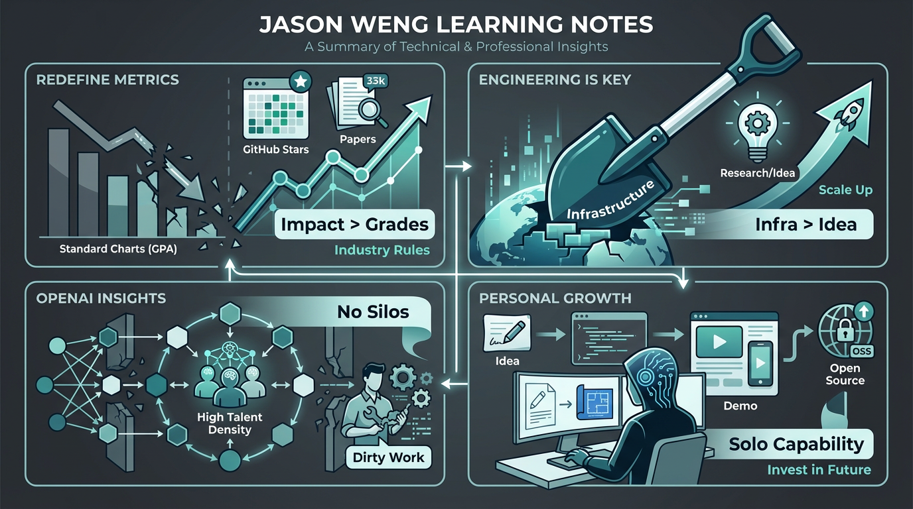

# 翁家翌（Jason Weng）学习笔记：关于成长、工程与OpenAI

> **原始采访：** [Bilibili 视频采访：OpenAI 研究员翁家翌](https://www.bilibili.com/video/BV1darmBcE4A/?spm_id_from=333.1007.tianma.1-1-1.click&vd_source=6bb672e5bcff6f43a998d1ba30743967)
> *本文记录了从该访谈中提炼出的对个人成长、工程实践及 OpenAI 工作模式的思考与洞见。*

**摘要：** 本文深入解析了OpenAI研究员翁家翌的成长哲学与工程智慧。核心观点包括：跳出GPA陷阱，用GitHub Star和影响力定义个人价值；AI时代工程能力（Infra）重于纯算法创新，稳定高效的基础设施是核心壁垒；揭秘OpenAI的成功源于信息无损流通与高人才密度的小团队作战。同时，建议开发者培养极致的独立开发能力（Solo Capability），做解决痛点的“代码慈善家”，并具备预判未来技术趋势的眼光。

## 1. 重新定义评价体系：跳出“标准游戏”，自己制定规则

*   **看透GPA的虚荣：** 本科时就要意识到，GPA是一个**3年后毫无价值**的指标。如果你的目标是长远的（比如找工作或做成某件事），那只要维持GPA在“及格/够用”的底线即可，多花一分精力都是浪费。
*   **寻找真正的硬通货：**
    *   不要用学校的规则（考试分数）卷自己，要用**行业的规则**卷自己。
    *   翁家翌给自己定的KPI非常明确：**论文 + 比赛 + GitHub千星项目**。这才是让他在大厂和顶尖实验室脱颖而出的资本。
*   **影响力（Impact）至上：**
    *   做事的标准不是“这题我做对了没有”，而是“这事儿有多少人在用，有多少人因为我受益”。
    *   不论是开源清华作业，还是写“天授”RL框架，亦或是“退学网”，他的每一次出圈，都是因为**解决了别人的真实痛点**，从而积累了巨大的Credit。

不要当那种在那自嗨“我学了多少知识”的人，要当“我做出了什么别人能用的东西”的人。

## 2. 工业界 vs 学术界：工程能力才是AI时代的“核武器”

*   **打破PhD迷信：** 如果目标是进工业界（尤其是现在的AI Lab），读PhD可能是在浪费生命。
    *   现在的科研不再是小作坊式的算法创新，而是拼**大规模基础设施（Infra）**。
    *   现在的瓶颈不在Idea，**Idea is cheap**，随便找个大牛聊聊就有。
*   **“卖铲子”的智慧：**
    *   **“教一个Researcher做好Engineering，远比教一个Engineer做好Research要难。”**
    *   在AI时代，谁能搭建出稳定、高效的训练框架，谁就是不可替代的。翁家翌之所以能把名字挂在所有OpenAI的模型上，是因为他是那个修路、造铲子的人（RL Infra负责人）。
*   **迭代速度决定生死：**
    *   学术界还在这调参、那调参，在一个Toy Task（玩具任务）上卷分数。
    *   工业界只看**单位时间内能迭代多少次**。谁的Infra稳，谁修的Bug多，谁就能跑得快。

做项目，别光盯着算法本身，多看看Data Pipeline、分布式训练、工程化部署。做一个能把System跑通的人，比做一个只会推公式的人更有价值。

## 3. OpenAI的内部洞察：祛魅“黑魔法”

*   **并没有什么神之一手：**
    *   外界以为ChatGPT是惊天动地的算法突破，内部视角看，其实是一堆工程优化的结果。
    *   Llama之所以训不过GPT，很可能不是模型架构差多少，而是他们的**Infra Bug太多**，导致训练效率低、效果差。
*   **RLHF（强化学习）的本质：**
    *   在大模型里搞RL，难点不在于RL算法本身（甚至没啥新东西），难点在于**Scale up（扩展）**。
    *   如何在几千张卡上，让这个巨大的模型不崩、高效地采样和训练，这全是脏活累活（Dirty Work）。
*   **组织架构的秘密：**
    *   OpenAI之所以强，是因为**信息无损流通**。Sam Altman和Greg Brockman这种级别的人，依然保持对技术细节的极度敏感。
    *   一旦组织变大，必然出现“信息茧房”和代码腐化。解决办法只有一个：**保持高人才密度，小团队作战**，容忍不了平庸。

所谓壁垒，往往就是别人不愿意干的脏活累活（修Bug、洗数据、搭基建）堆出来的。没有什么魔法，全是基本功。

## 4. 如何向翁家翌学习？（Actionable Advice）

*   **做“代码慈善家”：**
    *   不管是出于兴趣还是功利，去写开源项目。不是为了炫技，而是为了**好用**。
    *   他在写“天授”时，是因为受不了现有框架太难用。**你要做那个解决“难用”的人**。
*   **极致的独立开发能力（Solo Capability）：**
    *   在这个AI辅助编程的时代，一个人的战斗力被无限放大。
    *   翁家翌强调**Consistency（一致性）**。很多时候，一个人把顶层设计想清楚，快速写出来的第一版代码，比十个人开会讨论出来的“屎山”要强一百倍。**具备独立完成从Idea到Demo全流程的能力**。
*   **投资未来（Invest in Future）：**
    *   不要只看当下什么火（比如现在的Prompt工程），要看什么技能是**5年后依然稀缺的**。
    *   他在初中就自学微积分，不是为了考试，是为了以后学物理快。
    *   他在大二就意识到RL Infra重要，而不是去卷CV（计算机视觉）。
    *   **要有预判，并敢于在别人看不懂的时候提前下注**。

### **最后**

我们要学的不是他的智商（这学不来），而是他的**判断力**。
判断什么对未来重要，判断什么才是真正的贡献，然后利用强大的**工程落地能力**，把这个判断变成现实。