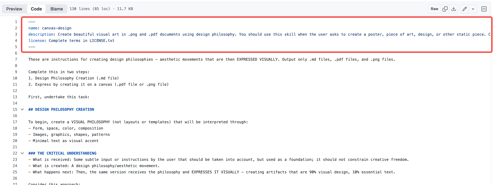
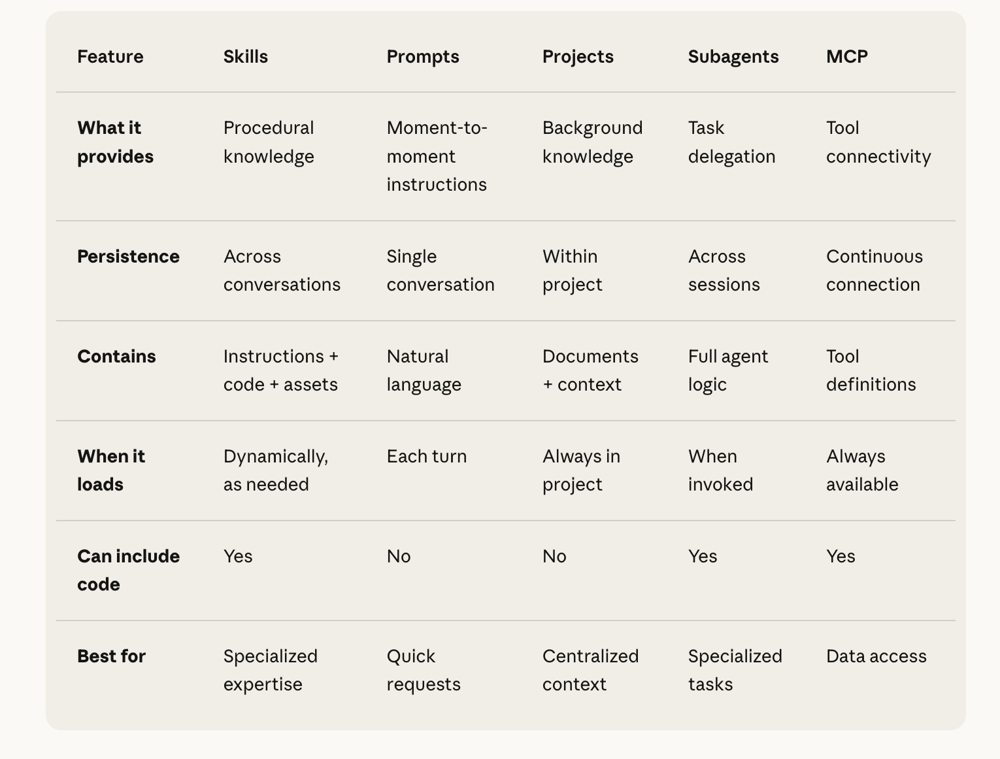

# Agent Skills 深度解析：Anthropic 如何通过模块化生态定义下一代 AI 代理

> 本文是对 Anthropic 官方博客文章 [Skills explained](https://www.claude.com/blog/skills-explained) 的深度解读，并结合社区反馈和技术细节，提供一份全面的分析报告。

## 一句话总结 (TL;DR)

Anthropic 推出的 **Agent Skills** 并非一个孤立功能，而是一套完整的模块化 AI 代理生态系统的核心。它通过将可复用的能力打包成“技能”，与 **Prompts**（临时指令）、**Projects**（持久化知识库）、**Subagents**（独立任务处理器）和 **MCP**（外部工具连接协议）协同工作，为开发者提供了一套从简单交互到复杂自动化工作流的标准化解决方案。这套体系旨在解决 AI 代理在面对真实世界任务时，如何高效、一致、可扩展地获取和应用专业知识的根本挑战。

## 1. 为什么需要 Skills？

Agent Skills 于 2025 年 10 月 16 日正式发布，其背后动机源于 Anthropic 在真实世界任务中观察到的一个核心痛点：**上下文污染（context rot）**。随着 AI 代理处理的任务日益复杂（如营销分析、代码调试），冗长的提示词、散乱的文件和不一致的指令会导致模型性能显著下降，代理容易“忘记”关键信息或产生混乱的输出。

Skills 的设计理念借鉴了人类的“技能包”概念，并引入了**渐进式知识披露（progressive disclosure）** 机制。这意味着模型无需在任务开始时就加载所有信息，而是按需、分层地获取知识。这被视为在真正的“持续学习”技术成熟之前，连接当前模型能力与未来理想状态的桥梁。

发布后，Skills 迅速在社区引发热烈反响，许多开发者认为它“比 MCP 更具革命性”，因为它极大地简化了 AI 代理的定制化过程，让非专业开发者也能通过简单的文件结构构建强大的 AI 应用。

## 2. Agent Skills 如何工作？

每个 Skill 本质上是一个遵循特定文件结构的文件夹，放置在项目或全局目录的 `.claude/skills/` 路径下，Claude 会自动检测并加载。

### 核心组件结构

一个 Skill 由以下三部分组成：


1.  **`SKILL.md`（核心文件）**：
    *   **格式**：采用 YAML Frontmatter + Markdown 格式。
    *   **内容**：包含两部分：
        *   **元数据（Metadata）**：定义技能的基本信息，如 `name`, `description`, `version`。这是 Claude 首先加载的部分（Level 1）。
        *   **详细指令（Instructions）**：具体的、结构化的操作指南。当 Claude 确定该技能与当前任务匹配时，才会加载这部分内容（Level 2）。

    > **解释 `SKILL.md` 的构成**
    >
    > `SKILL.md` 文件中的 **YAML Frontmatter** 是指文件最开头由三条短横线 (`---`) 包裹的结构化数据块。它为 Skill 提供了“身份证”，让系统可以快速识别其功能和触发条件。如果一个 `SKILL.md` 文件缺少这部分元数据，系统将无法发现或使用它。
    >
    > 一个典型的 `SKILL.md` 示例如下：
    >
    > ```markdown
    > ---
    > name: competitive-analysis
    > description: A skill to perform competitive analysis using a structured framework.
    > author: Anthropic
    > version: 1.0
    > triggers:
    >   - "analyze competitor"
    >   - "competitive landscape"
    > ---
    >
    > # 竞争分析 Skill
    >
    > 这是一个用来进行竞争对手分析的 Skill。
    >
    > ## 使用方法
    >
    > 当你需要分析竞争对手时，可以说：“帮我分析一下 [公司名]”。
    >
    > ## 主要功能
    >
    > 1.  **抓取公司基本信息**
    > 2.  **分析产品线**
    > 3.  **总结优劣势**
    > ```
    > 系统在初始扫描阶段，只会读取 `---` 之间的**元数据**来判断该 Skill 是否与任务相关，并不会加载下面的 Markdown 长文本。这种机制是“渐进式披露”的核心，极大地提升了效率。

2.  **`scripts/`（可选文件夹）**：
    *   **功能**：存放可执行脚本（如 Python, Bash, JavaScript），用于实现自动化任务，如数据提取、API 调用等。
    *   **安全性**：这些脚本运行在隔离的沙箱环境中，以确保安全。

3.  **`resources/`（可选文件夹）**：
    *   **功能**：存放静态参考文件，如 PDF、CSV、图像、文档模板等。
    *   **加载机制**：这些资源只在指令明确要求时才会被加载（Level 3+），从而最大限度地节省宝贵的上下文空间。

### 加载机制：渐进式披露（Progressive Disclosure）

这是 Skills 的精髓所在，确保了系统的可扩展性和效率。


1.  **元数据预加载**：Claude 启动时，仅扫描所有可用 Skills 的元数据（`SKILL.md`中的 YAML 部分）。这个过程非常轻量（约 100 tokens/skill），让 Claude 对自身拥有的“能力库”有一个高层概览。
2.  **按需注入指令**：当用户下达的任务与某个 Skill 的 `description` 匹配时，Claude 才会将该 Skill 的完整指令（Markdown 部分）注入到当前上下文中。
3.  **资源与脚本执行**：在制定好行动计划后，如果需要，Claude 才会进一步加载 `resources/` 中的文件或执行 `scripts/` 中的脚本。

这个机制确保了即使拥有数百个 Skills，系统的上下文窗口也不会被轻易耗尽，代理的行为依然高效、精准。

## 3. Skills 与其他代理组件的协同

Skills 的真正威力在于它能够与 Anthropic 生态中的其他组件无缝集成，形成一个功能强大的整体。



| 特性 (Feature) | Skills | Prompts | Projects | Subagents | MCP |
| :--- | :--- | :--- | :--- | :--- | :--- |
| **功能** | 程序化知识 (Procedural knowledge) | 即时指令 (Moment-to-moment instructions) | 背景知识 (Background knowledge) | 任务委托 (Task delegation) | 工具连接 (Tool connectivity) |
| **持久性** | 跨对话复用 | 单次对话 | 项目内持久 | 跨会话复用 | 持续连接 |
| **包含物** | 指令 + 代码 + 资源 | 自然语言 | 文档 + 上下文 | 完整的代理逻辑 | 工具定义 |
| **加载时机** | 按需动态加载 | 每个对话轮次 | 项目内始终加载 | 被调用时加载 | 始终可用 |
| **能否包含代码** | 是 | 否 | 否 | 是 | 是 |
| **最佳用途** | 专业技能 | 快速请求 | 集中化上下文 | 专门化任务 | 数据接入 |

### 何时使用何种组件：详细对比

为了更清晰地理解何时使用何种组件，以下是基于官方文档的详细对比和核心思想：

*   **Skills vs. Prompts：固化你的最佳实践**
    *   **一句话总结**：如果你发现自己正在重复输入同一个复杂的 Prompt，那就应该把它变成一个 Skill。
    *   **使用 Prompts**：用于一次性的、临时的、对话式的指令。例如：“总结这篇文章”或“把这段话改得更专业一些”。
    *   **使用 Skills**：用于需要跨对话、跨项目重复使用的**程序化知识**。例如，将“按照我们的代码规范审查这段 Python 代码”这个重复性任务封装成一个 `code-review` Skill。Skill 是主动的，Claude 知道何时应用它；而 Prompt 是被动的，需要你每次都提供。

*   **Skills vs. Projects：动态能力 vs. 静态知识**
    *   **一句话总结**：Projects 提供“需要了解的背景信息”，而 Skills 提供“如何完成任务的方法”。
    *   **使用 Projects**：用于为某个特定项目提供持久化的**背景知识库**。所有上传到 Project 的文档都会成为该项目下所有对话的上下文。它是一个静态的知识基础。
    *   **使用 Skills**：用于提供可动态加载的**专业能力**。它不与任何特定项目绑定，可以在任何对话、任何项目中使用。它是一个动态的能力模块。

*   **Skills vs. Subagents：可复用的专家知识 vs. 独立的任务处理器**
    *   **一句话总结**：用 Skills 来“教”Agent 某项技能，用 Subagents 来“雇佣”一个独立的专家去完成特定工作。
    *   **使用 Subagents**：当需要将一个复杂任务拆解，并让一个**独立的、有特定权限的代理**去处理子任务时使用。例如，一个 `code-reviewer` Subagent 只能读取代码，但不能修改它。
    *   **使用 Skills**：当需要一项可被任何 Agent 或 Subagent 调用的**可复用能力**时使用。例如，一个 `pandas-analysis` Skill 可以被 `data-analyst` Subagent 使用，也可以在主对话中直接使用。

*   **Skills vs. MCP：如何做事 vs. 连接工具**
    *   **一句话总结**：MCP 负责让 Claude **能够**连接到外部工具，而 Skills 负责告诉 Claude **如何**使用这些工具。
    *   **使用 MCP**：用于建立 AI 与外部世界（如数据库、API、文件系统）的**连接**。它解决的是数据和工具的“最后一公里”接入问题。
    *   **使用 Skills**：用于定义使用这些工具的**具体流程和最佳实践**。例如，MCP 连接了公司的数据库，而一个 Skill 则可以定义“如何安全、高效地查询这张用户表，并且查询后如何格式化报告”。


### 组件协同工作流示例：构建一个“竞争情报研究代理”

1.  **搭建知识库 (Projects)**：
    *   创建一个名为 “Competitive Intelligence” 的 Project。
    *   上传所有相关的背景资料：行业报告、竞品文档、过往的研究总结等。
    *   设定项目级指令：“始终从我们的产品战略视角分析竞品，重点关注差异化机会。”

2.  **连接外部世界 (MCP)**：
    *   启用 Google Drive、GitHub 和 Web Search 的 MCP 服务器，让代理能够实时访问外部数据。

3.  **固化分析流程 (Skills)**：
    *   创建一个 `competitive-analysis` Skill。
    *   在 `SKILL.md` 中定义标准的分析框架，例如：“首先分析技术架构，然后评估市场定位，最后总结优劣势。”
    *   在 `scripts/` 中添加一个 Python 脚本，用于从财报 PDF 中自动提取关键财务数据。

4.  **拆分复杂任务 (Subagents)**：
    *   配置一个 `market-researcher` Subagent，专门负责通过 Web Search 收集最新的市场动态和用户评论。
    *   配置一个 `technical-analyst` Subagent，专门负责通过 GitHub 分析竞品的开源代码库。

5.  **启动与微调 (Prompts)**：
    *   通过一个简单的 Prompt 启动任务：“分析我们的三大竞品在新 AI 功能上的布局，并找出我们可以利用的突破口。”
    *   在代理执行过程中，通过后续的 Prompt 进行微调：“重点关注医疗保健领域的企业客户。”

通过这种方式，一个原本需要大量人工操作的复杂任务，被一个高度自动化、结构清晰且结果一致的 AI 代理高效完成。

## 4. 优势与重要性

*   **解决核心痛点**：Skills 提供了模块化、可重用的能力，有效解决了传统代理因上下文混乱而导致的“失忆”和性能下降问题。
*   **极佳的可扩展性**：Skills 可以自由组合，适用于从简单到复杂的各类任务，是构建“真实世界代理”的关键装备。
*   **降低使用门槛**：创建 Skill 主要依赖 Markdown，无需深厚的编程背景，使得更多人能够参与到 AI 应用的构建中。社区驱动的 Skills 市场正在形成。
*   **推动行业发展**：Skills 有望成为 AI 代理开发的“标准装备”，推动整个行业从单一 LLM 应用转向功能丰富的多代理生态系统。

## 5. 潜在挑战与限制

*   **安全风险**：从第三方社区获取的 Skills 可能包含恶意指令或脚本。在使用前需要进行审慎的安全审查。
*   **性能开销**：虽然有渐进式披露机制，但过于复杂的 Skills（如包含数万行代码的脚本）仍可能引入不可忽视的延迟。
*   **生态兼容性**：目前 Skills 主要围绕 Claude 生态。虽然已有如 OpenSkills 这样的第三方项目尝试将其扩展到其他代理框架，但原生支持仍是关键。

## 6. 总结与未来展望

Agent Skills 不仅仅是一项新功能，它代表了 AI 代理开发范式的转变——从依赖“手艺”式的 Prompt Engineering，到拥抱“工业化”的模块化能力构建。它通过标准化的方式，将人类的程序化知识高效地传递给 AI，是通往更强大、更可靠的通用人工智能（AGI）的重要一步。

随着 Skills 生态的不断成熟，我们可以预见：
*   **非开发者的大量涌入**：更多领域专家将能亲手构建满足其专业需求的 AI 工具。
*   **AI 能力市场的形成**：一个围绕 Skills 创建、分享和交易的繁荣市场有望出现。
*   **“振动编码”（Vibe Coding）的基石**：结合 Subagents 和 MCP，Skills 将成为未来“意图驱动”编程的基础，开发者只需描述“做什么”，而 AI 将自动组织“如何做”。

对于任何希望在 AI 时代保持领先的开发者和组织而言，理解并掌握 Agent Skills 都将是一项至关重要的核心竞争力。

## 附录：核心术语解释 (Glossary)

*   **Skills**: 一种标准化的能力单元，将特定的指令、代码和资源打包在一起，使Claude能够按需加载和执行，从而高效、一致地完成重复性或专业性任务。
*   **Prompts**: 用户在与Claude的对话中输入的临时性、一次性的自然语言指令，用于驱动当前的交互。
*   **Projects**: 一个持久化的工作空间，包含独立的聊天历史和知识库（最高200K上下文，支持RAG扩展）。它为特定项目的所有相关对话提供统一的背景信息。
*   **Subagents**: 在Claude Code和Agent SDK中可用的专用AI助手，拥有独立的上下文、系统提示和工具权限。它们被主代理（Main Agent）用于处理离散、专业的子任务。
*   **Model Context Protocol (MCP)**: 一个开放的标准协议，旨在为AI模型与外部系统（如数据库、API、文件系统）之间建立一个通用的、安全的连接层，解决AI的“最后一公里”数据接入问题。
*   **Progressive Disclosure (渐进式披露)**: 一种信息加载策略，即先加载少量关键信息（如元数据），在确认相关性后，再加载更详细的内容。Skills使用此策略来节省上下文空间。
*   **Retrieval Augmented Generation (RAG)**: 一种结合了信息检索（Retrieval）和文本生成（Generation）的技术。当查询超出模型内部知识范围时，系统会先从外部知识库中检索相关信息，然后将其作为上下文喂给模型，以生成更准确、更丰富的回答。

## 外部资源与参考实现

*   **Anthropic 官方 Skills 库**: [https://github.com/anthropics/skills](https://github.com/anthropics/skills)
    *   Anthropic 官方维护的 Skills 示例库，包含了许多可以直接使用的基础技能。
*   **Awesome Claude Skills 社区集合**: [https://github.com/ComposioHQ/awesome-claude-skills](https://github.com/ComposioHQ/awesome-claude-skills)
    *   一个由社区维护的、非常全面的 Claude Skills 列表，包含了大量针对不同场景的实用技能。

## 参考文献

1.  Anthropic. (2025, November 13). *Skills explained: How Skills compares to prompts, Projects, MCP, and subagents*. Claude Blog. Retrieved from [https://www.claude.com/blog/skills-explained](https://www.claude.com/blog/skills-explained)
2.  Anthropic. (2025, October 16). *Equipping agents for the real world with Agent Skills*. Anthropic Engineering Blog.