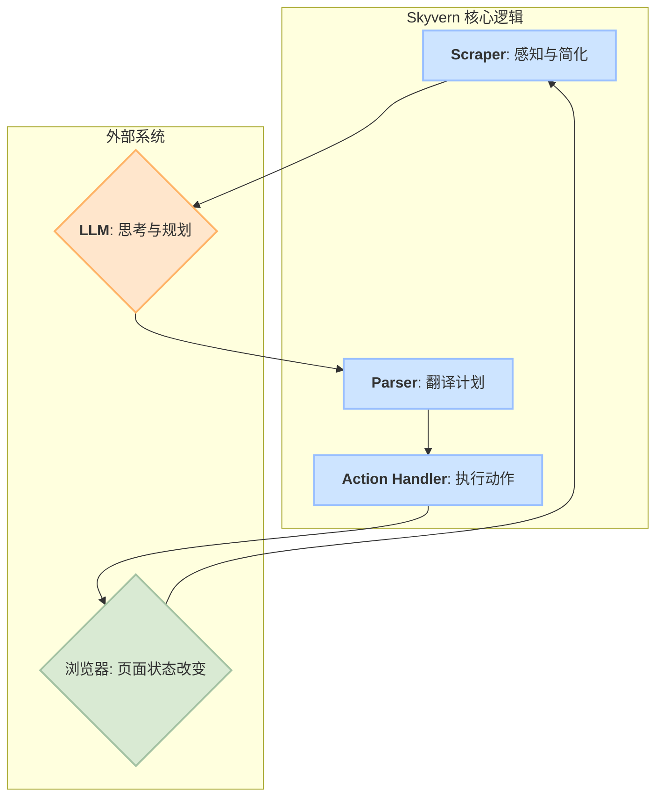
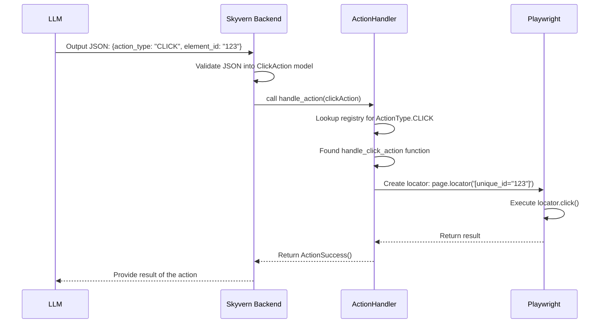

# Skyvern 深度解析：LLM 驱动的浏览器自动化框架揭秘

Skyvern 是一个强大的开源框架，它利用大语言模型（LLM）来自动化复杂的浏览器工作流。与依赖脆弱选择器的传统自动化工具不同，Skyvern 能够理解自然语言描述的任务，并以一种非常类似人类的方式与网页进行交互。本文将深入 Skyvern 的源代码，揭示其核心架构和实现原理。

## 核心原则

Skyvern 的核心建立在几个关键原则之上，这使其既智能又健壮。

### 1. LLM 作为“大脑”

Skyvern 的中央控制器是 LLM。它接收一个高层目标（例如，“登录我的亚马逊账户，找到斯蒂芬·金的最新书籍”）和当前网页的表示。基于此，它生成一个分步的行动计划以实现该目标。

### 2. DOM + 视觉双模态页面理解

Skyvern 不仅仅是“看”页面；它通过两种互补的模式来理解其结构和功能：

*   **基于 DOM 的分析（主要模式）：** Skyvern 不会直接向 LLM 提供原始、混乱的 HTML，而是向页面注入一个关键的 JavaScript 工具 `domUtils.js`。该脚本会仔细扫描文档对象模型（DOM），识别所有可交互的元素（按钮、输入框、链接），并为每个元素分配一个唯一的 `skyvern-id`。然后，它构建一个简化的、清晰的“元素树”。这种结构化的、富含元数据的格式，对于 LLM 来说，远比原始源代码更高效、更易于理解。

*   **基于视觉的分析（坐标模式）：** 对于像 GPT-4o 或 Claude 3.5 Sonnet 这样的现代多模态 LLM，Skyvern 可以在视觉模式下运行。它会截取页面图像，并要求模型识别出下一个动作（如点击或滚动）的确切坐标（例如 `(x: 450, y: 300)`）。

### 3. 具有智能回退机制的稳健动作执行

自动化是出了名的脆弱。网站布局的微小变化就可能破坏传统脚本。Skyvern 的 `ActionHandler` 旨在克服这种脆弱性。当它收到像 `ClickAction` 这样的命令时，它不会盲目执行。如果初次尝试失败，它会智能地尝试一系列回退策略：
*   尝试点击元素的父容器。
*   查找并点击关联的 `<label>` 元素。
*   如果所有其他方法都失败，则使用 JavaScript 直接触发点击事件。

这种分层的执行方法使得 Skyvern 的自动化对微小的 UI 变化具有非常强的适应能力。

---

## 核心工作流：“感知-思考-行动”循环

Skyvern 的架构可以最好地理解为一个由三个关键模块协调的持续的“感知-思考-行动”循环。



### 大脑：通过 LiteLLM 实现的通用 LLM 集成

Skyvern 架构的核心是其与大语言模型 (LLM) 的交互方式。这不仅仅是调用一个 API，而是一个设计精良、高度灵活的系统，旨在支持几乎任何现有的或未来的 LLM。这一能力的核心是 **LiteLLM**，一个强大的开源库。

**为什么是 LiteLLM?**

LiteLLM 充当一个“通用翻译器”，为超过 100 种 LLM 服务（包括 OpenAI、Google Gemini、Anthropic Claude、Azure、Ollama 本地模型、Groq 等）提供了一个统一的、标准化的调用接口。通过集成 LiteLLM，Skyvern 的开发者无需为每个模型编写和维护特定的 API 调用代码。他们只需调用标准的 `litellm.acompletion()` 函数，LiteLLM 就会在后台处理所有复杂的、特定于提供商的认证、请求格式和错误处理。

这种架构选择为 Skyvern 带来了巨大的优势：
*   **极致的灵活性**: 用户可以轻松切换 LLM 提供商，以平衡成本、性能和特定任务的能力，而无需修改 Skyvern 的核心代码。
*   **未来的兼容性**: 当新的、更强大的 LLM 出现时，只要 LiteLLM 支持它，Skyvern 就能在第一时间集成使用。
*   **简化的配置**: 所有模型配置都集中管理，使得设置和维护变得异常简单。

#### LLM 调用流程

Skyvern 的 LLM 调用流程优雅地将配置、工厂和执行解耦开来。

```mermaid
graph TD
    A[<b>配置注册表 (config_registry.py)</b>] --> B{<b>API 处理器工厂 (api_handler_factory.py)</b>};
    B --> C[<b>LiteLLM 引擎</b>];
    C --> D{<b>目标 LLM API</b><br>(Google Gemini, Azure OpenAI, Ollama, etc.)};

    subgraph Skyvern 内部
        A
        B
    end

    subgraph 外部库/服务
        C
        D
    end

    style A fill:#cde4ff,stroke:#99bfff,stroke-width:2px
    style B fill:#cde4ff,stroke:#99bfff,stroke-width:2px
    style C fill:#ffe6cc,stroke:#ffb366,stroke-width:2px
    style D fill:#d9ead3,stroke:#a4c2a3,stroke-width:2px

```

1.  **第 1 步：配置即代码 ([`config_registry.py`](code_repositories/skyvern/skyvern/forge/sdk/api/llm/config_registry.py))**
    这个文件是 Skyvern 的“模型目录”。它为大量预配置的 LLM（如 `gemini-2.5-pro`, `azure/gpt-4o`, `groq/llama3-70b`）定义了所有必要的连接参数，例如 `api_base`, `api_key` 和其他特定于模型的 `litellm_params`。这使得添加或修改模型支持就像编辑一个 Python 字典一样简单。

2.  **第 2 步：中央调度工厂 ([`api_handler_factory.py`](code_repositories/skyvern/skyvern/forge/sdk/api/llm/api_handler_factory.py))**
    这是 LLM 调用的“大脑中枢”。当 Skyvern 需要“思考”时，`LLMAPIHandlerFactory` 会介入。它会根据当前任务所需的模型，从 `config_registry.py` 中查找对应的配置，并动态构建一个调用处理器。更重要的是，它利用了 LiteLLM 的高级功能，如 `litellm.Router`，可以根据延迟、成本或可用性在多个模型部署之间进行智能路由和故障转移。

3.  **第 3 步：统一执行调用**
    在准备好所有配置和上下文（包括简化的 DOM 和用户提示）之后，工厂最终会执行一个标准化的异步调用：
    ```python
    # from code_repositories/skyvern/skyvern/forge/sdk/api/llm/api_handler_factory.py:1238
    response = await litellm.acompletion(
        model=self.llm_config.model_name,
        messages=messages,
        # ... 其他 LiteLLM 参数
    )
    ```
    正是这一行代码，体现了整个设计的精髓。无论 `model_name` 是指向 Google、Azure、一个本地模型还是其他任何提供商，调用方式都完全相同。LiteLLM 在幕后处理了所有差异，并将结果以统一的 `ModelResponse` 格式返回。

通过这种方式，Skyvern 不仅实现了一个强大的浏览器自动化代理，更构建了一个可扩展、可维护的、与 LLM 无关的 AI 推理平台。

### 1. **感知与简化**: Scraper 的艺术 (`scraper.py` & `domUtils.js`)

这是 Skyvern 工作流的起点，也是其智能化的基石。如果 LLM 无法准确“理解”网页，后续所有决策都将是空中楼阁。`scraper` 模块的核心任务，就是将一个复杂、动态、充满噪声的网页，转换成一个简洁、结构化、对 LLM 友好的格式。

**为什么不直接使用 HTML？**
现代网页的原始 HTML 充满了大量对任务无关的“噪声”，例如：
*   复杂的 CSS 类名 (`class="w-full h-12 flex items-center ..."`).
*   用于样式和布局的嵌套 `<div>`。
*   大量的追踪和广告脚本。
直接将这些喂给 LLM，不仅成本高昂，而且会严重干扰模型的判断。

**实现原理：JavaScript 注入与 DOM 解析**
Skyvern 的高明之处在于它不处理原始 HTML，而是处理浏览器渲染后的实时 DOM（文档对象模型）。其实现步骤如下：

1.  **注入 `domUtils.js`**: `scraper.py` 通过 Playwright 的 `page.evaluate()` 方法，将一个关键的 JavaScript 文件 [`domUtils.js`](code_repositories/skyvern/skyvern/webeye/scraper/domUtils.js) 注入到当前页面。这个脚本将在浏览器环境中运行，可以直接访问和操作 DOM。

2.  **元素标记与识别**:
    *   `domUtils.js` 会遍历整个 DOM 树。
    *   它会识别出所有**可交互**的元素，如 `<button>`, `<input>`, `<a>`, `<select>` 等，以及那些具有 `onclick` 属性或特定 `role`（如 `role="button"`）的元素。
    *   对于每一个识别出的可交互元素，它会动态地为其添加一个独一无二的属性：`skyvern-id="N"`，其中 `N` 是一个自增的数字。

3.  **构建元素树 (Element Tree)**:
    *   在标记完所有元素后，`domUtils.js` 会再次遍历 DOM，但这次它的目标是构建一个简化的 JSON 对象，即“元素树”。
    *   这个树结构只保留对 LLM决策有用的核心信息，例如：
        *   `tagName`: 元素的标签名 (e.g., `INPUT`).
        *   `id`: 我们刚刚赋予的 `skyvern-id`.
        *   `attributes`: 重要的属性，如 `placeholder`, `aria-label`, `type`, `value` 等。
        *   `textContent`: 元素的可见文本内容。
        *   `children`: 简化的子元素树。
    *   所有无关的样式、脚本和复杂的布局元素都被彻底抛弃。

4.  **返回简化结构**: `domUtils.js` 执行完毕后，会将这个轻量级的 JSON“元素树”返回给 Python 端的 `scraper.py`。`scraper.py` 随后可以选择将其转换为一个同样简洁的 HTML 格式，最终连同页面截图一起，构成 LLM 的“上下文”，发送给模型进行下一步的“思考”。

通过这一系列“感知与简化”的操作，Skyvern 成功地为 LLM 提供了一份高质量、高信噪比的“世界地图”，让其能够精准地定位目标并规划路径。


### 2. **思考**: The LLM

一旦 `Scraper` 准备好了页面数据，它就会连同任务目标一起发送给 LLM。LLM 分析简化的元素树和用户的目标，以生成一系列动作，通常是 JSON 格式（例如 `[{"action_type": "CLICK", "element_id": "35"}, {"action_type": "INPUT_TEXT", ...}]`）。

### 3. 行动：从决策到执行的精确翻译 (Action: Precise Translation from Decision to Execution)

这是系统的“双手”，负责将 LLM 的高级决策转化为浏览器中的具体操作。这个过程远比直接调用 Playwright 命令要复杂和精妙，它确保了整个流程的健壮性和准确性。

**核心流程：**

1.  **LLM 输出结构化决策**: LLM 不会生成 `page.click(...)` 这样的代码。相反，它会根据简化的元素树，输出一个结构化的 JSON 对象，明确指出要执行的 `action_type` (动作类型，如 "CLICK") 和目标的 `element_id` (即之前分配的 `unique_id`)。

2.  **模型验证 (`actions.py`)**: 后端接收到这个 JSON 后，会使用在 [`code_repositories/skyvern/skyvern/webeye/actions/actions.py`](code_repositories/skyvern/skyvern/webeye/actions/actions.py) 中定义的 Pydantic 模型进行验证。例如，一个点击决策会被转换成一个经过严格验证的 `ClickAction` 对象，这确保了后续操作的数据完整性和类型安全。

3.  **中央处理器 (`handler.py`)**: 所有动作的核心调度逻辑都位于 [`code_repositories/skyvern/skyvern/webeye/actions/handler.py`](code_repositories/skyvern/skyvern/webeye/actions/handler.py) 中的 `ActionHandler` 类。

4.  **注册与分发**: `ActionHandler` 使用了一个注册表模式。在文件底部，每个 `ActionType` 都被明确地映射到一个具体的处理函数，例如：
    ```python
    # code_repositories/skyvern/skyvern/webeye/actions/handler.py:2193
    ActionHandler.register_action_type(ActionType.CLICK, handle_click_action)
    ActionHandler.register_action_type(ActionType.INPUT_TEXT, handle_input_text_action)
    ```
    当 `ActionHandler.handle_action` 方法被调用时，它会根据传入的 `Action` 对象的类型，精确地查找到并调用对应的处理函数。

5.  **执行 Playwright 命令**: 在具体的处理函数（如 `handle_click_action`）内部，才会真正执行 Playwright 命令。这里的关键在于如何定位元素：
    *   它从 `constants.py` 中获取 `SKYVERN_ID_ATTR` (值为 `"unique_id"`)。
    *   它使用动作对象中的 `element_id` 来构建一个精确的 CSS 选择器，例如 `[unique_id="123"]`。
    *   最后，它调用 Playwright 的 `locator.click()` 方法来执行点击。

这一系列操作的流程图如下：



这种架构的优越性在于它彻底解耦了 LLM 的“思考”与 Playwright 的“执行”。LLM 在一个抽象、干净的环境中做决策，而 Skyvern 的后端则负责将这些决策稳健地转化为实际的浏览器交互，并处理各种潜在的执行失败和异常。

一个动作执行后，浏览器状态发生变化，循环重新开始。Skyvern 感知页面的新状态，这个循环持续进行，直到任务完成。

## 结论

Skyvern 代表了浏览器自动化领域的一次重大飞跃。通过抽象掉 DOM 选择器的脆弱性，并利用 LLM 的认知能力，它创建了一个可以智能地在网络上导航以完成复杂任务的系统。其核心创新在于将网页优雅地简化为 LLM 友好的格式，并结合一个有弹性的动作执行引擎，使其成为新一代 AI 驱动自动化的强大工具。

### “可交互”的奥秘：Skyvern 如何识别元素？

在 Skyvern 的分析中，一个核心问题是：它如何准确地判断一个网页元素是否“可交互”？这个问题的答案是其智能化的关键。通过深入研究其核心脚本 `domUtils.js`，我们可以发现，Skyvern 采用了一种复杂但高效的多层启发式策略，而非单一的简单规则。

这个策略的核心是 `isInteractable(element)` 函数，它像一个经验丰富的侦探，通过一系列的盘问来确认一个元素的“身份”。其判断逻辑主要遵循以下优先级：

1.  **首要原则：可见性 (Visibility)**
    一个元素如果用户都看不见，自然也无法交互。这是第一道过滤网。`isElementVisible()` 函数会进行严格的检查：
    *   **CSS 属性**：确保元素的 `display` 不是 `none`，`visibility` 不是 `hidden`。
    *   **尺寸检查**：通过 `getBoundingClientRect()` 确认元素的宽高都大于 0。一个没有实际大小的元素是不可见的。
    *   **现代 API**：在支持的浏览器中，它会优先使用高效的 `element.checkVisibility()` API 来进行综合判断。

2.  **HTML 语义 (Semantic Tags)**
    这是最直观的一层。Skyvern 会检查元素的 HTML 标签是否属于天然的可交互类型：
    *   带有 `href` 属性的 `<a>` 标签。
    *   `<input>`, `<textarea>`, `<select>`, 和 `<button>` 标签。
    *   关联到一个有效输入控件的 `<label>` 标签。

3.  **ARIA 部件角色 (Widget Roles)**
    这对于现代前端应用至关重要，因为大量的“按钮”实际上是用 `<div>` 或 `<span>` 实现的。Skyvern 会检查元素的 `role` 属性，如果它被赋予了标准的 ARIA 部件角色，如 `role="button"`, `role="link"`, `role="checkbox"`, `role="tab"` 等，就会被视为可交互。

4.  **行为属性 (Behavioral Attributes)**
    元素的属性也暴露了它的行为意图。Skyvern 会查找：
    *   是否存在 `onclick` 或 `jsaction` 这样的事件处理器属性。
    *   `isContentEditable` 属性是否为 `true`，表示这是一个可编辑的区域。

5.  **视觉与样式线索 (Styling Cues)**
    这是 Skyvern 最巧妙的部分，它模仿了人类用户的视觉直觉。一个最常见的交互标志就是鼠标悬停时指针变成“小手”形状。
    *   **直接样式**：检查元素的计算后样式（Computed Style）是否包含 `cursor: pointer`。
    *   **伪类样式**：更智能的是，`domUtils.js` 会在运行时解析页面上所有的 CSS 样式表，找出所有包含 `:hover` 伪类的规则，并检查其中是否定义了 `cursor: pointer`。这意味着，即使一个元素默认光标是箭头，但只要它在鼠标悬停时会变成手形，Skyvern 也能准确地将其识别为可交互元素。这个逻辑由 `isHoverPointerElement()` 函数实现。

6.  **特定框架的启发式规则 (Framework-Specific Heuristics)**
    为了更好地兼容各种前端框架，Skyvern 还内置了一些针对性的检查：
    *   **Angular**: 查找 `ng-click` 属性，甚至会检查 Angular 的内部上下文 (`__ngContext__`) 以发现事件绑定。
    *   **jQuery**: 尝试通过 `jQuery._data(element, "events")` 来判断是否绑定了点击事件。

7.  **明确的排除项 (Exclusions)**
    最后，它会明确排除那些永远不应被视为可交互的元素，例如 `<script>`, `<style>`, `<html>` 标签，以及那些明确设置了 `pointer-events: none` CSS 属性的元素。

**总结来说**，Skyvern 识别可交互元素的原理，是一个 **模仿人类直觉的综合决策过程**。它融合了 **结构分析**（HTML 标签、ARIA 角色）、**行为分析**（JavaScript 事件）和 **视觉分析**（CSS 样式与可见性），从而构建出一个远比单纯检查标签更准确、更可靠的可交互元素列表。

### 核心代码实现

为了让技术细节更清晰，以下是 `domUtils.js` 中 `isInteractable` 函数的完整实现。这个函数是整个交互判断逻辑的核心，它整合了前面提到的所有检查。

<details>
<summary>点击展开/折叠 `isInteractable` 核心代码</summary>

```javascript
// from code_repositories/skyvern/skyvern/webeye/scraper/domUtils.js:805
function isInteractable(element, hoverStylesMap) {
  if (!isElementVisible(element)) {
    return false;
  }

  if (isHidden(element)) {
    return false;
  }

  if (isScriptOrStyle(element)) {
    return false;
  }

  if (hasWidgetRole(element)) {
    return true;
  }

  // element with pointer-events: none should not be considered as interactable
  // but for elements which are disabled, we should not use this logic to test the interactable
  // https://developer.mozilla.org/en-US/docs/Web/CSS/pointer-events#none
  const elementPointerEvent = getElementComputedStyle(element)?.pointerEvents;
  if (elementPointerEvent === "none" && !element.disabled) {
    return false;
  }

  if (isInteractableInput(element, hoverStylesMap)) {
    return true;
  }

  const tagName = element.tagName.toLowerCase();
  if (tagName === "html") {
    return false;
  }

  if (tagName === "iframe") {
    return false;
  }

  if (tagName === "frameset") {
    return false;
  }

  if (tagName === "frame") {
    return false;
  }

  if (tagName === "a" && element.href) {
    return true;
  }

  // Check if the option's parent (select) is hidden or disabled
  if (tagName === "option" && isHiddenOrDisabled(element.parentElement)) {
    return false;
  }

  if (
    tagName === "button" ||
    tagName === "select" ||
    tagName === "option" ||
    tagName === "textarea"
  ) {
    return true;
  }

  if (tagName === "label" && element.control && !element.control.disabled) {
    return true;
  }

  if (
    element.hasAttribute("onclick") ||
    element.isContentEditable ||
    element.hasAttribute("jsaction")
  ) {
    return true;
  }

  const className = element.className?.toString() ?? "";

  if (tagName === "div" || tagName === "span") {
    if (hasAngularClickBinding(element)) {
      return true;
    }
    if (className.includes("blinking-cursor")) {
      return true;
    }
    // https://www.oxygenxml.com/dita/1.3/specs/langRef/technicalContent/svg-container.html
    // svg-container is usually used for clickable elements that wrap SVGs
    if (className.includes("svg-container")) {
      return true;
    }
  }

  // support listbox and options underneath it
  // div element should be checked here before the css pointer
  if (
    (tagName === "ul" || tagName === "div") &&
    element.hasAttribute("role") &&
    element.getAttribute("role").toLowerCase() === "listbox"
  ) {
    return true;
  }
  if (
    (tagName === "li" || tagName === "div") &&
    element.hasAttribute("role") &&
    element.getAttribute("role").toLowerCase() === "option"
  ) {
    return true;
  }

  if (
    tagName === "li" &&
    (className.includes("ui-menu-item") ||
      className.includes("dropdown-item") ||
      className === "option")
  ) {
    return true;
  }

  // google map address auto complete
  // https://developers.google.com/maps/documentation/javascript/place-autocomplete#style-autocomplete
  // demo: https://developers.google.com/maps/documentation/javascript/examples/places-autocomplete-addressform
  if (
    tagName === "div" &&
    className.includes("pac-item") &&
    element.closest('div[class*="pac-container"]')
  ) {
    return true;
  }

  if (
    tagName === "div" &&
    element.hasAttribute("aria-disabled") &&
    element.getAttribute("aria-disabled").toLowerCase() === "false"
  ) {
    return true;
  }

  if (tagName === "span" && element.closest('div[id*="dropdown-container"]')) {
    return true;
  }

  // FIXME: maybe we need to enable the pointer check for all elements?
  if (
    tagName === "div" ||
    tagName === "img" ||
    tagName === "span" ||
    tagName === "a" ||
    tagName === "i" ||
    tagName === "li" ||
    tagName === "p" ||
    tagName === "td" ||
    tagName === "svg" ||
    tagName === "strong" ||
    tagName === "h1" ||
    tagName === "h2" ||
    tagName === "h3" ||
    tagName === "h4" ||
    // sometime it's a customized element like <my-login-button>, we should check pointer style
    tagName.includes("button") ||
    tagName.includes("select") ||
    tagName.includes("option") ||
    tagName.includes("textarea")
  ) {
    if (isHoverPointerElement(element, hoverStylesMap)) {
      return true;
    }
  }

  if (hasASPClientControl() && tagName === "tr") {
    return true;
  }

  if (tagName === "div" && element.hasAttribute("data-selectable")) {
    return true;
  }

  try {
    if (window.jQuery && window.jQuery._data) {
      const events = window.jQuery._data(element, "events");
      if (events && "click" in events) {
        return true;
      }
    }
  } catch (e) {
    _jsConsoleError("Error getting jQuery click events:", e);
  }

  try {
    if (hasAngularClickEvent(element)) {
      return true;
    }
  } catch (e) {
    _jsConsoleError("Error checking angular click event:", e);
  }

  return false;
}
```
</details>

### 终极安全网：当启发式规则失效时怎么办？

您提出的“这种方法是否总会有遗漏”是一个直击要害的问题。答案是肯定的，**纯粹基于启发式规则的方法必然存在局限性**。

互联网的技术生态过于多样化和动态，新的前端框架、自定义组件和非常规的设计模式层出不穷。任何一套固定的规则都无法保证 100% 覆盖所有网站的所有边缘情况。

Skyvern 的设计者显然预见到了这个挑战，并为此构建了一套极其巧妙的“安全网”机制，这也是其架构如此健壮的根本原因：**多模态视觉回退（Multi-modal Visual Fallback）**。

这个机制的工作流程如下：

1.  **首选方法：DOM 分析**
    Skyvern 首先会尝试使用我们已经详细讨论过的、基于启发式规则的 DOM 分析方法。这种方法速度快、效率高，能够成功处理绝大多数（例如 80-90%）的常见网页元素。

2.  **备用方案：视觉分析**
    当 DOM 分析未能找到 LLM 需要交互的目标时（例如，指令是“点击红色的‘注册’按钮”，但这个按钮是一个非常规的自定义组件，DOM 规则未能识别），Skyvern 并不会就此放弃。它会启动备用方案：
    *   **截取屏幕**：获取当前网页的可视区域截图。
    *   **调用多模态模型**：将这张截图传递给一个强大的多模态模型（如 GPT-4o）。
    *   **视觉定位**：多模态模型会**在图像上“看到”**并直接定位目标元素，然后返回其精确的**屏幕坐标**（例如，x=520, y=310）。
    *   **坐标点击**：Skyvern 接收到坐标后，会执行一次基于坐标的模拟点击操作。

这个 **“优先 DOM 分析，视觉分析保底”** 的双重策略，是 Skyvern 系统鲁棒性的核心。它将 DOM 解析的速度和结构化优势，与多模态模型的视觉理解能力完美结合，形成了一个强大的互补。这确保了即使在启发式规则失效的疑难场景下，智能体依然有极大概率完成任务，大大提升了其在真实世界中的泛化能力和成功率。

### 最终章：两种模式的融合 - Task 与 Workflow

经过深入分析，我们必须澄清一个之前被混淆的关键概念：Skyvern 拥有两种截然不同的执行模式，理解它们的区别是掌握 Skyvern 架构的钥匙。

#### 1. 任务模式 (Task Mode): “聪明的”探索者

这是 Skyvern 最智能、最灵活的模式。

*   **工作方式**: 您给它一个高阶、模糊的目标（例如“帮我找到 Hacker News 的头条新闻”），AI Agent 就会启动“感知-思考-行动”的自主循环，自己决定所有必要的步骤来完成任务。
*   **适用场景**: 探索性任务、目标不明确或路径多变的场景。
*   **特点**: 非常强大和灵活，但执行路径不确定，结果可能因 AI 的“思考”而异。我们之前看到的 `run_task` Python 示例就属于这种模式。

#### 2. 工作流模式 (Workflow Mode): “可靠的”工程师

这是 Skyvern 更工程化、更可控的模式，也是其在企业级自动化中真正强大的地方。

*   **工作方式**: 您必须在 YAML（或 JSON）文件中，通过一系列预定义的**“区块” (Blocks)**，来**精确地、一步步地定义**整个任务流程。您告诉它第一步做什么、第二步做什么，路径完全确定。
*   **适用场景**: 业务流程自动化（RPA）、数据抓取、SaaS 集成等需要高可靠性和可重复性的任务。
*   **特点**: 结果稳定、可预测、可重复。

---

### Skyvern 工作流的真实格式与运行机制

基于对 `skyvern/schemas/workflows.py` 文件的分析，一个真正的工作流由一个有序的“区块”列表构成。

#### 核心格式

```yaml
parameters:
  # 定义工作流的输入、输出和凭证
  - ...
blocks:
  # 按顺序执行的一系列“区块”
  - block_type: ...
    label: "步骤一：..."
    ...
  - block_type: ...
    label: "步骤二：..."
    ...
```

#### 关键的 `BlockType` (区块类型)

Skyvern 提供了丰富的区块类型，让您可以构建复杂的流程，例如：

*   `NAVIGATION`: 导航到 URL。
*   `EXTRACTION`: 提取结构化数据。
*   `LOGIN`: 专门处理登录。
*   `FOR_LOOP`: **循环区块**，用于遍历列表（如商品链接），实现批量处理。
*   `CODE`: **代码区块**，允许执行任意 Python 代码，提供无限灵活性。
*   `HTTP_REQUEST`: 直接发送 API 请求。
*   `VALIDATION`: 根据条件判断流程是否继续。
*   `TaskV2`: **智能任务区块**。这是设计的精妙之处，允许在一个可靠的工作流中，嵌入一个“聪明”的自主任务，实现“粗活我来干，难活交给AI”。

#### 运行机制

工作流引擎会严格按顺序执行每个区块，并通过一个共享的**上下文 (Context)** 来传递数据。一个区块的输出可以成为下一个区块的输入。

---

### 案例解析：一个真实的“登录并抓取”工作流

下面是一个根据 Skyvern Schema 推断出的、更真实的“先登录，再抓取数据”的工作流 YAML 定义：

```yaml
# 这是一个根据 Skyvern Schema 推断出的示例 YAML
parameters:
  - parameter_type: WORKFLOW
    key: login_url
    workflow_parameter_type: string
    description: "登录页面的 URL"
  - parameter_type: WORKFLOW
    key: username
    workflow_parameter_type: string
  - parameter_type: WORKFLOW
    key: password
    workflow_parameter_type: secret
  - parameter_type: OUTPUT
    key: extracted_data
    description: "登录后抓取到的用户信息"

blocks:
  # 第一步：使用 LOGIN 区块处理登录
  - block_type: LOGIN
    label: "Step 1: 登录网站"
    url: "{{ parameters.login_url }}" # 使用模板语法引用参数
    navigation_goal: "使用提供的用户名和密码登录。用户名是 {{ parameters.username }}，密码是 {{ parameters.password }}。"
    parameter_keys:
      - username
      - password
    continue_on_failure: false # 如果登录失败，则终止工作流

  # 第二步：登录成功后，使用 EXTRACTION 区块抓取数据
  - block_type: EXTRACTION
    label: "Step 2: 抓取用户资料"
    data_extraction_goal: "在用户后台页面找到用户的个人资料名称和电子邮件地址。"
    data_schema:
      type: object
      properties:
        profile_name:
          type: string
        email:
          type: string
    continue_on_failure: false

  # 第三步 (可选)：使用 CODE 区块处理抓取到的数据
  - block_type: CODE
    label: "Step 3: 格式化输出"
    parameter_keys:
      - extracted_data # 引用上一步的输出
    code: |
      # 执行任意 Python 代码
      profile_name = extracted_data.get("profile_name", "N/A")
      email = extracted_data.get("email", "N/A")
      print(f"成功抓取到用户: {profile_name}, 邮箱: {email}")
      # 可以在这里将数据写入数据库或调用其他 API
      return {"status": "processed"}
```

### 深入 `CODE` 区块：在安全沙箱中执行任意代码

在所有区块类型中，`CODE` 区块无疑是最强大、最灵活的一个。它为开发者打开了一扇通往无限可能的大门，允许在工作流中直接执行自定义的 Python 代码。然而，强大的能力必须伴随着严格的约束。Skyvern 通过一个设计精巧的安全沙箱，确保了这种灵活性不会以牺牲安全性为代价。

#### 1. 安全第一：基于 AST 的代码沙箱

Skyvern 并不会简单地使用 `exec()` 来执行您提供的代码，因为这将带来巨大的安全风险。相反，它采用了一种更安全、更可控的方式：

1.  **抽象语法树 (AST) 解析**: 在执行前，您的 Python 代码字符串会被 `ast.parse()` 方法解析成一个抽象语法树。这棵树是代码结构的程序化表示。

2.  **严格的安全审查 (`is_safe_code`)**: 一个名为 `CodeVisitor` 的审查器会遍历 AST 的每一个节点，并执行严格的白名单检查：
    *   **禁止 `import`**: 代码中不允许出现 `import` 或 `from ... import ...` 语句。所有需要的功能都必须通过沙箱环境预先注入。
    *   **禁止访问“双下划线”属性**: 任何试图访问 `__private__` 或 `__magic__` 方法/属性的行为都会被立即阻止。这有效防止了通过 Python 的内省机制（如 `object.__subclasses__`）逃逸沙箱的企图。

任何违反这些规则的代码都会导致 `InsecureCodeDetected` 异常，并立即终止工作流。

#### 2. 受控的执行环境：你可以使用什么？

只有通过了安全审查的代码，才会被允许在一个受限的环境中执行。这个环境由 `build_safe_vars` 方法精心构建，它精确地定义了代码可以访问的一切：

*   **Playwright `page` 对象**: 这是沙箱中最核心的变量。一个活跃的、可操作的 Playwright `Page` 对象会被自动注入到您的代码作用域中。这使得您可以直接调用所有 Playwright 的强大功能，例如 `await page.goto(...)`, `await page.locator(...).click()`, `await page.wait_for_selector(...)` 等。
*   **工作流参数**: 您为 `CODE` 区块定义的任何输入参数（通过 `parameters` 列表）都会作为局部变量注入。这使得 `CODE` 区块可以无缝地接收来自上一个区块的输出。
*   **白名单模块与函数**: 您无法导入任意模块，但沙箱环境提供了一组预先批准的、安全的工具集：
    *   **核心模块**: `asyncio`, `re`, `json`
    *   **核心函数**: `print`, `len`, `range`, `locals`
    *   **核心类型**: `str`, `int`, `dict`, `list`, `tuple`, `set`, `bool`
    *   **异常处理**: `Exception` 基类

#### 3. 执行流程与输出

`CodeBlock` 的 `execute` 方法是整个流程的编排者：

1.  **获取上下文**: 获取当前的工作流上下文和浏览器 `page` 对象。
2.  **模板渲染**: 解析并渲染代码字符串中的任何 Jinja2 模板（例如 `await page.goto("{{ some_url }}")`）。
3.  **注入参数**: 将工作流参数和 `page` 对象注入到执行作用域。
4.  **安全扫描**: 调用 `is_safe_code()` 验证代码的安全性。
5.  **异步包装与执行**: 您的代码被包装在一个 `async def` 函数中，然后在一个严格受控的作用域内被 `exec`。
6.  **结果捕获**: 代码执行完毕后，`locals()` 函数被调用以捕获所有在您代码中定义的局部变量。这个包含所有变量的字典，经过 JSON 序列化后，成为 `CODE` 区块的最终输出。

#### 实践案例：使用 `CODE` 区块执行自定义 Playwright 操作

假设您需要执行一个标准区块无法完成的、复杂的 DOM 操作，您可以使用 `CODE` 区块：

```yaml
- block_type: CODE
  label: "Step 4: 执行自定义Playwright脚本"
  code: |
    # 'page' 对象是自动可用的
    # 执行一个复杂的 JavaScript 表达式来获取动态加载的内容
    element_text = await page.evaluate('''() => {
      const dynamicElement = document.querySelector('.dynamically-loaded-content');
      return dynamicElement ? dynamicElement.innerText : 'Default Value';
    }''')

    # 'element_text' 将成为输出的一部分
    # 可以在这里进行数据清洗或转换
    processed_text = element_text.strip().upper()

    print(f"Processed Text: {processed_text}")
  output_parameter:
    key: custom_code_output
```

在此示例中，`CODE` 区块的输出将是一个 JSON 对象，类似于：`{"element_text": "SOME DYNAMIC TEXT", "processed_text": "SOME DYNAMIC TEXT", ...}`。这个输出随后可以被工作流中的其他区块引用，实现了极高的灵活性。

#### 最佳实践：管理复杂代码
您可能会问：如果我的 `CODE` 区块逻辑非常复杂，难道必须把几百行 Python 代码都塞进 YAML 文件里吗？

这是一个非常实际的问题。将大量代码嵌入 YAML 会导致格式混乱、难以维护。幸运的是，Skyvern 的设计者预见到了这一点，并提供了一个极其优雅的解决方案：**Jinja2 模板渲染**。

`CODE` 区块中的 `code` 属性在执行前会被当作 Jinja2 模板来处理。这意味着您可以利用 Jinja2 强大的 `` 指令，将代码逻辑保存在独立的 `.py` 文件中，然后在 YAML 中引用它们。

**操作步骤:**

1.  **创建您的 Python 脚本**:
    将您复杂的逻辑写入一个标准的 Python 文件。例如，创建一个名为 `scripts/my_complex_logic.py` 的文件。

    ```python
    # scripts/my_complex_logic.py
    print("开始执行复杂的自定义逻辑...")

    # 使用注入的 'page' 对象与页面交互
    all_prices = await page.locator(".product-price").all_text_contents()

    # 执行一些复杂的数据处理
    numeric_prices = [float(price.replace('$', '')) for price in all_prices]
    average_price = sum(numeric_prices) / len(numeric_prices) if numeric_prices else 0

    print(f"计算出的平均价格为: ${average_price:.2f}")

    # 您在此处定义的任何局部变量 (如 average_price)
    # 都会被捕获并作为区块的输出
    ```

2.  **在 YAML 中引用脚本**:
    在您的 `CODE` 区块中，使用 `` 来引入您的脚本。

    ```yaml
    - block_type: CODE
      label: "从外部文件执行复杂逻辑"
      # code 属性现在是一个 Jinja2 模板
      code: |
        
      output_parameter:
        key: complex_logic_output
    ```

**工作原理**:

在 `CodeBlock` 执行之前，其 `format_potential_template_parameters` 方法会调用 Jinja2 引擎。Jinja2 引擎遇到 `` 指令时，会读取 `scripts/my_complex_logic.py` 文件的内容，并将其完整地替换到 `code` 属性中。随后，这个被完整渲染出来的 Python 代码字符串才会进入我们之前讨论过的 AST 安全沙箱进行检查和执行。

这种方法是处理复杂代码的最佳实践，它能让您的 YAML 保持整洁，同时让您的 Python 代码能够被版本控制、静态检查和独立测试。

### 最终结论
#### `CODE` 区块的设计哲学：处理依赖关系的“Skyvern 方式”

一个自然而然的问题是：如果我的代码有外部依赖（例如 `requests` 或 `pandas`），我该怎么办？

答案直接而明确：**您不能在 `CODE` 区块中导入任意的外部库。**

这不是功能的缺失，而是一个经过深思熟虑的核心安全设计。`CodeBlock.is_safe_code` 方法会明确禁止 `import` 语句，以防止代码逃逸沙箱并执行不安全的操作（如访问文件系统或进行不受控的网络调用）。

那么，如何处理需要依赖的任务呢？Skyvern 的解决思路是提供**专用的、功能内聚的“区块” (Blocks)** 来替代直接的库调用。

**设计模式：区块作为依赖**

`CODE` 区块的角色是作为工作流的“胶水”，用于编写轻量级的、自定义的业务逻辑和页面操作，而不是一个通用的 Python 运行环境。对于需要依赖库的常见任务，您应该使用对应的区块来完成。

**案例：发起网络请求**

*   **错误的方式 (This Will Fail):**
    ```yaml
    - block_type: CODE
      label: "错误的做法：尝试导入 requests"
      code: |
        # 这将导致 InsecureCodeDetected 异常而被拒绝执行
        import requests
        response = requests.get("https://api.example.com/data")
        data = response.json()
        print(data)
    ```

*   **正确的“Skyvern 方式”:**
    使用 `HTTP_REQUEST` 区块来处理网络请求，然后将结果传递给 `CODE` 区块进行处理。

    ```yaml
    blocks:
      # 第一步：使用专用区块处理网络请求
      - block_type: HTTP_REQUEST
        label: "Step 1: 使用专用区块获取 API 数据"
        method: "GET"
        url: "https://api.example.com/data"
        output_parameter:
          key: api_response_data

      # 第二步：使用 CODE 区块处理上一步的结果
      - block_type: CODE
        label: "Step 2: 处理 API 数据"
        parameter_keys:
          - api_response_data # 引用上一个区块的输出
        code: |
          # 'api_response_data' 变量是自动注入的字典
          status_code = api_response_data.get("status_code")
          body = api_response_data.get("response_body")

          if status_code == 200:
            print("API 请求成功!")
            # 在这里处理 body 数据
            user_name = body.get("user", {}).get("name")
            processed_name = user_name.upper()
          else:
            print(f"API 请求失败，状态码: {status_code}")

    ```

这种“组合优于继承”的设计哲学，强制实现了清晰的关注点分离，使得工作流不仅更安全，而且更具可读性和可维护性。当您发现自己想在 `CODE` 区块中 `import` 某个库时，不妨先查阅 Skyvern 提供的区块列表，很可能已经有一个现成的区块为您准备好了。


Skyvern 的强大之处在于其 **“混合驱动”** 的设计哲学。它并非单一的 AI 探索工具，也不是一个纯粹的死板脚本执行器。它是一个精密的自动化平台，允许开发者通过 **Workflow 模式**搭建稳定、可靠的业务流程骨架，然后在最需要智能的环节，通过 **Task 区块**赋予其 AI 的大脑。这种结合，既保证了自动化的可靠性和可维护性，又能在关键节点利用 AI 的强大适应性和推理能力，是其架构设计的核心优势所在。
### 终极扩展：创建你自己的自定义区块

我们已经知道，`CODE` 区块有其安全限制，不能导入外部库。那么，当您需要的功能（例如，与一个专有的 Salesforce API 交互）不存在于预置区块中时，该怎么办？

答案不是尝试绕过沙箱，而是成为框架的扩展者：**创建你自己的、完全自定义的区块类型**。

这正是 Skyvern 为高级用户和团队提供的终极“逃生舱口”。通过创建自定义区块，您的代码将不再是受限的“租户”，而是成为 Skyvern 核心应用的一部分，拥有完整的权限来导入依赖、处理复杂的认证和执行任何您需要的逻辑。

以下是创建一个自定义 `SalesforceBlock` 的分步指南，该区块用于从 Salesforce 查询联系人信息。

#### 第 1 步: 添加依赖

首先，将您的新依赖（如此处的 `simple-salesforce`）添加到项目的 `pyproject.toml` 文件中，并安装它。

```toml
# pyproject.toml
[tool.poetry.dependencies]
...
simple-salesforce = "^1.12.5"
...
```

#### 第 2 步: 定义区块的 YAML 结构 (Schema)

编辑 `code_repositories/skyvern/skyvern/schemas/workflows.py` 文件。

1.  **在 `BlockType` 枚举中添加新类型**:
    ```python
    # skyvern/schemas/workflows.py

    class BlockType(StrEnum):
        # ... existing block types
        HTTP_REQUEST = "http_request"
        SALESFORCE_QUERY = "salesforce_query" # <-- 添加你的新类型
    ```

2.  **为新区块创建 Pydantic 模型**:
    定义您的区块在 YAML 中需要哪些配置参数。

    ```python
    # skyvern/schemas/workflows.py

    # ... other BlockYAML classes

    class SalesforceQueryBlockYAML(BlockYAML):
        block_type: Literal[BlockType.SALESFORCE_QUERY] = BlockType.SALESFORCE_QUERY

        # 定义 YAML 中需要的参数
        soql_query: str # 例如 "SELECT Name, Email FROM Contact WHERE Name = 'John Doe'"
        salesforce_credential_key: str # 用于获取 Salesforce 凭证的参数键
    ```

3.  **注册新的 YAML 模型**:
    将新的 `...YAML` 类添加到 `BLOCK_YAML_SUBCLASSES` 联合类型中，以便解析器能够识别它。
    ```python
    # skyvern/schemas/workflows.py

    BLOCK_YAML_SUBCLASSES = (
        # ... existing classes
        HttpRequestBlockYAML,
        SalesforceQueryBlockYAML, # <-- 添加你的模型
    )
    ```

#### 第 3 步: 实现区块的执行逻辑

现在，在 `code_repositories/skyvern/skyvern/forge/sdk/workflow/models/block.py` 中实现区块的“大脑”。

1.  **导入你的依赖**:
    在文件的顶部，您可以自由地导入您在第 1 步中添加的库。
    ```python
    # skyvern/forge/sdk/workflow/models/block.py

    from simple_salesforce import Salesforce
    # ... 其他导入
    ```

2.  **创建区块实现类**:
    编写一个新的类，继承自 `Block`，并实现其 `execute` 方法。

    ```python
    # skyvern/forge/sdk/workflow/models/block.py

    # ... other Block classes

    class SalesforceQueryBlock(Block):
        block_type: Literal[BlockType.SALESFORCE_QUERY] = BlockType.SALESFORCE_QUERY

        soql_query: str
        parameters: list[PARAMETER_TYPE] = [] # 用于接收凭证等参数

        def get_all_parameters(self, workflow_run_id: str) -> list[PARAMETER_TYPE]:
            return self.parameters

        async def execute(
            self,
            workflow_run_id: str,
            workflow_run_block_id: str,
            organization_id: str | None = None,
            **kwargs: dict,
        ) -> BlockResult:
            workflow_run_context = self.get_workflow_run_context(workflow_run_id)

            # 1. 从上下文中安全地获取凭证
            # (这是一个简化示例，真实实现需要处理凭证解密)
            creds = workflow_run_context.get_value("salesforce_credentials")
            username = creds.get("username")
            password = creds.get("password")
            security_token = creds.get("security_token")

            try:
                # 2. 使用导入的库执行核心逻辑
                sf = Salesforce(username=username, password=password, security_token=security_token)
                query_result = sf.query(self.soql_query)
                records = query_result.get("records", [])

                # 3. 记录输出并返回成功结果
                await self.record_output_parameter_value(workflow_run_context, workflow_run_id, records)
                return await self.build_block_result(
                    success=True,
                    failure_reason=None,
                    output_parameter_value=records,
                    status=BlockStatus.completed,
                    workflow_run_block_id=workflow_run_block_id,
                )
            except Exception as e:
                # 4. 处理异常并返回失败结果
                return await self.build_block_result(
                    success=False,
                    failure_reason=f"Salesforce query failed: {str(e)}",
                    status=BlockStatus.failed,
                    workflow_run_block_id=workflow_run_block_id,
                )

    ```
3.  **注册新的实现类**:
    将新的实现类也添加到 `BlockSubclasses` 联合类型中。
    ```python
    # skyvern/forge/sdk/workflow/models/block.py
    BlockSubclasses = Union[
        # ... existing classes
        HttpRequestBlock,
        SalesforceQueryBlock, # <-- 添加你的实现类
    ]
    ```

#### 第 4 步: 更新区块工厂 (Factory)

最后一步是告诉 Skyvern 的工作流服务如何根据 YAML 中的 `block_type` 来创建您的新区块实例。编辑 `code_repositories/skyvern/skyvern/forge/sdk/workflow/service.py`。

```python
# skyvern/forge/sdk/workflow/service.py

class WorkflowService:
    # ...

    def get_block_from_yaml(self, block_yaml: BLOCK_YAML_TYPES, ...) -> BlockTypeVar:
        # ...
        elif block_yaml.block_type == BlockType.HTTP_REQUEST:
            # ...
        
        # 添加您的新区块的创建逻辑
        elif block_yaml.block_type == BlockType.SALESFORCE_QUERY:
            return SalesforceQueryBlock(
                label=block_yaml.label,
                soql_query=block_yaml.soql_query,
                parameters=[
                    # 此处处理从 block_yaml.salesforce_credential_key 到参数对象的转换
                ],
                output_parameter=output_parameter,
                continue_on_failure=block_yaml.continue_on_failure,
            )

        # ...
```

完成以上步骤后，您就可以在 YAML 工作流中像使用任何原生区块一样使用您的 `SalesforceQueryBlock` 了！这种模式为您提供了无与伦比的灵活性，使 Skyvern 能够与任何您需要的系统或服务进行深度集成。