# Spec-Kit 深入解析：当规范成为代码

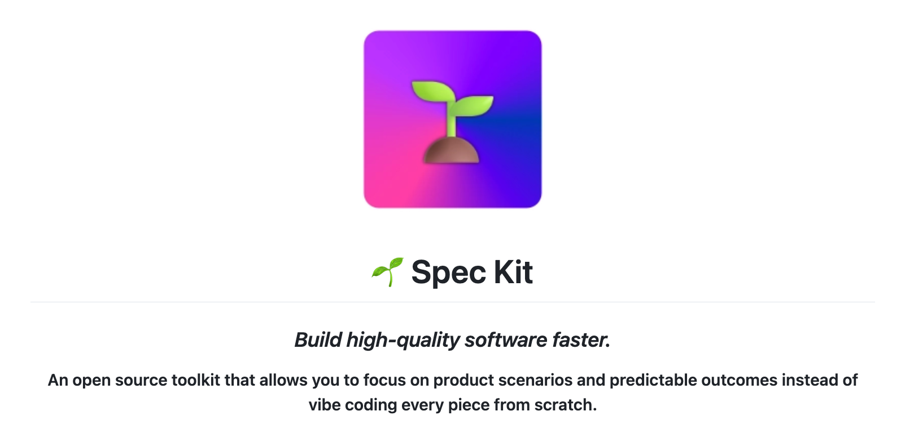

## 前言：一种新的开发模式

在传统的软件开发流程中，规范（如PRD、设计文档）通常作为开发的起点，但在编码实现后，文档与代码的同步往往成为一个挑战。代码通常被视为最终的“单一事实来源”。

**Spec-Driven Development (SDD)，即规范驱动开发，旨在改善这一状况。**

在 SDD 方法论中，强调了规范的核心地位：不再是规范服务于代码，而是**代码服务于规范**。规范被设计为可直接生成具体代码实现的基础，这意味着软件的演进可以通过迭代规范来驱动，而不是直接修改大量代码。

`spec-kit` 是 GitHub 为实践这一理念而设计的开源工具包。它于 2025 年 9 月开源，旨在通过结构化的规格来指导 AI 编码代理（如 Claude Code, GitHub Copilot 等），从而系统化地将自然语言描述的意图转化为软件项目。

## `spec-kit` 的核心工作流

`spec-kit` 的工作流由一系列与 AI 代理（如 Claude、GitHub Copilot 等）交互的“斜杠命令”构成，辅以一个名为 `specify` 的命令行工具。这个流程将一个模糊的想法，层层精炼，最终变为可运行的软件。

1.  **`specify init` - 项目初始化**: 创建项目结构和环境。
2.  **`/speckit.constitution` - 立法**: 定义项目必须遵守的架构原则和开发准则。
3.  **`/speckit.specify` - 定义规范**: 用自然语言描述你想要构建的**内容**和**原因**。
4.  **`/speckit.plan` - 制定计划**: 根据规范，结合选定的技术栈，生成详细的技术实现方案。
5.  **`/speckit.tasks` - 分解任务**: 将技术方案自动分解为可执行的、有序的任务列表。
6.  **`/speckit.implement` - 执行实现**: AI 代理根据任务列表自动执行编码、测试等工作。

## 实战演练：图解 `spec-kit` 工作流

下面，我们通过您提供的、基于官方文档示例运行的截图，来直观地感受 `spec-kit` 的每一步是如何工作的。

### 第 1 步：初始化项目 (`specify init`)

这是起点。我们使用 `specify` 命令行工具来初始化一个新项目，它会创建所有必需的模板和脚本。

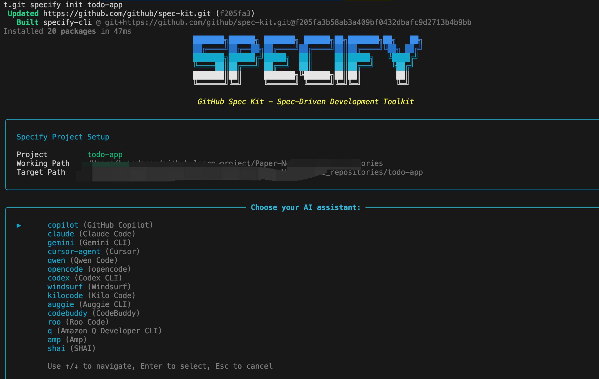

### 第 2 步：建立项目“宪法” (`/speckit.constitution`)

在动工之前，先“立规矩”。在 AI 助手的聊天框中输入此命令，设定项目的核心开发原则。

**命令**
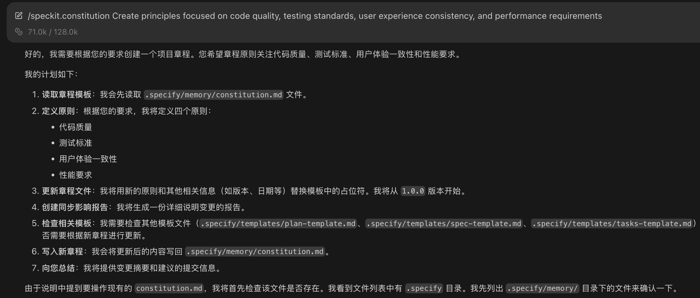

**结果**
AI 助手会生成一份 `constitution.md` 文件，其中包含了代码质量、测试标准等准则。
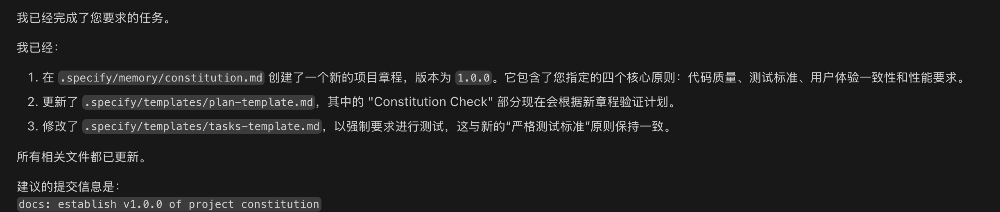

### 第 3 步：定义功能规范 (`/speckit.specify`)

我们通过这一步，用自然语言告诉 AI 想要构建什么。

**命令**
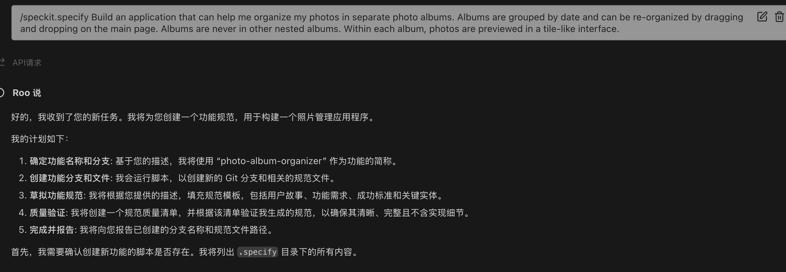

**结果**
`spec-kit` 会自动创建一个新的 Git 分支，并在该分支下生成一份详细的、结构化的规范文档 `spec.md`。
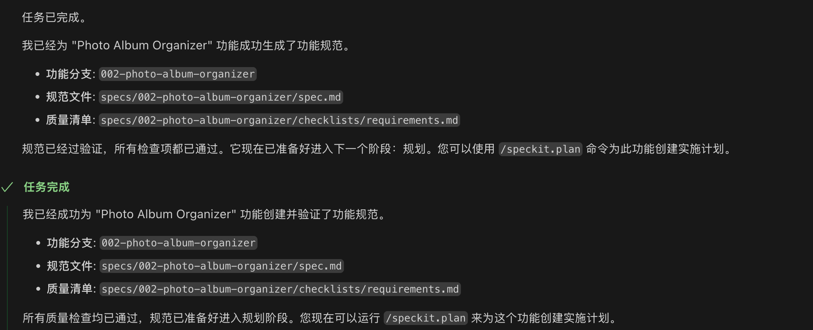
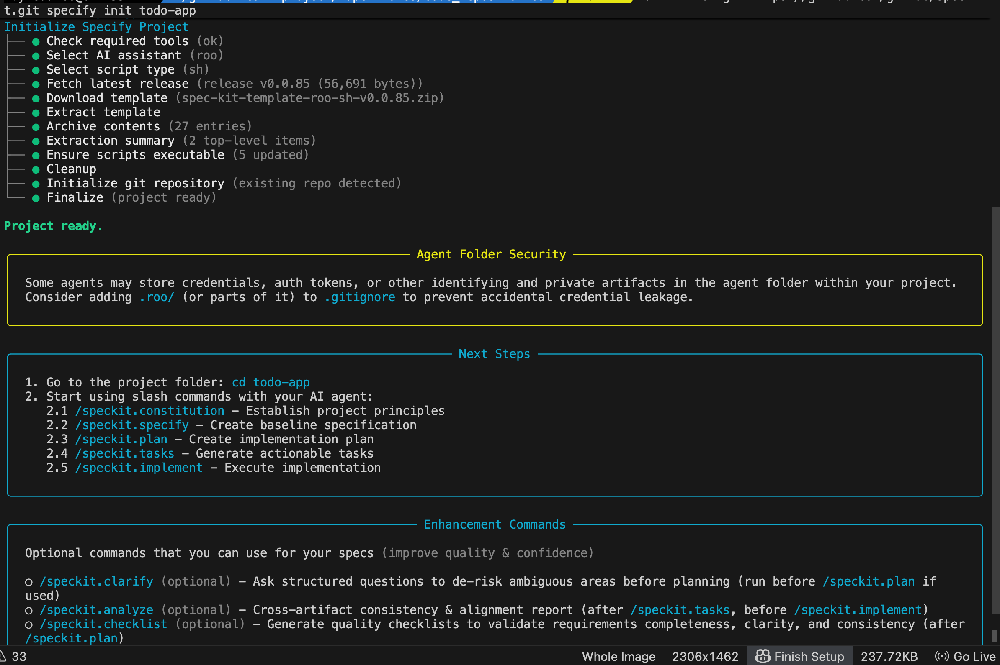

### 第 4 步：生成技术实现计划 (`/speckit.plan`)

当“做什么”被明确后，就轮到“怎么做”了。我们告诉 AI 具体使用什么技术栈。

**命令**
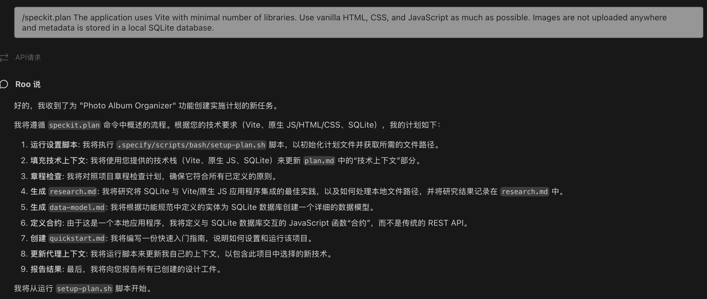

**结果**
AI 会根据规范和技术选型，输出一份详尽的技术实现计划 `plan.md`。
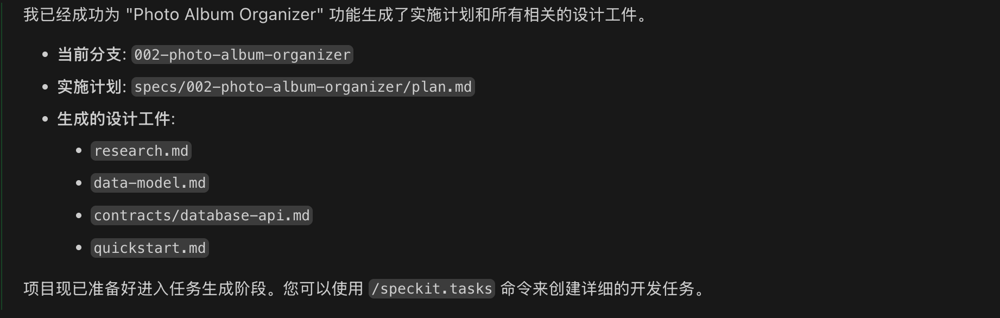

### 第 5 步：分解任务 (`/speckit.tasks`)

一旦计划确定，此命令会自动分析 `plan.md`，并将其分解成一个原子化的、可执行的任务清单 `tasks.md`。

**命令**
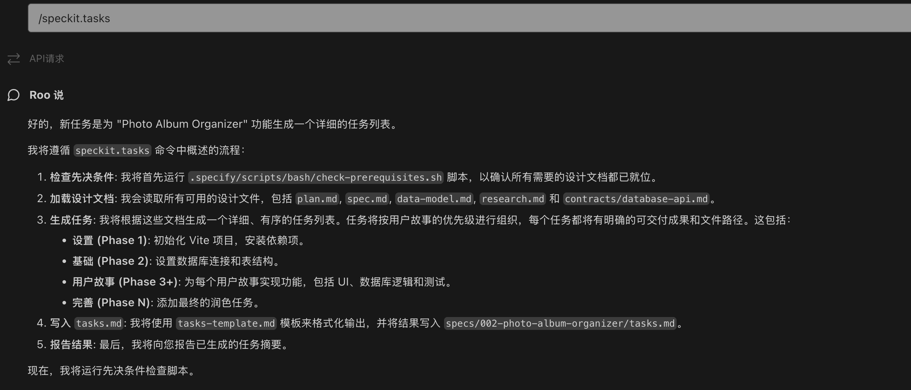

**结果**
生成的 `tasks.md` 文件为下一步的自动化实现提供了清晰的路线图。

### 第 6 步：执行实现 (`/speckit.implement`)

AI 代理会依据 `tasks.md` 中的任务列表，执行编码、测试等开发工作。

**命令**
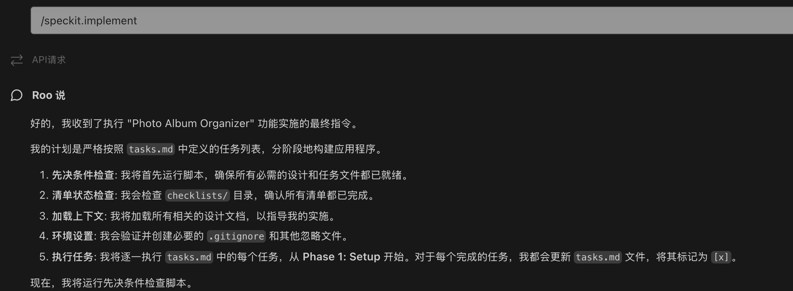

当命令执行完毕，应用的基础版本就已经构建完成。

## 实用建议与灵活运用

一个常见的问题是：“我是否需要严格按照这六个步骤来执行？”

答案是：**不需要，`spec-kit` 提供的是一套思想框架和推荐实践，而非固定的规则。**

### 1. 流程是指导，而非束缚

-   **对于小型项目或个人探索**：您可以大大简化流程。例如，`constitution` 可能只需要设定一次。对于一个简单的功能，您甚至可以在 `specify` 步骤中就顺便把技术栈想好，然后直接跳到 `tasks` 甚至 `implement`。
-   **对于大型项目**：遵循 `specify` -> `plan` -> `tasks` 的流程很有价值。它鼓励团队在编码前，就对需求、架构和实现路径达成清晰的共识。这份共识本身就是重要的交付物。

### 2. 迭代与循环，而非瀑布

`spec-kit` 的流程看似线性，但其价值也体现在**迭代**中。
-   如果在 `plan` 阶段，您发现某个需求在技术上难以实现或成本过高，您应该回到 `specify` 阶段去修改需求，而不是硬着头皮做。
-   如果在 `implement` 阶段，AI 实现的结果不符合预期，这通常意味着 `plan` 或 `spec` 不够清晰。这时，您应该去完善更高层次的规范文档，然后重新生成实现，而不是在生成的代码上打补丁。

### 3. 工件的价值 > 自动化的价值

即便不使用最后的 `/speckit.implement` 自动编码，遵循 `specify` 和 `plan` 流程所产出的 `spec.md` 和 `plan.md` 文件，也具有其自身的价值。它们可以作为：
-   **团队沟通工具**：帮助产品、开发、测试对齐目标。
-   **项目“活文档”**：由于后续的开发基于这些文档，它们能较好地与实现保持同步。
-   **新人上手指南**：一份清晰的规范和计划文档，可以帮助新成员快速理解项目。

## 社区之声：大家如何看待 Spec-Kit？

自 2025 年 9 月开源以来，`spec-kit` 在开发者社区（如 Reddit、X/Twitter、GitHub）引发了广泛讨论。总体来看，反馈偏向积极，但也存在一些批评和中立的观点。下表根据社区反馈，总结了主要声音及其来源：

| 观点类型 | 常见反馈 | 示例来源与引用 |
|----------|----------|-----------------|
| **积极 (Pros)** | 结构化流程能有效防止 AI "失控" 或 "破坏" 项目；与多种 AI 代理轻松集成；显著提升代码质量和效率；适合中大型代码库。 | **Reddit**: “Really awesome, It finally prevents the AI to nuke your projects.” **X/Twitter**: “Claude Code + Spec-Kit de aynı işi görüyor kullanıyorum memnunum.” (我正在使用它，很满意，它与 Claude Code 配合得很好。) **LinkedIn**: 有开发者分享称用它生成网站的体验是“一个愉快的惊喜”。 |
| **中性/实用** | 被视为一个实验性工具，适合绿地项目或改造遗留系统；常被用作与其他 SDD 工具（如 Kiro CLI）比较的基准；规格的迭代过程很好，但人工审查仍然必要。 | **GitHub Discussion**: 讨论在处理变更请求时，规格如何演进。 **Medium**: 许多教程强调开发者需要一个从“凭感觉编码”到“规格驱动”的思维转变。 **X/Twitter**: “Spec-kit de güzel ama kullanmadım.” (Spec-kit 不错，但我没用过。) |
| **负面 (Cons)** | 对于修复小 Bug 或开发小型功能而言，流程过于繁琐（"杀鸡用牛刀"）；实际效果并不总像纸面上那样完美；Token 消耗较高；需要时间来适应其 CLI 和提示词模式。 | **Reddit**: “Overkill for small features or bug fixes.” **X/Twitter**: “OpenSpec veya Spec-Kit gibi arkadaşlar kağıt üzerinde durduğu kadar iyi çalışmıyor.” (像 OpenSpec 或 Spec-Kit 这样的工具，实际效果不如纸上谈兵。) **X/Twitter**: “Não tive uma boa experiencia com o spec-kit.” (我对 spec-kit 的体验不好。) |

## 优势与局限

综合来看，`spec-kit` 的核心价值和潜在挑战可以总结如下：

**优势:**
*   **提高 AI 编码的准确性**: 通过清晰的规格作为“单一事实来源”，减少了 AI 的随意猜测和错误。
*   **促进团队协作**: 规格文档 (`spec.md`, `plan.md`) 成为团队共享的真相，便于审查、讨论和对齐目标。
*   **灵活迭代**: 非常适合实验性开发，修改需求只需更新规格文档，下游的计划、任务和代码可以随之调整。
*   **开源免费**: 作为一个由 GitHub 推动的开源项目，它吸引了大量贡献者，并且可以免费使用。

**局限:**
*   **学习曲线**: 需要开发者熟悉其命令行工具（CLI）和与 AI 代理交互的特定模式。
*   **场景依赖**: 对于非常简单的任务或微小的代码修改，其流程可能显得过于繁琐。
*   **依赖于 AI 质量**: 最终产出的质量依然受限于所使用 AI 代理的能力和用户提供提示的质量。如果提示不佳，仍需大量手动调整。

## 其他信息与参考

*   **项目状态**: `spec-kit` 于 2025 年 9 月首次开源。截至 2025 年 10 月，最新版本为 `v0.0.77`，在 GitHub 上已获得超过 48,844 颗星，显示出较高的社区关注度。
*   **AI 代理兼容性**: 它被设计为与多种 AI 编码代理兼容，包括 Claude Code、GitHub Copilot、Gemini CLI 和 Cursor 等。对企业级方案（如 Amazon Q）可能需要进行自定义适配。
*   **与其他工具的对比**:
    *   **Kiro CLI**: 社区常将二者进行比较。普遍认为 `spec-kit` 更通用，而 Kiro 在文档管理方面功能更强。
    *   **OpenSpec**: 另一个 SDD 工具，有用户反馈在某些场景下，`spec-kit` 的实际效果不如预期。
*   **参考链接**:
    *   **官方仓库**: [github.com/github/spec-kit](https://github.com/github/spec-kit)
    *   **官方博客**: [github.blog](https://github.blog/2025-09-12-introducing-spec-kit-a-new-way-to-build-with-ai/)
    *   **入门教程**: 在 YouTube 等平台可以找到社区贡献的上手视频。

### 结论

`spec-kit` 的使用方式应因地制宜。您可以将其视为一个“工具箱”，根据项目复杂度、团队规模和质量要求，选择合适的工具和流程。

-   **轻量使用**：用它来快速生成项目脚手架和初始规范。
-   **标准使用**：完整地走完流程，确保大型项目的规范性、一致性和可维护性。
-   **思想采纳**：即便不使用工具，采纳“规范驱动”和“分层细化”的思想，也能极大地改善您的开发实践。