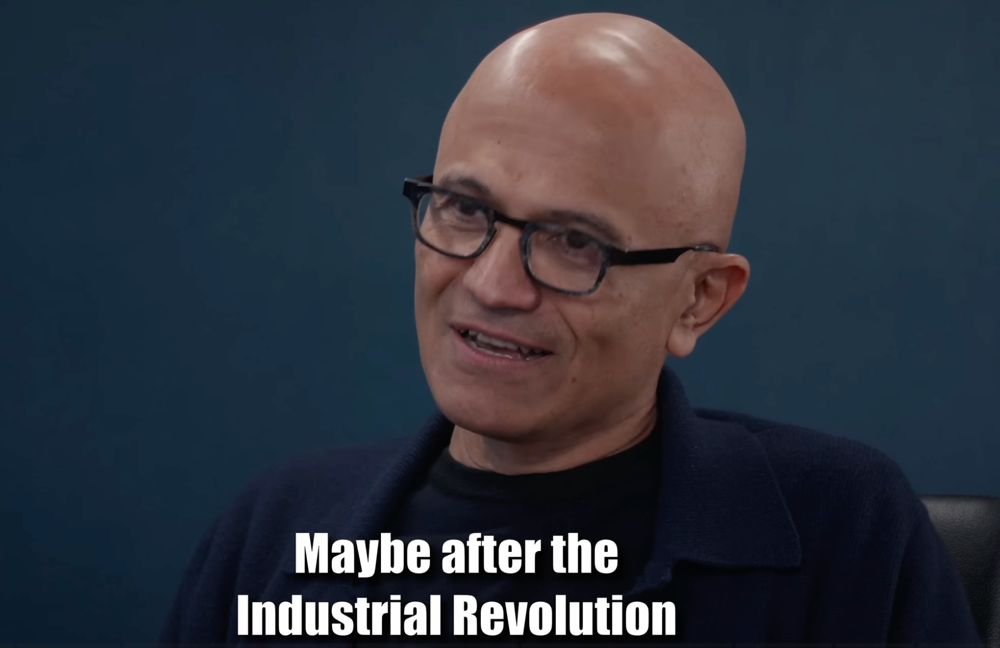

# 微软 CEO Satya Nadella 对话未来：AI 价值的归属与微软的万亿赌局

> 本文是对 The Neuron 文章 [Microsoft CEO Satya Nadella Debates the Future of Microsoft and AI](https://www.youtube.com/watch?v=8-boBsWcr5A) 的解读与分析。

> **一句话总结 (TL;DR)**：微软 CEO Satya Nadella 指出了一个根本性的战略转变：微软正从软件公司变为一家重资本的工业巨头。他认为，AI 时代的真正价值不在于谁的模型最强，而在于谁能提供那个所有 AI 都离不开的“脚手架”（Scaffolding）——也就是基础设施、平台和工具。

## 问题陈述

AI 时代，一个核心的商业问题摆在我们面前：钱和权力最终会流向哪里？是会流向打造强大模型的 OpenAI 们，还是会流向提供底层平台和工具——也就是“脚手架”——的微软？这篇文章就来聊聊微软 CEO Satya Nadella 如何回答这个问题，并分享他为微软下的一场大赌注。

## 核心思想：押注“脚手架”

Nadella 认为，即便最强的大模型也难逃被开源方案快速追赶。真正长期的护城河，不是模型，而是**掌握 AI 工作必需的那层“脚手架”**。

为此，Nadella 正带领微软从传统软件公司**彻底转型**成一家重资本的全球工业巨头，目标是搭建一个涵盖基础设施、工作流、平台和数据流的生态，让所有 AI 代理都能在上面高效运转。

## 关键技术细节与战略辩论

文章通过几个核心辩论，详细阐述了 Nadella 的战略布局：

### 1. 辩论一：自主代理会取代 Office 吗？
-   **挑战**：未来的自主 AI 代理将能够自由使用任何软件并迁移数据，这使得与 Office 等平台的深度集成变得无关紧要。价值将被模型公司捕获。
-   **Nadella 的回应**：微软的目标是建立一个“支持代理工作的基础设施业务”。商业模式正从“按用户付费”转向“按代理付费”，每个代理都需要自己的虚拟计算机、存储和安全身份，这是一个潜在规模远超当下的巨大市场。微软通过在 Office 等产品中构建深度嵌入的、难以复制的“认知层”（如“Excel Agent”），创造了外部通用模型无法比拟的效率和体验优势。

### 2. 辩论二：GitHub Copilot 市场份额下降是危险信号吗？
-   **挑战**：数据显示，GitHub Copilot 在 AI 编程市场的份额一年内从接近 100% 掉到 25% 以下，看起来好像“模型更强就能取胜”，平台优势不再稳固。
-   **Nadella 的回应**：他反而认为，这恰恰说明市场正在爆发式增长。微软的算盘不是让自家代理横扫所有对手，而是把 GitHub 打造成“AI 代理的总部”（Agent HQ）——开发者可以在同一界面部署、管理各家公司推出的代理。谁赢不重要，只要战场在微软家，微软就赢。

### 3. 辩论三：微软暂停数据中心建设是战略失误吗？
-   **挑战**：微软在 2024 年末暂停数据中心扩张，让竞争对手（如 Oracle）获得了追赶的机会，此举被视为放弃了裸金属托管业务的领导地位。
-   **Nadella 的回应**：这是一个经过深思熟虑的战略选择。其目的是避免成为单一公司的低利润“托管商”，并避免被单一世代的硬件（如 H100）套牢。长期战略是建立一个更具**灵活性（Fungibility）**、全球化且盈利能力更强的网络，服务于多样化的客户和 AI 工作负载，并与硬件的摩尔定律同步“竞速”。

### 4. 微软的 AI 战略：MAI 与 OpenAI 的协同
-   微软内部的 **Microsoft AI (MAI)** 团队并非要直接与 GPT-5 竞争。得益于与 OpenAI 的深度合作和 IP 访问权，MAI 可以专注于更具成本效益的专用模型（如图像、音频）和基础性研究。
-   MAI 的一个核心使命是构建**人文主义超级智能 (Humanist Superintelligence, HSI)**，这是一种可控的、面向特定领域的、旨在解决具体问题（如医疗、能源）的超级智能，从而主动规避通用人工智能（AGI）的“失控风险”。

### 5. 新一代基础设施：“AI 超级工厂”
-   以 **Fairwater 2** 数据中心为代表的“AI 超级工厂”，是为训练和运行大规模 AI 模型而生的全新基础设施。
-   其关键特征包括：通过专用 AI 广域网（AI WAN）连接多个物理站点，形成一个单一的分布式超级计算机；采用先进的液冷技术和高密度机架尺度系统（如 NVIDIA GB200），以实现极致的计算效率。

### 6. 地缘政治与主权 AI
-   Nadella 认为，在当前的地缘政治格局下，**信任是美国科技最关键的特性**。
-   微软正积极通过在全球建立数据中心、提供“主权云服务”（Sovereign Services on Azure）等方式，尊重各国的数据主权要求，目标是成为全球最值得信赖的技术合作伙伴。

## 结论与展望

总而言之，Satya Nadella 正在带领微软完成一次彻底的转型：从软件巨头升级为全球数字工业力量。他相信，在 AI 时代，谁能建好并掌握数字世界的“铁路、电厂和工厂”，谁就握有未来的门票。

这个赌局最终输赢，就看“平台比模型更重要”这句话是否站得住脚。微软押的是 20-50 年的大格局，而许多模型实验室押的是 3-5 年见分晓的 AGI 竞赛。

---

## 附录：核心术语解释 (Glossary)

-   **Scaffolding (脚手架)**: 在本文的语境中，指代支持 AI 代理（Agents）执行工作所需的所有底层基础设施、平台、工具、工作流和数据的总称。Nadella 认为，这部分比 AI 模型本身更具长期价值。
-   **Fungibility (灵活性/可替代性)**: 指数据中心的基础设施能够动态地用于多种不同类型的 AI 工作负载（如训练、推理、数据生成），而不是被锁定在单一任务或硬件世代上。这是微软避免成为低利润“托管商”的核心策略。
-   **Sovereign AI (主权 AI)**: 指一个国家或地区有能力控制其数据、数字基础设施以及在其境内运行的 AI 系统。这是为了响应全球日益增长的数据隐私和国家安全需求，微软通过“主权云”等服务来满足这一要求。
-   **Humanist Superintelligence (HSI, 人文主义超级智能)**: 由微软 AI (MAI) 团队提出的概念，指一种可控的、面向特定领域的超级智能。其目标是解决具体的、对人类有益的问题（如医疗健康、清洁能源），而不是追求一个无限制的、可能带来失控风险的通用人工智能（AGI）。
-   **AI Agent (AI 代理)**: 指能够自主执行任务的 AI 程序。未来的商业模式可能从“按人类用户付费”演变为“按 AI 代理付费”，每个代理都需要自己的计算资源、身份和安全保障。

## 参考

-   Patel, D. (Host). (2025). *Satya Nadella on the Future of AGI*. [Video]. YouTube. https://www.youtube.com/watch?v=8-boBsWcr5A
