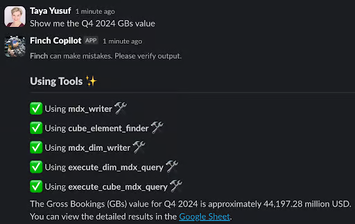
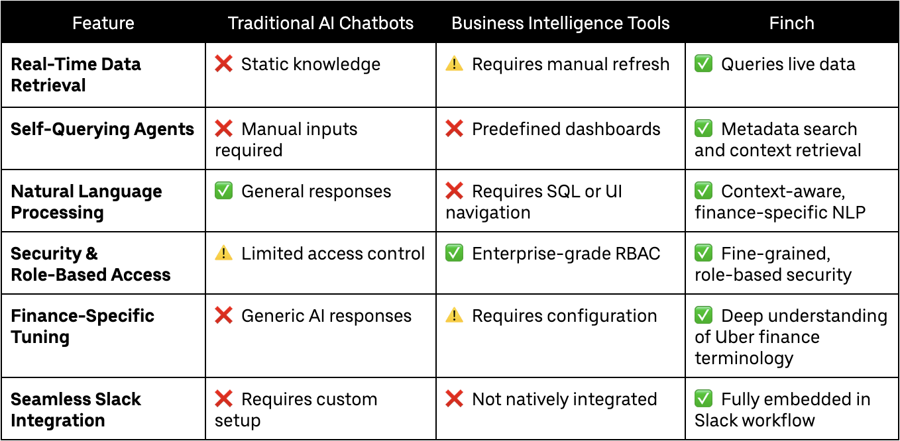
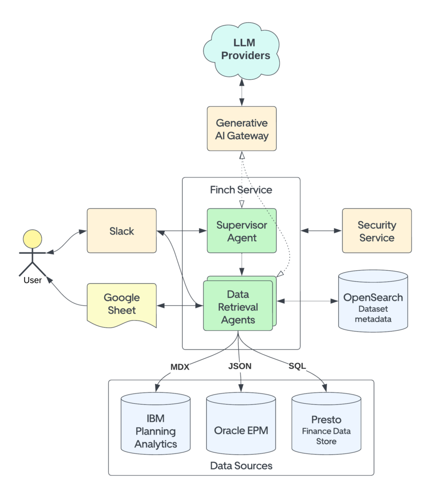
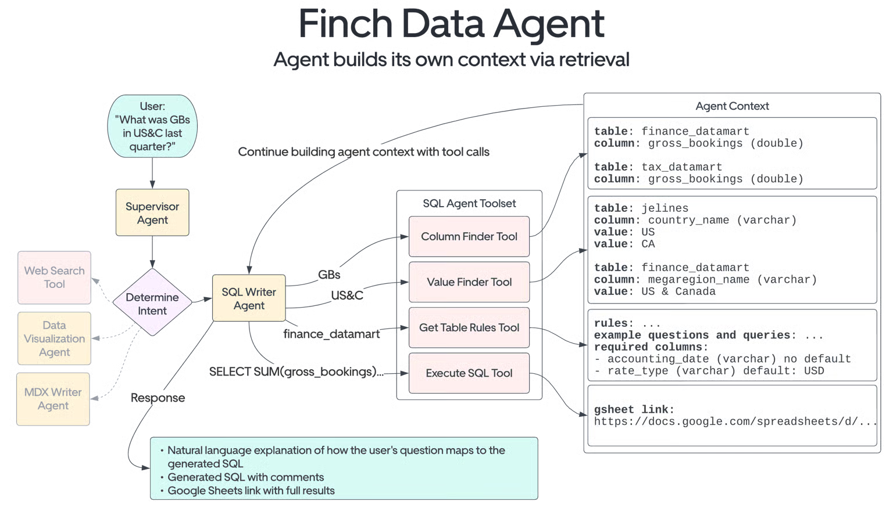
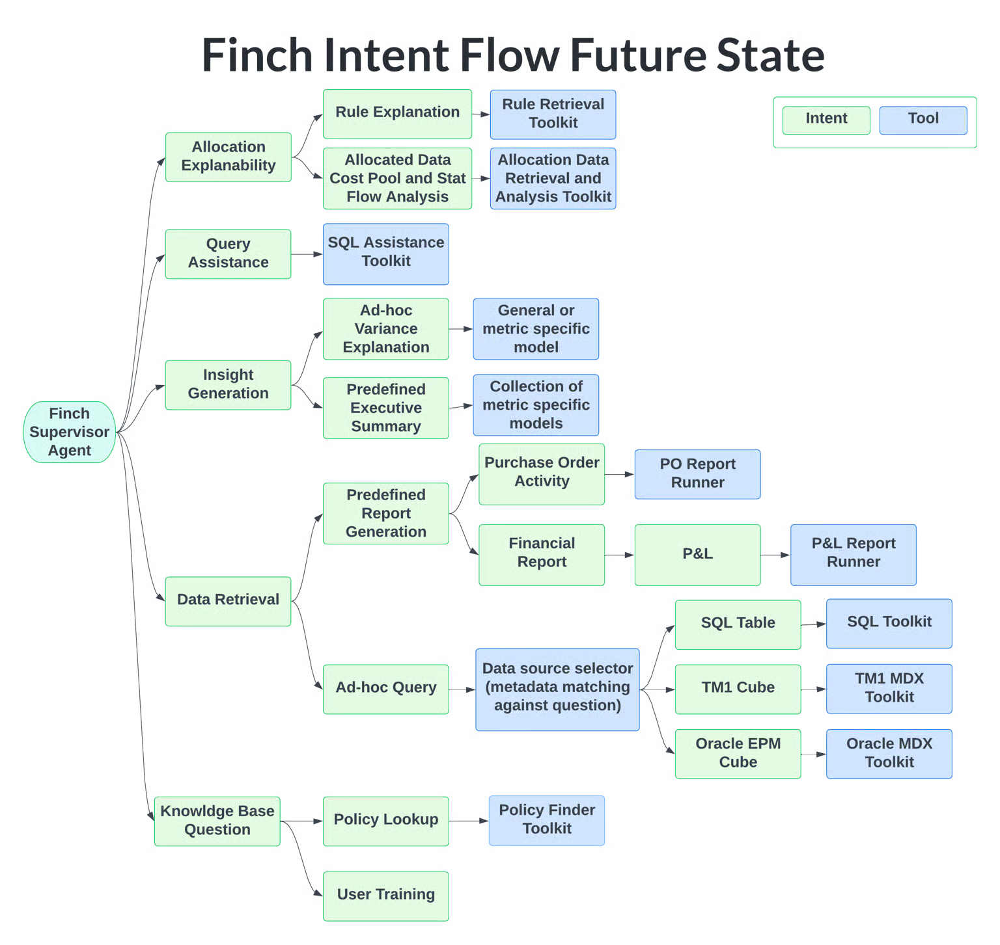

# 解读 Uber Finch：为金融团队打造的对话式 AI 数据智能体

> 本文是对 Uber 工程博客文章 [《Unlocking Financial Insights with Finch: Uber’s Conversational AI Data Agent》](https://www.uber.com/en-IN/blog/unlocking-financial-insights-with-finch/) 的核心内容解读与分析。

## 一句话总结 (TL;DR)

Finch 是 Uber 打造的一款集成在 Slack 中的对话式 AI 智能体，它将金融分析师的自然语言查询，转化为精确、安全的实时数据检索。Finch 的核心是**将大型语言模型（LLM）的推理能力与结构化数据的精确性相结合**，通过自查询代理（Self-Querying Agents）和设计的语义层，解决了企业内部复杂数据访问的“最后一公里”问题。

## 1. 问题背景：分析师 Taya 的一天

为了理解 Finch 解决的核心问题，让我们跟随 Uber 的一位金融分析师 Taya 的典型工作流程：

1.  **手动搜寻数据**：Taya 需要准备一份季度报告。她不确定最新的数据在哪个系统里，于是登录了 Presto、Oracle EPM 和 Google Docs，在多个平台之间来回切换，试图找到正确的数据源。
2.  **编写复杂 SQL**：即使 Taya 熟悉 SQL，面对复杂的业务逻辑和表结构，她也需要花费大量时间编写和调试查询，这个过程充满了挫败感且容易出错。
3.  **提交数据请求**：如果查询过于复杂或 Taya 缺乏权限，她只能向数据科学团队提交请求，然后是漫长的等待——有时是几小时，有时甚至几天。

当 Taya 最终完成报告时，宝贵的时间已经流逝，这可能影响关键业务决策的及时性。这个**高摩擦、高延迟**的数据访问流程，正是 Finch 试图解决的痛点。

## 2. 解决方案：Finch，Taya 的智能助手

Finch 作为一个集成在 Slack 中的 AI 助手，重塑了 Taya 的工作流。现在，她只需在 Slack 中像和同事对话一样提问。

**一个典型交互：**

*上图展示了 Taya 如何在 Slack 中与 Finch 进行一次完整的查询交互。*

1.  **Taya 提问**: “Show me the Q4 2024 GBs value.” (向我展示 2024 年 Q4 的总预订额)
2.  **Finch 回复**: (几秒钟后) 返回一个结构化的表格和摘要：“The Gross Bookings (GBs) value for Q4 2024 is approximately $44,197.28M USD.”
3.  **Taya 追问**: “Compare to Q4 2023.” (与 2023 年 Q4 对比)
4.  **Finch 再次回复**: Finch 理解上下文，自动生成新的查询，并返回带有同比趋势的分析结果，同时提供一键导出到 Google Sheets 的选项。

这个流畅的对话式体验背后，是 Finch 的核心能力在支撑。

### 核心能力：

- **自然语言到 SQL 的精准翻译**：用户提问“What were the Gross Bookings for US&C in Q4 2024?”，Finch 能自动生成并执行相应的 SQL 查询。
- **业务术语理解**：Finch 的语义层包含了 Uber 内部的业务术语库（如“US&C” -> “United States & Canada”，“GBs” -> “Gross Bookings”），使其能够理解分析师的“行话”。
- **自主数据源选择**：通过自查询代理，Finch 能根据问题内容，自主判断应该查询哪个数据集市（Data Mart），并调用相应的工具。
- **严格的权限控制**：集成了 Uber 的**基于角色的访问控制（RBAC）**系统，确保所有数据查询都在用户的权限范围内进行，保障了财务数据的安全。
- **无缝的工作流集成**：查询结果可以直接导出到 Google Sheets，方便分析师在熟悉的环境中进行二次加工和深度分析。

## 3. Finch 的定位：超越传统 BI 和 Text-to-SQL

与传统的商业智能（BI）工具或纯粹的 Text-to-SQL 方案相比，Finch 定位在一个新的交叉点上。

*图 1: Finch 与传统 BI 工具和纯 Text-to-SQL 工具的对比*

- **传统 BI 工具（如 Tableau）**：强于数据可视化，但对于即席查询（ad-hoc queries）和非标准化的问题，灵活性不足。
- **纯 Text-to-SQL 工具**：专注于语言到代码的翻译，但通常缺乏对业务上下文的深度理解和企业级的安全集成。

Finch 则试图结合两者的优点：既有对话式交互的灵活性，又通过其架构设计保证了查询的准确性和安全性。

## 4. 技术架构深度解析：Finch 如何做到“智能”？

Finch 的架构并非简单的“LLM + 数据库”，其背后是一套旨在平衡灵活性与准确性的系统。

*图 2: Finch 系统集成展示了其如何连接不同的数据源和内部系统*

### 3.1. 领域数据集市（Data Marts）：化繁为简

与直接让 LLM 对抗庞大、复杂的数据仓库不同，Finch 团队采取了**化繁为简**的策略。他们为特定的业务领域（如财务、运营指标）构建了一系列优化的、单表的**数据集市**。

- **为什么是单表？** 多表连接（JOIN）是 LLM 生成 SQL 时最容易出错的环节之一。单表设计大大降低了查询的复杂度，提高了 LLM 生成正确 SQL 的概率。
- **优点**：查询速度更快，错误反馈更直接，使得 Finch 的自我修正能力（Self-Correction）更有效。

### 3.2. 语义层与自查询代理：让 AI “理解”数据

这是 Finch 最具创新性的部分。Finch 没有采用传统的 Text-to-SQL 范式，即直接将自然语言翻译成 SQL，而是引入了**自查询代理（Self-Querying Agents）**。

*图 3: Finch 数据智能体的工作流，展示了从用户提问到返回结果的全过程*

1. **意图识别**：首先，一个**监督代理（Supervisory Agent）**会判断用户的意图，决定将任务路由给哪个专门的子代理（如 SQL 查询代理、图表生成代理等）。
2. **元数据检索 (RAG)**：SQL 查询代理会从 **OpenSearch** 索引中检索相关的元数据。这个索引不仅包含表结构（表名、列名），还包含了**列值的自然语言别名**（例如，`country_code` 列的值 `US` 对应别名 “USA”, “United States”）。
3. **上下文增强的 Prompt**：检索到的元数据会与用户的原始问题一起，构成一个信息丰富的 Prompt，发送给 LLM。
4. **SQL 生成与执行**：LLM 在这个“开卷考试”中，更容易生成正确的 SQL。Finch 会执行该 SQL，并返回结果。

### 3.3. 核心技术栈

- **LLM 网关**: Uber 内部的统一入口，可以灵活切换不同的 LLM（自研或第三方），方便进行模型评估和成本控制。
- **Agent 编排**: `LangChain LangGraph™` 用于构建和协调多智能体的工作流，处理复杂的任务逻辑。
- **元数据索引**: `OpenSearch™` 提供了强大的文本搜索能力，是实现高质量 RAG 的关键。
- **Slack 集成**: `Slack SDK` 提供了丰富的 UI 组件，使 Finch 的交互体验远超简单的聊天机器人。

## 4. 挑战与保障：Finch 如何确保可靠性？

将生成式 AI 应用于严肃的金融场景，可靠性是首要前提。Finch 团队通过一套严格的评估和优化体系来保障其性能。

### 4.1. 持续评估与基准测试

- **智能体准确性评估**: 每个子智能体（如 SQL 生成器）都会独立评估。系统会将 AI 生成的 SQL 查询结果与预先定义的“黄金查询 (golden query)”结果进行比对，确保输出的数字绝对正确。
- **监督代理路由准确性**: 这一测试旨在解决“意图冲突 (intent collisions)”。例如，当一个模糊的问题可能适用于多个工具时，系统需要确保监督代理能做出正确的路由选择。
- **端到端验证与回归测试**: 团队会用模拟的真实查询来验证整个系统的可靠性。同时，在每次更新（无论是模型还是 Prompt）前，都会重跑历史查询，以捕捉任何可能导致性能下降的“准确性漂移 (accuracy drifts)”。

### 4.2. 性能优化

- **并行执行**: Finch 的多个子智能体可以同时执行任务，缩短了总体的响应时间。
- **查询优化与预取**: Finch 会优化生成的 SQL 以降低数据库负载，并预先获取一些常用指标来提升性能。

### 4.3. 安全与合规

- **深度集成 RBAC**: Finch 与 Uber 的角色权限系统深度绑定，确保所有查询都在用户授权的数据范围内。
- **内部环境运行**: 整个服务在 Uber 的技术生态内运行，数据不会离开安全边界。

## 5. 未来规划：成为更强大的决策支持工具

Finch 的未来规划聚焦于扩展其能力，使其从一个数据查询工具，演变为一个更全面的决策支持平台。

*图 4: Finch 的未来规划*

- **更广泛的系统集成**：连接更多 FinTech 系统，实现从数据查询到财务报告、预测分析的端到端自动化。
- **“人在环路”的务实方案**：为高管（如 CEO 和 CFO）提供一个“请求验证 (Request validation)”按钮。当他们对查询结果的准确性有极高要求时，可以一键将问题和 Finch 的答案发送给领域专家进行核实。这个设计务实地结合了 AI 的效率与人类的严谨。
- **支持更多用户意图**: 构建更多的智能体和工具集，使 Finch 覆盖更多金融工作流。

## 6. 总结与启示

Finch 是企业级 AI 应用落地的一个典范。它的成功提供了几个关键启示：

1. **好的 AI 应用始于对业务痛点的深刻理解**：Finch 解决了金融分析师最核心的效率瓶颈。
2. **约束比开放更重要**：通过数据集市和语义层等方式，为 LLM 提供一个“小而美”的、结构化的环境，是保证准确性的关键。
3. **系统工程与 AI 同样重要**：一个成功的 AI 产品，离不开强大的工程能力，包括安全、权限、工作流集成等。
4. **Agentic 模式是企业 AI 的未来**：通过多智能体协作，可以处理更复杂的、多步骤的企业级任务。

Finch 的实践证明，通过系统设计，我们可以在现有技术条件下，构建出能解决实际问题、创造商业价值的 AI 智能体。

值得一提的是，构建 Finch 是一个跨职能团队的努力，其作者团队包括了数据分析、AI、工程和产品等多个领域的专家，这本身就揭示了成功企业 AI 应用的关键：技术与业务的深度融合。
