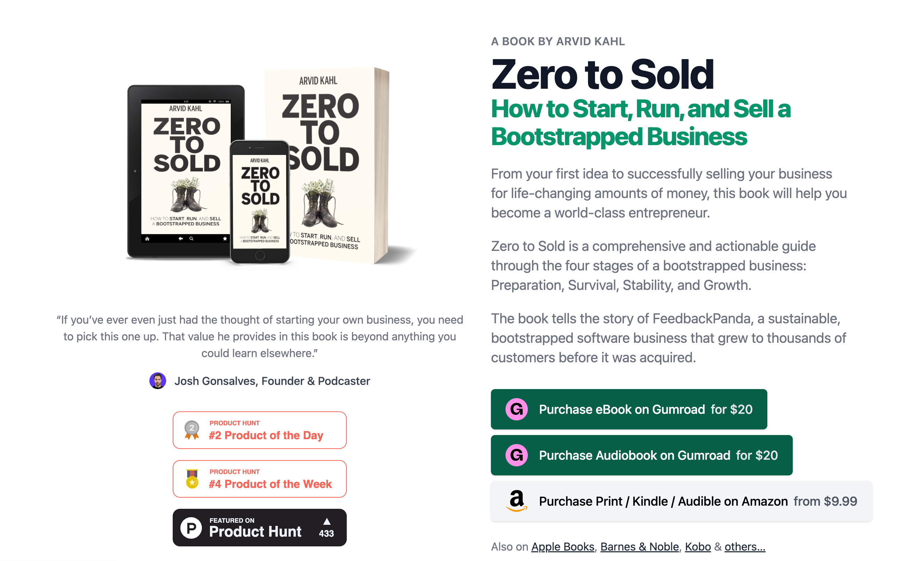

# 《从零到售》：一本独立开发者必读的创业圣经

> **一句话总结 (TL;DR)**
>
> 本文是对 Arvid Kahl 的著作《Zero to Sold》的核心思想解读。这本书为独立开发者和白手起家的创业者提供了一套完整的、从“服务听众”而非“寻找点子”出发的创业方法论，涵盖了从寻找问题、构建产品、实现盈利到最终成功出售公司的全过程。

对于每一个怀揣着产品梦想的技术人来说，如何将一个想法变成一家能够持续盈利、甚至最终成功出售的公司，是一条充满未知和挑战的道路。Arvid Kahl 的著作 **《Zero to Sold: How to Start, Run, and Sell a Bootstrapped Business》**（中文可译为《从零到售：如何启动、运营和销售一家白手起家的公司》）正是这样一本为你照亮前路的实战手册。

这本书不是空泛的理论说教，而是作者 Arvid Kahl 结合自己成功创建并出售 SaaS 公司 FeedbackPanda 的亲身经历，总结出的一套完整、可执行的方法论。它详细拆解了一家“白手起家”（Bootstrapped）的公司从 0 到 1，再到稳定增长，直至最终成功退出的全过程。

读完这本书，我深受启发，在此将其核心思想提炼出来，希望能为同在路上的你提供价值。

---

## 核心理念：颠覆传统，从“听众”出发

与许多创业者“我有一个绝妙的点子，然后去找用户”的思维模式完全相反，Arvid Kahl 提出的核心理念是 **“听众优先”（Audience First）**。他认为，一个成功的、可持续的生意，其正确的顺序应该是：

**听众 (Audience) -> 问题 (Problem) -> 解决方案 (Solution) -> 产品 (Product)**

1.  **找到你的听众 (Find Your Audience)**：首先要确定你想为**谁**服务。这里的关键是找到一个“利基市场”（Niche Market）。一个好的利基市场足够小，让你能够避开巨头竞争，轻松成为专家；又足够大，能够支撑你的业务发展。这个群体拥有相似的痛点、语言和文化，你的营销可以非常精准。
2.  **发现他们的关键问题 (Find Their Critical Problem)**：深入你的听众群体，去倾听、去观察，而不是去推销。找到那个让他们“最痛苦”、最“浪费时间或金钱”、并且“无法忽视”的**关键问题**。一个真正关键的问题，用户通常已经在使用一些“临时凑合”的办法来解决了（比如用 Excel、便利贴）。
3.  **验证你的解决方案 (Validate Your Solution)**：针对这个问题，构思一个解决方案。注意，解决方案不等于产品。它是一个概念，一个工作流。你需要再次与你的听众沟通，验证这个方案是否真的能解决他们的问题，是否能无缝融入他们现有的工作流，而不是带来新的麻烦。
4.  **构建你的产品 (Build Your Product)**：直到以上三步都得到充分验证后，才开始动手构建你的“最小可行产品”（MVP）。此时的产品目标非常明确：**用最核心的功能，完美地解决那个已经验证过的关键问题**。

这种模式极大地降低了创业风险。你不是在黑暗中摸索，而是每一步都基于真实的市场反馈。

---

## 必经之路：白手起家公司的四个阶段

Arvid Kahl 将一家公司的生命周期划分为四个清晰的阶段，每个阶段都有其独特的挑战和目标。

### 1. 准备阶段 (The Preparation Stage)

-   **目标**：将一个想法变成一个可以销售的产品。
-   **核心任务**：严格遵循“听众优先”的原则，完成听众、问题、方案和产品的验证。这个阶段的收入是零，甚至为负，投入的主要是你的时间和精力。
-   **关键产出**：一个解决了核心痛点、并且有人愿意付费的 MVP。

### 2. 生存阶段 (The Survival Stage)

-   **目标**：找到一种可重复的盈利模式，让业务“活下去”。
-   **核心任务**：
    *   **创始人心理健康 (Mental Health)**：作者花了大量篇幅强调，创始人的心理健康**不是可选项**。你将面临巨大的压力、焦虑和“冒名顶替综合症”。学会管理自己的精力和情绪，是公司能活下去的前提。
    *   **产品演进 (Product Evolution)**：在约束下进行产品迭代。学会对功能请求说“不”，聚焦于为大多数用户提供最大价值的“热门路径”（Hot Paths）。
    *   **客户关系 (Customer Relationships)**：与早期客户建立深厚的关系。他们不仅是你的收入来源，更是你产品改进的灵感和口碑营销的主力军。
    *   **定价策略 (Pricing)**：价格是价值的体现。不要因为是早期产品就定价过低。提供年度订阅选项，这既能锁定客户，也能为你提供宝贵的现金流。

### 3. 稳定阶段 (The Stability Stage)

-   **目标**：优化流程，实现规模化，构建一个成熟的业务。
-   **核心任务**：
    *   **建立可销售的业务 (Building a Sellable Business)**：这是本书的另一个核心思想——**从第一天起，就按照“可出售”的标准来构建你的公司**。这意味着你需要：
        *   **创建标准操作程序 (SOPs)**：将所有重复性工作（客户支持、发布流程等）文档化、流程化。这让你可以轻松地将工作委派出去，也让公司不再依赖于你个人。
        *   **自动化 (Automation)**：尽可能地自动化所有能自动化的流程，打造一台“润滑良好的机器”。
    *   **打造品牌 (Building a Brand)**：你需要的不仅仅是客户，而是一个“部落”（Tribe）。成为你所在领域的思想领袖，通过提供价值（写博客、做播客、组织社群）来吸引追随者。你的品牌声音需要统一、持续。
    *   **建立团队 (Building a Team)**：当你达到个人能力的极限时，就需要雇佣员工。将那些你最讨厌或最不擅长的工作外包出去，解放你的时间和精力，去做更具创造性的工作。

### 4. 增长/退出阶段 (The Growth Stage)

-   **目标**：决定公司的未来——继续增长还是出售退出。
-   **核心任务**：
    *   **出售公司 (Selling Your Company)**：如果你决定出售，之前建立的“可销售的业务”结构将发挥巨大作用。详尽的文档、清晰的财务、自动化的流程，都会让你的公司在买家眼中价值倍增。书中详细介绍了尽职调查、收购类型（财务收购 vs. 战略收购）、以及创始人出售后的生活等。
    *   **保留公司 (Keeping Your Company)**：你也可以选择继续运营，享受作为公司所有者带来的红利。此时，你可能已经将自己从日常运营中解放出来，专注于公司的战略方向。

---

## 总结：不仅仅是创业，更是一种思维方式

《Zero to Sold》这本书远不止是一本创业指南，它更倡导了一种健康、可持续的商业思维方式。

*   **价值驱动**：始终将为客户创造真实、可衡量的价值放在首位。
*   **小而精**：拥抱利基市场，做小而美的专家，而不是大而全的杂家。
*   **系统化思维**：忘记短期目标，专注于创建能够长期、稳定产出价值的系统。
*   **创始人即人**：承认并正视创业过程中的心理挑战，把个人健康放在业务增长同等重要的位置。

无论你是一名准备启动自己项目的独立开发者，还是一位正在泥潭中挣扎的初创公司创始人，这本书都将为你提供宝贵的路线图和强大的精神支持。它告诉你，你不必成为下一个硅谷独角兽，通过智慧、自律和同理心，你完全可以建立一家属于自己的、既能带来财务自由又能实现个人价值的成功企业。

## 参考文献

Kahl, A. (2020). *Zero to Sold: How to Start, Run, and Sell a Bootstrapped Business*. A. Kahl.
> -   **书名**: *Zero to Sold: How to Start, Run, and Sell a Bootstrapped Business*
> -   **作者**: Arvid Kahl
> -   **官方网站**: https://thebootstrappedfounder.com/zero-to-sold/
> -   **网盘链接**: 
> 我用夸克网盘分享了「Zero to Sold How to Start, Run, and Sell a Bootstrapped Business (Arvid Kahl).pdf」，点击链接即可保存。打开「夸克APP」在线查看，支持多种文档格式转换。
链接：https://pan.quark.cn/s/9a6d8ef88108