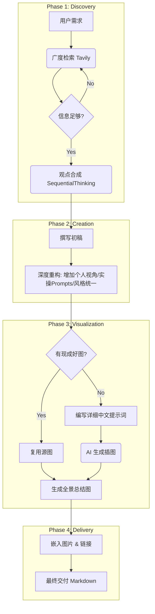

# 通用深度内容创作工作流 (Content Creation Workflow Template)

本文档总结了一套通用的深度内容创作流程，适用于从零开始进行行业研究、观点提炼、内容撰写到视觉化呈现的全过程。该流程旨在帮助创作者高效产出具有深度、启发性和视觉冲击力的高质量内容。

## Phase 1: 探索与定义 (Discovery & Synthesis)
**核心目标：** 确定选题方向，通过广度与深度的信息搜集，提炼出独特的洞察或观点。

1.  **意图识别 (Intent Definition)**
    *   明确核心问题：我们要解决什么问题？读者是谁？
    *   *Example:* "如何理解 a16z 2025 年关于 AI 护城河的最新观点？"

2.  **广度检索 (Broad Search)**
    *   使用搜索引擎覆盖关键词，获取全网最新动态。
    *   关注权威来源：官方博客、合伙人推文、顶级媒体报道。
    *   *Action:* `tavily-search` (query="topic + year + key person")

3.  **深度挖掘 (Deep Dive)**
    *   针对高价值线索进行二次检索。
    *   寻找差异化信息：播客访谈、行业报告细节、数据图表。
    *   **Firecrawl 爬取 (Advanced Scraping):** 对于深度长文或难以直接解析的网页，使用 `firecrawl` 工具进行全文爬取，提取纯净的 Markdown 内容进行深入分析。

4.  **观点合成 (Synthesis)**
    *   利用逻辑思维工具将碎片化信息重组。
    *   寻找范式转移的证据：对比“过去”与“现在”的观点差异。
    *   *Action:* `sequentialthinking` (梳理逻辑链条)

## Phase 2: 内容构建与重构 (Content Creation & Refinement)
**核心目标：** 将洞察转化为结构化、有深度的文章，并注入个人启发。

1.  **骨架搭建 (Structuring)**
    *   确立文章结构：引言（冲突/背景）-> 核心论点（3-4个维度）-> 个人/行业启发 -> 结语。

2.  **深度撰写 (Drafting)**
    *   **商业/宏观视角：** 阐述行业趋势、数据支持、底层逻辑。
    *   **个人/微观视角：** 增加对读者的直接启发，将宏观趋势转化为微观行动建议。
    *   *关键点:* 避免枯燥的报告堆砌，使用生动的比喻（如“软件吃掉劳动力”）。

3.  **实操落地 (Actionable Takeaways)**
    *   在文章末尾增加可执行的工具包。
    *   *Example:* “AI 实操提示词”、“能力自测表”、“行动清单”。

## Phase 3: 视觉化增强 (Visual Enhancement)
**核心目标：** 利用 AI 绘图将抽象概念具象化，提升阅读体验和传播力。

1.  **视觉概念设计 (Visual Conceptualization)**
    *   为每个核心章节设计视觉隐喻。
    *   *Example:* “护城河” -> 立体的城堡防御体系；“赋能” -> 骑虎难下/驾驭猛兽。

2.  **图像策略 (Image Strategy)**
    *   **复用 (Reuse):** 优先检查源文章中是否有高质量图表或插图。如果有，直接下载并引用，保持信息原真性。
    *   **生成 (Generate):** 仅当源图不足或需要抽象概念具象化时，使用 AI 生成。
    *   **Prompt 技巧:**
        *   支持中文提示词（模型通常能很好理解）。
        *   描述越详细越好：包含主体、风格、光影、构图、颜色和隐喻（如“巨大的齿轮代表工业化”）。
        *   风格统一：确保所有配图使用一致的视觉语言（如 Isometric 3D 或 Cyberpunk）。
    *   **Action:** 执行本地脚本生成图片。
        *   **方式 A (直接传参):** 适用于中短提示词。
            ```bash
            python3 /Users/bytedance/.claude/skills/gemini-image-gen/scripts/generate_image.py --prompt "YOUR_DETAILED_PROMPT_HERE" --output path/to/image.png
            ```
        *   **方式 B (Prompt File - 推荐):** 适用于超长、细节极度丰富的提示词。将提示词保存为 txt 文件，避免命令行参数转义问题。
            ```bash
            python3 /Users/bytedance/.claude/skills/gemini-image-gen/scripts/generate_image.py --prompt_file path/to/prompt.txt --output path/to/image.png
            ```

3.  **全景总结图 (Panoramic Summary)**
    *   设计一张 16:9 的宽幅总结图，囊括文章所有核心要素。
    *   这张图应能独立作为文章的“社交媒体封面”。

## Phase 4: 迭代与交付 (Iteration & Delivery)
**核心目标：** 根据反馈进行微调，确保最终交付物完美。

1.  **个人风格化 (Personalization)**
    *   **一致性检查:** 确保文章语调（Tone）、排版格式（Formatting）和视觉风格（Visual Style）符合个人长期建立的品牌形象。
    *   *Checklist:*
        *   是否使用了我习惯的标题层级？
        *   是否包含了我标志性的“个人启发”或“实操建议”模块？
        *   配图风格是否与我的过往文章保持一致？

2.  **自我审视 (Self-Review)**
    *   检查链接是否有效？图片是否清晰？观点是否自洽？
    *   文章是否真的对读者“有帮助”？

3.  **最终交付 (Final Delivery)**
    *   输出完整的 Markdown 文档，嵌入所有图片和引用。
    *   提供一段 100 字以内的“极简摘要”，便于快速传播。

---

**工作流图示 (Visual Workflow):**



---

## 附录：个人风格与视觉规范 (Personal Style Guide)

为了确保每次输出都能直接交付并具有高度的品牌一致性，请严格遵循以下规范。

### 1. 写作风格 (Writing Style)
*   **语调 (Tone):**
    *   **深度且犀利：** 避免平铺直叙的报道，必须有观点（Opinionated）。
    *   **启发性 (Inspirational):** 始终关注“这对读者意味着什么？”，从宏观趋势落脚到微观行动。
    *   **专业但不枯燥：** 使用生动的比喻（如“软件吃掉世界”、“骑上AI之虎”），避免过度学术化。
*   **结构 (Structure):**
    *   **倒金字塔：** 开篇即结论，随后展开。
    *   **模块化：** 必须包含 **“商业/行业洞察”** 和 **“个人/职业启发”** 两个独立模块。
    *   **实操性：** 文章末尾必须包含 **“可执行的工具包”**（如 Prompts, Checklist, Framework）。
*   **格式 (Formatting):**
    *   大量使用 **加粗** 强调核心观点。
    *   使用列表（List）拆解复杂逻辑。
    *   引用权威来源时使用标准 Markdown 链接。

### 2. 视觉风格 (Visual Style)
在生成或选择配图时，必须统一遵循以下视觉语言：

*   **核心关键词 (Keywords):**
    *   `Cinematic` (电影感)
    *   `Tech-noir` / `Futuristic` (未来科技/黑色科技)
    *   `High Contrast` (高对比度)
    *   `Isometric 3D` (等距立体，用于图解)
    *   `Minimalist Infographic` (极简信息图，用于概念)
*   **色彩体系 (Color Palette):**
    *   主色调：**深蓝 (Deep Blue)** 与 **黑 (Black)**。
    *   提亮色：**电光蓝 (Electric Blue)**、**霓虹橙 (Neon Orange)** 或 **金色 (Gold)**。
    *   *禁止：* 避免使用低饱和度的莫兰迪色系或过于卡通化的扁平风格。
*   **构图 (Composition):**
    *   **宏大叙事：** 展现物体或概念的规模感（Scale），如巨大的机器、复杂的网络。
    *   **隐喻化：** 将抽象概念具象化（例如：用“堡垒”代表护城河，用“洪流”代表数据）。
*   **Prompt 模板示例:**
    > "A cinematic, high-tech conceptual art showing [主体: e.g., a giant digital brain connected to a city]. The style is [风格: futuristic, tech-noir, highly detailed]. Lighting is [光影: dramatic, blue and orange contrast]. 16:9 aspect ratio, 4k resolution."