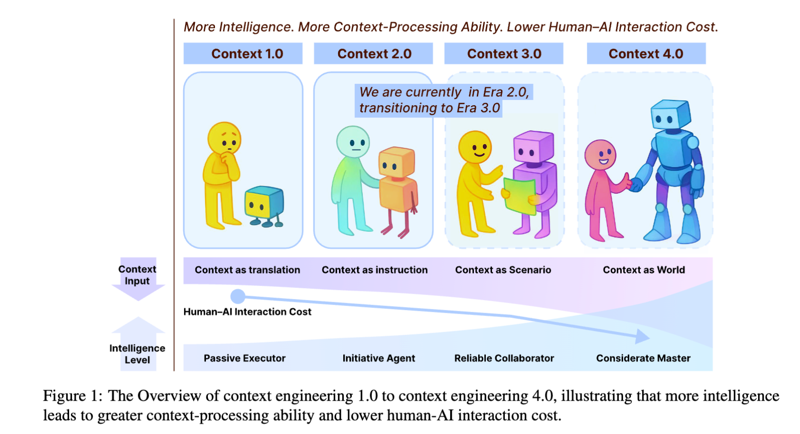
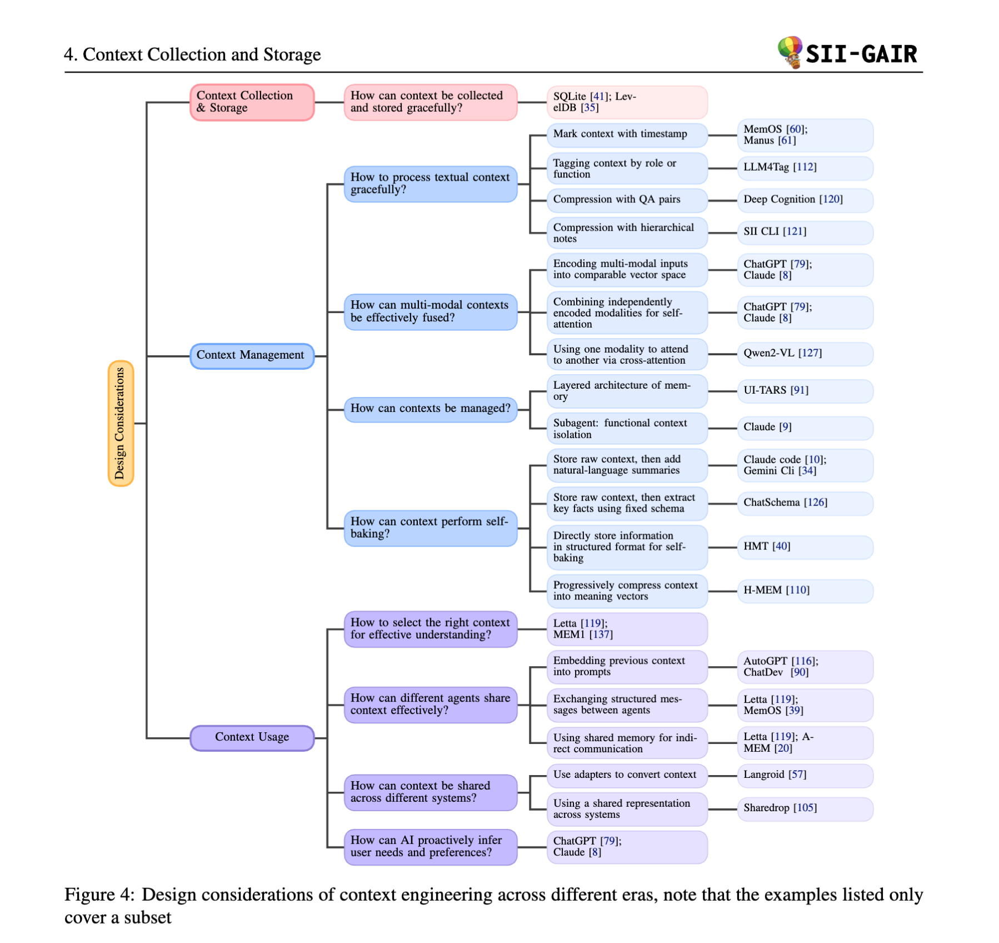
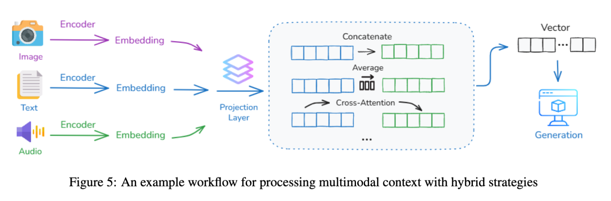
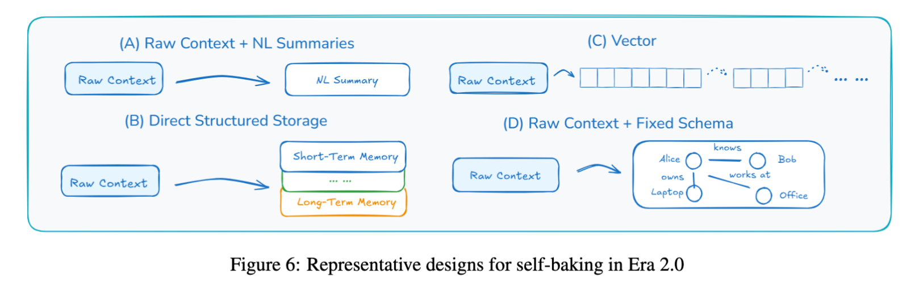
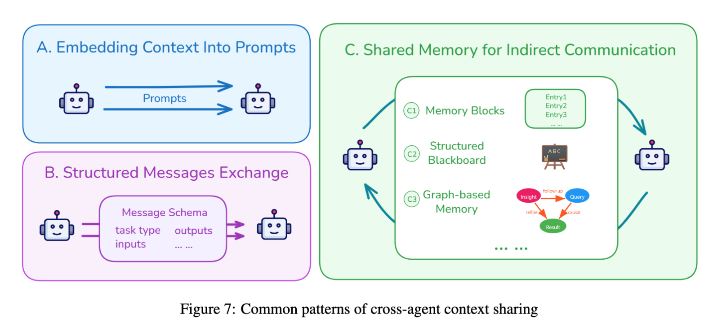

# 技术博客：解读《上下文工程 2.0》，AI 交互的过去、现在与未来

最近，一篇名为《上下文工程 2.0：上下文工程的上下文》（Context Engineering 2.0: The Context of Context Engineering）的论文为我们系统性地梳理了 AI 领域一个至关重要但又常被误解的概念——**上下文工程 (Context Engineering)**。

很多人认为“上下文工程”是随着大语言模型（LLM）和智能体（Agent）的兴起才出现的新鲜事物，但这篇论文告诉我们，它的历史可以追溯到 20 多年前。今天，我们就来深入解读这篇论文，看看它如何为我们描绘一幅关于人机交互演进的宏大蓝图。

> 💡 **论文原文**：本文是对《Context Engineering 2.0》的解读，推荐感兴趣的读者阅读原论文以获取更全面的信息：[https://arxiv.org/pdf/2510.26493](https://arxiv.org/pdf/2510.26493)

## 核心论点：上下文工程远不止是“提示工程”

论文开篇就提出了一个颠覆性的观点：**上下文工程并非新生事物，而是伴随机器智能水平发展而不断演进的学科。**

它的核心挑战始终是——如何弥合人类意图与机器理解之间的鸿沟？

作者将上下文工程定义为一个系统性过程，涵盖了**上下文的收集、存储、管理和使用**，其本质是一个**“熵减”**的过程。人类的意图是高熵的、模糊的，而机器只能处理低熵的、结构化的信息。上下文工程要做的，就是将前者高效地转化为后者。

*(图片概念图：展示从1.0到4.0时代，机器智能提升，人机交互成本降低)*

## 上下文工程的四个时代：一部人机交互的演化史

论文将上下文工程划分为四个标志性的时代，每个时代都与机器的智能水平紧密相连：

### **时代 1.0：原始计算时代 (1990s - 2020)**
- **特征**: 机器能力有限，只能处理结构化输入。
- **人机关系**: 人类需要扮演“翻译官”，将复杂的意图分解成机器能懂的命令（如图形界面点击、简单的传感器数据）。
- **核心技术**: 普适计算（Ubiquitous Computing）、上下文感知系统（Context-Aware Systems）。
- **本质**: **上下文即翻译 (Context as Translation)**。人类努力去适应机器。

### **时代 2.0：智能体时代 (2020 - 至今)**
- **特征**: 以 LLM 为代表，机器开始理解自然语言，能处理一定的模糊性。
- **人机关系**: 人机协作成为可能，对话式交互成为主流。
- **核心技术**: 提示工程 (Prompting)、检索增强生成 (RAG)、思维链 (CoT)、记忆机制。
- **本质**: **上下文即指令 (Context as Instruction)**。我们正处于这个时代，并向 3.0 过渡。

### **时代 3.0：类人智能时代 (未来)**
- **特征**: AI 达到人类水平的推理和感知能力。
- **人机关系**: AI 成为真正的协作者，能像人类一样理解社交、情感等高维上下文。
- **本质**: **上下文即场景 (Context as Scenario)**。实现真正自然的“人机协同”。

### **时代 4.0：超人智能时代 (畅想)**
- **特征**: AI 超越人类认知，拥有“上帝视角”。
- **人机关系**: 关系反转。AI 不再被动适应人类，而是主动为人类构建新上下文，揭示我们自己都未曾察觉的需求。
- **本质**: **上下文即世界 (Context as World)**。

## 上下文工程的设计核心：三大支柱

论文为我们系统地拆解了上下文工程的实践，主要围绕以下三个维度展开：

### 1. 上下文收集与存储 (Context Collection & Storage)

- **演变**: 从 1.0 时代依赖 GPS、时钟等有限传感器的**本地存储**，演变为 2.0 时代整合智能手机、可穿戴设备、云服务的**分布式、多模态收集**与**分层存储**。
- **关键实践**:
    - **分层架构**: 效仿操作系统，将上下文分为类似“RAM”的短期记忆和类似“硬盘”的长期记忆。例如，Claude Code 会定期将关键信息写入外部笔记，以防在长任务中丢失上下文。
    - **数据库支持**: 使用 SQLite、LevelDB 等本地数据库来持久化存储中长期上下文。

### 2. 上下文管理 (Context Management)

这是论文的重点，探讨了如何高效处理海量、异构的上下文信息。

- **文本处理**:
    - **时间戳**: 简单但语义信息不足。
    - **功能/语义标签**: 为上下文打上“目标”、“决策”等标签，增强可解释性。
    - **层级笔记**: 将信息组织成树状结构，清晰但缺乏逻辑关联。
- **多模态处理**:
    - 将文本、图像、音频等不同模态的信息映射到**统一的向量空间**，实现语义对齐。

- **组织与抽象**:
    - **上下文隔离**: 通过**子智能体 (Sub-agent)** 机制，让每个专门的 AI 助手拥有独立的上下文，避免“上下文污染”。
    - **上下文“自烘焙” (Self-baking)**: 这是迈向真正学习的关键。智能体不仅仅是存储原始信息，更是主动地将其**摘要、提炼、结构化**，形成持久化的知识。

### 3. 上下文使用 (Context Usage)

- **智能体间共享**:
    - **提示词嵌入**: 将前一个智能体的输出直接塞进后一个的提示词里。
    - **结构化消息**: 智能体之间通过预定义格式（如 JSON）通信。
    - **共享记忆**: 所有智能体读写一个公共的“黑板”或知识图谱，实现异步协作。
- **跨系统共享**:
    - 例如，让 Cursor 和 ChatGPT 共享上下文。可以通过**适配器 (Adapter)** 或**统一表示**（如 MCP 协议）来实现。
- **主动式推理**:
    - 这是从“工具”到“助手”的飞跃。AI 不仅是被动响应，更能通过分析用户行为，**主动推断其潜在需求**，并在用户陷入困境时提供帮助。

## 未来的挑战与展望

尽管上下文工程已取得巨大进步，但前方依然挑战重重：
1.  **收集瓶颈**: 如何从物理世界和人类的内部认知状态（如情绪、注意力）中更自然、高效地收集上下文？
2.  **长上下文难题**: Transformer 架构的 O(n²) 复杂度使其难以处理超长上下文，我们需要新的模型架构。
3.  **筛选难题**: “大海捞针”问题，如何在海量信息中精准筛选出当下最相关的上下文？
4.  **“数字永生”**: 论文提出了一个深刻的哲学展望——当一个人的所有数字上下文被 AI 保存和学习，这是否构成了一种形式的“数字存在”？

## 结论

《上下文工程 2.0》不仅是一篇技术综述，更是一份关于 AI 发展的哲学思考。它告诉我们，要构建更智能的 AI，不能仅仅依赖模型本身的能力，更要精心设计它与世界交互的方式。

从“人适应机器”到“机器适应人”，再到最终的“人机共生”，上下文工程正是这条演进路径上的核心驱动力。理解了它，我们才能更好地驾驭未来的智能时代。
