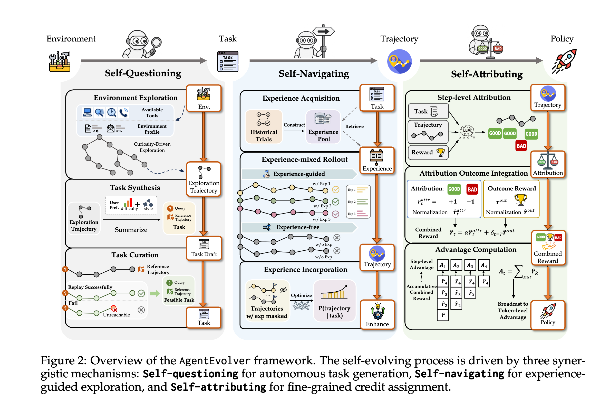
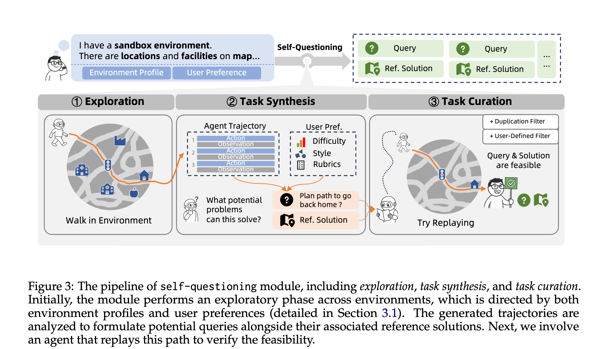
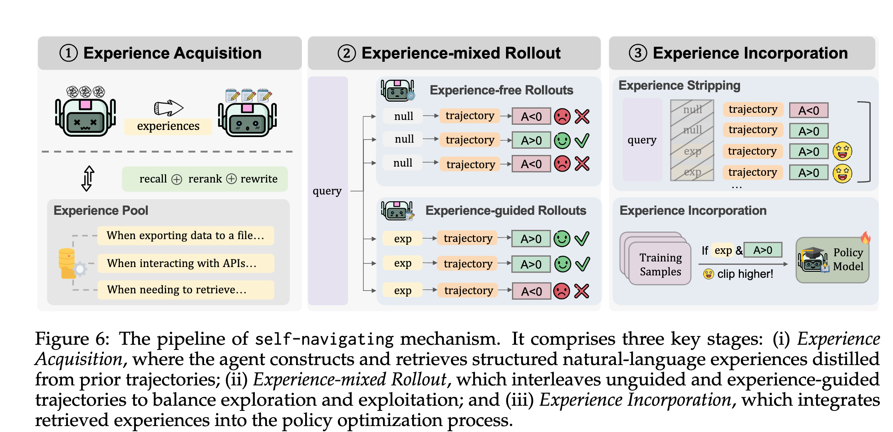
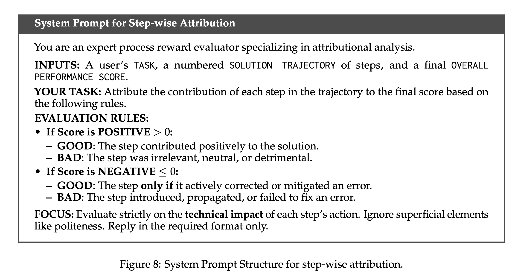
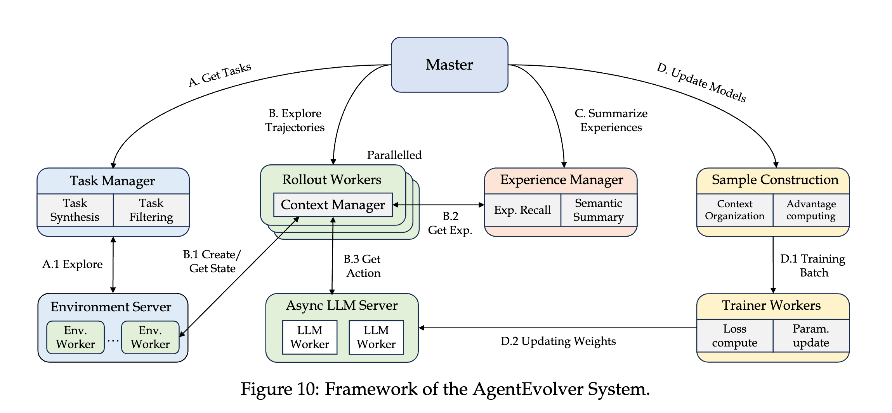

# AgentEvolver：让智能体实现高效自我进化

> 本文是对论文 AgentEvolver: Towards Efficient Self-Evolving Agent System的核心思想解读。
https://arxiv.org/abs/2511.10395  

## 一句话总结 (TL;DR)

AgentEvolver 是一套创新的智能体（Agent）自我进化框架。它通过**三大核心机制**——**自我提问**（自动生成任务）、**自我导航**（复用过往经验）和**自我归因**（精细化过程奖惩）——解决了传统强化学习（RL）训练成本高、效率低的核心痛点，让智能体能够低成本、高效率地自主学习和迭代。

## 核心价值与启发

AgentEvolver 不仅是一个新方法，更是一套可落地的工程实践与思想范式，为开发者和研究者带来四点核心启发：

1.  **自动化构建数据飞轮**：AgentEvolver 展示了如何让智能体自己创造高质量的训练数据。通过“自我提问”，系统能在未知环境中自主发现有价值的任务，形成“探索-数据-能力提升”的闭环，解决了冷启动时的数据困境。

2.  **将经验转化为可复用知识**：“自我导航”机制将智能体在任务中 fleeting 的交互经验，沉淀为结构化的自然语言“知识点”。这不仅提升了探索效率，也为构建可解释、可干预的智能体系统提供了新思路。开发者可以检查、编辑甚至注入这些经验，以引导智能体的行为。

3.  **实现超越终局的精细化反馈**：“自我归因”机制是 RL 训练的一大进步。它不再满足于“任务成功/失败”这种单一的最终反馈，而是利用 LLM 的推理能力对过程中的每一步进行复盘，实现了对行为的细粒度奖惩，极大提升了样本效率，让智能体学得更快。

4.  **从“炼丹”到“育种”的范式转变**：整个框架体现了从手动“炼丹式”调参到“育种式”自主进化的理念转变。开发者不再是训练的绝对主导，而是成为环境的创造者和过程的引导者，让智能体自我迭代和成长。

## 核心思想：AgentEvolver

当前基于 LLM 的自主智能体开发，面临两大瓶颈：
1.  **数据成本高**：需要投入大量人力构建高质量的训练数据集。
2.  **探索效率低**：传统强化学习（RL）依赖大量随机探索，样本利用率差。

AgentEvolver 的核心思想是 **让 LLM 自我驱动学习闭环**，通过三大协同工作的机制摆脱对人工流程的重度依赖。

*图 2: AgentEvolver 框架概览，展示了三大核心机制的协同工作流程。*

1.  **自我提问 (Self-Questioning)**：**目标是自动出题**。智能体自主探索环境，生成有价值的训练任务，摆脱对人工数据集的依赖。
2.  **自我导航 (Self-Navigating)**：**目标是高效解题**。通过系统化地复用和泛化过去的成败经验，构建经验池，指导后续探索，提升效率。
3.  **自我归因 (Self-Attributing)**：**目标是精细复盘**。利用 LLM 对任务过程进行复盘，精细化地评估每一步的贡献，将稀疏的最终奖励转化为稠密的过程反馈，提升学习效率。

## 关键技术细节

### 1. 自我提问 (Self-Questioning)

此机制负责将一个漫无目的的“沙盒环境”转化为有价值的训练任务集。

*图 3: “自我提问”机制流水线，包括环境探索、任务合成和任务筛选三个阶段。*

- **环境探索**：利用“环境配置文件”作为先验知识，通过高随机性的 LLM 进行探索，生成多样化的交互轨迹。
- **任务合成**：LLM 基于探索轨迹和用户偏好（如难度、风格），逆向生成任务“问题”及对应的“参考解法”。
- **任务筛选**：通过去重和实际回放“参考解法”来验证任务的可行性，剔除包含幻觉或不可执行的任务。
- **合成奖励**：利用一个强大的 LLM 作为“裁判”，参照“参考解法”评估智能体的任务完成质量，并给出最终分数。

### 2. 自我导航 (Self-Navigating)

此机制的核心是利用过往经验指导未来行动，避免重复犯错。

*图 6: “自我导航”机制流水线，包含经验获取、经验混合探索和经验内化三个关键阶段。*

- **经验获取**：从历史轨迹中提炼出结构化的自然语言“经验”（如“什么情况下该做什么”），存入可检索的“经验池”。
- **经验混合探索**：按一定比例混合“无引导探索”和“经验引导探索”。后者会将检索到的相关经验注入到模型提示中，辅助决策。
- **经验内化**：
    - **经验剥离**：在计算梯度前移除提示中的经验文本，迫使模型学习其内在逻辑，而非简单复制。
    - **选择性增强**：对由成功经验引导并取得好结果的轨迹，在优化时给予更强的激励，加速学习。

### 3. 自我归因 (Self-Attributing)

此机制旨在将“任务最终成败”这一稀疏奖励，转化为对每一步行为的稠密反馈。

- **步级贡献评估**：任务完成后，调用 LLM 对每一步进行复盘，判断其贡献是“好”还是“坏”。
- **构建复合奖励**：最终用于训练的奖励由两部分加权组成：
    1.  **归因奖励**（过程分）：将“好”/“坏”标签量化为 +1/-1，形成关注过程的稠密信号。
    2.  **结果奖励**（结果分）：任务最终的成功分数，形成关注结果的稀疏信号。
- **优势计算与优化**：结合两种奖励计算优势函数，并将其应用到对应步骤的所有令牌上，通过 GRPO 算法进行优化。

## 框架与基础设施

AgentEvolver 不仅是一套理论，也是一个可扩展、服务化的端到端系统。其设计核心是模块化和高效率。

*图 10: AgentEvolver 系统框架，展示了一个四阶段的闭环：任务合成、轨迹执行、经验总结和模型优化。*

1.  **分层执行架构**：系统采用三层架构（服务层、工作单元层、管理层）来解耦智能体逻辑与运行环境。环境（如 AppWorld）和 LLM 都作为独立服务运行，使得整个框架可以轻松支持不同类型的智能体（如 ReAct、Planner-Executor 等）。

2.  **上下文管理器 (Context Manager)**：为了高效处理长序列任务，框架引入了强大的上下文管理器。它通过**实时上下文时间线（LCT）**和**时间线快照记录器（TSR）**两大核心抽象，统一了多种交互模式。系统提供了四种即插即用的**上下文管理模板（CMT）**：
    - **基础因果模板**：最高效，适用于简单任务。
    - **推理增强模板**：支持“思考-行动”模式，提升决策质量。
    - **滑动窗口模板**：通过自动总结历史信息，支持超长序列任务。
    - **自管理模板**：让智能体学会自主决定保留、丢弃或压缩哪些历史信息，实现动态内存管理。

3.  **可扩展的环境服务**：框架提供了一个与 OpenAI Gym 兼容的环境服务，使用 Ray 来实现高并发和实例隔离。这使得大规模并行训练变得简单，并且可以轻松集成新的环境或工具。

## 实验结果与结论

论文在 **AppWorld** 和 **BFCL v3** 两个基准上对 AgentEvolver 进行了全面评估，实验结果验证了其有效性和各模块的关键价值。

### 整体性能

- **性能显著提升**：与传统的 GRPO 基线相比，完整的 AgentEvolver 系统在 7B 和 14B 模型上均取得大幅性能提升。例如，在 14B 模型上，平均任务成功率提升了 **27.8%**。这证明了整个自进化框架的协同效应。

### 模块价值验证 (Ablation Studies)

通过对每个模块进行消融实验，论文揭示了其不可或缺的贡献：

1.  **“自我提问”的价值**：
    - **合成数据媲美人工数据**：实验表明，仅使用“自我提问”生成的合成数据进行训练，其效果已接近于使用人工标注的原始数据。
    - **混合数据效果最佳**：将合成数据与原始数据混合训练时，模型性能超过了单独使用任何一种数据，证明合成数据有效补充了数据多样性，拓展了模型能力边界。

2.  **“自我导航”的价值**：
    - **经验内化优于直接利用**：通过训练将经验“内化”到模型参数中（隐式学习），其性能远超仅在提示中提供经验（显式 ICL）。这证明了让模型“学会”而非“照抄”的重要性。
    - **选择性增强机制至关重要**：实验证明，移除“选择性增强”机制会导致性能下降，说明对成功的经验给予更强的优化信号是加速学习的关键。

3.  **“自我归因”的价值**：
    - **过程与结果缺一不可**：消融实验证实，仅依赖最终结果奖励（w/o ˆrattr）或仅依赖过程归因奖励（w/o ˆrout）都会导致性能显著下降。只有将二者结合，才能实现最佳效果。
    - **显著提升样本效率**：通过提供细粒度的步级反馈，“自我归因”机制大幅提升了样本效率。达到同样性能水平，AgentEvolver 所需的训练步数远少于基线模型（在 AppWorld 上减少 55%，在 BFCL v3 上减少 67%）。

综上所述，三大核心机制相辅相成，共同构成了 AgentEvolver 高效、自主的学习闭环。

---

## 潜在问题与局限

尽管 AgentEvolver 潜力巨大，但在实践中仍面临挑战：

1.  **依赖更强的LLM**：整个框架的有效性高度依赖作为“裁判”和“引导者”的 LLM。如果核心 LLM 的推理能力不足或存在偏见，可能导致进化过程偏离轨道。

2.  **探索与利用的平衡**：“自我导航”尝试平衡随机探索和经验引导，但如何动态调整二者的比例仍是一个棘手的超参数问题。过度依赖经验可能导致智能体陷入局部最优。

3.  **计算成本**：虽然框架旨在降低人工成本，但其计算成本不可忽视。频繁调用强大的 LLM 进行任务生成和归因分析，本身就是一笔不小的开销。

4.  **环境复杂性的挑战**：目前该框架在 API 调用等结构化环境中效果显著，但在需要复杂物理交互或多模态感知的真实世界场景中，其有效性仍有待验证。。

---

## 参考文献

- https://arxiv.org/pdf/2511.10395