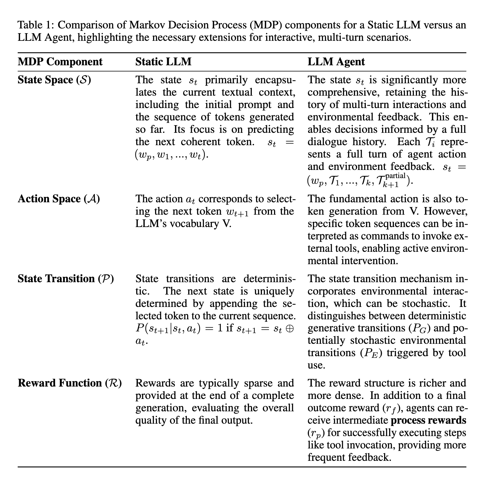
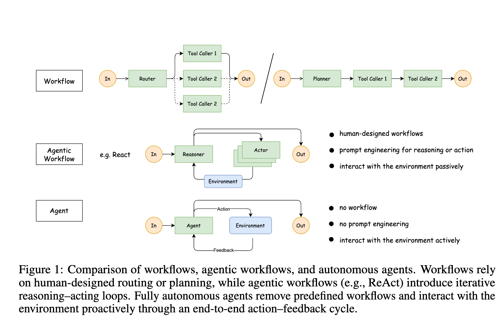
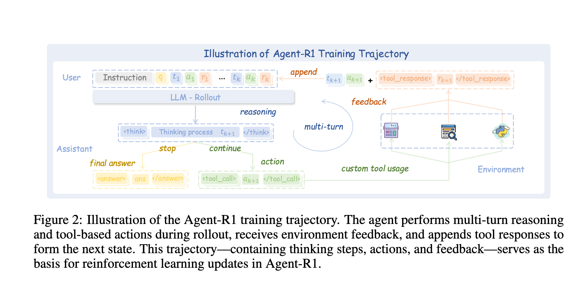
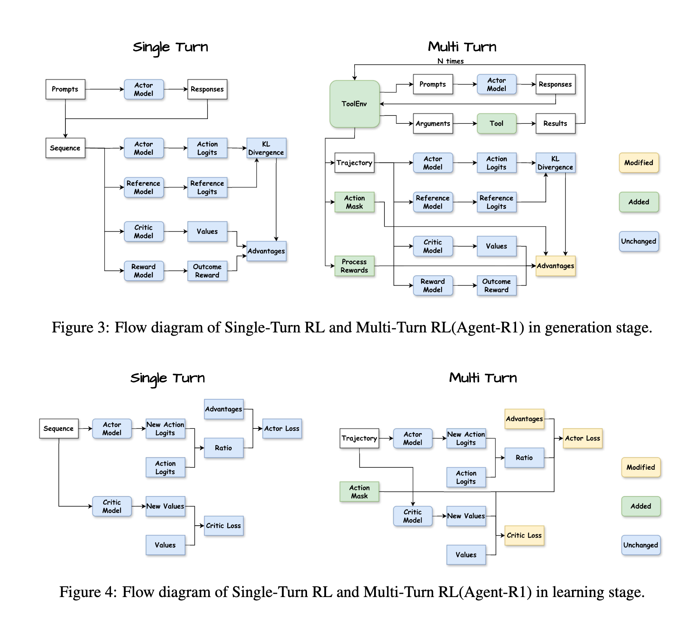
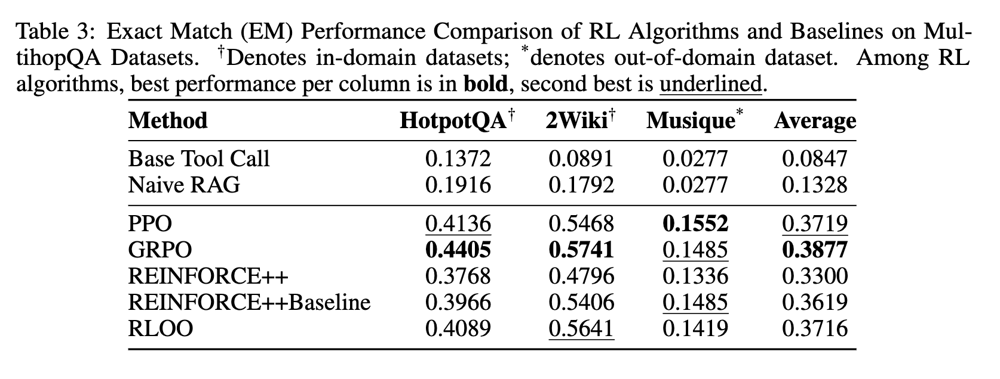
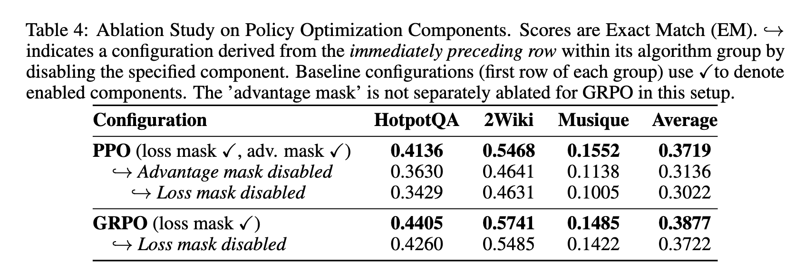

# Agent-R1: 使用端到端强化学习训练强大的 LLM Agent

> **原文链接**: [https://arxiv.org/abs/2511.14460](https://arxiv.org/abs/2511.14460)

## 一句话总结 (TL;DR)

本文通过将经典的马尔可夫决策过程 (MDP) 扩展到多轮交互场景，系统性地阐明了强化学习 (RL) 在 LLM Agent 中的应用，并推出了一个名为 Agent-R1 的模块化训练框架。该框架专为基于 RL 的 LLM Agent 设计，通过实验证明，它能显著提升 Agent 在复杂的多跳问答任务中的决策和工具使用能力。

---

## 1. 问题陈述

大型语言模型 (LLM) 作为能够与环境交互的 Agent，潜力巨大，但如何有效应用强化学习 (RL) 来训练它们仍处于早期阶段。当前领域面临两大挑战：
1.  **缺少为 LLM Agent 定制的 RL 方法论**：如何将传统 RL 理论（如 MDP）系统性地应用到 LLM Agent 的多轮、交互式、非确定性场景中，尚无清晰定义。
2.  **缺少灵活、可扩展的训练框架**：缺乏一个专为 RL Agent 设计的、能够轻松适应不同任务和环境的训练基础设施。

## 2. 核心思想与方案：Agent-R1 框架

为解决上述问题，本文提出了一个概念和实践相结合的方案：

**概念上**，将标准的马尔可夫决策过程 (MDP) 扩展，以全面建模 LLM Agent 的多轮交互特性。这包括重新定义状态空间、动作空间、状态转移概率和奖励函数，使其能容纳历史交互、环境反馈和中间过程奖励。

**实践上**，推出了 **Agent-R1**，一个灵活、模块化的 RL Agent 训练框架。其核心设计是将智能体与环境的交互流程标准化，特别是通过 `Tool` 和 `ToolEnv` 两个核心模块来解耦“工具执行”和“环境状态管理”，从而实现对复杂多轮交互的灵活支持。

## 3. 关键技术细节

### 3.1. 扩展的马尔可夫决策过程 (MDP)

为了将强化学习应用于 LLM Agent，论文对传统 MDP 的四个核心组件进行了扩展，使其能适应多轮、交互式的环境。

-   **状态空间 (State Space, S)**：
    -   *静态 LLM*: `st = (wp, w1, ..., wt)`，仅包含提示和已生成的文本。
    -   *LLM Agent*: `st = (wp, T1, ..., Tk, T_partial_k+1)`。这里的 `Ti` 代表一个完整的交互回合，包含 Agent 的输出和环境的反馈 `(wi1, ..., wei)`。状态空间保留了完整的对话历史，使决策基于上下文。

-   **动作空间 (Action Space, A)**：
    -   动作 `at` 依然是从词汇表 `V` 中选择下一个 token `wt+1`。
    -   关键区别在于，特定的 token 序列（例如，符合预定义格式的文本）会被解释为**调用外部工具的命令**，从而将文本生成与实际行动联系起来。

-   **状态转移概率 (State Transition, P)**：
    -   状态转移被分为两种情况：
        1.  **生成性转移 (PG)**：标准的、确定性的 token 生成，`P(st+1|st, at) = 1`。
        2.  **环境转移 (PE)**：当 Agent 调用工具时触发。这是一个**随机过程**，因为环境的反馈（如 API 返回结果）是不确定的。`st+1` 同时取决于 Agent 的动作 `at` 和环境的随机响应 `wei`。

-   **奖励函数 (Reward Function, R)**：
    -   奖励机制变得更加密集，以提供更频繁的学习信号：`R(st, at, st+1)`
    -   **最终奖励 (rf)**：在任务结束时根据最终结果给予的稀疏奖励。
    -   **过程奖励 (rp)**：在中间步骤给予的奖励，例如每次成功调用工具或获得有效信息时。这极大地缓解了稀疏奖励问题，并能有效引导 Agent 学习正确的中间步骤。

*表 1: 这是一个 **概念对比表**，它清晰地对比了“静态大语言模型”和“LLM Agent”在马尔可夫决策过程 (MDP) 的四个核心概念（状态、动作、转移、奖励）上的根本不同。*

### 3.2. Agent-R1 框架设计：Tool 与 ToolEnv

Agent-R1 的灵活性源于其两大核心模块，它们清晰地划分了职责：

-   **`Tool` 模块 (执行器)**：
    -   通过 `BaseTool` 抽象类进行标准化。每个工具都需要实现 `execute` 方法，该方法封装了工具的核心逻辑（如调用 API）。
    -   工具还包含**元数据** (Metadata)，如 `name`, `description` 和 `parameters` (遵循 JSON Schema)，使 LLM Agent 能够理解工具的功能、用途和所需的参数格式，从而生成正确的调用指令。

-   **`ToolEnv` 模块 (编排与解释器)**：
    -   通过 `BaseToolEnv` 抽象类实现，核心是 `step` 方法。
    -   `step` 方法接收 Agent 的输出，解析其中是否包含工具调用，执行相应的 `Tool`，然后根据工具返回的原始结果**更新环境状态**并**计算奖励**。
    -   它还包含多个辅助方法，如 `extract_tool_calls` (从 LLM 输出中解析工具调用) 和 `format_tool_response` (将工具结果格式化为文本，以便 Agent 理解)，共同管理复杂的交互流程。

*图 1: 清晰地展示了三种不同工作流的演进。从简单的“指令-响应”模式，到包含工具调用的“Agentic 工作流”，再到具备持续学习和适应能力的“自主 Agent”。Agent-R1 主要关注于后两者，特别是如何通过 RL 实现从 Agentic 工作流向自主 Agent 的跃升。*

### 3.3. 面向多轮轨迹的策略优化

为了从复杂的多轮交互中高效学习，Agent-R1 在训练阶段采用了以下精细化的优化策略：

-   **动作掩码 (Action Mask)**：这是实现精确信誉分配的关键。在整个交互序列中，只有 Agent 自主生成的 token 才被认为是其“动作”。掩码会标记这些 token，确保梯度更新只作用于 Agent 的决策部分，而忽略提示和环境反馈部分。

-   **对齐的优势计算 (Aligned Advantage Calculation)**：在计算优势函数 (Advantage, 如使用 GAE) 时，框架不仅考虑最终奖励和价值函数估计，还显式地**将过程奖励 (rp) 融入计算**。优势值 `Ât` 只在被动作掩码标记的时间步上计算，确保了奖励信号与产生它的具体动作精确对齐。

-   **带掩码的策略与价值更新 (Masked Policy & Value Update)**：
    -   **Actor Loss**：在使用 PPO 等算法计算策略损失时，动作掩码确保只在 Agent 生成的 token 上计算概率比率 (Ratio)，从而实现对 Agent 行为的精准优化。
    -   **Critic Loss**：价值函数（Critic）的更新也受益于此，因为它学习去预测包含了过程奖励和最终奖励的更精确的未来回报。

*图 2: 描绘了 Agent-R1 中一个完整的训练轨迹 (Rollout Trajectory) 示例。它直观地展示了 Agent 如何生成动作、环境如何返回观察 (Observation)、以及奖励 (Reward) 和掩码 (Mask) 是如何在每一步中被精确计算和对齐的。这对于理解框架的内部工作机制至关重要。*

**这张图的核心含义是：**

-   **数据收集**: 这个流程不仅仅是推理过程，更是**数据生成过程**。Agent-R1 通过不断地尝试（Rollout），生成大量的“思考($t_k$)-行动($a_k$)-反馈($r_k$)”轨迹。
-   **GRPO/PPO 训练**: 在强化学习中（如 GRPO 或 PPO），模型会根据最终答案的正确性，来奖励或惩罚这条轨迹上的所有行为。
    -   如果最终答案正确，模型会学习：“在遇到这种情况时，进行这样的思考并调用这个工具是正确的。”
    -   如果答案错误，模型则会调整策略，避免类似的行为。
-   **长思维链与工具融合**: 这张图展示了 Agent-R1 试图将长思维链 (Long CoT) 与工具使用 (Tool Use) 结合在同一个强化学习框架中。模型不仅要学会怎么想，还要学会什么时候该用工具。

**总结来说**，这张图展示了 Agent-R1 如何像人类一样工作：遇到问题 -> 思考 -> 发现需要工具 -> 调用工具 -> 获取结果 -> 再思考 -> 得出最终答案。这整个动态交互的历史被记录下来，作为强化学习的训练素材，用来不断进化智能体的推理和决策能力。

### 3.4. 实验采用的算法与奖励函数

-   **RL 算法**: 框架展示了其通用性，支持多种 RL 算法，包括 **PPO, GRPO, REINFORCE++** 等。实验结果表明，PPO 和 GRPO 在多跳问答任务上表现尤为出色。
-   **奖励函数细节**: 实验采用了一个稀疏但结构化的最终奖励 `rf`。
    -   `rf = r_answer` (如果格式正确) 或 `r_format - 1` (如果格式错误)。
    -   `r_answer` 是答案的精确匹配 (Exact Match)得分。
    -   `r_format` 是一个综合格式得分，它要求最终答案的呈现格式和工具调用的语法都必须完全正确。这种严格的奖励设计强迫模型不仅要找到正确答案，还要学会以正确的格式与环境交互。

## 4. 实验结果与结论

-   **实验设置**：在多跳问答（HotpotQA, 2WikiMultihopQA, Musique）任务上，使用 Qwen2.5-3B-Instruct 模型进行实验。

-   **核心差异：单轮 RL vs. Agent-R1 的多轮 RL**：
    
    *图 3 与 图 4: 这组图是理解 Agent-R1 核心创新的关键。它 **对比了传统单轮 RL 和 Agent-R1 的多轮 RL 在两个核心阶段的差异**：1. **生成阶段** (左图): 单轮 RL 只需模型生成一次，而 Agent-R1 需要支持模型与环境进行多次、复杂的交互 (Rollout)。 2. **学习阶段** (右图): Agent-R1 的学习过程需要处理包含多轮交互的复杂轨迹 (Trajectory)，而单轮 RL 的轨迹则简单得多。*

-   **组件验证实验 1：优化掩码的效果**：
    
    *表 3: 这是一个 **数据对比实验**，用于验证“掩码”组件的重要性。表格中的数据显示，在 PPO 和 GRPO 算法中，一旦移除“优势对齐掩码”或“损失掩码”，模型的性能（精确匹配分数）就会出现明显下降。这证明了这些掩码对于框架的有效性是必不可少的。*

-   **组件验证实验 2：过程奖励的效果**：
    
    *表 4: 这是另一个 **数据对比实验**，用于验证“过程奖励”的重要性。数据显示，如果只使用最终的任务结果作为奖励 (Final Reward Only)，模型的性能远不如使用完整奖励（即包含过程奖励）时的性能。这证明了为 Agent 的中间步骤提供奖励是引导其学习的关键。*

## 5. 总结与展望

本文为“如何使用 RL 训练 LLM Agent”这一问题提供了清晰的理论框架（扩展 MDP）和强大的实践工具（Agent-R1 框架）。它通过引入中间过程奖励和精确的掩码机制，有效解决了在多轮交互中进行信誉分配的难题。

未来，Agent-R1 有望成为一个基础平台，用于研究更通用、更具扩展性的 Agentic LLM 训练方法。

## 6. 对实践者的启示 (Insights for Practitioners)

-   **密集奖励至关重要**: 如果你正在构建或训练自己的 Agent，不要只依赖最终的任务成功与否作为奖励。为成功的中间步骤（如正确调用 API、获取到有效信息）设计“过程奖励”，可以极大加速和稳定训练过程。
-   **Agent-R1 框架值得借鉴**: 即使不直接使用 Agent-R1，其模块化设计思想也很有价值。将“工具执行” (`Tool`) 和“环境反馈解读” (`ToolEnv`) 分离，可以让你的 Agent 系统更清晰、更易于扩展。
-   **从简单任务开始微调**: 论文表明，通过在专门的任务（如多跳问答）上进行 RL 微调，可以显著提升模型的特定能力。对于需要高度依赖工具或外部环境的应用，这种端到端的微调是提升性能的关键。

## 7. 潜在局限性与未来工作 (Potential Limitations & Future Work)

-   **奖励设计的复杂性**: 尽管过程奖励有效，但如何设计一个既能有效引导模型学习又不会引入意外偏差的奖励函数，仍然是一个挑战。错误的奖励设计可能导致 Agent 学会“钻空子”。
-   **样本效率问题**: 强化学习通常需要大量的交互数据才能有效学习。论文虽然证明了其有效性，但并未深入探讨训练所需的样本量和计算成本，这在实际应用中是关键考量因素。
-   **泛化能力**: 尽管在域外数据集（Musique）上取得了一定效果，但 Agent 的泛化能力仍有待进一步验证。在与训练数据分布差异更大的真实世界场景中，Agent 的表现如何还是一个开放问题。

---

## 附录：核心术语解释 (Glossary)

-   **LLM Agent**: 指的是被赋予“代理”角色的大语言模型，它们不仅能进行认知任务（如推理、决策），还能自主行动、持续学习，并适应环境变化。
-   **马尔可夫决策过程 (Markov Decision Process, MDP)**: 一个用于建模决策制定的数学框架。在本文中，它被扩展以描述 LLM Agent 在多轮交互中的状态、动作、转移和奖励。
-   **过程奖励 (Process Rewards)**: 除了任务最终成功与否的奖励外，为智能体成功执行的中间步骤（如有效调用工具）提供的即时奖励。这有助于更有效地指导学习过程。
-   **动作掩码 (Action Mask)**: 在训练数据中，用于精确标识哪些部分是由 Agent 生成的（即其“动作”），哪些部分是环境的反馈或初始提示。这确保了模型只为自己的行为负责。

## 参考文献 (References)

-   Cheng, M., Ouyang, J., Yu, S., Yan, R., Luo, Y., Liu, Z., Wang, D., Liu, Q., & Chen, E. (2025). *Agent-R1: Training Powerful LLM Agents with End-to-End Reinforcement Learning*. arXiv preprint arXiv:2511.14460.
