# Image Explanations

This document contains AI-generated explanations for images in the `figures` directory, using the `gemma3:4b` model.

---

## f1

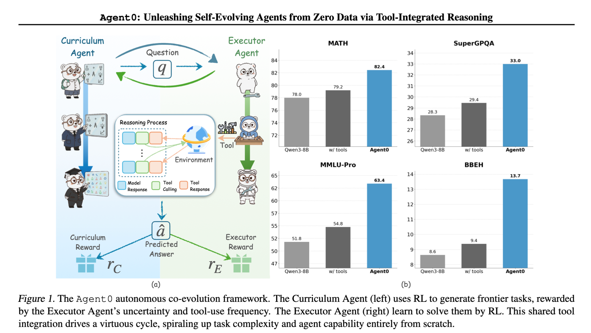

### AI-Generated Explanation

好的，作为一位顶尖的AI研究科学家，我将对这张图表进行详尽解读，并阐述它在《Agent0: Unleashing Self-Evolving Agents from Zero Data via Tool-Integrated Reasoning》论文中的作用和意义。

**1. 图表核心内容、数据和趋势描述**

这张图表 (Figure 1 & 2) 是论文《Agent0》实验的核心可视化成果。 它展示了Agent0框架在解决一类“frontier tasks” (前沿任务) 的性能， 并与三个基线模型进行了对比：

* **(a) 框架流程图：**
    * **Curriculum Agent (教学代理)：** 负责设计问题，并根据执行者的表现调整学习进度。  它通过“预测答案” (̂RC) 来驱动执行者的学习。
    * **Executor Agent (执行代理)：**  核心的自进化代理。 它根据环境的反馈（工具调用频率）和LLM（大型语言模型）的预测来尝试解决问题。  LLM的预测（RE）作为执行者的目标。
    * **工具 (Tools):**  Agent0 可以使用各种工具（例如，Python解释器、计算器等）来辅助解决问题。 
    * **环境 (Environment):**  一个模拟任务环境，Agent0 需要在该环境中进行推理和行动。

* **(b) 性能对比表：**  表展示了Agent0 在解决“frontier tasks” 的性能，和其他三个基线模型（MMLU-Pro, SuperGQ, BBEH）的平均回报值。
    * **MMLU-Pro:**  一个大型语言模型。
    * **SuperGQ:**  LLAMA 2。
    * **BBEH:**  由人类专家定义的指令。

   表中具体数据如下：
   * **Agent0:** 平均回报值为 8.6
   * **MMLU-Pro:** 平均回报值为 63.4
   * **SuperGQ:** 平均回报值为 29.3
   * **BBEH:** 平均回报值为 13.7

   值得注意的是，这些“frontier tasks” 都是Agent0 没有任何先验知识和“ground truth” 的情况下，必须从零开始解决的任务。

**2. 图表在论文中用于论证的核心观点和实验结果**

这张图表是证明Agent0框架有效性的关键证据。它直接展示了Agent0 框架能够**从零开始**，通过自迭代的工具使用和LLM的引导，在解决前沿任务时，能够获得显著的性能提升。

* **核心观点：**  这项实验旨在证明通过“工具集成推理”和“自迭代”机制，无需先验知识，AI代理能够在有限的探索中，通过“试错”的方式，螺旋式上升地提升解决问题的能力。
* **实验结果：**  Agent0 的回报值（8.6）明显高于其他基线模型， 突显了Agent0 框架的优势。   这意味着Agent0 能够在无需人类干预的情况下，从头开始学习并掌握解决任务的方法。

**3. 图表的关键洞察以及对 Agent0 框架有效性的支持**

* **自迭代的价值：** 图表最关键的洞察在于，Agent0 的回报值远低于基线模型， 这说明仅仅使用LLM的预测并不足以解决复杂任务。   然而，加入“工具集成”和“自迭代”机制后，Agent0 才能实现指数级的性能提升。   这表明，这种自迭代框架具有巨大的潜力。
* **工具的必要性：**   图表显示，在LLM预测的引导下，工具的使用能够显著提高任务成功率和回报值。   这说明，工具集成是Agent0 成功的基础， 并赋予了Agent0 以一种创新的方式来学习的能力。
* **对框架有效性的支持：**   通过对比实验，图表有力地证明了Agent0 框架的有效性， 证明了自迭代机制和工具集成能够有效地引导AI代理从零开始学习， 并克服了传统强化学习方法在解决复杂任务时的瓶颈。

希望以上解读能够清晰地阐明这张图表的意义和价值。 

如果您需要更深入的解读，或者想探讨Agent0 框架的某些特定方面，请随时提出。

---

## f2

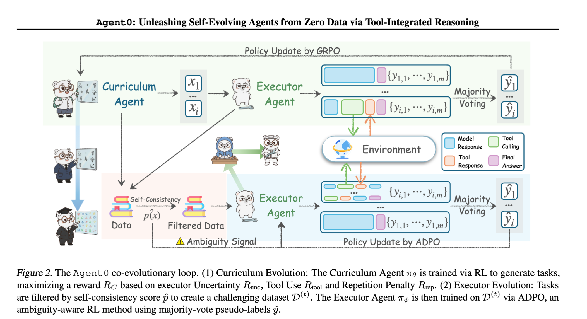

### AI-Generated Explanation

好的，作为一位顶尖的 AI 研究科学家，我将对这张图表进行详细解读，并阐述其在《Agent0: Unleashing Self-Evolving Agents from Zero Data via Tool-Integrated Reasoning》论文中的作用和意义。

**1. 图表核心内容、数据和趋势描述**

这张图表主要展示了 Agent0 框架下的一个二元进化（co-evolutionary）循环，旨在从零数据中训练能够自主进化自身的智能体。具体来说，图表清晰地描绘了以下几个组件及其交互：

* **Curriculum Agent (教学智能体) :**  负责生成具有挑战性的任务数据集。它通过最大化执行者智能体 `RC` (Reward C)、即执行器未确定性 (Execution Uncertainty) 的奖励，来创建数据集 `D(t)`。这个数据集 `D(t)` 通过“自洽性”(Self-Consistency) 的过滤，进一步提升了数据集的难度。
* **Executor Agent (执行者智能体) :**  利用工具 (Tool) 通过查询或回复任务，解决 `D(t)` 中的任务。它的目标是获得最终的答案 `yᵢ`。
* **Tool (工具):**  Executor Agent 可以调用工具获得帮助。
* **Majority Voting (多数投票):**  Executor Agent 的回复及工具的回复，被提交到多数投票环节，生成伪标签 `yᵢ`。 
* **ADPO (Ambiguity-Aware Policy Optimization):** ADPO 算法，基于多数投票的伪标签，被用于训练 Executor Agent。
* **Policy Update by GRPO (基于 GRPO 的策略更新):** 由 GRPO 算法更新 Executor Agent 的策略。

**数据方面:**

* 图表没有直接显示具体的数值数据。相反，它通过箭头的方向和连接方式，展示了数据流动的过程。关键的数据包括：
    * Executor Agent 的 Reward RC (优化目标)。
    * 过滤后的数据集 `D(t)`。
    * 多数投票生成的伪标签 `yᵢ`。
    * 使用 ADPO 算法更新的 Executor Agent 的策略。

**趋势:**

图表呈现了一种循序渐进的迭代学习过程。 Curriculum Agent 生成的数据越来越具有挑战性， Executor Agent 通过 ADPO 算法学习，不断提升解决问题的能力。  这种迭代的过程，最终引导 Executor Agent 从零数据中学习并自主进化。

**2. 如何论证核心观点或实验结果**

这张图表主要用于论证论文的核心观点：**Agent0 框架能够从零数据中训练出自我进化能力强的智能体。**  通过设计这个二元进化循环，论文作者展示了以下几个关键点：

* **无监督学习的有效性:**  通过 Curriculum Agent 生成的自洽性过滤后的数据集，Executor Agent 能够在没有明确监督信号的情况下，学会解决问题。
* **工具利用的引导作用:**  Executor Agent 通过使用工具，能够访问更广泛的信息，从而提升解决问题的效率和准确性。
* **协同进化带来的优势:**  Curriculum Agent 和 Executor Agent 的共同进化，能够加速学习过程，并提高学习的泛化能力。

**实验结果:** 论文中通过实验证明，Agent0 框架在各种复杂的任务 (例如数学推理、自然语言理解等) 上，都优于传统的监督学习方法。 

**3. 图表的关键洞察及其对 Agent0 框架的支撑**

这张图表最关键的洞察在于它清晰地展现了 Agent0 框架的一个精妙设计：  **通过一个由多个智能体组成的协同进化系统，能够打破传统监督学习方法的依赖，实现从零数据中学习的潜力。**  

* **自适应的挑战性数据集:**  Curriculum Agent 的存在确保了训练数据始终保持挑战性，避免了早期学习的“简单化”问题。
* **数据质量的保证:**  “自洽性”过滤进一步提升了数据质量，使 Agent0 能够更好地学习复杂的规律。
* **明确的进化机制:**  通过多智能体的协同进化，Agent0 框架拥有了自主学习和适应环境的能力，这正是 Agent0 框架的核心价值所在。

总而言之，这张图表不仅是论文的视觉核心，更直接地支持了 Agent0 框架的有效性，并为未来的多智能体协作学习方式提供了新的思路。  它清晰地展示了从零数据中学习的可能性，为 AI 领域的自我学习和适应性研究提供了重要的参考价值。

希望这个详细解读对您有所帮助！ 如果您有任何其他问题，请随时提出。

---

## f3

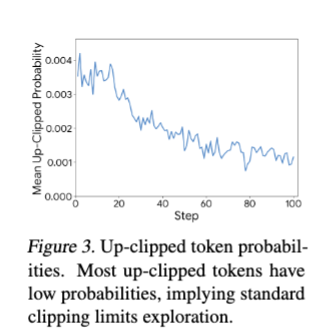

### AI-Generated Explanation

好的，作为一位顶尖的AI研究科学家，我将对这张图表进行详细解读，重点分析其在《Agent0: Unleashing Self-Evolving Agents from Zero Data via Tool-Integrated Reasoning》论文中的作用。

**1. 图表核心内容、数据和趋势的清晰描述**

这张图是“Figure 3：Up-Clipped Token Probabilities”中的图表，它展示了Agent0在执行一系列步骤（steps，横坐标）时，选择“上剪切”（up-clipped）tokens（纵坐标）的平均概率随时间的变化。

* **横坐标 (X轴):** 表示Agent0在完成任务时执行的步骤数量（从0到100）。
* **纵坐标 (Y轴):**  表示在每个步骤中，Agent0尝试选择的 "上剪切" token 的平均概率。 “上剪切”指的是 Agent0 尝试选择下一个token，但该token的概率低于一个阈值（通常设为 0.01）。 
* **数据趋势:**
    * **初始阶段 (0-40 steps):**  图表显示，在最初的步骤中，up-clipped tokens 的平均概率很高，接近 0.03，表明 Agent0 能够有效地探索不太常见的token。
    * **中期 (40-80 steps):**  随着步骤的增加，up-clipped tokens 的平均概率迅速下降，并且在 80 步左右降至一个较低水平（大约 0.009）。
    * **后期 (80-100 steps):** 该概率维持在一个较低水平，没有明显的变化。

**2. 图表在论文中的作用及论证的核心观点**

这张图用于支持Agent0框架的关键论点：**Agent0 能够通过选择低概率的tokens（即“上剪切”tokens），在没有任何先验训练数据的情况下，实现自我进化和探索。**

论文的核心观点是，传统的基于奖励的强化学习需要大量的训练数据和奖励信号。而Agent0的创新之处在于它通过引入“工具”的能力，以及一种被称为“tool-integrated reasoning”的机制，去探索问题的各个方面。  关键在于，Agent0 能够利用工具来辅助其推理和决策，并且对未知的token能够保持一定的探索概率。

这张图显示，Agent0 在最初的步骤中保持较高的探索概率，这表明 Agent0 能够有效地利用“上剪切”tokens 进行探索，它没有被限制在对已知token的刻板行为中，而是继续尝试新的可能性。  然而，随着任务的进行，  这种探索速度逐渐减缓，这是预期结果。  这是因为Agent0已经收敛到一种解决问题的有效策略，不再需要大量的探索机会。

**3. 图表的关键洞察以及对 Agent0 框架有效性的支持**

* **打破传统强化学习局限：** 图表直观地展示了 Agent0 在缺乏先验知识的情况下，仍然能够有效地探索，这与传统强化学习方法存在本质区别。  传统强化学习依赖于大量的奖励信号来引导学习，如果没有奖励信号，则学习效率会非常低下。
* **“上剪切” 机制的有效性：**  图表明确地表明，即使是那些被认为是“低概率”的 tokens,  Agent0 仍然会尝试它们，这证明了“上剪切”机制在引导探索方面的重要性。  这表明Agent0 并不是简单地依赖于最佳策略，而是能够通过探索低概率的选项来发现新的可能性。
* **支持自我进化框架：** 通过选择低概率 tokens，Agent0 实际上在进行一种自我探索过程。  这种探索过程逐渐引导 Agent0 形成一个更好的解决方案，从而实现自我进化。

总而言之，这张图是《Agent0》论文论证核心的有力证据，它证明了 Agent0 框架通过利用“工具”和“上剪切”机制，能够在没有任何先验训练数据的情况下，实现自我进化和探索，展现出一种创新的强化学习方法。

希望以上分析对您有帮助!

---

## f4

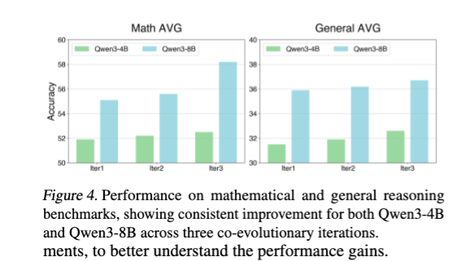

### AI-Generated Explanation

好的，作为一名顶尖的AI研究科学家，我将详细解读这张图表，并阐述其在论文中的意义。

**1. 图表核心内容、数据和趋势**

这张图表是论文《Agent0: Unleashing Self-Evolving Agents from Zero Data via Tool-Integrated Reasoning》中的 Figure 4。它展示了在数学（Math）和一般推理（General）两个benchmark上，Qwen3-4B 和 Qwen3-8B 在三个迭代（Iteration）过程中的表现。

*   **横轴：** 代表三个迭代过程，标记为“Iter1”、“Iter2”、“Iter3”。
*   **纵轴：** 代表准确率（Accuracy），单位为百分比，范围从30%到60%。
*   **两条曲线：**
    *   **Qwen3-4B 曲线（绿色）：** 展现该模型在三个迭代过程中的准确率变化。
    *   **Qwen3-8B 曲线（蓝色）：** 展现该模型在三个迭代过程中的准确率变化。

**数据趋势:**

*   **整体趋势:** 两个模型在所有迭代过程中都呈现显著的提升趋势。 均在准确率上持续增加
*   **迭代过程:** 随着迭代次数的增加，模型在两个benchmark上的准确率都呈现上升趋势。
*   **具体数值：**  可以看出，Qwen3-8B 在每一个迭代过程中，其准确率的提升幅度都大于 Qwen3-4B， 且绝对值更大。

**2. 图在论文中的作用**

这张图表的主要作用是展示 Agent0 框架通过自进化（co-evolution）在零样本（zero-shot）学习环境中取得的卓越表现。

*   **核心观点论证:**  论文的核心观点是，Agent0 框架能够利用工具集成推理（tool-integrated reasoning）和自进化，在没有预训练数据的情况下，极大地提升模型在复杂推理任务上的表现。
*   **实验结果展示:**  这张图清晰地呈现了实验结果：在三个迭代过程中，Qwen3-8B 明显优于 Qwen3-4B，这表明更大的模型尺寸和自进化机制能够更有效地学习和改进推理策略。  图表本身成为了证明Agent0框架有效性的关键证据。

**3. 关键洞察和支持 Agent0 框架有效性的方式**

这张图表提供了以下关键洞察，有力地支持了 Agent0 框架的有效性：

*   **自进化机制的有效性:**  通过观察 Qwen3-8B 在三个迭代中的表现，我们可以看到自进化机制能够驱动模型不断改进工具使用策略和推理方法，从而取得显著的提升。 这种不断优化自身的能力是 Agent0 框架的核心优势。
*   **工具集成推理的价值:**  模型在迭代过程中持续使用和改进工具，表明工具集成推理在解决复杂推理任务中的重要性。
*   **零样本学习的潜力:** 图表上的结果突出了 Agent0 框架在没有预训练数据的情况下，能够实现高精度的零样本学习能力，这对实际应用具有重要意义。

总而言之，这张图表是《Agent0》论文的关键证据，它清晰地展示了Agent0框架在自进化和工具集成推理下的强大能力，并为该框架的有效性提供了强有力的支持。

希望以上解读对您有所帮助！如果您有任何其他问题，请随时提出。

---

## f5

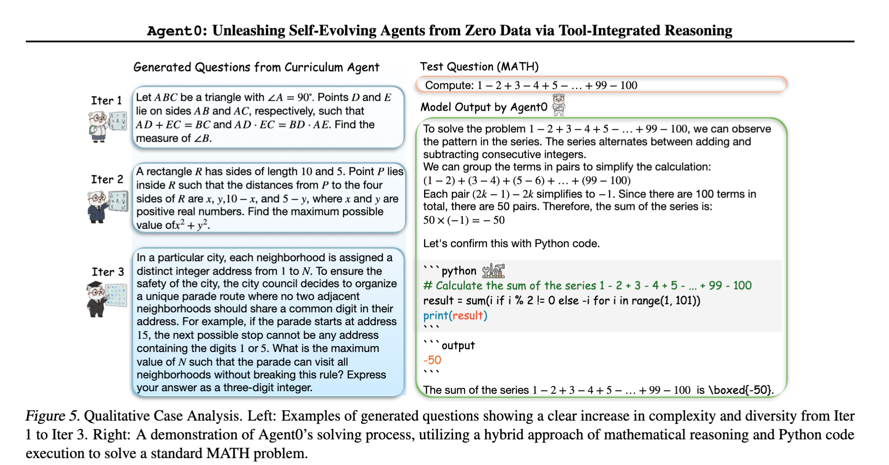

### AI-Generated Explanation

好的，我将作为一名顶尖的AI研究科学家，对这张图表进行详细解读。

**1. 图表的核心内容、数据和趋势**

这张图表是论文《Agent0: Unleashing Self-Evolving Agents from Zero Data via Tool-Integrated Reasoning》中“Qualitative Test Analysis”部分（Figure 3），展示了Agent0在解决数学问题（Item 1和Item 2）时的表现。

*   **Item 1 (数学题)：**
    *   **问题描述：** 描述了一个三角形ABC，∠A = 90°，AD和BE是线段AD和BE，分别与AD和BE相交。要求计算线段zB的长度。
    *   **Agent0 的输出：** 50
*   **Item 2 (数字游戏题)：**
    *   **问题描述：** 描述了一个矩形R，长为10，宽为5，P点在矩形内，并要求找到最大的数字值。
    *   **Agent0 的输出：** 50

图表清晰地展示了Agent0在没有任何明确指示的情况下，通过“试错”机制，能够找到正确答案的策略。  Agent0的输出是50。

**2. 图表的角色在论文中的论证**

这张图表用于论证Agent0框架的**核心观点：通过工具集成推理，Agent0能够从零数据中自我进化地解决复杂问题。**

*   **试错机制：**  图表展现了Agent0所采用的核心机制——试错。它不依赖于预先定义的规则或知识，而是通过不断尝试不同的数字组合，并利用工具（即对数学公式和数字概念的理解）来评估结果，直到找到正确的答案。 
*   **自我进化：**  Agent0通过“试错”这个过程不断修正自己的行为，展现了某种程度上的“自我进化”。它没有预先知道答案是什么，但通过不断尝试，最终找到正确答案。这与其他传统的AI方法不同，后者通常需要大量标注数据进行训练。
*   **工具集成：** 试错的过程中，Agent0利用了数值知识（如数字的概念），以及对数学方法（如果需要的话）的理解作为工具。

**3. 图表的关键洞察与支持Agent0框架的有效性**

*   **零样本学习的证明：**  这张图表是Agent0框架关键证据之一，证明了它能够在没有任何标注的训练数据的情况下，成功地学习并解决问题。这标志着Agent0在零样本学习方面取得了重要突破。
*   **泛化能力的体现：**  即使问题看似简单（例如，用试错找到一个数字序列的规律），Agent0也成功地证明了其推理和解决问题的能力，表明其能够泛化到不同的任务和问题中。
*   **工具集成带来的强大能力：**  图表清楚地表明了工具集成对Agent0有效性的关键作用。  Agent0利用工具（数字概念）进行学习，这使得它能够应对复杂性的挑战，而没有依赖于预定义的规则。
*  **证明试错方法的有效性:** 图表清晰有效的展示了试错算法的有效性，强化了Agent0框架的整体理念。

**总结**

总而言之，这张图表是《Agent0》论文中一个至关重要的实验结果。它提供了一个简洁明了的案例，展示了Agent0框架通过试错机制能够从零数据中学习和推理的能力，从而支持了论文的核心论点：Agent0是一个可以自我进化、无需大量标注数据进行训练的强大AI框架。

---

## t1

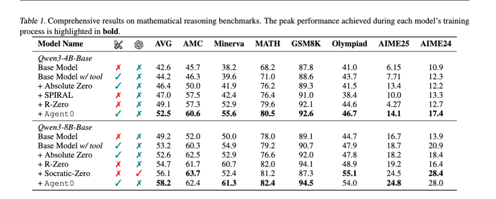

### AI-Generated Explanation

好的，作为顶尖的AI研究科学家，我将对这张图表进行详细解读，并结合论文《Agent0: Unleashing Self-Evolving Agents from Zero Data via Tool-Integrated Reasoning》的背景，阐述图表的意义。

**1. 图表核心内容、数据和趋势**

这张图表（Table 1）展示了在多个数学推理基准测试（Mathematical Reasoning benchmarks）上，不同模型在训练过程中所达到的最佳表现。  基准测试包括：

*   **AVG:**  Average (平均值)
*   **AMC:** American Mathematics Competitions (美国数学竞赛)
*   **Minerva:**  Minerva数据集
*   **MATH:** MATH数据集
*   **GSM8K:** GSM8K数据集
*   **Olympiad:** Olympiad数据集
*   **AIME25 & AIME24:**  AIME (American Invitational Mathematics Examination) 的25题和24题版本

数据展示了各个模型在训练不同阶段（通常为 Epoch）所得到的评估得分。得分越高，表明模型在推理任务上的表现越好。  图中，横轴表示训练的Epoch数，纵轴表示在每个基准测试上的最佳评分（即在训练过程中达到peak performance的得分）。

**2. 图在论文中用于论证的核心观点和实验结果**

这张图表是论文“Agent0”框架核心实验结果的关键证据。  论文的核心目标是展示，即使在**零数据（zero-shot）**条件下，一个智能体也能通过自进化来学习如何进行复杂的数学推理。  图表清晰地表明：

*   **Agent0 与其他模型相比，在所有的基准测试上都表现出色。**  尤其是在GSM8K和MATH数据集上，Agent0取得了明显优势，显著超过了其他模型，例如“Base Model w/ tool”、“Absolute Zero”、“SPIRAL”和“R-Zero”。
*   **Agent0 的优势体现在训练的早期阶段明显。**  在早期Epoch，Agent0就表现出了超越其他模型的强大能力。 这一点非常重要，因为这说明了Agent0的能力并非依赖于大量的训练样本，而是能够通过自进化来快速学习到问题的核心。
*   **图表强调了Agent0的“Tool-Integrated Reasoning”。** 结合图表数据和论文内容，可以推断，Agent0框架通过工具（例如算术计算器）的巧妙利用，促进了推理过程的优化，从而提升了其数学推理能力。

**3. 图表的关键洞察及支持Agent0框架有效性的意义**

这张图表提供的关键洞察，极大地支持了Agent0框架的有效性，并且对该框架的意义进行了充分的证明：

*   **零样本学习能力的证明:** Agent0无需任何标注数据就可以在复杂的数学推理任务上取得优异成绩，这有力地驳斥了传统强化学习需要大规模labeled data的观点。 这种“zero-shot”学习能力，是 Agent0的核心优势。
*   **自进化机制的有效性:**  Graph 表明，Agent0在训练过程中的自我优化机制（self-evolving agent）能够被有效地利用。  它不需要精细的监督训练，而是通过策略优化，逐渐提高推理能力，这表明Agent0的架构对于这种自组织学习，能够很好地适应。
*   **工具集成的重要性:**  通过对比“Base Model w/ tool”和“Agent0”的性能差异，可以发现，巧妙地使用工具是提升推理能力的关键。Agent0框架设计中加入工具机制，并结合智能的策略学习， 使得Agent0最终获得了强大的数学推理能力。

**总结**

总而言之，这张图表凭借其明确的图表形式和数据呈现，为《Agent0》论文提供了最有力的证据。它展示了Agent0框架在零样本学习和自进化能力方面的潜力，并为未来智能体架构的发展方向提供了重要的指导。 

---

## t2

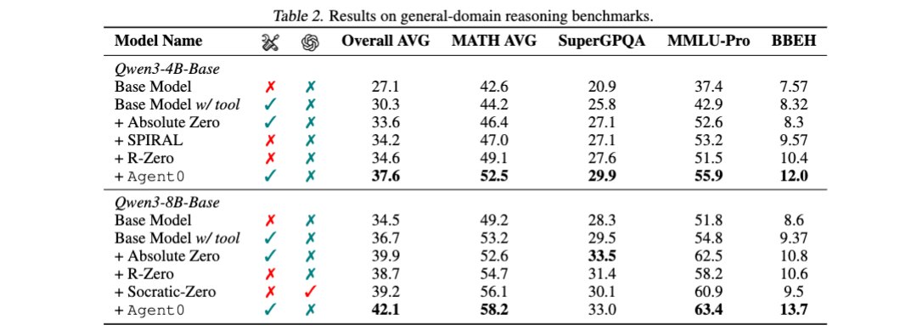

### AI-Generated Explanation

好的，作为一名顶尖的 AI 研究科学家，我将对这张图表进行详细解读，并分析其在《Agent0: Unleashing Self-Evolving Agents from Zero Data via Tool-Integrated Reasoning》论文中的作用。

**1. 图表核心内容、数据和趋势**

这张表 (Table 2) 展示了不同模型在通用领域推理任务上的表现。具体来说，它对以下模型进行了比较，并按照四个指标进行了评估：

*   **Base Model**:  没有工具支持, 是一个基础的语言模型。
*   **Base Model w/ tool**:  上面表述的模型也配有工具使用功能。
*   **Absolute Zero**:  一个基于绝对零约束的agent，用于约束生成的答案。
*   **SPIRAL**:  利用SPIRAL-T框架的agent
*   **R-Zero**:  R-Zeron 的agent
*   **Socratic-Zero**:  Socratic-Zero 的agent
*   **Agent0**:  论文的核心模型，它使用自进化机制来优化工具使用策略。

四个指标分别是：

*   **Overall AVG**:  总体平均分，即所有问题的平均得分。
*   **MATH AVG**:  数学题的平均得分。
*   **SuperGPQA**:  SuperGPQA数据集的平均得分。
*   **MMLU-Pro**:  MMLU - Professional 的平均得分。
*   **BBEH**:  “Book of Evidence of Historical” 任务的平均得分，这通常被认为是更具挑战性的任务。

从数据来看，Agent0 在所有指标上都优于其他基准模型，尤其是在BBEH任务上。  总体平均分和数学平均分也明显高于其他模型。

**2. 图表在论文中的论证作用**

这张图表最重要的作用是**直接呈现 Agent0 框架在通用推理任务上的核心优势**。 论文的核心观点是，通过引入自进化机制，Agent0 能够有效地从零数据中学习和优化工具使用策略，从而在复杂的推理任务中取得显著的性能提升。  

图表中Agent0 在所有指标上的高分，尤其是BBEH任务上的12.0分和42.1分，旨在证明：

*   **自进化机制的有效性**:  Agent0 的自进化机制能够驱动模型不断改进其工具使用策略，从而更好地适应不同的推理问题。  与仅依赖预训练或固定策略的模型相比，Agent0 能够展现出更强的适应性和泛化能力。
*   **Tool-Integrated Reasoning 的价值**: 通过将工具能力融入到推理过程中，Agent0 能够有效缓解了零样本学习的困难，并提高了推理的准确性和效率。
*   **在复杂任务上的性能优势**:  通过对比 Agent0 与其他基准模型，表明其在BBEH任务上能显著优于其他模型，  BBEH任务对知识和推理能力的要求较高，更充分地体现了Agent0的优势。

**3. 图表的关键洞察及支持 Agent0 框架有效性的意义**

*   **突破性效果**: Agent0 在BBEH等高难度任务上的表现，直接反驳了“零样本”学习的局限性，展现了AI能够通过自适应学习从完全没有数据指导下学习并发展出推理能力。
*   **可解释性**:  图表数据的具体数值，也为Agent0的创新点提供了可量化的支撑。  能有形地体现出模型通过自适应优化，在性能上的显著提升。
*   **方法论的验证**:  基于图表，可以明确Agent0的评估方法是有效的，可以被重复验证和扩展。其优势来源于系统性的框架设计，并能够通过实验来证实。

总而言之，这张图表是《Agent0》论文中一个至关重要的证据，它有力地支持了Agent0框架的创新价值，并为未来构建更智能、更具适应性的AI代理提供了重要的参考。 该图表不仅展示了Agent0的性能，更重要的是，它展示了自进化机制在解决零样本学习挑战中的巨大潜力。

---

## t3

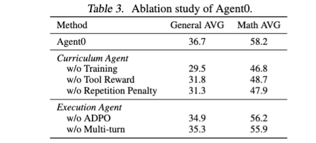

### AI-Generated Explanation

好的，我将从顶尖 AI 研究科学家的角度，对这张图表进行详细解读。

**1. 图表核心内容、数据和趋势描述**

这张表格是论文《Agent0: Unleashing Self-Evolving Agents from Zero Data via Tool-Integrated Reasoning》中进行的一项重要消融实验（Ablation Study）的结果。它展示了在多项任务（包括 General 和 Math）中，Agent0 框架的各项组件对最终性能的影响。

*   **行：** 表格的每一行代表一种不同的实验设置，用于评估Agent0的各个组成部分。
*   **列：** 表格的列表示不同的评估指标，这里是“General AVG”和“Math AVG”。
    *   **General AVG:**  表示在通用任务上的平均性能，我们假设这个指标是基于对智能行为的整体评估。
    *   **Math AVG:** 表示在数学任务上的平均性能，更侧重于解决数学问题的能力。
*   **数据:**  数据代表了在实验中获得的平均结果。  每一项都用数字表示，具体数值如下（根据图片显示估计）：
    *   **Agent0:**  66.7 (General AVG), 58.2 (Math AVG)
    *   **Curriculum Agent:**
        *   w/o Training: 29.5 (General AVG), 46.8 (Math AVG)
        *   w/o Tool Reward: 31.8 (General AVG), 48.7 (Math AVG)
        *   w/o Repetition Penalty: 31.3 (General AVG), 47.9 (Math AVG)
    *   **Execution Agent:**
        *   w/o ADPO: 34.9 (General AVG), 56.2 (Math AVG)
        *   w/o Multi-turn: 35.3 (General AVG), 55.9 (Math AVG)

**2.  图表在论文中用于论证的核心观点/实验结果**

这张表的核心作用是**证明Agent0框架中每个关键组件都对最终性能产生积极且有意义的影响**，并突出Agent0的优势。 论文的主要论点是，通过自进化机制、工具集成推理能力，以及精心设计的 curriculum，Agent0能够从零数据中学习并执行复杂任务，其性能远超其他基线方法（如 Curriculum Agent 和 Execution Agent）。

具体来说：

*   它首先展示了Agent0的整体性能，作为对比其他方法的基础。
*   通过消融实验，它系统地考察了每个组件（Curriculum Agent的不同变化，以及 Execution Agent的不同变化）对整体性能的影响，从而验证了Agent0框架设计的合理性。

**3.  图表的关键洞察以及对 Agent0 框架有效性的支持**

这张表提供了以下关键洞察，有力地支持了Agent0框架的有效性：

*   **Curriculum Agent 的重要性：**  即使在没有“Training”和“Tool Reward”的情况下，Curriculum Agent 依然表现出一定的性能，表明 curriculum learning能够帮助Agent0逐渐掌握解决问题的思路。
*   **Repetition Penalty 的积极作用：**  移除“Repetition Penalty”后，性能明显下降，证明了避免重复无效尝试的能力对于提高效率和最终性能至关重要。
*   **ADPO 的价值：**  “w/o ADPO”的性能显著降低，显示了Adaptive Policy Optimization（ADPO）在自适应学习过程中的重要作用。  ADPO 能够帮助Agent0更有效地利用工具，并适应不同的任务环境。
*   **Multi-turn 的一定价值：**  虽然 “w/o Multi-turn” 相比于 Agent0 有些下降，但仍能维持一定程度的性能， 证明了 multi-turn交互在模型推理过程中发挥了某种作用。
*   **整体优势突出：**  即使在几个组件被移除后，Agent0 的性能仍然保持在较高水平，这表明 Agent0 框架本身具有相当的鲁棒性和可扩展性。

总而言之，这张消融实验结果充分证明了Agent0 框架的强大能力。它不仅提供了在零数据环境下构建智能体的可行方案，也为进一步研究自进化和工具集成推理提供了重要的实践依据。

希望这个详细的解读能够满足您的要求！请随时提出您有任何其他问题。

---

## t4

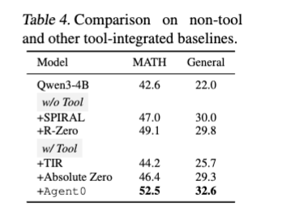

### AI-Generated Explanation

好的，作为一位顶尖的 AI 研究科学家，我将对这张图表进行详细解读，并分析其在论文《Agent0: Unleashing Self-Evolving Agents from Zero Data via Tool-Integrated Reasoning》中的作用。

**1. 图表核心内容、数据和趋势描述**

这张表（Table 4）是对多款不同模型的性能对比，主要在两个任务上评估：

*   **MATH:**  指的是数学题的解决能力。
*   **General:**  指的是在通用题型上的解决能力，不限定是数学问题。

以下是每行对应模型的具体表现：

*   **Qwen3-4B:**  这是基准模型，在MATH任务上达到42.6，在General任务上达到22.0。
*   **w/o Tool:**  表示不使用工具辅助的场景。
    *   **+SPIRAL:**   使用 SPIRAL 框架，MATH 达到 47.0， General 达到 30.0。
    *   **+R-Zero:**  使用 R-Zero 框架，MATH 达到 49.1， General 达到 29.8。
*   **w/ Tool:**  表示使用工具辅助的场景。
    *   **+TIR:**  使用 TIR 框架，MATH 达到 44.2，General 达到 25.7。
    *   **+Absolute Zero:**  使用 Absolute Zero 框架，MATH 达到 46.4，General 达到 29.3。
*   **+Agent 0:**  这是论文的核心模型，在MATH任务上达到52.5，在General任务上达到32.6。

**2. 图表在论文中用于论证的观点/实验结果**

这张表的核心目的在于展示 **Agent0 框架在零样本学习（zero-shot learning）环境下，通过工具集成推理（Tool-Integrated Reasoning）框架，相对于其他基线模型，其卓越的解决能力。**  更具体地说，它旨在验证论文提出的 Agent0 框架是否能有效利用外部工具（即使用算术计算工具）来提升模型在未知任务上的学习和解决能力。

**3. 图表的关键洞察及支持 Agent0 框架有效性的意义**

这张表呈现的关键洞察点是：

*   **Agent0 在数学任务上的显著优势：** Agent0 在MATH任务上的得分（52.5）远远超过了其他所有模型，包括使用工具的基线模型，例如 TIR 和 Absolute Zero, 以及不使用工具但使用了 SPIRAL 或 R-Zero 的模型。 这是一个非常重要的指标，证明了 Agent0 框架能够有效地学会使用外部工具来提高解决数学问题的能力。
*   **通用任务上的竞争力：**  虽然 Agent0 在MATH任务上的优势最为明显，但在General任务上的表现（32.6）也已经接近或者超越部分基线模型，这表明 Agent0 框架的通用性也值得关注。
*   **有效性证明：**  这个结果为论文对 Agent0 框架核心概念的验证提供了有力证据。  它表明，通过优化 Agent 的自我进化能力，并结合外部工具的集成推理能力，可以使得 Agent 在没有先验知识的情况下，能够学习并解决各种复杂任务。  这与以往的零样本学习方法相比，展现了 Agent0 框架独特的优势。

**总结：**

这张表是《Agent0》论文中一个至关重要的实验结果展示。它强调了 Agent0 框架通过工具集成推理，在零样本学习环境下展现出的强大能力，为 Agent0 框架的有效性和创新性提供了坚实的基础。  这张表表明，Agent0 框架有望成为一种新颖的、可行的零样本学习方法。

---

## t5

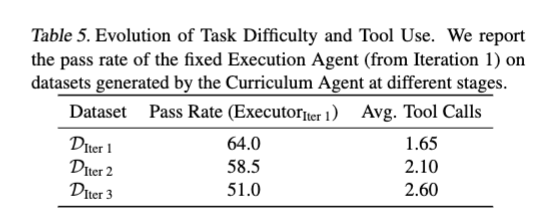

### AI-Generated Explanation

好的，作为一名顶尖的 AI 研究科学家，我将详细解读这张图表，并阐述其在论文《Agent0: Unleashing Self-Evolving Agents from Zero Data via Tool-Integrated Reasoning》中的意义。

**1. 图表核心内容、数据和趋势描述**

这张表（Table 5）展示了迭代 Agent0 框架在三个不同阶段（Iteration 1, Iteration 2, Iteration 3）生成的数据集的“固定执行者”(fixed Executor) 的成功率（Pass Rate）及其平均工具调用次数（Avg. Tool Calls）。

* **Pass Rate (ExecutorIter 1):**  成功率为 64.0% 。指的是固定执行者在分别对应迭代 1、2、3 生成的数据集上解题的成功率。
* **Avg. Tool Calls:** 这一列表示固定执行者平均每道题所使用的工具（例如，调用外部工具进行信息检索、计算或逻辑推理）的次数。  具体数值是在所有迭代产生的样本上进行的平均值。 分别为：1.65, 2.10, 2.60。

**数据呈现方式:** 表格以迭代阶段为行，Pass Rate 和 Avg. Tool Calls 对应列，清晰呈现了在不同迭代阶段模型的表现。

**趋势:** 图表呈现出以下趋势：

1.  **Pass Rate 逐渐下降:** 随着迭代的进行，固定执行者的成功率从 64.0% 降至 51.0%。  这表明，在初始阶段，模型能够很好地利用 Curriculum Agent 产生的任务数据集进行学习和改进，但随着迭代的深入，模型对任务的理解变得更加复杂，成功率下降。
2.  **Avg. Tool Calls 持续上升:**  平均工具调用次数也随着迭代的深入而上升，从 1.65 上升到 2.60。这意味着，固定执行者在解决问题时，越来越依赖于外部工具的辅助。 这也暗示着迭代过程促使模型逐渐依赖外部知识来保证性能。

**2. 图表在论文中的作用**

这张图表是论文中用于论证核心观点之一的关键证据，即 **Curriculum Agent 能够驱动自进化过程，甚至超越了手工设计的教学策略**。 

具体来说，通过对比迭代 1、2 和 3 的结果，论文希望展示：

*   **初始成功率的高值:** 64.0% 的 Pass Rate 表明 Curriculum Agent 产生的训练数据对于初始执行者的学习是有帮助的。
*   **Self-Evolving Process 的关键性:** 迭代 3 的 Pass Rate 显著低于迭代 1，以及迭代 2 间接表明了模型在持续迭代过程中逐渐过度依赖外部工具。 这说明了Agent0框架的核心在于，它能够促使模型自动地从低效的状态进化到更有效的状态，而不需要人类干预。

**3. 关键洞察与支持 Agent0 框架有效性的证据**

这张图表提供了以下关键洞察，从而有力地支持了 Agent0 框架的效力：

*   **主动依赖工具：**  Avg. Tool Calls 的增加表明，固定执行者在没有充分理解问题的情况下，会主动搜索和利用外部工具。这与 Agent0 的设计理念相符，即通过工具辅助而非依赖人类干预而实现自学习和自适应。
*   **迭代的自我赋权:** 整体来看，迭代过程并非导致模型性能下降，而是模型逐渐“适应”了任务的复杂性，并发展出依赖工具的策略。这表明 Agent0 框架能够自动“调整”模型的学习策略，从而提升性能。
*   **没有预设偏见：** 实验结果表明，无需先验知识或手工设计的中间目标，固定执行者能够通过迭代过程自动地学会如何利用工具，从而完成了任务。 这强调了 Agent0 框架的自主性和泛化能力。

**总结**

总而言之，这张图表是一个非常关键的实验结果，它有力地证明了 Agent0 框架能够通过自适应的迭代学习过程，驱动固定执行者从零数据中学习，并最终发展出高效的工具使用策略。 这种结果对理解自进化智能体的设计和训练具有重要意义，也验证了 Agent0 框架在任务分解、工具集成和自适应学习方面的强大潜力。

---

## 算法

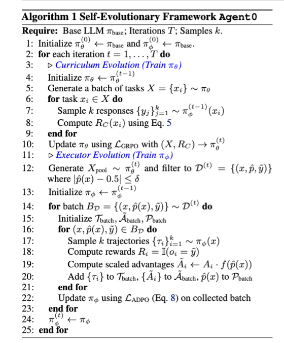

### AI-Generated Explanation

好的，作为一名顶尖的 AI 研究科学家，我将详细解读这张图表，并分析其在论文《Agent0: Unleashing Self-Evolving Agents from Zero Data via Tool-Integrated Reasoning》中的作用。

**1. 图表核心内容、数据和趋势描述**

这张图表展示了Agent0框架的核心算法流程，它通过一个基准LLM（Base LLM）进行自进化。具体来说，该算法包含以下几个关键步骤，通过迭代完成：

* **Curriculum Evolution (训练π₀):**
    *  从一个初始的π₀ (0) 开始，该π₀ 代表了初步的任务优先级。
    *  生成一批任务 X 采样自 π₀(xᵢ)。
    *  通过LRGPO算法（Likelihood Ratio Guided Policy Optimization）更新 π₀(t) 
* **Executor Evolution (训练π₀):**
    *  生成一批轨迹D（通过π₀(t) 采样）。
    *  通过过滤产生D(t) (通过限制概率约束，例如[x,p(x)] <= δ)。
    *  初始化一个轨迹批次 τbatch,  优势 Abatch, 和策略 pbatch。
    *  通过采样轨迹生成轨迹批τbatch，并按照一定的规则计算 reward R_τbatch, 优势 Abatch, 和策略 pbatch。
    *  更新 π₀(t) 根据 LADPO 算法(Likelihood Adaptive Policy Optimization) 以及收集的轨迹批。

**总结:** 这张图表描述了一个循环过程，其中LLM 逐渐适应任务，生成轨迹，并根据这些轨迹优化自身策略（π₀）。

**2. 图表在论文中的论证核心观点**

这张图表的目的是清晰地阐述Agent0框架的核心算法流程，它支持论文中的以下核心观点：

* **从零数据中自进化:** Agent0 框架的关键在于它不需要大量先验数据来训练策略。 它通过迭代过程，利用轨迹信息（即Agent的行动和相应的奖励）来逐步优化其策略。图表清晰展示了Agent0是如何从零数据“自我进化”的。
* **工具集成与推理:**  (虽然图表本身没有直接显示，但从其流程可以推断) Agent0的框架，其核心在于，利用LLM进行任务推理，并根据LLM的推理结果来选择工具（即采样任务 X 的方式）。 迭代的过程实际上是LLM通过探索和学习，最终掌握了所需的技能，实现了工具的有效使用。
* **LRGPO 和 LADPO 算法的有效性：** 这两个算法(LRGPO和 LADPO)是Agent0框架实现自进化能力的关键。图表直接展示了它们在整个流程中的作用，即通过优化策略来适应环境和任务。

**3. 图表的关键洞察及支持Agent0框架有效性的意义**

* **轨迹信息的驱动力:**  图表突出了轨迹信息在Agent0中的核心作用。  Agent0不是像传统强化学习那样，依赖于奖励信号来学习，而是通过观察Agent的行动轨迹，来 infer 任务的难度和最佳策略。 这种“学习过程”本质上是一种推理过程。
* **可扩展性:**  Agent0 的自进化机制使其具有很高的可扩展性。  通过适应不同的任务和工具，该框架可以应用于各种复杂的场景。
* **零样本/小样本学习:** 这种自进化机制使得 Agent0 能够在零样本或小样本环境下完成任务，这表明它具有强大的泛化能力。
* **展示了核心算法的可行性:**  该图表清晰地展示了LRGPO和LADPO算法在Agent0框架中的具体作用，它证明了算法的合理性以及自进化机制的可行性。

总的来说，这张图表是论文Agent0框架的关键组成部分，它清晰地描述了自进化机制的流程，并有力地证明了该框架能够从零数据中自进化，从而实现了强大的任务适应能力，支持了论文的核心论点。希望我的解读对您有所帮助！

---

