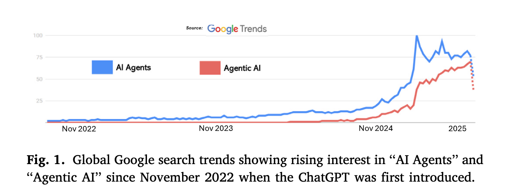
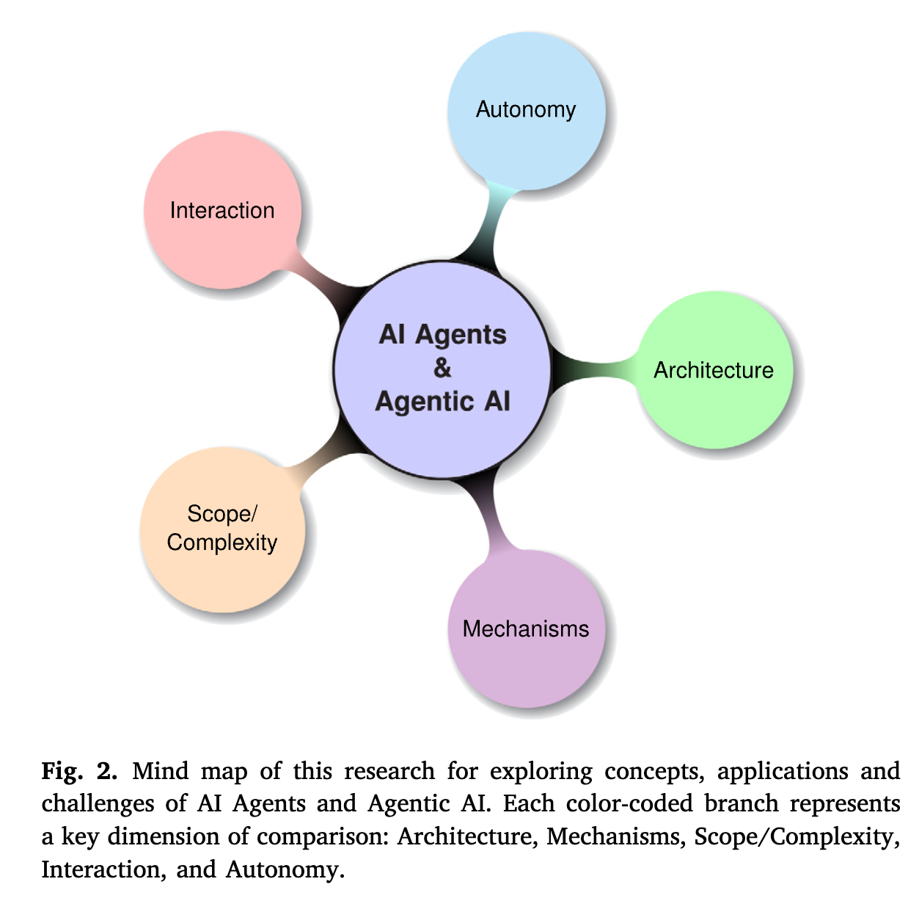
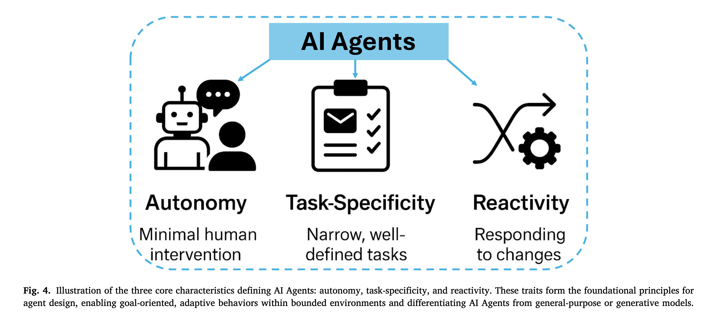
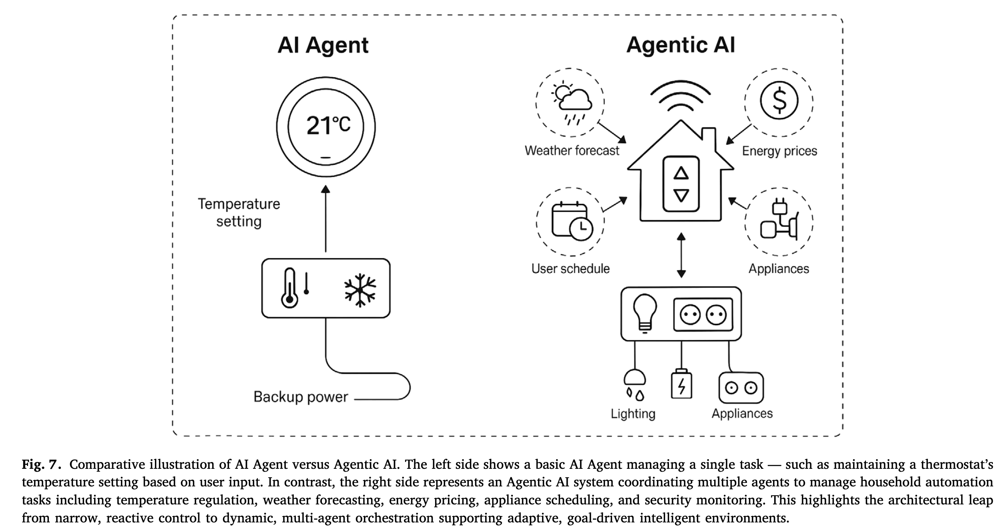
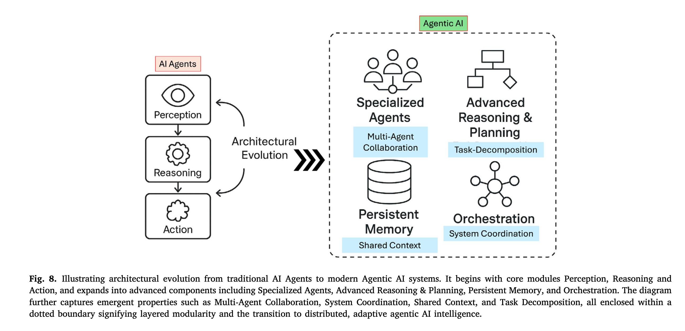
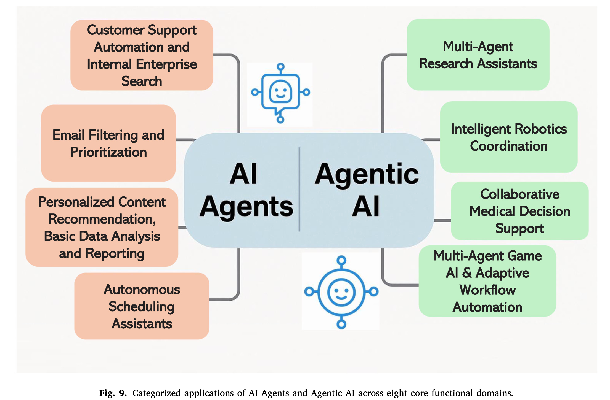
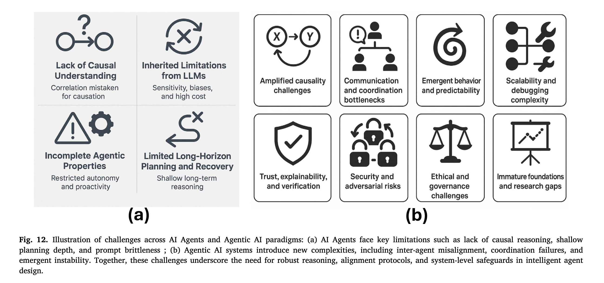
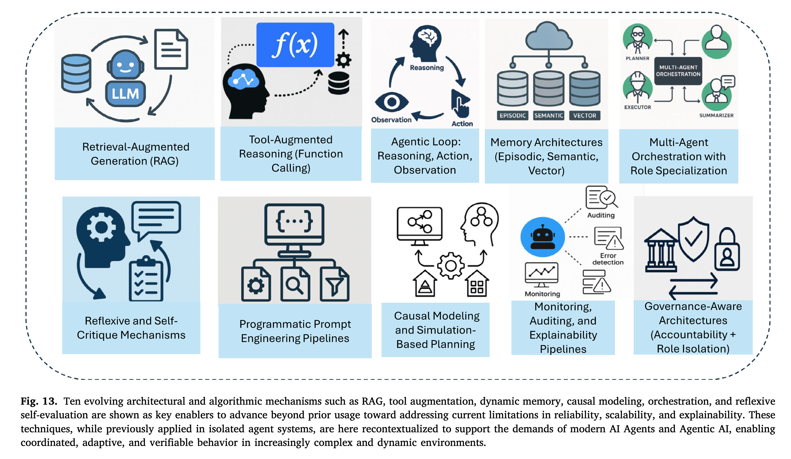

# AI Agent 与 Agentic AI：概念分类、应用与挑战

> **TL;DR**：AI Agent 和 Agentic AI 代表了两种不同的智能范式。**AI Agent** 是由 LLM 驱动的、用于自动化特定任务的**任务执行者**（如自动化客服）；而 **Agentic AI** 则是一个由多个专业代理通过协作来完成复杂目标的**协同系统**（如一个由研究、编码、测试代理组成的软件开发团队）。前者是增强的“工具”，后者是“自组织的生态”。

> **原文链接**：[https://arxiv.org/pdf/2505.10468](https://arxiv.org/pdf/2505.10468)

## 1. 背景：从经典 Agent 到 LLM 驱动的智能体

在 2022 年之前，智能代理的研究主要集中于多代理系统（MAS）和专家系统，其核心在于社会行为和分布式智能。Castelfranchi (1998) 和 Ferber (1999) 的研究为这些早期系统奠定了理论基础，定义了代理的自主性、感知和沟通等核心能力。然而，这些经典系统（如 MYCIN, DENDRAL）依赖于预定义的规则和符号逻辑，在适应动态环境方面存在局限。

随着 2022 年底生成式模型（尤其是 LLM）的出现，AI 领域发生了显著变化。谷歌趋势数据显示，全球对“AI Agents”和“Agentic AI”的搜索兴趣大幅增加。这反映了代理设计理念的转变：从静态、规则驱动的自动化，演变为由学习驱动、能够与非结构化动态输入交互的灵活架构。

## 2. 摘要：厘清两大范式

随着大型语言模型（LLM）的广泛应用，“代理（Agent）”这一概念的重要性日益凸显。然而，目前市场和学术界在区分“AI Agent”与“Agentic AI”时存在概念模糊和应用错配的问题。本文旨在通过系统的文献回顾和分析，为这两个范式提供一个清晰的分类标准，并探讨其架构演进、应用场景、核心挑战与未来方向。

-   **AI Agent**：被定义为由 LLM 驱动、用于 **特定任务自动化** 的模块化系统。它们通过工具集成（Function Calling）、提示工程（Prompt Engineering）和增强的推理能力（如 ReAct）来执行明确定义的任务，定位为 **任务执行者**。
-   **Agentic AI**：代表了一种新的 **设计范式**，其核心特征是 **多代理协作**、动态任务分解、持久化记忆和协调自治。它并非单个代理的功能增强，而是由多个专业代理组成的、能够完成复杂长期目标的 **协同系统**。

本文通过对架构、操作机制、交互方式和自主级别的评估，对这两个范式进行了比较分析，旨在为下一代智能系统的设计和评估提供参考。

## 3. 核心内容

### 3.1. 问题陈述：为何需要清晰的分类？

目前，业界对于“AI Agent”和“Agentic AI”的定义和界限缺乏统一共识。这种概念混淆不仅影响了学术交流的精确性，也导致了系统设计和应用开发中的 **理念错配（Conceptual Misalignment）**：

-   **过度设计（Over-engineering）**：使用复杂的多代理协作架构（Agentic AI）去解决本可用单个工具增强的代理（AI Agent）就能高效完成的简单任务。
-   **能力不足（Under-engineering）**：使用单代理的简单架构去应对需要复杂协作、动态规划和长期记忆的场景，导致系统脆弱、效率低下。

这种模糊性阻碍了对系统进行有效的基准测试、安全评估和资源规划。因此，建立一个明确的分类法对于指导下一代智能系统的设计、评估和部署至关重要。

### 3.2. 核心思想与方案：一个结构化的概念分类法

本文提出一个结构化的概念分类法，以区分 AI Agent 和 Agentic AI：

-   **AI Agent 的核心：任务执行者（Task Executor）**
    -   **定义**：通常是单个实体，通过调用外部工具（如API、数据库、搜索引擎）来完成特定、定义明确的任务。
    -   **智能体现**：其智能主要体现在利用工具的能力和执行单步或短链条推理（如 ReAct 模式）上。
    -   **架构**：模块化，通常是 `LLM + Tools` 的组合。
    -   **例子**：一个自动预订会议的调度助手，或一个根据指令查询天气的机器人。

-   **Agentic AI 的核心：工作流协调者（Workflow Coordinator）**
    -   **定义**：由 **多个专业代理** 组成的系统，通过内部协作、沟通和动态任务分配来完成一个复杂、高层次的目标。
    -   **智能体现**：其智能体现在系统的 **整体涌现行为（Emergent Behavior）**、**分布式认知（Distributed Cognition）** 和 **长期规划能力** 上。
    -   **架构**：复杂的多代理系统，包含专业代理、协调器（Orchestrator）或元代理（Meta-Agent）、共享内存等组件。
    -   **例子**：一个由“研究员”、“程序员”、“测试员”等多个代理协作完成软件开发的项目（如 ChatDev），或一个协同完成科学文献综述的研究团队（如 AutoGen）。

*说明：左图的 AI Agent（智能恒温器）独立执行单一任务；右图的 Agentic AI 系统协调天气、能源、安防等多个代理，实现复杂的全屋自动化。*

### 3.3. 关键技术与架构演进

从 AI Agent 到 Agentic AI 的演进，伴随着技术和架构的复杂化。

| 特征维度         | AI Agent                                 | Agentic AI                                                                 |
| :--------------- | :--------------------------------------- | :------------------------------------------------------------------------- |
| **架构**         | 单体或简单模块化（LLM + 工具）           | **多代理生态系统**（专业代理 + 协调器）                                    |
| **核心机制**     | 工具调用（Function Calling）、ReAct 循环 | **代理间通信**、**任务分解**、共享内存、角色分配                           |
| **记忆**         | 短期上下文、可选的简单记忆模块           | **持久化、多层次的记忆**（情景记忆、语义记忆、向量记忆）                   |
| **规划能力**     | 短期、启发式规划（如 CoT, ReAct）        | **长期、分层规划**，支持动态调整                                           |
| **自主性**       | 在任务范围内自主，依赖外部触发           | **高度自主**，能够自我启动、监控、反思和修正                               |
| **协调方式**     | 无需协调                                 | 通过 **中心化协调器**（如 ChatDev）或 **去中心化协议** 进行协调            |
| **代表性框架**   | LangChain, Auto-GPT (早期单代理模式)     | **AutoGen**, **CrewAI**, **MetaGPT**, **ChatDev**                          |

**Agentic AI 的架构增强**：

-   **专业代理集群 (Ensemble of Specialized Agents)**：系统由多个各司其职的代理构成（如规划者、执行者、验证者），提升了系统的模块化和可解释性。
-   **高级推理与规划 (Advanced Reasoning & Planning)**：采用更复杂的规划算法，如思维树 (Tree of Thoughts)，允许代理探索、评估和回溯多个推理路径。
-   **持久化记忆 (Persistent Memory)**：引入能够跨任务周期和会话的记忆系统，包括情景记忆、语义记忆和用于快速检索的向量记忆 (RAG)。
-   **协调层/元代理 (Orchestration Layers/Meta-Agents)**：作为 Agentic AI 的关键创新，协调器负责管理其他代理的生命周期、分配任务、解决冲突并整合结果。

### 3.4. 应用场景对比

两种范式在实际应用中展现出不同的能力范围。

-   **AI Agent 应用（聚焦效率与自动化）**：
    -   **客户支持自动化**：能够接入企业知识库，回答关于订单、退货等标准化问题。
    -   **邮件过滤与优先级排序**：自动分类邮件、提取任务并建议回复。
    -   **个性化内容推荐**：根据用户行为实时调整推荐内容。
    -   **自动化调度助手**：解析日程安排指令，自动寻找并预订会议。

-   **Agentic AI 应用（聚焦协作与复杂问题解决）**：
    -   **多代理研究助手**：协同完成文献综述、数据分析和报告撰写。
    -   **智能机器人协作**：在农业领域，无人机群、采摘机器人和运输机器人协同作业，高效完成收获任务。
    -   **协作式医疗决策支持**：诊断代理、监测代理和治疗方案代理协同工作，为医生提供决策支持。
    -   **自适应工作流自动化**：在 IT 运维或网络安全领域，系统可以自动检测异常、分析原因、模拟并执行修复方案。

### 3.5. 挑战与解决方案

从单一代理到多代理系统，挑战也变得更加复杂。

| 面临挑战           | AI Agent                                             | Agentic AI                                                                 | 提出的解决方案                                                                                                                              |
| :----------------- | :--------------------------------------------------- | :------------------------------------------------------------------------- | :------------------------------------------------------------------------------------------------------------------------------------------ |
| **幻觉与不可靠**   | 继承自 LLM，输出可能不准确。                         | **错误可能在代理间传播和放大 (Error Cascades)**，导致系统性失败。          | **RAG (Retrieval-Augmented Generation)**、**Reflexion (自我批判)**、**跨代理验证 (Cross-Agent Verification)**。                          |
| **规划能力有限**   | 难以处理长周期、复杂任务。                           | 协调开销大，可能出现 **死循环 (Infinite Loops)** 或 **目标漂移 (Goal Drift)**。 | **因果建模 (Causal Modeling)**、**仿真规划 (Simulation-Based Planning)**、**分层任务分解 (Hierarchical Task Decomposition)**。            |
| **可解释性与问责** | 单代理逻辑相对易于追踪。                             | 多代理交互产生 **涌现行为 (Emergent Behavior)**，难以溯源和问责。          | **统一的日志审计**、**角色隔离 (Role Isolation)**、**治理框架 (Governance Frameworks)**。                                                 |
| **安全风险**       | 易受提示注入 (Prompt Injection) 攻击。               | **单点被攻破可能导致系统性失效**。                                         | **沙盒环境 (Sandboxing)**、**严格的权限控制**、**代理身份验证**。                                                                           |
| **通信与协调**     | -                                                    | **通信瓶颈** 和 **语义鸿沟 (Semantic Gaps)**。                             | **标准化的通信协议 (如 Google 的 A2A)**、**共享的语义模型**。                                                                              |

## 4. 结论与未来方向

本文区分了 AI Agent 和 Agentic AI。前者是实现特定任务自动化的工具，而后者则为解决需要分布式智能和协作的复杂问题提供了新的系统范式。

**未来方向**：

1.  **AI Agent 的发展**：将朝着更强的主动性、因果推理能力和可靠性方向发展，成为具备初步预测和规划能力的辅助工具。

2.  **Agentic AI 的成熟**：将在标准化架构、高效协调协议和伦理治理方面寻求突破，并应用于法律、医疗、科研等专业领域。

3.  **自进化系统 (Self-Evolving Systems)**：如 `Absolute Zero: Reinforced Self-play Reasoning with Zero Data (AZR)` 框架所示，未来的代理系统可能通过自我博弈和可验证的反馈（如代码执行），实现零数据下的自主学习和进化。这意味着 Agentic AI 系统不仅能完成任务，还能在没有人类监督的情况下自我完善，这是该领域的一个重要发展方向。

从 AI Agent 到 Agentic AI 的演进，反映了从构建“执行指令的工具”到设计“能够协作解决问题的系统”的转变。这一进程面临诸多挑战，但也为实现更高级别的自主和协作智能系统提供了路径。
