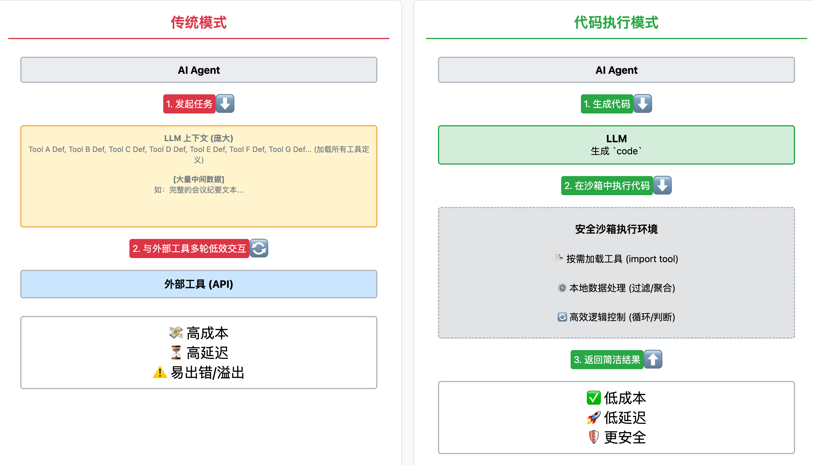
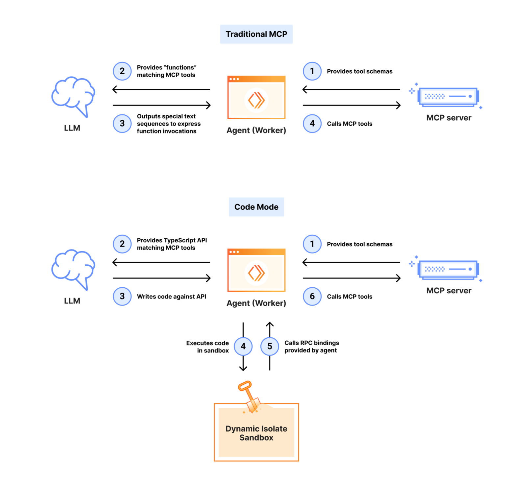
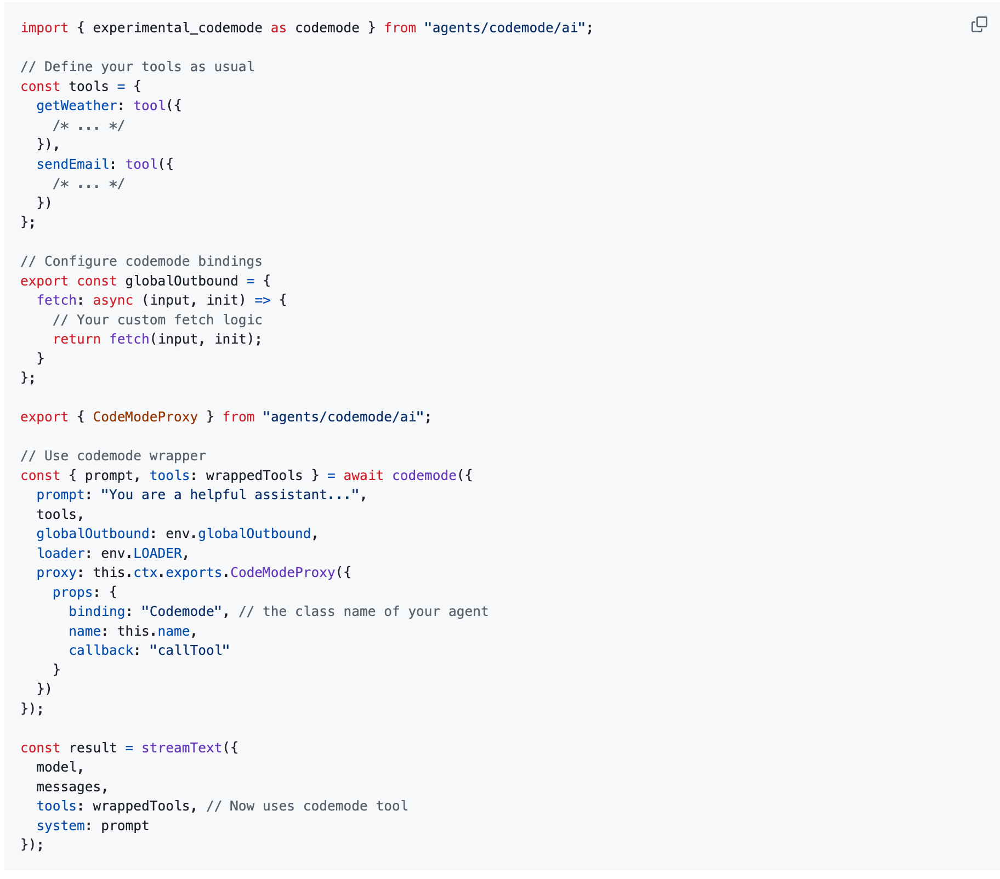

# 赋能 AI Agent：代码执行模式如何将 Token 成本降低 98%

> **核心观点 (TL;DR)**
>
> - **问题：** 传统 AI Agent 在使用大量工具时，因“上下文臃肿”（加载所有工具定义）和“数据冗余”（在工具间传递大量中间数据）而变得低效且昂贵。
> - **解决方案：** 切换到“代码执行模式”。让 Agent 不再直接调用工具，而是生成代码（如 Python/TypeScript）在一个安全的沙箱环境中执行。
> - **优势：** Agent 按需导入工具、在本地处理数据，只将最终的简洁结果返回给模型。这极大地降低了 Token 成本和延迟，同时增强了隐私保护和逻辑控制能力。本质上，是让 Agent 从“工具调用者”进化为“程序员”。

## 引言：Agent 的“工具自由”之困

AI Agent 的强大之处，在于它们能够像人类一样使用工具来与外部世界交互，完成复杂任务。从预订机票到分析财务报表，Agent 的能力边界很大程度上由其“工具箱”的丰富程度决定。为了统一 Agent 与工具之间的“语言”，[模型上下文协议（MCP）](https://modelcontextprotocol.io/) 应运而生，成为了连接 Agent 与外部世界的通用标准。

然而，当 Agent 需要调度成百上千个工具时，一个实际的问题随之出现：成本和效率。传统的 Agent 工具调用方法，例如 OpenAI Functions 或 Anthropic Tools，在规模化时会遇到瓶颈，导致上下文窗口被迅速填满，增加成本和响应延迟。这距离实现高效的自主 Agent 尚有差距。



## 传统方法的两个主要问题

为什么当工具数量增多时，Agent 会变得低效？其原因在于传统工具调用范式的两个主要问题。


### 罪状一：上下文臃肿 (Context Bloat)

传统方法要求将所有可用工具的详细定义（如函数名、参数、描述）全部放入模型的上下文（Prompt）中。

当只有几个工具时，这不成问题。但当 Agent 连接到 Google Drive、Salesforce、Slack 等多个服务，工具数量达到数百个时，这些定义本身就能占用大量 Token。模型在开始工作前，就需要处理大量可能不会用到的信息，这造成了Token的浪费。

例如，仅仅是两个简单的工具定义，就已经相当冗长：

```plaintext
gdrive.getDocument
     Description: Retrieves a document from Google Drive
     Parameters:
                documentId (required, string): The ID of the document to retrieve
                fields (optional, string): Specific fields to return
     Returns: Document object with title, body content, metadata, permissions, etc.

salesforce.updateRecord
    Description: Updates a record in Salesforce
    Parameters:
               objectType (required, string): Type of Salesforce object (Lead, Contact, Account, etc.)
               recordId (required, string): The ID of the record to update
               data (required, object): Fields to update with their new values
     Returns: Updated record object with confirmation
```

### 罪状二：数据冗余 (Data Redundancy)

此外，在多步任务中，数据会在工具调用链中被反复传递，造成数据冗余。

设想一个任务：“从 Google Drive 下载会议纪要，并将其内容更新到 Salesforce 的一条销售线索中。”

在传统模式下，Agent 的工作流程是：
1.  **调用 `gdrive.getDocument`**，获取会议纪要的全文。
2.  **模型接收**到完整的会议纪要文本（可能长达数万 Token）。
3.  **模型生成**一个新的 `salesforce.updateRecord` 调用指令，并将刚刚收到的**完整会议纪要文本**再次填入新指令的参数中。

这意味着，同一份冗长的会议纪要，在模型的上下文中流转了两次，一次作为输入，一次作为输出。如果处理的是更长的文档或复杂的数据结构，Token 消耗将呈指数级增长，甚至可能超出模型的上下文长度限制，导致任务失败。

## 解决方案：让 Agent 作为代码生成器

为解决这些问题，Anthropic 和 [Cloudflare](https://blog.cloudflare.com/code-mode/) 等公司提出了一种新的范式——**代码执行模式 (Code Execution Mode)**。



其核心思想是：**让 Agent 作为代码生成器，而不是直接的工具调用者。**

在这种模式下，模型不再生成死板的工具调用 JSON，而是直接生成一段可以被执行的代码（如 Python, TypeScript）。这段代码负责导入所需的工具、调用它们、处理数据，并将最终结果返回。

这意味着交互模式从指令式转变为编程范式。

### 实现机制：如何将工具代码化？

这个转换过程通常分为两步，通过一个构建步骤自动完成：

**1. 自动生成代码文件结构：** 系统会遍历所有连接的 MCP 服务器，为每个服务和其中的每个工具，自动生成对应的目录和代码文件。这会形成一个对开发者非常友好的文件树结构：

```plaintext
servers/
├── google-drive/
│   ├── getDocument.ts
│   └── ... (其他工具)
├── salesforce/
│   ├── updateRecord.ts
│   └── ... (其他工具)
└── ... (其他服务)
```

**2. 为每个工具生成包装器 (Wrapper)：** 每个工具文件（如 `getDocument.ts`）内部都包含一个包装函数。这个函数将原始的、基于协议的 MCP 工具调用，封装成一个标准的、具有明确类型定义的函数。

```typescript
// servers/google-drive/getDocument.ts

// 这是一个底层的客户端函数，负责实际的 MCP 通信
import { callMCPTool } from "../../../client.js";

// 定义输入和输出的类型
interface GetDocumentInput { documentId: string; }
interface GetDocumentResponse { content: string; }

// 暴露给 Agent 的包装函数
export async function getDocument(input: GetDocumentInput): Promise<GetDocumentResponse> {
  // 将函数调用转换为底层的 MCP 工具调用
  return callMCPTool<GetDocumentResponse>('google_drive__get_document', input);
}
```

通过这个机制，抽象的“工具”就变成了具体的、可供 Agent `import` 和调用的代码模块。

例如，前面那个冗长的任务现在可以被简化为一段简洁的代码：

```typescript
// Read transcript from Google Docs and add to Salesforce prospect
import * as gdrive from './servers/google-drive';
import * as salesforce from './servers/salesforce';

const transcript = (await gdrive.getDocument({ documentId: 'abc123' })).content;
await salesforce.updateRecord({
  objectType: 'SalesMeeting',
  recordId: '00Q5f000001abcXYZ',
  data: { Notes: transcript }
});
```

正如你所见，`transcript` 变量在代码执行环境中流转，模型本身无需关心其具体内容，节省了上下文空间。Anthropic 的报告指出，通过这种方式，Token 使用量可以从 **150,000 降至 2,000**，实现了 **98.7%** 的优化。


这个有源码实现：https://github.com/cloudflare/agents/blob/main/packages/agents/src/codemode/ai.ts


（tool1, tool2, tool3, ...）=> (codeMode)  把N个工具转换成一个工具，这个工具帮你找到正确的工具...


封装旧的工具后，提供几个meta工具..
也可以看成通过多次交互，减少mcp token太多...

## 代码执行模式的四个主要优势

这种范式转变为 Agent 带来了四个主要优势：

### 优势一：提升效率 (Increased Efficiency)

-   **按需加载 (Progressive Disclosure)**: Agent 通过探索文件系统（`ls ./servers/`）或使用 `search_tools` 函数来发现可用的工具。它只 `import` 当前任务所需的模块，而不是在开始时就加载整个工具库。
-   **本地数据处理**: 在处理海量数据时，Agent 可以在代码执行环境中先进行过滤、聚合或转换，只将最关键、最简洁的结果返回给模型。比如，从一个包含 10,000 行的电子表格中筛选出 5 条“待处理”的订单，模型看到的将是 5 行，而不是 10,000 行。

```typescript
// With code execution - filter in the execution environment
const allRows = await gdrive.getSheet({ sheetId: 'abc123' });
const pendingOrders = allRows.filter(row => row["Status"] === 'pending');
// Only return the count and a small sample to the model
console.log(`Found ${pendingOrders.length} pending orders`);
console.log(pendingOrders.slice(0, 5));
```

### 优势二：更优的控制流 (Improved Control Flow)

代码原生支持循环、条件判断和错误处理。一个在传统模式下需要多轮对话才能完成的轮询任务（例如，每 5 秒检查一次 Slack 频道是否有“部署完成”的消息），现在可以用一个 `while` 循环完成，降低了任务延迟。

```typescript
let found = false;
while (!found) {
  const messages = await slack.getChannelHistory({ channel: 'C123456' });
  found = messages.some(m => m.text.includes('deployment complete'));
  if (!found) await new Promise(r => setTimeout(r, 5000));
}
console.log('Deployment notification received');
```

### 优势三：内置的隐私保护 (Built-in Privacy Protection)

在企业级应用中，数据隐私很重要。代码执行模式解决了这个问题。由于中间数据在沙箱环境中处理，模型不会接触到原始的敏感信息（例如客户的电子邮件、电话号码）。Agent 可以在不直接访问数据的情况下完成数据迁移、处理等任务，只在最后返回一个脱敏的执行报告，如“成功更新了 500 条客户记录”。

### 优势四：可成长的“技能树” (Evolving "Skill Tree")

Agent 可以将一段成功解决特定问题的代码保存下来，形成一个可复用的“技能”。比如，将“下载 Google Sheet 并另存为 CSV”的逻辑封装成一个 `saveSheetAsCsv` 函数。这样，Agent 会积累一个技能库，在面对相似任务时能够直接调用这些高级技能，实现能力的迭代。

## 实践与挑战

引入代码执行模式需要一个安全的**沙箱执行环境**来运行 Agent 生成的不可信代码。这带来了额外的架构复杂性和安全挑战，需要对资源使用、网络访问等进行限制和监控。这是一种权衡（trade-off），开发者需要根据应用的安全需求和复杂度来决策。

## 结论

代码执行模式是对现有工具调用机制的一种范式转变。它借鉴了软件工程思想，用于解决 AI Agent 在规模化时遇到的效率和成本问题。

未来的 Agent，将不再是被动的指令跟随者，而是一个主动的代码创作者。通过赋予 Agent 编写和执行代码的能力，可以构建更复杂、更高效、更安全的自主智能系统。


参考论文：
- https://machinelearning.apple.com/research/codeact