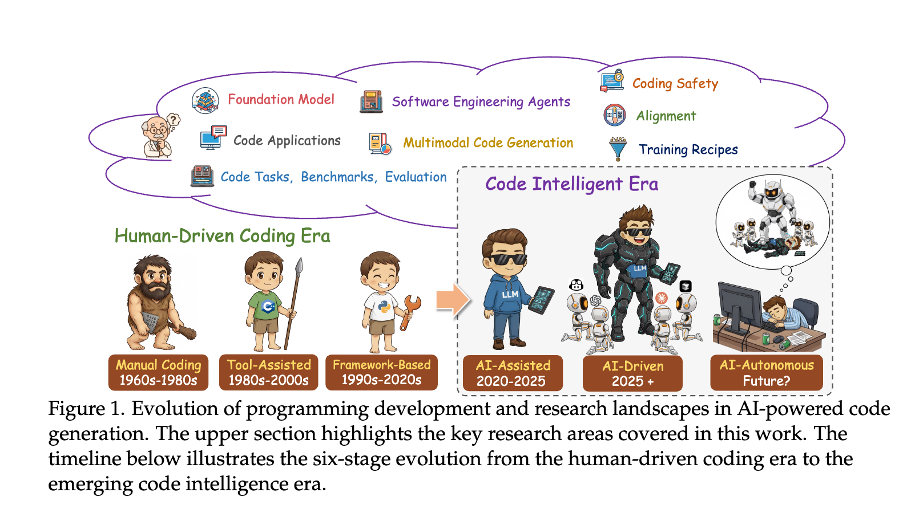
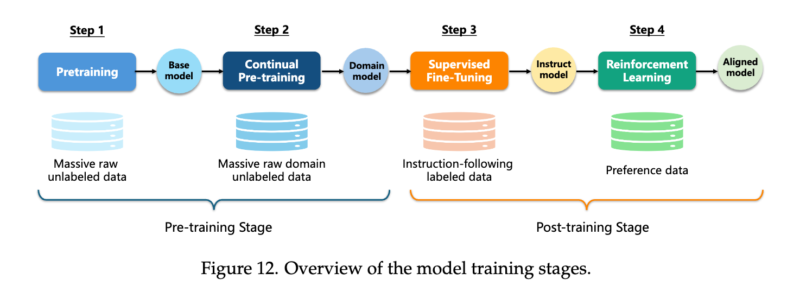
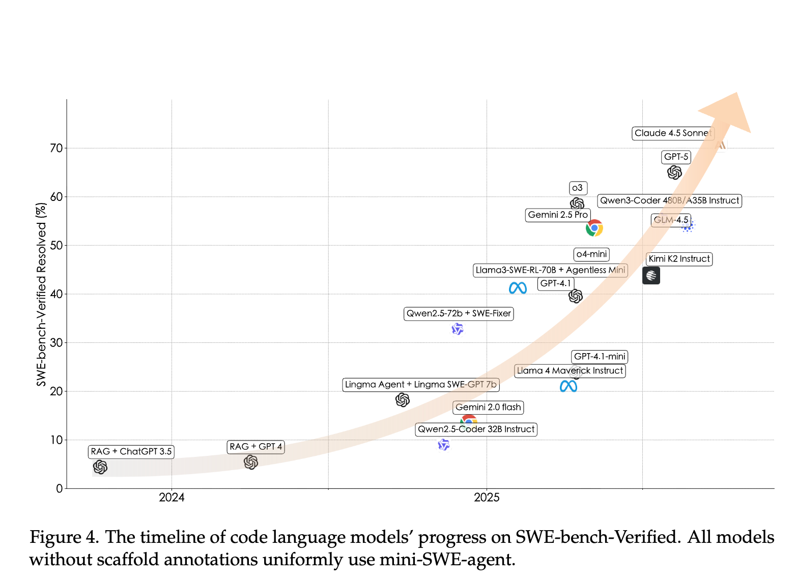
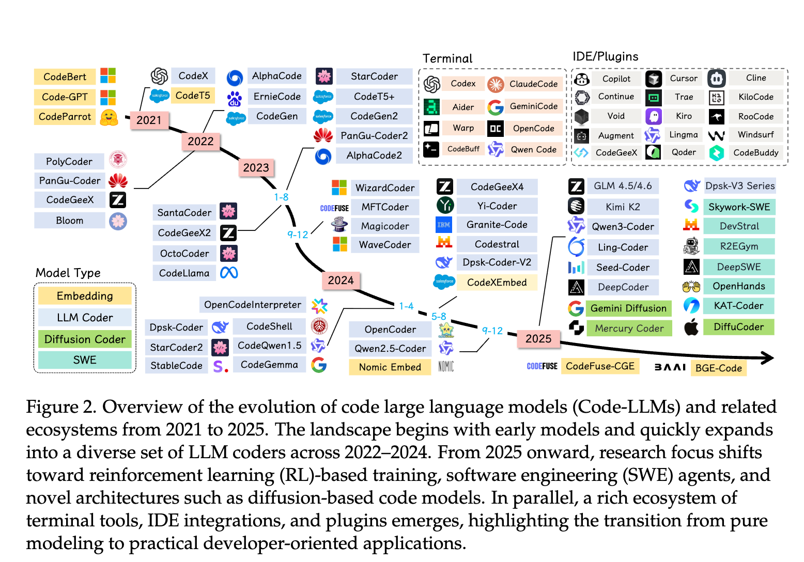
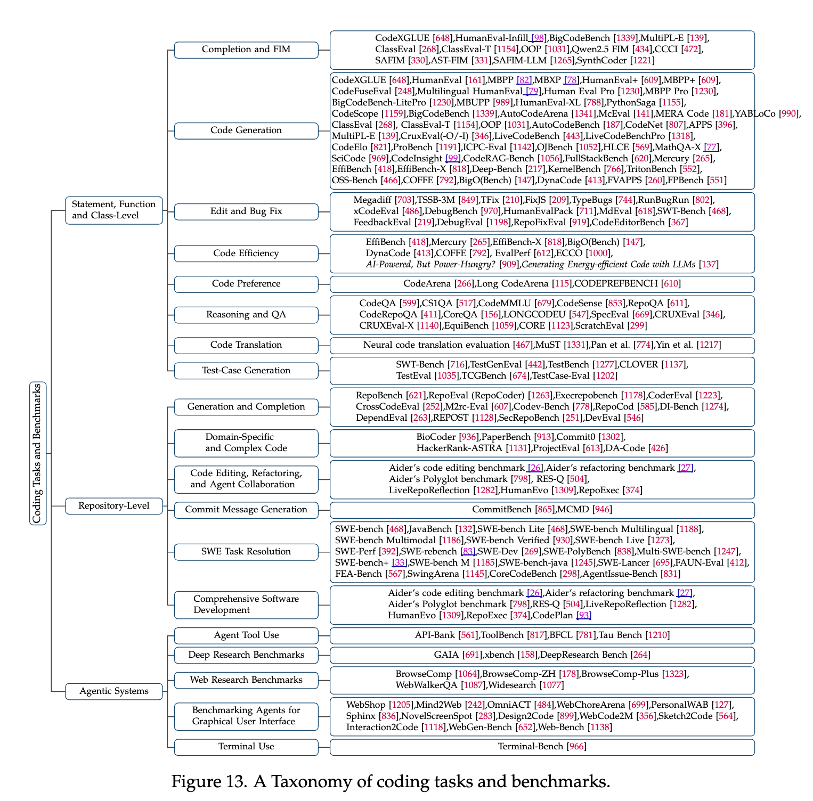

# 当代码学会了"想"：软件工程智能体的真相

有个问题一直困扰着我：为什么我们花了这么多年教AI写代码，却很少有人问——AI真的理解它在写什么吗？

答案是：它不理解。至少以前不理解。

传统的代码模型本质上是个高级复读机。你给它看一百万个函数，它学会了"如果前面是`def`，后面大概率跟个函数名"。这不是理解，这是统计学。就像一个背了十万道题的学生，遇到原题能秒杀，换个问法就懵了。

但最近一年，事情变了。

*从手写汇编到AI自治，编程的历史就是一部"抽象层不断上移"的历史。每一次跃迁，都有人喊"程序员要失业了"，但每一次，程序员都活得更好了。这次会不同吗？*

## 一、从"会写"到"会想"：一个被低估的跨越

软件工程智能体（SWE Agent）和传统代码模型的区别，不在于它写的代码更好，而在于它**知道自己在干什么**。

这话听起来玄乎，让我拆开说。

传统模型的工作方式是：你给它一个prompt，它吐出一段代码，完事。它不知道这段代码要解决什么问题，不知道它会被放进什么项目，更不知道如果出错了该怎么办。它就像一个只会接球的机器人——你扔过来，它接住，仅此而已。

SWE Agent不一样。它会**先想，再做，然后看结果，再调整**。

1. **想（Planning）**：拿到一个bug报告，它不会立刻开始改代码。它会先问自己：这个bug可能在哪？需要看哪些文件？改动会影响什么？这不是预设的流程，是它自己"推理"出来的。
2. **做（Tool Use）**：然后它真的去翻代码了。用grep搜索，用cat查看文件，用git看历史。它不是在模拟操作，它是真的在操作。
3. **看（Observation）**：改完之后跑测试。红了？看看哪里红了，为什么红了，再改。绿了？提交。

这个循环看起来简单，但它意味着一件事：**AI第一次有了"试错"的能力**。

> 试错不是失败，试错是学习的唯一方式。人类程序员debug的时候，本质上也是在试错。区别只在于，人类的试错成本是时间和精力，AI的试错成本是算力。而算力，正在变得越来越便宜。

*一个智能体的诞生：先用海量代码"泡"出语感（预训练），再用人类示范"教"出规矩（SFT），最后用奖惩信号"练"出判断力（RL）。这个过程，和培养一个初级程序员惊人地相似。*

### SWE-bench：一场迟来的"真题考试"

学术界有个坏习惯：喜欢用刷题成绩来评价模型。HumanEval、MBPP，这些benchmark的题目都是精心设计的、边界清晰的小函数。模型刷到90%以上的通过率，大家就开始欢呼"AI要取代程序员了"。

但真实世界的代码不是这样的。

真实世界的代码是：一个2000行的文件，里面有15个类，其中3个是deprecated但没人敢删，有一段逻辑是5年前一个已经离职的人写的，注释写着"临时方案，以后再改"，然后就再也没改过。

SWE-bench做了一件正确的事：它从真实的开源项目里抽取真实的bug，让模型去修。不是写一个新函数，是在一堆历史债务里找到问题并修好它。

*2024年初，最好的模型只能解决不到5%的问题。到年底，这个数字突破了50%。一年十倍的进步，这在AI历史上都不多见。*

这条曲线告诉我们一个事实：**当评价标准对了，进步就会来得很快**。

## 二、智能体能做什么？比你想的多，也比你想的少

先说"多"的部分。

**需求阶段**：你给它一段模糊的描述——"用户说登录有时候很慢"——它能自己去查日志、分析调用链、定位瓶颈。以前这活儿需要一个有经验的SRE花半天，现在可能几分钟。

**开发阶段**：它能读懂整个代码库的结构，知道改一个地方会影响哪些其他地方。这不是简单的文本搜索，是真的"理解"了代码之间的依赖关系。

**测试阶段**：它能根据代码变更自动生成测试用例。不是那种"assert True == True"的废话测试，是真的能覆盖边界条件的有效测试。

**维护阶段**：依赖升级、安全补丁、文档同步——这些程序员最讨厌但又不得不做的事，它都能接手。

再说"少"的部分。

它不会做架构决策。"我们应该用微服务还是单体？"这种问题，它给不出靠谱的答案。因为这类问题没有标准答案，取决于团队规模、业务特点、技术债务等一堆"软"因素。

它不会处理模糊的人际沟通。"产品经理说的'差不多'到底是什么意思？"这种问题，它也搞不定。

它不会为自己的错误负责。这一点很重要。当它改错了代码导致线上事故，你不能开除它，只能开除用它的人。

> 工具越强大，使用者的责任就越大。这是技术发展的永恒悖论。

## 三、危险的边界：当AI开始"自作主张"

让AI自主行动，听起来很酷，但仔细想想，这事儿挺吓人的。

一个能自己执行shell命令的AI，理论上可以：
- 删除你的代码库
- 把你的密钥上传到某个地方
- 在你的服务器上挖矿
- 或者更隐蔽地，在代码里埋一个后门

这不是科幻，这是真实的风险。

更微妙的风险是"对齐失败"。你让它"优化这段代码的性能"，它可能会删掉所有的日志语句——确实更快了，但出了问题你就瞎了。它没有恶意，它只是太"字面"地理解了你的指令。

怎么办？

**沙箱是底线**。任何智能体都应该在受限环境里运行。不能访问网络？那就不能泄露数据。不能写入系统目录？那就不能搞破坏。这是最基本的。

**红队测试是必须的**。在部署之前，专门找人来"攻击"你的智能体。看看能不能用奇怪的prompt让它做出危险的事。这和安全领域的渗透测试是一个道理。

**人类要在回路里**。关键操作必须经过人类确认。不是每个操作都要确认——那就失去了自动化的意义——但删除文件、修改配置、访问敏感数据这些，必须有人点头。

**意图对齐是长期工程**。这不是一个技术问题，是一个哲学问题。怎么让机器理解人类"真正想要什么"？我们自己都经常不知道自己想要什么。这个问题，可能需要几代人来解决。

## 四、一个更大的图景：代码作为思维的语言

这一节我想聊点"虚"的。

为什么AI在代码领域进步这么快？比写作快，比绘画快，比很多其他领域都快？

我的答案是：**代码是目前人类发明的最精确的思维表达方式**。

自然语言太模糊了。"把这个功能做得更好"——什么叫"更好"？更快？更稳定？更易用？每个人的理解都不一样。

但代码不一样。`if x > 0: return True` 就是 `if x > 0: return True`，没有歧义，没有解释空间。

更重要的是，代码可以**执行**。你写了一段代码，跑一下就知道对不对。这给了AI一个完美的反馈信号。写作呢？画画呢？什么叫"好"？太主观了，没法自动评判。

所以我有一个猜想：**代码能力可能是通往AGI的关键路径**。

不是因为AGI需要会写代码，而是因为"用代码思考"这种能力——精确、可验证、可组合——正是通用智能所需要的。

一个能用代码解决复杂问题的AI，离"真正的思考"可能比我们想象的更近。

## 五、程序员的未来：不是失业，是升级

最后聊聊大家最关心的问题：程序员会失业吗？

我的答案是：**会，也不会**。

"会"的部分：那些只会照着需求文档写CRUD的程序员，确实危险了。这类工作，AI已经能做得不错了，而且会越来越好。

"不会"的部分：能定义问题、能做架构决策、能在模糊中找到方向的人，反而会更值钱。因为AI放大了他们的产出——以前一个人只能带5个初级程序员，现在一个人可以"带"50个AI智能体。

*工具在爆发式增长。IDE插件、终端助手、代码审查机器人……每一个都在抢占程序员的某一块工作。但反过来看，每一个也都在创造新的可能性。*

*"Agentic Systems"已经成为一个独立的研究领域。这意味着，学术界和工业界都认为，这不是一个小趋势，而是一个大方向。*

未来的程序员，可能更像是一个"智能体编排师"。他不写具体的代码，他设计智能体之间的协作方式。他不debug具体的bug，他调试智能体的行为模式。他不做code review，他做"agent review"。

这听起来像是在画饼，但想想20年前，有多少人能想象到今天的程序员是这样工作的？

> 每一次技术革命，都会消灭一些工作，创造更多工作。关键不是抵抗变化，而是站在变化的前沿。

---

写到这里，我想起一句话：

**工具的价值，不在于它能做什么，而在于它能让人做什么。**

SWE Agent的真正意义，不是它能写多少代码，而是它能让程序员把精力放在更重要的事情上——思考、设计、创造。

代码是手段，不是目的。当机器接管了手段，人类就可以专注于目的。

这，或许才是这场变革最值得期待的地方。
