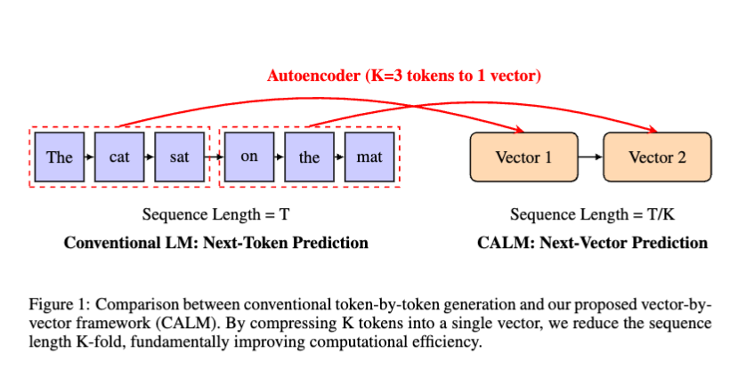
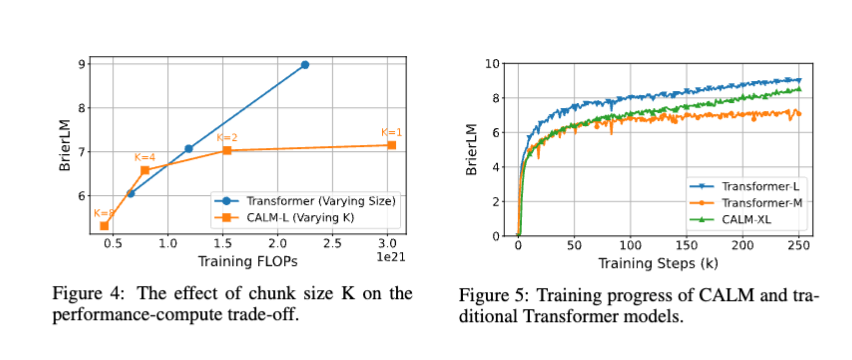

> 本文是对论文 **[CONTINUOUS AUTOREGRESSIVE LANGUAGE MODELS](https://arxiv.org/pdf/2510.27688)** (arXiv:2510.27688) 的深度解读与分析。

---

### **一句话总结 (TL;DR)**

**CALM 提出了一种全新的语言模型范式，通过“下一向量预测”取代传统的“下一词元预测”。它将多个词元（Token）压缩成一个连续向量进行生成，从而将生成步数减少 K 倍，在大幅提升效率的同时，实现了与传统模型相媲美的性能。**

---

# CALM: 下一代语言模型范式——从“下一词元”到“下一向量”

大型语言模型（LLM）已经深刻改变了人工智能领域，但其巨大的成功背后，隐藏着一个根本性的效率瓶颈：**逐词元（token-by-token）的自回归生成过程**。无论模型参数多大，算力多强，这种一个接一个“吐字”的方式都从根本上限制了其生成速度和计算效率。

今天，我们探讨一篇名为 **《Continuous Autoregressive Language Models》(CALM)** 的开创性论文。它没有在现有框架上进行渐进式改进，而是提出了一种范式级的转变，直击要害，旨在彻底打破这一效率枷锁。

CALM 的核心论点振聋发聩：**要实现效率的下一个数量级飞跃，我们必须提升每个生成步骤的“语义带宽”。**

## 一、核心思想：用“下一向量”替代“下一词元”

想象一下，我们是如何阅读和书写的。我们不是逐个字母地思考，而是以词语、短语甚至整个句子的“意群”为单位。而当前的 LLM 却像一个刚学写字的孩子，一个字母一个字母地往外蹦。一个词元（token）通常只包含 15-18 比特的信息，这与 LLM 强大的表示能力形成了鲜明对比。

CALM 提出，我们为什么不能让模型一次性预测一个更具信息量的单元呢？

为此，CALM 框架引入了一个革命性的组件：**一个高保真自动编码器（High-Fidelity Autoencoder）**。

这个编码器的作用是：
1.  **压缩**：将一个包含 `K` 个词元的文本块（token chunk）无损地压缩成一个单一的、稠密的**连续向量 `z`**。
2.  **重建**：能够从这个向量 `z` 中，以超过 99.9% 的准确率完美地重建出原始的 `K` 个词元。

*图源：原论文。左侧为传统逐词元生成，右侧为CALM的逐向量生成，序列长度缩短K倍。*

通过这种方式，语言建模的任务从**在离散的词元序列上进行“下一词元预测”**，转变为**在连续的向量序列上进行“下一向量预测”**。这直接将模型的自回归步数减少了 `K` 倍，从根本上提升了计算效率。

## 二、构建 CALM 的四大支柱

将生成对象从离散的词元变为连续的向量，意味着我们熟悉的 softmax、交叉熵损失、困惑度（Perplexity）等一套工具全部失效。为此，CALM 提出了一个全新的、完整的**无似然（Likelihood-Free）**工具箱。

### 支柱一：高保真且鲁棒的自动编码器

仅仅能完美压缩和解压是不够的。一个普通的自动编码器会学到一个极其“脆弱”的向量空间——向量中一个微小的扰动（例如，生成模型不可避免的误差）就可能导致解码出完全不相关的内容。

为了解决这个问题，CALM 做了两项关键改进：
1.  **从 AE 到 VAE**：引入**变分自动编码器（VAE）**，通过 KL 散度正则化，强制编码器学习一个平滑、连续的潜在流形（latent manifold）。这确保了相似的文本块会被映射到向量空间中相近的位置。
2.  **Dropout 增强鲁棒性**：在训练自动编码器时，对输入词元和中间的潜在向量都使用 Dropout。这迫使模型学会“冗余”地编码信息，使其对噪声和扰动具有更强的抵抗力。

最终，CALM 得到一个兼具**高保真（>99.9%重建准确率）**和**高鲁棒性**的向量表示，为下游的生成任务奠定了坚实的基础。

### 支柱二：无似然训练与“能量损失”

在连续向量空间中，我们无法计算一个概率分布，因此最大似然估计（即最小化交叉熵损失）不再适用。CALM 的解决方案是：**最小化能量分数（Energy Score）**。

这是一个源于统计学的概念，其核心思想是：**与其计算虚无缥缈的概率，不如直接衡量“生成样本”和“真实样本”之间的距离。**

能量损失函数（Energy Loss）包含两项：
1.  **保真度项**：惩罚“模型生成的向量”与“真实向量”之间的距离，鼓励模型生成的结果贴近真实。
2.  **多样性项**：惩罚“模型生成的不同向量”之间的相似性，防止模型坍缩到只生成单一的、最安全的输出。

通过优化这个能量损失，CALM 的生成模型（一个被称为 **Energy Transformer** 的轻量级生成头）可以在不需要计算任何概率的情况下，学会如何预测下一个高质量的向量。最关键的是，这个过程是**一步生成**的，避免了 Diffusion 等模型迭代采样带来的巨大推理开销。

### 支柱三：BrierLM - 为无法测量的模型打造一把标尺

没有了似然，我们失去了衡量语言模型好坏的黄金标准——**困惑度（Perplexity）**。

CALM 再次从经典理论中汲取智慧，提出了一个全新的评估指标：**BrierLM**，它基于经典的**布里尔分数（Brier Score）**。

BrierLM 的巧妙之处在于：
1.  **理论完备**：它是一个“严格正常积分规则”（Strictly Proper Scoring Rule），理论上保证了只有当模型的预测分布与真实分布完全一致时，才能获得最优分数。
2.  **无似然估计**：它的值可以通过从模型中抽取样本来无偏地估计，完全不需要知道模型的概率分布。
3.  **高度相关**：实验证明，BrierLM 与交叉熵损失具有极高的相关性（皮尔逊相关系数-0.966），证明了它作为 Perplexity 替代品的可靠性。

BrierLM 不仅解决了 CALM 的评估难题，也为其他无似然生成模型（如基于扩散的语言模型）提供了一个公平、统一的评估标准。

### 支柱四：无似然温度采样

温度采样（Temperature Sampling）是控制 LLM 生成内容创造性的关键旋钮，但它同样依赖于对 logits 概率分布的操纵。

CALM 再次提出了一个精妙的解决方案：
1.  **精确的拒绝采样**：基于“伯努利工厂”理论，设计了一种拒绝采样算法，可以从理论上完美地模拟出任意温度 `T` 下的采样分布。其核心思想是，要模拟 `P(x)^n` 的分布，只需连续采样 `n` 次，如果结果完全相同则接受。
2.  **高效的批处理近似**：由于精确算法在低温区效率极低，CALM 进一步提出了一种**批处理近似算法**。通过在一个大批次（Batch）的样本中进行组合计数，极大地提高了采样效率，并且在理论上被证明是**渐进无偏**的。

实验表明，通过调节批处理大小 `N`，CALM 可以在“准确性-多样性”的权衡曲线上，完美复现传统 Transformer 通过调节温度 `T` 所达到的效果。

## 三、惊人的成果：更少的计算，同等的性能

实验结果有力地证明了 CALM 范式的优越性：
- **更优的性能-计算边界**：在 K=4 的设置下，一个 371M 参数的 CALM 模型，其性能与一个 281M 的传统 Transformer 相当，但所需的**训练和推理 FLOPs 分别减少了 44% 和 34%**。
- **新的缩放维度**：除了模型大小和数据量，CALM 引入了第三个缩放维度——**语义带宽 `K`**。通过增加每个生成步骤所包含的信息量，为提升模型效率开辟了一条全新的、极具潜力的道路。

*图源：原论文。CALM-L (K=4) 模型在性能-计算权衡上超越了传统的Transformer缩放曲线。*

## 四、结论与未来

CALM 不仅仅是一个新模型，它是一套完整、自洽的理论与工程框架，标志着语言模型正在从离散的符号世界，向更高效、更灵活的连续表示空间迈出关键一步。

它告诉我们，与其无止境地“堆料”让模型在简单的“逐字填空”任务上内卷，不如从根本上提升任务本身的难度和信息密度，从而完全释放大参数模型的潜力。

当然，CALM 仍有巨大的优化空间，例如设计上下文感知的自动编码器、探索更强大的生成头架构等。但这篇论文无疑已经为我们指明了一条通往**超高效语言模型**的崭新路径。

---

## 附录：核心术语解释 (Glossary)

- **自回归模型 (Autoregressive Model)**
  - 一种序列生成模型，其基本思想是“下一个的输出依赖于之前所有的输出”。例如，在生成一句话时，模型会根据已经生成的词来预测下一个最可能的词。这是当前绝大多数大型语言模型（如GPT系列）的核心生成方式。

- **语义带宽 (Semantic Bandwidth)**
  - 本文用来比喻模型在单次生成步骤中所能包含的信息量。传统模型的“语义带宽”很窄（一个词元），而 CALM 通过一次性生成一个代表多个词元的向量，极大地拓宽了“语义带宽”。

- **变分自动编码器 (Variational Autoencoder, VAE)**
  - 一种深度生成模型，是自动编码器（AE）的扩展。与 AE 直接将输入映射到一个固定的点不同，VAE 将输入映射到一个概率分布（通常是高斯分布）。这使得 VAE 生成的潜在空间更加平滑和连续，非常适合进行生成任务。

- **无似然 (Likelihood-Free)**
  - 指那些无法或极难计算其输出概率密度函数的生成模型。由于 CALM 的输出是高维连续向量，无法像离散词元那样用 softmax 计算概率，因此它属于无似然模型。这类模型需要特殊的训练和评估方法。

- **能量分数 (Energy Score)**
  - 一种用于训练无似然模型的“严格正常积分规则”。它不计算概率，而是通过衡量模型生成样本与真实样本之间的“距离”（能量）来评估预测的好坏，从而指导模型优化。

- **布里尔分数 (Brier Score)**
  - 同样是一种“严格正常积分规则”，常用于评估概率预测的质量。它同时考虑了预测的准确性和校准度（即预测的置信度是否与真实频率相符）。BrierLM 是本文基于此提出的、适用于语言模型的无似然评估指标。

- **严格正常积分规则 (Strictly Proper Scoring Rule)**
  - 一类评估函数或损失函数的统称。它们具有一个重要特性：只有当模型的预测分布与数据的真实分布完全一致时，该函数才能取得理论上的最优值。这保证了模型优化的目标是“诚实地”学习真实数据分布，而不是投机取巧。交叉熵、能量分数和布里尔分数都属于此类。

## 参考文献

- Shao, C., Li, D., Meng, F., & Zhou, J. (2025). *CONTINUOUS AUTOREGRESSIVE LANGUAGE MODELS*. arXiv preprint arXiv:2510.27688.