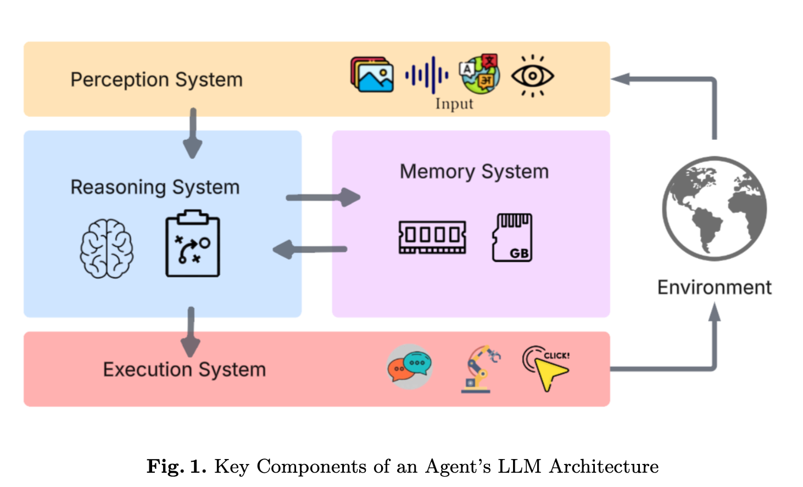
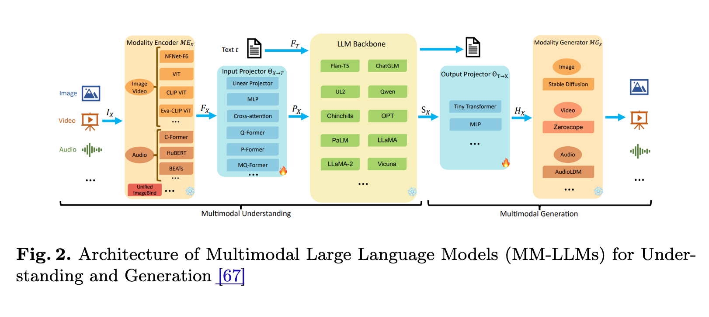
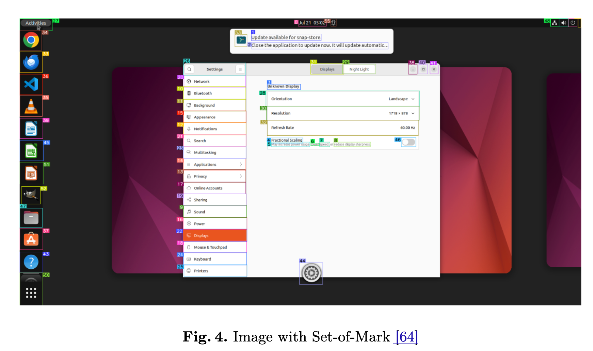
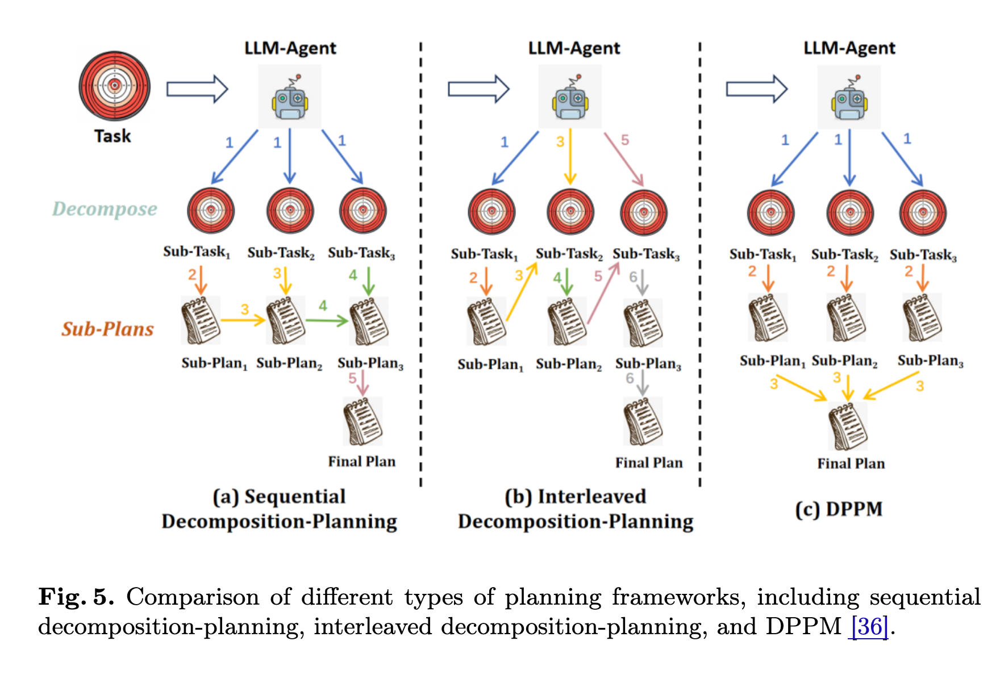

# 从“聊天框”到“行动者”：构建自主 LLM 智能体的四大组件

**原文地址**: [https://arxiv.org/pdf/2510.09244](https://arxiv.org/pdf/2510.09244)

> 一篇名为《Fundamentals of Building Autonomous LLM Agents》的综述，系统性地梳理了构建 LLM 智能体的技术全景，并提供了一个设计框架，用于指导如何将语言模型从被动的“文本生成器”转变为主动的“任务执行者”。
>
> 本文旨在解读该综述，探讨构建自主 LLM 智能体所需的四大核心组件：**感知、推理、记忆和执行**。

## 一、从“提示词工程”到“自主智能体”的演进

传统的 LLM 应用依赖于人类通过提示词（Prompt）进行引导，这是一种“人-机”协作模式。LLM 作为工具，其执行过程需要人类的持续监督和指令输入。

然而，现实世界的任务具有复杂性，通常包含多个步骤、需要与外部工具（如 API、数据库）交互，并要求在动态环境中做出决策。

因此，“自主智能体”旨在解决一个核心问题：**如何让 LLM 摆脱对人类指令的强依赖，自主地、端到端地完成复杂目标？**

该综述提出的方案是：为 LLM 构建一个模仿人类认知过程的模块化架构。

## 二、智能体的四大核心组件：一个统一架构

论文的核心思想，是将智能体的核心功能解构为四个相互协作的系统。该框架旨在为工程实践提供设计模式参考。

*图：智能体四大核心组件协同工作流程*

### 1. 感知 (Perception)：智能体的输入接口

感知系统是智能体的输入模块，负责将来自环境的原始、异构的数据，转化为 LLM 能够理解的结构化信息。论文将感知方法分为四类：纯文本、多模态、结构化数据和基于工具的感知。

#### 1.1 多模态感知 (Multimodal Perception)

对于需要与 GUI 或现实世界交互的智能体，多模态感知至关重要。这主要通过**多模态大型语言模型 (MM-LLMs)** 实现。其通用架构通常包括：
*   **模态编码器 (Modality Encoder)**：如 ViT，用于提取图像、视频等非文本数据的特征。
*   **输入投影器 (Input Projector)**：将非文本特征对齐到 LLM 的文本特征空间，充当“桥梁”。
*   **LLM 骨干 (LLM Backbone)**：作为核心推理引擎，处理对齐后的多模态输入。

为解决 MM-LLMs 在精细视觉感知（如准确定位、计数）上的不足，研究者提出了一些增强技术：
*   **集成专业视觉编码器**：例如，`VCoder` 架构额外引入处理分割图（提供对象轮廓）和深度图（提供空间关系）的视觉编码器，以增强模型的视觉理解能力。
*   **标记集操作 (Set-of-Mark, SoM)**：通过在图像上显式地标注关键区域（如给按钮加上边界框），引导模型将注意力集中在特定对象上，从而提高特定任务的性能。

#### 1.2 结构化数据感知 (Structured Data Perception)

除了直接处理视觉信息，智能体还可以通过解析结构化的环境数据来提升感知精度。
*   **可访问性树 (Accessibility Tree)**：在 GUI 自动化任务中，系统可以生成 A11y Tree，它以树状结构描述了界面上所有组件的层级关系、角色和状态（如 `button`, `text field`）。`OSCAR` 等智能体利用此信息进行更可靠的组件定位。
*   **HTML DOM**: 在 Web 任务中，智能体可以直接解析页面的 HTML DOM 树，获取比截图更精确的元素信息和页面结构。

**对开发者的启示：**
*   **融合多种感知模式**：最强大的感知系统通常是多模态视觉和结构化数据的结合。例如，同时分析截图的视觉信息和 A11y/DOM 树的结构信息，可以实现更鲁棒的 GUI 理解。
*   **平衡精度与成本**：直接增强 MM-LLM 的成本高昂。而采用外部工具（如 SoM、专用编码器）或解析结构化数据，是在成本和性能之间取得平衡的实用策略。
*   **信息过滤**：无论是视觉还是结构化数据，都充满了噪声。感知系统需要具备过滤无关信息、提炼核心内容的能力。

### 2. 推理 (Reasoning)：智能体的决策核心

推理系统是智能体的核心决策模块，负责制定和调整计划。论文回顾了多种技术，可归纳为任务分解、多方案规划、反思机制和多智能体协作等几个方面。

#### 2.1 任务分解 (Task Decomposition)

面对复杂任务，智能体首先需要将其分解为更小、更易于管理的子任务。主要有两种分解策略：
*   **分解优先 (Decomposition First)**：该方法首先将整个任务完全分解为一系列子目标，然后依次为每个子目标制定计划。例如，`HuggingGPT` 和 `DPPM` (Decompose, Plan in Parallel, and Merge) 范式。DPPM 的特点是并行生成所有子任务的计划，最后再合并成一个全局计划，从而避免了顺序规划中可能出现的错误累积。
*   **交错分解 (Interleaved Decomposition)**：该方法将分解和规划交织在一起，一次只揭示和处理一到两个子任务，并根据环境的实时反馈动态调整后续的分解。典型的例子是 `Chain-of-Thought (CoT)` 和 `ReAct`。这种方式更加灵活，容错性更强，但在极长链条的任务中可能偏离最初的目标。

#### 2.2 多方案规划与选择 (Multi-Plan Generation and Selection)

为了提高规划的鲁棒性，智能体可以一次性生成多个候选计划，并从中选择最优的一个。
*   **基于思维链的扩展**：`Self-consistent CoT (CoT-SC)` 通过多次生成 CoT 路径并投票选出最一致的答案。`Tree-of-Thought (ToT)` 将推理过程组织成一棵树，在每个节点上探索多个可能的“想法”，并进行评估和剪枝。`Graph of Thoughts (GoT)` 进一步将其扩展为图结构，允许更灵活的思路聚合和转换。
*   **基于蒙特卡洛树搜索 (MCTS)**：`LLM-MCTS` 和 `RAP` 等方法将 LLM 作为 MCTS 的启发式函数，通过模拟和评估来探索更优的计划路径。

#### 2.3 反思机制 (Reflection)

反思是实现智能体自主学习和纠错的关键。
*   **事后反思 (Post-hoc Reflection)**：如 `Reflexion` 论文所示，智能体在完成一次任务（无论成功或失败）后，对整个行动轨迹进行评估，生成语言形式的反馈（“反思”），并将其存储在记忆中，用于指导下一次尝试。
*   **事前反思 (Anticipatory Reflection)**：如 `DEVIL'S ADVOCATE` 论文提出的，智能体在执行一个动作*之前*，主动设想可能的失败原因和替代方案。这种“自我批判”可以提前规避潜在风险，增强计划的稳健性。

#### 2.4 多智能体协作 (Multi-Agent Systems)

可以将单个智能体的不同推理功能，拆分给多个专职的“专家”智能体来协作完成，以提高模块化和效率。常见的专家角色包括：
*   **规划专家**：负责顶层任务分解和策略制定。
*   **执行专家**：负责将计划转化为具体行动。
*   **反思专家**：负责评估行动结果并提出改进建议。
*   **错误处理专家**：专门诊断和修复执行过程中的错误。

**对开发者的启示：**
*   **按需选择推理策略**：没有一种推理策略是万能的。应根据任务的复杂性、对实时性的要求和计算成本，灵活组合使用上述技术。例如，简单任务用 CoT，复杂决策用 ToT，需要高容错性的场景加入反思机制。
*   **反思是闭环的关键**：一个无法从失败中学习的智能体不是真正的自主智能体。无论是事前还是事后反思，都是构建健壮、自适应系统的核心环节。
*   **考虑多智能体架构**：对于大型复杂系统，采用多智能体协作的架构，将规划、执行、反思等职责分离，可以提高系统的可维护性和扩展性。

### 3. 记忆 (Memory)：智能体的知识库

为克服 LLM 有限上下文窗口的限制，记忆系统为智能体提供了长期存储和检索知识的能力，通常分为短期记忆和长期记忆。

*   **短期记忆 (Short-term Memory)**：即模型的上下文窗口，作为处理当前任务的临时工作区。
*   **长期记忆 (Long-term Memory)**：用于知识的持久化存储，有多种实现方式。

#### 3.1 长期记忆的实现方式

*   **具身记忆 (Embodied Memory)**：指通过持续学习（如微调）将经验和知识直接编码到模型参数（权重）中。这使得模型的行为模式会因其“经历”而改变。
*   **检索增强生成 (RAG)**：通过外部知识库（通常是向量数据库）来增强模型。当接收到查询时，系统首先从知识库中检索相关文档，然后将这些文档作为上下文连同原始查询一起提供给 LLM，以生成更准确、更具事实性的回答。
*   **SQL 数据库**：适用于存储结构化知识（如用户信息、订单数据）。通过 Text-to-SQL 技术，智能体可以将自然语言问题转换为 SQL 查询，从而与数据库进行可靠的交互。

#### 3.2 记忆中存储的数据类型

一个有效的记忆系统需要存储多种类型的数据，以支持智能体的学习和决策。
*   **经验 (Experiences)**：记录成功和失败的任务执行轨迹。即使是失败的经验，如果被明确标记，也能帮助智能体避免在未来重复犯错。一个典型的经验可以被结构化为 `(指令, [ (观察_1, 行动_1), (观察_2, 行动_2), ... ])` 的形式。
*   **程序/工作流 (Procedures/Workflows)**：从过去的经验中归纳出的可复用任务流程。例如，`Agent Workflow Memory (AWM)` 方法可以从训练样本中自动总结出常用的工作流，并在未来执行相似任务时提供给智能体作为指导。
*   **知识 (Knowledge)**：外部的、事实性的信息，如技术文档、公司规章、领域知识等。
*   **用户信息 (User Information)**：包括用户的偏好、历史活动、个人背景等。`MemoryBank` 等系统旨在通过综合历史交互信息来理解和适应用户的个性。

#### 3.3 记忆管理的挑战

*   **上下文窗口限制**：处理长文档或长对话时，需要通过截断、分块或总结等方式来管理上下文长度。
*   **记忆重复 (Memory Duplication)**：当新信息与现有记录相似时，需要机制来避免冗余。例如，可以将与同一子目标相关的多个成功行动序列，通过 LLM 总结成一个统一的计划，或者通过累加计数的方式来聚合重复信息。

**对开发者的启示：**
*   **结构化是关键**：无论是存储经验还是知识，都应尽量采用结构化的格式（如 JSON、数据库表、状态-行动-结果元组），这远比存储原始文本更利于高效检索和推理。
*   **为记忆设计生命周期**：不是所有记忆都同等重要。应考虑设计记忆的压缩、归档和遗忘机制，以确保记忆库的效率和相关性。
*   **隐私与安全**：在存储用户信息时，必须高度重视数据隐私和安全问题。

### 4. 执行 (Action)：智能体的输出接口

执行系统负责将 LLM 内部的抽象决策，转化为对环境的实际操作。这超越了简单的文本输出，进入了**多模态行动空间 (Multimodal Action Spaces)**。

#### 4.1 行动空间的主要类型

*   **工具与 API 调用 (Tool and API Integration)**：这是最基础的行动方式。智能体通过生成结构化输出（通常是 JSON），来调用预定义的函数或外部 API，以执行发送邮件、查询数据库、获取网络信息等操作。
*   **视觉界面自动化 (Visual Interface Automation)**：对于没有 API 的软件，智能体可以通过模拟人类的键鼠操作来控制 GUI。这通常结合了计算机视觉（识别截图中的按钮、文本框）和 UI 自动化框架（执行点击、输入、拖拽等）。
*   **代码生成与执行 (Code Generation and Execution)**：一种更强大和灵活的行动方式。智能体动态生成代码（如 Python, SQL, Shell 脚本）来解决特定问题，尤其适用于数据处理、复杂计算和系统集成任务。`Code Interpreter` 是这类能力的典型代表。
*   **机器人与物理系统控制 (Robotic and Physical System Control)**：在具身智能领域，LLM 智能体可以处理来自物理传感器的输入，并生成控制指令来操作机器人手臂、无人机等物理设备。

#### 4.2 执行过程中的挑战

*   **延迟与协调**：多模态操作（如视觉分析+物理动作）通常涉及不同的时间尺度，需要复杂的协调机制。
*   **错误传播**：执行环节的错误（如一次失败的点击）可能会传递给感知和推理环节，形成恶性循环。
*   **状态同步**：需要确保智能体的内部状态模型，与外部环境的真实状态保持一致。

**对开发者的启示：**
*   **为行动设计“闭环反馈”**：每次行动后，都应该有一个明确的感知步骤来验证行动是否成功、是否达到了预期效果。这是实现可靠执行的基础。
*   **从工具调用开始**：对于大多数应用，构建一个稳定、可靠的工具集是实现有效执行的第一步，也是最安全的一步。
*   **在沙箱中执行高风险操作**：对于代码执行或文件系统操作等高风险行动，必须在严格隔离的沙箱环境中进行，并设置清晰的权限边界。

## 三、从理论到现实：当前面临的挑战

尽管该框架提供了一个清晰的结构，但在现实应用中仍面临诸多挑战：

*   **推理的幻觉**：如何确保智能体在关键决策点上不产生“幻觉”？
*   **环境的复杂性**：数字世界瞬息万变，如何让智能体应对预料之外的 UI 变化或 API 错误？
*   **成本与效率**：复杂的推理和记忆系统通常需要多次 LLM 调用，这带来了高昂的成本和延迟。
*   **最终的对齐问题**：我们如何确保一个高度自主的智能体，其最终目标始终与人类的利益保持一致？

## 四、结论

该综述的价值在于为 LLM 智能体的研究和开发提供了一个通用的语言和思考框架，推动 LLM 应用开发从“提示词工程”向“智能体工程”演进。

未来，基于该框架构建的自主系统，有望在完成复杂任务方面扮演更重要的角色。这四大核心组件，是实现这一目标的技术基础。

## 五、关键术语解释 (Key Terminology)

为了帮助理解文中的核心概念，本节对关键技术术语进行简要说明。

#### 感知 (Perception)
*   **MM-LLMs (Multimodal Large Language Models)**：多模态大型语言模型。指能够同时处理和理解多种信息类型（如文本、图像、音频）的 LLM。其典型架构包含：
    *   **模态编码器 (Modality Encoder)**：负责将各种非文本输入（如图像）转换为模型可以理解的数字特征（Embeddings）。例如，Vision Transformer (ViT) 就是一种常用的图像编码器。
    *   **输入投影器 (Input Projector)**：一个适配层，负责将由模态编码器生成的特征，从其原始的特征空间“投影”或“对齐”到 LLM 所熟悉的文本特征空间。这是实现多模态信息融合的关键桥梁。
    *   **LLM 骨干 (LLM Backbone)**：指模型的核心部分，通常是一个预训练好的、强大的纯文本 LLM，负责在接收到所有对齐后的特征后进行高级的语义理解和推理。
*   **SoM (Set-of-Mark)**：标记集操作。一种视觉提示技术，通过在图像上用边界框、标签等标记出关键区域，引导模型将注意力集中在这些特定区域，以提高视觉定位和理解的准确性。
*   **A11y Tree (Accessibility Tree)**：可访问性树。操作系统或浏览器为辅助功能（如屏幕阅读器）生成的一种数据结构，它以树状层级展示了用户界面上的所有组件及其属性（如角色、名称、状态）。智能体可以解析它来获得比截图更可靠的 GUI 结构信息。

#### 推理 (Reasoning)
*   **CoT (Chain-of-Thought)**：思维链。一种提示技术，通过引导 LLM 在回答问题前，先输出一步一步的推理过程，从而提高其在复杂逻辑问题上的表现。
*   **ToT (Tree-of-Thoughts)**：思维树。CoT 的一种演进，它将推理过程组织成树状结构，允许模型在每一步探索多个不同的推理路径，并通过评估来选择最优分支，从而进行更深思熟虑的规划。
*   **ReAct (Reasoning and Acting)**：一种框架，将推理（Reasoning）和行动（Acting）交错进行。模型不仅生成思考过程，还会生成需要执行的动作（如调用工具），并根据动作返回的结果来调整下一步的思考和行动。
*   **DPPM (Decompose, Plan in Parallel, and Merge)**：分解、并行规划与合并。一种任务规划范式，先将复杂任务分解为独立的子任务，然后并行地为所有子任务生成计划，最后再将这些子计划合并成一个连贯的全局计划。

#### 记忆 (Memory)
*   **RAG (Retrieval-Augmented Generation)**：检索增强生成。一种结合了信息检索和文本生成的技术。在生成回答前，模型首先从一个外部知识库（如向量数据库）中检索相关信息，然后将这些信息作为上下文来生成更准确、更具事实性的内容。
*   **AWM (Agent Workflow Memory)**：智能体工作流记忆。一种从过往成功经验中自动总结、归纳出可复用的“工作流”或“程序”的记忆机制，用于在未来指导相似任务的执行。

