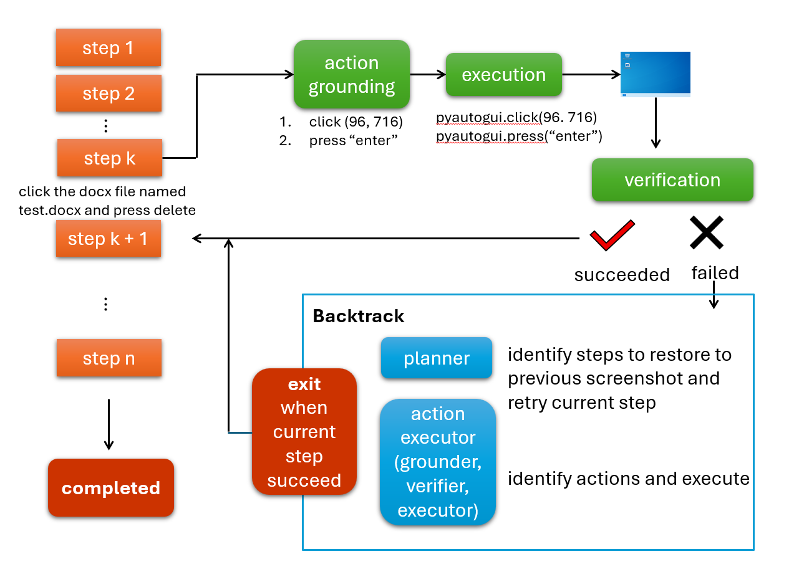
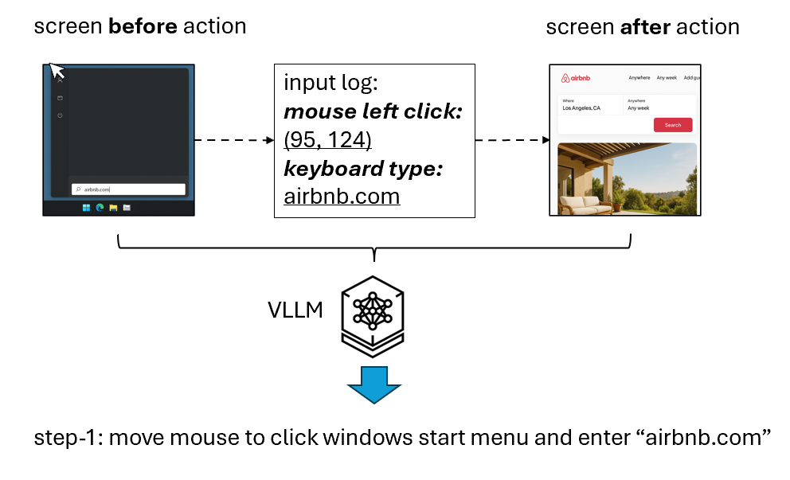

# Instruction Agent 解析：演示即编程，无需训练突破 GUI 自动化瓶颈

> **原文链接**: [Instruction Agent: Enhancing Agent with Expert Demonstration](https://arxiv.org/abs/2509.07098)
>
> **一句话总结**: 本文提出了一种基于单次专家演示 (Single Expert Demonstration) 的 GUI 自动化框架。该框架无需模型训练，仅在测试时 (Test-time) 将人类操作转化为精确的自然语言指令，并通过 Verification (验证) 和 Backtracking (回溯) 机制，在 OSWorld 高难度任务上实现了 60% 的成功率（对比基线为 0%）。


*Figure 3: Instruction Agent 架构概览。系统分为 Instructor（指令生成）和 Actor（执行与验证）两大部分。*

## 核心挑战
当前的 GUI Agent 在处理以下场景时存在显著瓶颈：
1.  **非标/复杂 UI**：面对非直观的图标或自定义控件，通用视觉模型难以理解其功能。
2.  **长序列操作**：随着步骤数增加，单步执行的累积误差导致整体成功率指数级下降。
3.  **个性化配置**：通用 Agent 倾向于使用“标准路径”，而实际工作流常涉及特定的用户习惯（如特定浏览器配置、插件使用）。

## 解决方案：Instruction Agent 框架

该方案的核心是通过**录制-转译-执行**的流程，将人类的隐式知识显式化。

### 1. Instructor：从演示到指令
Instructor 模块负责将人类的操作日志转换为结构化的、带有预期的指令。
*   **输入**：操作动作日志（鼠标/键盘事件）+ 动作前后的屏幕截图。
*   **关键处理**：
    *   **坐标注入**：在输入给 LLM 的截图中，将点击位置标记出来。这使得 LLM 能生成包含精确空间信息的描述（如 "located in the top right corner"）。
    *   **结果预期**：利用动作后的截图，Instructor 会在指令中包含该动作的预期效果（如 "this action opens the 'Bookmark added' dialog"）。
*   **输出示例**（JSON格式）：
    ```json
    {
      "action": "Left click on the blue, underlined hyperlink text 'https://minedojo.org' located below the author affiliations near the top center of the PDF document; this action opens the minedojo.org website in the default web browser."
    }
    ```


*Figure 4: 指令生成流程。利用动作前截图、动作日志和动作后截图生成包含视觉特征和预期结果的详细指令。*

### 2. Actor：执行与闭环控制
Actor 模块负责执行指令，并引入了类似控制理论的反馈机制。
*   **UI Grounding (UI-Tars 1.5)**：使用专门的 Grounding 模型将文本指令映射为屏幕坐标。
*   **Execution (GPT-4o + PyAutoGUI)**：将指令和坐标转换为具体的 Python 执行代码。
*   **Verifier (验证器)**：
    *   **机制**：对比执行前后的截图 (Screenshot Before/After) 和指令中的预期结果。
    *   **作用**：判断当前步骤是否生效。例如，点击“保存”后，验证器会检查对话框是否消失。这是防止错误累积的关键。
*   **Backtracker (回溯器)**：
    *   **触发**：当 Verifier 判定失败时触发。
    *   **逻辑**：规划一系列恢复动作（如点击“撤销”、关闭弹窗），将环境还原到步骤前的状态，然后重试。
    *   **记忆**：维护一个 Buffer 记录历史错误，避免重试时陷入死循环。

## 实验结果
在 OSWorld Benchmark 中，作者筛选了 20 个令当前 Top-3 开源 Agent (UI-Tars, Agent S2, InfantAgent) 全部失败的任务。
*   **Instruction Agent**: **60%** 成功率
*   **基线模型**: 0% 成功率
*   **消融实验**:
    *   移除 Backtracker: 降至 45%
    *   移除 Verifier + Backtracker: 降至 40%

## 工程启示 (Engineering Insights)
对于正在构建 GUI Agent 的开发者，本文提供了极具价值的实践参考：

1.  **演示优于长 Prompt (Demonstration > Prompting)**
    *   对于长尾复杂任务，与其花费大量精力编写和调试冗长的 System Prompt，不如让用户录制一段操作视频。显式的演示能消除自然语言描述的歧义，是最高效的上下文注入方式。
    *   **应用建议**：在你的 Agent 产品中加入“录屏教学”模式，作为处理 Corner Case 的兜底机制。

2.  **没有验证就没有可靠性 (Verification is Crucial)**
    *   Agent S2 等基线模型的失败（0% 成功率）很大程度上是因为“盲目自信”。Instruction Agent 引入 Verifier 后，即使不含 Backtracker 也能达到 40% 成功率。
    *   **应用建议**：不要假设 LLM 的每一个操作都会成功。必须为每一步操作设计明确的“成功状态检查” (Post-condition Check)，无论是通过截图对比还是 DOM 状态查询。

3.  **模型组合策略 (Specialist + Generalist)**
    *   本文展示了“术业有专攻”的优势：使用专门训练的 Grounding 模型 (UI-Tars) 处理坐标定位，使用通用推理模型 (GPT-4o) 处理逻辑规划和代码生成。
    *   **应用建议**：不要试图用一个端到端模型解决所有问题。将视觉感知 (Perception) 和逻辑决策 (Reasoning) 解耦，可以获得更好的精度和灵活性。

4.  **失败恢复机制 (Error Recovery)**
    *   即使有最好的计划，执行也会出错。Backtracker 模块证明了“尝试-失败-回滚-重试”机制能额外带来 15% 的成功率提升 (45% -> 60%)。
    *   **应用建议**：在设计 Agent 架构时，必须将“状态回滚”考虑在内。例如，保留操作前的快照，或者设计可逆的操作序列。

## 术语表
*   **GUI Grounding**: 将自然语言指令转化为屏幕像素坐标的过程。
*   **Training-free**: 指无需对模型权重进行梯度更新，仅通过 Prompt Engineering 和流程设计提升性能。
*   **Test-time Inference**: 指利用推理阶段的计算（如多步思考、验证）来提升结果质量，而非依赖训练阶段的知识内化。

## 参考文献
*   Li, Y., Hultquist, H., Wagle, J., & Koishida, K. (2025). Instruction Agent: Enhancing Agent with Expert Demonstration. *arXiv preprint arXiv:2509.07098*.