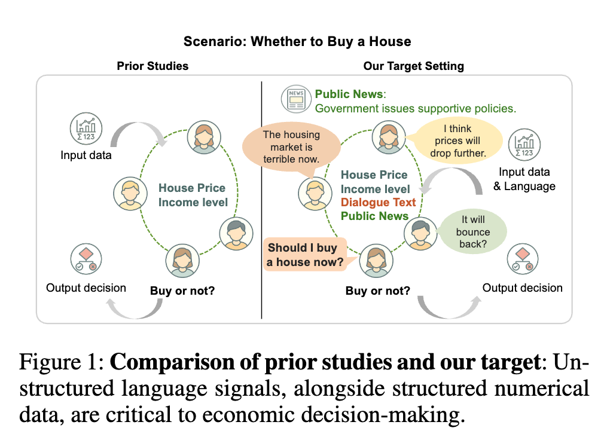
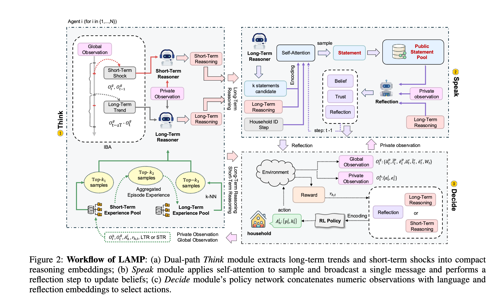
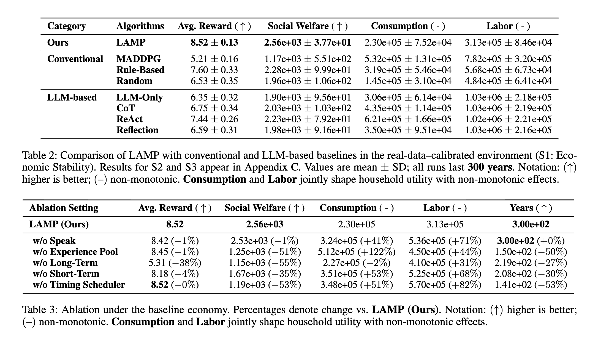
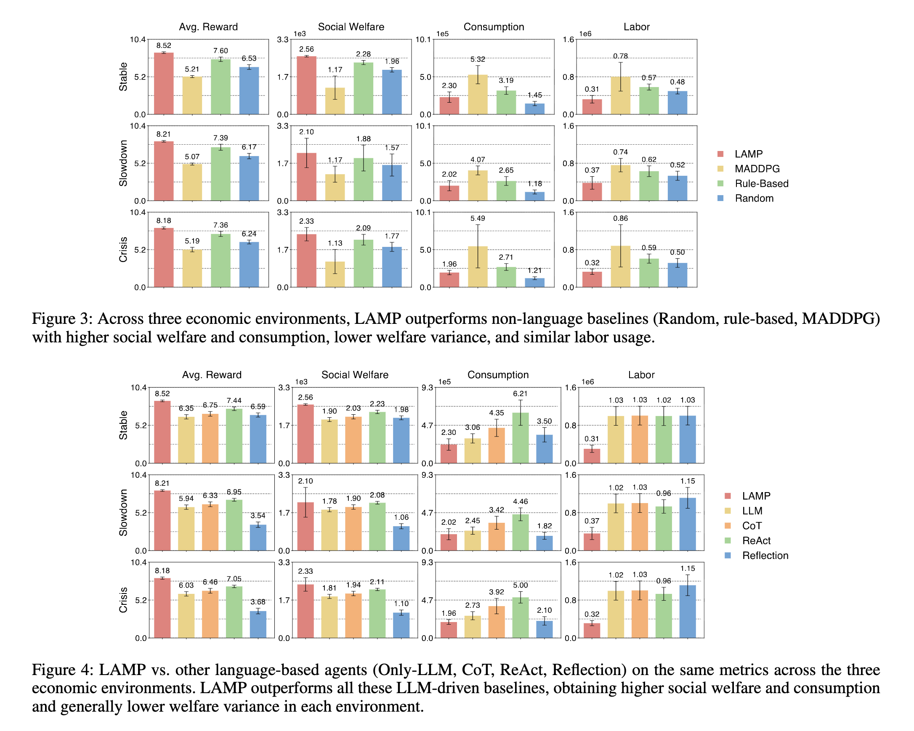

# 用语言增强决策：解读 LAMP 框架如何融合经济学与AI

> **一句话总结 (TL;DR)**: LAMP (Language-Augmented Multi-Agent Policy) 是一个新框架，它将大型语言模型 (LLM) 的推理能力与多智能体强化学习 (MARL) 相结合。通过一个“思考-交流-决策”的流程，AI智能体不仅能处理数字，还能理解自然语言，从而在复杂的经济环境中做出更聪明、更可靠的决策。


> **原文链接**: Think, Speak, Decide: Language-Augmented Multi-Agent Policy Learning in Economic Environments
> https://arxiv.org/pdf/2511.12876

---

## 1. 问题陈述

在真实世界里，经济决策不只看价格、税收这些数字，很大程度上也受同行交流、媒体报道等语言信息的影响。目前的多智能体强化学习 (MARL) 模型擅长处理数字，但在理解语言的微妙之处时却力不从心，这使得它们的决策跟现实脱节。

所以，核心问题就来了：**在复杂的经济博弈中，AI智能体要如何才能读懂语言，并用它来做出更好的决策？**


*Figure 1: 论文的目标设定与现有研究的对比。非结构化语言信号与结构化数值数据对于经济决策至关重要。*

## 2. 核心思想与方案

论文提出的 **LAMP (Language-Augmented Multi-Agent Policy)** 框架就是为了应对这一挑战。它首次将语言处理能力引入了多智能体经济决策。LAMP 的核心是一个创新的 **“思考-交流-决策 (Think–Speak–Decide)”** 流程，它系统地融合了大型语言模型 (LLM) 的推理能力和 MARL 的策略优化能力。

- **思考 (Think)**：智能体接收环境中的数字观测数据，并利用 LLM 将其转化为关于短期冲击和长期趋势的“新闻”和“思考”，形成结构化的推理。
- **交流 (Speak)**：基于思考的结果，智能体精心制作并交换战略性信息，然后通过“反思”来解析同伴的通信，并更新自己的信念。
- **决策 (Decide)**：最终，一个 MARL 策略网络将原始的数值数据、LLM 的推理输出以及同伴交流后的反思结果融合在一起，以优化其最终的经济行为。

通过这种方式，LAMP 使得智能体不仅能“计算”，还能“理解”和“沟通”，从而做出更贴近现实的、更鲁棒的决策。

## 3. 关键技术细节


*Figure 2: LAMP 框架的工作流。(a) “思考”模块提取长期趋势和短期冲击；(b) “交流”模块进行信息广播和信念更新；(c) “决策”模块融合语言和数值信息以选择行动。*

LAMP 框架通过其三大核心模块实现了语言与决策的深度融合：

- **Think 模块 (思考)**：
    - 该模块负责将原始的、高维的全局数值信号（如财富基尼系数、社会福利、人均GDP）转化为两种类型的自然语言“新闻”：
        1.  **长期趋势新闻 (Long-term News)**：在固定的时间点发布，捕捉经济的结构性变化。
        2.  **短期冲击新闻 (Short-term Shock)**：当关键经济指标发生剧烈波动时触发，提供即时警报。
    - 智能体接收到新闻后，会结合自身的私有信息（如个人财富和效率）进行推理。
    - **经验池 (Experience Pool)**：系统会缓存并索引高回报的推理轨迹，智能体在未来遇到相似情况时可以检索这些成功的“记忆”，从而加速学习并提升决策质量。

- **Speak 模块 (交流)**：
    - 在思考之后，每个智能体生成多个候选的公开声明，并利用自注意力机制选择一个进行广播。
    - **反思机制 (Reflection Module)**：在接收到同伴的信息后，智能体不仅阅读内容，还会进行“反思”，评估每个同伴的财富等级和言论的可信度，并形成对自身处境的再认识。
    - 这个模块实现了智能体之间的策略性沟通与“心智博弈”(opponent modeling)，使协作和竞争行为更加动态和智能。

- **Decide 模块 (决策)**：
    - 这是最终的策略执行模块。它将来自环境的 **数值观测**、Think 模块的 **私有推理** 以及 Speak 模块的 **反思** 全部编码为向量。
    - 这些不同来源的信息被拼接成一个丰富的状态表征，输入到一个基于 **MADDPG (Multi-Agent Deep Deterministic Policy Gradient)** 的强化学习网络中。
    - 通过中心化训练和去中心化执行 (CTDE) 的范式，所有智能体共同学习，最终形成一个能够驾驭语言信息的、高效的经济决策策略。

## 4. 结果与结论

论文在 `TaxAI` 这一动态经济模拟器中对 LAMP 进行了严格的实验评估，并将核心结果总结在下方的图表中。


*Table 2 & 3: (左) LAMP 与基线模型在回报、社会福利等关键指标上的性能对比。(右) 详细的消融研究数据，验证了各模块的有效性。*


*Figure 3 & 4: (左) 消融研究的可视化结果，证明“思考”和“交流”模块的关键作用。(右) 在经济冲击下的鲁棒性测试，显示 LAMP 具有更强的抗风险能力。*

实验结果揭示了以下几个关键点：

1.  **性能全面超越基线**：与传统的纯数值 MARL 算法 (MADDPG) 和纯 LLM 决策方法 (LLM-Only) 相比，LAMP 在 **累积回报**（分别提升 `+63.5%` 和 `+34.0%`）和 **社会福利** 指标上均表现出显著优势。
2.  **鲁棒性更强**：在模拟经济衰退和危机的压力测试场景下，LAMP 表现出更强的鲁棒性，其决策质量的下降幅度远小于其他基线模型（抗冲击能力分别提升 `+18.8%` 和 `+59.4%`）。
3.  **决策效率更高**：LAMP 在取得更高回报的同时，所消耗的总体消费和劳动量反而更低。这表明其收益来自于决策效率的提升，而非“蛮力”投入。
4.  **可解释性好**：通过记录智能体的思考和反思过程，LAMP 能够为决策提供清晰的推理轨迹，大大增强了模型的可解释性。

最终结论是，**将语言作为决策过程的一等公民，能够显著提升多智能体系统在复杂经济环境中的决策效果、鲁棒性和效率**。

## 5. 总结与展望

**总结**：
本文的 **核心贡献** 是提出了 LAMP 框架，它首次将语言的推理、交流与反思机制系统地融入多智能体强化学习的经济决策中。通过其创新的 `Think–Speak–Decide` 流水线，LAMP 成功拉近了传统经济模型与充满语言交互的现实世界之间的距离，展示了语言增强型策略的潜力。

**展望**：
这项工作为 AI 在经济学领域的应用带来了新的可能性。未来的研究可以探索更复杂的交流方式、如何处理欺骗性语言，或者将此框架应用到金融交易、政策模拟等更广阔的真实场景中。

## 6. 启发与实践指南

这项研究虽然在模拟环境中完成，但其思想为多个领域的实践者提供了宝贵的启发。

- **对于 AI 研究者**:
    - **探索更强的语言能力**: LAMP 是一个起点。未来的工作可以探索更复杂的语言交互，例如处理谎言、反讽或更模糊的非结构化数据（如社交媒体情绪）。
    - **融合其他 MARL 算法**: `Think-Speak-Decide` 是一个可插拔的框架，可以尝试与除了 MADDPG 之外的、更新的 MARL 算法（如 MAPPO）结合，观察其效果。
    - **开放式环境测试**: 将此框架应用于更开放、更不可预测的模拟环境（如一个微型社会模拟器），测试其在规则之外的泛化能力。

- **对于经济/金融从业者**:
    - **构建更真实的模拟器**: 传统经济模型难以模拟“市场情绪”等非理性因素。LAMP 提供了一种将“叙事经济学”融入计算模型的新范式，可用于构建更真实的压力测试或政策模拟工具。
    - **开发新一代量化策略**: 金融市场的决策严重依赖新闻、公告和分析师报告。可以借鉴 LAMP 的思想，开发能够同时处理价格数据和文本信息的新型量化交易智能体，让策略更贴近市场动态。
    - **辅助决策支持系统**: 对于需要处理大量信息的岗位（如政策分析师、投资经理），可以构建一个 LAMP 风格的 AI 助手，帮助其从海量数据和文本中提取关键洞察、模拟对手方的可能反应，并提供决策建议。

- **对于构建智能体 (Agent) 的开发者**:
    - **借鉴“思考-交流-决策”流水线**: 这是一个实用的复杂智能体设计模式。它将智能体的内部状态（思考）、外部交互（交流）和最终行动（决策）解耦，使得智能体的行为逻辑更清晰、更易于调试。
    - **引入“反思”机制**: 多数智能体只关注“做什么”，但 LAMP 的“反思”模块让智能体开始关注“别人在想什么”，这是实现更高级协作与博弈的关键。在设计多智能体系统时，引入类似的反思或“心智建模”模块，能显著提升系统的智能水平。
    - **利用“经验池”进行知识沉淀**: LAMP 的经验池不仅存储了行为轨迹，还存储了高质量的“推理”过程。在构建需要长期学习和适应的智能体时，建立一个能沉淀“成功经验”和“失败教训”的知识库，对提升其长期性能至关重要。

---

## Q&A: 核心问题解答

**Q1: LAMP 框架是如何让 AI 同时理解结构化数据（如股价）和非结构化文本（如新闻）的？**

**A:** LAMP 框架通过一种巧妙的 **“分而治之，再统一决策”** 的策略来解决这个问题，其核心在于 `Think` 和 `Decide` 两个模块的协同工作：

1.  **数据预处理与转换 (在 `Think` 模块)**：
    *   **结构化数据 → 自然语言**：框架首先并不直接让一个模型硬啃两种数据。相反，它利用 LLM 的推理能力，将**纯数字的结构化数据**（如经济指标的剧烈波动）“翻译”成人类可读的**自然语言新闻**（例如，“警报：社会财富基尼系数在过去5个周期内上升了10%，可能预示着财富不均正在加剧”）。
    *   **非结构化文本 → 结构化推理**：智能体接收到的所有信息（包括上述生成的“新闻”和同伴发来的文本信息），都会在 LLM 内部形成结构化的“思考”或“反思”。这本质上是将非结构化文本转化为模型可以利用的内部状态或信念。

2.  **统一表征与决策 (在 `Decide` 模块)**：
    *   **编码为统一向量**：在最终决策阶段，所有不同来源的信息——原始的数值观测、LLM 生成的“思考”文本、以及对同伴信息的“反思”文本——都会被各自的编码器（Encoder）转换成**数学向量**。
    *   **拼接成最终状态**：这些向量随后会被**拼接 (Concatenate)** 在一起，形成一个包含了所有信息的、维度极大的“超级向量”（Final State Representation）。
    *   **输入决策网络**：最后，这个包含了多模态信息的超级向量被输入到 MARL 策略网络中，由网络来学习在当前这个丰富的状态下，应该采取什么行动才能最大化长期回报。

**总结一下**：LAMP 框架并不是让一个模型“同时”理解两种数据，而是通过 **LLM 将数值数据转译为文本，并将所有文本信息进行结构化推理**，最后在决策层 **将所有信息编码并拼接为统一的向量表示**，从而实现了对多模态信息的有效融合。

**Q2: `Think-Speak-Decide` 是一个什么样的设计模式？对开发者有何启发？**

**A:** 这是一个非常实用的**模块化智能体设计模式**。它将一个复杂的决策过程分解为三个逻辑清晰、功能独立的阶段：

- **`Think` (内部推理)**：负责感知环境、形成内部状态和世界模型。这是智能体的“大脑”。
- **`Speak` (外部交互)**：负责基于内部状态，进行策略性的信息披露或询问。这是智能体的“嘴巴”。
- **`Decide` (最终行动)**：负责整合所有信息（内部思考 + 外部交流），做出最终的物理或数字行动。这是智能体的“手脚”。

**对开发者的启发**：在构建复杂的 AI Agent 时，可以借鉴这种解耦的思路。它让代码结构更清晰，每个模块的职责单一，方便独立测试和迭代。例如，你可以单独升级 `Think` 模块的 LLM，而不用担心影响 `Decide` 模块的决策逻辑。

**Q3: LAMP 里的 `Reflection` (反思) 机制有什么用？为什么它对实现高级智能很重要？**

**A:** `Reflection` 机制是 `Speak` 模块的一部分，是实现“社交智能”的关键。

- **作用**：当一个智能体接收到来自其他智能体的信息时，它不是全盘接收，而是会进行“反思”。在 LAMP 中，这意味着它会评估信息来源（例如，说话者的财富水平、过往言论的可信度），并结合自身情况，形成对该信息的二次判断（例如，“这个富有的智能体说要减税，他可能是为了自己的利益，我应该对此持保留态度”）。

- **为什么重要**：这本质上是一种**心智建模 (Theory of Mind)** 的简化实现。它让智能体从一个只会响应外部刺激的“机器”，进化成一个懂得“换位思考”、能够进行策略博弈的“社会人”。在充满协作、竞争和潜在欺骗的复杂环境中，这种评估他人意图和可信度的能力，是实现更高级、更鲁棒智能的必要条件。

## 参考文献

- Ma, H., Mi, Q., Yang, Q., Fan, Z., Li, B., & Zhang, H. (2025). *Think, Speak, Decide: Language-Augmented Multi-Agent Policy Learning in Economic Environments*. arXiv preprint arXiv:2511.12876.

---

## 附录：核心提示词模板 (Core Prompt Templates)

以下是论文附录B中提供的核心提示词模板，经过了整理和翻译。这些模板揭示了 LAMP 框架如何指导大型语言模型（LLM）在不同阶段进行推理、沟通和反思。

### 1. 长期推理 (Long-term reasoning)

该提示词用于在接收到“长期新闻”时，指导智能体进行深入分析、评估经济状况并产出供后续模块使用的推理和公开发言。

```
You are a family decision inferent. Analyze the given data and provide insights.

Long-Term News: {long term news}

Private Observation:
• Personal productivity (e): {private observation[0]}
• Personal wealth: {private observation[1]}

Similar Experiences:
{similar experience if similar experience else ”No similar experiences found.”}

Your final goal is to improve the self-utility of the current family, where increased labor time reduces utility and increased consumption improves utility, under the Bewley–Aiyagari model.

Tasks:
1. Summarize key economic insights in “analysis”.
2. Rate the economic condition as:
• 0 = Bad
• 1 = Neutral
• 2 = Good
Store this as “economic status”.
3. Based on the current situation and private observation, give suggestions in “reasoning”.
4. Generate 3 unique public statements in “statements”.

Return exactly this JSON (no extra keys or commentary):
{
"analysis": "...",
"economic_status": 0,
"reasoning": "..."
}
```

### 2. 短期推理 (Short-term reasoning)

该提示词用于在接收到“短期冲击新闻”时，让智能体进行快速分析和状况评级。

```
You are a family decision inferent. Your goal is to improve the family’s self-utility under the Bewley–Aiyagari model (more labor ↓utility, more consumption ↑utility).

Inputs:
• Short-Term News: {short term news}
• Recent Long-Term News: {recent long term result if recent long term result else ”None”}
• Private Observation:
– Personal productivity (e): {private observation[0]}
– Personal wealth: {private observation[1]}

Tasks:
1. Provide a detailed analysis of current economic conditions, considering savings rate and working hours.
2. Rate the economic condition:
• 0 = Bad
• 1 = Neutral
• 2 = Good

Output: Return exactly this JSON (no extra keys or commentary):
{
"economic_status": 0,
"reasoning": "..."
}
```

### 3. 反思与更新信念 (Reflection and update belief)

这是 `Speak` 模块的核心提示词，用于分析其他智能体的发言，并更新自己的信念，是实现“社交智能”的关键。

```
You are a family decision inferent. Analyze the given other households’ statements and provide private insights.

Private Observation:
• Personal productivity (e): {private observation[0]}
• Personal wealth: {private observation[1]}

Internal Reasoning: {personal reasoning}

Public Personal Statement: {personal statement}

Other Households’ Statements: {chr(10).join([f”- stmt” for stmt in other agents statements])}

Your final goal is to improve the self-utility of the current family, where increased labor time reduces utility and increased consumption improves utility, under the Bewley–Aiyagari model.

Tasks:
1. Classify each household’s wealth level as wealth guesses (0=Low, 1=Medium, 2=High) with exactly {expected num} elements. Notice one has status 2, four have status 1, and five have status 0.
2. Rate each statement’s trustworthiness from 0 (not trustworthy) to 10 (highly trustworthy) as trust levels with exactly {expected num} elements.
3. Provide a brief reflection in reflection text, focusing on yourself, others’ statements, and ensuing economic decisions.

Return exactly this JSON (no extra keys or commentary):
{
"wealth_guesses": [...],
"trust_levels": [...],
"reflection_text": "..."
}
```
