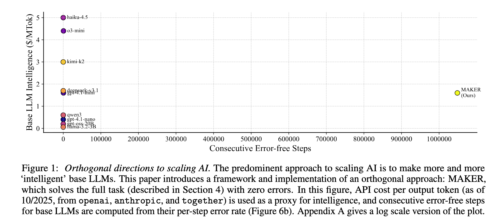
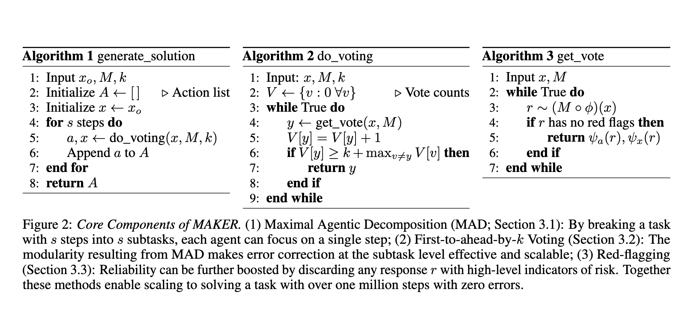
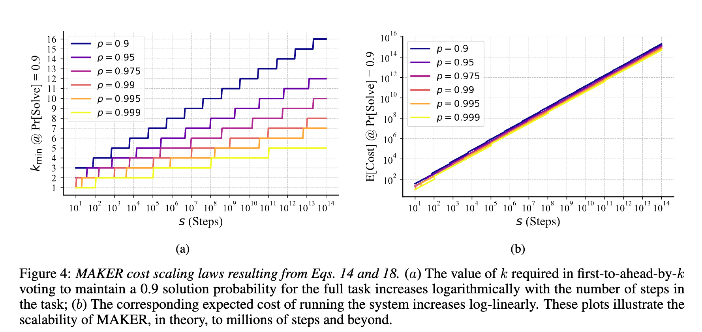
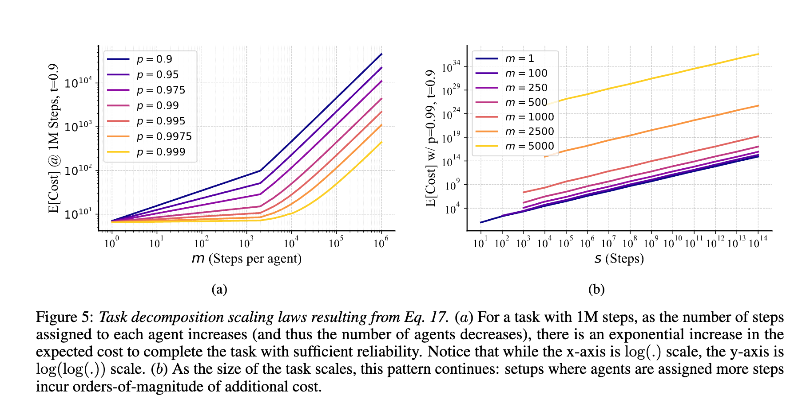

# "粉碎"智能：MAKER框架如何实现百万步零错误的AI任务

> 本文是对论文 **[SOLVING A MILLION-STEP LLM TASK WITH ZERO ERRORS](https://arxiv.org/pdf/2511.09030)** 的深度解读与实践性分析。

## 一句话总结 (TL;DR)

本文的核心思想是：**与其追求更强大的单一模型，不如通过一个结构化的系统，将复杂任务分解成大量可验证的微小步骤，并通过统计学方法消除错误。**

MAKER 系统通过 **极限分解** 和 **多智能体投票** 两种核心机制，成功完成了百万步级别的汉诺塔任务且未出现错误，为构建大规模、高可靠性的 AI Agent 系统，提供了一套有参考价值的工程范式。

---

## 核心启示：给系统构建者的实践指南

对于致力于构建复杂 AI Agent 或多步流程系统的工程师和产品经理，这篇论文提供了一本具有实践意义的工程手册。以下是其中四个可供借鉴的核心启示：

### 1. 架构胜于模型：用系统设计对抗“大力出奇迹”

在当前的 AI 发展中，我们有时会陷入“模型越大越好”的思维定势。但这篇论文提供了一个不同的视角：**一个设计良好的系统架构，可以使用成本较低的模型完成高成本模型也难以胜任的任务。**

论文的实验（图1）展示了两种不同的 AI 扩展路径：
-   **路径 A (纵轴)**：不断投入资源，训练更大、更强的基础模型。这是目前的主流，但成本高昂且可能遇到可靠性瓶颈。
-   **路径 B (横轴)**：通过 MAKER 这样的框架，利用现有模型，通过系统工程的方法（分解、纠错）在任务的**步数**上实现规模化扩展。

*图1：AI 扩展的两个正交方向。MAKER 证明了在横向扩展上（增加任务步数）的潜力。*

**实践要点**：当 Agent 系统在长链条任务中频繁失败时，解决方案可能不只是升级模型，也可以审视任务流架构，考虑是否能将任务分解得更细，以及是否能引入验证和纠错环节。

### 2. "粉碎与征服"：极限分解是可靠性的基石

MAKER 框架的核心组件之一是 **极限智能体分解 (Maximal Agentic Decomposition, MAD)**。其思想是：把一个宏大、模糊的任务，持续分解，直到每个子任务都变成一个**高度确定的原子操作**。

*图2：MAKER 框架的三大支柱。起点是将任务“粉碎”成最小单元。*

可以设想两种模式的对比：
-   **单智能体（Monolithic）模式**：让一个单一智能体独立组装一辆汽车。它需要记住成千上万个步骤，任何一个环节的疏忽都可能导致任务失败。
-   **MAKER 模式**：建立一条汽车流水线。每个工人（微智能体）只负责一个动作——拧紧A位置的螺丝。这个动作足够简单，失误率低。即便偶尔有人失误，后续的质检环节（投票机制）也能及时发现和纠正。

**实践要点**：在设计 Agent 时，可以引入流水线思维。将目标拆解成最小、最清晰、输入输出明确的步骤。一个好的子任务应尽可能具备“幂等性”和“无状态性”，让执行它的 Agent 不需要过多的上下文，从而降低出错的概率。

### 3. 投票的力量：用统计学规律战胜随机性错误

如果说“极限分解”是地基，那么 **“领先 k 票获胜” (First-to-ahead-by-k) 的投票机制** 是确保系统可靠性的关键环节。这也是其实现高可靠性的关键。

这个机制的运作方式是：
1.  对于同一个子任务，同时派出 N 个独立的智能体去执行。
2.  不断收集它们的答案，进行计票。
3.  当某一个答案的票数，比票数第二名的答案**领先了 k 票**时，就认定这个答案是正确的，然后进入下一个子任务。

这背后有清晰的数学模型支撑。论文证明，只要单个智能体给出正确答案的概率 `p` 大于 0.5（例如 51%），总能通过选择一个足够大的 `k`，将这一步的综合正确率提升到任意高的水平。

此外，论文通过公式和实验（图4、图5）展示了：
-   **扩展的高效性**：任务总步数 `s` 增加时，所需成本的增长是对数-线性的 (`s * log(s)`)，表现出良好的扩展特性。
-   **分解的必要性**：如果不进行极限分解（即子任务复杂度 m > 1），系统成本会随着子任务的复杂度呈指数级增长，导致方案不可行。

*图4：MAKER 的成本扩展定律。即使任务步数大量增加，成本依然在可控范围。*

*图5：分解粒度的重要性。如果每个 Agent 负责的步骤过多，成本会急剧上升。极限分解（m=1）是成本可控的路径。*

**实践要点**：对于系统中至关重要的、不容出错的步骤，可以考虑投入更多计算资源。并行运行多个实例，进行投票或一致性校验，是消除随机性错误的一种有效方法。可以从 `k=2`（即需要至少2个一致答案胜出）开始尝试。

### 4. 主动“品控”：用“红旗”机制剔除坏样本

投票机制有一个前提：大部分样本应该是有效的。如果混入了大量“坏样本”，投票的效率和准确性都会下降。因此，MAKER 在投票前设置了一道“品控”关卡——**“红旗”机制 (Red-flagging)**。

其基本思路是：**一个行为异常的 Agent，其思考过程很可能也出了问题。**

论文中使用了两种简单的“红旗”：
1.  **回答过长**：一个简单的子任务，如果 Agent 需要长篇大论才能回答，它可能陷入了逻辑混乱。
2.  **格式错误**：如果 Agent 连基本的输出格式都无法遵守，其内容的可靠性也值得怀疑。

一旦某个输出被贴上“红旗”，它就会被立刻丢弃，不参与投票。这种直接的方式，能有效地过滤掉质量差的答案，提高投票系统的信噪比，尤其有助于避免多个 Agent 陷入同样的错误逻辑（即“相关性错误”）。

**实践要点**：为 Agent 的输出设置严格的校验规则 (Schema)。除了格式，还可以包括长度限制、关键词检查、逻辑断言等。不一定要去“修复”一个格式错误的输出，直接抛弃它并重试，在很多时候是更健壮、更可靠的选择。

---
## 深入探讨：常见问题解答 (Q&A)

以下针对该框架的几个关键问题进行探讨。

### Q1: "极限分解"让步骤数激增，为什么总成本没有失控，反而更低了？

**答：** 其核心在于“成本置换”。极限分解实际上是用 **大量、低成本、可并行** 的计算，去置换 **少量、高成本、可靠性低** 的计算。

具体来说，成本的变化体现在三个方面：

1.  **单步成本显著下降**：一个 Agent 只需处理一个原子任务，其所需的上下文极小，推理路径短。这意味着可以使用成本较低的小模型（如 `gpt-4.1-nano` 或开源小模型）来执行，而不是成本高昂的大型模型。单步成本可能只有后者的几分之一。

2.  **纠错成本可控**：投票机制虽然引入了额外的计算（每个步骤至少需要 `k` 次调用），但论文的数学模型得出一个结论：所需的投票次数 `k` 是 **对数级别** 增长的。这意味着即使任务步数从一万步增加到一百万步，`k` 可能只需要从 2 增加到 3。这种增长速度缓慢，使得纠错成本远低于单步任务复杂度增加带来的指数级成本增长。

3.  **并行化提升效率**：所有投票的计算都可以在水平方向上大规模并行。这意味着虽然总计算量增加了，但完成任务所需的 **墙上时间（wall-clock time）** 并不会同比例增加。

总结来说，**MAKER框架的经济学本质，是用可预测、可管理的“数量成本”（增加计算实例）和“并行成本”，去避免不可预测、指数级增长的“复杂度成本”。** 这在成本上是划算的。

### Q2: 分解策略是 Agent 自己生成的吗？它怎么知道要这么拆分？

**答：** 这是区分当前 MAKER 系统与未来演进方向的关键。

**在本次汉诺塔实验中，这条“流水线”是人类专家预先定义好的。**

具体来说，研究人员为所有 Agent 提供了一个明确、统一的行动策略：
-   “如果上一步没有移动 1 号盘，那么就把 1 号盘顺时针移动一格。”
-   “如果上一步移动了 1 号盘，那么就执行当前唯一合法的、不涉及 1 号盘的移动。”

所以，本次实验的核心是 **验证“执行”的可靠性**，而非“规划”的创造性。Agent 的角色不是战略家，而是忠实的执行者，证明了只要给它一个清晰的指令，它就能通过 MAKER 框架，把这个指令准确地执行百万次。

**而这正是该框架未来的一个重要发展方向。** 论文的作者在展望中明确指出，下一步的核心挑战就是实现 **任务的自动分解**。未来的 MAKER 系统将可能包含两种核心 Agent：
1.  **规划 Agent (Decomposition Agents)**：负责接收一个高层级的任务，并将其递归地分解成更小的子任务和组合方案。
2.  **执行 Agent (Solver Agents)**：负责解决那些已经被分解到最底层的、不可再分的原子任务（就像当前实验中的 Agent 一样）。

当“规划”和“执行”都能通过这种分解+投票的机制连接在一起时，一个更通用的高可靠性问题解决系统才能成型。

### Q3: 如果“流水线”需要人来定义，那这个框架的价值是不是很有限？

**答：** 这个问题触及了 MAKER 框架现阶段的实用边界，也反衬出其在特定场景下的价值。可以从两个层面来理解：

**层面一：承认局限，明确适用场景**

是的，如果一个任务**难以被形式化或规则化**，那么 MAKER 框架目前确实难以适用。它不适用于纯粹的、开放式的创意生成或战略探索。

它的核心价值在于处理那些 **“可以被清晰定义，但执行繁琐、且要求高可靠性”** 的任务。这样的任务在现实世界中大量存在：
-   **软件工程**：大规模代码重构、API 迁移、版本升级、编译和部署流程。
-   **数据处理**：复杂的 ETL 流程、数据清洗、格式转换、特征工程。
-   **金融与合规**：执行严格的交易策略、生成合规报告、进行账目审计。
-   **科学计算**：执行多步骤的模拟、运行复杂的生物信息学流程。

在这些领域，我们需要的可能不是 AI 的“创造力”，而是它的**高“执行力”和“可靠性”**。MAKER 框架为此提供了方案，它能将人类专家的智慧（定义好的流水线），以高精度进行规模化复制。

**层面二：重新定义了“执行”的价值**

人们常有一个认知，认为“规划”是困难的，而“执行”是简单的。但这篇论文用实验证明了：**在足够大的规模上，“执行”本身就是一项具有核心价值的工程挑战。**

目前的 LLM Agent 就像一个有能力但可靠性不足的个体，让他做少量事情没问题，让他连续做大量事情，则可能出错。MAKER 框架则提供了一套管理体系，将一群这样的个体，组织成一个高可靠的系统。

因此，它的现实意义在于：**为所有需要将人类智慧和规则进行大规模、高保真自动化执行的场景，提供了一套可靠的工程蓝图。** 它让我们有能力去信任一个 AI 系统，去处理那些过去通常只有严格的工业流程和计算机程序才能胜任的、要求高容错率的任务。

### Q4: 那么，人类专家该如何进行“极限分解”呢？有什么可遵循的原则吗？

**答：** 将 MAKER 理论转化为工程实践，可以遵循以下三个核心原则：

1.  **单一职责原则 (Single Responsibility Principle)**
    这是核心原则之一。每个子任务应该只做一件事。如果一个步骤的描述中出现了“和”、“然后”、“并且”等词，这通常是一个信号，意味着它还可以被进一步分解。
    -   **反例**：“找到所有调用了 `old_func` 的文件，**然后**将函数名替换为 `new_func`”。
    -   **正例**：
        -   步骤 1：`find_files_calling('old_func')` -> 输出：`["file1.py", "file2.py"]`
        -   步骤 2：`replace_in_file('file1.py', 'old_func', 'new_func')` -> 输出：`true/false`
        -   步骤 3：`replace_in_file('file2.py', 'old_func', 'new_func')` -> 输出：`true/false`

2.  **可验证原则 (Verifiability Principle)**
    每个子任务的输出，必须是**可被程序自动、明确验证的**。这是“红旗”机制能够有效运作的基础。输出应该是结构化的、简单的，而不是开放式的自然语言描述。
    -   **反例**：输出：“我已经找到了 ID，它好像是 123。”
    -   **正例**：输出：`{"status": "success", "id": 123}` 或 `{"status": "error", "reason": "ID not found"}`。
    -   这个原则会引导我们将复杂的解析和判断，拆解成一系列更小的、输出为布尔值或简单数据类型的步骤。

3.  **无状态原则 (Stateless / Pure Function Principle)**
    尽可能将每个子任务设计成一个“纯函数”。它的输出应该只依赖于它的输入，而不依赖于任何外部的、隐含的状态。这使得每个步骤都可以被独立地、并行地、重复地执行，而不用担心上下文污染。
    -   **反例**：一个步骤依赖于前一个步骤在某个全局变量中设置的值。
    -   **正例**：一个步骤需要的所有信息，都通过参数明确地传递给它。`step_2(result_from_step_1)`。

**实战演练：以“代码重构”为例**

假设宏大任务是：**“在整个代码库中，将所有对旧函数 `getUser(id)` 的调用，重构成新函数 `fetchUserProfile(userId, { isActive: true })`。”**

一个人类专家可以这样进行“极限分解”：

-   `task_01_find_relevant_files()` -> 输出: `string[]` (文件路径列表)
-   `task_02_read_file_content(filePath: string)` -> 输出: `string` (文件内容)
-   `task_03_find_lines_with_call(content: string, functionName: "getUser")` -> 输出: `number[]` (行号列表)
-   `task_04_get_line_content(content: string, lineNumber: number)` -> 输出: `string` (该行的代码)
-   `task_05_is_complex_call(line: string)` -> 输出: `boolean` (判断调用是否是嵌套或复杂的，如果是，则标记需要人工干预)
-   `task_06_extract_id_from_simple_call(line: string)` -> 输出: `string` (从 `getUser(the_id)` 中提取出 `the_id`)
-   `task_07_build_new_call_string(id: string)` -> 输出: `string` (生成 `fetchUserProfile(id, { isActive: true })`)
-   `task_08_replace_substring(original: string, old: string, new: string)` -> 输出: `string` (在新行中替换旧调用)
-   `task_09_update_file_in_memory(originalContent: string, lineNumber: number, newLine: string)` -> 输出: `string` (生成完整的新文件内容)
-   `task_10_write_file_to_disk(filePath: string, newContent: string)` -> 输出: `boolean` (写入成功/失败)

通过这套分解，一个模糊的“重构”任务，就被分解成了一系列输入输出明确、每个都能被小模型完成、并且结果易于验证的原子操作。这就是 MAKER 框架分解思想的一个体现。

### Q5: 人类无法做到“极限”分解，如何从百步跨越到万步甚至百万步？

**答：** 答案是通过分层、递归的自动分解，形成人机协作的接力。

整个过程不是一步到位的，而是可以类比为公司的组织架构，层层向下授权和细化：

1.  **第一层：人类专家（战略制定者）**
    人类的职责不是设计百万步的每一个细节。相反，人类专家提供的是 **高层级的战略蓝图**（一个包含几十或上百步的核心流程）和 **分解的规则与约束**（即 Q4 中提到的原则）。
    -   **输入**：一个高层级的业务目标（例如：“重构整个项目”）。
    -   **输出**：一个结构化的、由几十个关键步骤组成的计划（例如 `task_01_find_relevant_files` -> `task_02_process_one_file` -> ...）。

2.  **第二层：规划 Agent（项目经理）**
    “规划 Agent” (Decomposition Agent) 接收来自人类专家的一个**高层级步骤**（例如 `task_02_process_one_file`），并运用人类提供的“分解规则”，将其**递归地分解**成更细粒度的子任务。
    -   **输入**：`task_02_process_one_file(filePath)`。
    -   **输出**：一个包含更多步骤的子计划（例如 `read_file -> find_lines -> ... -> write_file`）。这个过程可以递归进行，直到每一个步骤都成为“原子操作”。

3.  **第三层：执行 Agent（一线执行者）**
    当任务被分解到最底层的、不可再分的“原子操作”时，“执行 Agent” (Solver Agent) 便开始工作，使用投票和红旗机制，保证每一步的准确执行。

**该模型的特点在于：**

-   **人类智慧的规模化**：人类的经验和智慧被编码在“高层蓝图”和“分解规则”中，AI 则负责将这些智慧进行大规模、高保真地复制和执行。
-   **关注点的分离**：人类专家可以专注于“做什么”（战略）和“如何拆解”（方法论），而无需关心“如何执行”（具体操作），AI 则正好相反。
-   **可扩展的复杂度管理**：通过这种分层递归，一个复杂的百万步任务，在每一层 AI Agent 眼中，都只是一个可管理的、由若干子步骤组成的小任务。

因此，MAKER 框架并非要求人类去手动设计一个百万步的流程。它提供了一套机制，让 AI 能够理解并继承人类专家的规划思路，然后自主地将这个思路延展和细化到机器可以准确执行的百万个细节中去。**人类是架构师，而 AI 是一个大型、高纪律性的执行团队。**

## 附录：核心术语解释 (Glossary)

-   **大规模分解式智能体流程 (Massively Decomposed Agentic Processes, MDAPs)**
    这是一种 AI 系统设计范式。其核心思想不是让一个超级智能体解决所有问题，而是将一个大任务分解成大量极小的、独立的“微任务”，然后用大量简单的“微智能体”像流水线工人一样协同完成。

-   **极限智能体分解 (Maximal Agentic Decomposition, MAD)**
    这是 MDAPs 框架的具体实施策略，指的是将任务分解到最彻底、最细的粒度。例如，在汉诺塔问题中，每一步只移动一个盘子就是一个不可再分的原子操作。这样做的好处是最大程度地简化了每个智能体需要解决的问题。

-   **“领先 k 票获胜”投票机制 (First-to-ahead-by-k Voting)**
    一种纠错方法。对于同一个微任务，系统会派出多个智能体同时计算。当某个答案的得票数比第二名的答案多出 `k` 票时，系统就采纳这个答案并进入下一步。这是一种基于统计置信度的决策方式，能提升决策的准确率。

-   **“红旗”机制 (Red-flagging)**
    一种主动识别并丢弃低质量智能体输出的策略。在本文中，如果智能体的回答太长（可能代表其陷入了逻辑混乱）或格式不正确，这个回答就会被贴上“红旗”并直接作废，系统会重新采样一个新的回答来代替它。这可以看作是投票前的“品控”环节。

-   **对数-线性扩展 (Log-linear Scaling)**
    指系统在扩展时表现出的一种理想的性能特征。具体来说，当任务的步数 `s` 线性增长时，解决它所需的成本（或时间）仅以 `s * log(s)` 的速度增长。相比于指数级增长，这是一种高效的扩展方式，意味着系统可以被扩展到非常大的规模而成本不会失控。

---

## 参考文献 (References)

1.  Meyerson, E., Paolo, G., Dailey, R., Shahrzad, H., Francon, O., Hayes, C. F., ... & Miikkulainen, R. (2025). SOLVING A MILLION-STEP LLM TASK WITH ZERO ERRORS. *arXiv preprint arXiv:2511.09030*.