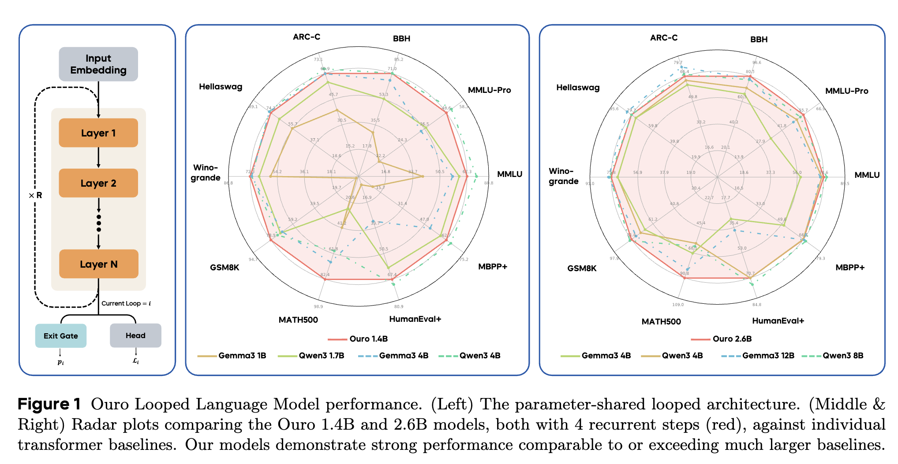
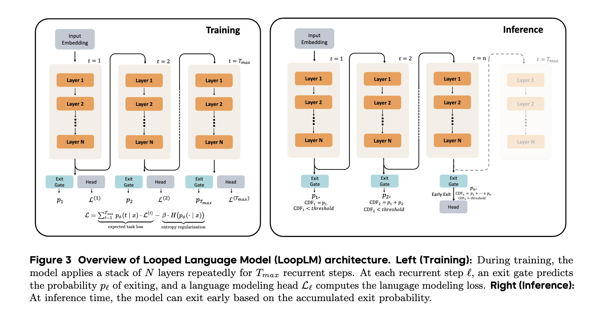
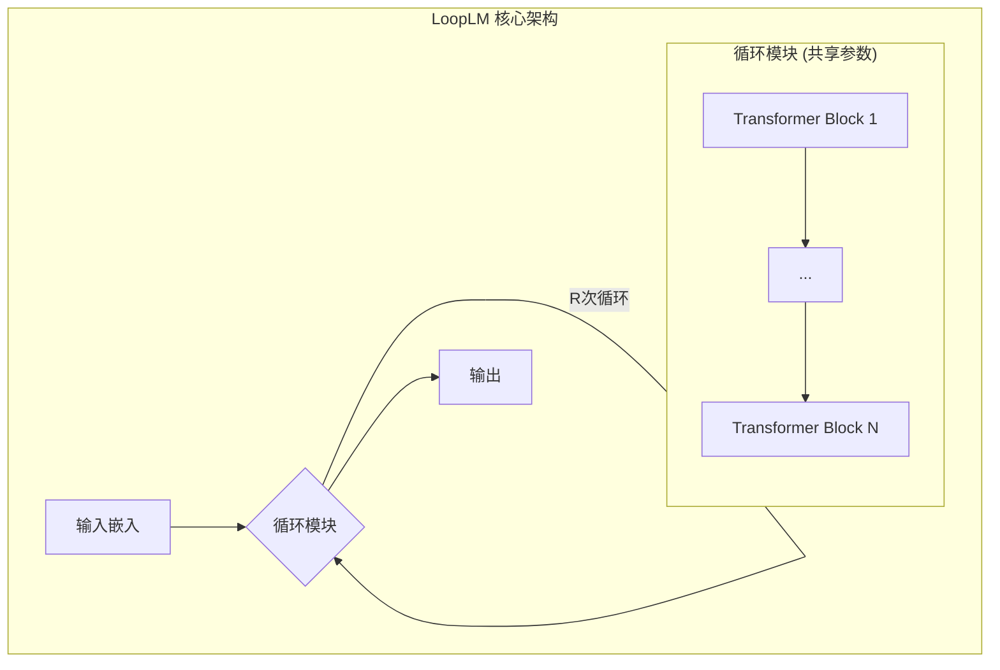

**论文地址**: [https://arxiv.org/pdf/2510.25741](https://arxiv.org/pdf/2510.25741)

---

# 深入解析 Ouro — 通过循环语言模型扩展潜在推理

## 引言 — 超越“大力出奇迹”

长期以来，我们见证了大型语言模型（LLM）通过不断扩大模型参数和训练数据量来实现能力飞跃的“暴力美学”。然而，这条道路正变得日益崎岖：
*   **成本高昂**：训练和部署数百亿参数的模型需要巨大的计算资源。
*   **数据瓶颈**：高质量的训练数据正变得稀缺。
*   **推理效率低**：思维链（CoT）等技术虽能提升复杂任务表现，却以增长输出序列为代价，增加了推理时间和上下文负担。

面对这些挑战，我们不禁要问：除了更大、更多，还有没有第三条路？

**《Scaling Latent Reasoning via Looped Language Models》**这篇论文给出了一个响亮的回答：**有！**

它介绍了 **Ouro**，一个开创性的循环语言模型（Looped Language Model, LoopLM）家族。Ouro的核心思想不再是将推理能力作为一种“事后补救”（如CoT），而是通过一种新颖的架构，**将迭代计算和推理能力直接构建到模型的预训练阶段**。这标志着一个潜在的范式转变：从单纯扩展模型规模，转向提升模型的计算效率和内在推理深度。

## Ouro 模型详解 — 什么是循环语言模型 (LoopLM)？

Ouro 的设计精髓在于“循环”二字。它借鉴了 Universal Transformer 的思想，通过参数共享和迭代计算，在有限的参数预算内实现深层次的计算。

### 1. 核心架构：参数共享与循环计算

想象一下，一个标准的 Transformer 模型是由许多层堆叠而成的。而 LoopLM 则不同，它只使用一小叠（例如24层）的 Transformer 模块，然后将输入数据**反复地**送入这个模块进行多次“循环”计算。

*   **参数共享**：所有循环步骤共用同一组模型权重。
*   **计算深度与参数解耦**：这意味着模型的**计算深度**（循环次数）不再与**参数数量**（模型大小）严格绑定。我们可以用一个较小的模型，通过增加循环次数来投入更多的计算，以解决复杂问题。

### 2. 自适应计算：“提前退出”门控机制

如果对所有输入都使用相同的循环次数，无疑是一种浪费。简单的任务可能一次循环就足够，而复杂的任务则需要“三思而后行”。Ouro 通过一个巧妙的**“提前退出”（Early Exit）门控机制**实现了这一点。

*   **工作原理**：在每个循环步骤结束时，一个小型神经网络（门控）会根据当前的隐藏状态，计算出一个“退出概率”。
*   **动态决策**：模型会累积这些概率。一旦累积概率超过一个预设的阈值（例如 0.9），模型就会停止循环并输出结果。
*   **效果**：简单的输入会提前退出，节省计算资源；复杂的输入则会自然地进行更多次循环，从而实现计算资源的动态按需分配。

### 3. 训练策略：如何教会模型“思考”？

让模型学会自适应地“思考”需要精心的训练策略。Ouro 采用了两阶段方法：

*   **第一阶段：熵正则化预训练**
    *   **问题**：如果只用标准的语言模型损失来训练，模型会倾向于“过度思考”，即总是使用最大循环次数，因为更深的计算通常会带来更低的损失，这会导致“提前退出”机制失效。
    *   **解决方案**：在损失函数中加入一个**熵正则化项**。这会惩罚模型将所有概率都集中在某一个退出步骤上的行为，鼓励它去探索不同的“思考深度”。从变分推断的角度看，这相当于让模型的退出策略去拟合一个均匀分布的先验，避免了深度偏见。

*   **第二阶段：专注的自适应门控训练**
    *   **目标**：在第一阶段的基础上，进一步优化门控的决策能力。
    *   **方法**：冻结主语言模型的参数，**只训练退出门控**。训练的目标是让门控学会判断“再多一次循环是否值得”。具体来说，门控会根据上一步到这一步的实际损失改善情况来决定是继续还是退出。
    *   **效果**：这个阶段让门控的决策与实际性能提升直接挂钩，变得更加“功利”和高效。

---

## 核心机制探秘 — Ouro 为何如此强大？

Ouro 的性能令人惊叹：1.4B 的模型能媲美甚至超越 4B 的标准模型，2.6B 的模型能挑战 8B 的对手。这背后强大的驱动力究竟是什么？是它记住了更多的知识，还是它更会利用知识？

论文通过一系列精巧的“物理实验”揭示了答案：**Ouro 的优势主要来源于卓越的知识操纵能力，而非更大的知识存储容量。**

### 实验一：知识容量测试 (Capo Task)

*   **任务**：让模型记忆大量合成的人物传记信息。
*   **发现**：在相同参数量下，LoopLM 和标准 Transformer 能够存储的知识量几乎完全相同（大约每参数 2 比特）。
*   **结论**：**循环计算并不会增加模型的原始知识存储空间。**

### 实验二：知识操纵测试 (Mano & Multi-hop QA)

*   **任务**：
    *   **Mano**：解决需要解析复杂树状结构的模运算问题。
    *   **Multi-hop QA**：回答需要组合多个事实才能得到答案的多跳问答题。
*   **发现**：在这些需要推理、组合、操纵知识的任务上，LoopLM 的表现远超同等参数量、甚至同等计算量（FLOPs）的标准模型。并且，它学习这些任务的**样本效率**也高得多。
*   **结论**：**LoopLM 的真正优势在于其强大的知识操纵和组合推理能力。**

**理论视角**：论文从理论上证明，LoopLM 的循环结构使其能够在参数化的知识图谱中进行高效的并行搜索，解决图可达性等问题的序贯计算步数呈对数级（O(log D)），远优于思维链的线性甚至平方级复杂度。

---

## 超越性能 — 安全性与忠实性

Ouro 不仅高效，还在两个关键的“软实力”上展现出独特的优势。

### 1. 安全性：越“思考”，越安全

*   **发现**：在 HEx-PHI 等安全性基准测试中，随着循环步数的增加，模型的有害内容输出率显著下降。即便是在超出训练深度的“外推”步骤中，这一趋势依然存在。
*   **洞察**：更多的迭代计算似乎能让模型更好地分辨和抑制有害意图。

### 2. 忠实性：真实的思考过程，而非“事后诸葛亮”

*   **问题**：思维链（CoT）的一大诟病是它可能只是“事后合理化”——模型可能先“猜”到答案，再生成一段看似合理的解释。
*   **Ouro的优势**：LoopLM 的潜在状态演化（h(1) → h(2) → ...）是其**真实**的思考轨迹。
*   **证据**：在处理模棱两可的问题时，Ouro 在不同循环步骤中得出的中间答案是会变化的，这表明模型正在积极地“修正”自己的想法，而不是在为第一个冒出的念头找补。

---

## 实践意义与总结

Ouro 的研究为大型语言模型的发展开辟了一条激动人心的新路径。

*   **第三扩展轴**：它确立了**迭代计算深度**作为模型参数和数据量之外的第三个关键扩展维度。
*   **内置推测解码**：不同循环步骤的输出天然构成了“草稿模型”和“验证模型”，无需额外训练即可用于推测解码，加速推理。
*   **随时生成 (Anytime Generation)**：用户可以根据延迟需求，选择从一个较早的循环步骤获取快速但质量稍逊的答案，或等待更深的循环完成以获得高质量的答案。

**总结而言，Ouro (LoopLM) 不仅仅是一个新模型，它代表了一种新的理念：通过在预训练中内置高效的、自适应的迭代推理，我们可以在参数和数据日益受限的未来，继续推动 AI 能力的边界。**