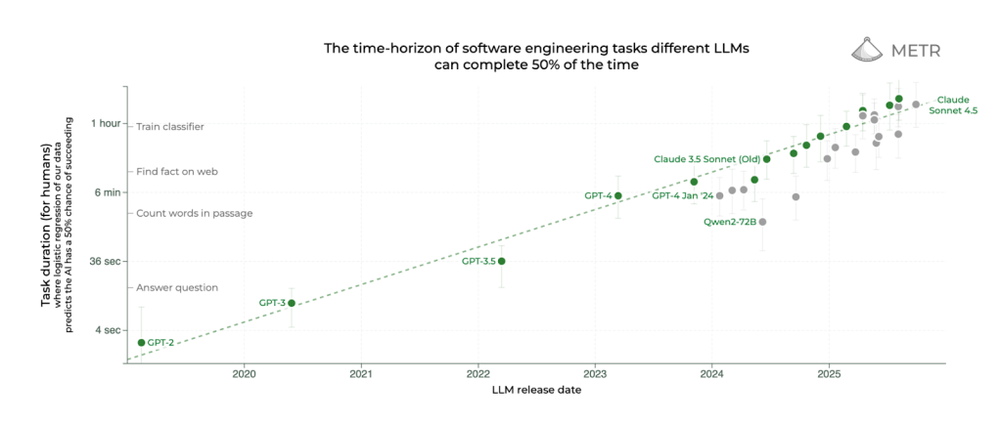
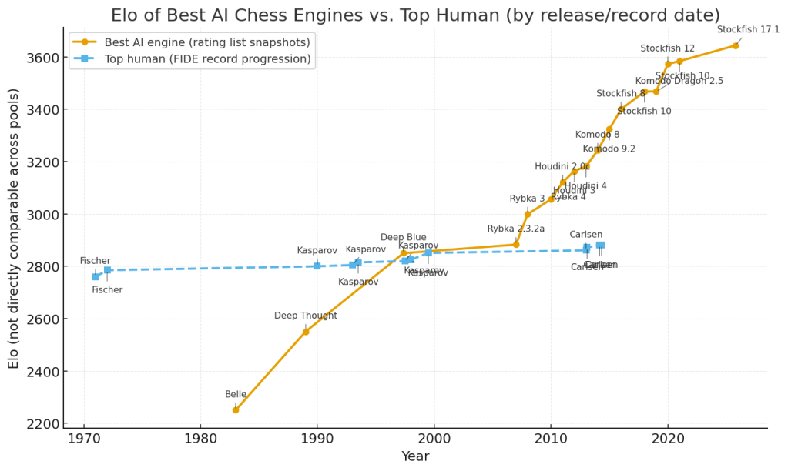
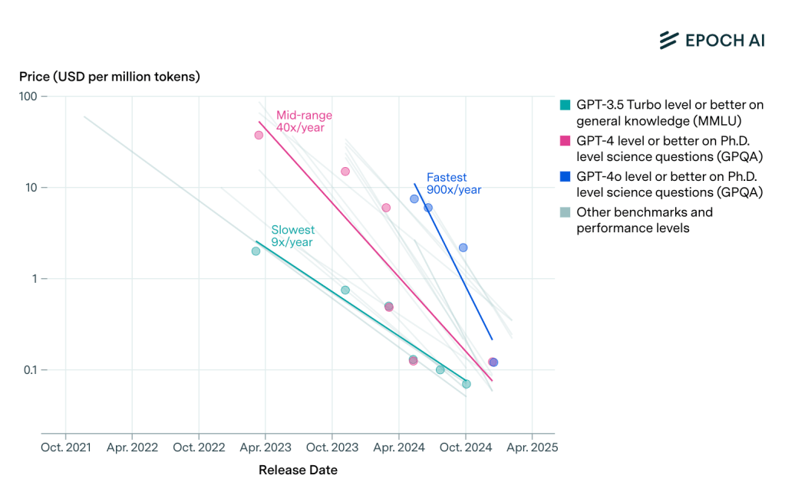
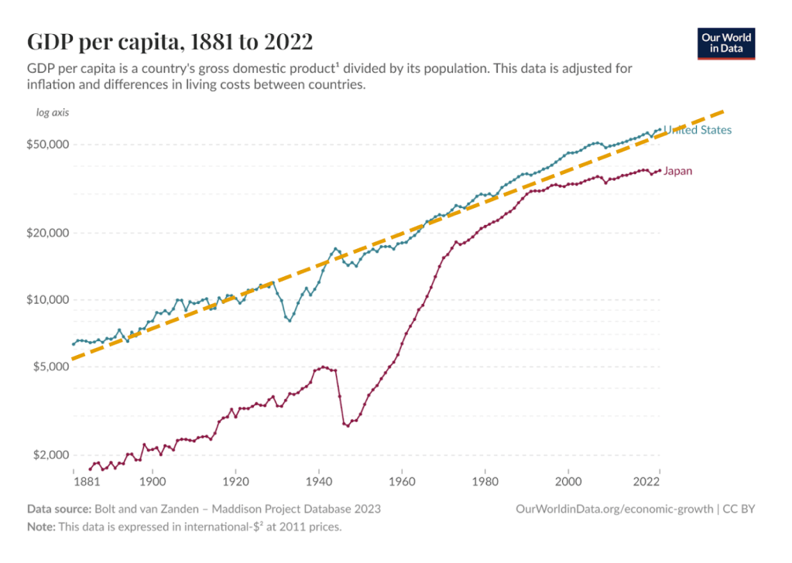
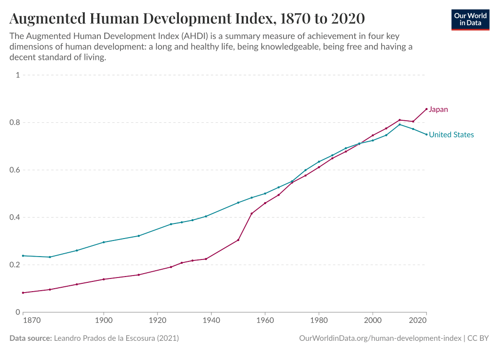
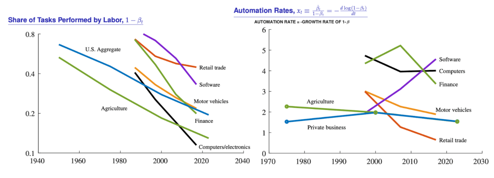
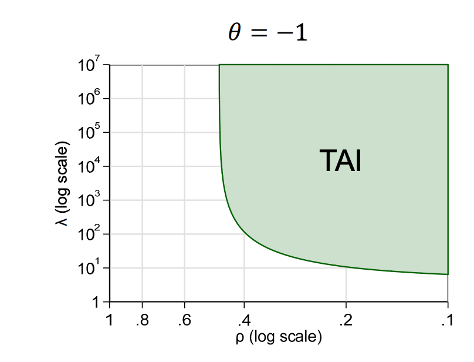
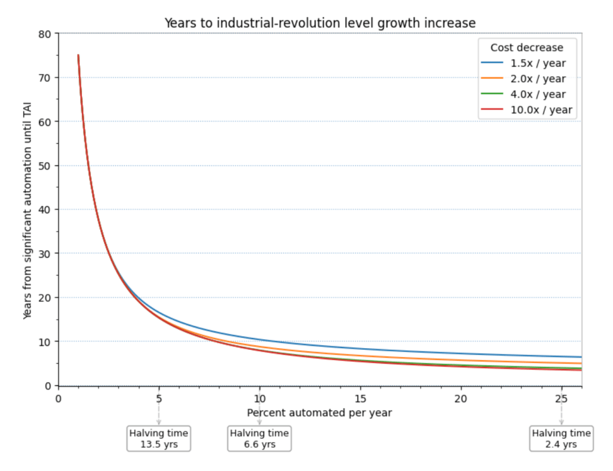

> 本文是对 Boaz Barak 发表在 [Windows On Theory](https://windowsontheory.org/2025/11/04/thoughts-by-a-non-economist-on-ai-and-economics/) 博客上的文章《Thoughts by a non-economist on AI and economics》的核心要点进行的分析与解读。

# AI经济影响沉思录：一个非经济学家的视角

这篇文章的核心，是探讨一个计算机科学家眼中的“AI经济奇点”——人工智能是否将打破过去150年来全球经济约2%的稳定增长率，引领我们进入一个前所未有的高速增长时代。作者Boaz Barak的论证，并非基于传统的经济学模型，而是建立在一个简单却极具颠覆性的观察上：**AI的能力正以惊人的指数速度增长。**

## 一、核心观察：AI能力的“摩尔定律”

文章的立论基础源于AI研究机构METR的一项惊人发现：**AI模型能够成功完成的任务复杂度，其“翻倍时间”大约为6-7个月。**

这意味着什么？假设今天最强的AI能独立完成一个需要人类2小时才能完成的软件工程任务，那么大约6个月后，新一代AI就能独立完成一个需要人类4小时的任务；一年后，则是8小时。

作者将此趋势类比为AI领域的“摩尔定律”。他敏锐地指出，我们不应过分纠结于AI当前能做什么（即图表中的“截距”），因为真实世界任务的“混乱性”会打折扣。我们真正应该关注的，是这个不可阻挡的、指数级的**增长“斜率”**。

这个斜率预示着，AI自动化任务的边界正在以指数方式扩张。

## 二、两大催化剂：S型曲线与成本雪崩

作者进一步指出了加速这一进程的两个关键因素：

1.  **能力S型曲线（Sigmoid Curve）**：研究表明，AI对某一难度任务的成功率呈现S型曲线。这意味着，一旦AI的能力跨过某个任务难度的“阈值”，其成功率会从接近0迅速跃升至接近100%。结合前述的指数级能力增长，这预示着AI将不断“吞噬”整个难度的任务，将其完全自动化。

> AI模型的能力极限（以“Time Horizon”衡量）正在随着模型的更新换代而稳步、快速地向更复杂的任务推进。

> 模型的进步是可见的： 比较同一系列的模型，比如 Claude 3.5 Sonnet (Old) (18分钟) -> Claude 3.5 Sonnet (New) (28分钟) -> Claude 3.7 Sonnet (59分钟)。你可以清楚地看到，新模型的S形曲线整体向右移动了。

> 向右移动意味着什么？ 曲线向右移动，意味着模型的 "Time Horizon" 变长了。也就是说，新模型能够处理的任务难度上限在不断提高。59分钟的任务显然比18分钟的任务要复杂得多。

> 跨模型比较： 我们可以比较不同公司的模型。例如，在这项特定测试中，Claude 3.7 Sonnet (59分钟) 的表现优于 o1-preview (39分钟)，而 o1-preview 又优于 GPT-4o (9分钟)。

*图3: 国际象棋模型的ELO等级分随时间的变化，展示了类似的平台期与指数增长阶段，可作为AI能力增长的类比。*

2.  **成本雪崩（Cost Collapse）**：同样重要的是，实现同等AI能力的成本正以每年超过10倍的速度下降。这意味着，一旦某项工作被AI掌握，其自动化成本将迅速趋近于零。这为AI的大规模经济应用扫清了最后的障碍。

## 三、终极问题：AI能否打破2%的“增长铁律”？

自工业革命以来，无论是电力、内燃机还是互联网，都未能改变美国GDP长达150年约2%的年均增长率。这是经济学中一个著名的现象。作者抛出了本文最核心的问题：**AI，会是那个例外吗？**

*图6: 美国和日本人均发展指数（AHDI）的变化，显示出其与GDP增长的松散相关性。*

作者认为，关键在于AI是否能突破“鲍莫尔成本病”的瓶颈——即人类劳动生产率的提升速度跟不上技术进步的速度，从而成为整个经济系统的“短板”。

## 四、增长的引擎：AI如何驱动经济

作者从两个角度阐述了AI驱动增长的可能路径：

1.  **“虚拟劳动力”注入**：可以将AI视为向经济体中注入了海量的、能力持续进化的“虚拟员工”。如果这些“虚拟员工”的数量和质量（即能完成任务的广度与深度）都以指数速度增长，其对GDP的贡献将是爆炸性的。

2.  **思想生产的加速器**：根据现代“内生增长理论”，经济增长的根本驱动力是“思想”或“创新”的产生。AI如果能加速科学研究、技术发明等创造性过程，它就不是简单替代劳动，而是在加速整个经济增长引擎本身。

## 五、关键变量：ρ (rho) 与 λ (lambda)

为了更严谨地探讨这个问题，作者引入了经济学家B. Jones的模型，其中生产率的提升由两个关键变量决定：

*   **λ (lambda)**：AI在**可被自动化**任务上的生产力倍数。随着技术进步，λ可以被认为是无限增长的。
*   **ρ (rho)**：经济中**无法被自动化**的任务所占的比例。

这个模型最残酷的结论在于，整体生产率的提升受制于这两个变量的“调和平均数”。这意味着，**无法被自动化的任务（ρ）是整个系统的最终瓶颈**。即使AI的生产力（λ）达到无穷大，如果仍有10%的任务无法被自动化（ρ=0.1），那么整体的生产率增益上限仅为10倍。

## 六、结论：决定未来的终极一问

至此，全文的逻辑链条汇于一点。作者认为，关于AI是否会带来史无前例的经济增长，最终归结为一个问题：

> **AI能力指数级的提升，是否会同步带来“不可自动化任务”（ρ）占比的指数级下降？**

如果答案是“是”，那么我们正处在一个经济“奇点”的前夜。AI将不仅仅是另一个通用技术，而是会像工业革命一样，彻底重塑人类的生产函数，开启一个GDP增长率远超2%的新纪元。

如果答案是“否”，那么AI的巨大潜力仍将被人类自身或其他物理世界的限制所束缚，其经济影响虽大，但可能不会超出历史的范畴。

作者的这篇文章，为我们提供了一个来自技术前沿的、极具洞察力的分析框架。它告诉我们，未来经济的形态，可能不取决于传统的资本或劳动，而取决于一个我们今天才刚刚开始理解的变量——**智能本身的可扩展性**。

---

## 延伸阅读：核心参考文献

为了更深入地理解本文的论点，以下是原文中引用的一些核心资源：

- **METR 的关键研究**：
    - [测量AI完成长任务的能力](https://metr.org/blog/2025-03-19-measuring-ai-ability-to-complete-long-tasks/)：本文立论的基础，展示了AI能力的指数增长。
    - [METR 论文 (arXiv)](https://arxiv.org/abs/2503.14499)：上述研究的详细学术论文。
- **经济学家的AI增长预测**：
    - [Acemoglu 的分析](https://shapingwork.mit.edu/wp-content/uploads/2024/05/Acemoglu_Macroeconomics-of-AI_May-2024.pdf)：代表了对AI经济影响较为保守的估计。
    - [高盛的报告](https://www.goldmansachs.com/insights/articles/generative-ai-could-raise-global-gdp-by-7-percent)：代表了较为乐观的估计。
- **关键经济模型与数据**：
    - [B. Jones 的自动化与增长模型](https://www.kellogg.northwestern.edu/faculty/jones-ben/htm/Artificial_Intelligence_in_Research_and_Development.pdf)：解释了“不可自动化任务”瓶颈的核心论文。
    - [内生增长理论手册](https://web.stanford.edu/~chadj/JonesHandbook2005.pdf)：理解“思想生产”如何驱动经济增长的经典理论。
    - [Epoch AI 的数据](https://epoch.ai/data-insights/llm-inference-price-trends)：关于AI推理成本下降的数据来源。
- **原文跨平台发布**：
    - [LessWrong 上的讨论帖](https://www.lesswrong.com/posts/QQAWu7D6TceHwqhjm/thoughts-by-a-non-economist-on-ai-and-economics)：可以找到更多关于此话题的深度讨论。